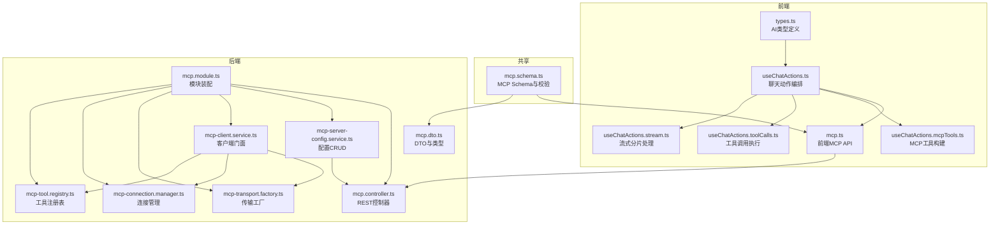
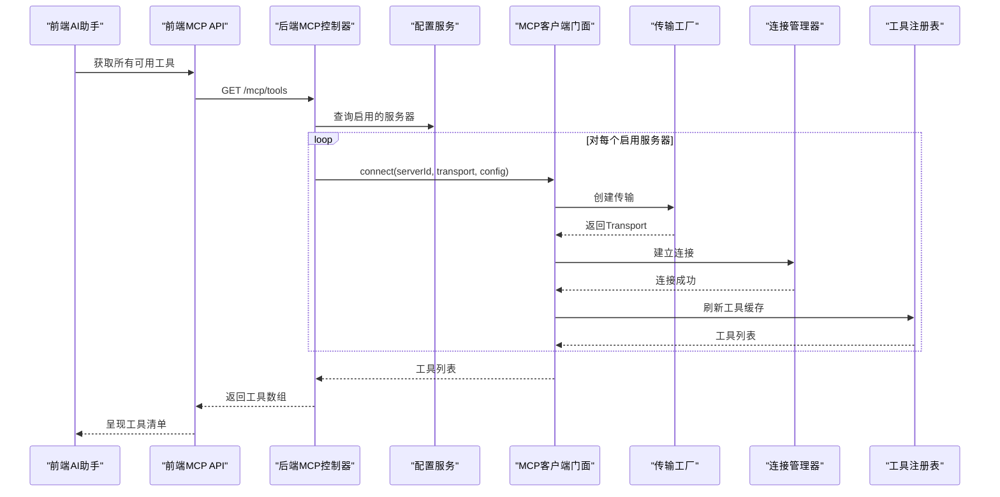
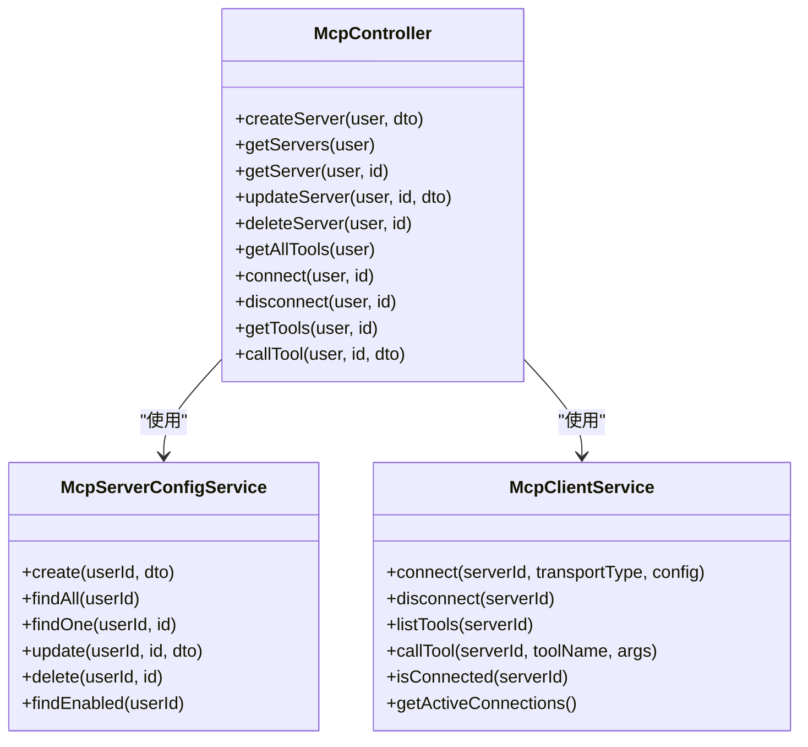
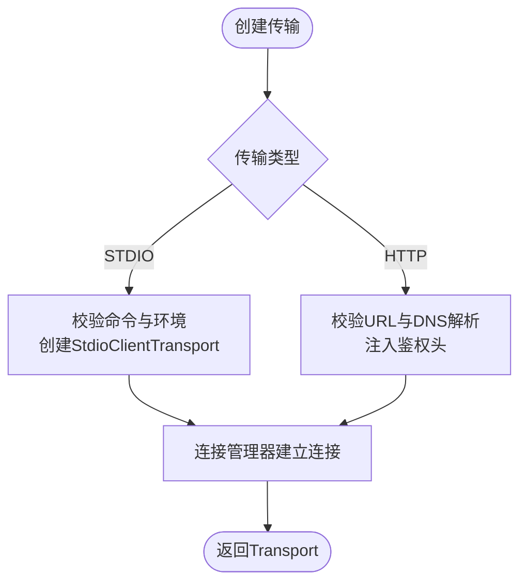
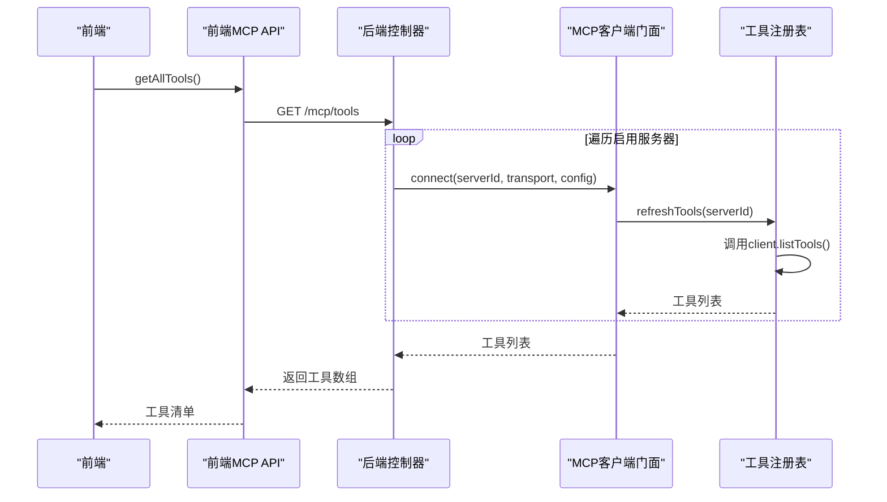
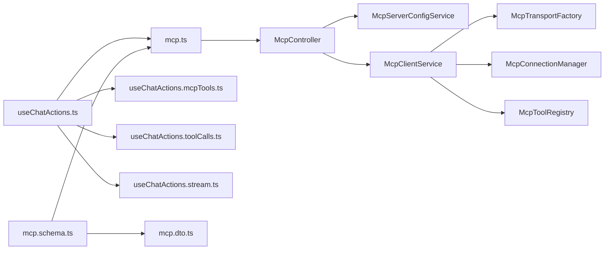

# AI与MCP集成

<cite>
**本文引用的文件**
- [apps/backend/src/mcp/mcp.module.ts](file://apps/backend/src/mcp/mcp.module.ts)
- [apps/backend/src/mcp/mcp.controller.ts](file://apps/backend/src/mcp/mcp.controller.ts)
- [apps/backend/src/mcp/mcp-client.service.ts](file://apps/backend/src/mcp/mcp-client.service.ts)
- [apps/backend/src/mcp/mcp-server-config.service.ts](file://apps/backend/src/mcp/mcp-server-config.service.ts)
- [apps/backend/src/mcp/core/mcp-connection.manager.ts](file://apps/backend/src/mcp/core/mcp-connection.manager.ts)
- [apps/backend/src/mcp/core/mcp-tool.registry.ts](file://apps/backend/src/mcp/core/mcp-tool.registry.ts)
- [apps/backend/src/mcp/core/mcp-transport.factory.ts](file://apps/backend/src/mcp/core/mcp-transport.factory.ts)
- [apps/backend/src/mcp/mcp.dto.ts](file://apps/backend/src/mcp/mcp.dto.ts)
- [apps/frontend/src/features/mcp/api/mcp.ts](file://apps/frontend/src/features/mcp/api/mcp.ts)
- [apps/frontend/src/features/ai/composables/useChatActions.ts](file://apps/frontend/src/features/ai/composables/useChatActions.ts)
- [apps/frontend/src/features/ai/composables/useChatActions.mcpTools.ts](file://apps/frontend/src/features/ai/composables/useChatActions.mcpTools.ts)
- [apps/frontend/src/features/ai/composables/useChatActions.toolCalls.ts](file://apps/frontend/src/features/ai/composables/useChatActions.toolCalls.ts)
- [apps/frontend/src/features/ai/composables/useChatActions.stream.ts](file://apps/frontend/src/features/ai/composables/useChatActions.stream.ts)
- [apps/frontend/src/features/ai/services/types.ts](file://apps/frontend/src/features/ai/services/types.ts)
- [packages/shared/src/schemas/mcp.schema.ts](file://packages/shared/src/schemas/mcp.schema.ts)
</cite>

## 目录
1. [简介](#简介)
2. [项目结构](#项目结构)
3. [核心组件](#核心组件)
4. [架构总览](#架构总览)
5. [详细组件分析](#详细组件分析)
6. [依赖关系分析](#依赖关系分析)
7. [性能考量](#性能考量)
8. [故障排查指南](#故障排查指南)
9. [结论](#结论)
10. [附录](#附录)

## 简介
本文件面向Lumina AI与MCP（Model Context Protocol）集成系统，系统性阐述MCP协议在后端的实现方式、连接管理、工具注册机制；前端AI助手的功能架构、对话管理、记忆存储、预设配置；以及工具调用、上下文压缩、参数调整、流式响应处理、多模态输入输出、规则与安全限制、成本控制策略、MCP服务器配置、工具开发规范、调试与扩展指南。

## 项目结构
该系统采用前后端分离的模块化设计：
- 后端NestJS应用提供MCP服务器配置、连接、工具发现与调用能力，并通过REST接口暴露给前端。
- 前端Vue应用负责AI助手交互、对话管理、记忆与预设、工具调用编排、流式响应解析与渲染。
- 共享包提供MCP协议数据结构与校验Schema，确保前后端一致的数据契约。



**图表来源**
- [apps/frontend/src/features/mcp/api/mcp.ts:1-108](file://apps/frontend/src/features/mcp/api/mcp.ts#L1-L108)
- [apps/frontend/src/features/ai/composables/useChatActions.ts:1-492](file://apps/frontend/src/features/ai/composables/useChatActions.ts#L1-L492)
- [apps/frontend/src/features/ai/composables/useChatActions.mcpTools.ts:1-50](file://apps/frontend/src/features/ai/composables/useChatActions.mcpTools.ts#L1-L50)
- [apps/frontend/src/features/ai/composables/useChatActions.toolCalls.ts:1-164](file://apps/frontend/src/features/ai/composables/useChatActions.toolCalls.ts#L1-L164)
- [apps/frontend/src/features/ai/composables/useChatActions.stream.ts:1-269](file://apps/frontend/src/features/ai/composables/useChatActions.stream.ts#L1-L269)
- [apps/frontend/src/features/ai/services/types.ts:1-232](file://apps/frontend/src/features/ai/services/types.ts#L1-L232)
- [apps/backend/src/mcp/mcp.module.ts:1-25](file://apps/backend/src/mcp/mcp.module.ts#L1-L25)
- [apps/backend/src/mcp/mcp.controller.ts:1-198](file://apps/backend/src/mcp/mcp.controller.ts#L1-L198)
- [apps/backend/src/mcp/mcp-client.service.ts:1-124](file://apps/backend/src/mcp/mcp-client.service.ts#L1-L124)
- [apps/backend/src/mcp/mcp-server-config.service.ts:1-156](file://apps/backend/src/mcp/mcp-server-config.service.ts#L1-L156)
- [apps/backend/src/mcp/core/mcp-connection.manager.ts:1-220](file://apps/backend/src/mcp/core/mcp-transport.factory.ts#L1-L220)
- [apps/backend/src/mcp/core/mcp-transport.factory.ts:1-220](file://apps/backend/src/mcp/core/mcp-transport.factory.ts#L1-L220)
- [apps/backend/src/mcp/core/mcp-tool.registry.ts:1-48](file://apps/backend/src/mcp/core/mcp-tool.registry.ts#L1-L48)
- [apps/backend/src/mcp/mcp.dto.ts:1-59](file://apps/backend/src/mcp/mcp.dto.ts#L1-L59)
- [packages/shared/src/schemas/mcp.schema.ts:1-220](file://packages/shared/src/schemas/mcp.schema.ts#L1-L220)

**章节来源**
- [apps/backend/src/mcp/mcp.module.ts:1-25](file://apps/backend/src/mcp/mcp.module.ts#L1-L25)
- [apps/backend/src/mcp/mcp.controller.ts:1-198](file://apps/backend/src/mcp/mcp.controller.ts#L1-L198)
- [apps/backend/src/mcp/mcp-client.service.ts:1-124](file://apps/backend/src/mcp/mcp-client.service.ts#L1-L124)
- [apps/backend/src/mcp/mcp-server-config.service.ts:1-156](file://apps/backend/src/mcp/mcp-server-config.service.ts#L1-L156)
- [apps/backend/src/mcp/core/mcp-connection.manager.ts:1-101](file://apps/backend/src/mcp/core/mcp-connection.manager.ts#L1-L101)
- [apps/backend/src/mcp/core/mcp-tool.registry.ts:1-48](file://apps/backend/src/mcp/core/mcp-tool.registry.ts#L1-L48)
- [apps/backend/src/mcp/core/mcp-transport.factory.ts:1-220](file://apps/backend/src/mcp/core/mcp-transport.factory.ts#L1-L220)
- [apps/backend/src/mcp/mcp.dto.ts:1-59](file://apps/backend/src/mcp/mcp.dto.ts#L1-L59)
- [apps/frontend/src/features/mcp/api/mcp.ts:1-108](file://apps/frontend/src/features/mcp/api/mcp.ts#L1-L108)
- [apps/frontend/src/features/ai/composables/useChatActions.ts:1-492](file://apps/frontend/src/features/ai/composables/useChatActions.ts#L1-L492)
- [apps/frontend/src/features/ai/composables/useChatActions.mcpTools.ts:1-50](file://apps/frontend/src/features/ai/composables/useChatActions.mcpTools.ts#L1-L50)
- [apps/frontend/src/features/ai/composables/useChatActions.toolCalls.ts:1-164](file://apps/frontend/src/features/ai/composables/useChatActions.toolCalls.ts#L1-L164)
- [apps/frontend/src/features/ai/composables/useChatActions.stream.ts:1-269](file://apps/frontend/src/features/ai/composables/useChatActions.stream.ts#L1-L269)
- [apps/frontend/src/features/ai/services/types.ts:1-232](file://apps/frontend/src/features/ai/services/types.ts#L1-L232)
- [packages/shared/src/schemas/mcp.schema.ts:1-220](file://packages/shared/src/schemas/mcp.schema.ts#L1-L220)

## 核心组件
- 后端MCP模块：提供REST控制器、配置服务、客户端门面、传输工厂、连接管理器、工具注册表。
- 前端MCP API：封装后端REST接口，支持服务器管理、工具列表与调用、连接/断开。
- 前端聊天动作编排：负责对话流程、上下文压缩、工具构建与调用、流式响应处理、记忆与预设。
- 共享Schema：统一MCP传输类型、配置、工具与调用结果的类型与校验。

**章节来源**
- [apps/backend/src/mcp/mcp.module.ts:1-25](file://apps/backend/src/mcp/mcp.module.ts#L1-L25)
- [apps/frontend/src/features/mcp/api/mcp.ts:1-108](file://apps/frontend/src/features/mcp/api/mcp.ts#L1-L108)
- [apps/frontend/src/features/ai/composables/useChatActions.ts:1-492](file://apps/frontend/src/features/ai/composables/useChatActions.ts#L1-L492)
- [packages/shared/src/schemas/mcp.schema.ts:1-220](file://packages/shared/src/schemas/mcp.schema.ts#L1-L220)

## 架构总览
系统以“前端驱动+后端适配”的方式工作：
- 前端根据用户配置与技能库动态构建工具集合（含MCP工具），并通过流式接口接收AI回复。
- 后端负责MCP连接生命周期管理、工具注册缓存、传输安全与鉴权注入。
- 共享Schema确保前后端对MCP协议数据的一致理解。



**图表来源**
- [apps/frontend/src/features/mcp/api/mcp.ts:103-106](file://apps/frontend/src/features/mcp/api/mcp.ts#L103-L106)
- [apps/backend/src/mcp/mcp.controller.ts:108-129](file://apps/backend/src/mcp/mcp.controller.ts#L108-L129)
- [apps/backend/src/mcp/mcp-client.service.ts:33-47](file://apps/backend/src/mcp/mcp-client.service.ts#L33-L47)
- [apps/backend/src/mcp/core/mcp-transport.factory.ts:112-126](file://apps/backend/src/mcp/core/mcp-transport.factory.ts#L112-L126)
- [apps/backend/src/mcp/core/mcp-connection.manager.ts:23-73](file://apps/backend/src/mcp/core/mcp-connection.manager.ts#L23-L73)
- [apps/backend/src/mcp/core/mcp-tool.registry.ts:20-42](file://apps/backend/src/mcp/core/mcp-tool.registry.ts#L20-L42)

## 详细组件分析

### 后端MCP模块与控制器
- 模块装配：导出配置服务与客户端门面，便于前端直接使用。
- 控制器职责：
  - 服务器配置CRUD（创建、查询、更新、删除）
  - 服务器连接/断开
  - 工具发现与调用
  - 权限校验（JWT + 所有权）



**图表来源**
- [apps/backend/src/mcp/mcp.controller.ts:1-198](file://apps/backend/src/mcp/mcp.controller.ts#L1-L198)
- [apps/backend/src/mcp/mcp-server-config.service.ts:1-156](file://apps/backend/src/mcp/mcp-server-config.service.ts#L1-L156)
- [apps/backend/src/mcp/mcp-client.service.ts:1-124](file://apps/backend/src/mcp/mcp-client.service.ts#L1-L124)

**章节来源**
- [apps/backend/src/mcp/mcp.module.ts:1-25](file://apps/backend/src/mcp/mcp.module.ts#L1-L25)
- [apps/backend/src/mcp/mcp.controller.ts:1-198](file://apps/backend/src/mcp/mcp.controller.ts#L1-L198)
- [apps/backend/src/mcp/mcp-server-config.service.ts:1-156](file://apps/backend/src/mcp/mcp-server-config.service.ts#L1-L156)
- [apps/backend/src/mcp/mcp-client.service.ts:1-124](file://apps/backend/src/mcp/mcp-client.service.ts#L1-L124)

### 连接管理与传输工厂
- 连接管理器：
  - 维护serverId到Client/Transport的映射
  - 生命周期：connect/destroy/close
  - 标准错误与关闭事件日志
- 传输工厂：
  - 支持STDIO与HTTP两种传输
  - 安全限制：禁止本地/内网主机、仅允许公共HTTP(S)、可选白名单命令
  - HTTP传输支持鉴权头注入（Bearer/OAuth/API Key）



**图表来源**
- [apps/backend/src/mcp/core/mcp-transport.factory.ts:112-126](file://apps/backend/src/mcp/core/mcp-transport.factory.ts#L112-L126)
- [apps/backend/src/mcp/core/mcp-transport.factory.ts:128-188](file://apps/backend/src/mcp/core/mcp-transport.factory.ts#L128-L188)
- [apps/backend/src/mcp/core/mcp-transport.factory.ts:190-218](file://apps/backend/src/mcp/core/mcp-transport.factory.ts#L190-L218)
- [apps/backend/src/mcp/core/mcp-connection.manager.ts:23-73](file://apps/backend/src/mcp/core/mcp-connection.manager.ts#L23-L73)

**章节来源**
- [apps/backend/src/mcp/core/mcp-connection.manager.ts:1-101](file://apps/backend/src/mcp/core/mcp-connection.manager.ts#L1-L101)
- [apps/backend/src/mcp/core/mcp-transport.factory.ts:1-220](file://apps/backend/src/mcp/core/mcp-transport.factory.ts#L1-L220)

### 工具注册与发现
- 工具注册表：
  - 缓存每个serverId的工具列表
  - 首次访问或刷新时调用SDK的listTools
- 前端工具构建：
  - 将MCP工具转换为AI可用的函数工具
  - 生成稳定的AI工具名并建立查找映射



**图表来源**
- [apps/frontend/src/features/mcp/api/mcp.ts:103-106](file://apps/frontend/src/features/mcp/api/mcp.ts#L103-L106)
- [apps/backend/src/mcp/mcp.controller.ts:108-129](file://apps/backend/src/mcp/mcp.controller.ts#L108-L129)
- [apps/backend/src/mcp/mcp-client.service.ts:42-47](file://apps/backend/src/mcp/mcp-client.service.ts#L42-L47)
- [apps/backend/src/mcp/core/mcp-tool.registry.ts:20-42](file://apps/backend/src/mcp/core/mcp-tool.registry.ts#L20-L42)
- [apps/frontend/src/features/ai/composables/useChatActions.mcpTools.ts:26-49](file://apps/frontend/src/features/ai/composables/useChatActions.mcpTools.ts#L26-L49)

**章节来源**
- [apps/backend/src/mcp/core/mcp-tool.registry.ts:1-48](file://apps/backend/src/mcp/core/mcp-tool.registry.ts#L1-L48)
- [apps/frontend/src/features/ai/composables/useChatActions.mcpTools.ts:1-50](file://apps/frontend/src/features/ai/composables/useChatActions.mcpTools.ts#L1-L50)

### 工具调用与流式响应
- 前端聊天动作：
  - 构建上下文压缩后的消息
  - 合并MCP工具与技能运行时工具
  - 发起流式请求，分片处理与最终落盘
  - 若出现工具调用，二次回传执行结果
- 工具调用执行：
  - 本地工具优先（如内置技能读取）
  - 否则调用后端MCP工具API
  - 结果截断保护，避免超长文本
- 流式分片处理：
  - [DONE]完成，[ABORTED]中止
  - 结构化块解析、教学/待办动作提取与记忆存储

```mermaid
flowchart TD
S(["开始发送消息"]) --> Ctx["上下文压缩"]
Ctx --> Tools["合并MCP与技能工具"]
Tools --> Stream["发起流式请求"]
Stream --> Chunk{"分片到达？"}
Chunk --> |是| Append["追加到当前AI响应"]
Append --> Chunk
Chunk --> |否且为[DONE]| Finalize["解析结构化块/教学/待办<br/>写入会话与记忆"]
Chunk --> |否且为[ABORTED]| Abort["标记中止并落盘"]
Finalize --> ToolCalls{"是否有工具调用？"}
Abort --> End(["结束"])
ToolCalls --> |是| Exec["执行工具调用"]
Exec --> Retry["二次回传并递归发送"]
ToolCalls --> |否| End
```

**图表来源**
- [apps/frontend/src/features/ai/composables/useChatActions.ts:228-357](file://apps/frontend/src/features/ai/composables/useChatActions.ts#L228-L357)
- [apps/frontend/src/features/ai/composables/useChatActions.stream.ts:202-269](file://apps/frontend/src/features/ai/composables/useChatActions.stream.ts#L202-L269)
- [apps/frontend/src/features/ai/composables/useChatActions.toolCalls.ts:25-164](file://apps/frontend/src/features/ai/composables/useChatActions.toolCalls.ts#L25-L164)

**章节来源**
- [apps/frontend/src/features/ai/composables/useChatActions.ts:1-492](file://apps/frontend/src/features/ai/composables/useChatActions.ts#L1-L492)
- [apps/frontend/src/features/ai/composables/useChatActions.stream.ts:1-269](file://apps/frontend/src/features/ai/composables/useChatActions.stream.ts#L1-L269)
- [apps/frontend/src/features/ai/composables/useChatActions.toolCalls.ts:1-164](file://apps/frontend/src/features/ai/composables/useChatActions.toolCalls.ts#L1-L164)

### 前端MCP API与类型
- 前端MCP API：
  - 提供服务器管理、工具列表、工具调用、连接/断开
  - 设置合理超时时间以适配冷启动与重载
- 类型定义：
  - ChatMessage、Tool、ToolCall、ToolResult、AIRequestOptions、多模态内容等
  - 技能运行时类型（HTTP/MCP）与可用性检查

**章节来源**
- [apps/frontend/src/features/mcp/api/mcp.ts:1-108](file://apps/frontend/src/features/mcp/api/mcp.ts#L1-L108)
- [apps/frontend/src/features/ai/services/types.ts:1-232](file://apps/frontend/src/features/ai/services/types.ts#L1-L232)

## 依赖关系分析
- 模块耦合：
  - 控制器依赖配置服务与客户端门面
  - 客户端门面依赖传输工厂、连接管理器、工具注册表
- 外部依赖：
  - Model Context Protocol SDK（Client/Transport）
  - NestJS（控制器、服务、拦截器、过滤器）
  - Prisma（数据库访问）
- 数据契约：
  - 共享Schema统一MCP传输类型、配置、工具与调用结果



**图表来源**
- [apps/backend/src/mcp/mcp.controller.ts:1-198](file://apps/backend/src/mcp/mcp.controller.ts#L1-L198)
- [apps/backend/src/mcp/mcp-client.service.ts:1-124](file://apps/backend/src/mcp/mcp-client.service.ts#L1-L124)
- [apps/backend/src/mcp/core/mcp-transport.factory.ts:1-220](file://apps/backend/src/mcp/core/mcp-transport.factory.ts#L1-L220)
- [apps/backend/src/mcp/core/mcp-connection.manager.ts:1-101](file://apps/backend/src/mcp/core/mcp-connection.manager.ts#L1-L101)
- [apps/backend/src/mcp/core/mcp-tool.registry.ts:1-48](file://apps/backend/src/mcp/core/mcp-tool.registry.ts#L1-L48)
- [apps/frontend/src/features/mcp/api/mcp.ts:1-108](file://apps/frontend/src/features/mcp/api/mcp.ts#L1-L108)
- [apps/frontend/src/features/ai/composables/useChatActions.ts:1-492](file://apps/frontend/src/features/ai/composables/useChatActions.ts#L1-L492)
- [apps/frontend/src/features/ai/composables/useChatActions.mcpTools.ts:1-50](file://apps/frontend/src/features/ai/composables/useChatActions.mcpTools.ts#L1-L50)
- [apps/frontend/src/features/ai/composables/useChatActions.toolCalls.ts:1-164](file://apps/frontend/src/features/ai/composables/useChatActions.toolCalls.ts#L1-L164)
- [apps/frontend/src/features/ai/composables/useChatActions.stream.ts:1-269](file://apps/frontend/src/features/ai/composables/useChatActions.stream.ts#L1-L269)
- [packages/shared/src/schemas/mcp.schema.ts:1-220](file://packages/shared/src/schemas/mcp.schema.ts#L1-L220)

**章节来源**
- [apps/backend/src/mcp/mcp.module.ts:1-25](file://apps/backend/src/mcp/mcp.module.ts#L1-L25)
- [apps/backend/src/mcp/mcp.dto.ts:1-59](file://apps/backend/src/mcp/mcp.dto.ts#L1-L59)

## 性能考量
- 连接复用与懒加载：仅在需要时连接服务器，减少资源占用。
- 工具缓存：注册表缓存工具列表，降低重复查询成本。
- 传输安全与超时：HTTP/S传输与STDIO白名单控制，合理设置超时避免阻塞。
- 流式处理：前端分片累积与最终解析，避免一次性大块内存压力。
- 结果截断：工具调用结果长度限制，防止超长文本影响性能与稳定性。

[本节为通用指导，无需特定文件引用]

## 故障排查指南
- 连接失败
  - 检查传输类型与配置是否匹配
  - 确认HTTP URL可解析且非私有/环回地址
  - STDIO命令是否在白名单内
- 工具不可用
  - 确认服务器已连接且工具列表可获取
  - 检查工具名是否正确（前端生成的AI工具名需与后端一致）
- 超时与中断
  - 前端调用设置合理超时（连接300s，工具60s）
  - 观察后端日志中的stderr与onclose事件
- 权限与鉴权
  - JWT校验与所有权校验
  - HTTP传输的鉴权头是否正确注入

**章节来源**
- [apps/backend/src/mcp/core/mcp-transport.factory.ts:91-110](file://apps/backend/src/mcp/core/mcp-transport.factory.ts#L91-L110)
- [apps/backend/src/mcp/core/mcp-transport.factory.ts:128-188](file://apps/backend/src/mcp/core/mcp-transport.factory.ts#L128-L188)
- [apps/backend/src/mcp/core/mcp-connection.manager.ts:44-58](file://apps/backend/src/mcp/core/mcp-connection.manager.ts#L44-L58)
- [apps/frontend/src/features/mcp/api/mcp.ts:60-84](file://apps/frontend/src/features/mcp/api/mcp.ts#L60-L84)
- [apps/backend/src/mcp/mcp.controller.ts:137-155](file://apps/backend/src/mcp/mcp.controller.ts#L137-L155)

## 结论
本系统通过清晰的模块边界与共享Schema，实现了MCP协议在Lumina中的稳定集成。后端提供安全可控的连接与工具管理，前端以流式与工具编排为核心，支撑多模态、教学与待办等高级能力。通过合理的安全限制、缓存与超时策略，系统在易用性与可靠性之间取得平衡。

[本节为总结，无需特定文件引用]

## 附录

### MCP服务器配置与工具开发规范
- 服务器配置
  - 名称、描述、传输类型（STDIO/HTTP）、配置对象、启用状态
  - 传输与配置必须匹配
- STDIO
  - 命令不允许包含空格（需拆分为args）
  - 生产环境需配置允许命令白名单
- HTTP
  - 仅允许公共HTTP(S)地址
  - 支持Bearer/OAuth/API Key鉴权，自动注入头部
- 工具开发
  - 工具名与输入Schema需与SDK一致
  - 建议为工具提供清晰描述与输入约束

**章节来源**
- [packages/shared/src/schemas/mcp.schema.ts:79-118](file://packages/shared/src/schemas/mcp.schema.ts#L79-L118)
- [apps/backend/src/mcp/core/mcp-transport.factory.ts:128-188](file://apps/backend/src/mcp/core/mcp-transport.factory.ts#L128-L188)
- [apps/backend/src/mcp/core/mcp-transport.factory.ts:190-218](file://apps/backend/src/mcp/core/mcp-transport.factory.ts#L190-L218)

### AI规则配置、安全限制与成本控制
- 安全限制
  - 本地/环回地址禁用，DNS解析校验
  - STDIO命令白名单与生产环境强制配置
- 成本控制
  - 工具调用超时与结果截断，避免长时间等待与超大数据
  - 连接懒加载与缓存，减少不必要的网络与计算
- 规则与合规
  - 传输与配置一致性校验
  - 工具调用结果标准化（content数组）

**章节来源**
- [apps/backend/src/mcp/core/mcp-transport.factory.ts:13-51](file://apps/backend/src/mcp/core/mcp-transport.factory.ts#L13-L51)
- [apps/backend/src/mcp/core/mcp-transport.factory.ts:67-89](file://apps/backend/src/mcp/core/mcp-transport.factory.ts#L67-L89)
- [apps/frontend/src/features/ai/composables/useChatActions.toolCalls.ts:17-23](file://apps/frontend/src/features/ai/composables/useChatActions.toolCalls.ts#L17-L23)

### 调试工具使用
- 后端日志
  - 连接建立、错误与关闭事件
  - STDIO stderr输出
- 前端
  - 分片处理与最终落盘
  - 中止信号与异常提示

**章节来源**
- [apps/backend/src/mcp/core/mcp-connection.manager.ts:44-58](file://apps/backend/src/mcp/core/mcp-connection.manager.ts#L44-L58)
- [apps/frontend/src/features/ai/composables/useChatActions.stream.ts:222-269](file://apps/frontend/src/features/ai/composables/useChatActions.stream.ts#L222-L269)

### AI功能扩展指南
- 新增MCP服务器
  - 在前端MCP设置界面添加新服务器
  - 后端控制器将自动进行连接与工具发现
- 自定义工具
  - 在MCP服务器侧实现工具，前端通过getAllTools自动发现
- 技能运行时
  - 支持HTTP与MCP两种运行时，结合可用性检查与鉴权令牌

**章节来源**
- [apps/frontend/src/features/mcp/api/mcp.ts:1-108](file://apps/frontend/src/features/mcp/api/mcp.ts#L1-L108)
- [apps/frontend/src/features/ai/composables/useChatActions.ts:270-308](file://apps/frontend/src/features/ai/composables/useChatActions.ts#L270-L308)