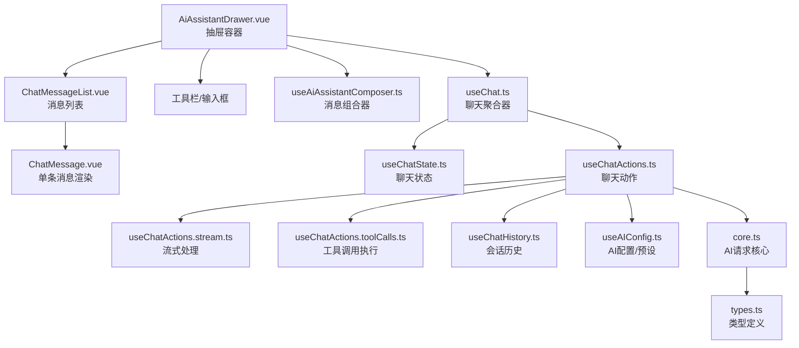
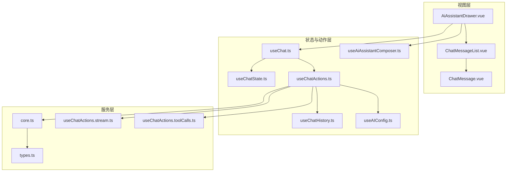
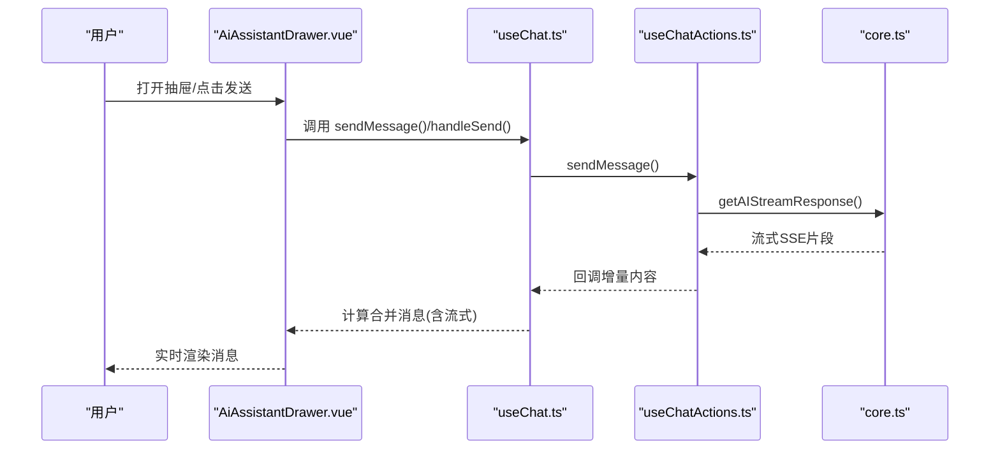
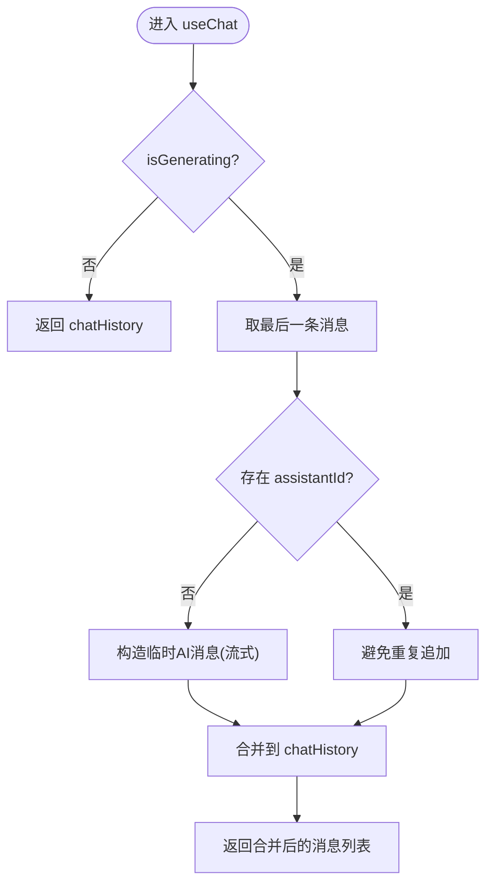
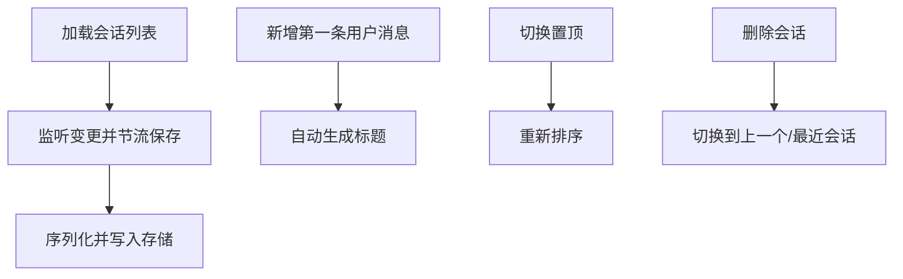
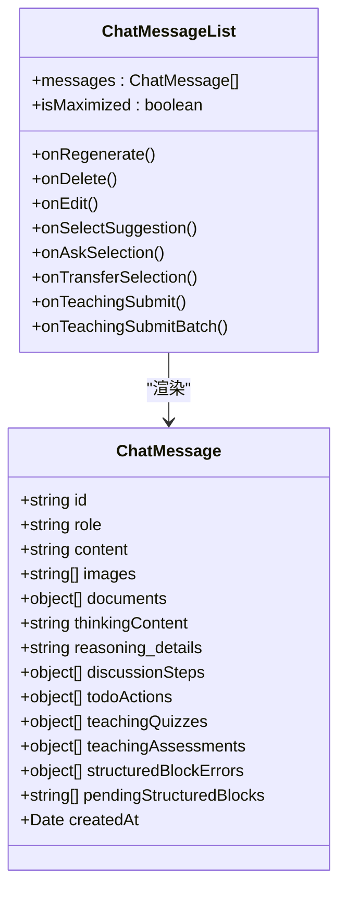
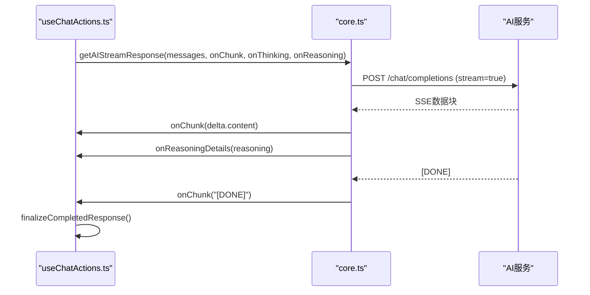
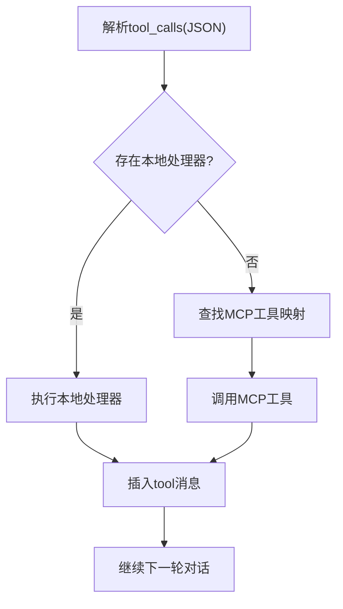
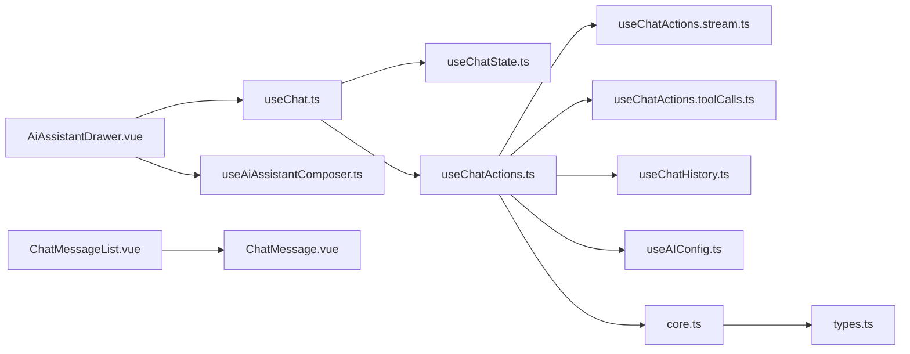

# AI助手功能

<cite>
**本文档引用的文件**
- [AiAssistantDrawer.vue](file://apps/frontend/src/features/ai/components/AiAssistantDrawer.vue)
- [useChat.ts](file://apps/frontend/src/features/ai/composables/useChat.ts)
- [useChatState.ts](file://apps/frontend/src/features/ai/composables/useChatState.ts)
- [useChatActions.ts](file://apps/frontend/src/features/ai/composables/useChatActions.ts)
- [useChatHistory.ts](file://apps/frontend/src/features/ai/composables/useChatHistory.ts)
- [useAiAssistantComposer.ts](file://apps/frontend/src/features/ai/composables/useAiAssistantComposer.ts)
- [useAIConfig.ts](file://apps/frontend/src/features/ai/composables/useAIConfig.ts)
- [ChatMessageList.vue](file://apps/frontend/src/features/ai/components/ChatMessageList.vue)
- [ChatMessage.vue](file://apps/frontend/src/features/ai/components/ChatMessage.vue)
- [core.ts](file://apps/frontend/src/features/ai/services/core.ts)
- [types.ts](file://apps/frontend/src/features/ai/services/types.ts)
- [useChatActions.stream.ts](file://apps/frontend/src/features/ai/composables/useChatActions.stream.ts)
- [useChatActions.toolCalls.ts](file://apps/frontend/src/features/ai/composables/useChatActions.toolCalls.ts)
</cite>

## 目录
1. [简介](#简介)
2. [项目结构](#项目结构)
3. [核心组件](#核心组件)
4. [架构总览](#架构总览)
5. [详细组件分析](#详细组件分析)
6. [依赖关系分析](#依赖关系分析)
7. [性能考虑](#性能考虑)
8. [故障排除指南](#故障排除指南)
9. [结论](#结论)
10. [附录](#附录)

## 简介
本文件为“AI助手功能”的技术文档，聚焦于抽屉式AI助手的架构设计、对话界面实现与消息渲染机制，系统化阐述聊天状态管理、消息历史存储、实时交互逻辑；解释AI服务集成、流式响应处理、多模态输入支持；覆盖对话管理器实现、消息编辑功能、附件处理机制；提供AI助手配置选项、主题定制、键盘快捷键；说明消息发送流程、错误处理与网络异常恢复策略，并给出用户体验优化、性能监控与调试工具使用建议。

## 项目结构
AI助手功能位于前端应用的AI特性域内，采用“组件 + 组合式函数 + 服务层”的分层架构：
- 抽屉容器组件负责布局、面板控制与快捷键绑定
- 组合式函数封装状态、动作与业务逻辑
- 服务层负责与AI后端通信、流式解析与工具调用执行
- 类型定义统一约束数据结构与接口契约

图表来源
- [AiAssistantDrawer.vue:1-348](file://apps/frontend/src/features/ai/components/AiAssistantDrawer.vue#L1-L348)
- [ChatMessageList.vue:1-489](file://apps/frontend/src/features/ai/components/ChatMessageList.vue#L1-L489)
- [ChatMessage.vue:1-394](file://apps/frontend/src/features/ai/components/ChatMessage.vue#L1-L394)
- [useAiAssistantComposer.ts:1-113](file://apps/frontend/src/features/ai/composables/useAiAssistantComposer.ts#L1-L113)
- [useChat.ts:1-119](file://apps/frontend/src/features/ai/composables/useChat.ts#L1-L119)
- [useChatState.ts:1-144](file://apps/frontend/src/features/ai/composables/useChatState.ts#L1-L144)
- [useChatActions.ts:1-492](file://apps/frontend/src/features/ai/composables/useChatActions.ts#L1-L492)
- [useChatActions.stream.ts:1-269](file://apps/frontend/src/features/ai/composables/useChatActions.stream.ts#L1-L269)
- [useChatActions.toolCalls.ts:1-164](file://apps/frontend/src/features/ai/composables/useChatActions.toolCalls.ts#L1-L164)
- [useChatHistory.ts:1-479](file://apps/frontend/src/features/ai/composables/useChatHistory.ts#L1-L479)
- [useAIConfig.ts:1-800](file://apps/frontend/src/features/ai/composables/useAIConfig.ts#L1-L800)
- [core.ts:1-442](file://apps/frontend/src/features/ai/services/core.ts#L1-L442)
- [types.ts:1-232](file://apps/frontend/src/features/ai/services/types.ts#L1-L232)

章节来源
- [AiAssistantDrawer.vue:1-348](file://apps/frontend/src/features/ai/components/AiAssistantDrawer.vue#L1-L348)
- [useChat.ts:1-119](file://apps/frontend/src/features/ai/composables/useChat.ts#L1-L119)
- [useChatState.ts:1-144](file://apps/frontend/src/features/ai/composables/useChatState.ts#L1-L144)
- [useChatActions.ts:1-492](file://apps/frontend/src/features/ai/composables/useChatActions.ts#L1-L492)
- [useChatHistory.ts:1-479](file://apps/frontend/src/features/ai/composables/useChatHistory.ts#L1-L479)
- [useAiAssistantComposer.ts:1-113](file://apps/frontend/src/features/ai/composables/useAiAssistantComposer.ts#L1-L113)
- [useAIConfig.ts:1-800](file://apps/frontend/src/features/ai/composables/useAIConfig.ts#L1-L800)
- [ChatMessageList.vue:1-489](file://apps/frontend/src/features/ai/components/ChatMessageList.vue#L1-L489)
- [ChatMessage.vue:1-394](file://apps/frontend/src/features/ai/components/ChatMessage.vue#L1-L394)
- [core.ts:1-442](file://apps/frontend/src/features/ai/services/core.ts#L1-L442)
- [types.ts:1-232](file://apps/frontend/src/features/ai/services/types.ts#L1-L232)
- [useChatActions.stream.ts:1-269](file://apps/frontend/src/features/ai/composables/useChatActions.stream.ts#L1-L269)
- [useChatActions.toolCalls.ts:1-164](file://apps/frontend/src/features/ai/composables/useChatActions.toolCalls.ts#L1-L164)

## 核心组件
- 抽屉容器组件：负责布局、面板开关、快捷键、设置与历史面板挂载时机、尺寸与移动端适配
- 聊天聚合器：协调状态与动作，合并流式响应，暴露消息列表与操作方法
- 聊天状态：维护当前会话、流式响应缓冲、生成/加载状态、错误与重试计数
- 聊天动作：封装发送消息、停止生成、清空历史、重发/编辑消息、工具调用执行、图像生成等
- 会话历史：持久化存储、标题自动生成、上下文摘要、置顶与删除
- AI配置与预设：统一管理基础配置、思考模式、讨论模式、技能集合、MCP能力等
- 消息列表与消息渲染：虚拟滚动、智能滚动、流式渲染、结构化块与待处理项提示
- 服务层：构建请求、处理SSE流、解析推理细节、中断请求、工具调用执行

章节来源
- [AiAssistantDrawer.vue:1-348](file://apps/frontend/src/features/ai/components/AiAssistantDrawer.vue#L1-L348)
- [useChat.ts:1-119](file://apps/frontend/src/features/ai/composables/useChat.ts#L1-L119)
- [useChatState.ts:1-144](file://apps/frontend/src/features/ai/composables/useChatState.ts#L1-L144)
- [useChatActions.ts:1-492](file://apps/frontend/src/features/ai/composables/useChatActions.ts#L1-L492)
- [useChatHistory.ts:1-479](file://apps/frontend/src/features/ai/composables/useChatHistory.ts#L1-L479)
- [useAIConfig.ts:1-800](file://apps/frontend/src/features/ai/composables/useAIConfig.ts#L1-L800)
- [ChatMessageList.vue:1-489](file://apps/frontend/src/features/ai/components/ChatMessageList.vue#L1-L489)
- [ChatMessage.vue:1-394](file://apps/frontend/src/features/ai/components/ChatMessage.vue#L1-L394)
- [core.ts:1-442](file://apps/frontend/src/features/ai/services/core.ts#L1-L442)

## 架构总览
AI助手采用“容器组件 + 组合式函数 + 服务层”三层架构，通过组合式函数解耦状态与动作，服务层统一处理AI请求与流式解析，组件层专注UI与交互体验。

图表来源
- [AiAssistantDrawer.vue:1-348](file://apps/frontend/src/features/ai/components/AiAssistantDrawer.vue#L1-L348)
- [ChatMessageList.vue:1-489](file://apps/frontend/src/features/ai/components/ChatMessageList.vue#L1-L489)
- [ChatMessage.vue:1-394](file://apps/frontend/src/features/ai/components/ChatMessage.vue#L1-L394)
- [useChat.ts:1-119](file://apps/frontend/src/features/ai/composables/useChat.ts#L1-L119)
- [useChatState.ts:1-144](file://apps/frontend/src/features/ai/composables/useChatState.ts#L1-L144)
- [useChatActions.ts:1-492](file://apps/frontend/src/features/ai/composables/useChatActions.ts#L1-L492)
- [useChatHistory.ts:1-479](file://apps/frontend/src/features/ai/composables/useChatHistory.ts#L1-L479)
- [useAIConfig.ts:1-800](file://apps/frontend/src/features/ai/composables/useAIConfig.ts#L1-L800)
- [useAiAssistantComposer.ts:1-113](file://apps/frontend/src/features/ai/composables/useAiAssistantComposer.ts#L1-L113)
- [core.ts:1-442](file://apps/frontend/src/features/ai/services/core.ts#L1-L442)
- [types.ts:1-232](file://apps/frontend/src/features/ai/services/types.ts#L1-L232)
- [useChatActions.stream.ts:1-269](file://apps/frontend/src/features/ai/composables/useChatActions.stream.ts#L1-L269)
- [useChatActions.toolCalls.ts:1-164](file://apps/frontend/src/features/ai/composables/useChatActions.toolCalls.ts#L1-L164)

## 详细组件分析

### 抽屉容器与面板控制
- 布局与尺寸：支持默认宽度、最小/最大宽度、全屏最大化；与Todo Store联动控制最大化状态
- 面板挂载策略：设置与历史面板采用惰性挂载，首次打开时才初始化
- 快捷键：Command/Ctrl+J 新建对话（若无历史或抽屉未打开则强制打开）
- 附件与输入：统一由组合器处理输入、粘贴、文件上传与发送
- 历史切换：在生成中可中断生成并切换会话

图表来源
- [AiAssistantDrawer.vue:1-348](file://apps/frontend/src/features/ai/components/AiAssistantDrawer.vue#L1-L348)
- [useChat.ts:1-119](file://apps/frontend/src/features/ai/composables/useChat.ts#L1-L119)
- [useChatActions.ts:1-492](file://apps/frontend/src/features/ai/composables/useChatActions.ts#L1-L492)
- [core.ts:1-442](file://apps/frontend/src/features/ai/services/core.ts#L1-L442)

章节来源
- [AiAssistantDrawer.vue:1-348](file://apps/frontend/src/features/ai/components/AiAssistantDrawer.vue#L1-L348)
- [useAiAssistantComposer.ts:1-113](file://apps/frontend/src/features/ai/composables/useAiAssistantComposer.ts#L1-L113)

### 聊天状态管理与消息合并
- 状态集中：聊天历史、流式响应缓冲、思考内容、推理细节、讨论步骤、待处理的Todo动作与结构化块
- 合并策略：当处于生成状态时，将当前流式响应作为“正在生成”的AI消息附加到历史末尾，避免重复
- 教学模式：支持教学问答与评估结果的回显与快照
- 错误与重试：保留错误信息与重试计数，支持有限次数自动重试

图表来源
- [useChat.ts:1-119](file://apps/frontend/src/features/ai/composables/useChat.ts#L1-L119)
- [useChatState.ts:1-144](file://apps/frontend/src/features/ai/composables/useChatState.ts#L1-L144)

章节来源
- [useChat.ts:1-119](file://apps/frontend/src/features/ai/composables/useChat.ts#L1-L119)
- [useChatState.ts:1-144](file://apps/frontend/src/features/ai/composables/useChatState.ts#L1-L144)

### 会话历史存储与标题生成
- 存储范围：使用作用域化的本地存储，避免跨用户污染
- 节流保存：批量变更通过节流减少写入频率
- 标题策略：第一条用户消息出现时自动截取内容作为标题，手动重命名后关闭自动标题
- 上下文摘要：支持为会话维护上下文摘要及其生效消息ID
- 置顶排序：置顶会话优先显示，其余按更新时间倒序

图表来源
- [useChatHistory.ts:1-479](file://apps/frontend/src/features/ai/composables/useChatHistory.ts#L1-L479)

章节来源
- [useChatHistory.ts:1-479](file://apps/frontend/src/features/ai/composables/useChatHistory.ts#L1-L479)

### 消息渲染与交互
- 消息列表：支持虚拟窗口化渲染、智能滚动、会话切换动画、加载更多
- 单条消息：区分用户/AI/工具消息；AI消息支持思考过程、结构化块警告、教学问答面板、Todo可视化预览
- 编辑与操作：用户消息支持就地编辑；AI消息支持重发、删除、复制、分享等操作
- 多媒体：图片预览、Markdown渲染、代码交互注入

图表来源
- [ChatMessage.vue:1-394](file://apps/frontend/src/features/ai/components/ChatMessage.vue#L1-L394)
- [ChatMessageList.vue:1-489](file://apps/frontend/src/features/ai/components/ChatMessageList.vue#L1-L489)
- [types.ts:170-190](file://apps/frontend/src/features/ai/services/types.ts#L170-L190)

章节来源
- [ChatMessage.vue:1-394](file://apps/frontend/src/features/ai/components/ChatMessage.vue#L1-L394)
- [ChatMessageList.vue:1-489](file://apps/frontend/src/features/ai/components/ChatMessageList.vue#L1-L489)
- [types.ts:170-190](file://apps/frontend/src/features/ai/services/types.ts#L170-L190)

### AI服务集成与流式响应
- 请求构建：注入系统提示、上下文摘要、技能与运行时、工具与推理参数
- 流式解析：逐行读取SSE，解析choices.delta，累积content与tool_calls，解析推理细节
- 结束处理：统一触发最终消息落盘、记忆抽取、状态复位
- 中断控制：AbortController统一管理中断，支持外部信号

图表来源
- [useChatActions.ts:1-492](file://apps/frontend/src/features/ai/composables/useChatActions.ts#L1-L492)
- [core.ts:115-338](file://apps/frontend/src/features/ai/services/core.ts#L115-L338)

章节来源
- [core.ts:115-338](file://apps/frontend/src/features/ai/services/core.ts#L115-L338)
- [useChatActions.stream.ts:1-269](file://apps/frontend/src/features/ai/composables/useChatActions.stream.ts#L1-L269)

### 工具调用与多模态输入
- 工具调用：解析tool_calls，优先本地处理器，否则通过MCP调用，结果以tool角色消息插入历史
- 多模态输入：支持文本、图片URL/本地图片、解析后的文档内容
- 教学模式：支持单/多选、简答等题型，批量化提交与评估反馈

图表来源
- [useChatActions.toolCalls.ts:1-164](file://apps/frontend/src/features/ai/composables/useChatActions.toolCalls.ts#L1-L164)
- [useChatActions.ts:343-356](file://apps/frontend/src/features/ai/composables/useChatActions.ts#L343-L356)

章节来源
- [useChatActions.toolCalls.ts:1-164](file://apps/frontend/src/features/ai/composables/useChatActions.toolCalls.ts#L1-L164)
- [useChatActions.ts:343-356](file://apps/frontend/src/features/ai/composables/useChatActions.ts#L343-L356)

### 配置与主题、快捷键
- 配置项：基础URL/API Key/模型、温度、系统提示、思考模式/努力级别、Todo助手、讨论模式、MCP开关、上下文压缩、技能集合等
- 预设管理：持久化预设、匹配检测、活动预设切换
- 主题与外观：通过CSS变量与渐变背景实现主题一致性
- 快捷键：Command/Ctrl+J 新建对话（需满足条件）

章节来源
- [useAIConfig.ts:18-800](file://apps/frontend/src/features/ai/composables/useAIConfig.ts#L18-L800)
- [AiAssistantDrawer.vue:169-182](file://apps/frontend/src/features/ai/components/AiAssistantDrawer.vue#L169-L182)

## 依赖关系分析

图表来源
- [AiAssistantDrawer.vue:1-348](file://apps/frontend/src/features/ai/components/AiAssistantDrawer.vue#L1-L348)
- [useChat.ts:1-119](file://apps/frontend/src/features/ai/composables/useChat.ts#L1-L119)
- [useChatActions.ts:1-492](file://apps/frontend/src/features/ai/composables/useChatActions.ts#L1-L492)
- [useChatActions.stream.ts:1-269](file://apps/frontend/src/features/ai/composables/useChatActions.stream.ts#L1-L269)
- [useChatActions.toolCalls.ts:1-164](file://apps/frontend/src/features/ai/composables/useChatActions.toolCalls.ts#L1-L164)
- [useChatHistory.ts:1-479](file://apps/frontend/src/features/ai/composables/useChatHistory.ts#L1-L479)
- [useAIConfig.ts:1-800](file://apps/frontend/src/features/ai/composables/useAIConfig.ts#L1-L800)
- [core.ts:1-442](file://apps/frontend/src/features/ai/services/core.ts#L1-L442)
- [types.ts:1-232](file://apps/frontend/src/features/ai/services/types.ts#L1-L232)
- [ChatMessageList.vue:1-489](file://apps/frontend/src/features/ai/components/ChatMessageList.vue#L1-L489)
- [ChatMessage.vue:1-394](file://apps/frontend/src/features/ai/components/ChatMessage.vue#L1-L394)

章节来源
- [AiAssistantDrawer.vue:1-348](file://apps/frontend/src/features/ai/components/AiAssistantDrawer.vue#L1-L348)
- [useChat.ts:1-119](file://apps/frontend/src/features/ai/composables/useChat.ts#L1-L119)
- [useChatActions.ts:1-492](file://apps/frontend/src/features/ai/composables/useChatActions.ts#L1-L492)
- [core.ts:1-442](file://apps/frontend/src/features/ai/services/core.ts#L1-L442)

## 性能考虑
- 虚拟滚动与窗口化渲染：消息列表采用窗口化渲染与滚动锚点，避免长历史导致的DOM压力
- 智能滚动：根据流式状态与用户滚动位置决定滚动策略，减少不必要的重排
- 存储节流：会话历史变更通过节流保存，降低频繁写入对主线程的影响
- 流式解析：SSE按行解析，增量更新，避免一次性大对象解析
- 工具结果截断：超过阈值自动截断，防止超大数据影响渲染与传输
- 重试与中断：有限次数重试与AbortController中断，避免长时间阻塞

## 故障排除指南
- 网络异常与中断
  - 现象：请求失败、流中断、显示“已中断”
  - 排查：检查AbortController状态、网络状态、CORS与代理配置
  - 处理：调用中断函数、等待自动重试、检查错误信息
- 图像生成功能
  - 现象：图像生成失败或提示不支持
  - 排查：确认模型是否支持图像生成、API Key与URL配置
  - 处理：切换到支持图像生成的模型或关闭图像生成模式
- 工具调用失败
  - 现象：工具返回错误或找不到工具
  - 排查：核对工具名、MCP服务器配置与权限
  - 处理：修正工具名、启用MCP、补充密钥
- 存储配额不足
  - 现象：无法保存会话历史
  - 排查：检查本地存储空间
  - 处理：清理旧会话、减少消息长度与图片数量

章节来源
- [core.ts:327-337](file://apps/frontend/src/features/ai/services/core.ts#L327-L337)
- [useChatActions.ts:358-371](file://apps/frontend/src/features/ai/composables/useChatActions.ts#L358-L371)
- [useChatActions.toolCalls.ts:118-162](file://apps/frontend/src/features/ai/composables/useChatActions.toolCalls.ts#L118-L162)
- [useChatHistory.ts:174-197](file://apps/frontend/src/features/ai/composables/useChatHistory.ts#L174-L197)

## 结论
该AI助手功能通过清晰的分层架构实现了高可用的对话体验：容器组件负责交互与布局，组合式函数统一状态与动作，服务层抽象AI请求与流式解析，类型系统保障数据一致性。系统支持流式响应、工具调用、多模态输入、教学模式与结构化块，具备完善的错误处理与性能优化策略，适合在复杂场景下稳定运行。

## 附录
- 调试建议
  - 使用浏览器开发者工具观察SSE连接与请求头
  - 在控制台打印会话ID与消息变更，定位渲染问题
  - 切换思考模式与讨论模式验证不同分支逻辑
- 性能监控
  - 监控消息渲染耗时、滚动锚点命中率、存储写入频率
  - 关注工具调用耗时与结果大小，必要时调整截断阈值
- 用户体验优化
  - 提供“返回底部”按钮与智能滚动，提升长对话体验
  - 在流式阶段提供骨架屏与占位提示，增强感知
  - 支持移动端自适应与手势操作