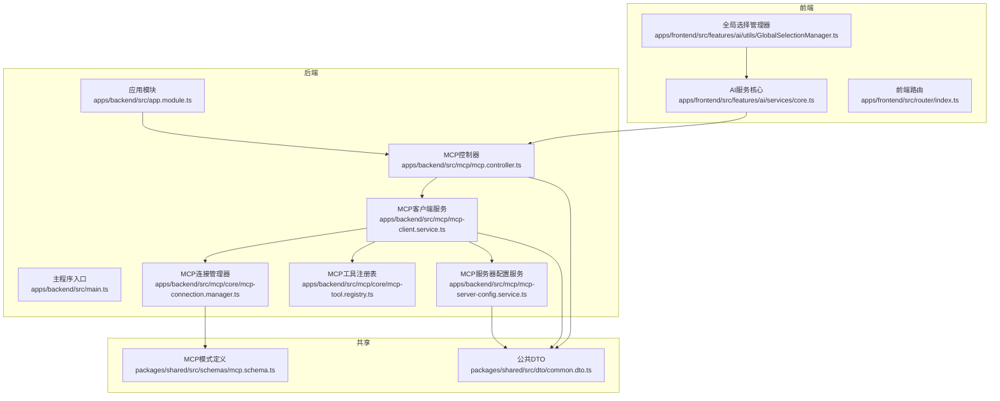
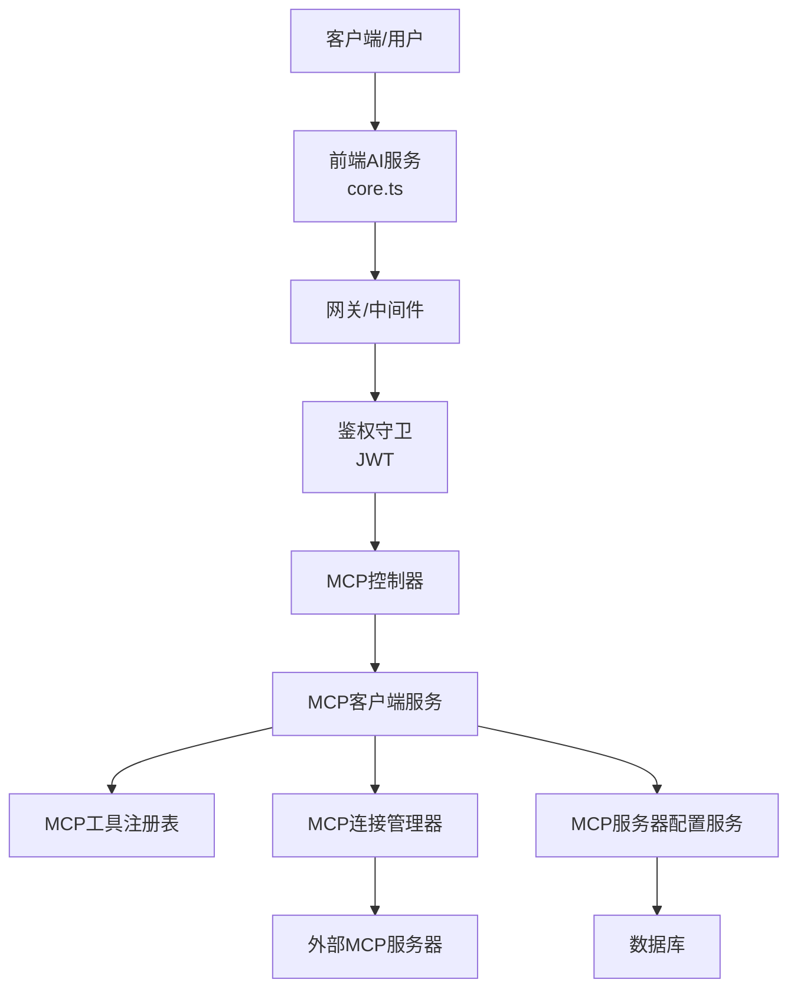
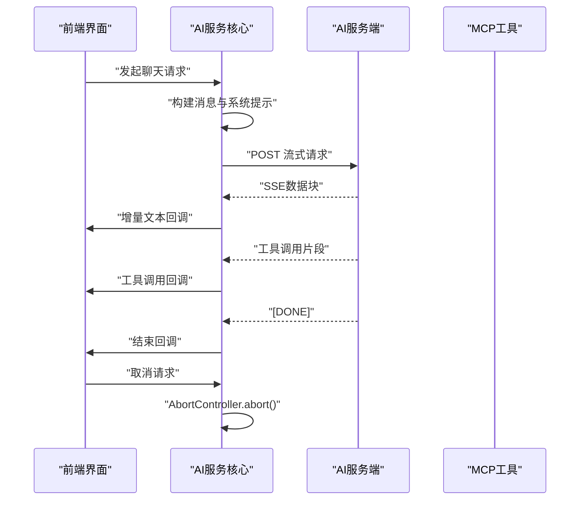
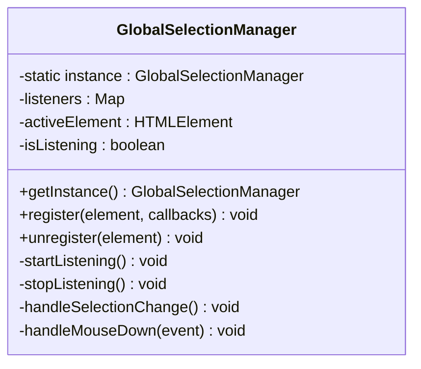
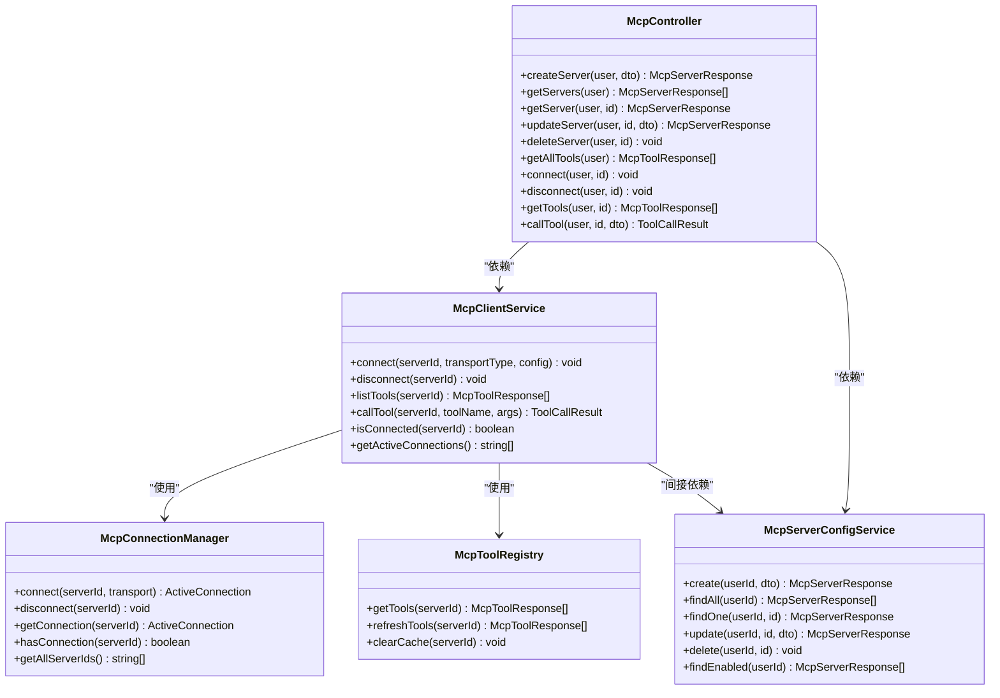
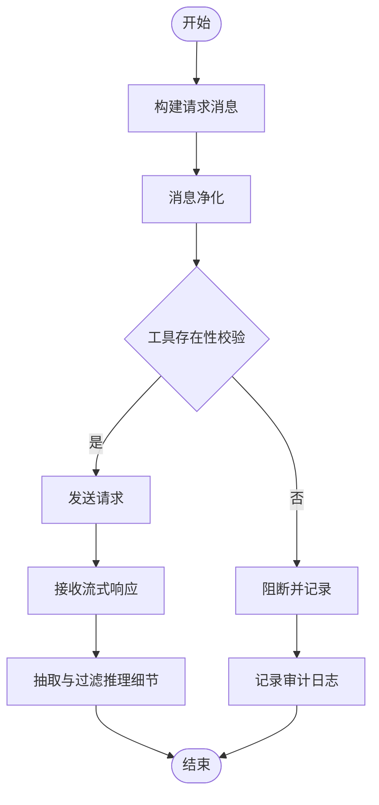
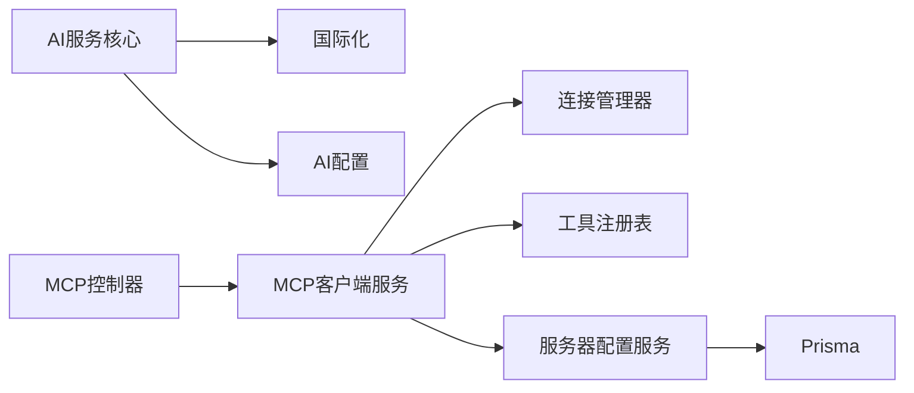

# AI规则与合规

<cite>
**本文引用的文件**
- [AI开发规范（Todo Monorepo）](file://docs/AI_RULES.md)
- [安全政策](file://SECURITY.md)
- [MCP连接管理器](file://apps/backend/src/mcp/core/mcp-connection.manager.ts)
- [MCP工具注册表](file://apps/backend/src/mcp/core/mcp-tool.registry.ts)
- [MCP客户端服务](file://apps/backend/src/mcp/mcp-client.service.ts)
- [MCP服务器配置服务](file://apps/backend/src/mcp/mcp-server-config.service.ts)
- [MCP控制器](file://apps/backend/src/mcp/mcp.controller.ts)
- [MCP模块](file://apps/backend/src/mcp/mcp.module.ts)
- [MCP DTO](file://apps/backend/src/mcp/mcp.dto.ts)
- [全局选择管理器](file://apps/frontend/src/features/ai/utils/GlobalSelectionManager.ts)
- [AI服务核心](file://apps/frontend/src/features/ai/services/core.ts)
- [AI服务入口](file://apps/frontend/src/features/ai/services/aiService.ts)
- [后端应用模块](file://apps/backend/src/app.module.ts)
- [后端主程序入口](file://apps/backend/src/main.ts)
- [前端路由](file://apps/frontend/src/router/index.ts)
- [前端国际化资源（中文）](file://apps/frontend/src/i18n/locales/zh-CN/)
- [后端国际化资源（中文）](file://apps/backend/src/i18n/zh-CN/)
- [前端国际化资源（英文）](file://apps/frontend/src/i18n/locales/en-US/)
- [后端国际化资源（英文）](file://apps/backend/src/i18n/en-US/)
- [共享包模式定义](file://packages/shared/src/schemas/mcp.schema.ts)
- [共享包公共DTO](file://packages/shared/src/dto/common.dto.ts)
</cite>

## 目录
1. [简介](#简介)
2. [项目结构](#项目结构)
3. [核心组件](#核心组件)
4. [架构总览](#架构总览)
5. [详细组件分析](#详细组件分析)
6. [依赖关系分析](#依赖关系分析)
7. [性能考量](#性能考量)
8. [故障排查指南](#故障排查指南)
9. [结论](#结论)
10. [附录](#附录)

## 简介
本文件面向AI规则与合规系统，围绕以下目标展开：制定AI行为准则、建立执行机制与监控策略；文档化代理规则实现、全局选择管理器功能、合规检查流程；解释安全限制配置、内容过滤机制、风险评估算法；涵盖合规审计日志、违规检测与自动阻断机制；提供规则配置指南、自定义策略与例外处理；说明多语言支持与文化适配、法律合规要求；包含风险评估工具、监控仪表板与报告生成；提供合规培训材料、最佳实践与故障处理流程。

本项目采用Monorepo架构，后端基于NestJS + Fastify，前端基于Vue 3 + Vite，AI相关能力通过MCP（Model Context Protocol）模块与外部工具生态集成，并通过统一的AI服务层提供流式与非流式对话能力。

## 项目结构
- 后端（apps/backend）
  - AI与MCP相关模块位于 mcp/ 目录，包含控制器、服务、传输工厂、连接管理器与工具注册表
  - AI服务核心位于 apps/frontend/src/features/ai/services/，负责构建请求、处理流式响应、工具调用与思考过程抽取
  - 国际化资源分别在 apps/frontend/src/i18n/locales 与 apps/backend/src/i18n
- 前端（apps/frontend）
  - AI功能以特性模块化组织，AI服务通过组合式函数与状态管理协调
  - 全局选择管理器用于跨组件的选择监听与面板关闭事件处理
- 共享包（packages/shared）
  - 定义MCP模式与公共DTO，确保前后端契约一致

**图表来源**
- [后端应用模块](file://apps/backend/src/app.module.ts)
- [后端主程序入口](file://apps/backend/src/main.ts)
- [MCP控制器](file://apps/backend/src/mcp/mcp.controller.ts)
- [MCP客户端服务](file://apps/backend/src/mcp/mcp-client.service.ts)
- [MCP服务器配置服务](file://apps/backend/src/mcp/mcp-server-config.service.ts)
- [MCP连接管理器](file://apps/backend/src/mcp/core/mcp-connection.manager.ts)
- [MCP工具注册表](file://apps/backend/src/mcp/core/mcp-tool.registry.ts)
- [AI服务核心](file://apps/frontend/src/features/ai/services/core.ts)
- [全局选择管理器](file://apps/frontend/src/features/ai/utils/GlobalSelectionManager.ts)
- [共享包模式定义](file://packages/shared/src/schemas/mcp.schema.ts)
- [共享包公共DTO](file://packages/shared/src/dto/common.dto.ts)

**章节来源**
- [后端应用模块](file://apps/backend/src/app.module.ts)
- [后端主程序入口](file://apps/backend/src/main.ts)
- [MCP模块](file://apps/backend/src/mcp/mcp.module.ts)
- [AI开发规范（Todo Monorepo）](file://docs/AI_RULES.md)

## 核心组件
- AI服务核心（前端）
  - 负责构建请求、处理SSE流式响应、聚合工具调用、抽取推理细节与思考内容
  - 提供中断请求、信号管理与非流式响应获取能力
- 全局选择管理器（前端）
  - 统一监听文档selectionchange与鼠标点击，向注册元素回调通知，支持面板关闭与状态同步
- MCP模块（后端）
  - 提供MCP服务器配置CRUD、工具发现、连接管理与工具调用
  - 通过传输工厂创建不同类型的传输（HTTP/STDIO），连接管理器维护活跃连接，工具注册表缓存工具清单
- AI规则与合规基础
  - 项目制定了严格的工程规则与AI开发规范，确保行为可维护、可测试、可交付
  - 安全政策明确了漏洞上报渠道与支持版本范围

**章节来源**
- [AI服务核心](file://apps/frontend/src/features/ai/services/core.ts)
- [全局选择管理器](file://apps/frontend/src/features/ai/utils/GlobalSelectionManager.ts)
- [MCP模块](file://apps/backend/src/mcp/mcp.module.ts)
- [MCP控制器](file://apps/backend/src/mcp/mcp.controller.ts)
- [MCP客户端服务](file://apps/backend/src/mcp/mcp-client.service.ts)
- [MCP服务器配置服务](file://apps/backend/src/mcp/mcp-server-config.service.ts)
- [MCP连接管理器](file://apps/backend/src/mcp/core/mcp-connection.manager.ts)
- [MCP工具注册表](file://apps/backend/src/mcp/core/mcp-tool.registry.ts)
- [AI开发规范（Todo Monorepo）](file://docs/AI_RULES.md)
- [安全政策](file://SECURITY.md)

## 架构总览
AI规则与合规系统采用“薄壳厚脑”的职责分工：前端负责界面与交互、状态管理与请求编排；后端负责领域逻辑、鉴权、持久化与实时通信；原生壳仅承载系统能力，不承载业务规则。AI服务通过统一的API与MCP模块交互，实现工具发现与调用，同时在前端进行内容过滤与合规校验。

**图表来源**
- [MCP控制器](file://apps/backend/src/mcp/mcp.controller.ts)
- [MCP客户端服务](file://apps/backend/src/mcp/mcp-client.service.ts)
- [MCP工具注册表](file://apps/backend/src/mcp/core/mcp-tool.registry.ts)
- [MCP连接管理器](file://apps/backend/src/mcp/core/mcp-connection.manager.ts)
- [MCP服务器配置服务](file://apps/backend/src/mcp/mcp-server-config.service.ts)

## 详细组件分析

### AI服务核心（前端）
- 流式响应处理
  - 解析SSE数据行，提取choices.delta.content作为文本增量
  - 聚合tool_calls，按索引合并函数名与参数
  - 抽取推理细节与思考内容，支持多种模型的差异化字段
- 请求控制
  - 使用AbortController管理请求生命周期，支持中断与重置
  - 统一构建请求头与URL，注入系统提示与上下文摘要
- 错误处理
  - 对非OK响应抛出本地化错误，便于UI展示与日志追踪

**图表来源**
- [AI服务核心](file://apps/frontend/src/features/ai/services/core.ts)

**章节来源**
- [AI服务核心](file://apps/frontend/src/features/ai/services/core.ts)

### 全局选择管理器（前端）
- 单例模式，集中管理文档级selectionchange与mousedown事件
- 支持注册多个监听元素，自动识别当前选区所属元素并回调
- 处理外部点击事件，向所有监听者广播，便于关闭面板或清除状态

**图表来源**
- [全局选择管理器](file://apps/frontend/src/features/ai/utils/GlobalSelectionManager.ts)

**章节来源**
- [全局选择管理器](file://apps/frontend/src/features/ai/utils/GlobalSelectionManager.ts)

### MCP模块（后端）
- 控制器
  - 提供MCP服务器配置的CRUD、连接/断开、工具发现与调用接口
  - 权限控制基于JWT守卫，确保用户只能操作自己的配置
- 客户端服务
  - 门面类，封装传输创建、连接管理与工具调用
  - 连接成功后预热工具注册表，减少后续查询延迟
- 连接管理器
  - 维护serverId到ActiveConnection的映射，支持重连与模块销毁时清理
  - 监听STDIO stderr与错误事件，记录日志
- 工具注册表
  - 缓存工具清单，支持刷新与清理
- 服务器配置服务
  - 基于Prisma进行CRUD，支持启用状态筛选与所有权验证

**图表来源**
- [MCP控制器](file://apps/backend/src/mcp/mcp.controller.ts)
- [MCP客户端服务](file://apps/backend/src/mcp/mcp-client.service.ts)
- [MCP连接管理器](file://apps/backend/src/mcp/core/mcp-connection.manager.ts)
- [MCP工具注册表](file://apps/backend/src/mcp/core/mcp-tool.registry.ts)
- [MCP服务器配置服务](file://apps/backend/src/mcp/mcp-server-config.service.ts)

**章节来源**
- [MCP控制器](file://apps/backend/src/mcp/mcp.controller.ts)
- [MCP客户端服务](file://apps/backend/src/mcp/mcp-client.service.ts)
- [MCP连接管理器](file://apps/backend/src/mcp/core/mcp-connection.manager.ts)
- [MCP工具注册表](file://apps/backend/src/mcp/core/mcp-tool.registry.ts)
- [MCP服务器配置服务](file://apps/backend/src/mcp/mcp-server-config.service.ts)

### AI行为准则与执行机制
- 行为准则
  - 任何会影响行为的变更必须补齐/更新测试；无测试支撑的行为改动不交付
  - 代码风格遵循项目约定：2空格、单引号、无分号，严格类型，禁止any
  - 依赖版本使用精确版本，workspace依赖保留workspace:*
  - 修改packages/shared后，必须先构建再验证下游
  - 不引入会泄露密钥/隐私的日志与代码；不在仓库内写入任何密钥
  - 变更完成后必须通过lint、test、type-check
- 执行机制
  - 工作流：Synthesis → Modeling → Execution → Refinement
  - 前端采用Feature-based Modularization，后端采用Controller/Service/Prisma分层
  - 安全约束：除GET/HEAD/OPTIONS外，必须携带X-Requested-With；限流默认策略可通过环境变量覆盖

**章节来源**
- [AI开发规范（Todo Monorepo）](file://docs/AI_RULES.md)

### 合规检查流程
- 前端合规检查
  - 请求消息净化：在发送前对消息进行清洗，避免注入与越权字段
  - 工具调用校验：在调用工具前检查工具是否存在，防止未知工具调用
  - 流式响应过滤：对推理细节与思考内容进行抽取与过滤，确保输出符合合规要求
- 后端合规检查
  - JWT鉴权：所有受保护接口使用Bearer Token
  - 权限验证：配置CRUD均进行所有权验证，防止越权访问
  - 连接与工具缓存：连接成功后预热工具注册表，减少重复查询与潜在错误

**图表来源**
- [AI服务核心](file://apps/frontend/src/features/ai/services/core.ts)
- [MCP客户端服务](file://apps/backend/src/mcp/mcp-client.service.ts)

**章节来源**
- [AI服务核心](file://apps/frontend/src/features/ai/services/core.ts)
- [MCP客户端服务](file://apps/backend/src/mcp/mcp-client.service.ts)

### 安全限制配置与内容过滤机制
- 安全限制
  - 除GET/HEAD/OPTIONS外，必须携带X-Requested-With
  - 默认限流策略（1s/10、10s/50、1min/100），可通过环境变量覆盖
  - 日志仅打印排障必要信息，禁止输出token、cookie、邮箱验证码等敏感数据
- 内容过滤
  - 前端在发送前对消息进行净化，避免注入与越权字段
  - 流式响应阶段对推理细节与思考内容进行抽取与过滤，确保输出符合合规要求

**章节来源**
- [AI开发规范（Todo Monorepo）](file://docs/AI_RULES.md)
- [AI服务核心](file://apps/frontend/src/features/ai/services/core.ts)

### 风险评估算法与合规审计日志
- 风险评估
  - 推理细节与思考内容抽取：通过resolveReasoningDetails与normalizeReasoningDetails标准化不同模型的输出字段，形成统一的风险评估输入
  - 工具调用聚合：通过toolCallsMap按索引聚合工具调用，便于后续风险评估与审计
- 合规审计日志
  - 后端连接管理器记录MCP服务器stderr、错误与关闭事件
  - 工具调用过程中记录调用名称、参数与结果状态，便于审计与回溯

**章节来源**
- [AI服务核心](file://apps/frontend/src/features/ai/services/core.ts)
- [MCP连接管理器](file://apps/backend/src/mcp/core/mcp-connection.manager.ts)
- [MCP客户端服务](file://apps/backend/src/mcp/mcp-client.service.ts)

### 多语言支持、文化适配与法律合规
- 多语言支持
  - 前后端语言资源分离管理，新增文案必须中英文同步，禁止硬编码UI文本
  - 约定枚举值大写蛇形；UI文本小写驼峰
- 文化适配
  - 国际化资源分别在frontend与backend目录下，确保前后端文案一致性
- 法律合规
  - 安全政策明确了漏洞上报渠道与支持版本范围，鼓励用户保持安装更新、使用强密码并避免暴露数据库或Redis实例到公网

**章节来源**
- [AI开发规范（Todo Monorepo）](file://docs/AI_RULES.md)
- [安全政策](file://SECURITY.md)
- [前端国际化资源（中文）](file://apps/frontend/src/i18n/locales/zh-CN/)
- [后端国际化资源（中文）](file://apps/backend/src/i18n/zh-CN/)
- [前端国际化资源（英文）](file://apps/frontend/src/i18n/locales/en-US/)
- [后端国际化资源（英文）](file://apps/backend/src/i18n/en-US/)

### 规则配置指南、自定义策略与例外处理
- 规则配置
  - 通过MCP服务器配置服务进行CRUD，支持启用/禁用状态
  - 工具发现与调用通过MCP控制器统一入口，支持按服务器ID查询工具与调用
- 自定义策略
  - 前端通过AI服务核心的选项参数（如thinkingMode、toolChoice）定制推理与工具调用策略
  - 后端通过JWT守卫与权限验证确保策略执行的可控性
- 例外处理
  - 工具不存在时抛出错误并记录日志
  - 连接失败时记录错误并抛出异常，便于上层处理

**章节来源**
- [MCP服务器配置服务](file://apps/backend/src/mcp/mcp-server-config.service.ts)
- [MCP控制器](file://apps/backend/src/mcp/mcp.controller.ts)
- [MCP客户端服务](file://apps/backend/src/mcp/mcp-client.service.ts)
- [AI服务核心](file://apps/frontend/src/features/ai/services/core.ts)

### 监控仪表板与报告生成
- 监控点
  - MCP连接管理器记录stderr、错误与关闭事件
  - 工具调用结果包含isError标记，便于统计与告警
- 报告生成
  - 建议结合日志系统与指标收集（如连接数、工具调用次数、错误率）生成合规报告
  - 前端可基于推理细节与思考内容生成内容合规报告

**章节来源**
- [MCP连接管理器](file://apps/backend/src/mcp/core/mcp-connection.manager.ts)
- [MCP客户端服务](file://apps/backend/src/mcp/mcp-client.service.ts)
- [AI服务核心](file://apps/frontend/src/features/ai/services/core.ts)

## 依赖关系分析
- 组件耦合
  - 前端AI服务核心依赖国际化与配置组合式函数，耦合度低，便于测试与替换
  - 后端MCP模块通过依赖注入解耦控制器、客户端服务、连接管理器与工具注册表
- 外部依赖
  - MCP SDK用于客户端连接与工具调用
  - Prisma用于MCP服务器配置的持久化
- 循环依赖
  - 模块间通过接口与DTO解耦，未见循环依赖迹象

**图表来源**
- [AI服务核心](file://apps/frontend/src/features/ai/services/core.ts)
- [MCP控制器](file://apps/backend/src/mcp/mcp.controller.ts)
- [MCP客户端服务](file://apps/backend/src/mcp/mcp-client.service.ts)
- [MCP连接管理器](file://apps/backend/src/mcp/core/mcp-connection.manager.ts)
- [MCP工具注册表](file://apps/backend/src/mcp/core/mcp-tool.registry.ts)
- [MCP服务器配置服务](file://apps/backend/src/mcp/mcp-server-config.service.ts)

**章节来源**
- [MCP模块](file://apps/backend/src/mcp/mcp.module.ts)
- [MCP控制器](file://apps/backend/src/mcp/mcp.controller.ts)
- [MCP客户端服务](file://apps/backend/src/mcp/mcp-client.service.ts)

## 性能考量
- 流式处理
  - 前端采用SSE流式读取，边到边渲染，降低首帧延迟
  - 工具调用聚合使用Map按索引合并，避免重复解析
- 缓存与预热
  - 工具注册表缓存工具清单，连接成功后预热，减少后续查询开销
- 连接管理
  - 连接管理器维护活跃连接集合，模块销毁时统一清理，避免资源泄漏
- 限流与安全
  - 默认限流策略与安全约束减少恶意请求对系统的影响

[本节为通用性能建议，无需特定文件引用]

## 故障排查指南
- 常见问题
  - 工具不存在：检查工具名称与服务器ID，确认工具注册表缓存是否正确
  - 连接失败：查看stderr日志与错误事件，确认传输配置与外部服务器状态
  - 权限不足：确认JWT令牌与用户所有权验证
- 调试步骤
  - 前端：启用AbortController中断，观察流式响应与工具调用回调
  - 后端：查看连接管理器日志与工具调用结果，定位异常点
- 安全与合规
  - 检查日志是否包含敏感信息，确保符合安全政策

**章节来源**
- [MCP客户端服务](file://apps/backend/src/mcp/mcp-client.service.ts)
- [MCP连接管理器](file://apps/backend/src/mcp/core/mcp-connection.manager.ts)
- [AI服务核心](file://apps/frontend/src/features/ai/services/core.ts)
- [安全政策](file://SECURITY.md)

## 结论
本系统通过明确的AI行为准则、完善的MCP模块与前端AI服务核心，实现了从规则制定、执行到监控的闭环。全局选择管理器提升了用户体验与交互一致性；安全限制与内容过滤机制保障了合规性；多语言支持与文化适配满足国际化需求；监控与审计日志为合规报告与风险评估提供了数据基础。建议在实际部署中结合日志与指标系统，持续优化工具调用与推理策略，确保系统稳定与合规。

[本节为总结性内容，无需特定文件引用]

## 附录
- 合规培训材料
  - 参考AI开发规范中的工程人格与执行风格，确保团队理解并遵循“博学、严谨、务实”的行为基调
- 最佳实践
  - 严格遵守依赖边界，避免跨层污染；优先小步提交与可审阅改动；补齐受影响行为的测试
- 故障处理流程
  - 建立标准化的故障排查步骤与升级通道，结合安全政策进行漏洞上报与修复

**章节来源**
- [AI开发规范（Todo Monorepo）](file://docs/AI_RULES.md)
- [安全政策](file://SECURITY.md)