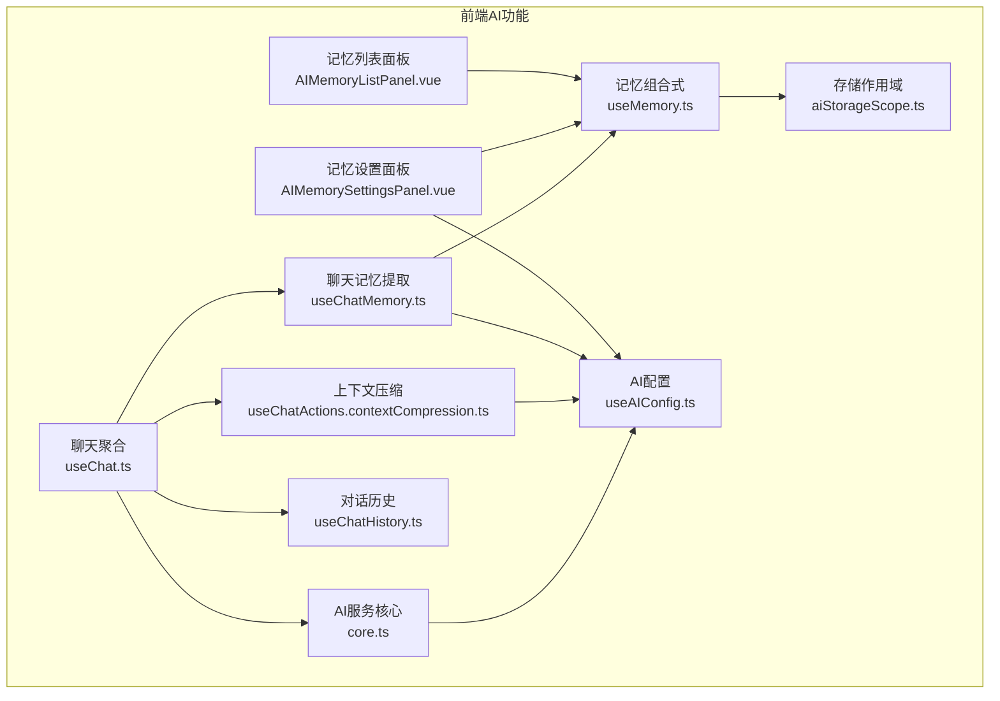
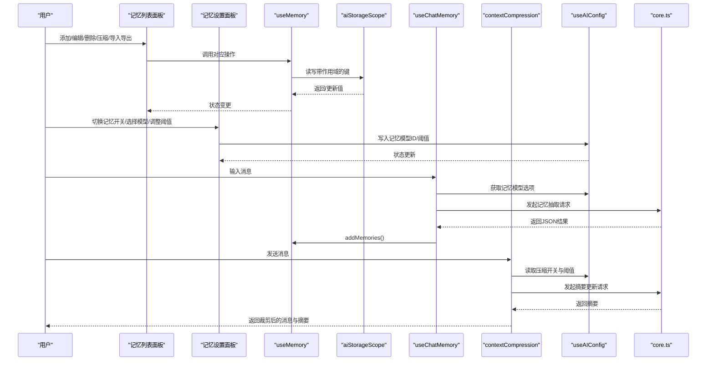
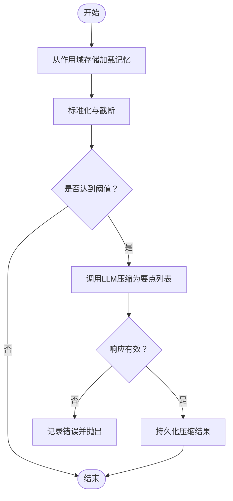
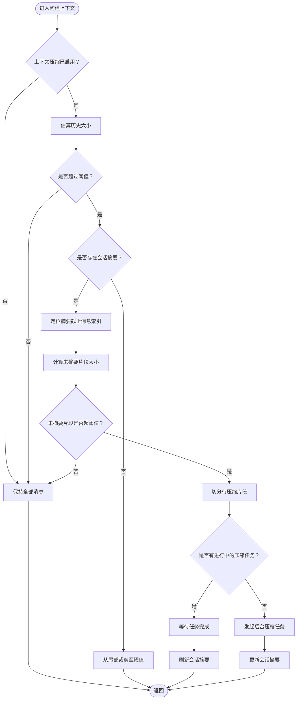
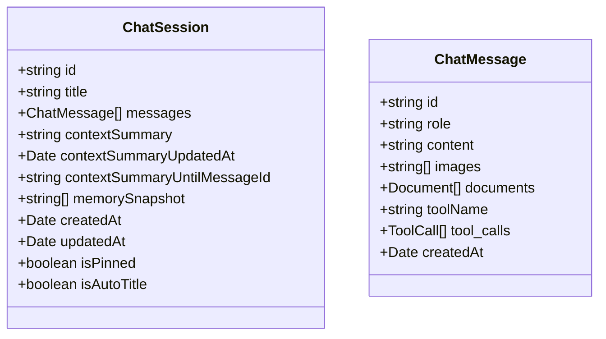
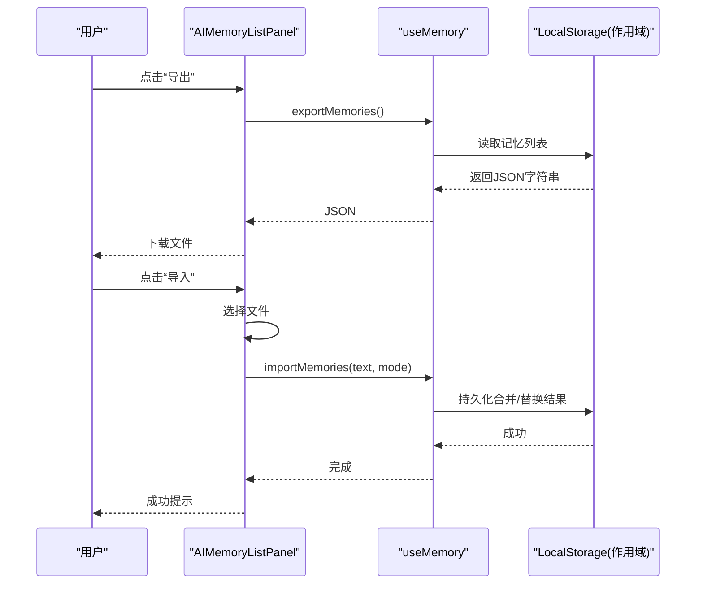
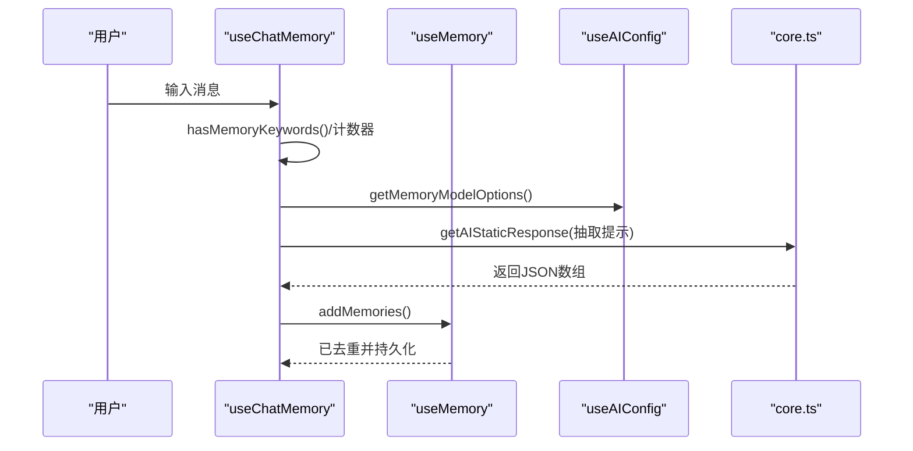
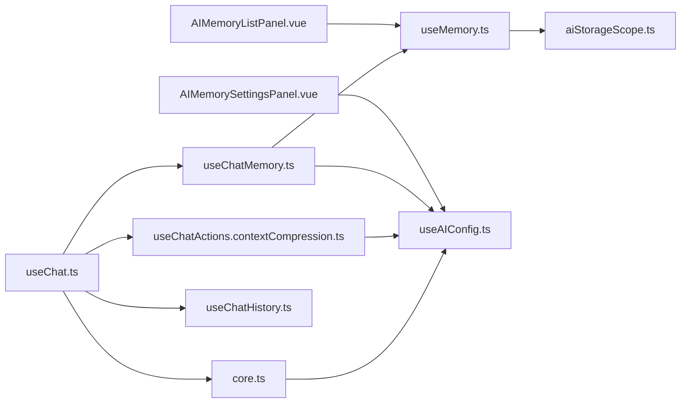

# AI记忆与上下文

<cite>
**本文档引用的文件**
- [AIMemoryListPanel.vue](file://apps/frontend/src/features/ai/components/AIMemoryListPanel.vue)
- [AIMemorySettingsPanel.vue](file://apps/frontend/src/features/ai/components/AIMemorySettingsPanel.vue)
- [useMemory.ts](file://apps/frontend/src/features/ai/composables/useMemory.ts)
- [useChatMemory.ts](file://apps/frontend/src/features/ai/composables/useChatMemory.ts)
- [useChatActions.contextCompression.ts](file://apps/frontend/src/features/ai/composables/useChatActions.contextCompression.ts)
- [useAIConfig.ts](file://apps/frontend/src/features/ai/composables/useAIConfig.ts)
- [aiStorageScope.ts](file://apps/frontend/src/features/ai/composables/aiStorageScope.ts)
- [useChat.ts](file://apps/frontend/src/features/ai/composables/useChat.ts)
- [useChatHistory.ts](file://apps/frontend/src/features/ai/composables/useChatHistory.ts)
- [core.ts](file://apps/frontend/src/features/ai/services/core.ts)
- [index.ts](file://apps/frontend/src/features/ai/services/index.ts)
</cite>

## 目录
1. [简介](#简介)
2. [项目结构](#项目结构)
3. [核心组件](#核心组件)
4. [架构总览](#架构总览)
5. [详细组件分析](#详细组件分析)
6. [依赖关系分析](#依赖关系分析)
7. [性能考量](#性能考量)
8. [故障排查指南](#故障排查指南)
9. [结论](#结论)
10. [附录](#附录)

## 简介
本文件面向AI记忆与上下文管理系统，系统性阐述记忆存储机制、上下文压缩算法、对话历史管理、记忆检索策略与相似度计算、存储优化方案、上下文压缩触发条件与算法选择、性能影响评估、记忆配置选项、隐私保护与数据清理策略、记忆与对话状态的关联、持久化与备份恢复、内存管理与缓存策略、以及调试工具使用方法。文档同时提供可视化图示帮助理解组件交互与数据流。

## 项目结构
前端AI功能主要位于apps/frontend/src/features/ai目录下，采用组合式API（Composables）与组件（Components）分离的设计，配合服务层（Services）与配置（useAIConfig）实现记忆与上下文管理的完整闭环。

图表来源
- [AIMemoryListPanel.vue:1-346](file://apps/frontend/src/features/ai/components/AIMemoryListPanel.vue#L1-L346)
- [AIMemorySettingsPanel.vue:1-148](file://apps/frontend/src/features/ai/components/AIMemorySettingsPanel.vue#L1-L148)
- [useMemory.ts:1-386](file://apps/frontend/src/features/ai/composables/useMemory.ts#L1-L386)
- [useChatMemory.ts:1-148](file://apps/frontend/src/features/ai/composables/useChatMemory.ts#L1-L148)
- [useChatActions.contextCompression.ts:1-263](file://apps/frontend/src/features/ai/composables/useChatActions.contextCompression.ts#L1-L263)
- [useAIConfig.ts:1-800](file://apps/frontend/src/features/ai/composables/useAIConfig.ts#L1-L800)
- [aiStorageScope.ts:1-101](file://apps/frontend/src/features/ai/composables/aiStorageScope.ts#L1-L101)
- [useChat.ts:1-119](file://apps/frontend/src/features/ai/composables/useChat.ts#L1-L119)
- [useChatHistory.ts:1-200](file://apps/frontend/src/features/ai/composables/useChatHistory.ts#L1-L200)
- [core.ts:1-200](file://apps/frontend/src/features/ai/services/core.ts#L1-L200)

章节来源
- [AIMemoryListPanel.vue:1-346](file://apps/frontend/src/features/ai/components/AIMemoryListPanel.vue#L1-L346)
- [AIMemorySettingsPanel.vue:1-148](file://apps/frontend/src/features/ai/components/AIMemorySettingsPanel.vue#L1-L148)
- [useMemory.ts:1-386](file://apps/frontend/src/features/ai/composables/useMemory.ts#L1-L386)
- [useChatMemory.ts:1-148](file://apps/frontend/src/features/ai/composables/useChatMemory.ts#L1-L148)
- [useChatActions.contextCompression.ts:1-263](file://apps/frontend/src/features/ai/composables/useChatActions.contextCompression.ts#L1-L263)
- [useAIConfig.ts:1-800](file://apps/frontend/src/features/ai/composables/useAIConfig.ts#L1-L800)
- [aiStorageScope.ts:1-101](file://apps/frontend/src/features/ai/composables/aiStorageScope.ts#L1-L101)
- [useChat.ts:1-119](file://apps/frontend/src/features/ai/composables/useChat.ts#L1-L119)
- [useChatHistory.ts:1-200](file://apps/frontend/src/features/ai/composables/useChatHistory.ts#L1-L200)
- [core.ts:1-200](file://apps/frontend/src/features/ai/services/core.ts#L1-L200)

## 核心组件
- 记忆组合式（useMemory）：负责记忆的增删改查、去重、导入导出、自动压缩阈值、存储与跨标签页同步。
- 聊天记忆提取（useChatMemory）：根据用户输入语义关键词与周期性策略，从对话历史中抽取长期记忆。
- 上下文压缩（useChatActions.contextCompression）：基于字符预算与摘要增量更新，对早期对话进行压缩，减少上下文长度。
- 记忆面板组件：提供记忆列表展示、编辑、删除、清空、导入导出、压缩等交互。
- 记忆设置面板：启用/禁用记忆、选择记忆专用模型、设置自动压缩阈值。
- 存储作用域（aiStorageScope）：按用户/匿名作用域隔离AI相关本地存储键，支持事件广播刷新。
- 配置（useAIConfig）：集中管理AI模型、温度、上下文压缩开关与阈值、记忆模型ID等。
- 聊天聚合（useChat）：整合状态、动作与记忆提取，生成最终消息列表。
- 对话历史（useChatHistory）：会话持久化、标题与摘要、存储清理策略。

章节来源
- [useMemory.ts:116-386](file://apps/frontend/src/features/ai/composables/useMemory.ts#L116-L386)
- [useChatMemory.ts:20-148](file://apps/frontend/src/features/ai/composables/useChatMemory.ts#L20-L148)
- [useChatActions.contextCompression.ts:142-263](file://apps/frontend/src/features/ai/composables/useChatActions.contextCompression.ts#L142-L263)
- [AIMemoryListPanel.vue:1-346](file://apps/frontend/src/features/ai/components/AIMemoryListPanel.vue#L1-L346)
- [AIMemorySettingsPanel.vue:1-148](file://apps/frontend/src/features/ai/components/AIMemorySettingsPanel.vue#L1-L148)
- [aiStorageScope.ts:1-101](file://apps/frontend/src/features/ai/composables/aiStorageScope.ts#L1-L101)
- [useAIConfig.ts:18-800](file://apps/frontend/src/features/ai/composables/useAIConfig.ts#L18-L800)
- [useChat.ts:21-119](file://apps/frontend/src/features/ai/composables/useChat.ts#L21-L119)
- [useChatHistory.ts:13-200](file://apps/frontend/src/features/ai/composables/useChatHistory.ts#L13-L200)

## 架构总览
系统通过组合式API协调UI组件与业务逻辑，记忆与上下文分别由独立模块处理，但通过配置与服务层打通。核心交互如下：

图表来源
- [AIMemoryListPanel.vue:25-150](file://apps/frontend/src/features/ai/components/AIMemoryListPanel.vue#L25-L150)
- [AIMemorySettingsPanel.vue:19-36](file://apps/frontend/src/features/ai/components/AIMemorySettingsPanel.vue#L19-L36)
- [useMemory.ts:116-386](file://apps/frontend/src/features/ai/composables/useMemory.ts#L116-L386)
- [aiStorageScope.ts:50-88](file://apps/frontend/src/features/ai/composables/aiStorageScope.ts#L50-L88)
- [useChatMemory.ts:71-141](file://apps/frontend/src/features/ai/composables/useChatMemory.ts#L71-L141)
- [useChatActions.contextCompression.ts:150-262](file://apps/frontend/src/features/ai/composables/useChatActions.contextCompression.ts#L150-L262)
- [useAIConfig.ts:601-621](file://apps/frontend/src/features/ai/composables/useAIConfig.ts#L601-L621)
- [core.ts:115-200](file://apps/frontend/src/features/ai/services/core.ts#L115-L200)

## 详细组件分析

### 记忆存储机制与检索策略
- 存储键与作用域
  - 使用带作用域的键（用户ID或匿名）隔离记忆数据，避免跨用户污染。
  - 支持跨标签页事件监听与storage事件，实现多窗口同步。
- 数据结构与容量
  - 最大记忆条目数与单条最大字符数限制，超出部分截断。
  - 导入/导出采用JSON格式，支持合并与替换两种模式。
- 去重与相似度
  - 基于标准化与小写化，使用单词边界正则进行语义级相似判断，避免简单子串误判。
- 自动压缩阈值
  - 当记忆数量达到阈值且未处于压缩中时，自动触发压缩流程。

图表来源
- [useMemory.ts:43-95](file://apps/frontend/src/features/ai/composables/useMemory.ts#L43-L95)
- [useMemory.ts:169-179](file://apps/frontend/src/features/ai/composables/useMemory.ts#L169-L179)
- [useMemory.ts:232-281](file://apps/frontend/src/features/ai/composables/useMemory.ts#L232-L281)

章节来源
- [useMemory.ts:14-95](file://apps/frontend/src/features/ai/composables/useMemory.ts#L14-L95)
- [useMemory.ts:139-164](file://apps/frontend/src/features/ai/composables/useMemory.ts#L139-L164)
- [useMemory.ts:169-179](file://apps/frontend/src/features/ai/composables/useMemory.ts#L169-L179)
- [useMemory.ts:318-358](file://apps/frontend/src/features/ai/composables/useMemory.ts#L318-L358)
- [aiStorageScope.ts:50-88](file://apps/frontend/src/features/ai/composables/aiStorageScope.ts#L50-L88)

### 上下文压缩算法与触发条件
- 触发条件
  - 全局开关与字符预算阈值；会话内若已有摘要，仅对未摘要片段进行压缩。
- 压缩算法
  - 增量摘要：将早期对话片段与现有摘要一起输入，要求模型输出结构化要点，严格过滤命令式与长文本。
  - 字符预算裁剪：从尾部向前累加，超过阈值即停止，保留尾部最新消息作为请求主体。
- 并发与一致性
  - 会话级压缩任务去重，避免重复压缩；等待进行中的任务完成后返回最新摘要。

图表来源
- [useChatActions.contextCompression.ts:150-262](file://apps/frontend/src/features/ai/composables/useChatActions.contextCompression.ts#L150-L262)

章节来源
- [useChatActions.contextCompression.ts:8-32](file://apps/frontend/src/features/ai/composables/useChatActions.contextCompression.ts#L8-L32)
- [useChatActions.contextCompression.ts:150-262](file://apps/frontend/src/features/ai/composables/useChatActions.contextCompression.ts#L150-L262)

### 对话历史管理与持久化
- 会话结构
  - 包含消息数组、可选摘要及其截止消息ID、创建/更新时间、置顶标记等。
- 持久化策略
  - 本地存储键带作用域，定期节流保存；消息内容与附件按上限截断。
- 存储配额不足处理
  - 自动清理最旧的非置顶会话，优先删除5条，避免QuotaExceededError。

图表来源
- [useChatHistory.ts:13-25](file://apps/frontend/src/features/ai/composables/useChatHistory.ts#L13-L25)

章节来源
- [useChatHistory.ts:71-121](file://apps/frontend/src/features/ai/composables/useChatHistory.ts#L71-L121)
- [useChatHistory.ts:127-200](file://apps/frontend/src/features/ai/composables/useChatHistory.ts#L127-L200)

### 记忆面板与设置面板实现
- 记忆列表面板
  - 提供添加、编辑、删除、清空、导入、导出、压缩等操作；显示当前记忆数量与上限。
  - 支持文件导入（.json），统计导入条目数并提示成功。
- 记忆设置面板
  - 开关记忆功能；选择记忆专用模型（从预设中挑选）；设置自动压缩阈值（滑杆范围10~100步进5）。

图表来源
- [AIMemoryListPanel.vue:49-89](file://apps/frontend/src/features/ai/components/AIMemoryListPanel.vue#L49-L89)
- [useMemory.ts:318-358](file://apps/frontend/src/features/ai/composables/useMemory.ts#L318-L358)

章节来源
- [AIMemoryListPanel.vue:1-346](file://apps/frontend/src/features/ai/components/AIMemoryListPanel.vue#L1-L346)
- [AIMemorySettingsPanel.vue:1-148](file://apps/frontend/src/features/ai/components/AIMemorySettingsPanel.vue#L1-L148)
- [useMemory.ts:318-358](file://apps/frontend/src/features/ai/composables/useMemory.ts#L318-L358)

### 记忆与对话状态的关联
- 聊天记忆提取
  - 语义触发：检测用户输入中的偏好关键词。
  - 周期触发：每N轮（默认3轮）提取一次，平衡召回率与成本。
  - 仅从用户消息中提取长期事实或偏好，禁止从助手、工具、系统消息中反推。
- 与上下文压缩协作
  - 记忆抽取结果作为压缩输入的一部分，压缩后保留稳定要点，降低后续请求成本。

图表来源
- [useChatMemory.ts:71-141](file://apps/frontend/src/features/ai/composables/useChatMemory.ts#L71-L141)
- [useMemory.ts:184-208](file://apps/frontend/src/features/ai/composables/useMemory.ts#L184-L208)
- [useAIConfig.ts:120-134](file://apps/frontend/src/features/ai/composables/useAIConfig.ts#L120-L134)

章节来源
- [useChatMemory.ts:34-86](file://apps/frontend/src/features/ai/composables/useChatMemory.ts#L34-L86)
- [useChatMemory.ts:115-141](file://apps/frontend/src/features/ai/composables/useChatMemory.ts#L115-L141)

### 配置选项、隐私保护与数据清理
- 配置项
  - 记忆模型ID、上下文压缩开关与阈值、记忆专用模型预设等。
- 隐私保护
  - 存储键带作用域（用户ID或匿名），避免跨用户访问。
  - 服务端安全边界提示，防止从不可信来源注入指令。
- 数据清理
  - 记忆导入失败与无效项过滤；会话存储配额不足时自动清理最旧非置顶会话。

章节来源
- [useAIConfig.ts:18-38](file://apps/frontend/src/features/ai/composables/useAIConfig.ts#L18-L38)
- [useAIConfig.ts:601-621](file://apps/frontend/src/features/ai/composables/useAIConfig.ts#L601-L621)
- [aiStorageScope.ts:45-48](file://apps/frontend/src/features/ai/composables/aiStorageScope.ts#L45-L48)
- [useMemory.ts:325-358](file://apps/frontend/src/features/ai/composables/useMemory.ts#L325-L358)
- [useChatHistory.ts:174-197](file://apps/frontend/src/features/ai/composables/useChatHistory.ts#L174-L197)

## 依赖关系分析
- 组件依赖
  - 记忆列表/设置面板依赖useMemory与useAIConfig。
  - 聊天记忆与上下文压缩依赖useAIConfig与core.ts。
- 存储依赖
  - useMemory与useChatHistory均依赖aiStorageScope提供的作用域键。
- 服务依赖
  - 核心请求封装在core.ts，统一处理系统提示注入、消息清洗与流式响应。

图表来源
- [AIMemoryListPanel.vue:6-36](file://apps/frontend/src/features/ai/components/AIMemoryListPanel.vue#L6-L36)
- [AIMemorySettingsPanel.vue:5-20](file://apps/frontend/src/features/ai/components/AIMemorySettingsPanel.vue#L5-L20)
- [useChat.ts:21-24](file://apps/frontend/src/features/ai/composables/useChat.ts#L21-L24)
- [useChatMemory.ts:4-29](file://apps/frontend/src/features/ai/composables/useChatMemory.ts#L4-L29)
- [useChatActions.contextCompression.ts:1-7](file://apps/frontend/src/features/ai/composables/useChatActions.contextCompression.ts#L1-L7)
- [useMemory.ts:1-11](file://apps/frontend/src/features/ai/composables/useMemory.ts#L1-L11)
- [useChatHistory.ts:1-11](file://apps/frontend/src/features/ai/composables/useChatHistory.ts#L1-L11)
- [core.ts:1-14](file://apps/frontend/src/features/ai/services/core.ts#L1-L14)

章节来源
- [index.ts:1-9](file://apps/frontend/src/features/ai/services/index.ts#L1-L9)

## 性能考量
- 记忆压缩
  - 通过LLM将冗余记忆精炼为要点，显著降低后续请求上下文长度与成本。
  - 压缩前进行JSON与代码块剥离，保证输入结构化与可解析性。
- 上下文压缩
  - 字符预算裁剪与增量摘要结合，避免全量重算；并发任务去重，提升稳定性。
- 存储优化
  - 作用域键隔离与跨标签页同步，减少冲突；消息与附件截断，控制存储体积。
- 会话清理
  - 配额不足时自动清理最旧非置顶会话，保障可用空间。

章节来源
- [useMemory.ts:232-281](file://apps/frontend/src/features/ai/composables/useMemory.ts#L232-L281)
- [useChatActions.contextCompression.ts:18-32](file://apps/frontend/src/features/ai/composables/useChatActions.contextCompression.ts#L18-L32)
- [useChatHistory.ts:174-197](file://apps/frontend/src/features/ai/composables/useChatHistory.ts#L174-L197)

## 故障排查指南
- 记忆导入失败
  - 检查JSON格式与数组有效性；查看控制台错误与提示，确认导入模式（合并/替换）。
- 记忆压缩失败
  - 确认记忆模型配置与网络连通；查看lastError与控制台日志。
- 上下文压缩异常
  - 检查配置开关与阈值；关注会话摘要一致性与并发任务状态。
- 存储配额不足
  - 系统会自动清理最旧会话；建议定期清理非置顶会话或调整阈值。

章节来源
- [useMemory.ts:325-358](file://apps/frontend/src/features/ai/composables/useMemory.ts#L325-L358)
- [useMemory.ts:274-281](file://apps/frontend/src/features/ai/composables/useMemory.ts#L274-L281)
- [useChatActions.contextCompression.ts:136-140](file://apps/frontend/src/features/ai/composables/useChatActions.contextCompression.ts#L136-L140)
- [useChatHistory.ts:174-197](file://apps/frontend/src/features/ai/composables/useChatHistory.ts#L174-L197)

## 结论
本系统通过“记忆抽取—去重—压缩—持久化”的闭环设计，结合“字符预算裁剪—增量摘要”的上下文压缩策略，在保证隐私与性能的前提下，实现了可控、可扩展的AI记忆与上下文管理能力。配置与存储作用域的解耦使得功能具备良好的可移植性与安全性。

## 附录
- 调试工具
  - 控制台日志：观察记忆/压缩/上下文压缩过程中的错误与警告。
  - 浏览器开发者工具：检查LocalStorage中带作用域的键值变化。
  - 跨标签页行为：验证AI存储作用域变更事件是否触发刷新。
- 备份与恢复
  - 记忆导出为JSON文件，可在设置面板导入；会话历史同样可导出导入，便于迁移与恢复。