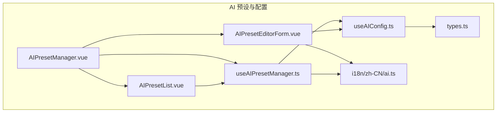
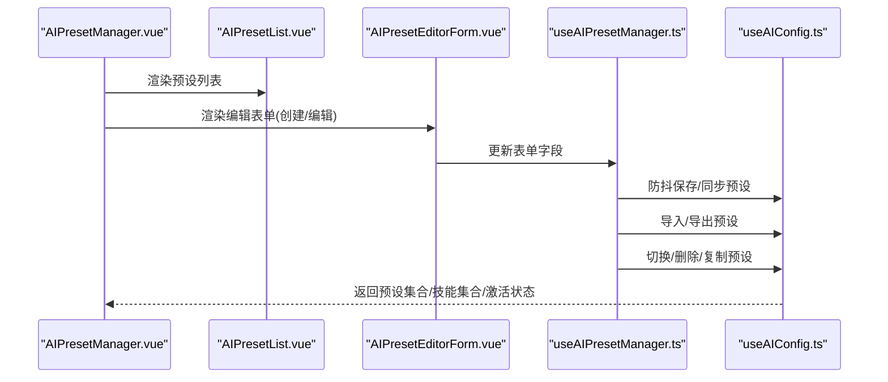
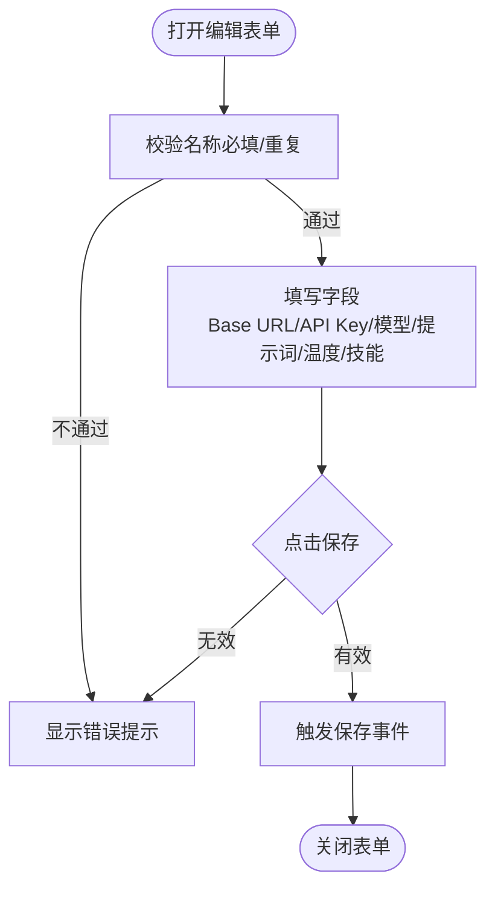
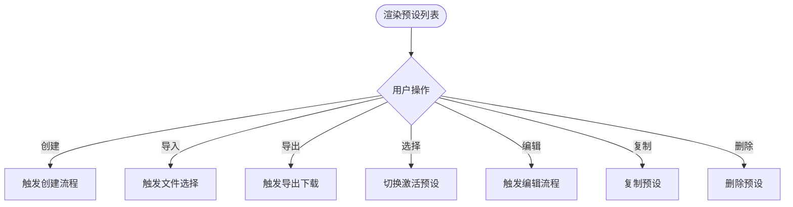
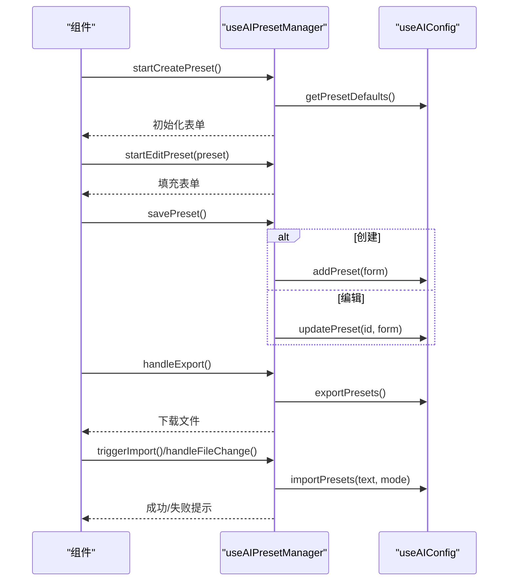
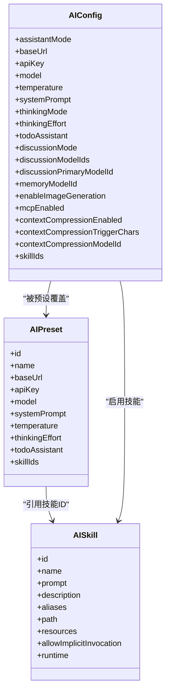
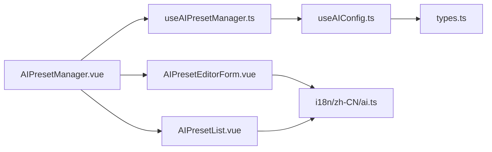

# AI预设与配置

<cite>
**本文档引用的文件**
- [apps/frontend/src/features/ai/components/AIPresetManager.vue](file://apps/frontend/src/features/ai/components/AIPresetManager.vue)
- [apps/frontend/src/features/ai/components/AIPresetEditorForm.vue](file://apps/frontend/src/features/ai/components/AIPresetEditorForm.vue)
- [apps/frontend/src/features/ai/components/AIPresetList.vue](file://apps/frontend/src/features/ai/components/AIPresetList.vue)
- [apps/frontend/src/features/ai/composables/useAIPresetManager.ts](file://apps/frontend/src/features/ai/composables/useAIPresetManager.ts)
- [apps/frontend/src/features/ai/composables/useAIConfig.ts](file://apps/frontend/src/features/ai/composables/useAIConfig.ts)
- [apps/frontend/src/features/ai/services/types.ts](file://apps/frontend/src/features/ai/services/types.ts)
- [apps/frontend/src/i18n/locales/zh-CN/ai.ts](file://apps/frontend/src/i18n/locales/zh-CN/ai.ts)
</cite>

## 目录
1. [简介](#简介)
2. [项目结构](#项目结构)
3. [核心组件](#核心组件)
4. [架构总览](#架构总览)
5. [详细组件分析](#详细组件分析)
6. [依赖分析](#依赖分析)
7. [性能考虑](#性能考虑)
8. [故障排查指南](#故障排查指南)
9. [结论](#结论)
10. [附录](#附录)

## 简介
本文件面向“AI预设与配置系统”，围绕前端实现的预设编辑表单、预设列表管理、预设管理器、AI配置管理与参数调整、模型选择机制、预设保存策略、导入导出与版本兼容、模板系统与默认配置、个性化设置、配置验证规则与错误处理、回滚机制、预设共享与团队协作、权限控制、配置迁移工具、性能优化与调试方法，以及预设开发指南与最佳实践进行全面技术文档化。

## 项目结构
本系统位于前端应用的 AI 功能域中，采用“组件 + 组合式函数 + 类型定义 + 国际化文案”的分层组织方式：
- 视图组件：AIPresetManager、AIPresetEditorForm、AIPresetList
- 状态与业务逻辑：useAIPresetManager、useAIConfig
- 类型与服务：types.ts
- 国际化：i18n/zh-CN/ai.ts

**图表来源**
- [apps/frontend/src/features/ai/components/AIPresetManager.vue](file://apps/frontend/src/features/ai/components/AIPresetManager.vue)
- [apps/frontend/src/features/ai/components/AIPresetEditorForm.vue](file://apps/frontend/src/features/ai/components/AIPresetEditorForm.vue)
- [apps/frontend/src/features/ai/components/AIPresetList.vue](file://apps/frontend/src/features/ai/components/AIPresetList.vue)
- [apps/frontend/src/features/ai/composables/useAIPresetManager.ts](file://apps/frontend/src/features/ai/composables/useAIPresetManager.ts)
- [apps/frontend/src/features/ai/composables/useAIConfig.ts](file://apps/frontend/src/features/ai/composables/useAIConfig.ts)
- [apps/frontend/src/features/ai/services/types.ts](file://apps/frontend/src/features/ai/services/types.ts)
- [apps/frontend/src/i18n/locales/zh-CN/ai.ts](file://apps/frontend/src/i18n/locales/zh-CN/ai.ts)

**章节来源**
- [apps/frontend/src/features/ai/components/AIPresetManager.vue](file://apps/frontend/src/features/ai/components/AIPresetManager.vue)
- [apps/frontend/src/features/ai/components/AIPresetEditorForm.vue](file://apps/frontend/src/features/ai/components/AIPresetEditorForm.vue)
- [apps/frontend/src/features/ai/components/AIPresetList.vue](file://apps/frontend/src/features/ai/components/AIPresetList.vue)
- [apps/frontend/src/features/ai/composables/useAIPresetManager.ts](file://apps/frontend/src/features/ai/composables/useAIPresetManager.ts)
- [apps/frontend/src/features/ai/composables/useAIConfig.ts](file://apps/frontend/src/features/ai/composables/useAIConfig.ts)
- [apps/frontend/src/features/ai/services/types.ts](file://apps/frontend/src/features/ai/services/types.ts)
- [apps/frontend/src/i18n/locales/zh-CN/ai.ts](file://apps/frontend/src/i18n/locales/zh-CN/ai.ts)

## 核心组件
- 预设管理器容器：AIPresetManager 负责协调编辑表单与列表视图，暴露创建、编辑、保存、删除、复制、导入、导出等操作。
- 预设编辑表单：AIPresetEditorForm 提供名称、Base URL、API Key、模型、系统提示词、温度、技能启用等字段的交互与校验。
- 预设列表：AIPresetList 展示预设集合，支持创建、导入、导出、选择、编辑、复制、删除等操作。
- 预设管理组合式函数：useAIPresetManager 负责表单状态、校验、持久化触发、导入导出、防抖更新等。
- AI 配置组合式函数：useAIConfig 负责全局 AI 配置、预设集合、技能集合、激活预设、默认值、导入导出、外部技能安装、校验与同步等。

**章节来源**
- [apps/frontend/src/features/ai/components/AIPresetManager.vue](file://apps/frontend/src/features/ai/components/AIPresetManager.vue)
- [apps/frontend/src/features/ai/components/AIPresetEditorForm.vue](file://apps/frontend/src/features/ai/components/AIPresetEditorForm.vue)
- [apps/frontend/src/features/ai/components/AIPresetList.vue](file://apps/frontend/src/features/ai/components/AIPresetList.vue)
- [apps/frontend/src/features/ai/composables/useAIPresetManager.ts](file://apps/frontend/src/features/ai/composables/useAIPresetManager.ts)
- [apps/frontend/src/features/ai/composables/useAIConfig.ts](file://apps/frontend/src/features/ai/composables/useAIConfig.ts)

## 架构总览
系统采用“组件驱动 + 组合式函数状态管理”的前端架构：
- 组件负责 UI 与事件分发
- 组合式函数封装业务逻辑与持久化
- 类型定义约束数据结构
- 国际化提供文案支撑

**图表来源**
- [apps/frontend/src/features/ai/components/AIPresetManager.vue](file://apps/frontend/src/features/ai/components/AIPresetManager.vue)
- [apps/frontend/src/features/ai/components/AIPresetEditorForm.vue](file://apps/frontend/src/features/ai/components/AIPresetEditorForm.vue)
- [apps/frontend/src/features/ai/components/AIPresetList.vue](file://apps/frontend/src/features/ai/components/AIPresetList.vue)
- [apps/frontend/src/features/ai/composables/useAIPresetManager.ts](file://apps/frontend/src/features/ai/composables/useAIPresetManager.ts)
- [apps/frontend/src/features/ai/composables/useAIConfig.ts](file://apps/frontend/src/features/ai/composables/useAIConfig.ts)

## 详细组件分析

### 预设编辑表单 AIPresetEditorForm
- 字段与交互
  - 名称：必填，支持国际化校验文案
  - Base URL：模型请求的基础地址
  - API Key：可隐藏/显示切换
  - 模型：模型标识
  - 系统提示词：多行文本
  - 温度：0~2 区间滑块，实时展示数值
  - 技能启用：多技能勾选，支持启用/禁用
- 校验与提示
  - 名称必填与重复校验
  - API Key 提示与推荐来源链接
- 交互行为
  - 支持取消与保存事件
  - 与父组件通过 v-model 与事件通信

**图表来源**
- [apps/frontend/src/features/ai/components/AIPresetEditorForm.vue](file://apps/frontend/src/features/ai/components/AIPresetEditorForm.vue)
- [apps/frontend/src/i18n/locales/zh-CN/ai.ts](file://apps/frontend/src/i18n/locales/zh-CN/ai.ts)

**章节来源**
- [apps/frontend/src/features/ai/components/AIPresetEditorForm.vue](file://apps/frontend/src/features/ai/components/AIPresetEditorForm.vue)
- [apps/frontend/src/i18n/locales/zh-CN/ai.ts](file://apps/frontend/src/i18n/locales/zh-CN/ai.ts)

### 预设列表 AIPresetList
- 展示与操作
  - 列表项：名称、模型、温度、系统提示词摘要、当前激活态指示
  - 悬浮操作：编辑、复制、删除
  - 全局操作：创建、导入、导出
- 交互行为
  - 点击列表项切换激活预设
  - 导入/导出按钮触发文件交互
  - 编辑/复制/删除事件向上冒泡

**图表来源**
- [apps/frontend/src/features/ai/components/AIPresetList.vue](file://apps/frontend/src/features/ai/components/AIPresetList.vue)

**章节来源**
- [apps/frontend/src/features/ai/components/AIPresetList.vue](file://apps/frontend/src/features/ai/components/AIPresetList.vue)

### 预设管理器 useAIPresetManager
- 职责
  - 维护表单状态与校验
  - 防抖更新当前编辑预设
  - 创建/编辑/保存/删除/复制/切换预设
  - 导入/导出预设
  - 文件选择与读取
- 关键机制
  - 表单校验：名称必填与重复校验
  - 防抖：编辑时 500ms 防抖保存
  - 导入：读取 JSON 文件，合并/替换策略
  - 导出：生成 JSON 并触发浏览器下载

**图表来源**
- [apps/frontend/src/features/ai/composables/useAIPresetManager.ts](file://apps/frontend/src/features/ai/composables/useAIPresetManager.ts)
- [apps/frontend/src/features/ai/composables/useAIConfig.ts](file://apps/frontend/src/features/ai/composables/useAIConfig.ts)

**章节来源**
- [apps/frontend/src/features/ai/composables/useAIPresetManager.ts](file://apps/frontend/src/features/ai/composables/useAIPresetManager.ts)
- [apps/frontend/src/features/ai/composables/useAIConfig.ts](file://apps/frontend/src/features/ai/composables/useAIConfig.ts)

### AI 配置管理 useAIConfig
- 数据模型
  - AIConfig：基础配置（Base URL、API Key、模型、温度、系统提示词、思考模式/努力等级、讨论模式、MCP、上下文压缩、技能集合等）
  - AIPreset：预设（名称、Base URL、API Key、模型、系统提示词、温度、思考努力等级、待办助手开关、技能集合）
  - AISkill：技能（名称、描述、指令、别名、路径、资源、运行时、隐式触发等）
- 持久化
  - 使用 localStorage 存储配置、预设、技能、激活预设 ID
  - 自动监听变更并保存
- 预设与配置同步
  - 切换预设时同步到全局配置
  - 配置变更时自动寻找匹配预设并更新激活状态
- 导入导出
  - 预设：导出为 JSON，导入支持合并/替换，生成新 ID 避免冲突
  - 技能：支持 JSON/数组/对象/SKILL.md 文本，去重与规范化
  - 外部技能：支持 URL/GitHub 路径/skillhub 命令，可信来源校验、SHA256 校验、代理回退
- 校验与默认值
  - 默认配置与默认预设字段
  - 配置有效性校验（Base URL、API Key、模型）

**图表来源**
- [apps/frontend/src/features/ai/composables/useAIConfig.ts](file://apps/frontend/src/features/ai/composables/useAIConfig.ts)
- [apps/frontend/src/features/ai/services/types.ts](file://apps/frontend/src/features/ai/services/types.ts)

**章节来源**
- [apps/frontend/src/features/ai/composables/useAIConfig.ts](file://apps/frontend/src/features/ai/composables/useAIConfig.ts)
- [apps/frontend/src/features/ai/services/types.ts](file://apps/frontend/src/features/ai/services/types.ts)

## 依赖分析
- 组件依赖
  - AIPresetManager 依赖 AIPresetList 与 AIPresetEditorForm，并通过 useAIPresetManager 协调
  - AIPresetEditorForm 与 AIPresetList 通过 useAIConfig 读取/写入状态
- 组合式函数耦合
  - useAIPresetManager 依赖 useAIConfig 的预设与技能操作
  - useAIConfig 依赖 types.ts 的类型定义
- 国际化依赖
  - 表单与列表使用 i18n/zh-CN/ai.ts 的文案

**图表来源**
- [apps/frontend/src/features/ai/components/AIPresetManager.vue](file://apps/frontend/src/features/ai/components/AIPresetManager.vue)
- [apps/frontend/src/features/ai/components/AIPresetEditorForm.vue](file://apps/frontend/src/features/ai/components/AIPresetEditorForm.vue)
- [apps/frontend/src/features/ai/components/AIPresetList.vue](file://apps/frontend/src/features/ai/components/AIPresetList.vue)
- [apps/frontend/src/features/ai/composables/useAIPresetManager.ts](file://apps/frontend/src/features/ai/composables/useAIPresetManager.ts)
- [apps/frontend/src/features/ai/composables/useAIConfig.ts](file://apps/frontend/src/features/ai/composables/useAIConfig.ts)
- [apps/frontend/src/features/ai/services/types.ts](file://apps/frontend/src/features/ai/services/types.ts)
- [apps/frontend/src/i18n/locales/zh-CN/ai.ts](file://apps/frontend/src/i18n/locales/zh-CN/ai.ts)

**章节来源**
- [apps/frontend/src/features/ai/components/AIPresetManager.vue](file://apps/frontend/src/features/ai/components/AIPresetManager.vue)
- [apps/frontend/src/features/ai/composables/useAIPresetManager.ts](file://apps/frontend/src/features/ai/composables/useAIPresetManager.ts)
- [apps/frontend/src/features/ai/composables/useAIConfig.ts](file://apps/frontend/src/features/ai/composables/useAIConfig.ts)
- [apps/frontend/src/features/ai/services/types.ts](file://apps/frontend/src/features/ai/services/types.ts)
- [apps/frontend/src/i18n/locales/zh-CN/ai.ts](file://apps/frontend/src/i18n/locales/zh-CN/ai.ts)

## 性能考虑
- 防抖更新：编辑表单变更通过 500ms 防抖保存，降低频繁写入 localStorage 的开销
- 响应式更新：使用 splice 等方式确保 Vue 响应式触发，避免不必要的重渲染
- 本地存储：仅在必要时写入，减少 I/O 压力
- 外部技能安装：支持代理回退与 SHA256 校验，避免无效/恶意内容带来的二次处理成本

[本节为通用性能建议，无需特定文件来源]

## 故障排查指南
- 导入失败
  - 预设：检查 JSON 格式与数组结构；确认导入模式（合并/替换）
  - 技能：检查 JSON/SKILL.md 格式；确认来源可信与大小限制
- 校验失败
  - 名称必填/重复：根据国际化文案提示修正
  - 配置无效：确认 Base URL、API Key、模型字段齐全
- 外部安装失败
  - 检查来源格式（URL/GitHub/skillhub）、可信主机、SHA256 校验
  - 网络错误时自动尝试代理回退
- 导出为空
  - 确认已有预设/技能；导出按钮在无数据时禁用

**章节来源**
- [apps/frontend/src/features/ai/composables/useAIPresetManager.ts](file://apps/frontend/src/features/ai/composables/useAIPresetManager.ts)
- [apps/frontend/src/features/ai/composables/useAIConfig.ts](file://apps/frontend/src/features/ai/composables/useAIConfig.ts)
- [apps/frontend/src/i18n/locales/zh-CN/ai.ts](file://apps/frontend/src/i18n/locales/zh-CN/ai.ts)

## 结论
本系统通过清晰的组件职责划分与组合式函数封装，实现了预设编辑、列表管理、导入导出、配置同步与校验等核心能力。配合类型约束与国际化文案，保证了系统的可维护性与用户体验。未来可在权限控制、团队协作与版本兼容方面进一步扩展。

[本节为总结性内容，无需特定文件来源]

## 附录

### 预设保存策略与版本兼容
- 预设导入支持“合并/替换”两种模式，生成新 ID 避免冲突
- 技能导入支持 JSON/数组/对象/SKILL.md，自动去重与规范化
- 外部技能安装支持可信来源校验与 SHA256 校验，代理回退增强可用性

**章节来源**
- [apps/frontend/src/features/ai/composables/useAIConfig.ts](file://apps/frontend/src/features/ai/composables/useAIConfig.ts)

### 预设模板系统与默认配置
- 默认配置：包含基础参数与默认系统提示词
- 预设默认值：从当前配置派生，便于快速创建新预设
- 模板建议：提供常见场景（如编程、教学）的参数组合建议

**章节来源**
- [apps/frontend/src/features/ai/composables/useAIConfig.ts](file://apps/frontend/src/features/ai/composables/useAIConfig.ts)
- [apps/frontend/src/i18n/locales/zh-CN/ai.ts](file://apps/frontend/src/i18n/locales/zh-CN/ai.ts)

### 参数调整与模型选择机制
- 参数：Base URL、API Key、模型、温度、系统提示词、思考努力等级
- 模型选择：通过预设切换或直接配置
- 技能启用：按需勾选，支持隐式触发与运行时配置

**章节来源**
- [apps/frontend/src/features/ai/components/AIPresetEditorForm.vue](file://apps/frontend/src/features/ai/components/AIPresetEditorForm.vue)
- [apps/frontend/src/features/ai/composables/useAIConfig.ts](file://apps/frontend/src/features/ai/composables/useAIConfig.ts)

### 预设共享、团队协作与权限控制
- 当前实现：本地存储与文件导入导出
- 建议扩展：账号绑定、云端同步、权限分级（只读/编辑/管理）、审计日志

[本节为概念性建议，无需特定文件来源]

### 配置迁移工具与回滚机制
- 迁移工具：基于导入导出接口，支持批量迁移
- 回滚机制：预设替换模式可快速回退；技能导入支持替换模式清理

**章节来源**
- [apps/frontend/src/features/ai/composables/useAIConfig.ts](file://apps/frontend/src/features/ai/composables/useAIConfig.ts)

### 预设开发指南与最佳实践
- 字段命名与校验：遵循类型定义，使用国际化文案
- 性能优化：合理使用防抖与批量更新
- 安全性：外部来源校验、代理回退、SHA256 校验
- 可维护性：组件职责单一、组合式函数封装业务、类型约束

**章节来源**
- [apps/frontend/src/features/ai/composables/useAIPresetManager.ts](file://apps/frontend/src/features/ai/composables/useAIPresetManager.ts)
- [apps/frontend/src/features/ai/composables/useAIConfig.ts](file://apps/frontend/src/features/ai/composables/useAIConfig.ts)
- [apps/frontend/src/features/ai/services/types.ts](file://apps/frontend/src/features/ai/services/types.ts)