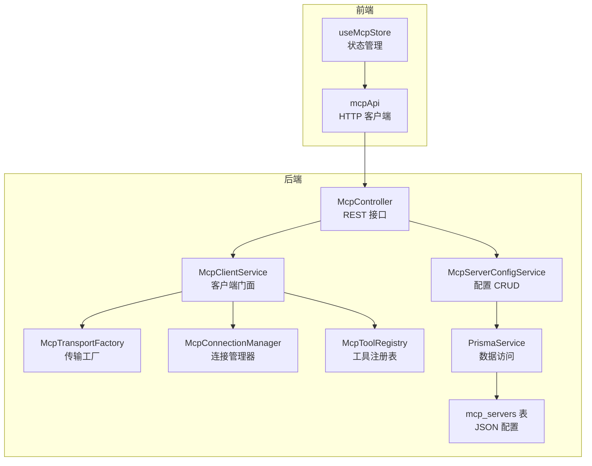
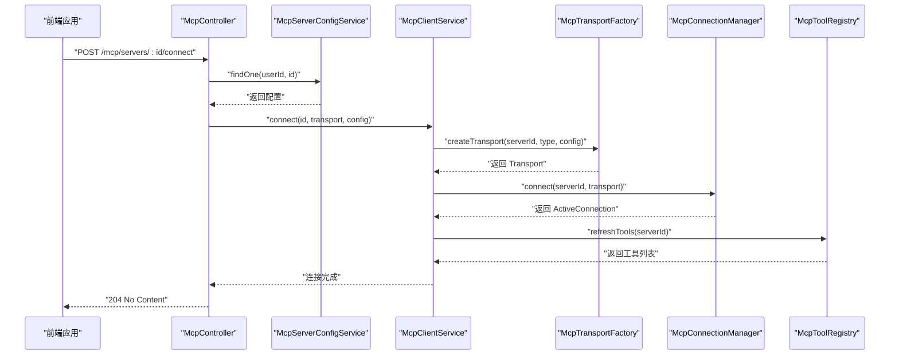
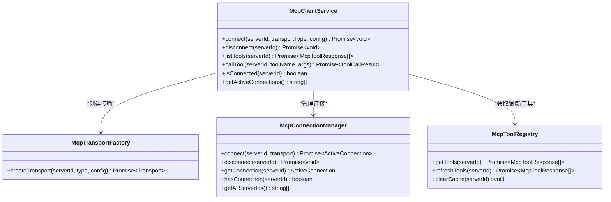
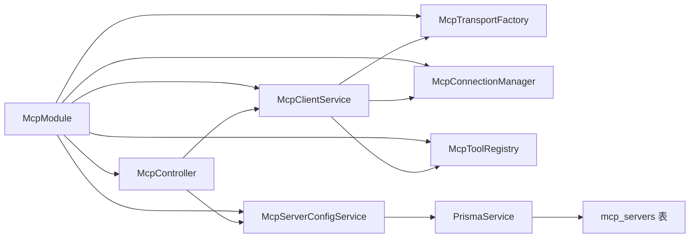
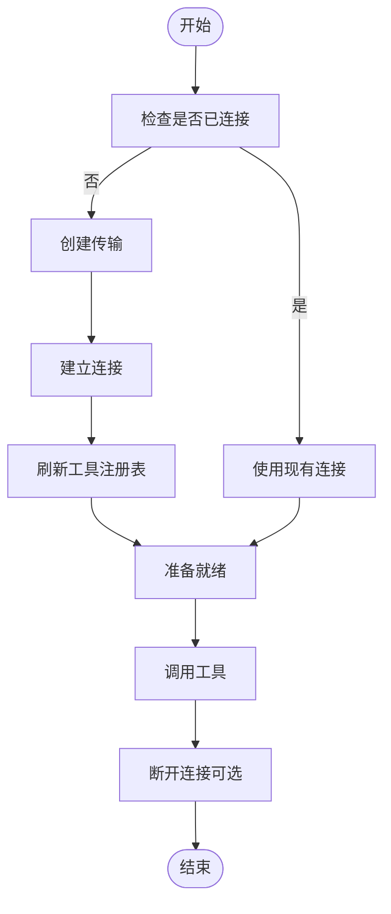

# MCP协议实现

<cite>
**本文档引用的文件**
- [apps/backend/src/mcp/mcp.module.ts](file://apps/backend/src/mcp/mcp.module.ts)
- [apps/backend/src/mcp/mcp.controller.ts](file://apps/backend/src/mcp/mcp.controller.ts)
- [apps/backend/src/mcp/mcp-client.service.ts](file://apps/backend/src/mcp/mcp-client.service.ts)
- [apps/backend/src/mcp/mcp-server-config.service.ts](file://apps/backend/src/mcp/mcp-server-config.service.ts)
- [apps/backend/src/mcp/mcp.dto.ts](file://apps/backend/src/mcp/mcp.dto.ts)
- [apps/backend/src/mcp/core/mcp-transport.factory.ts](file://apps/backend/src/mcp/core/mcp-transport.factory.ts)
- [apps/backend/src/mcp/core/mcp-connection.manager.ts](file://apps/backend/src/mcp/core/mcp-connection.manager.ts)
- [apps/backend/src/mcp/core/mcp-tool.registry.ts](file://apps/backend/src/mcp/core/mcp-tool.registry.ts)
- [packages/shared/src/schemas/mcp.schema.ts](file://packages/shared/src/schemas/mcp.schema.ts)
- [apps/backend/prisma/schema/mcp.prisma](file://apps/backend/prisma/schema/mcp.prisma)
- [apps/frontend/src/features/mcp/stores/mcp.ts](file://apps/frontend/src/features/mcp/stores/mcp.ts)
- [apps/frontend/src/features/mcp/api/mcp.ts](file://apps/frontend/src/features/mcp/api/mcp.ts)
- [apps/backend/tests/mcp/mcp-client.service.spec.ts](file://apps/backend/tests/mcp/mcp-client.service.spec.ts)
- [apps/backend/tests/mcp/mcp-server-config.service.spec.ts](file://apps/backend/tests/mcp/mcp-server-config.service.spec.ts)
</cite>

## 目录
1. [简介](#简介)
2. [项目结构](#项目结构)
3. [核心组件](#核心组件)
4. [架构总览](#架构总览)
5. [详细组件分析](#详细组件分析)
6. [依赖关系分析](#依赖关系分析)
7. [性能考量](#性能考量)
8. [故障排查指南](#故障排查指南)
9. [结论](#结论)
10. [附录](#附录)

## 简介
本文件系统性地文档化了 Model Context Protocol（MCP）协议在本项目中的实现，涵盖协议核心概念、通信机制、消息格式、连接管理器实现原理、传输工厂设计模式、客户端服务接口定义、服务器配置服务功能、连接生命周期管理与错误处理机制。同时提供 MCP 服务器接入指南、配置示例、调试方法、协议扩展点、性能优化策略与安全考虑。

## 项目结构
MCP 功能位于后端 NestJS 应用的模块化子系统中，采用分层与职责分离的设计：
- 控制器层：暴露 REST 接口，负责鉴权、参数校验与业务编排
- 服务层：封装配置管理与客户端交互逻辑
- 核心基础设施：传输工厂、连接管理器、工具注册表
- 数据模型：基于 Prisma 的 MCP 服务器配置持久化
- 前端集成：Pinia Store 与 API 封装，提供连接状态与工具发现能力

**图表来源**
- [apps/backend/src/mcp/mcp.controller.ts:34-197](file://apps/backend/src/mcp/mcp.controller.ts#L34-L197)
- [apps/backend/src/mcp/mcp-client.service.ts:17-123](file://apps/backend/src/mcp/mcp-client.service.ts#L17-L123)
- [apps/backend/src/mcp/core/mcp-transport.factory.ts:10-219](file://apps/backend/src/mcp/core/mcp-transport.factory.ts#L10-L219)
- [apps/backend/src/mcp/core/mcp-connection.manager.ts:12-100](file://apps/backend/src/mcp/core/mcp-connection.manager.ts#L12-L100)
- [apps/backend/src/mcp/core/mcp-tool.registry.ts:5-47](file://apps/backend/src/mcp/core/mcp-tool.registry.ts#L5-L47)
- [apps/backend/src/mcp/mcp-server-config.service.ts:9-155](file://apps/backend/src/mcp/mcp-server-config.service.ts#L9-L155)
- [apps/backend/prisma/schema/mcp.prisma:1-16](file://apps/backend/prisma/schema/mcp.prisma#L1-L16)
- [apps/frontend/src/features/mcp/stores/mcp.ts:15-245](file://apps/frontend/src/features/mcp/stores/mcp.ts#L15-L245)
- [apps/frontend/src/features/mcp/api/mcp.ts:16-107](file://apps/frontend/src/features/mcp/api/mcp.ts#L16-L107)

**章节来源**
- [apps/backend/src/mcp/mcp.module.ts:1-24](file://apps/backend/src/mcp/mcp.module.ts#L1-L24)

## 核心组件
- 控制器（McpController）：提供 MCP 服务器配置的增删改查、连接/断开、工具发现与调用等 REST 接口；内置 JWT 鉴权与用户作用域校验
- 配置服务（McpServerConfigService）：封装 Prisma 对 mcp_servers 表的读写，支持按用户过滤、启用状态筛选与所有权校验
- 客户端服务（McpClientService）：门面类，协调传输工厂、连接管理器与工具注册表，提供连接、断开、工具列表与工具调用能力
- 传输工厂（McpTransportFactory）：根据传输类型（STDIO/HTTP）创建对应传输层，内置安全检查与环境变量白名单控制
- 连接管理器（McpConnectionManager）：维护活跃连接映射，负责 Client 实例创建、连接建立、关闭与生命周期事件处理
- 工具注册表（McpToolRegistry）：缓存工具清单，提供刷新与清理能力，支持懒加载与错误降级
- 数据传输对象（DTO）：基于共享 Zod Schema 的后端 DTO，补充时间字段类型
- 前端 Store/API：提供 MCP 服务器配置与连接状态管理、工具发现与调用的前端集成

**章节来源**
- [apps/backend/src/mcp/mcp.controller.ts:34-197](file://apps/backend/src/mcp/mcp.controller.ts#L34-L197)
- [apps/backend/src/mcp/mcp-server-config.service.ts:9-155](file://apps/backend/src/mcp/mcp-server-config.service.ts#L9-L155)
- [apps/backend/src/mcp/mcp-client.service.ts:17-123](file://apps/backend/src/mcp/mcp-client.service.ts#L17-L123)
- [apps/backend/src/mcp/core/mcp-transport.factory.ts:10-219](file://apps/backend/src/mcp/core/mcp-transport.factory.ts#L10-L219)
- [apps/backend/src/mcp/core/mcp-connection.manager.ts:12-100](file://apps/backend/src/mcp/core/mcp-connection.manager.ts#L12-L100)
- [apps/backend/src/mcp/core/mcp-tool.registry.ts:5-47](file://apps/backend/src/mcp/core/mcp-tool.registry.ts#L5-L47)
- [apps/backend/src/mcp/mcp.dto.ts:1-59](file://apps/backend/src/mcp/mcp.dto.ts#L1-L59)
- [apps/frontend/src/features/mcp/stores/mcp.ts:15-245](file://apps/frontend/src/features/mcp/stores/mcp.ts#L15-L245)
- [apps/frontend/src/features/mcp/api/mcp.ts:16-107](file://apps/frontend/src/features/mcp/api/mcp.ts#L16-L107)

## 架构总览
下图展示了从控制器到客户端服务、再到传输工厂与连接管理器的整体调用链路，以及工具注册表的协作关系。

**图表来源**
- [apps/backend/src/mcp/mcp.controller.ts:134-140](file://apps/backend/src/mcp/mcp.controller.ts#L134-L140)
- [apps/backend/src/mcp/mcp-client.service.ts:33-47](file://apps/backend/src/mcp/mcp-client.service.ts#L33-L47)
- [apps/backend/src/mcp/core/mcp-transport.factory.ts:112-126](file://apps/backend/src/mcp/core/mcp-transport.factory.ts#L112-L126)
- [apps/backend/src/mcp/core/mcp-connection.manager.ts:23-73](file://apps/backend/src/mcp/core/mcp-connection.manager.ts#L23-L73)
- [apps/backend/src/mcp/core/mcp-tool.registry.ts:20-42](file://apps/backend/src/mcp/core/mcp-tool.registry.ts#L20-L42)

## 详细组件分析

### 控制器（McpController）
- 职责边界清晰：仅负责鉴权、参数解析、调用服务层并返回结果
- 用户作用域：所有操作均通过当前用户上下文进行权限校验
- 连接策略：工具发现与调用前进行懒连接（未连接则自动连接）
- 错误处理：对各步骤失败进行日志记录与异常抛出

关键接口要点
- 创建/更新/删除 MCP 服务器配置
- 获取全部/单个配置
- 连接/断开指定服务器
- 发现工具（单服务器与全启用服务器聚合）
- 调用工具

**章节来源**
- [apps/backend/src/mcp/mcp.controller.ts:34-197](file://apps/backend/src/mcp/mcp.controller.ts#L34-L197)

### 配置服务（McpServerConfigService）
- 数据持久化：基于 Prisma 的 mcp_servers 表，JSON 字段存储传输配置
- 权限控制：通过 userId 约束与所有权校验，防止越权访问
- 查询优化：支持按用户查询、启用状态筛选与时间排序
- 响应转换：将数据库实体转换为后端 DTO（含 Date 类型）

**章节来源**
- [apps/backend/src/mcp/mcp-server-config.service.ts:9-155](file://apps/backend/src/mcp/mcp-server-config.service.ts#L9-L155)
- [apps/backend/prisma/schema/mcp.prisma:1-16](file://apps/backend/prisma/schema/mcp.prisma#L1-L16)

### 客户端服务（McpClientService）
- 门面模式：统一对外暴露连接、断开、工具列表与工具调用接口
- 生命周期：连接成功后预热工具注册表，断开时清理缓存
- 安全前置：调用工具前校验连接与工具存在性
- 日志可观测：对关键操作进行日志记录

**图表来源**
- [apps/backend/src/mcp/mcp-client.service.ts:17-123](file://apps/backend/src/mcp/mcp-client.service.ts#L17-L123)
- [apps/backend/src/mcp/core/mcp-transport.factory.ts:10-219](file://apps/backend/src/mcp/core/mcp-transport.factory.ts#L10-L219)
- [apps/backend/src/mcp/core/mcp-connection.manager.ts:12-100](file://apps/backend/src/mcp/core/mcp-connection.manager.ts#L12-L100)
- [apps/backend/src/mcp/core/mcp-tool.registry.ts:5-47](file://apps/backend/src/mcp/core/mcp-tool.registry.ts#L5-L47)

**章节来源**
- [apps/backend/src/mcp/mcp-client.service.ts:17-123](file://apps/backend/src/mcp/mcp-client.service.ts#L17-L123)

### 传输工厂（McpTransportFactory）
- 传输类型：STDIO 与 HTTP 两种
- 安全策略：
  - STDIO：支持 NODE_ENV 与 MCP_ENABLE_STDIO 控制，生产环境必须配置 MCP_STDIO_ALLOWED_COMMANDS 白名单
  - HTTP：仅允许 http/https，禁止 localhost、.local、私网 IP 与回环地址；域名解析后再次校验
- 环境变量：透传 PATH/HOME 等关键环境变量，支持自定义 env 覆盖
- 认证头：支持 Bearer/OAuth/API Key 自动注入 Authorization/X-API-Key

**章节来源**
- [apps/backend/src/mcp/core/mcp-transport.factory.ts:10-219](file://apps/backend/src/mcp/core/mcp-transport.factory.ts#L10-L219)

### 连接管理器（McpConnectionManager）
- 连接映射：Map<serverId, ActiveConnection>
- 生命周期：
  - connect：创建 Client，绑定传输，监听 stderr/onclose/onerror
  - disconnect：关闭 Client 并清理映射
  - onModuleDestroy：模块销毁时逐个断开
- 超时与稳定性：Client 构造选项包含 requestTimeout

**章节来源**
- [apps/backend/src/mcp/core/mcp-connection.manager.ts:12-100](file://apps/backend/src/mcp/core/mcp-connection.manager.ts#L12-L100)

### 工具注册表（McpToolRegistry）
- 缓存策略：Map<serverId, tools[]>
- 刷新逻辑：调用 Client.listTools 并标准化输出
- 错误降级：刷新失败时返回缓存或空数组，避免阻塞主流程
- 清理策略：断连时清除缓存

**章节来源**
- [apps/backend/src/mcp/core/mcp-tool.registry.ts:5-47](file://apps/backend/src/mcp/core/mcp-tool.registry.ts#L5-L47)

### 数据传输对象（DTO）
- 后端 DTO 继承共享 Schema，额外将 createdAt/updatedAt 映射为 Date 类型
- 传输配置类型：StdioConfig、HttpConfig
- 工具调用参数：name 必填，arguments 可选默认为空对象

**章节来源**
- [apps/backend/src/mcp/mcp.dto.ts:1-59](file://apps/backend/src/mcp/mcp.dto.ts#L1-L59)
- [packages/shared/src/schemas/mcp.schema.ts:1-220](file://packages/shared/src/schemas/mcp.schema.ts#L1-L220)

### 前端集成
- Store：集中管理服务器列表、连接状态、连接中状态与错误信息
- 自动连接：启用且未连接时自动尝试连接
- 运行时变更：当传输类型或配置变化时，自动断开并重建连接
- API：封装 GET/POST /mcp/* 请求，统一超时策略

**章节来源**
- [apps/frontend/src/features/mcp/stores/mcp.ts:15-245](file://apps/frontend/src/features/mcp/stores/mcp.ts#L15-L245)
- [apps/frontend/src/features/mcp/api/mcp.ts:16-107](file://apps/frontend/src/features/mcp/api/mcp.ts#L16-L107)

## 依赖关系分析
- 模块装配：McpModule 导出配置服务与客户端服务，供其他模块使用
- 控制器依赖：McpController 依赖配置服务与客户端服务
- 客户端服务依赖：传输工厂、连接管理器、工具注册表
- 数据层：配置服务依赖 PrismaService，持久化至 mcp_servers 表

**图表来源**
- [apps/backend/src/mcp/mcp.module.ts:13-22](file://apps/backend/src/mcp/mcp.module.ts#L13-L22)
- [apps/backend/src/mcp/mcp.controller.ts:37-40](file://apps/backend/src/mcp/mcp.controller.ts#L37-L40)
- [apps/backend/src/mcp/mcp-client.service.ts:21-28](file://apps/backend/src/mcp/mcp-client.service.ts#L21-L28)
- [apps/backend/src/mcp/mcp-server-config.service.ts:13-13](file://apps/backend/src/mcp/mcp-server-config.service.ts#L13-L13)
- [apps/backend/prisma/schema/mcp.prisma:1-16](file://apps/backend/prisma/schema/mcp.prisma#L1-L16)

**章节来源**
- [apps/backend/src/mcp/mcp.module.ts:1-24](file://apps/backend/src/mcp/mcp.module.ts#L1-L24)

## 性能考量
- 连接复用：连接管理器对同一 serverId 重复连接时先断开再重连，避免资源泄漏
- 工具缓存：工具注册表缓存工具清单，减少频繁查询
- 懒连接：工具发现与调用前按需连接，降低无用连接成本
- 超时配置：客户端调用与连接分别设置合理超时，避免长时间阻塞
- 前端状态：Store 中区分“连接中”与“已连接”，避免重复连接请求

[本节为通用性能建议，不直接分析具体文件]

## 故障排查指南
常见问题与定位思路
- 无法连接 MCP 服务器
  - 检查传输类型与配置是否匹配（STDIO/HTTP）
  - 查看传输工厂的安全限制（STDIO 白名单、HTTP 协议与主机限制）
  - 关注连接管理器的日志（stderr/onclose/onerror）
- 工具不可见或调用失败
  - 确认客户端已连接且工具注册表已刷新
  - 校验工具名称是否正确
  - 检查工具调用参数类型与必填项
- 权限与所有权
  - 确认当前用户与服务器配置的 userId 一致
  - 更新/删除前先进行 findOne 校验
- 前端连接状态异常
  - Store 中查看 connectingStates 与 serverErrors
  - 使用 API 层的超时与错误提示定位问题

**章节来源**
- [apps/backend/src/mcp/core/mcp-transport.factory.ts:91-110](file://apps/backend/src/mcp/core/mcp-transport.factory.ts#L91-L110)
- [apps/backend/src/mcp/core/mcp-connection.manager.ts:44-58](file://apps/backend/src/mcp/core/mcp-connection.manager.ts#L44-L58)
- [apps/backend/src/mcp/mcp-client.service.ts:74-108](file://apps/backend/src/mcp/mcp-client.service.ts#L74-L108)
- [apps/frontend/src/features/mcp/stores/mcp.ts:175-202](file://apps/frontend/src/features/mcp/stores/mcp.ts#L175-L202)

## 结论
本实现以模块化与分层设计为核心，结合传输工厂的安全策略、连接管理器的生命周期控制与工具注册表的缓存机制，提供了稳定、可扩展的 MCP 协议接入能力。前后端协同通过 Store 与 API 封装，实现了便捷的服务器配置、连接管理与工具调用体验。建议在生产环境中严格配置 STDIO 白名单与 HTTP 安全策略，并结合日志与监控持续优化连接与工具调用性能。

[本节为总结性内容，不直接分析具体文件]

## 附录

### MCP 协议核心概念与消息格式
- 传输类型
  - STDIO：通过进程命令行启动 MCP 服务器，支持环境变量与工作目录配置
  - HTTP：通过可公开访问的 HTTP(S) 端点连接，支持 Bearer/OAuth/API Key 认证
- 工具发现与调用
  - 工具发现：Client.listTools 返回工具清单（名称、描述、输入 Schema）
  - 工具调用：Client.callTool(name, arguments) 返回内容数组与错误标记
- 状态同步
  - 前端 Store 维护连接状态与错误信息，后端控制器在懒连接场景自动建立连接

**章节来源**
- [packages/shared/src/schemas/mcp.schema.ts:184-220](file://packages/shared/src/schemas/mcp.schema.ts#L184-L220)
- [apps/backend/src/mcp/core/mcp-tool.registry.ts:20-42](file://apps/backend/src/mcp/core/mcp-tool.registry.ts#L20-L42)

### 连接生命周期管理

**图表来源**
- [apps/backend/src/mcp/mcp-client.service.ts:33-108](file://apps/backend/src/mcp/mcp-client.service.ts#L33-L108)
- [apps/backend/src/mcp/core/mcp-connection.manager.ts:23-73](file://apps/backend/src/mcp/core/mcp-connection.manager.ts#L23-L73)
- [apps/backend/src/mcp/core/mcp-tool.registry.ts:20-42](file://apps/backend/src/mcp/core/mcp-tool.registry.ts#L20-L42)

### MCP 服务器接入指南
- 后端配置
  - 在 mcp_servers 表中创建服务器配置（名称、描述、传输类型、配置、启用状态）
  - 确保传输配置与类型匹配（STDIO/HTTP）
- 前端接入
  - 通过 Store 创建/更新/删除服务器配置
  - 启用服务器后自动尝试连接；连接失败可在 Store 中查看错误信息
  - 使用 API 获取工具列表并调用工具

**章节来源**
- [apps/backend/src/mcp/mcp-server-config.service.ts:18-33](file://apps/backend/src/mcp/mcp-server-config.service.ts#L18-L33)
- [apps/frontend/src/features/mcp/stores/mcp.ts:89-111](file://apps/frontend/src/features/mcp/stores/mcp.ts#L89-L111)
- [apps/frontend/src/features/mcp/api/mcp.ts:36-47](file://apps/frontend/src/features/mcp/api/mcp.ts#L36-L47)

### 配置示例
- STDIO 配置
  - command：可执行文件路径（不含空格，建议使用绝对路径或明确的 PATH）
  - args：参数数组
  - env：环境变量覆盖
  - cwd：工作目录
- HTTP 配置
  - url：http/https 地址（必须可公开访问）
  - headers：自定义请求头
  - auth：type 支持 bearer/oauth/api_key，token 或 apiKey 二选一

**章节来源**
- [packages/shared/src/schemas/mcp.schema.ts:79-118](file://packages/shared/src/schemas/mcp.schema.ts#L79-L118)
- [apps/backend/src/mcp/core/mcp-transport.factory.ts:189-218](file://apps/backend/src/mcp/core/mcp-transport.factory.ts#L189-L218)

### 调试方法
- 后端日志
  - 控制器：记录连接/断开/工具发现/调用过程
  - 传输工厂：记录命令拼装、环境变量与安全检查结果
  - 连接管理器：记录 stderr 输出、连接关闭与错误
- 前端状态
  - Store 中 connectingStates 与 serverErrors 用于定位问题
  - API 超时设置有助于识别慢响应场景

**章节来源**
- [apps/backend/src/mcp/mcp.controller.ts:35-197](file://apps/backend/src/mcp/mcp.controller.ts#L35-L197)
- [apps/backend/src/mcp/core/mcp-transport.factory.ts:177-187](file://apps/backend/src/mcp/core/mcp-transport.factory.ts#L177-L187)
- [apps/backend/src/mcp/core/mcp-connection.manager.ts:44-58](file://apps/backend/src/mcp/core/mcp-connection.manager.ts#L44-L58)
- [apps/frontend/src/features/mcp/stores/mcp.ts:175-202](file://apps/frontend/src/features/mcp/stores/mcp.ts#L175-L202)

### 协议扩展点
- 传输类型扩展：可在传输工厂中新增传输类型并实现相应安全策略
- 工具调用增强：工具注册表可扩展输入参数校验与结果归一化
- 连接策略：连接管理器可增加重连策略与心跳检测

**章节来源**
- [apps/backend/src/mcp/core/mcp-transport.factory.ts:112-126](file://apps/backend/src/mcp/core/mcp-transport.factory.ts#L112-L126)
- [apps/backend/src/mcp/core/mcp-tool.registry.ts:20-42](file://apps/backend/src/mcp/core/mcp-tool.registry.ts#L20-L42)
- [apps/backend/src/mcp/core/mcp-connection.manager.ts:23-73](file://apps/backend/src/mcp/core/mcp-connection.manager.ts#L23-L73)

### 安全考虑
- STDIO 限制：生产环境必须配置 MCP_STDIO_ALLOWED_COMMANDS 白名单，避免任意命令执行
- HTTP 限制：仅允许 http/https，禁止 localhost、.local、私网与回环地址；域名解析后二次校验
- 认证头注入：自动注入 Authorization 或 X-API-Key，避免明文泄露
- 权限控制：后端严格校验用户所有权，防止越权访问

**章节来源**
- [apps/backend/src/mcp/core/mcp-transport.factory.ts:67-89](file://apps/backend/src/mcp/core/mcp-transport.factory.ts#L67-L89)
- [apps/backend/src/mcp/core/mcp-transport.factory.ts:91-110](file://apps/backend/src/mcp/core/mcp-transport.factory.ts#L91-L110)
- [apps/backend/src/mcp/mcp-server-config.service.ts:114-127](file://apps/backend/src/mcp/mcp-server-config.service.ts#L114-L127)