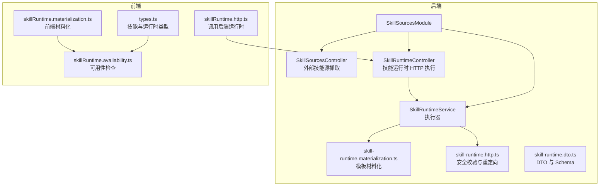
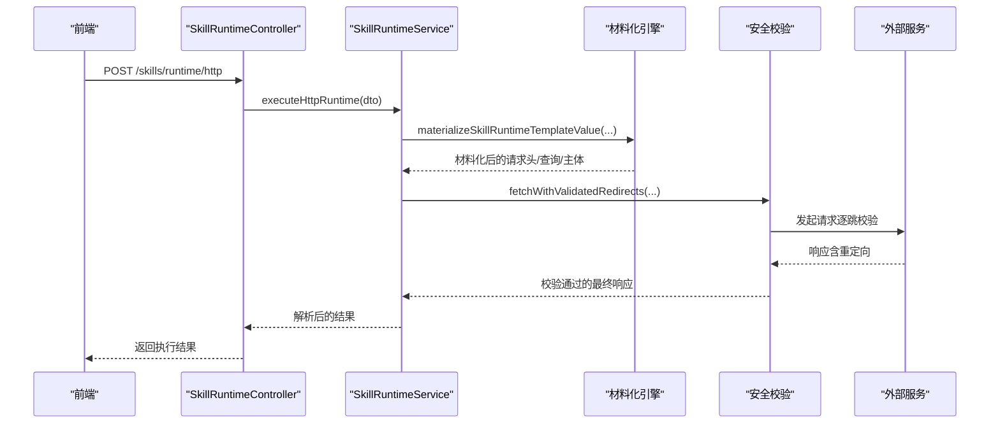
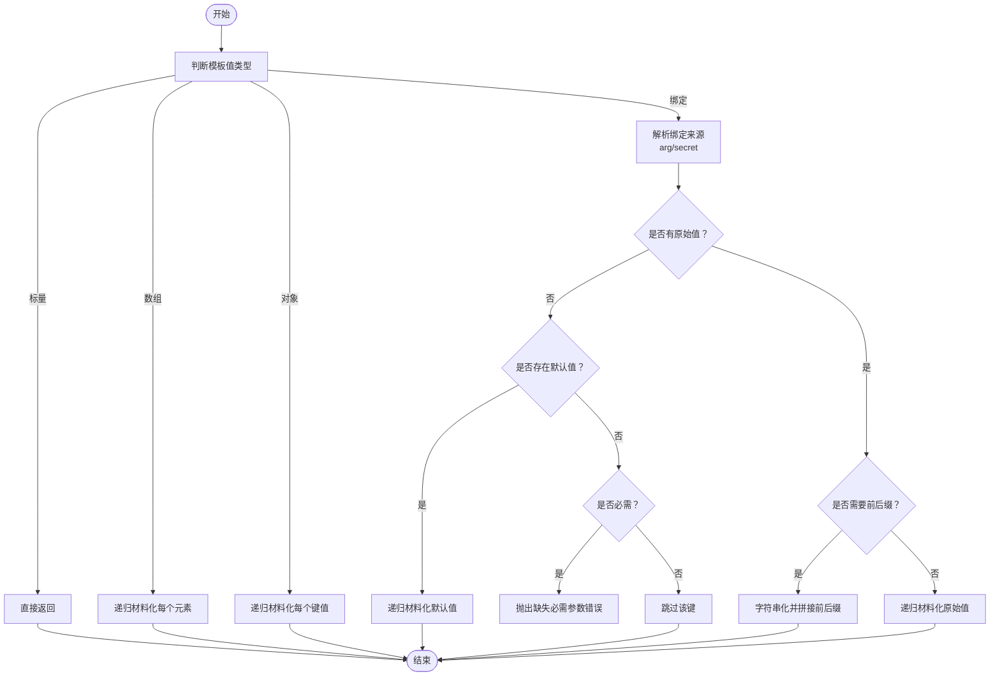
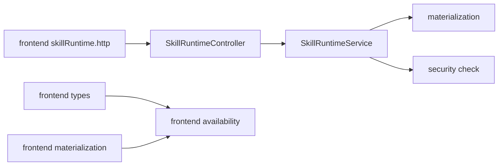

# 技能源管理

<cite>
**本文引用的文件**
- [apps/backend/src/skill-sources/skill-runtime.controller.ts](file://apps/backend/src/skill-sources/skill-runtime.controller.ts)
- [apps/backend/src/skill-sources/skill-runtime.service.ts](file://apps/backend/src/skill-sources/skill-runtime.service.ts)
- [apps/backend/src/skill-sources/skill-runtime.materialization.ts](file://apps/backend/src/skill-sources/skill-runtime.materialization.ts)
- [apps/backend/src/skill-sources/skill-runtime.dto.ts](file://apps/backend/src/skill-sources/skill-runtime.dto.ts)
- [apps/backend/src/skill-sources/skill-runtime.http.ts](file://apps/backend/src/skill-sources/skill-runtime.http.ts)
- [apps/backend/src/skill-sources/skill-sources.controller.ts](file://apps/backend/src/skill-sources/skill-sources.controller.ts)
- [apps/backend/src/skill-sources/skill-sources.module.ts](file://apps/backend/src/skill-sources/skill-sources.module.ts)
- [apps/backend/tests/skill-runtime.controller.spec.ts](file://apps/backend/tests/skill-runtime.controller.spec.ts)
- [apps/backend/tests/skill-runtime.service.spec.ts](file://apps/backend/tests/skill-runtime.service.spec.ts)
- [apps/frontend/src/features/ai/services/utils/skillRuntime.http.ts](file://apps/frontend/src/features/ai/services/utils/skillRuntime.http.ts)
- [apps/frontend/src/features/ai/services/types.ts](file://apps/frontend/src/features/ai/services/types.ts)
- [apps/frontend/src/features/ai/services/utils/skillRuntime.availability.ts](file://apps/frontend/src/features/ai/services/utils/skillRuntime.availability.ts)
- [apps/frontend/src/features/ai/services/utils/skillRuntime.materialization.ts](file://apps/frontend/src/features/ai/services/utils/skillRuntime.materialization.ts)
- [apps/frontend/src/features/ai/services/utils/skillRuntime.ts](file://apps/frontend/src/features/ai/services/utils/skillRuntime.ts)
</cite>

## 目录
1. [简介](#简介)
2. [项目结构](#项目结构)
3. [核心组件](#核心组件)
4. [架构总览](#架构总览)
5. [详细组件分析](#详细组件分析)
6. [依赖关系分析](#依赖关系分析)
7. [性能考量](#性能考量)
8. [故障排查指南](#故障排查指南)
9. [结论](#结论)
10. [附录](#附录)

## 简介
本文件面向“技能源管理系统”，系统性阐述技能运行时服务的架构设计、技能材料化机制、HTTP 接口实现与安全校验；文档还覆盖技能清单管理、动态加载机制、配置管理、可用性检查、材料化流程、数据结构与元数据管理、版本控制建议、开发规范、接口定义、测试方法、缓存策略、性能优化、错误处理、扩展指南、调试工具与监控指标等。

## 项目结构
后端采用 NestJS 模块化组织，技能相关能力集中在 skill-sources 子模块中，包含技能来源抓取、技能运行时 HTTP 执行、运行时模板材料化与安全校验等职责。前端 AI 功能通过工具函数与类型定义对接后端运行时能力，并提供技能可用性检查与工具构建。

图表来源
- [apps/backend/src/skill-sources/skill-sources.module.ts:1-11](file://apps/backend/src/skill-sources/skill-sources.module.ts#L1-L11)
- [apps/backend/src/skill-sources/skill-runtime.controller.ts:1-20](file://apps/backend/src/skill-sources/skill-runtime.controller.ts#L1-L20)
- [apps/backend/src/skill-sources/skill-runtime.service.ts:1-97](file://apps/backend/src/skill-sources/skill-runtime.service.ts#L1-L97)
- [apps/backend/src/skill-sources/skill-runtime.materialization.ts:1-183](file://apps/backend/src/skill-sources/skill-runtime.materialization.ts#L1-L183)
- [apps/backend/src/skill-sources/skill-runtime.http.ts:1-123](file://apps/backend/src/skill-sources/skill-runtime.http.ts#L1-L123)
- [apps/backend/src/skill-sources/skill-runtime.dto.ts:1-98](file://apps/backend/src/skill-sources/skill-runtime.dto.ts#L1-L98)
- [apps/frontend/src/features/ai/services/utils/skillRuntime.http.ts:1-33](file://apps/frontend/src/features/ai/services/utils/skillRuntime.http.ts#L1-L33)
- [apps/frontend/src/features/ai/services/types.ts:1-200](file://apps/frontend/src/features/ai/services/types.ts#L1-L200)
- [apps/frontend/src/features/ai/services/utils/skillRuntime.availability.ts:89-208](file://apps/frontend/src/features/ai/services/utils/skillRuntime.availability.ts#L89-L208)
- [apps/frontend/src/features/ai/services/utils/skillRuntime.materialization.ts:169-211](file://apps/frontend/src/features/ai/services/utils/skillRuntime.materialization.ts#L169-L211)

章节来源
- [apps/backend/src/skill-sources/skill-sources.module.ts:1-11](file://apps/backend/src/skill-sources/skill-sources.module.ts#L1-L11)
- [apps/backend/src/skill-sources/skill-runtime.controller.ts:1-20](file://apps/backend/src/skill-sources/skill-runtime.controller.ts#L1-L20)
- [apps/backend/src/skill-sources/skill-runtime.service.ts:1-97](file://apps/backend/src/skill-sources/skill-runtime.service.ts#L1-L97)
- [apps/backend/src/skill-sources/skill-runtime.materialization.ts:1-183](file://apps/backend/src/skill-sources/skill-runtime.materialization.ts#L1-L183)
- [apps/backend/src/skill-sources/skill-runtime.http.ts:1-123](file://apps/backend/src/skill-sources/skill-runtime.http.ts#L1-L123)
- [apps/backend/src/skill-sources/skill-runtime.dto.ts:1-98](file://apps/backend/src/skill-sources/skill-runtime.dto.ts#L1-L98)
- [apps/frontend/src/features/ai/services/utils/skillRuntime.http.ts:1-33](file://apps/frontend/src/features/ai/services/utils/skillRuntime.http.ts#L1-L33)
- [apps/frontend/src/features/ai/services/types.ts:1-200](file://apps/frontend/src/features/ai/services/types.ts#L1-L200)
- [apps/frontend/src/features/ai/services/utils/skillRuntime.availability.ts:89-208](file://apps/frontend/src/features/ai/services/utils/skillRuntime.availability.ts#L89-L208)
- [apps/frontend/src/features/ai/services/utils/skillRuntime.materialization.ts:169-211](file://apps/frontend/src/features/ai/services/utils/skillRuntime.materialization.ts#L169-L211)

## 核心组件
- 技能来源控制器：提供外部技能源抓取能力，支持可信域名白名单、最大体积限制、超时与重定向安全校验。
- 技能运行时控制器：受 JWT 保护的 HTTP 运行时入口，负责将请求转发给运行时服务。
- 技能运行时服务：执行 HTTP 技能运行时，完成模板材料化、参数绑定、安全校验、重定向处理、响应解析与异常包装。
- 材料化引擎：将模板值中的占位符绑定到参数或密钥，支持默认值、前缀/后缀拼接、嵌套对象与数组递归处理。
- 安全校验：对目标主机进行 DNS 解析与地址段判定，阻断私有/回环地址与 localhost，手动跟随有限次重定向并逐跳校验。
- DTO 与 Schema：统一输入输出结构，约束字段长度、枚举、必填项与嵌套层级上限。
- 前端对接：提供运行时调用封装、类型定义、可用性检查与工具构建。

章节来源
- [apps/backend/src/skill-sources/skill-sources.controller.ts:1-200](file://apps/backend/src/skill-sources/skill-sources.controller.ts#L1-L200)
- [apps/backend/src/skill-sources/skill-runtime.controller.ts:1-20](file://apps/backend/src/skill-sources/skill-runtime.controller.ts#L1-L20)
- [apps/backend/src/skill-sources/skill-runtime.service.ts:1-97](file://apps/backend/src/skill-sources/skill-runtime.service.ts#L1-L97)
- [apps/backend/src/skill-sources/skill-runtime.materialization.ts:1-183](file://apps/backend/src/skill-sources/skill-runtime.materialization.ts#L1-L183)
- [apps/backend/src/skill-sources/skill-runtime.http.ts:1-123](file://apps/backend/src/skill-sources/skill-runtime.http.ts#L1-L123)
- [apps/backend/src/skill-sources/skill-runtime.dto.ts:1-98](file://apps/backend/src/skill-sources/skill-runtime.dto.ts#L1-L98)
- [apps/frontend/src/features/ai/services/utils/skillRuntime.http.ts:1-33](file://apps/frontend/src/features/ai/services/utils/skillRuntime.http.ts#L1-L33)
- [apps/frontend/src/features/ai/services/types.ts:1-200](file://apps/frontend/src/features/ai/services/types.ts#L1-L200)

## 架构总览
后端通过模块化组织技能相关功能，前端以工具函数与类型对接后端运行时。运行时执行链路包括：鉴权 -> 控制器 -> 服务 -> 材料化 -> 安全校验 -> 外部请求 -> 响应解析 -> 返回结果。

图表来源
- [apps/backend/src/skill-sources/skill-runtime.controller.ts:1-20](file://apps/backend/src/skill-sources/skill-runtime.controller.ts#L1-L20)
- [apps/backend/src/skill-sources/skill-runtime.service.ts:1-97](file://apps/backend/src/skill-sources/skill-runtime.service.ts#L1-L97)
- [apps/backend/src/skill-sources/skill-runtime.materialization.ts:1-183](file://apps/backend/src/skill-sources/skill-runtime.materialization.ts#L1-L183)
- [apps/backend/src/skill-sources/skill-runtime.http.ts:1-123](file://apps/backend/src/skill-sources/skill-runtime.http.ts#L1-L123)
- [apps/frontend/src/features/ai/services/utils/skillRuntime.http.ts:1-33](file://apps/frontend/src/features/ai/services/utils/skillRuntime.http.ts#L1-L33)

## 详细组件分析

### 技能来源控制器（外部技能源抓取）
- 职责：代理抓取外部技能资源，支持可信域名白名单、最大体积限制、超时控制、手动重定向与逐跳校验。
- 关键点：
  - 可信主机集合与协议校验，拒绝非 http/https。
  - 最大字节数限制与流式读取，避免内存膨胀。
  - 限定最大重定向次数，确保安全性。
  - 统一异常包装，区分业务错误与网关错误。

章节来源
- [apps/backend/src/skill-sources/skill-sources.controller.ts:1-200](file://apps/backend/src/skill-sources/skill-sources.controller.ts#L1-L200)

### 技能运行时控制器（HTTP 执行入口）
- 职责：受 JWT 保护的 HTTP 入口，将请求委托给运行时服务。
- 关键点：
  - 使用 JwtAuthGuard 保护路由。
  - 将 DTO 直接透传至服务层执行。

章节来源
- [apps/backend/src/skill-sources/skill-runtime.controller.ts:1-20](file://apps/backend/src/skill-sources/skill-runtime.controller.ts#L1-L20)
- [apps/backend/tests/skill-runtime.controller.spec.ts:1-38](file://apps/backend/tests/skill-runtime.controller.spec.ts#L1-L38)

### 技能运行时服务（执行器）
- 职责：执行 HTTP 技能运行时，完成材料化、参数绑定、安全校验、重定向处理、响应解析与异常包装。
- 关键点：
  - 材料化上下文包含运行时定义、参数映射、提供的密钥与技能名。
  - 对请求头与查询参数进行对象校验，确保材料化结果为对象。
  - 默认超时与 AbortController，避免悬挂请求。
  - 响应类型支持 text/json，默认 json。
  - 统一异常包装，区分客户端错误与上游错误。

章节来源
- [apps/backend/src/skill-sources/skill-runtime.service.ts:1-97](file://apps/backend/src/skill-sources/skill-runtime.service.ts#L1-L97)
- [apps/backend/tests/skill-runtime.service.spec.ts:1-342](file://apps/backend/tests/skill-runtime.service.spec.ts#L1-L342)

### 材料化引擎（模板值绑定）
- 职责：将模板中的占位符绑定到参数或密钥，支持默认值、前缀/后缀拼接、嵌套对象与数组递归处理。
- 关键点：
  - 支持标量、数组、对象与绑定四类模板值。
  - 绑定来源分为 arg 与 secret，支持 required/default/prefix/suffix。
  - 缺失必填项时抛出 BadRequestException。
  - 字符串化仅在必要时进行，避免重复序列化。

图表来源
- [apps/backend/src/skill-sources/skill-runtime.materialization.ts:1-183](file://apps/backend/src/skill-sources/skill-runtime.materialization.ts#L1-L183)

章节来源
- [apps/backend/src/skill-sources/skill-runtime.materialization.ts:1-183](file://apps/backend/src/skill-sources/skill-runtime.materialization.ts#L1-L183)

### 安全校验（DNS 与重定向）
- 职责：阻断 localhost、.local、私有/回环 IP，逐跳校验重定向目标。
- 关键点：
  - 支持 IPv4/IPv6 私有/回环判定。
  - 限定最大重定向次数，重定向时自动调整方法与丢弃主体。
  - 对缺失 Location 的重定向进行错误处理。

章节来源
- [apps/backend/src/skill-sources/skill-runtime.http.ts:1-123](file://apps/backend/src/skill-sources/skill-runtime.http.ts#L1-L123)

### DTO 与 Schema（类型与约束）
- 职责：统一输入输出结构，约束字段长度、枚举、必填项与嵌套层级上限。
- 关键点：
  - HttpSkillRuntimeSchema 严格定义请求方法、响应类型、URL、超时、密钥等。
  - ExecuteHttpSkillRuntimeRequestSchema 严格约束请求体结构。
  - 前端类型与后端 DTO 对齐，保证跨端一致性。

章节来源
- [apps/backend/src/skill-sources/skill-runtime.dto.ts:1-98](file://apps/backend/src/skill-sources/skill-runtime.dto.ts#L1-L98)
- [apps/frontend/src/features/ai/services/types.ts:1-200](file://apps/frontend/src/features/ai/services/types.ts#L1-L200)

### 前端对接（调用与可用性）
- 调用封装：前端通过 httpClient 调用后端运行时接口，设置超时。
- 类型定义：统一 AISkill、AISkillRuntime、AISkillHttpRuntime 等类型。
- 可用性检查：根据运行时类型与配置检查是否可用，缺失密钥时给出提示。
- 材料化：前端同样提供材料化工具，便于本地预览与调试。

章节来源
- [apps/frontend/src/features/ai/services/utils/skillRuntime.http.ts:1-33](file://apps/frontend/src/features/ai/services/utils/skillRuntime.http.ts#L1-L33)
- [apps/frontend/src/features/ai/services/types.ts:1-200](file://apps/frontend/src/features/ai/services/types.ts#L1-L200)
- [apps/frontend/src/features/ai/services/utils/skillRuntime.availability.ts:89-208](file://apps/frontend/src/features/ai/services/utils/skillRuntime.availability.ts#L89-L208)
- [apps/frontend/src/features/ai/services/utils/skillRuntime.materialization.ts:169-211](file://apps/frontend/src/features/ai/services/utils/skillRuntime.materialization.ts#L169-L211)
- [apps/frontend/src/features/ai/services/utils/skillRuntime.ts:1-9](file://apps/frontend/src/features/ai/services/utils/skillRuntime.ts#L1-L9)

## 依赖关系分析
- 后端模块：SkillSourcesModule 导出控制器与服务，形成内聚的技能子域。
- 控制器依赖服务：运行时控制器仅做薄封装，实际逻辑在服务中。
- 服务依赖工具：服务依赖材料化与安全校验工具函数。
- 前端依赖：前端通过工具函数与类型对接后端运行时。

图表来源
- [apps/backend/src/skill-sources/skill-runtime.controller.ts:1-20](file://apps/backend/src/skill-sources/skill-runtime.controller.ts#L1-L20)
- [apps/backend/src/skill-sources/skill-runtime.service.ts:1-97](file://apps/backend/src/skill-sources/skill-runtime.service.ts#L1-L97)
- [apps/backend/src/skill-sources/skill-runtime.materialization.ts:1-183](file://apps/backend/src/skill-sources/skill-runtime.materialization.ts#L1-L183)
- [apps/backend/src/skill-sources/skill-runtime.http.ts:1-123](file://apps/backend/src/skill-sources/skill-runtime.http.ts#L1-L123)
- [apps/frontend/src/features/ai/services/utils/skillRuntime.http.ts:1-33](file://apps/frontend/src/features/ai/services/utils/skillRuntime.http.ts#L1-L33)
- [apps/frontend/src/features/ai/services/types.ts:1-200](file://apps/frontend/src/features/ai/services/types.ts#L1-L200)
- [apps/frontend/src/features/ai/services/utils/skillRuntime.availability.ts:89-208](file://apps/frontend/src/features/ai/services/utils/skillRuntime.availability.ts#L89-L208)
- [apps/frontend/src/features/ai/services/utils/skillRuntime.materialization.ts:169-211](file://apps/frontend/src/features/ai/services/utils/skillRuntime.materialization.ts#L169-L211)

章节来源
- [apps/backend/src/skill-sources/skill-sources.module.ts:1-11](file://apps/backend/src/skill-sources/skill-sources.module.ts#L1-L11)
- [apps/backend/src/skill-sources/skill-runtime.controller.ts:1-20](file://apps/backend/src/skill-sources/skill-runtime.controller.ts#L1-L20)
- [apps/backend/src/skill-sources/skill-runtime.service.ts:1-97](file://apps/backend/src/skill-sources/skill-runtime.service.ts#L1-L97)
- [apps/frontend/src/features/ai/services/utils/skillRuntime.http.ts:1-33](file://apps/frontend/src/features/ai/services/utils/skillRuntime.http.ts#L1-L33)
- [apps/frontend/src/features/ai/services/types.ts:1-200](file://apps/frontend/src/features/ai/services/types.ts#L1-L200)

## 性能考量
- 超时与中断：默认超时与 AbortController 防止长时间等待；测试覆盖了超时场景。
- 流式读取：外部资源抓取使用流式读取与累计大小限制，避免内存峰值。
- 重定向限制：限定最大重定向次数，减少链路开销与风险。
- 材料化优化：仅在必要时进行字符串化，避免重复序列化。
- 前端预览：前端材料化工具可用于本地调试，降低后端压力。

章节来源
- [apps/backend/src/skill-sources/skill-runtime.service.ts:1-97](file://apps/backend/src/skill-sources/skill-runtime.service.ts#L1-L97)
- [apps/backend/src/skill-sources/skill-sources.controller.ts:1-200](file://apps/backend/src/skill-sources/skill-sources.controller.ts#L1-L200)
- [apps/backend/tests/skill-runtime.service.spec.ts:1-342](file://apps/backend/tests/skill-runtime.service.spec.ts#L1-L342)

## 故障排查指南
- 认证失败：确认 JWT 令牌有效且已启用 JwtAuthGuard。
- 参数缺失：检查运行时定义中的 required 与 default 是否满足；密钥缺失会触发 BadRequestException。
- 主机受限：localhost、.local、私有/回环地址会被阻断；请使用公网可访问地址。
- 重定向异常：超过最大重定向次数或缺少 Location 头会触发 BadGatewayException。
- 上游失败：HTTP 非 2xx 会被包装为 BadGatewayException 并截断错误文本。
- 前端调用：检查超时设置与请求体结构，确保与后端 DTO 一致。

章节来源
- [apps/backend/src/skill-sources/skill-runtime.controller.ts:1-20](file://apps/backend/src/skill-sources/skill-runtime.controller.ts#L1-L20)
- [apps/backend/src/skill-sources/skill-runtime.service.ts:1-97](file://apps/backend/src/skill-sources/skill-runtime.service.ts#L1-L97)
- [apps/backend/src/skill-sources/skill-runtime.http.ts:1-123](file://apps/backend/src/skill-sources/skill-runtime.http.ts#L1-L123)
- [apps/backend/tests/skill-runtime.controller.spec.ts:1-38](file://apps/backend/tests/skill-runtime.controller.spec.ts#L1-L38)
- [apps/backend/tests/skill-runtime.service.spec.ts:1-342](file://apps/backend/tests/skill-runtime.service.spec.ts#L1-L342)

## 结论
本系统通过模块化设计与严格的输入/输出约束，实现了安全可控的技能运行时执行链路。材料化机制提供了灵活的参数与密钥绑定能力，安全校验与重定向控制保障了运行时的安全性。前后端类型与工具的对齐提升了开发效率与一致性。建议在生产环境中结合缓存策略与可观测性指标进一步增强稳定性与可维护性。

## 附录

### 技能清单与元数据管理
- 技能清单结构：包含标识、名称、描述、别名、路径、资源、是否允许隐式调用、运行时定义等。
- 元数据管理：前端提供技能清单解析与迁移逻辑，支持从多种字段形态迁移到统一结构。
- 版本控制建议：通过路径与资源字段记录版本信息，配合外部来源抓取实现版本化分发。

章节来源
- [apps/frontend/src/features/ai/services/types.ts:105-115](file://apps/frontend/src/features/ai/services/types.ts#L105-L115)
- [apps/frontend/src/features/ai/services/utils/skillRuntime.availability.ts:89-208](file://apps/frontend/src/features/ai/services/utils/skillRuntime.availability.ts#L89-L208)

### 动态加载机制
- 外部来源抓取：通过受控的外部来源接口获取技能资源，支持最大体积与超时限制。
- 前端解析：解析技能清单与运行时定义，构建工具与可用性检查列表。

章节来源
- [apps/backend/src/skill-sources/skill-sources.controller.ts:1-200](file://apps/backend/src/skill-sources/skill-sources.controller.ts#L1-L200)
- [apps/frontend/src/features/ai/services/utils/skillRuntime.availability.ts:89-208](file://apps/frontend/src/features/ai/services/utils/skillRuntime.availability.ts#L89-L208)

### 配置管理与可用性检查
- 运行时配置：前端提供运行时配置读取与工具构建，按需启用 HTTP/MCP 运行时。
- 可用性检查：根据运行时类型与密钥配置检查可用性，缺失密钥时返回缺失列表。

章节来源
- [apps/frontend/src/features/ai/services/utils/skillRuntime.availability.ts:89-208](file://apps/frontend/src/features/ai/services/utils/skillRuntime.availability.ts#L89-L208)

### HTTP 接口定义
- 运行时执行接口：受 JWT 保护，请求体包含技能名、运行时定义、参数映射与密钥映射。
- 外部来源接口：GET /skills/external-source?url=...，支持可信域名白名单与安全校验。

章节来源
- [apps/backend/src/skill-sources/skill-runtime.controller.ts:1-20](file://apps/backend/src/skill-sources/skill-runtime.controller.ts#L1-L20)
- [apps/backend/src/skill-sources/skill-runtime.dto.ts:84-95](file://apps/backend/src/skill-sources/skill-runtime.dto.ts#L84-L95)
- [apps/backend/src/skill-sources/skill-sources.controller.ts:156-200](file://apps/backend/src/skill-sources/skill-sources.controller.ts#L156-L200)

### 开发规范与测试方法
- 规范：使用 Zod Schema 约束输入，保持前后端类型一致；严格区分 BadRequestException 与 BadGatewayException。
- 测试：控制器测试验证鉴权守卫与委托行为；服务测试覆盖材料化、安全校验、重定向与异常包装等场景。

章节来源
- [apps/backend/tests/skill-runtime.controller.spec.ts:1-38](file://apps/backend/tests/skill-runtime.controller.spec.ts#L1-L38)
- [apps/backend/tests/skill-runtime.service.spec.ts:1-342](file://apps/backend/tests/skill-runtime.service.spec.ts#L1-L342)

### 错误处理机制
- 客户端错误：参数缺失、主机受限、重定向异常等触发 BadRequestException。
- 上游错误：HTTP 非 2xx 包装为 BadGatewayException，截断错误文本防止泄露。
- 异常统一：服务层捕获未知错误并包装为 BadGatewayException。

章节来源
- [apps/backend/src/skill-sources/skill-runtime.service.ts:1-97](file://apps/backend/src/skill-sources/skill-runtime.service.ts#L1-L97)
- [apps/backend/src/skill-sources/skill-runtime.http.ts:1-123](file://apps/backend/src/skill-sources/skill-runtime.http.ts#L1-L123)

### 缓存策略与性能优化
- 前端缓存：对技能清单与运行时定义进行本地缓存，减少重复请求。
- 后端缓存：可结合 Redis 缓存热点技能清单与外部来源内容（需在模块中引入）。
- 超时与中断：合理设置超时与中断，避免资源泄漏。
- 材料化优化：避免重复字符串化，仅在必要时进行序列化。

章节来源
- [apps/backend/src/skill-sources/skill-runtime.service.ts:1-97](file://apps/backend/src/skill-sources/skill-runtime.service.ts#L1-L97)
- [apps/backend/src/skill-sources/skill-sources.controller.ts:1-200](file://apps/backend/src/skill-sources/skill-sources.controller.ts#L1-L200)

### 扩展指南与调试工具
- 扩展运行时：新增运行时类型时，需在 DTO 中定义 Schema，并在前端类型与可用性检查中适配。
- 调试工具：前端材料化工具可用于本地预览运行时模板；后端可通过单元测试覆盖关键分支。
- 监控指标：建议埋点运行时执行耗时、错误率、重定向次数、外部来源抓取成功率等。

章节来源
- [apps/backend/src/skill-sources/skill-runtime.dto.ts:1-98](file://apps/backend/src/skill-sources/skill-runtime.dto.ts#L1-L98)
- [apps/frontend/src/features/ai/services/utils/skillRuntime.materialization.ts:169-211](file://apps/frontend/src/features/ai/services/utils/skillRuntime.materialization.ts#L169-L211)
- [apps/frontend/src/features/ai/services/utils/skillRuntime.availability.ts:89-208](file://apps/frontend/src/features/ai/services/utils/skillRuntime.availability.ts#L89-L208)