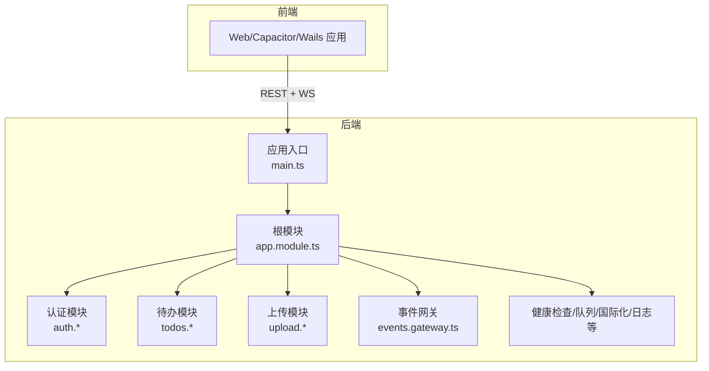
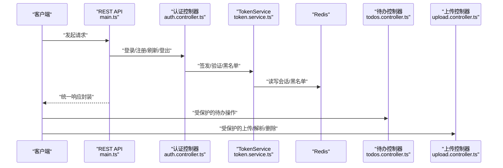
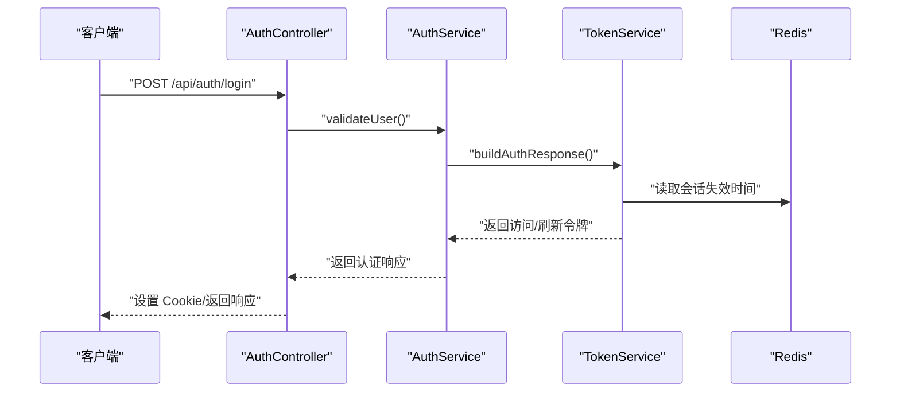
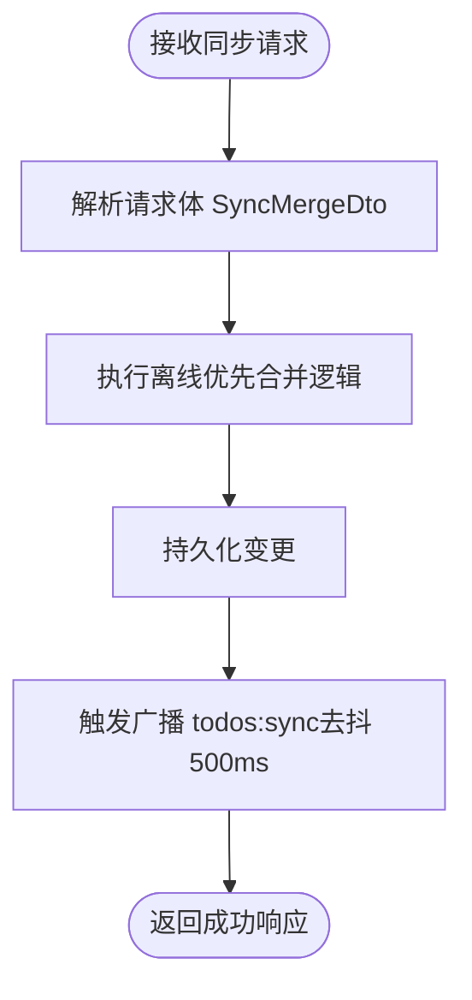
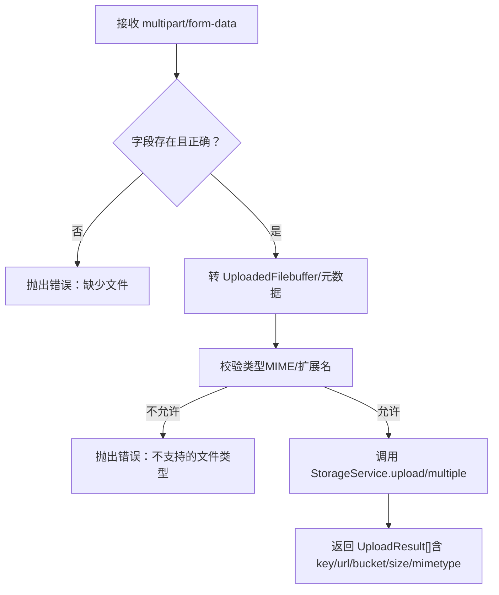
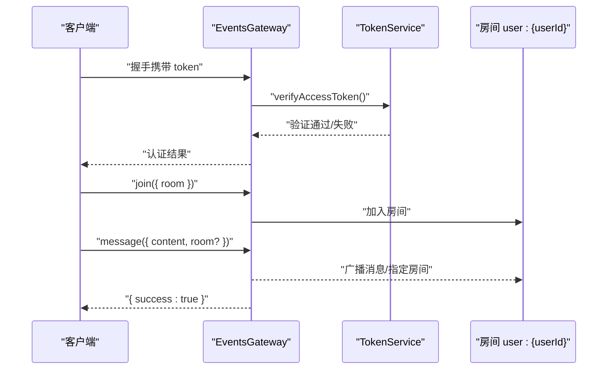
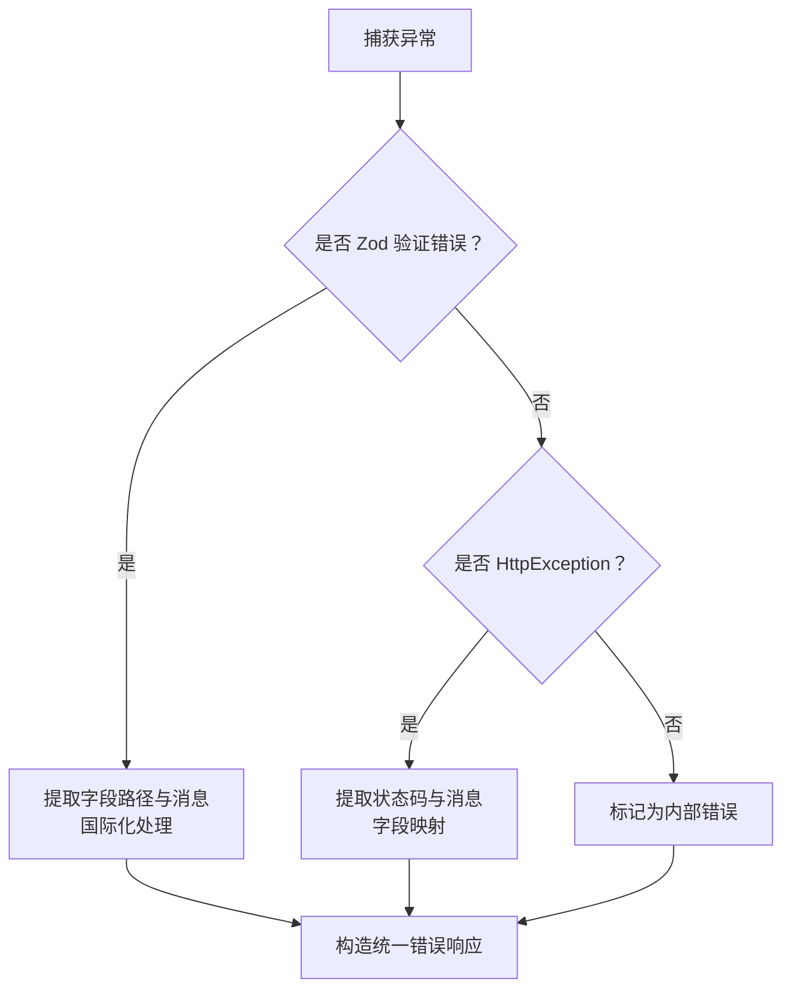
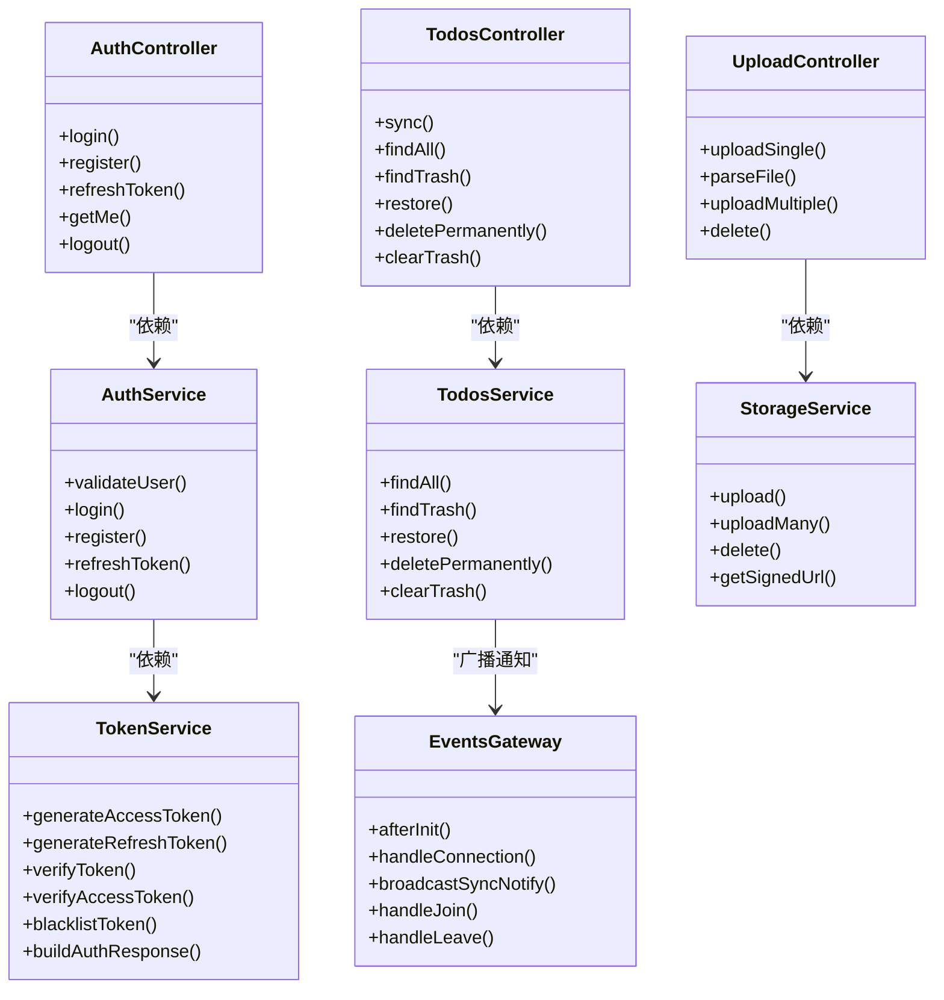

# API 接口文档

<cite>
**本文引用的文件**
- [apps/backend/src/main.ts](file://apps/backend/src/main.ts)
- [apps/backend/src/app.module.ts](file://apps/backend/src/app.module.ts)
- [apps/backend/src/auth/auth.controller.ts](file://apps/backend/src/auth/auth.controller.ts)
- [apps/backend/src/auth/auth.dto.ts](file://apps/backend/src/auth/auth.dto.ts)
- [apps/backend/src/auth/auth.service.ts](file://apps/backend/src/auth/auth.service.ts)
- [apps/backend/src/auth/token.service.ts](file://apps/backend/src/auth/token.service.ts)
- [apps/backend/src/todos/todos.controller.ts](file://apps/backend/src/todos/todos.controller.ts)
- [apps/backend/src/todos/todos.service.ts](file://apps/backend/src/todos/todos.service.ts)
- [apps/backend/src/todos/todos.dto.ts](file://apps/backend/src/todos/todos.dto.ts)
- [apps/backend/src/upload/upload.controller.ts](file://apps/backend/src/upload/upload.controller.ts)
- [apps/backend/src/upload/storage.service.ts](file://apps/backend/src/upload/storage.service.ts)
- [apps/backend/src/upload/upload.constants.ts](file://apps/backend/src/upload/upload.constants.ts)
- [apps/backend/src/events/events.gateway.ts](file://apps/backend/src/events/events.gateway.ts)
- [apps/backend/src/common/filters/all-exceptions.filter.ts](file://apps/backend/src/common/filters/all-exceptions.filter.ts)
- [apps/backend/src/common/interceptors/transform.interceptor.ts](file://apps/backend/src/common/interceptors/transform.interceptor.ts)
</cite>

## 目录
1. [简介](#简介)
2. [项目结构](#项目结构)
3. [核心组件](#核心组件)
4. [架构总览](#架构总览)
5. [详细组件分析](#详细组件分析)
6. [依赖关系分析](#依赖关系分析)
7. [性能考虑](#性能考虑)
8. [故障排除指南](#故障排除指南)
9. [结论](#结论)
10. [附录](#附录)

## 简介
本文件为 Lumina Todo 的完整 API 接口文档，覆盖 RESTful API、认证与授权、WebSocket 实时通信、文件上传、错误处理、版本控制与兼容性、速率限制与安全防护、测试与集成指南以及监控与性能指标。文档面向开发者与集成方，提供清晰的端点说明、参数与响应格式、流程图与类图，并给出最佳实践与排障建议。

## 项目结构
后端基于 NestJS + Fastify，采用模块化设计，核心模块包括认证、用户、待办、上传、事件网关等；全局启用 Swagger 文档、Zod 验证、统一响应包装、异常过滤、XSS 清理、CSRF 防护、压缩与 Helmet 安全头；前端通过 Capacitor/Wails 构建跨平台应用，同时提供 Web 访问。

图表来源
- [apps/backend/src/main.ts:34-201](file://apps/backend/src/main.ts#L34-L201)
- [apps/backend/src/app.module.ts:27-175](file://apps/backend/src/app.module.ts#L27-L175)

章节来源
- [apps/backend/src/main.ts:34-201](file://apps/backend/src/main.ts#L34-L201)
- [apps/backend/src/app.module.ts:27-175](file://apps/backend/src/app.module.ts#L27-L175)

## 核心组件
- REST API 服务：基于 Fastify，全局启用 CORS、Helmet、CSRF 校验、Gzip 压缩、multipart 上传、Swagger 文档。
- 认证与授权：JWT 访问令牌 + 刷新令牌，Redis 黑名单与会话失效控制，Cookie 存储，全局守卫保护。
- WebSocket 实时通信：Socket.IO 网关，按用户房间隔离，支持认证、房间加入/离开、广播与去抖广播。
- 文件上传：支持单/多文件上传、文件类型与大小校验、S3/兼容服务上传与签名 URL。
- 统一响应与错误处理：TransformInterceptor 统一封装响应，AllExceptionsFilter 标准化错误输出，支持国际化。
- 速率限制：Throttler 模块按短/中/长窗口限流，保护敏感端点。

章节来源
- [apps/backend/src/main.ts:48-170](file://apps/backend/src/main.ts#L48-L170)
- [apps/backend/src/app.module.ts:116-138](file://apps/backend/src/app.module.ts#L116-L138)
- [apps/backend/src/common/interceptors/transform.interceptor.ts:18-30](file://apps/backend/src/common/interceptors/transform.interceptor.ts#L18-L30)
- [apps/backend/src/common/filters/all-exceptions.filter.ts:16-137](file://apps/backend/src/common/filters/all-exceptions.filter.ts#L16-L137)

## 架构总览

图表来源
- [apps/backend/src/main.ts:171-181](file://apps/backend/src/main.ts#L171-L181)
- [apps/backend/src/auth/auth.controller.ts:14-82](file://apps/backend/src/auth/auth.controller.ts#L14-L82)
- [apps/backend/src/auth/token.service.ts:15-187](file://apps/backend/src/auth/token.service.ts#L15-L187)
- [apps/backend/src/todos/todos.controller.ts:20-70](file://apps/backend/src/todos/todos.controller.ts#L20-L70)
- [apps/backend/src/upload/upload.controller.ts:20-156](file://apps/backend/src/upload/upload.controller.ts#L20-L156)

## 详细组件分析

### REST API 端点总览
- 基础路径：/api
- 文档路径：/api/docs
- 全局前缀：app.setGlobalPrefix('api')

章节来源
- [apps/backend/src/main.ts:82](file://apps/backend/src/main.ts#L82)
- [apps/backend/src/main.ts:180](file://apps/backend/src/main.ts#L180)

### 认证与授权
- 端点
  - POST /api/auth/login（登录）
  - POST /api/auth/register（注册）
  - POST /api/auth/refresh（刷新访问令牌）
  - GET /api/auth/me（获取当前用户）
  - POST /api/auth/logout（登出）
- 请求头
  - Authorization: Bearer <access_token>
  - Content-Type: application/json
  - X-Requested-With: XMLHttpRequest（CSRF 防护）
- 速率限制
  - 登录：每 60 秒最多 5 次
  - 注册：每 60 秒最多 3 次
  - 刷新：每 60 秒最多 10 次
- 响应
  - 成功：统一包装 { success: true, data, timestamp }
  - 失败：统一包装 { success: false, data: null, message, errors?, statusCode, timestamp }
- 登录/注册/刷新返回值包含：
  - accessToken、refreshToken、expiresIn、user

图表来源
- [apps/backend/src/auth/auth.controller.ts:22-27](file://apps/backend/src/auth/auth.controller.ts#L22-L27)
- [apps/backend/src/auth/auth.service.ts:41-49](file://apps/backend/src/auth/auth.service.ts#L41-L49)
- [apps/backend/src/auth/token.service.ts:175-185](file://apps/backend/src/auth/token.service.ts#L175-L185)

章节来源
- [apps/backend/src/auth/auth.controller.ts:14-82](file://apps/backend/src/auth/auth.controller.ts#L14-L82)
- [apps/backend/src/auth/auth.dto.ts:15-41](file://apps/backend/src/auth/auth.dto.ts#L15-L41)
- [apps/backend/src/auth/auth.service.ts:12-127](file://apps/backend/src/auth/auth.service.ts#L12-L127)
- [apps/backend/src/auth/token.service.ts:15-187](file://apps/backend/src/auth/token.service.ts#L15-L187)

### 待办事项（Todos）
- 保护机制：JwtAuthGuard，Bearer 认证
- 端点
  - POST /api/todos/sync（离线优先同步合并）
  - GET /api/todos（获取当前用户所有待办）
  - GET /api/todos/trash（回收站）
  - POST /api/todos/:id/restore（恢复）
  - DELETE /api/todos/:id/permanent（永久删除）
  - DELETE /api/todos/trash/clear（清空回收站）
- 请求头
  - Authorization: Bearer <access_token>
  - X-Socket-ID: 可选，用于广播去抖时排除自身
- 响应
  - 成功：统一包装 { success: true, data, timestamp }
  - 失败：统一包装 { success: false, data: null, message, errors?, statusCode, timestamp }

图表来源
- [apps/backend/src/todos/todos.controller.ts:30-38](file://apps/backend/src/todos/todos.controller.ts#L30-L38)
- [apps/backend/src/todos/todos.service.ts:26-146](file://apps/backend/src/todos/todos.service.ts#L26-L146)
- [apps/backend/src/events/events.gateway.ts:177-202](file://apps/backend/src/events/events.gateway.ts#L177-L202)

章节来源
- [apps/backend/src/todos/todos.controller.ts:20-70](file://apps/backend/src/todos/todos.controller.ts#L20-L70)
- [apps/backend/src/todos/todos.dto.ts:4](file://apps/backend/src/todos/todos.dto.ts#L4)
- [apps/backend/src/todos/todos.service.ts:26-146](file://apps/backend/src/todos/todos.service.ts#L26-L146)

### 文件上传（Upload）
- 保护机制：JwtAuthGuard，Bearer 认证
- 端点
  - POST /api/upload/single（单文件上传）
  - POST /api/upload/parse（解析文件内容）
  - POST /api/upload/multiple（多文件上传，最多 10 个）
  - DELETE /api/upload/:key（删除文件）
- 上传限制
  - 单文件大小：默认 10MB（可配置）
  - 文件数量：默认最多 10 个
  - 支持 MIME 类型与扩展名白名单
- 响应
  - 成功：统一包装 { success: true, data, timestamp }
  - 失败：统一包装 { success: false, data: null, message, errors?, statusCode, timestamp }

图表来源
- [apps/backend/src/upload/upload.controller.ts:68-156](file://apps/backend/src/upload/upload.controller.ts#L68-L156)
- [apps/backend/src/upload/storage.service.ts:72-102](file://apps/backend/src/upload/storage.service.ts#L72-L102)
- [apps/backend/src/upload/upload.constants.ts:1-61](file://apps/backend/src/upload/upload.constants.ts#L1-L61)

章节来源
- [apps/backend/src/upload/upload.controller.ts:20-156](file://apps/backend/src/upload/upload.controller.ts#L20-L156)
- [apps/backend/src/upload/storage.service.ts:1-151](file://apps/backend/src/upload/storage.service.ts#L1-L151)
- [apps/backend/src/upload/upload.constants.ts:1-61](file://apps/backend/src/upload/upload.constants.ts#L1-L61)

### WebSocket 实时通信（Events Gateway）
- 网关
  - 命名空间：/events
  - 传输：polling, websocket
  - CORS：基于环境变量配置
- 认证
  - 支持握手头 Authorization 或 auth.token
  - 验证 access token，检查会话是否失效
- 房间
  - 自动加入 user:{userId} 房间
  - 支持 join/leave 指定房间
- 事件
  - message：发送消息或广播
  - todos:sync：待办同步通知（带去抖）
  - user:joined/user:left：房间成员变更通知
- 连接管理
  - 断开自动清理
  - 广播去抖：同一用户 500ms 内仅广播一次

图表来源
- [apps/backend/src/events/events.gateway.ts:20-56](file://apps/backend/src/events/events.gateway.ts#L20-L56)
- [apps/backend/src/events/events.gateway.ts:86-145](file://apps/backend/src/events/events.gateway.ts#L86-L145)
- [apps/backend/src/events/events.gateway.ts:150-175](file://apps/backend/src/events/events.gateway.ts#L150-L175)
- [apps/backend/src/events/events.gateway.ts:177-202](file://apps/backend/src/events/events.gateway.ts#L177-L202)
- [apps/backend/src/events/events.gateway.ts:207-250](file://apps/backend/src/events/events.gateway.ts#L207-L250)

章节来源
- [apps/backend/src/events/events.gateway.ts:1-266](file://apps/backend/src/events/events.gateway.ts#L1-L266)
- [apps/backend/src/auth/token.service.ts:115-125](file://apps/backend/src/auth/token.service.ts#L115-L125)

### 错误处理与统一响应
- 统一响应
  - 成功：{ success: true, data, timestamp }
  - 失败：{ success: false, data: null, message, errors?, statusCode, timestamp }
- 异常过滤
  - Zod 验证错误：提取字段路径与消息，支持国际化
  - HttpException：透传状态码与消息，必要时映射字段
  - 其他异常：统一 INTERNAL_SERVER_ERROR
- 国际化：基于 i18n 上下文，错误键自动翻译

图表来源
- [apps/backend/src/common/filters/all-exceptions.filter.ts:27-137](file://apps/backend/src/common/filters/all-exceptions.filter.ts#L27-L137)
- [apps/backend/src/common/interceptors/transform.interceptor.ts:19-30](file://apps/backend/src/common/interceptors/transform.interceptor.ts#L19-L30)

章节来源
- [apps/backend/src/common/filters/all-exceptions.filter.ts:16-137](file://apps/backend/src/common/filters/all-exceptions.filter.ts#L16-L137)
- [apps/backend/src/common/interceptors/transform.interceptor.ts:18-30](file://apps/backend/src/common/interceptors/transform.interceptor.ts#L18-L30)

### 速率限制与安全防护
- 速率限制（Throttler）
  - short：1 秒内最多 20 次
  - medium：10 秒内最多 100 次
  - long：60 秒内最多 300 次
- 安全防护
  - Helmet：CSP、COEP、CORP 等
  - CSRF：要求 X-Requested-With: XMLHttpRequest
  - XSS：SanitizeInterceptor 清理输入
  - Gzip：压缩响应
  - CORS：严格白名单，支持多 origin
  - 上传：multipart 限制大小与数量

章节来源
- [apps/backend/src/app.module.ts:116-138](file://apps/backend/src/app.module.ts#L116-L138)
- [apps/backend/src/main.ts:84-121](file://apps/backend/src/main.ts#L84-L121)
- [apps/backend/src/main.ts:106-113](file://apps/backend/src/main.ts#L106-L113)

### API 版本控制与兼容性
- 版本来源：从进程环境变量读取包版本，展示在 Swagger 文档标题与版本号中
- 建议
  - 保持路径稳定（/api/v1/...），通过文档与变更日志声明破坏性更新
  - 旧版本端点保留至少 3 个月，配合明确 deprecation 说明
  - 通过 Accept-Version 请求头或路径版本实现多版本共存

章节来源
- [apps/backend/src/main.ts:45-47](file://apps/backend/src/main.ts#L45-L47)
- [apps/backend/src/main.ts:172-178](file://apps/backend/src/main.ts#L172-L178)

### 客户端 SDK 使用示例与最佳实践
- 认证
  - 登录后保存 accessToken/refreshToken（建议使用安全 Cookie 或本地安全存储）
  - 每次请求携带 Authorization: Bearer <access_token>
  - 刷新令牌：使用 /api/auth/refresh，失败时引导重新登录
- 待办
  - 使用 /api/todos/sync 以离线优先策略合并本地与服务端差异
  - 监听 todos:sync 事件，收到后触发本地同步
- 上传
  - 单文件：multipart/form-data 字段名为 file
  - 多文件：字段名为 files（数组）
  - 上传后使用返回的 key 删除文件
- WebSocket
  - 连接 /events，握手时携带 token
  - 自动加入 user:{userId} 房间，订阅 todos:sync 事件

章节来源
- [apps/backend/src/auth/auth.controller.ts:22-80](file://apps/backend/src/auth/auth.controller.ts#L22-L80)
- [apps/backend/src/todos/todos.controller.ts:30-38](file://apps/backend/src/todos/todos.controller.ts#L30-L38)
- [apps/backend/src/upload/upload.controller.ts:68-156](file://apps/backend/src/upload/upload.controller.ts#L68-L156)
- [apps/backend/src/events/events.gateway.ts:86-145](file://apps/backend/src/events/events.gateway.ts#L86-L145)

### API 测试用例与集成指南
- 单元测试
  - 使用 Vitest，覆盖控制器、服务、网关与过滤器
- 端到端测试
  - 提供 e2e 测试样例，覆盖认证、待办、上传等关键流程
- 集成建议
  - 先完成认证（获取 token），再进行受保护操作
  - 对上传接口进行边界测试（超限、非法类型、空文件）

章节来源
- [apps/backend/tests/e2e/auth.e2e.spec.ts](file://apps/backend/tests/e2e/auth.e2e.spec.ts)
- [apps/backend/tests/e2e/todos.e2e.spec.ts](file://apps/backend/tests/e2e/todos.e2e.spec.ts)

### 监控与性能指标
- 日志
  - Pino 全局日志器，区分 info/warn/error，自定义成功/错误消息格式
- 健康检查
  - /api/health/*（liveness/readiness/probe），支持 Prisma/Redis 健康检查
- 性能
  - Fastify + Gzip 压缩
  - 上传限流与大小限制
  - WebSocket 广播去抖，降低网络压力

章节来源
- [apps/backend/src/main.ts:35-44](file://apps/backend/src/main.ts#L35-L44)
- [apps/backend/src/health/health.controller.ts](file://apps/backend/src/health/health.controller.ts)
- [apps/backend/src/events/events.gateway.ts:177-202](file://apps/backend/src/events/events.gateway.ts#L177-L202)

## 依赖关系分析

图表来源
- [apps/backend/src/auth/auth.controller.ts:17](file://apps/backend/src/auth/auth.controller.ts#L17)
- [apps/backend/src/auth/auth.service.ts:14-21](file://apps/backend/src/auth/auth.service.ts#L14-L21)
- [apps/backend/src/auth/token.service.ts:16-45](file://apps/backend/src/auth/token.service.ts#L16-L45)
- [apps/backend/src/todos/todos.controller.ts:25-28](file://apps/backend/src/todos/todos.controller.ts#L25-L28)
- [apps/backend/src/todos/todos.service.ts:28-32](file://apps/backend/src/todos/todos.service.ts#L28-L32)
- [apps/backend/src/upload/upload.controller.ts:25-28](file://apps/backend/src/upload/upload.controller.ts#L25-L28)
- [apps/backend/src/upload/storage.service.ts:33-41](file://apps/backend/src/upload/storage.service.ts#L33-L41)
- [apps/backend/src/events/events.gateway.ts:58-66](file://apps/backend/src/events/events.gateway.ts#L58-L66)

章节来源
- [apps/backend/src/auth/auth.controller.ts:14-82](file://apps/backend/src/auth/auth.controller.ts#L14-L82)
- [apps/backend/src/auth/auth.service.ts:12-127](file://apps/backend/src/auth/auth.service.ts#L12-L127)
- [apps/backend/src/auth/token.service.ts:15-187](file://apps/backend/src/auth/token.service.ts#L15-L187)
- [apps/backend/src/todos/todos.controller.ts:20-70](file://apps/backend/src/todos/todos.controller.ts#L20-L70)
- [apps/backend/src/todos/todos.service.ts:26-146](file://apps/backend/src/todos/todos.service.ts#L26-L146)
- [apps/backend/src/upload/upload.controller.ts:20-156](file://apps/backend/src/upload/upload.controller.ts#L20-L156)
- [apps/backend/src/upload/storage.service.ts:1-151](file://apps/backend/src/upload/storage.service.ts#L1-L151)
- [apps/backend/src/events/events.gateway.ts:1-266](file://apps/backend/src/events/events.gateway.ts#L1-L266)

## 性能考虑
- 传输层
  - Gzip 压缩阈值 1KB，减少带宽占用
  - Fastify 适配器提升吞吐
- 业务层
  - 待办同步广播去抖 500ms，避免频繁广播
  - 事务批量删除回收站，减少数据库往返
- 存储层
  - S3/兼容服务上传，支持签名 URL 与公开访问
- 速率限制
  - 多级窗口限流，保护敏感端点免受暴力破解

章节来源
- [apps/backend/src/main.ts:101-104](file://apps/backend/src/main.ts#L101-L104)
- [apps/backend/src/events/events.gateway.ts:177-202](file://apps/backend/src/events/events.gateway.ts#L177-L202)
- [apps/backend/src/todos/todos.service.ts:115-144](file://apps/backend/src/todos/todos.service.ts#L115-L144)
- [apps/backend/src/app.module.ts:116-138](file://apps/backend/src/app.module.ts#L116-L138)

## 故障排除指南
- 401 未授权
  - 检查 Authorization 头是否携带有效 access_token
  - 确认未过期且未被黑名单
- 403 CSRF
  - 确保请求包含 X-Requested-With: XMLHttpRequest
- 400 参数错误
  - 查看 errors 结构化字段映射，修正对应字段
- 500 服务器错误
  - 查看服务端日志，定位具体异常栈
- 上传失败
  - 检查文件类型与大小限制
  - 确认 S3 凭据配置正确

章节来源
- [apps/backend/src/common/filters/all-exceptions.filter.ts:27-137](file://apps/backend/src/common/filters/all-exceptions.filter.ts#L27-L137)
- [apps/backend/src/main.ts:142-156](file://apps/backend/src/main.ts#L142-L156)
- [apps/backend/src/upload/upload.constants.ts:1-61](file://apps/backend/src/upload/upload.constants.ts#L1-L61)
- [apps/backend/src/upload/storage.service.ts:143-149](file://apps/backend/src/upload/storage.service.ts#L143-L149)

## 结论
本 API 文档提供了 Lumina Todo 的完整接口规范，涵盖认证、待办、上传与实时通信，并配套统一响应、错误处理、速率限制与安全防护。建议在生产环境完善版本控制策略、接入监控告警与压测评估，持续优化用户体验与系统稳定性。

## 附录
- Swagger 文档地址：/api/docs
- 健康检查地址：/api/health/*
- CORS 允许的 origin 来源于环境变量 CORS_ORIGIN（逗号分隔）
- 上传默认限制：单文件 10MB，最多 10 个文件

章节来源
- [apps/backend/src/main.ts:180-194](file://apps/backend/src/main.ts#L180-L194)
- [apps/backend/src/app.module.ts:28-33](file://apps/backend/src/app.module.ts#L28-L33)
- [apps/backend/src/main.ts:106-113](file://apps/backend/src/main.ts#L106-L113)