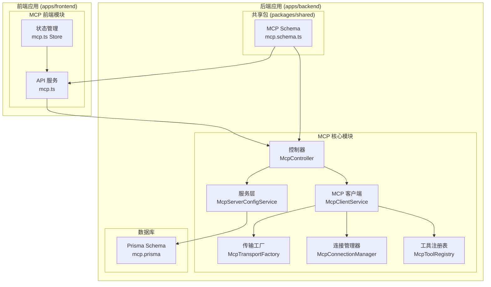
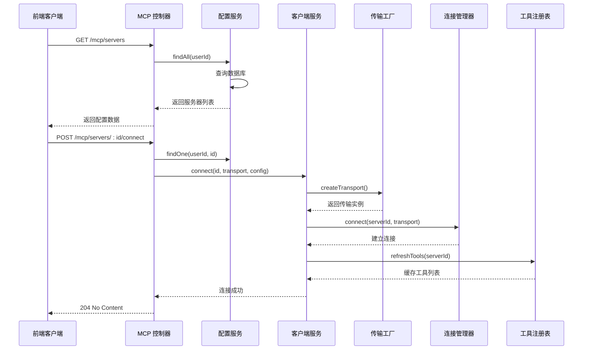
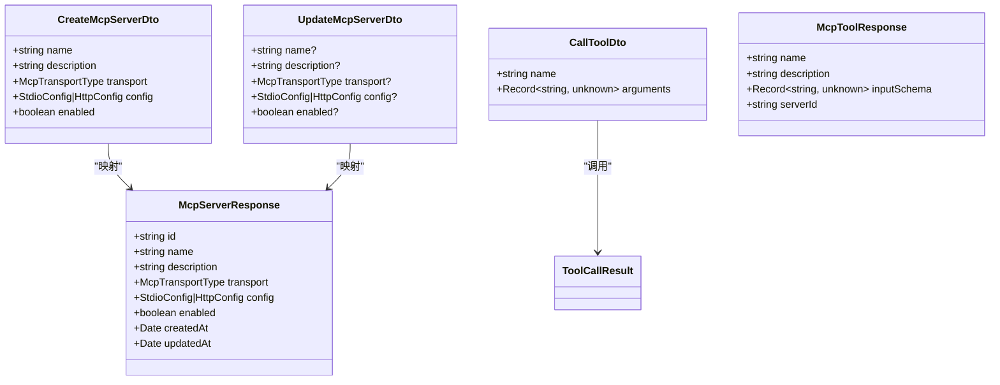
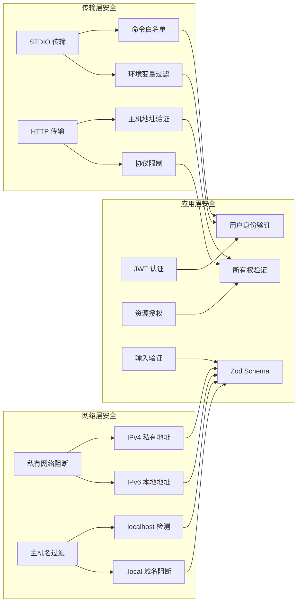

# MCP 协议 API

<cite>
**本文档引用的文件**
- [apps/backend/src/mcp/mcp.controller.ts](file://apps/backend/src/mcp/mcp.controller.ts)
- [apps/backend/src/mcp/mcp.dto.ts](file://apps/backend/src/mcp/mcp.dto.ts)
- [apps/backend/src/mcp/mcp.module.ts](file://apps/backend/src/mcp/mcp.module.ts)
- [apps/backend/src/mcp/mcp-client.service.ts](file://apps/backend/src/mcp/mcp-client.service.ts)
- [apps/backend/src/mcp/mcp-server-config.service.ts](file://apps/backend/src/mcp/mcp-server-config.service.ts)
- [apps/backend/src/mcp/core/mcp-transport.factory.ts](file://apps/backend/src/mcp/core/mcp-transport.factory.ts)
- [apps/backend/src/mcp/core/mcp-connection.manager.ts](file://apps/backend/src/mcp/core/mcp-connection.manager.ts)
- [apps/backend/src/mcp/core/mcp-tool.registry.ts](file://apps/backend/src/mcp/core/mcp-tool.registry.ts)
- [packages/shared/src/schemas/mcp.schema.ts](file://packages/shared/src/schemas/mcp.schema.ts)
- [apps/frontend/src/features/mcp/api/mcp.ts](file://apps/frontend/src/features/mcp/api/mcp.ts)
- [apps/frontend/src/features/mcp/stores/mcp.ts](file://apps/frontend/src/features/mcp/stores/mcp.ts)
- [apps/backend/prisma/schema/mcp.prisma](file://apps/backend/prisma/schema/mcp.prisma)
- [apps/backend/tests/mcp/mcp-client.service.spec.ts](file://apps/backend/tests/mcp/mcp-client.service.spec.ts)
- [apps/backend/tests/mcp/mcp-server-config.service.spec.ts](file://apps/backend/tests/mcp/mcp-server-config.service.spec.ts)
</cite>

## 目录
1. [简介](#简介)
2. [项目结构](#项目结构)
3. [核心组件](#核心组件)
4. [架构概览](#架构概览)
5. [详细组件分析](#详细组件分析)
6. [依赖关系分析](#依赖关系分析)
7. [性能考虑](#性能考虑)
8. [故障排除指南](#故障排除指南)
9. [结论](#结论)

## 简介

MCP（Model Context Protocol）协议 API 是一个基于 NestJS 构建的现代化 API 系统，专门用于管理外部 MCP 服务器配置、建立连接以及调用工具。该系统支持两种传输协议：STDIO 和 HTTP，为 AI 助手提供强大的工具调用能力。

系统采用分层架构设计，包括控制器层、服务层、数据访问层和前端集成层，确保了良好的可维护性和扩展性。通过 JWT 认证保护所有 API 端点，提供安全的用户资源访问控制。

## 项目结构

该项目采用 Monorepo 结构，主要包含以下核心模块：



**图表来源**
- [apps/backend/src/mcp/mcp.controller.ts:34-197](file://apps/backend/src/mcp/mcp.controller.ts#L34-L197)
- [apps/backend/src/mcp/mcp.module.ts:13-24](file://apps/backend/src/mcp/mcp.module.ts#L13-L24)

**章节来源**
- [apps/backend/src/mcp/mcp.module.ts:1-25](file://apps/backend/src/mcp/mcp.module.ts#L1-L25)
- [apps/backend/prisma/schema/mcp.prisma:1-16](file://apps/backend/prisma/schema/mcp.prisma#L1-L16)

## 核心组件

### API 控制器层

MCP 控制器提供了完整的 RESTful API 接口，包括服务器配置管理、工具发现和工具调用功能。

**主要功能特性：**
- JWT 认证保护所有端点
- 用户资源所有权验证
- 懒加载连接机制
- 工具缓存管理

**章节来源**
- [apps/backend/src/mcp/mcp.controller.ts:34-197](file://apps/backend/src/mcp/mcp.controller.ts#L34-L197)

### 传输工厂

传输工厂负责根据配置动态创建不同类型的 MCP 传输连接，支持安全的环境限制和访问控制。

**安全特性：**
- STDIO 命令白名单验证
- HTTP 主机地址安全检查
- 私有网络访问阻断
- 环境变量过滤

**章节来源**
- [apps/backend/src/mcp/core/mcp-transport.factory.ts:112-218](file://apps/backend/src/mcp/core/mcp-transport.factory.ts#L112-L218)

### 连接管理器

连接管理器实现了 MCP 客户端连接的生命周期管理，包括连接建立、维护和清理。

**核心功能：**
- 客户端实例管理
- 连接状态跟踪
- 异常处理和日志记录
- 资源清理

**章节来源**
- [apps/backend/src/mcp/core/mcp-connection.manager.ts:23-95](file://apps/backend/src/mcp/core/mcp-connection.manager.ts#L23-L95)

### 工具注册表

工具注册表提供 MCP 工具的缓存和刷新机制，优化工具发现性能。

**缓存策略：**
- 工具列表本地缓存
- 自动刷新机制
- 连接状态同步
- 错误恢复

**章节来源**
- [apps/backend/src/mcp/core/mcp-tool.registry.ts:12-46](file://apps/backend/src/mcp/core/mcp-tool.registry.ts#L12-L46)

## 架构概览

系统采用分层架构设计，确保关注点分离和代码复用：



**图表来源**
- [apps/backend/src/mcp/mcp.controller.ts:134-155](file://apps/backend/src/mcp/mcp.controller.ts#L134-L155)
- [apps/backend/src/mcp/mcp-client.service.ts:33-47](file://apps/backend/src/mcp/mcp-client.service.ts#L33-L47)

**章节来源**
- [apps/backend/src/mcp/mcp.controller.ts:1-198](file://apps/backend/src/mcp/mcp.controller.ts#L1-L198)
- [apps/backend/src/mcp/mcp-client.service.ts:1-124](file://apps/backend/src/mcp/mcp-client.service.ts#L1-L124)

## 详细组件分析

### 数据传输对象 (DTO)

系统使用 Zod Schema 进行数据验证，确保请求和响应数据的完整性。



**图表来源**
- [apps/backend/src/mcp/mcp.dto.ts:22-53](file://apps/backend/src/mcp/mcp.dto.ts#L22-L53)
- [packages/shared/src/schemas/mcp.schema.ts:185-219](file://packages/shared/src/schemas/mcp.schema.ts#L185-L219)

**章节来源**
- [apps/backend/src/mcp/mcp.dto.ts:1-59](file://apps/backend/src/mcp/mcp.dto.ts#L1-L59)
- [packages/shared/src/schemas/mcp.schema.ts:1-220](file://packages/shared/src/schemas/mcp.schema.ts#L1-L220)

### 前端集成

前端提供了完整的 MCP 管理界面，包括服务器配置、连接状态管理和工具调用功能。

```mermaid
flowchart TD
Start([用户操作]) --> Action{操作类型}
Action --> |添加服务器| Create[创建服务器配置]
Action --> |更新配置| Update[更新服务器配置]
Action --> |删除服务器| Delete[删除服务器配置]
Action --> |连接服务器| Connect[建立 MCP 连接]
Action --> |断开连接| Disconnect[关闭 MCP 连接]
Action --> |调用工具| CallTool[执行工具调用]
Create --> CreateAPI[调用 /mcp/servers]
Update --> UpdateAPI[调用 /mcp/servers/:id]
Delete --> DeleteAPI[调用 /mcp/servers/:id]
Connect --> ConnectAPI[调用 /mcp/servers/:id/connect]
Disconnect --> DisconnectAPI[调用 /mcp/servers/:id/disconnect]
CallTool --> CallAPI[调用 /mcp/servers/:id/tools/call]
CreateAPI --> Success[返回配置数据]
UpdateAPI --> Success
DeleteAPI --> Success
ConnectAPI --> Success
DisconnectAPI --> Success
CallAPI --> ToolResult[返回工具结果]
Success --> End([完成])
ToolResult --> End
```



**图表来源**
- [apps/frontend/src/features/mcp/api/mcp.ts:16-107](file://apps/frontend/src/features/mcp/api/mcp.ts#L16-L107)
- [apps/frontend/src/features/mcp/stores/mcp.ts:15-245](file://apps/frontend/src/features/mcp/stores/mcp.ts#L15-L245)

**章节来源**
- [apps/frontend/src/features/mcp/api/mcp.ts:1-108](file://apps/frontend/src/features/mcp/api/mcp.ts#L1-L108)
- [apps/frontend/src/features/mcp/stores/mcp.ts:1-246](file://apps/frontend/src/features/mcp/stores/mcp.ts#L1-L246)

### 安全架构

系统实现了多层次的安全防护机制：



**图表来源**
- [apps/backend/src/mcp/core/mcp-transport.factory.ts:13-110](file://apps/backend/src/mcp/core/mcp-transport.factory.ts#L13-L110)
- [apps/backend/src/mcp/mcp.controller.ts:32-33](file://apps/backend/src/mcp/mcp.controller.ts#L32-L33)

**章节来源**
- [apps/backend/src/mcp/core/mcp-transport.factory.ts:1-220](file://apps/backend/src/mcp/core/mcp-transport.factory.ts#L1-L220)
- [apps/backend/src/mcp/mcp.controller.ts:1-198](file://apps/backend/src/mcp/mcp.controller.ts#L1-L198)

## 依赖关系分析

系统采用模块化设计，各组件之间通过清晰的接口进行交互：

```mermaid
graph TB
subgraph "外部依赖"
SDK[@modelcontextprotocol/sdk]
ZOD[zod]
PRISMA[Prisma]
NEST[nestjs]
end
subgraph "内部模块"
CONTROLLER[McpController]
CONFIG_SERVICE[McpServerConfigService]
CLIENT_SERVICE[McpClientService]
TRANSPORT_FACTORY[McpTransportFactory]
CONNECTION_MANAGER[McpConnectionManager]
TOOL_REGISTRY[McpToolRegistry]
end
subgraph "共享层"
DTO[MCP DTO]
SCHEMA[MCP Schema]
end
CONTROLLER --> CONFIG_SERVICE
CONTROLLER --> CLIENT_SERVICE
CLIENT_SERVICE --> TRANSPORT_FACTORY
CLIENT_SERVICE --> CONNECTION_MANAGER
CLIENT_SERVICE --> TOOL_REGISTRY
CONFIG_SERVICE --> PRISMA
DTO --> SCHEMA
TRANSPORT_FACTORY --> SDK
CLIENT_SERVICE --> ZOD
CONFIG_SERVICE --> NEST
```

**图表来源**
- [apps/backend/src/mcp/mcp.module.ts:13-24](file://apps/backend/src/mcp/mcp.module.ts#L13-L24)
- [apps/backend/src/mcp/mcp-client.service.ts:21-28](file://apps/backend/src/mcp/mcp-client.service.ts#L21-L28)

**章节来源**
- [apps/backend/src/mcp/mcp.module.ts:1-25](file://apps/backend/src/mcp/mcp.module.ts#L1-L25)
- [apps/backend/src/mcp/mcp-client.service.ts:1-124](file://apps/backend/src/mcp/mcp-client.service.ts#L1-L124)

## 性能考虑

系统在多个层面进行了性能优化：

### 连接池管理
- 懒加载连接策略，按需建立连接
- 连接状态缓存，减少重复连接开销
- 自动重连机制，提高系统稳定性

### 工具缓存策略
- 工具列表本地缓存，避免频繁查询
- 缓存失效机制，确保数据一致性
- 并发访问控制，防止缓存击穿

### 网络优化
- 传输层超时配置
- 流式 HTTP 传输支持
- 连接复用机制

## 故障排除指南

### 常见问题及解决方案

**连接失败**
- 检查 MCP 服务器可达性
- 验证传输配置正确性
- 查看服务器日志输出

**工具调用错误**
- 确认工具名称拼写正确
- 验证工具参数格式
- 检查服务器工具列表

**权限问题**
- 确认用户认证状态
- 验证资源所有权
- 检查 JWT 令牌有效性

**章节来源**
- [apps/backend/src/mcp/mcp-client.service.ts:74-107](file://apps/backend/src/mcp/mcp-client.service.ts#L74-L107)
- [apps/backend/src/mcp/mcp-server-config.service.ts:114-127](file://apps/backend/src/mcp/mcp-server-config.service.ts#L114-L127)

### 日志监控

系统提供了全面的日志记录机制：

- 连接建立/断开事件
- 工具调用执行状态
- 错误异常信息
- 性能指标监控

**章节来源**
- [apps/backend/src/mcp/core/mcp-connection.manager.ts:45-57](file://apps/backend/src/mcp/core/mcp-connection.manager.ts#L45-L57)
- [apps/backend/src/mcp/mcp-client.service.ts:96-106](file://apps/backend/src/mcp/mcp-client.service.ts#L96-L106)

## 结论

MCP 协议 API 提供了一个完整、安全且高性能的 MCP 服务器管理解决方案。通过模块化架构设计、严格的安全部署和完善的错误处理机制，系统能够满足各种复杂的 MCP 集成需求。

**主要优势：**
- 完整的 CRUD 操作支持
- 多种传输协议兼容
- 严格的安全防护机制
- 良好的性能表现
- 完善的错误处理

**未来改进方向：**
- 增加更多传输协议支持
- 优化工具缓存策略
- 扩展监控和告警功能
- 增强批量操作能力