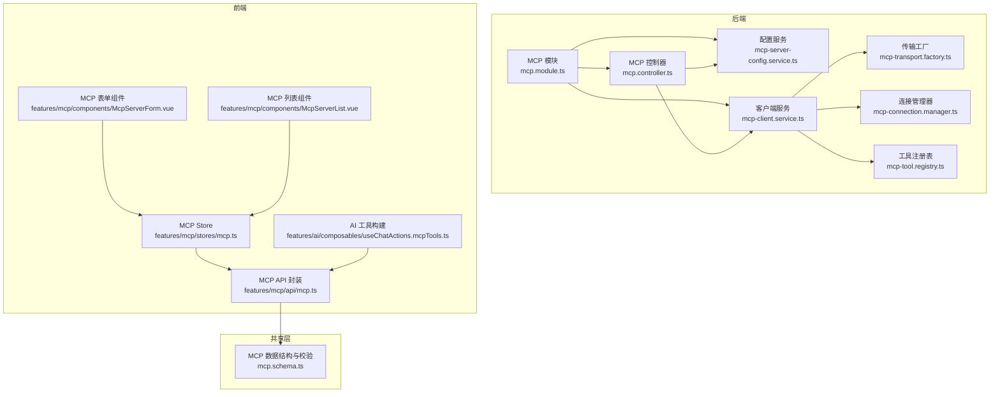
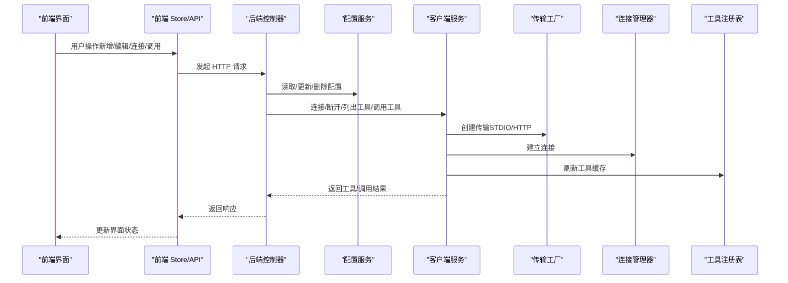
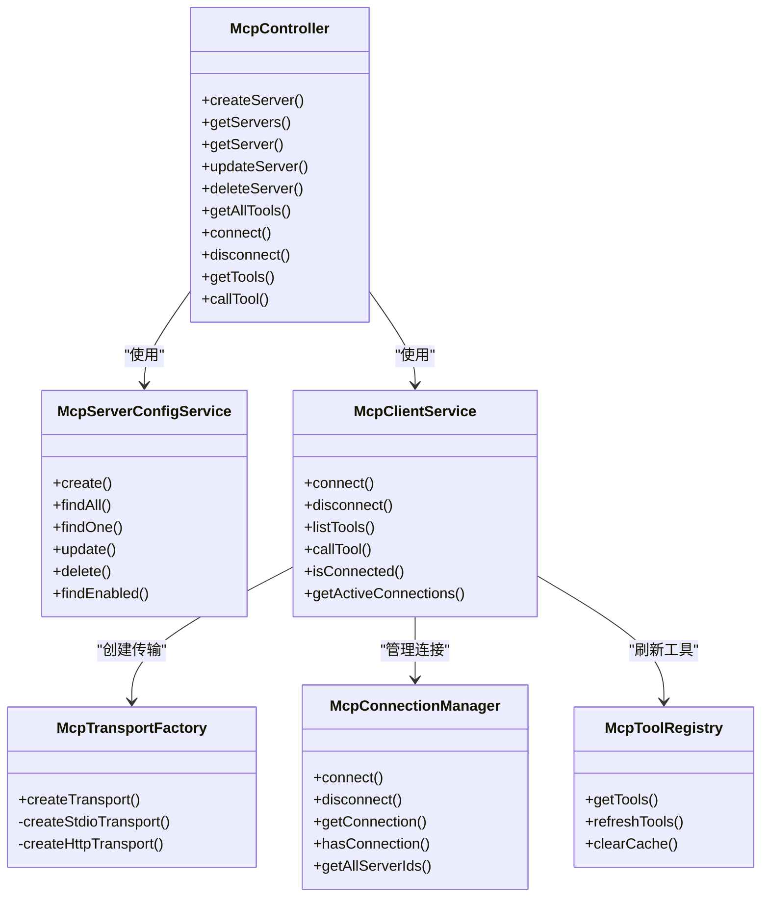

# MCP 协议 API

<cite>
**本文引用的文件**
- [apps/backend/src/mcp/mcp.module.ts](file://apps/backend/src/mcp/mcp.module.ts)
- [apps/backend/src/mcp/mcp.controller.ts](file://apps/backend/src/mcp/mcp.controller.ts)
- [apps/backend/src/mcp/mcp.dto.ts](file://apps/backend/src/mcp/mcp.dto.ts)
- [apps/backend/src/mcp/mcp-client.service.ts](file://apps/backend/src/mcp/mcp-client.service.ts)
- [apps/backend/src/mcp/mcp-server-config.service.ts](file://apps/backend/src/mcp/mcp-server-config.service.ts)
- [apps/backend/src/mcp/core/mcp-transport.factory.ts](file://apps/backend/src/mcp/core/mcp-transport.factory.ts)
- [apps/backend/src/mcp/core/mcp-connection.manager.ts](file://apps/backend/src/mcp/core/mcp-connection.manager.ts)
- [apps/backend/src/mcp/core/mcp-tool.registry.ts](file://apps/backend/src/mcp/core/mcp-tool.registry.ts)
- [packages/shared/src/schemas/mcp.schema.ts](file://packages/shared/src/schemas/mcp.schema.ts)
- [apps/frontend/src/features/mcp/api/mcp.ts](file://apps/frontend/src/features/mcp/api/mcp.ts)
- [apps/frontend/src/features/mcp/stores/mcp.ts](file://apps/frontend/src/features/mcp/stores/mcp.ts)
- [apps/frontend/src/features/mcp/components/McpServerForm.vue](file://apps/frontend/src/features/mcp/components/McpServerForm.vue)
- [apps/frontend/src/features/mcp/components/McpServerList.vue](file://apps/frontend/src/features/mcp/components/McpServerList.vue)
- [apps/frontend/src/features/ai/composables/useChatActions.mcpTools.ts](file://apps/frontend/src/features/ai/composables/useChatActions.mcpTools.ts)
</cite>

## 目录
1. [简介](#简介)
2. [项目结构](#项目结构)
3. [核心组件](#核心组件)
4. [架构总览](#架构总览)
5. [详细组件分析](#详细组件分析)
6. [依赖关系分析](#依赖关系分析)
7. [性能考量](#性能考量)
8. [故障排除指南](#故障排除指南)
9. [结论](#结论)
10. [附录](#附录)

## 简介
本文件为 Lumina Todo 中 Model Context Protocol（MCP）协议的 API 文档，覆盖 MCP 服务器配置、连接管理、工具调用机制与前端集成。文档重点说明：
- MCP 服务器注册、发现与连接流程
- MCP 工具的定义、调用与响应格式（支持文本、图像、JSON 等）
- MCP 协议消息类型与数据结构
- MCP 客户端使用示例与集成指南
- 与 AI 助手系统的集成方式
- MCP 服务器配置选项与安全考虑
- 版本兼容性与扩展机制
- 故障排除与调试方法

## 项目结构
MCP 功能由后端 NestJS 模块与前端 Vue 组成，共享层提供跨端数据结构与校验。

图表来源
- [apps/backend/src/mcp/mcp.module.ts:1-25](file://apps/backend/src/mcp/mcp.module.ts#L1-L25)
- [apps/backend/src/mcp/mcp.controller.ts:1-198](file://apps/backend/src/mcp/mcp.controller.ts#L1-L198)
- [apps/backend/src/mcp/mcp-client.service.ts:1-124](file://apps/backend/src/mcp/mcp-client.service.ts#L1-L124)
- [apps/backend/src/mcp/core/mcp-transport.factory.ts:1-220](file://apps/backend/src/mcp/core/mcp-transport.factory.ts#L1-L220)
- [apps/backend/src/mcp/core/mcp-connection.manager.ts:1-101](file://apps/backend/src/mcp/core/mcp-connection.manager.ts#L1-L101)
- [apps/backend/src/mcp/core/mcp-tool.registry.ts:1-48](file://apps/backend/src/mcp/core/mcp-tool.registry.ts#L1-L48)
- [packages/shared/src/schemas/mcp.schema.ts:1-220](file://packages/shared/src/schemas/mcp.schema.ts#L1-L220)
- [apps/frontend/src/features/mcp/api/mcp.ts:1-108](file://apps/frontend/src/features/mcp/api/mcp.ts#L1-L108)
- [apps/frontend/src/features/mcp/stores/mcp.ts:1-246](file://apps/frontend/src/features/mcp/stores/mcp.ts#L1-L246)
- [apps/frontend/src/features/mcp/components/McpServerForm.vue:1-188](file://apps/frontend/src/features/mcp/components/McpServerForm.vue#L1-L188)
- [apps/frontend/src/features/mcp/components/McpServerList.vue:1-351](file://apps/frontend/src/features/mcp/components/McpServerList.vue#L1-L351)
- [apps/frontend/src/features/ai/composables/useChatActions.mcpTools.ts:1-50](file://apps/frontend/src/features/ai/composables/useChatActions.mcpTools.ts#L1-L50)

章节来源
- [apps/backend/src/mcp/mcp.module.ts:1-25](file://apps/backend/src/mcp/mcp.module.ts#L1-L25)
- [apps/backend/src/mcp/mcp.controller.ts:1-198](file://apps/backend/src/mcp/mcp.controller.ts#L1-L198)
- [apps/backend/src/mcp/mcp-client.service.ts:1-124](file://apps/backend/src/mcp/mcp-client.service.ts#L1-L124)
- [apps/backend/src/mcp/core/mcp-transport.factory.ts:1-220](file://apps/backend/src/mcp/core/mcp-transport.factory.ts#L1-L220)
- [apps/backend/src/mcp/core/mcp-connection.manager.ts:1-101](file://apps/backend/src/mcp/core/mcp-connection.manager.ts#L1-L101)
- [apps/backend/src/mcp/core/mcp-tool.registry.ts:1-48](file://apps/backend/src/mcp/core/mcp-tool.registry.ts#L1-L48)
- [packages/shared/src/schemas/mcp.schema.ts:1-220](file://packages/shared/src/schemas/mcp.schema.ts#L1-L220)
- [apps/frontend/src/features/mcp/api/mcp.ts:1-108](file://apps/frontend/src/features/mcp/api/mcp.ts#L1-L108)
- [apps/frontend/src/features/mcp/stores/mcp.ts:1-246](file://apps/frontend/src/features/mcp/stores/mcp.ts#L1-L246)
- [apps/frontend/src/features/mcp/components/McpServerForm.vue:1-188](file://apps/frontend/src/features/mcp/components/McpServerForm.vue#L1-L188)
- [apps/frontend/src/features/mcp/components/McpServerList.vue:1-351](file://apps/frontend/src/features/mcp/components/McpServerList.vue#L1-L351)
- [apps/frontend/src/features/ai/composables/useChatActions.mcpTools.ts:1-50](file://apps/frontend/src/features/ai/composables/useChatActions.mcpTools.ts#L1-L50)

## 核心组件
- 后端模块与控制器：提供 MCP 服务器配置的增删改查、连接/断开、工具发现与调用接口。
- 客户端服务：封装传输创建、连接管理、工具注册表刷新与工具调用。
- 传输工厂：负责安全校验与创建 STDIO 或 HTTP 传输。
- 连接管理器：维护活跃连接，处理连接生命周期与错误事件。
- 工具注册表：缓存并刷新工具清单，供 AI 助手自动发现。
- 前端 API 与 Store：封装后端接口、状态管理与 UI 交互。
- 共享层：定义 MCP 传输类型、配置结构、工具与调用结果的数据结构及校验规则。

章节来源
- [apps/backend/src/mcp/mcp.module.ts:1-25](file://apps/backend/src/mcp/mcp.module.ts#L1-L25)
- [apps/backend/src/mcp/mcp.controller.ts:1-198](file://apps/backend/src/mcp/mcp.controller.ts#L1-L198)
- [apps/backend/src/mcp/mcp-client.service.ts:1-124](file://apps/backend/src/mcp/mcp-client.service.ts#L1-L124)
- [apps/backend/src/mcp/core/mcp-transport.factory.ts:1-220](file://apps/backend/src/mcp/core/mcp-transport.factory.ts#L1-L220)
- [apps/backend/src/mcp/core/mcp-connection.manager.ts:1-101](file://apps/backend/src/mcp/core/mcp-connection.manager.ts#L1-L101)
- [apps/backend/src/mcp/core/mcp-tool.registry.ts:1-48](file://apps/backend/src/mcp/core/mcp-tool.registry.ts#L1-L48)
- [apps/frontend/src/features/mcp/api/mcp.ts:1-108](file://apps/frontend/src/features/mcp/api/mcp.ts#L1-L108)
- [apps/frontend/src/features/mcp/stores/mcp.ts:1-246](file://apps/frontend/src/features/mcp/stores/mcp.ts#L1-L246)
- [packages/shared/src/schemas/mcp.schema.ts:1-220](file://packages/shared/src/schemas/mcp.schema.ts#L1-L220)

## 架构总览
MCP 在系统中的位置与交互如下：

图表来源
- [apps/backend/src/mcp/mcp.controller.ts:1-198](file://apps/backend/src/mcp/mcp.controller.ts#L1-L198)
- [apps/backend/src/mcp/mcp-client.service.ts:1-124](file://apps/backend/src/mcp/mcp-client.service.ts#L1-L124)
- [apps/backend/src/mcp/core/mcp-transport.factory.ts:1-220](file://apps/backend/src/mcp/core/mcp-transport.factory.ts#L1-L220)
- [apps/backend/src/mcp/core/mcp-connection.manager.ts:1-101](file://apps/backend/src/mcp/core/mcp-connection.manager.ts#L1-L101)
- [apps/backend/src/mcp/core/mcp-tool.registry.ts:1-48](file://apps/backend/src/mcp/core/mcp-tool.registry.ts#L1-L48)
- [apps/frontend/src/features/mcp/api/mcp.ts:1-108](file://apps/frontend/src/features/mcp/api/mcp.ts#L1-L108)
- [apps/frontend/src/features/mcp/stores/mcp.ts:1-246](file://apps/frontend/src/features/mcp/stores/mcp.ts#L1-L246)

## 详细组件分析

### 后端模块与控制器
- 模块导出：MCP 控制器、配置服务、客户端服务、传输工厂、连接管理器、工具注册表。
- 控制器职责：
  - 服务器配置：创建、查询、更新、删除
  - 连接管理：按需连接/断开
  - 工具发现：按启用状态聚合工具；懒连接以减少开销
  - 工具调用：转发到客户端服务并返回标准化结果

章节来源
- [apps/backend/src/mcp/mcp.module.ts:1-25](file://apps/backend/src/mcp/mcp.module.ts#L1-L25)
- [apps/backend/src/mcp/mcp.controller.ts:1-198](file://apps/backend/src/mcp/mcp.controller.ts#L1-L198)

### 客户端服务（门面）
- 组合：传输工厂、连接管理器、工具注册表
- 能力：
  - 连接/断开
  - 列出工具（基于注册表缓存）
  - 调用工具（参数校验、调用并标准化结果）
  - 查询连接状态

章节来源
- [apps/backend/src/mcp/mcp-client.service.ts:1-124](file://apps/backend/src/mcp/mcp-client.service.ts#L1-L124)

### 传输工厂（安全与创建）
- 支持传输类型：STDIO、HTTP
- 安全策略：
  - STDIO：环境变量开关、命令白名单、禁止私网/环回地址
  - HTTP：仅允许 http/https、禁止 localhost/.local/.localhost、解析后禁止私网/环回 IP
- 配置项：
  - STDIO：command、args、env、cwd
  - HTTP：url、headers、auth（bearer/oauth/api_key）

章节来源
- [apps/backend/src/mcp/core/mcp-transport.factory.ts:1-220](file://apps/backend/src/mcp/core/mcp-transport.factory.ts#L1-L220)
- [packages/shared/src/schemas/mcp.schema.ts:76-118](file://packages/shared/src/schemas/mcp.schema.ts#L76-L118)

### 连接管理器（生命周期）
- 维护 Map<serverId, ActiveConnection>
- 生命周期：connect -> onModuleDestroy 关闭 -> disconnect
- 事件：STDIO 进程 stderr 日志、onclose、onerror

章节来源
- [apps/backend/src/mcp/core/mcp-connection.manager.ts:1-101](file://apps/backend/src/mcp/core/mcp-connection.manager.ts#L1-L101)

### 工具注册表（缓存与刷新）
- 缓存策略：Map<serverId, tools[]>
- 刷新：首次访问或连接建立后拉取工具清单
- 清理：断开连接时清理缓存

章节来源
- [apps/backend/src/mcp/core/mcp-tool.registry.ts:1-48](file://apps/backend/src/mcp/core/mcp-tool.registry.ts#L1-L48)

### 配置服务（CRUD 与权限）
- CRUD：创建、查询、更新、删除
- 权限：按 userId 校验所有权
- 启用查询：用于 AI 自动发现工具

章节来源
- [apps/backend/src/mcp/mcp-server-config.service.ts:1-156](file://apps/backend/src/mcp/mcp-server-config.service.ts#L1-L156)

### 前端 API 与 Store
- API 封装：统一 GET/POST/PUT/DELETE 接口，含超时设置
- Store：管理服务器列表、连接状态、错误信息、自动连接与运行时变更处理
- 组件：表单组件与列表组件支撑用户配置与运维

章节来源
- [apps/frontend/src/features/mcp/api/mcp.ts:1-108](file://apps/frontend/src/features/mcp/api/mcp.ts#L1-L108)
- [apps/frontend/src/features/mcp/stores/mcp.ts:1-246](file://apps/frontend/src/features/mcp/stores/mcp.ts#L1-L246)
- [apps/frontend/src/features/mcp/components/McpServerForm.vue:1-188](file://apps/frontend/src/features/mcp/components/McpServerForm.vue#L1-L188)
- [apps/frontend/src/features/mcp/components/McpServerList.vue:1-351](file://apps/frontend/src/features/mcp/components/McpServerList.vue#L1-L351)

### AI 助手集成
- 工具命名映射：将 serverId 与 toolName 映射为稳定的 AI 工具名称，确保长度与字符合规
- 工具注入：将 MCP 工具转换为 AI 函数工具，携带描述与参数模式

章节来源
- [apps/frontend/src/features/ai/composables/useChatActions.mcpTools.ts:1-50](file://apps/frontend/src/features/ai/composables/useChatActions.mcpTools.ts#L1-L50)

## 依赖关系分析

图表来源
- [apps/backend/src/mcp/mcp.controller.ts:1-198](file://apps/backend/src/mcp/mcp.controller.ts#L1-L198)
- [apps/backend/src/mcp/mcp-server-config.service.ts:1-156](file://apps/backend/src/mcp/mcp-server-config.service.ts#L1-L156)
- [apps/backend/src/mcp/mcp-client.service.ts:1-124](file://apps/backend/src/mcp/mcp-client.service.ts#L1-L124)
- [apps/backend/src/mcp/core/mcp-transport.factory.ts:1-220](file://apps/backend/src/mcp/core/mcp-transport.factory.ts#L1-L220)
- [apps/backend/src/mcp/core/mcp-connection.manager.ts:1-101](file://apps/backend/src/mcp/core/mcp-connection.manager.ts#L1-L101)
- [apps/backend/src/mcp/core/mcp-tool.registry.ts:1-48](file://apps/backend/src/mcp/core/mcp-tool.registry.ts#L1-L48)

## 性能考量
- 懒连接策略：仅在需要时连接服务器，降低资源占用
- 工具缓存：工具清单缓存在注册表，避免频繁请求
- 超时设置：不同接口设置不同超时，平衡响应与可靠性
- 连接复用：同一服务器多次调用可复用已建立的连接

章节来源
- [apps/backend/src/mcp/mcp.controller.ts:108-129](file://apps/backend/src/mcp/mcp.controller.ts#L108-L129)
- [apps/backend/src/mcp/core/mcp-tool.registry.ts:12-18](file://apps/backend/src/mcp/core/mcp-tool.registry.ts#L12-L18)
- [apps/frontend/src/features/mcp/api/mcp.ts:59-91](file://apps/frontend/src/features/mcp/api/mcp.ts#L59-L91)

## 故障排除指南
- 连接失败
  - 检查传输配置与安全策略（STDIO 命令白名单、HTTP 域名限制）
  - 查看连接管理器日志（stderr、onclose、onerror）
- 工具不可见
  - 确认服务器已连接且工具注册表已刷新
  - 检查客户端服务对工具存在性的校验
- 调用异常
  - 校验工具名与参数结构
  - 关注客户端服务的日志与错误抛出
- 前端状态不一致
  - Store 中的连接状态与错误信息需与后端同步
  - 列表组件提供重试与错误提示

章节来源
- [apps/backend/src/mcp/core/mcp-transport.factory.ts:91-110](file://apps/backend/src/mcp/core/mcp-transport.factory.ts#L91-L110)
- [apps/backend/src/mcp/core/mcp-connection.manager.ts:44-58](file://apps/backend/src/mcp/core/mcp-connection.manager.ts#L44-L58)
- [apps/backend/src/mcp/mcp-client.service.ts:74-108](file://apps/backend/src/mcp/mcp-client.service.ts#L74-L108)
- [apps/frontend/src/features/mcp/stores/mcp.ts:175-202](file://apps/frontend/src/features/mcp/stores/mcp.ts#L175-L202)

## 结论
Lumina Todo 的 MCP 实现采用清晰的分层设计：后端控制器负责业务编排，客户端服务作为门面协调传输、连接与工具缓存，前端通过 Store 与 API 封装提供直观的运维体验。共享层确保前后端数据结构一致与安全约束落地。该方案具备良好的扩展性与安全性，适合在 AI 助手场景中动态发现与调用外部工具。

## 附录

### MCP 协议消息类型与数据结构
- 传输类型
  - STDIO：本地进程通信
  - HTTP：远程 HTTP 服务
- 配置结构
  - STDIO：command、args、env、cwd
  - HTTP：url、headers、auth（bearer/oauth/api_key）
- 工具响应
  - name、description、inputSchema
- 工具调用结果
  - content：数组，元素包含 type、text、data、mimeType 等字段
  - isError：布尔标志

章节来源
- [packages/shared/src/schemas/mcp.schema.ts:6-11](file://packages/shared/src/schemas/mcp.schema.ts#L6-L11)
- [packages/shared/src/schemas/mcp.schema.ts:79-118](file://packages/shared/src/schemas/mcp.schema.ts#L79-L118)
- [packages/shared/src/schemas/mcp.schema.ts:200-219](file://packages/shared/src/schemas/mcp.schema.ts#L200-L219)

### MCP 服务器配置选项与安全考虑
- STDIO
  - NODE_ENV 控制是否允许
  - MCP_ENABLE_STDIO=true/false
  - MCP_STDIO_ALLOWED_COMMANDS=命令白名单（逗号分隔）
  - 禁止私网/环回地址与 localhost/.local/.localhost
- HTTP
  - 仅允许 http/https
  - 禁止私网/环回地址与 localhost/.local/.localhost
  - 支持 Bearer/OAuth/API Key 认证头

章节来源
- [apps/backend/src/mcp/core/mcp-transport.factory.ts:67-89](file://apps/backend/src/mcp/core/mcp-transport.factory.ts#L67-L89)
- [apps/backend/src/mcp/core/mcp-transport.factory.ts:91-110](file://apps/backend/src/mcp/core/mcp-transport.factory.ts#L91-L110)
- [packages/shared/src/schemas/mcp.schema.ts:101-116](file://packages/shared/src/schemas/mcp.schema.ts#L101-L116)

### MCP 客户端使用示例与集成指南
- 后端
  - 使用控制器提供的接口进行服务器配置与工具调用
  - 通过客户端服务统一管理连接与工具缓存
- 前端
  - 使用 mcpApi 封装的接口完成 CRUD、连接、工具发现与调用
  - Store 管理连接状态与错误信息
  - 组件提供可视化配置与运维入口

章节来源
- [apps/frontend/src/features/mcp/api/mcp.ts:16-107](file://apps/frontend/src/features/mcp/api/mcp.ts#L16-L107)
- [apps/frontend/src/features/mcp/stores/mcp.ts:15-245](file://apps/frontend/src/features/mcp/stores/mcp.ts#L15-L245)
- [apps/frontend/src/features/mcp/components/McpServerForm.vue:100-135](file://apps/frontend/src/features/mcp/components/McpServerForm.vue#L100-L135)
- [apps/frontend/src/features/mcp/components/McpServerList.vue:73-98](file://apps/frontend/src/features/mcp/components/McpServerList.vue#L73-L98)

### MCP 与 AI 助手系统的集成方式
- 工具发现：后端聚合启用服务器的工具，前端 Store 自动连接并缓存
- 工具注入：将 MCP 工具转换为 AI 函数工具，携带描述与参数模式
- 调用桥接：AI 触发函数工具时，前端调用后端工具调用接口，后端转发至 MCP 服务器

章节来源
- [apps/backend/src/mcp/mcp.controller.ts:108-129](file://apps/backend/src/mcp/mcp.controller.ts#L108-L129)
- [apps/frontend/src/features/ai/composables/useChatActions.mcpTools.ts:26-49](file://apps/frontend/src/features/ai/composables/useChatActions.mcpTools.ts#L26-L49)
- [apps/frontend/src/features/mcp/api/mcp.ts:67-84](file://apps/frontend/src/features/mcp/api/mcp.ts#L67-L84)

### MCP 协议版本兼容性与扩展机制
- 共享层使用 Zod 校验，便于在不破坏向后兼容的前提下扩展字段
- 传输与配置结构在共享层定义，前后端保持一致
- 工具输入/输出结构以 JSON Schema 形式传递，利于模型解析与扩展

章节来源
- [packages/shared/src/schemas/mcp.schema.ts:146-180](file://packages/shared/src/schemas/mcp.schema.ts#L146-L180)