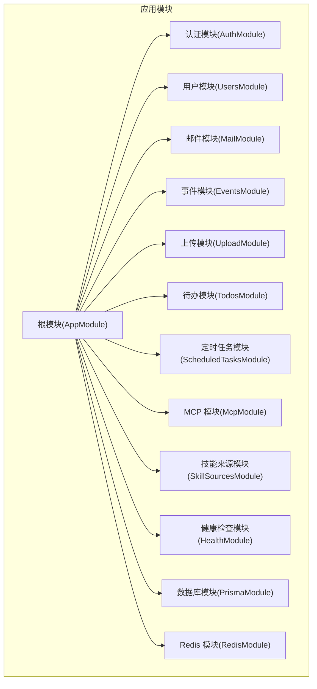
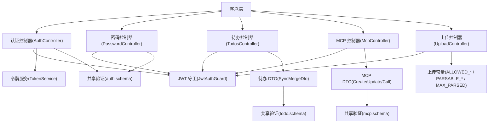
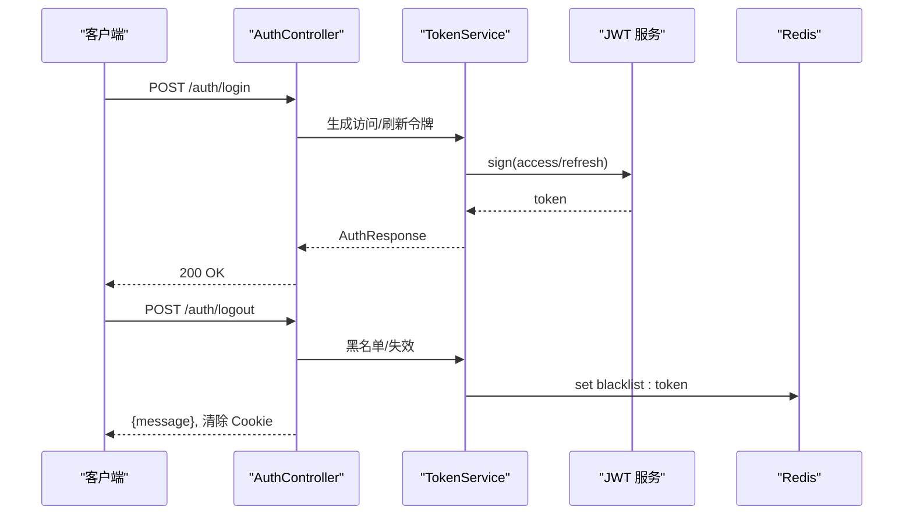
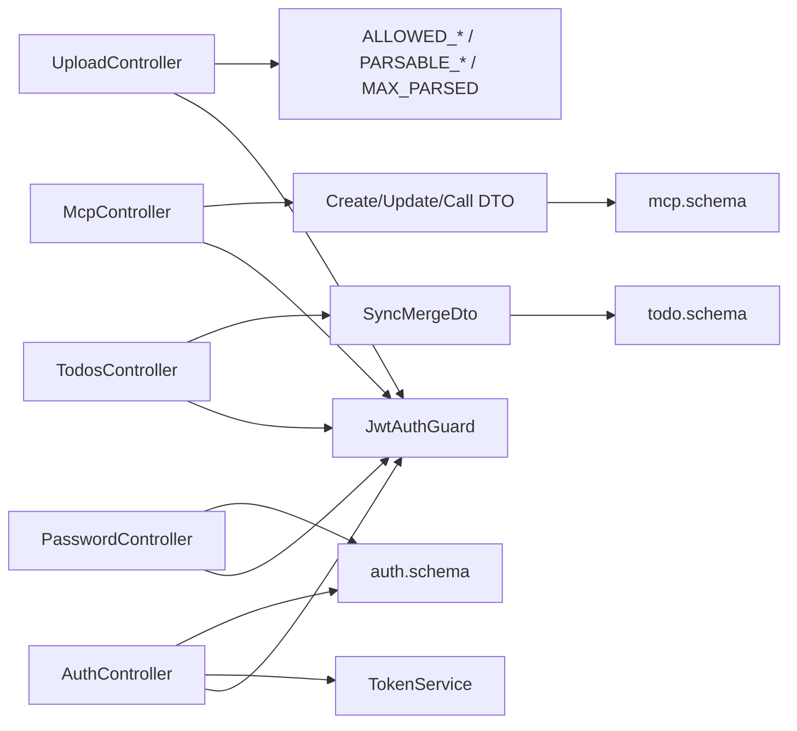

# RESTful API

<cite>
**本文引用的文件**
- [apps/backend/src/app.module.ts](file://apps/backend/src/app.module.ts)
- [apps/backend/src/auth/auth.controller.ts](file://apps/backend/src/auth/auth.controller.ts)
- [apps/backend/src/auth/password.controller.ts](file://apps/backend/src/auth/password.controller.ts)
- [apps/backend/src/auth/auth.dto.ts](file://apps/backend/src/auth/auth.dto.ts)
- [apps/backend/src/auth/jwt-auth.guard.ts](file://apps/backend/src/auth/jwt-auth.guard.ts)
- [apps/backend/src/auth/token.service.ts](file://apps/backend/src/auth/token.service.ts)
- [apps/backend/src/todos/todos.controller.ts](file://apps/backend/src/todos/todos.controller.ts)
- [apps/backend/src/todos/todos.dto.ts](file://apps/backend/src/todos/todos.dto.ts)
- [apps/backend/src/mcp/mcp.controller.ts](file://apps/backend/src/mcp/mcp.controller.ts)
- [apps/backend/src/mcp/mcp.dto.ts](file://apps/backend/src/mcp/mcp.dto.ts)
- [apps/backend/src/upload/upload.controller.ts](file://apps/backend/src/upload/upload.controller.ts)
- [apps/backend/src/upload/upload.constants.ts](file://apps/backend/src/upload/upload.constants.ts)
- [packages/shared/src/schemas/auth.schema.ts](file://packages/shared/src/schemas/auth.schema.ts)
- [packages/shared/src/schemas/todo.schema.ts](file://packages/shared/src/schemas/todo.schema.ts)
- [packages/shared/src/schemas/mcp.schema.ts](file://packages/shared/src/schemas/mcp.schema.ts)
</cite>

## 目录
1. [简介](#简介)
2. [项目结构](#项目结构)
3. [核心组件](#核心组件)
4. [架构总览](#架构总览)
5. [详细组件分析](#详细组件分析)
6. [依赖分析](#依赖分析)
7. [性能考虑](#性能考虑)
8. [故障排除指南](#故障排除指南)
9. [结论](#结论)
10. [附录](#附录)

## 简介
本文件为 Lumina Todo 后端 RESTful API 的权威技术文档，覆盖以下领域：
- 待办事项 API：创建、读取、更新、删除、批量同步与回收站管理
- 用户认证 API：登录、注册、刷新令牌、登出、找回密码与重置密码
- MCP 服务器配置与工具调用 API：创建、查询、更新、删除、连接、断开、列举工具、调用工具
- 文件上传 API：单文件上传、多文件上传、文件内容解析、删除
- JWT 认证机制与权限控制
- 速率限制与安全防护
- 数据验证规则与输入约束
- API 版本控制策略与向后兼容性

## 项目结构
后端采用 NestJS 架构，按功能模块划分，统一由根模块装配。全局启用速率限制守卫、国际化、日志、队列与缓存等基础设施。

图表来源
- [apps/backend/src/app.module.ts:27-161](file://apps/backend/src/app.module.ts#L27-L161)

章节来源
- [apps/backend/src/app.module.ts:27-161](file://apps/backend/src/app.module.ts#L27-L161)

## 核心组件
- 控制器（Controllers）：暴露 HTTP 端点，负责请求路由与响应封装
- DTO（Data Transfer Objects）：基于 Zod 的输入验证与 Swagger 文档生成
- 服务（Services）：业务逻辑与跨模块协作
- 守卫（Guards）：鉴权与速率限制
- 共享模式（Shared Schemas）：前后端一致的数据结构与验证规则

章节来源
- [apps/backend/src/auth/auth.controller.ts:14-82](file://apps/backend/src/auth/auth.controller.ts#L14-L82)
- [apps/backend/src/todos/todos.controller.ts:20-70](file://apps/backend/src/todos/todos.controller.ts#L20-L70)
- [apps/backend/src/mcp/mcp.controller.ts:30-198](file://apps/backend/src/mcp/mcp.controller.ts#L30-L198)
- [apps/backend/src/upload/upload.controller.ts:20-156](file://apps/backend/src/upload/upload.controller.ts#L20-L156)

## 架构总览
下图展示认证、待办、MCP、上传等模块之间的交互关系与依赖方向。

图表来源
- [apps/backend/src/auth/auth.controller.ts:14-82](file://apps/backend/src/auth/auth.controller.ts#L14-L82)
- [apps/backend/src/auth/password.controller.ts:10-39](file://apps/backend/src/auth/password.controller.ts#L10-L39)
- [apps/backend/src/auth/token.service.ts:15-187](file://apps/backend/src/auth/token.service.ts#L15-L187)
- [apps/backend/src/auth/jwt-auth.guard.ts:8-10](file://apps/backend/src/auth/jwt-auth.guard.ts#L8-L10)
- [apps/backend/src/todos/todos.controller.ts:20-70](file://apps/backend/src/todos/todos.controller.ts#L20-L70)
- [apps/backend/src/todos/todos.dto.ts:1-5](file://apps/backend/src/todos/todos.dto.ts#L1-L5)
- [apps/backend/src/mcp/mcp.controller.ts:30-198](file://apps/backend/src/mcp/mcp.controller.ts#L30-L198)
- [apps/backend/src/mcp/mcp.dto.ts:1-59](file://apps/backend/src/mcp/mcp.dto.ts#L1-L59)
- [apps/backend/src/upload/upload.controller.ts:20-156](file://apps/backend/src/upload/upload.controller.ts#L20-L156)
- [apps/backend/src/upload/upload.constants.ts:1-61](file://apps/backend/src/upload/upload.constants.ts#L1-L61)
- [packages/shared/src/schemas/auth.schema.ts:1-121](file://packages/shared/src/schemas/auth.schema.ts#L1-L121)
- [packages/shared/src/schemas/todo.schema.ts:1-75](file://packages/shared/src/schemas/todo.schema.ts#L1-L75)
- [packages/shared/src/schemas/mcp.schema.ts:1-220](file://packages/shared/src/schemas/mcp.schema.ts#L1-L220)

## 详细组件分析

### 认证 API
- 路由前缀：/api/auth
- 默认鉴权：无（登录、注册、忘记密码、重置密码除外）
- 速率限制：不同端点配置不同阈值，详见“速率限制与安全防护”
- 认证方式：JWT（访问令牌 + 刷新令牌），支持 Cookie 清理登出

端点一览
- POST /login
  - 功能：用户登录
  - 请求头：无特定要求
  - 请求体：LoginDto（邮箱、密码）
  - 成功响应：AuthResponse（accessToken、refreshToken、expiresIn、user）
  - 状态码：200、400、401
  - 示例：见“请求与响应示例”

- POST /register
  - 功能：用户注册
  - 请求体：RegisterDto（邮箱、姓名、密码）
  - 成功响应：AuthResponse
  - 状态码：201、400、409
  - 示例：见“请求与响应示例”

- POST /refresh
  - 功能：刷新访问令牌
  - 请求体：RefreshTokenDto（refreshToken）
  - 成功响应：AuthResponse
  - 状态码：200、400、401
  - 示例：见“请求与响应示例”

- GET /me
  - 功能：获取当前用户信息
  - 请求头：Authorization: Bearer <accessToken>
  - 成功响应：User
  - 状态码：200、401
  - 示例：见“请求与响应示例”

- POST /logout
  - 功能：用户登出
  - 请求体：LogoutDto（refreshToken）
  - 成功响应：{ message }
  - 状态码：200、400、401
  - 行为：清除 accessToken、refreshToken Cookie

- POST /forgot-password
  - 功能：请求密码重置
  - 请求体：ForgotPasswordDto（邮箱）
  - 成功响应：{ message }
  - 状态码：200、400
  - 示例：见“请求与响应示例”

- POST /reset-password
  - 功能：重置密码
  - 请求体：ResetPasswordDto（token、password）
  - 成功响应：{ message }
  - 状态码：200、400、404
  - 示例：见“请求与响应示例”

请求与响应示例（成功/错误）
- 登录成功响应示例
  - 响应体字段：accessToken、refreshToken、expiresIn、user
  - user 字段：id、email、name、avatar、createdAt、updatedAt
- 注册成功响应示例
  - 响应体：AuthResponse
- 忘记密码成功响应示例
  - 响应体：{ message }（提示若邮箱存在则已发送）
- 重置密码成功响应示例
  - 响应体：{ message }（提示可使用新密码登录）

数据验证规则与输入约束
- 邮箱：必填、合法格式、小写、去空白
- 密码：必填、长度 6~100
- 姓名：必填、长度 2~50
- 刷新/登出 token：必填且非空
- 共享验证规则参见 auth.schema.ts

章节来源
- [apps/backend/src/auth/auth.controller.ts:19-80](file://apps/backend/src/auth/auth.controller.ts#L19-L80)
- [apps/backend/src/auth/password.controller.ts:15-37](file://apps/backend/src/auth/password.controller.ts#L15-L37)
- [apps/backend/src/auth/auth.dto.ts:15-40](file://apps/backend/src/auth/auth.dto.ts#L15-L40)
- [packages/shared/src/schemas/auth.schema.ts:25-110](file://packages/shared/src/schemas/auth.schema.ts#L25-L110)

### 待办事项 API
- 路由前缀：/api/todos
- 鉴权：全部端点需 JWT 认证
- 速率限制：默认全局限流（ThrottlerGuard），部分端点可能有额外装饰器

端点一览
- POST /sync
  - 功能：离线优先的同步与合并
  - 请求头：X-Socket-ID（可选，用于实时推送）
  - 请求体：SyncMergeDto（todos 数组、lastSyncAt）
  - 成功响应：SyncResponse（synced、deletedIds、acceptedIds、conflicts、serverTime）
  - 状态码：200、400、401
  - 示例：见“请求与响应示例”

- GET /
  - 功能：获取当前用户所有待办
  - 成功响应：Todo[]
  - 状态码：200、401

- GET /trash
  - 功能：获取回收站中的待办
  - 成功响应：Todo[]
  - 状态码：200、401

- POST /:id/restore
  - 功能：从回收站恢复
  - 成功响应：Todo
  - 状态码：200、404

- DELETE /:id/permanent
  - 功能：永久删除
  - 成功响应：void
  - 状态码：204、404

- DELETE /trash/clear
  - 功能：清空回收站
  - 成功响应：void
  - 状态码：204、401

请求与响应示例（成功/错误）
- 同步响应示例
  - 字段：synced（数组，元素为 Todo）、deletedIds（字符串数组）、acceptedIds（可选）、conflicts（可选）、serverTime（字符串）
- Todo 字段示例
  - id、title、completed、order、isPinned、parentId、version、pomodoroCount、dueAt、remindAt、recurrenceRule、recurrenceTz、createdAt、updatedAt、completedAt、deletedAt

数据验证规则与输入约束
- Todo 字段：id（UUID）、title（1~500）、completed（布尔）、order（整数）、isPinned（布尔）、parentId（UUID 或 null）、version（整数）、dueAt/remindAt（日期或 ISO 字符串）、recurrenceRule（枚举 DAILY/WEEKDAYS/WEEKLY/MONTHLY 或 null）、createdAt/updatedAt（日期或 ISO 字符串）
- SyncMergeRequest：todos（数组，元素为 Todo）、lastSyncAt（日期或可解析的 ISO 字符串，可选）

章节来源
- [apps/backend/src/todos/todos.controller.ts:30-68](file://apps/backend/src/todos/todos.controller.ts#L30-L68)
- [apps/backend/src/todos/todos.dto.ts:1-5](file://apps/backend/src/todos/todos.dto.ts#L1-L5)
- [packages/shared/src/schemas/todo.schema.ts:8-75](file://packages/shared/src/schemas/todo.schema.ts#L8-L75)

### MCP 服务器配置与工具调用 API
- 路由前缀：/api/mcp
- 鉴权：全部端点需 JWT 认证
- 传输类型：stdio、http；HTTP URL 仅允许公网 http(s)，禁止 localhost、.local、私网与环回地址

端点一览
- POST /servers
  - 功能：创建 MCP 服务器配置
  - 请求体：CreateMcpServerDto（name、description、transport、config、enabled）
  - 成功响应：McpServerResponse
  - 状态码：201、400

- GET /servers
  - 功能：获取当前用户所有服务器配置
  - 成功响应：McpServerResponse[]
  - 状态码：200、401

- GET /servers/:id
  - 功能：按 ID 获取服务器配置
  - 路径参数：id（UUID）
  - 成功响应：McpServerResponse
  - 状态码：200、404

- PUT /servers/:id
  - 功能：更新服务器配置
  - 路径参数：id（UUID）
  - 请求体：UpdateMcpServerDto（name/description/transport/config/enabled 可选，但 transport 与 config 需匹配）
  - 成功响应：McpServerResponse
  - 状态码：200、400、404

- DELETE /servers/:id
  - 功能：删除服务器配置并断开连接
  - 路径参数：id（UUID）
  - 成功响应：void（204）
  - 状态码：204、404

- GET /tools
  - 功能：获取所有已启用服务器的工具清单（懒连接）
  - 成功响应：McpToolResponse[]（注入 serverId）
  - 状态码：200、401

- POST /servers/:id/connect
  - 功能：连接到指定服务器
  - 路径参数：id（UUID）
  - 成功响应：void（204）
  - 状态码：204、404

- POST /servers/:id/disconnect
  - 功能：断开指定服务器连接
  - 路径参数：id（UUID）
  - 成功响应：void（204）
  - 状态码：204、404

- GET /servers/:id/tools
  - 功能：获取指定服务器的工具清单（懒连接）
  - 成功响应：McpToolResponse[]
  - 状态码：200、404

- POST /servers/:id/tools/call
  - 功能：调用工具
  - 请求体：CallToolDto（name、arguments）
  - 成功响应：ToolCallResult
  - 状态码：200、400、404

请求与响应示例（成功/错误）
- 创建/更新服务器响应示例
  - 字段：id、name、description、transport、config（stdio/http）、enabled、userId、createdAt、updatedAt
- 工具列表响应示例
  - 字段：name、description、inputSchema、serverId（注入）
- 工具调用响应示例
  - 字段：content（数组，元素含 type、text、data、mimeType 等）、isError（可选）

数据验证规则与输入约束
- 传输类型：必须为 stdio 或 http
- HTTP URL：必须为 http/https，且主机名不允许为 localhost、.local、.localhost、私网/环回地址
- stdio：command 必填；args/env/cwd 可选
- http：url 必填且合法；headers 可选；auth 支持 bearer/api_key/oauth（token、apiKey、apiKeyHeader 可选，默认 X-API-Key）
- 传输与配置必须匹配；更新时 transport 与 config 需同时提供

章节来源
- [apps/backend/src/mcp/mcp.controller.ts:45-196](file://apps/backend/src/mcp/mcp.controller.ts#L45-L196)
- [apps/backend/src/mcp/mcp.dto.ts:22-59](file://apps/backend/src/mcp/mcp.dto.ts#L22-L59)
- [packages/shared/src/schemas/mcp.schema.ts:123-220](file://packages/shared/src/schemas/mcp.schema.ts#L123-L220)

### 文件上传 API
- 路由前缀：/api/upload
- 鉴权：全部端点需 JWT 认证
- 速率限制：默认全局限流（ThrottlerGuard）

端点一览
- POST /single
  - 功能：上传单个文件
  - 请求：multipart/form-data，字段 file（二进制）
  - 成功响应：UploadResult
  - 状态码：200、400

- POST /parse
  - 功能：解析文件内容（文本类扩展名）
  - 请求：multipart/form-data，字段 file（二进制）
  - 成功响应：{ content: string }
  - 状态码：200、400

- POST /multiple
  - 功能：上传多个文件（最多 10 个）
  - 请求：multipart/form-data，字段 files（数组，二进制）
  - 成功响应：UploadResult[]
  - 状态码：200、400

- DELETE /:key
  - 功能：删除文件
  - 路径参数：key（文件标识）
  - 成功响应：{ success: true }
  - 状态码：200、404

请求与响应示例（成功/错误）
- 单文件/多文件上传响应示例
  - UploadResult 字段：key、url、size、mimetype、originalname
- 文件解析响应示例
  - 返回 { content: string }，最大字符数受常量限制

数据验证规则与输入约束
- 允许的 MIME 类型与扩展名：见 upload.constants.ts
- 文本可解析扩展名：见 upload.constants.ts
- 单文件：fieldname 必须为 file
- 多文件：fieldname 必须为 files，至少 1 个
- 文件大小：受存储服务与解析服务限制

章节来源
- [apps/backend/src/upload/upload.controller.ts:68-154](file://apps/backend/src/upload/upload.controller.ts#L68-L154)
- [apps/backend/src/upload/upload.constants.ts:1-61](file://apps/backend/src/upload/upload.constants.ts#L1-L61)

### JWT 认证机制与权限控制
- 访问令牌（短期）：默认过期时间由配置决定
- 刷新令牌（长期）：用于换取新的访问令牌
- 登出：清理 Cookie，并将令牌加入黑名单（基于 Redis TTL）
- 会话失效：支持按用户强制失效历史会话
- 权限控制：所有受保护端点均使用 JwtAuthGuard

图表来源
- [apps/backend/src/auth/auth.controller.ts:22-80](file://apps/backend/src/auth/auth.controller.ts#L22-L80)
- [apps/backend/src/auth/token.service.ts:78-185](file://apps/backend/src/auth/token.service.ts#L78-L185)

章节来源
- [apps/backend/src/auth/token.service.ts:15-187](file://apps/backend/src/auth/token.service.ts#L15-L187)
- [apps/backend/src/auth/jwt-auth.guard.ts:8-10](file://apps/backend/src/auth/jwt-auth.guard.ts#L8-L10)

### 速率限制与安全防护
- 全局速率限制：短/中/长窗口三档配置
- 端点级限流：登录/注册/忘记密码/重置密码等端点设置独立阈值
- 安全策略：
  - HTTP MCP URL 仅允许公网地址
  - 禁止 localhost、.local、.localhost、私网与环回地址
  - 文件上传类型白名单与扩展名校验
  - 登出时令牌黑名单与 Cookie 清理

章节来源
- [apps/backend/src/app.module.ts:117-138](file://apps/backend/src/app.module.ts#L117-L138)
- [apps/backend/src/auth/auth.controller.ts:22-48](file://apps/backend/src/auth/auth.controller.ts#L22-L48)
- [apps/backend/src/auth/password.controller.ts:19-32](file://apps/backend/src/auth/password.controller.ts#L19-L32)
- [packages/shared/src/schemas/mcp.schema.ts:63-117](file://packages/shared/src/schemas/mcp.schema.ts#L63-L117)
- [apps/backend/src/upload/upload.controller.ts:51-63](file://apps/backend/src/upload/upload.controller.ts#L51-L63)

## 依赖分析
- 控制器依赖服务与 DTO，服务依赖共享验证模式
- JWT 守卫统一拦截受保护端点
- 速率限制由全局守卫与端点装饰器共同生效

图表来源
- [apps/backend/src/auth/auth.controller.ts:14-82](file://apps/backend/src/auth/auth.controller.ts#L14-L82)
- [apps/backend/src/auth/password.controller.ts:10-39](file://apps/backend/src/auth/password.controller.ts#L10-L39)
- [apps/backend/src/todos/todos.controller.ts:20-70](file://apps/backend/src/todos/todos.controller.ts#L20-L70)
- [apps/backend/src/mcp/mcp.controller.ts:30-198](file://apps/backend/src/mcp/mcp.controller.ts#L30-L198)
- [apps/backend/src/upload/upload.controller.ts:20-156](file://apps/backend/src/upload/upload.controller.ts#L20-L156)
- [apps/backend/src/auth/token.service.ts:15-187](file://apps/backend/src/auth/token.service.ts#L15-L187)
- [apps/backend/src/todos/todos.dto.ts:1-5](file://apps/backend/src/todos/todos.dto.ts#L1-L5)
- [apps/backend/src/mcp/mcp.dto.ts:1-59](file://apps/backend/src/mcp/mcp.dto.ts#L1-L59)
- [apps/backend/src/upload/upload.constants.ts:1-61](file://apps/backend/src/upload/upload.constants.ts#L1-L61)
- [packages/shared/src/schemas/auth.schema.ts:1-121](file://packages/shared/src/schemas/auth.schema.ts#L1-L121)
- [packages/shared/src/schemas/todo.schema.ts:1-75](file://packages/shared/src/schemas/todo.schema.ts#L1-L75)
- [packages/shared/src/schemas/mcp.schema.ts:1-220](file://packages/shared/src/schemas/mcp.schema.ts#L1-L220)

## 性能考虑
- 速率限制：避免暴力破解与滥用，建议客户端实现指数退避
- 懒连接：MCP 工具发现与调用按需建立连接，降低资源占用
- 文件解析：对超长内容进行截断，避免内存压力
- 日志与监控：生产环境使用 JSON 日志，便于集中采集与检索

## 故障排除指南
常见错误与定位
- 401 未授权
  - 检查 Authorization 头是否携带有效 accessToken
  - 确认令牌未被黑名单或已过期
- 403 禁止访问
  - 检查用户是否拥有目标资源所有权（如删除/更新 MCP 服务器）
- 400 参数错误
  - 核对 DTO 字段类型与长度约束
  - 对于上传：确认 fieldname 正确、文件类型在白名单内
- 404 资源不存在
  - 确认 ID 格式正确（UUID），资源是否存在
- 429 请求过于频繁
  - 降低请求频率或等待限流窗口重置

章节来源
- [apps/backend/src/auth/token.service.ts:103-125](file://apps/backend/src/auth/token.service.ts#L103-L125)
- [apps/backend/src/upload/upload.controller.ts:80-87](file://apps/backend/src/upload/upload.controller.ts#L80-L87)
- [apps/backend/src/upload/upload.controller.ts:131-144](file://apps/backend/src/upload/upload.controller.ts#L131-L144)
- [apps/backend/src/mcp/mcp.controller.ts:94-101](file://apps/backend/src/mcp/mcp.controller.ts#L94-L101)

## 结论
本 API 设计遵循 REST 原则，结合 NestJS 与 Zod 实现强类型与高可靠的数据验证；通过 JWT、速率限制与安全校验构建了完善的认证与防护体系；模块化组织便于演进与维护。建议在客户端实现幂等与重试策略，并严格遵守速率限制与输入约束。

## 附录

### API 版本控制策略与向后兼容性
- 当前未显式声明 API 版本号（如 /v1/ 前缀）
- 建议后续引入版本前缀与语义化版本，确保变更不影响现有客户端
- 对破坏性变更采用双轨发布与迁移脚本，保证向后兼容

### 请求与响应示例（摘要）
- 登录
  - 请求体：{ email, password }
  - 成功响应：{ accessToken, refreshToken, expiresIn, user }
- 注册
  - 请求体：{ email, name, password }
  - 成功响应：{ accessToken, refreshToken, expiresIn, user }
- 刷新
  - 请求体：{ refreshToken }
  - 成功响应：{ accessToken, refreshToken, expiresIn, user }
- 忘记密码
  - 请求体：{ email }
  - 成功响应：{ message }
- 重置密码
  - 请求体：{ token, password }
  - 成功响应：{ message }
- 待办同步
  - 请求体：{ todos[], lastSyncAt }
  - 成功响应：{ synced[], deletedIds[], acceptedIds[], conflicts[], serverTime }
- MCP 服务器
  - 创建/更新：请求体包含 name、description、transport、config、enabled
  - 工具调用：请求体 { name, arguments }
  - 成功响应：McpServerResponse 或 ToolCallResult
- 上传
  - 单文件：multipart file
  - 多文件：multipart files[]
  - 成功响应：UploadResult 或 UploadResult[]
  - 删除：DELETE /upload/:key