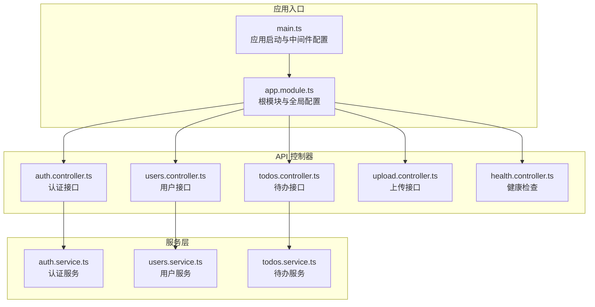
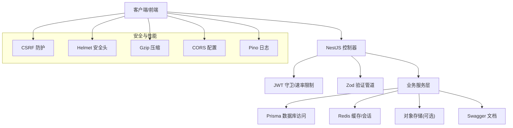
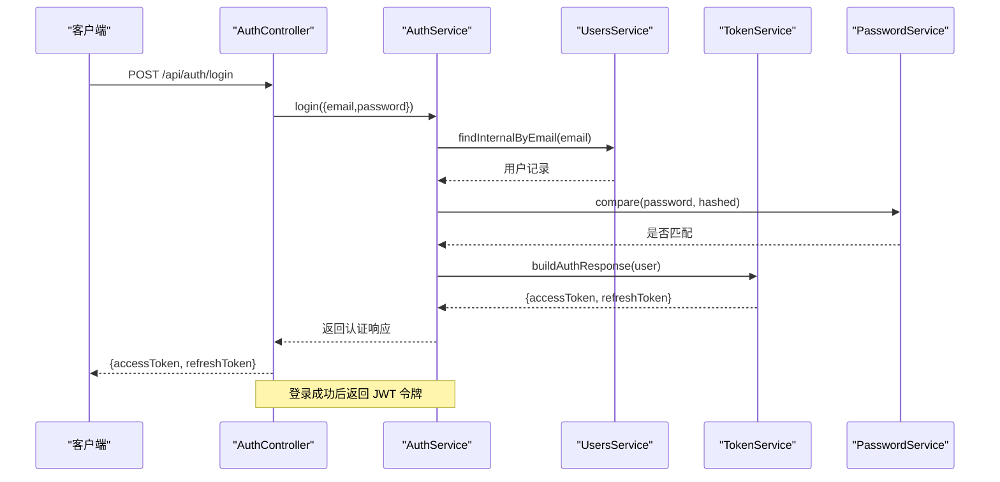
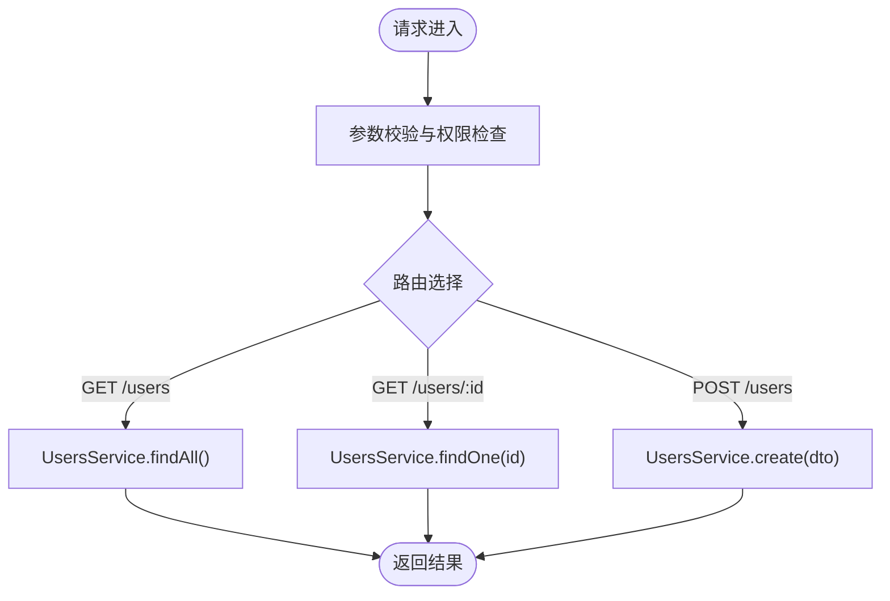
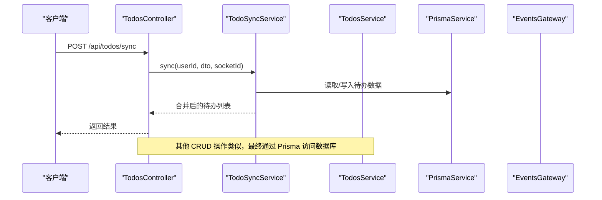
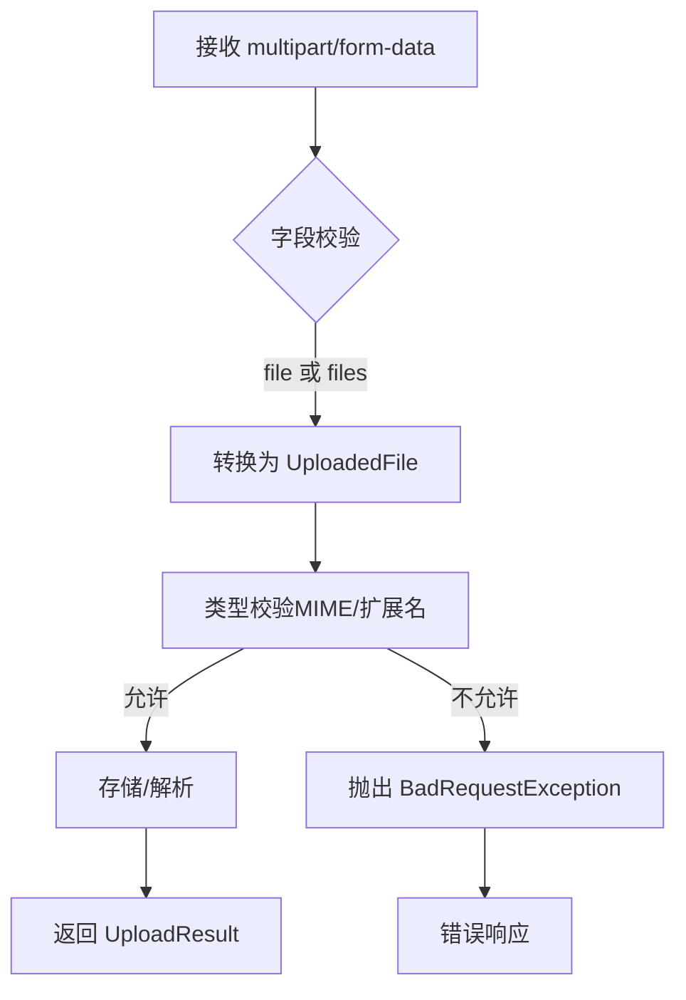
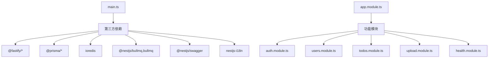

# RESTful API

<cite>
**本文引用的文件**
- [apps/backend/src/main.ts](file://apps/backend/src/main.ts)
- [apps/backend/src/app.module.ts](file://apps/backend/src/app.module.ts)
- [apps/backend/src/auth/auth.controller.ts](file://apps/backend/src/auth/auth.controller.ts)
- [apps/backend/src/auth/auth.service.ts](file://apps/backend/src/auth/auth.service.ts)
- [apps/backend/src/auth/auth.dto.ts](file://apps/backend/src/auth/auth.dto.ts)
- [apps/backend/src/users/users.controller.ts](file://apps/backend/src/users/users.controller.ts)
- [apps/backend/src/users/users.service.ts](file://apps/backend/src/users/users.service.ts)
- [apps/backend/src/todos/todos.controller.ts](file://apps/backend/src/todos/todos.controller.ts)
- [apps/backend/src/todos/todos.service.ts](file://apps/backend/src/todos/todos.service.ts)
- [apps/backend/src/todos/todos.dto.ts](file://apps/backend/src/todos/todos.dto.ts)
- [apps/backend/src/upload/upload.controller.ts](file://apps/backend/src/upload/upload.controller.ts)
- [apps/backend/src/upload/upload.constants.ts](file://apps/backend/src/upload/upload.constants.ts)
- [apps/backend/src/health/health.controller.ts](file://apps/backend/src/health/health.controller.ts)
- [apps/backend/package.json](file://apps/backend/package.json)
</cite>

## 目录
1. [简介](#简介)
2. [项目结构](#项目结构)
3. [核心组件](#核心组件)
4. [架构总览](#架构总览)
5. [详细组件分析](#详细组件分析)
6. [依赖关系分析](#依赖关系分析)
7. [性能考虑](#性能考虑)
8. [故障排除指南](#故障排除指南)
9. [结论](#结论)

## 简介
本项目采用 NestJS + Fastify 架构构建 RESTful API，提供认证授权、用户管理、待办事项同步、文件上传与解析、健康检查等能力。API 通过全局中间件实现安全防护（CSRF、XSS、压缩、CORS），并通过 Swagger 自动生成 OpenAPI 文档。系统以模块化方式组织，包含认证模块、用户模块、待办模块、上传模块、健康检查模块等。

## 项目结构
后端应用位于 apps/backend，采用按功能域划分的模块化结构：
- 根模块：集中导入各功能模块与全局中间件
- 控制器层：暴露 HTTP 接口，负责请求路由与参数校验
- 服务层：封装业务逻辑，调用数据访问层与外部服务
- DTO 层：基于 Zod Schema 的数据传输对象，自动生成 Swagger 文档
- 中间件与拦截器：统一处理安全、日志、异常与响应格式

**图表来源**
- [apps/backend/src/main.ts:34-195](file://apps/backend/src/main.ts#L34-L195)
- [apps/backend/src/app.module.ts:27-169](file://apps/backend/src/app.module.ts#L27-L169)

**章节来源**
- [apps/backend/src/main.ts:34-195](file://apps/backend/src/main.ts#L34-L195)
- [apps/backend/src/app.module.ts:27-169](file://apps/backend/src/app.module.ts#L27-L169)

## 核心组件
- 应用入口与中间件
  - 全局启用 CORS、Helmet 安全头、Gzip 压缩、静态资源托管、CSRF 防护
  - 全局 Zod 验证管道、异常过滤器、响应转换与 XSS 清理拦截器
  - Swagger 文档生成与优雅退出钩子
- 根模块
  - 集成配置、日志、事件、队列、国际化、数据库、缓存、健康检查、认证、用户、邮件、WebSocket、上传、定时任务、MCP、技能源等模块
  - 全局速率限制守卫
- API 模块
  - 认证：登录、注册、刷新令牌、登出、获取当前用户
  - 用户：查询所有用户、按 ID 查询、创建用户
  - 待办：同步合并、查询全部、回收站、恢复、永久删除、清空回收站
  - 上传：单文件上传、多文件上传、文件解析、删除
  - 健康检查：综合健康检查、存活探针、就绪探针

**章节来源**
- [apps/backend/src/main.ts:48-170](file://apps/backend/src/main.ts#L48-L170)
- [apps/backend/src/app.module.ts:27-169](file://apps/backend/src/app.module.ts#L27-L169)
- [apps/backend/src/auth/auth.controller.ts:14-82](file://apps/backend/src/auth/auth.controller.ts#L14-L82)
- [apps/backend/src/users/users.controller.ts:12-50](file://apps/backend/src/users/users.controller.ts#L12-L50)
- [apps/backend/src/todos/todos.controller.ts:20-70](file://apps/backend/src/todos/todos.controller.ts#L20-L70)
- [apps/backend/src/upload/upload.controller.ts:20-156](file://apps/backend/src/upload/upload.controller.ts#L20-L156)
- [apps/backend/src/health/health.controller.ts:16-77](file://apps/backend/src/health/health.controller.ts#L16-L77)

## 架构总览
系统采用分层架构，控制器负责请求路由与参数校验，服务层封装业务逻辑，数据访问通过 Prisma 完成。全局中间件提供安全与性能保障，Swagger 自动生成 API 文档，便于前后端协作与自动化测试。

**图表来源**
- [apps/backend/src/main.ts:48-170](file://apps/backend/src/main.ts#L48-L170)
- [apps/backend/src/app.module.ts:27-169](file://apps/backend/src/app.module.ts#L27-L169)

## 详细组件分析

### 认证模块
- 控制器接口
  - POST /api/auth/login：登录，带速率限制
  - POST /api/auth/register：注册，带速率限制
  - POST /api/auth/refresh：刷新访问令牌
  - GET /api/auth/me：获取当前用户信息
  - POST /api/auth/logout：登出并清除 Cookie
- 服务层
  - 用户凭据验证、密码比较、JWT 令牌构建
  - 刷新令牌校验与黑名单管理
  - 密码重置流程（请求与重置）

**图表来源**
- [apps/backend/src/auth/auth.controller.ts:14-82](file://apps/backend/src/auth/auth.controller.ts#L14-L82)
- [apps/backend/src/auth/auth.service.ts:12-127](file://apps/backend/src/auth/auth.service.ts#L12-L127)
- [apps/backend/src/users/users.service.ts:12-110](file://apps/backend/src/users/users.service.ts#L12-L110)

**章节来源**
- [apps/backend/src/auth/auth.controller.ts:14-82](file://apps/backend/src/auth/auth.controller.ts#L14-L82)
- [apps/backend/src/auth/auth.service.ts:12-127](file://apps/backend/src/auth/auth.service.ts#L12-L127)
- [apps/backend/src/auth/auth.dto.ts:1-41](file://apps/backend/src/auth/auth.dto.ts#L1-L41)

### 用户模块
- 控制器接口
  - GET /api/users：获取所有用户（需认证）
  - GET /api/users/:id：按 ID 获取用户（需认证）
  - POST /api/users：创建新用户（需认证）
- 服务层
  - 用户查询、创建（密码哈希）、更新、内部查询（含密码）

**图表来源**
- [apps/backend/src/users/users.controller.ts:12-50](file://apps/backend/src/users/users.controller.ts#L12-L50)
- [apps/backend/src/users/users.service.ts:12-110](file://apps/backend/src/users/users.service.ts#L12-L110)

**章节来源**
- [apps/backend/src/users/users.controller.ts:12-50](file://apps/backend/src/users/users.controller.ts#L12-L50)
- [apps/backend/src/users/users.service.ts:12-110](file://apps/backend/src/users/users.service.ts#L12-L110)

### 待办模块
- 控制器接口
  - POST /api/todos/sync：同步并合并待办事项（离线优先）
  - GET /api/todos：获取当前用户所有待办
  - GET /api/todos/trash：获取回收站中的待办
  - POST /api/todos/:id/restore：恢复已删除的待办
  - DELETE /api/todos/:id/permanent：永久删除待办
  - DELETE /api/todos/trash/clear：清空回收站
- 服务层
  - 查询、恢复、永久删除（事务+墓碑表）、清空回收站（批量墓碑+删除）

**图表来源**
- [apps/backend/src/todos/todos.controller.ts:20-70](file://apps/backend/src/todos/todos.controller.ts#L20-L70)
- [apps/backend/src/todos/todos.service.ts:26-146](file://apps/backend/src/todos/todos.service.ts#L26-L146)

**章节来源**
- [apps/backend/src/todos/todos.controller.ts:20-70](file://apps/backend/src/todos/todos.controller.ts#L20-L70)
- [apps/backend/src/todos/todos.service.ts:26-146](file://apps/backend/src/todos/todos.service.ts#L26-L146)
- [apps/backend/src/todos/todos.dto.ts:1-5](file://apps/backend/src/todos/todos.dto.ts#L1-L5)

### 上传模块
- 控制器接口
  - POST /api/upload/single：单文件上传
  - POST /api/upload/multiple：多文件上传（最多 10 个）
  - POST /api/upload/parse：解析文件内容
  - DELETE /api/upload/:key：删除文件
- 服务层
  - 文件类型校验（MIME 类型与扩展名）
  - 文件缓冲区转换与存储
  - 文件解析（文本类文件内容提取）

**图表来源**
- [apps/backend/src/upload/upload.controller.ts:20-156](file://apps/backend/src/upload/upload.controller.ts#L20-L156)
- [apps/backend/src/upload/upload.constants.ts:1-61](file://apps/backend/src/upload/upload.constants.ts#L1-L61)

**章节来源**
- [apps/backend/src/upload/upload.controller.ts:20-156](file://apps/backend/src/upload/upload.controller.ts#L20-L156)
- [apps/backend/src/upload/upload.constants.ts:1-61](file://apps/backend/src/upload/upload.constants.ts#L1-L61)

### 健康检查模块
- 控制器接口
  - GET /api/health：综合健康检查（数据库、Redis、内存、磁盘）
  - GET /api/health/liveness：存活探针
  - GET /api/health/readiness：就绪探针
- 指标说明
  - 数据库连接健康
  - Redis 连接健康
  - 堆内存与 RSS 使用阈值
  - 磁盘使用百分比阈值

**章节来源**
- [apps/backend/src/health/health.controller.ts:16-77](file://apps/backend/src/health/health.controller.ts#L16-L77)

## 依赖关系分析
- 应用启动依赖
  - Fastify 适配器、Pino 日志、Swagger、Zod 验证、全局拦截器与过滤器
  - CORS、Helmet、Gzip、静态资源、CSRF 防护中间件
- 模块依赖
  - 根模块导入 Prisma、Redis、BullMQ、I18n、Throttler、EventEmitter 等基础设施模块
  - 功能模块按需注入服务与 DTO
- 第三方库
  - 安全与性能：@fastify/helmet、@fastify/compress、@fastify/cookie、@fastify/multipart
  - ORM 与缓存：@prisma/client、ioredis、cache-manager
  - 队列与任务：@nestjs/bullmq、bullmq
  - 文档与国际化：@nestjs/swagger、nestjs-i18n
  - 工具库：bcryptjs、sanitize-html、xss、lodash、dayjs

**图表来源**
- [apps/backend/src/main.ts:34-195](file://apps/backend/src/main.ts#L34-L195)
- [apps/backend/src/app.module.ts:27-169](file://apps/backend/src/app.module.ts#L27-L169)
- [apps/backend/package.json:30-86](file://apps/backend/package.json#L30-L86)

**章节来源**
- [apps/backend/package.json:30-86](file://apps/backend/package.json#L30-L86)

## 性能考虑
- 传输优化
  - Gzip 压缩开启，阈值 1KB；静态资源托管减少服务器压力
- 安全与稳定性
  - Helmet 安全头降低 XSS、点击劫持风险；CSRF 防护提升跨站请求安全性
  - 全局 Zod 验证与拦截器保证输入安全与响应一致性
- 可观测性
  - Pino 日志按状态码分级输出，便于生产问题定位
  - Swagger 文档自动生成，便于接口调试与自动化测试
- 并发与限流
  - 全局 ThrottlerGuard 与控制器级 Throttle 配置，防止暴力破解与滥用
- 数据访问
  - Prisma 查询使用精确字段选择与排序，减少网络与序列化开销

## 故障排除指南
- 认证相关
  - 登录失败：检查邮箱/密码是否正确，确认用户存在且密码有效
  - 刷新令牌无效：确认令牌未被加入黑名单、用户会话未失效、令牌类型为 refresh
  - 登出后仍可访问：确认 Cookie 清除与黑名单写入成功
- 用户相关
  - 用户不存在或 ID 非法：检查路径参数与数据库记录
  - 邮箱冲突：注册时检查重复邮箱
- 待办相关
  - 恢复/删除失败：确认待办属于当前用户且存在
  - 同步合并异常：检查请求体结构与版本号一致性
- 上传相关
  - 文件类型不支持：确认 MIME 类型或扩展名在允许列表中
  - 上传失败：检查文件大小与数量限制、存储服务可用性
- 健康检查
  - 探针失败：检查数据库连接、Redis 服务、内存与磁盘阈值

**章节来源**
- [apps/backend/src/auth/auth.service.ts:58-101](file://apps/backend/src/auth/auth.service.ts#L58-L101)
- [apps/backend/src/users/users.service.ts:27-95](file://apps/backend/src/users/users.service.ts#L27-L95)
- [apps/backend/src/todos/todos.service.ts:65-144](file://apps/backend/src/todos/todos.service.ts#L65-L144)
- [apps/backend/src/upload/upload.controller.ts:51-87](file://apps/backend/src/upload/upload.controller.ts#L51-L87)
- [apps/backend/src/health/health.controller.ts:34-75](file://apps/backend/src/health/health.controller.ts#L34-L75)

## 结论
本 RESTful API 以 NestJS + Fastify 为基础，结合全局安全中间件、Zod 验证、Swagger 文档与模块化架构，提供了认证授权、用户管理、待办同步、文件上传与健康检查等完整能力。通过严格的输入校验、速率限制与安全头配置，系统在保证易用性的同时兼顾了安全性与可维护性。建议后续持续完善单元测试与端到端测试覆盖，并根据业务增长调整限流与缓存策略。