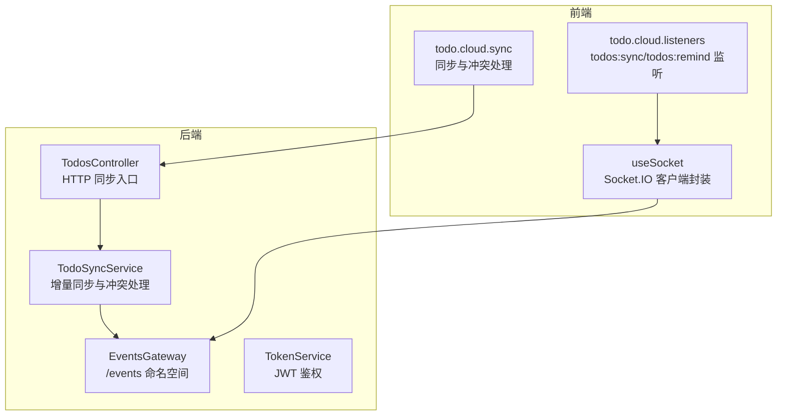
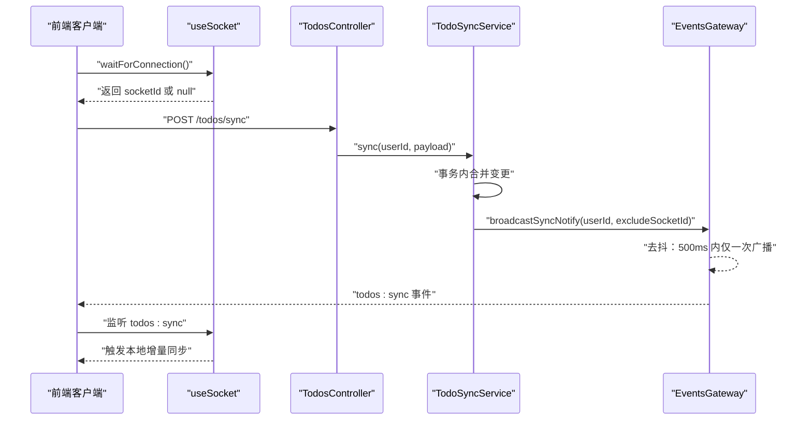
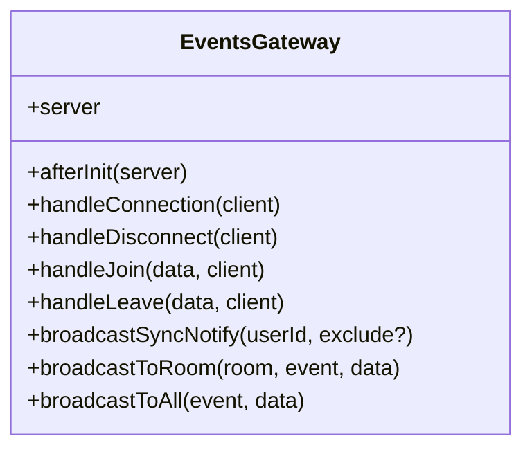
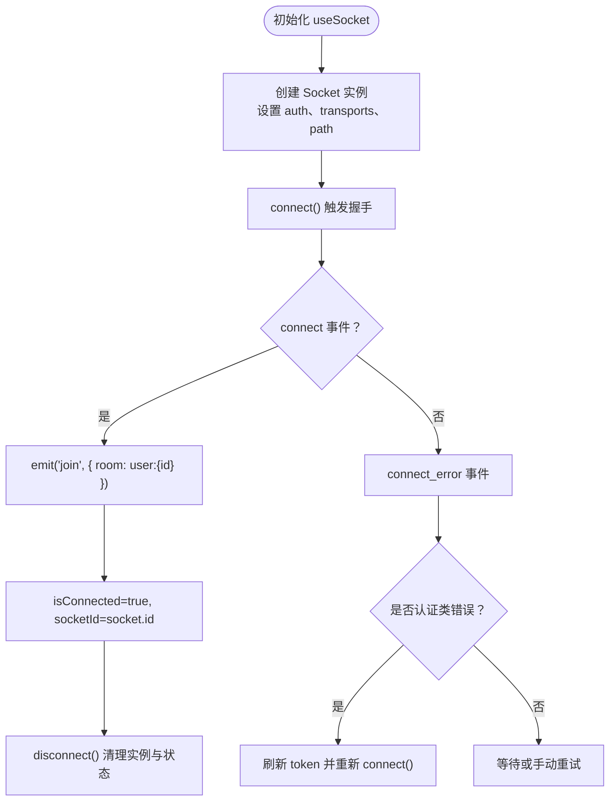
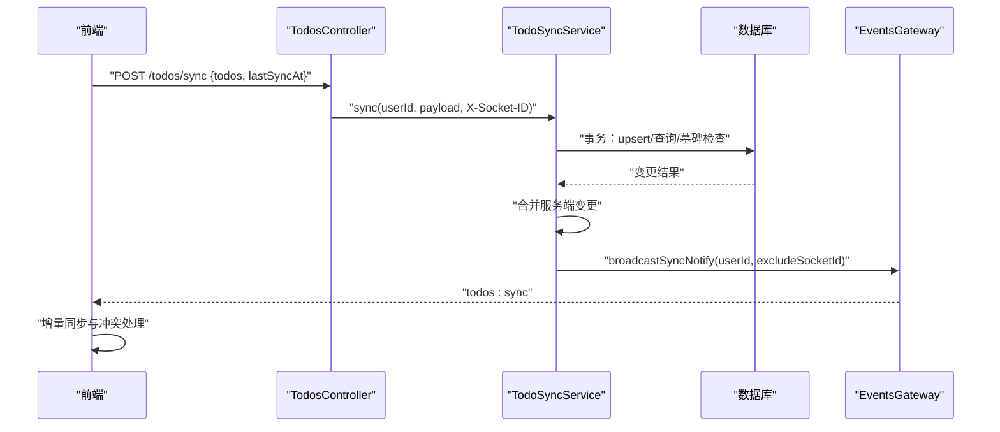
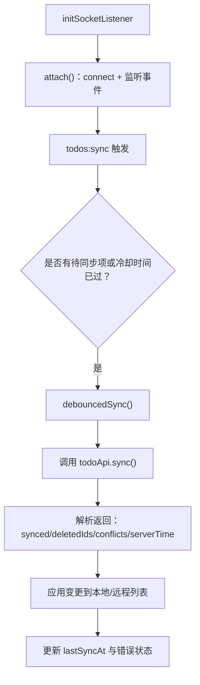
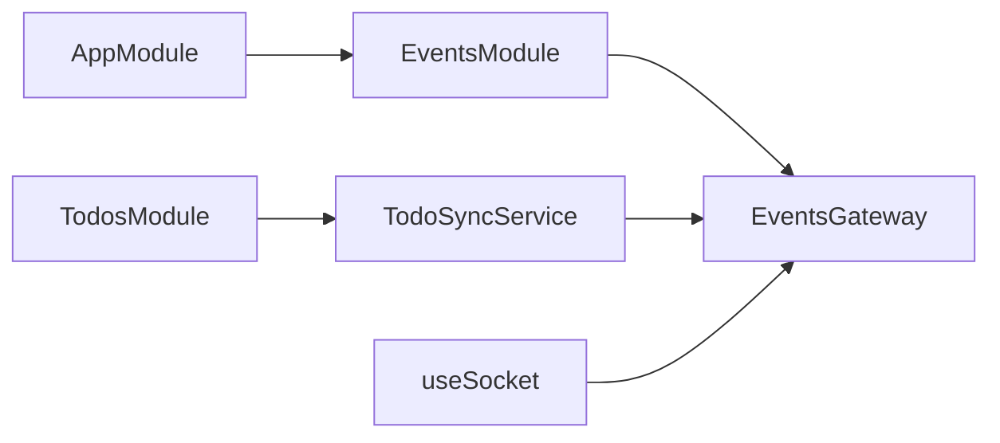

# WebSocket 实时通信 API

<cite>
**本文引用的文件**
- [apps/backend/src/events/events.gateway.ts](file://apps/backend/src/events/events.gateway.ts)
- [apps/backend/src/events/events.module.ts](file://apps/backend/src/events/events.module.ts)
- [apps/backend/src/app.module.ts](file://apps/backend/src/app.module.ts)
- [apps/backend/src/todos/todos-sync.service.ts](file://apps/backend/src/todos/todos-sync.service.ts)
- [apps/backend/src/todos/todos.controller.ts](file://apps/backend/src/todos/todos.controller.ts)
- [apps/frontend/src/composables/useSocket.ts](file://apps/frontend/src/composables/useSocket.ts)
- [apps/frontend/src/features/todo/stores/todo.cloud.listeners.ts](file://apps/frontend/src/features/todo/stores/todo.cloud.listeners.ts)
- [apps/frontend/src/features/todo/stores/todo.cloud.sync.ts](file://apps/frontend/src/features/todo/stores/todo.cloud.sync.ts)
- [apps/backend/src/common/filters/all-exceptions.filter.ts](file://apps/backend/src/common/filters/all-exceptions.filter.ts)
</cite>

## 目录
1. [简介](#简介)
2. [项目结构](#项目结构)
3. [核心组件](#核心组件)
4. [架构总览](#架构总览)
5. [详细组件分析](#详细组件分析)
6. [依赖关系分析](#依赖关系分析)
7. [性能考量](#性能考量)
8. [故障排查指南](#故障排查指南)
9. [结论](#结论)
10. [附录](#附录)

## 简介
本文件面向 Lumina Todo 的 WebSocket 实时通信 API，基于 Socket.IO 构建，提供以下能力：
- 基于用户房间的私有通道，保障数据隔离与安全
- 待办事项增量同步的实时通知与提醒事件
- 客户端连接建立、鉴权、断线重连与错误处理
- 房间管理与用户分组机制
- 心跳与保活策略说明
- 性能优化建议与调试监控方法

## 项目结构
WebSocket 相关代码主要分布在后端的事件网关与前端的 Socket 组合式函数中，并通过待办事项同步服务触发广播。

图表来源
- [apps/backend/src/events/events.gateway.ts:16-56](file://apps/backend/src/events/events.gateway.ts#L16-L56)
- [apps/backend/src/todos/todos-sync.service.ts:40-46](file://apps/backend/src/todos/todos-sync.service.ts#L40-L46)
- [apps/backend/src/todos/todos.controller.ts:24-38](file://apps/backend/src/todos/todos.controller.ts#L24-L38)
- [apps/frontend/src/composables/useSocket.ts:22-44](file://apps/frontend/src/composables/useSocket.ts#L22-L44)
- [apps/frontend/src/features/todo/stores/todo.cloud.listeners.ts:47-84](file://apps/frontend/src/features/todo/stores/todo.cloud.listeners.ts#L47-L84)

章节来源
- [apps/backend/src/events/events.gateway.ts:16-56](file://apps/backend/src/events/events.gateway.ts#L16-L56)
- [apps/backend/src/events/events.module.ts:1-15](file://apps/backend/src/events/events.module.ts#L1-L15)
- [apps/backend/src/app.module.ts:17-175](file://apps/backend/src/app.module.ts#L17-L175)
- [apps/frontend/src/composables/useSocket.ts:22-44](file://apps/frontend/src/composables/useSocket.ts#L22-L44)

## 核心组件
- 事件网关（EventsGateway）
  - 命名空间：/events
  - CORS 与传输协议配置
  - 中间件：JWT 鉴权
  - 房间管理：自动加入 user:{userId} 房间
  - 事件：todos:sync（广播）、user:joined/user:left（房间成员变更）
- Socket 客户端（useSocket）
  - 连接参数：命名空间 /events、凭证、传输优先级、重连策略
  - 事件监听：todos:sync、todos:remind
  - 重连：认证错误时自动刷新令牌并重连
- 待办事项同步（TodoSyncService）
  - 触发广播：对某用户房间广播 todos:sync
  - HTTP 同步入口：TodosController
- 前端监听与同步（todo.cloud.listeners、todo.cloud.sync）
  - 监听 todos:sync/todos:remind
  - 增量同步与冲突处理

章节来源
- [apps/backend/src/events/events.gateway.ts:57-266](file://apps/backend/src/events/events.gateway.ts#L57-L266)
- [apps/frontend/src/composables/useSocket.ts:22-176](file://apps/frontend/src/composables/useSocket.ts#L22-L176)
- [apps/backend/src/todos/todos-sync.service.ts:40-221](file://apps/backend/src/todos/todos-sync.service.ts#L40-L221)
- [apps/backend/src/todos/todos.controller.ts:24-38](file://apps/backend/src/todos/todos.controller.ts#L24-L38)
- [apps/frontend/src/features/todo/stores/todo.cloud.listeners.ts:7-90](file://apps/frontend/src/features/todo/stores/todo.cloud.listeners.ts#L7-L90)
- [apps/frontend/src/features/todo/stores/todo.cloud.sync.ts:25-214](file://apps/frontend/src/features/todo/stores/todo.cloud.sync.ts#L25-L214)

## 架构总览
下图展示从客户端发起同步到服务端处理并广播通知的完整链路。

图表来源
- [apps/frontend/src/composables/useSocket.ts:116-146](file://apps/frontend/src/composables/useSocket.ts#L116-L146)
- [apps/backend/src/todos/todos.controller.ts:30-38](file://apps/backend/src/todos/todos.controller.ts#L30-L38)
- [apps/backend/src/todos/todos-sync.service.ts:51-219](file://apps/backend/src/todos/todos-sync.service.ts#L51-L219)
- [apps/backend/src/events/events.gateway.ts:179-202](file://apps/backend/src/events/events.gateway.ts#L179-L202)

## 详细组件分析

### 事件网关（EventsGateway）
- 命名空间与传输
  - 命名空间：/events
  - 传输：['polling', 'websocket']
- CORS 与头部
  - 允许凭证与显式允许的头部，含 X-Socket-ID
- 鉴权中间件
  - 从握手 auth 或 Authorization 头提取 token
  - 校验 JWT 并检查会话是否失效
- 房间管理
  - 自动加入 user:{userId} 房间
  - join/leave 事件，校验仅可访问自身房间
  - 广播：user:joined、user:left
- 广播通知
  - broadcastSyncNotify：对 user:{userId} 房间广播 todos:sync，支持排除特定客户端
  - 去抖：同一用户 500ms 内仅一次广播
- 广播工具
  - broadcastToRoom、broadcastToAll 供其他服务调用

图表来源
- [apps/backend/src/events/events.gateway.ts:57-266](file://apps/backend/src/events/events.gateway.ts#L57-L266)

章节来源
- [apps/backend/src/events/events.gateway.ts:16-56](file://apps/backend/src/events/events.gateway.ts#L16-L56)
- [apps/backend/src/events/events.gateway.ts:86-145](file://apps/backend/src/events/events.gateway.ts#L86-L145)
- [apps/backend/src/events/events.gateway.ts:179-202](file://apps/backend/src/events/events.gateway.ts#L179-L202)
- [apps/backend/src/events/events.gateway.ts:207-257](file://apps/backend/src/events/events.gateway.ts#L207-L257)

### Socket 客户端（useSocket）
- 连接参数
  - 命名空间：/events
  - withCredentials: true
  - 传输优先级：websocket 优先
  - 重连：reconnectionAttempts、reconnectionDelay、randomizationFactor
  - 显式 path：/socket.io/
- 鉴权
  - auth: { token }
- 事件监听
  - connect：设置 isConnected/socketId；自动 join user:{userId}
  - disconnect：清理状态
  - connect_error：识别 unauthorized/token/jwt/authentication 类错误，触发 token 刷新并重连
- 工具方法
  - connect/disconnect/waitForConnection

图表来源
- [apps/frontend/src/composables/useSocket.ts:25-96](file://apps/frontend/src/composables/useSocket.ts#L25-L96)
- [apps/frontend/src/composables/useSocket.ts:98-146](file://apps/frontend/src/composables/useSocket.ts#L98-L146)

章节来源
- [apps/frontend/src/composables/useSocket.ts:22-44](file://apps/frontend/src/composables/useSocket.ts#L22-L44)
- [apps/frontend/src/composables/useSocket.ts:46-93](file://apps/frontend/src/composables/useSocket.ts#L46-L93)
- [apps/frontend/src/composables/useSocket.ts:116-146](file://apps/frontend/src/composables/useSocket.ts#L116-L146)

### 待办事项同步（TodoSyncService 与 TodosController）
- HTTP 同步入口
  - TodosController.post('/todos/sync') 接收 SyncMergeDto
  - 读取 X-Socket-ID 请求头，用于广播去重
- 同步流程
  - 事务内合并客户端推送的变更，检测墓碑、所有权与版本冲突
  - 拉取自 lastSyncAt 以来的服务端变更
  - 合并结果并返回 accepted/conflicts/deletedIds/serverTime
- 广播通知
  - 成功更新项非空时，调用 EventsGateway.broadcastSyncNotify(userId, excludeSocketId)

图表来源
- [apps/backend/src/todos/todos.controller.ts:30-38](file://apps/backend/src/todos/todos.controller.ts#L30-L38)
- [apps/backend/src/todos/todos-sync.service.ts:51-219](file://apps/backend/src/todos/todos-sync.service.ts#L51-L219)
- [apps/backend/src/events/events.gateway.ts:179-202](file://apps/backend/src/events/events.gateway.ts#L179-L202)

章节来源
- [apps/backend/src/todos/todos.controller.ts:24-38](file://apps/backend/src/todos/todos.controller.ts#L24-L38)
- [apps/backend/src/todos/todos-sync.service.ts:40-221](file://apps/backend/src/todos/todos-sync.service.ts#L40-L221)

### 前端监听与同步（todo.cloud.listeners、todo.cloud.sync）
- 监听器
  - 初始化时 attach，订阅 todos:sync、todos:remind
  - 登录态变化时动态 attach
- 同步动作
  - waitForConnection 获取 socketId
  - 构造待同步的 todos 与 lastSyncAt
  - 调用 todoApi.sync，解析返回并更新本地状态
  - 处理 accepted/conflicts/deletedIds
  - 重试机制与错误提示

图表来源
- [apps/frontend/src/features/todo/stores/todo.cloud.listeners.ts:47-84](file://apps/frontend/src/features/todo/stores/todo.cloud.listeners.ts#L47-L84)
- [apps/frontend/src/features/todo/stores/todo.cloud.sync.ts:36-181](file://apps/frontend/src/features/todo/stores/todo.cloud.sync.ts#L36-L181)

章节来源
- [apps/frontend/src/features/todo/stores/todo.cloud.listeners.ts:7-90](file://apps/frontend/src/features/todo/stores/todo.cloud.listeners.ts#L7-L90)
- [apps/frontend/src/features/todo/stores/todo.cloud.sync.ts:25-214](file://apps/frontend/src/features/todo/stores/todo.cloud.sync.ts#L25-L214)

## 依赖关系分析
- 模块装配
  - AppModule 导入 EventsModule，注入 EventsGateway
  - TodosModule 依赖 TodoSyncService 与 EventsGateway
- 事件与房间
  - 客户端连接后自动加入 user:{userId} 房间
  - 服务端仅允许访问自身房间，防止越权
- 广播链路
  - TodoSyncService -> EventsGateway.broadcastSyncNotify -> 房间广播 todos:sync

图表来源
- [apps/backend/src/app.module.ts:161-161](file://apps/backend/src/app.module.ts#L161-L161)
- [apps/backend/src/events/events.module.ts:9-14](file://apps/backend/src/events/events.module.ts#L9-L14)
- [apps/backend/src/todos/todos-sync.service.ts:44-45](file://apps/backend/src/todos/todos-sync.service.ts#L44-L45)

章节来源
- [apps/backend/src/app.module.ts:16-175](file://apps/backend/src/app.module.ts#L16-L175)
- [apps/backend/src/events/events.module.ts:1-15](file://apps/backend/src/events/events.module.ts#L1-L15)
- [apps/backend/src/todos/todos-sync.service.ts:40-46](file://apps/backend/src/todos/todos-sync.service.ts#L40-L46)

## 性能考量
- 广播去抖
  - 同一用户 500ms 内仅广播一次 todos:sync，降低风暴效应
- 传输优先级
  - 前端优先使用 websocket，减少 polling 带来的 400 错误
- 重连策略
  - 指数回退 + 随机抖动，避免雪崩
- 同步冷却
  - 前端 2 秒冷却，避免频繁同步
- 建议
  - 合理设置 reconnectionAttempts/reconnectionDelay，平衡体验与资源消耗
  - 对高频变更场景考虑批量合并与差量更新
  - 使用 X-Socket-ID 在服务端广播时排除发送方，避免自收自发

## 故障排查指南
- 连接失败
  - 检查 CORS 配置与 allowedHeaders 是否包含 X-Socket-ID
  - 确认前端 path 与后端 /socket.io/ 一致
- 认证错误
  - connect_error 中识别 unauthorized/token/jwt/authentication 关键字
  - 自动刷新 token 并重连
- 广播未到达
  - 确认客户端已 join user:{userId}
  - 检查服务端 ensureOwnRoomAccess 是否拦截了非法房间访问
  - 核对 broadcastSyncNotify 的去抖逻辑与 excludeSocketId 参数
- 同步冲突
  - 服务端返回 conflicts（TOMBSTONED/OWNER_MISMATCH/VERSION_CONFLICT）
  - 前端根据 conflicts 构建冲突视图并允许用户选择接受或重试
- 异常统一处理
  - 全局异常过滤器输出标准化错误响应，便于定位问题

章节来源
- [apps/backend/src/events/events.gateway.ts:20-56](file://apps/backend/src/events/events.gateway.ts#L20-L56)
- [apps/frontend/src/composables/useSocket.ts:60-93](file://apps/frontend/src/composables/useSocket.ts#L60-L93)
- [apps/backend/src/todos/todos-sync.service.ts:34-38](file://apps/backend/src/todos/todos-sync.service.ts#L34-L38)
- [apps/frontend/src/features/todo/stores/todo.cloud.sync.ts:132-147](file://apps/frontend/src/features/todo/stores/todo.cloud.sync.ts#L132-L147)
- [apps/backend/src/common/filters/all-exceptions.filter.ts:27-135](file://apps/backend/src/common/filters/all-exceptions.filter.ts#L27-L135)

## 结论
本方案以 Socket.IO 为基础，结合用户房间与 JWT 鉴权，实现了安全、可控且高效的实时通信。通过广播去抖、传输优先级与重连策略，兼顾了性能与稳定性。前端监听与同步流程清晰，配合冲突处理与错误提示，提升了用户体验。建议在生产中持续关注广播风暴、重连策略与同步冷却参数的调优。

## 附录

### 实时事件清单与数据结构
- 事件：todos:sync
  - 发送方：服务端（EventsGateway）
  - 接收方：目标用户房间内的所有客户端
  - 数据结构：包含时间戳字段
  - 用途：触发客户端增量同步
- 事件：todos:remind
  - 发送方：服务端（由业务逻辑触发）
  - 接收方：目标用户房间内的所有客户端
  - 数据结构：包含待办 ID 与提醒时间
  - 用途：本地提醒通知
- 事件：user:joined / user:left
  - 发送方：服务端（EventsGateway）
  - 接收方：房间内其他成员
  - 数据结构：包含用户 ID 与房间名
  - 用途：房间成员变更通知

章节来源
- [apps/backend/src/events/events.gateway.ts:179-202](file://apps/backend/src/events/events.gateway.ts#L179-L202)
- [apps/backend/src/events/events.gateway.ts:207-257](file://apps/backend/src/events/events.gateway.ts#L207-L257)
- [apps/frontend/src/features/todo/stores/todo.cloud.listeners.ts:24-45](file://apps/frontend/src/features/todo/stores/todo.cloud.listeners.ts#L24-L45)

### 房间管理与用户分组
- 房间规则
  - 房间名：user:{userId}
  - 客户端连接后自动加入自身房间
  - join/leave 事件仅允许访问自身房间
- 分组机制
  - 以用户维度分组，天然隔离不同用户的通信
  - 广播范围限定在房间内，避免越权

章节来源
- [apps/backend/src/events/events.gateway.ts:138-140](file://apps/backend/src/events/events.gateway.ts#L138-L140)
- [apps/backend/src/events/events.gateway.ts:207-257](file://apps/backend/src/events/events.gateway.ts#L207-L257)

### 心跳与保活机制
- 传输层保活
  - WebSocket 作为首选传输，具备自然的心跳与保活特性
- 建议
  - 如需更强的保活控制，可在应用层发送轻量 ping/pong 事件（当前实现未内置）

[本节为通用建议，不直接分析具体文件]

### 客户端连接示例与事件监听要点
- 连接参数
  - 命名空间：/events
  - 凭证：withCredentials
  - 传输：websocket 优先
  - 重连：reconnectionAttempts、reconnectionDelay、randomizationFactor
  - 路径：/socket.io/
- 鉴权
  - auth: { token }
- 事件监听
  - todos:sync：触发增量同步
  - todos:remind：本地提醒
- 断线重连
  - connect_error 中识别认证类错误，自动刷新 token 并重连

章节来源
- [apps/frontend/src/composables/useSocket.ts:25-96](file://apps/frontend/src/composables/useSocket.ts#L25-L96)
- [apps/frontend/src/features/todo/stores/todo.cloud.listeners.ts:67-73](file://apps/frontend/src/features/todo/stores/todo.cloud.listeners.ts#L67-L73)

### 调试工具与监控指标
- 前端
  - 控制台打印 connect/connect_error/disconnect
  - waitForConnection 超时与返回值
- 后端
  - 日志：连接/断开/房间操作/鉴权失败
  - 全局异常过滤器输出标准化错误响应
- 指标建议
  - 连接成功率、重连次数、广播频率、同步耗时、冲突率

章节来源
- [apps/frontend/src/composables/useSocket.ts:46-93](file://apps/frontend/src/composables/useSocket.ts#L46-L93)
- [apps/backend/src/events/events.gateway.ts:86-145](file://apps/backend/src/events/events.gateway.ts#L86-L145)
- [apps/backend/src/common/filters/all-exceptions.filter.ts:27-135](file://apps/backend/src/common/filters/all-exceptions.filter.ts#L27-L135)