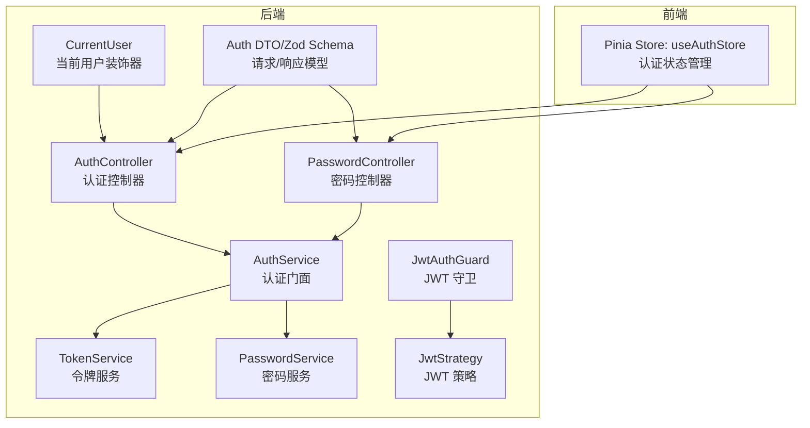
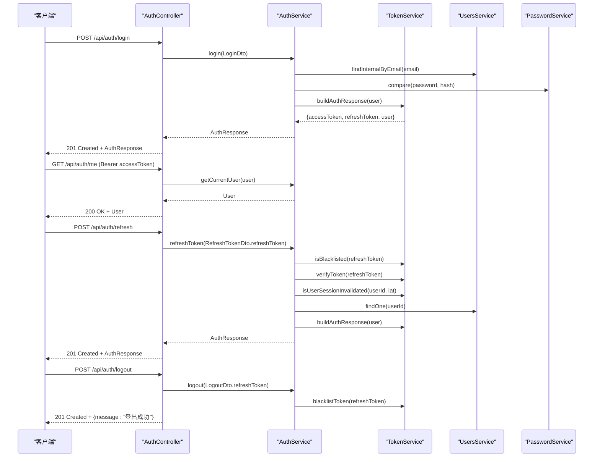
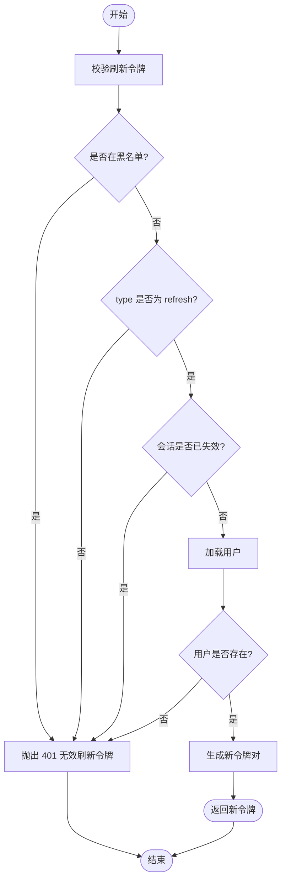
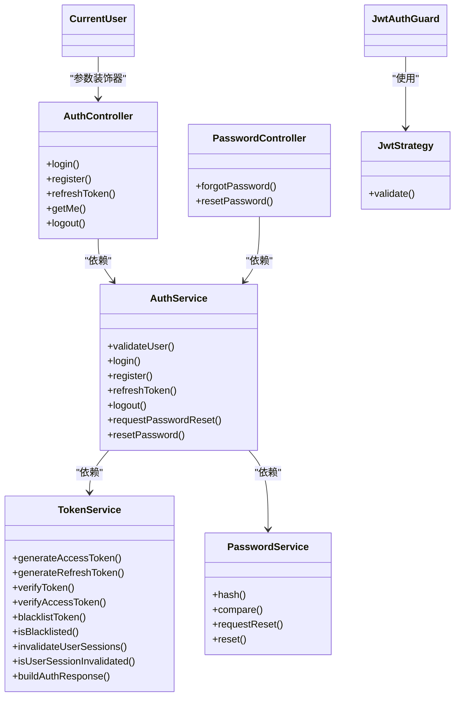

# 认证授权 API

<cite>
**本文引用的文件**
- [apps/backend/src/auth/auth.controller.ts](file://apps/backend/src/auth/auth.controller.ts)
- [apps/backend/src/auth/password.controller.ts](file://apps/backend/src/auth/password.controller.ts)
- [apps/backend/src/auth/auth.service.ts](file://apps/backend/src/auth/auth.service.ts)
- [apps/backend/src/auth/token.service.ts](file://apps/backend/src/auth/token.service.ts)
- [apps/backend/src/auth/password.service.ts](file://apps/backend/src/auth/password.service.ts)
- [apps/backend/src/auth/jwt-auth.guard.ts](file://apps/backend/src/auth/jwt-auth.guard.ts)
- [apps/backend/src/auth/jwt.strategy.ts](file://apps/backend/src/auth/jwt.strategy.ts)
- [apps/backend/src/auth/current-user.decorator.ts](file://apps/backend/src/auth/current-user.decorator.ts)
- [apps/backend/src/auth/auth.dto.ts](file://apps/backend/src/auth/auth.dto.ts)
- [packages/shared/src/schemas/auth.schema.ts](file://packages/shared/src/schemas/auth.schema.ts)
- [apps/backend/src/main.ts](file://apps/backend/src/main.ts)
- [apps/backend/src/app.module.ts](file://apps/backend/src/app.module.ts)
- [apps/backend/tests/e2e/auth.e2e.spec.ts](file://apps/backend/tests/e2e/auth.e2e.spec.ts)
- [apps/backend/tests/auth/auth.service.spec.ts](file://apps/backend/tests/auth/auth.service.spec.ts)
- [apps/frontend/src/features/auth/stores/auth.ts](file://apps/frontend/src/features/auth/stores/auth.ts)
</cite>

## 目录
1. [简介](#简介)
2. [项目结构](#项目结构)
3. [核心组件](#核心组件)
4. [架构总览](#架构总览)
5. [详细组件分析](#详细组件分析)
6. [依赖关系分析](#依赖关系分析)
7. [性能考量](#性能考量)
8. [故障排除指南](#故障排除指南)
9. [结论](#结论)
10. [附录](#附录)

## 简介
本文件面向 Lumina Todo 的认证授权 API，系统性阐述基于 JWT 的认证机制与实现细节，覆盖用户登录、注册、令牌刷新、密码重置、登出等核心流程；明确端点规范、请求参数、响应格式与状态码；解释令牌生成、验证与刷新策略；描述会话失效与并发登录控制；给出 CSRF 保护、安全头设置、第三方认证集成思路、错误处理与审计日志要求，以及客户端认证状态管理与令牌存储的安全建议。

## 项目结构
后端采用 NestJS + Fastify 架构，认证相关代码集中在 apps/backend/src/auth 下，配合共享 DTO 定义与前端 Pinia Store 实现端到端认证闭环。全局安全中间件在主入口集中配置，包含 Helmet 安全头、CSRF 校验、XSS 清理、Gzip 压缩与 CORS。

图表来源
- [apps/backend/src/auth/auth.controller.ts:14-81](file://apps/backend/src/auth/auth.controller.ts#L14-L81)
- [apps/backend/src/auth/password.controller.ts:10-38](file://apps/backend/src/auth/password.controller.ts#L10-L38)
- [apps/backend/src/auth/auth.service.ts:12-126](file://apps/backend/src/auth/auth.service.ts#L12-L126)
- [apps/backend/src/auth/token.service.ts:15-186](file://apps/backend/src/auth/token.service.ts#L15-L186)
- [apps/backend/src/auth/password.service.ts:9-99](file://apps/backend/src/auth/password.service.ts#L9-L99)
- [apps/backend/src/auth/jwt-auth.guard.ts:8-9](file://apps/backend/src/auth/jwt-auth.guard.ts#L8-L9)
- [apps/backend/src/auth/jwt.strategy.ts:19-67](file://apps/backend/src/auth/jwt.strategy.ts#L19-L67)
- [apps/backend/src/auth/current-user.decorator.ts:8-18](file://apps/backend/src/auth/current-user.decorator.ts#L8-L18)
- [apps/backend/src/auth/auth.dto.ts:1-41](file://apps/backend/src/auth/auth.dto.ts#L1-L41)
- [apps/frontend/src/features/auth/stores/auth.ts:23-390](file://apps/frontend/src/features/auth/stores/auth.ts#L23-L390)

章节来源
- [apps/backend/src/main.ts:34-195](file://apps/backend/src/main.ts#L34-L195)
- [apps/backend/src/app.module.ts:162-175](file://apps/backend/src/app.module.ts#L162-L175)

## 核心组件
- 认证控制器：提供登录、注册、刷新、登出、获取当前用户等端点。
- 密码控制器：提供忘记密码与重置密码端点。
- 认证服务：整合用户服务、令牌服务与密码服务，提供统一认证门面。
- 令牌服务：负责 JWT 生成、校验、黑名单、用户会话失效标记。
- 密码服务：负责密码哈希比较、重置令牌生成与邮件发送。
- JWT 守卫与策略：基于 Passport 的 JWT 认证守卫与策略，校验访问令牌并执行会话失效检查。
- 当前用户装饰器：简化从请求中提取当前用户。
- DTO 与 Zod Schema：前后端一致的输入校验与 OpenAPI 文档生成。
- 前端 Pinia Store：封装认证状态、令牌持久化、刷新重试与登出流程。

章节来源
- [apps/backend/src/auth/auth.controller.ts:16-81](file://apps/backend/src/auth/auth.controller.ts#L16-L81)
- [apps/backend/src/auth/password.controller.ts:11-38](file://apps/backend/src/auth/password.controller.ts#L11-L38)
- [apps/backend/src/auth/auth.service.ts:13-126](file://apps/backend/src/auth/auth.service.ts#L13-L126)
- [apps/backend/src/auth/token.service.ts:15-186](file://apps/backend/src/auth/token.service.ts#L15-L186)
- [apps/backend/src/auth/password.service.ts:9-99](file://apps/backend/src/auth/password.service.ts#L9-L99)
- [apps/backend/src/auth/jwt-auth.guard.ts:8-9](file://apps/backend/src/auth/jwt-auth.guard.ts#L8-L9)
- [apps/backend/src/auth/jwt.strategy.ts:19-67](file://apps/backend/src/auth/jwt.strategy.ts#L19-L67)
- [apps/backend/src/auth/current-user.decorator.ts:8-18](file://apps/backend/src/auth/current-user.decorator.ts#L8-L18)
- [apps/backend/src/auth/auth.dto.ts:1-41](file://apps/backend/src/auth/auth.dto.ts#L1-L41)
- [packages/shared/src/schemas/auth.schema.ts:24-121](file://packages/shared/src/schemas/auth.schema.ts#L24-L121)
- [apps/frontend/src/features/auth/stores/auth.ts:23-390](file://apps/frontend/src/features/auth/stores/auth.ts#L23-L390)

## 架构总览
认证系统围绕“短期访问令牌 + 长期刷新令牌”的双令牌模型构建，配合 Redis 黑名单与会话失效标记实现细粒度的会话控制。前端通过 Pinia Store 统一管理令牌与用户状态，并在刷新失败时进行有限重试与错误上报。

图表来源
- [apps/backend/src/auth/auth.controller.ts:22-80](file://apps/backend/src/auth/auth.controller.ts#L22-L80)
- [apps/backend/src/auth/auth.service.ts:41-101](file://apps/backend/src/auth/auth.service.ts#L41-L101)
- [apps/backend/src/auth/token.service.ts:175-185](file://apps/backend/src/auth/token.service.ts#L175-L185)
- [apps/backend/src/auth/password.service.ts:66-89](file://apps/backend/src/auth/password.service.ts#L66-L89)

## 详细组件分析

### 认证端点规范
- 登录
  - 方法与路径：POST /api/auth/login
  - 请求体：LoginDto（email、password）
  - 成功响应：201 Created，返回 AuthResponse（accessToken、refreshToken、expiresIn、user）
  - 失败响应：401 Unauthorized（凭据无效）
  - 速率限制：默认 5 次/10 分钟
- 注册
  - 方法与路径：POST /api/auth/register
  - 请求体：RegisterDto（email、name、password）
  - 成功响应：201 Created，返回 AuthResponse
  - 失败响应：400/422（字段校验失败）；409（冲突，如邮箱已存在）
  - 速率限制：默认 3 次/10 分钟
- 刷新访问令牌
  - 方法与路径：POST /api/auth/refresh
  - 请求体：RefreshTokenDto（refreshToken）
  - 成功响应：201 Created，返回新的 AuthResponse
  - 失败响应：401 Unauthorized（刷新令牌无效/已拉黑/会话已失效）
  - 速率限制：默认 10 次/10 分钟
- 获取当前用户
  - 方法与路径：GET /api/auth/me
  - 请求头：Authorization: Bearer accessToken
  - 成功响应：200 OK，返回 User
  - 失败响应：401 Unauthorized（令牌无效/过期/会话失效）
  - 速率限制：跳过
- 登出
  - 方法与路径：POST /api/auth/logout
  - 请求体：LogoutDto（refreshToken）
  - 成功响应：201 Created，返回 {message: "登出成功"}，并清理 Cookie
  - 失败响应：401 Unauthorized（刷新令牌无效）
  - 速率限制：默认 10 次/10 分钟

章节来源
- [apps/backend/src/auth/auth.controller.ts:22-80](file://apps/backend/src/auth/auth.controller.ts#L22-L80)
- [apps/backend/src/auth/auth.dto.ts:15-40](file://apps/backend/src/auth/auth.dto.ts#L15-L40)
- [packages/shared/src/schemas/auth.schema.ts:72-95](file://packages/shared/src/schemas/auth.schema.ts#L72-L95)
- [apps/backend/src/app.module.ts:117-138](file://apps/backend/src/app.module.ts#L117-L138)

### 密码管理端点规范
- 忘记密码
  - 方法与路径：POST /api/auth/forgot-password
  - 请求体：ForgotPasswordDto（email）
  - 成功响应：201 Created，返回 {message: "..."}
  - 失败响应：400/422（字段校验失败）
  - 速率限制：默认 3 次/10 分钟
- 重置密码
  - 方法与路径：POST /api/auth/reset-password
  - 请求体：ResetPasswordDto（token、password）
  - 成功响应：201 Created，返回 {message: "..."}
  - 失败响应：400/422（字段校验失败）；400 Unauthorized（重置令牌无效/过期）
  - 速率限制：默认 5 次/10 分钟

章节来源
- [apps/backend/src/auth/password.controller.ts:18-37](file://apps/backend/src/auth/password.controller.ts#L18-L37)
- [apps/backend/src/auth/auth.dto.ts:30-35](file://apps/backend/src/auth/auth.dto.ts#L30-L35)
- [packages/shared/src/schemas/auth.schema.ts:100-110](file://packages/shared/src/schemas/auth.schema.ts#L100-L110)

### JWT 令牌生成、验证与刷新流程
- 令牌生成
  - 访问令牌：短期（默认约 15 分钟），用于日常 API 调用
  - 刷新令牌：长期（默认约 7 天），用于换取新的访问令牌
  - 生成密钥：JWT_SECRET；生产环境可配置独立的 JWT_REFRESH_SECRET
- 令牌验证
  - 访问令牌：由 JwtStrategy 校验，确保 type=access，且用户存在、会话未失效
  - 刷新令牌：由 TokenService 校验，确保 type=refresh，且未被拉黑、会话未失效
- 刷新流程
  - 校验刷新令牌合法性与黑名单状态
  - 校验用户是否存在与会话是否失效
  - 重新签发新的访问与刷新令牌
- 会话失效
  - 通过 Redis 存储用户会话失效时间戳，若令牌签发时间早于该时间戳则视为失效
  - 密码重置会调用 TokenService.invalidateUserSessions(userId)，使该用户所有旧令牌失效

图表来源
- [apps/backend/src/auth/auth.service.ts:59-93](file://apps/backend/src/auth/auth.service.ts#L59-L93)
- [apps/backend/src/auth/token.service.ts:103-125](file://apps/backend/src/auth/token.service.ts#L103-L125)
- [apps/backend/src/auth/token.service.ts:47-76](file://apps/backend/src/auth/token.service.ts#L47-L76)

章节来源
- [apps/backend/src/auth/token.service.ts:17-45](file://apps/backend/src/auth/token.service.ts#L17-L45)
- [apps/backend/src/auth/token.service.ts:175-185](file://apps/backend/src/auth/token.service.ts#L175-L185)
- [apps/backend/src/auth/password.service.ts:88-89](file://apps/backend/src/auth/password.service.ts#L88-L89)

### 权限控制与角色管理
- 当前实现
  - 使用 JwtAuthGuard 保护受保护路由，JwtStrategy 校验访问令牌并检查会话有效性
  - 用户实体包含 id、email、name、avatar、createdAt、updatedAt 等字段
- 角色扩展建议
  - 在用户实体中增加 roles 字段（数组），在 JwtStrategy 中读取并注入到请求上下文
  - 新增 RoleGuard 或在 JwtAuthGuard 中扩展逻辑，结合 @SetMetadata/@Reflectors 实现基于角色的访问控制
  - 对关键资源操作（如删除他人数据）增加 RBAC 校验

章节来源
- [apps/backend/src/auth/jwt-auth.guard.ts:8-9](file://apps/backend/src/auth/jwt-auth.guard.ts#L8-L9)
- [apps/backend/src/auth/jwt.strategy.ts:41-66](file://apps/backend/src/auth/jwt.strategy.ts#L41-L66)
- [packages/shared/src/schemas/auth.schema.ts:59-66](file://packages/shared/src/schemas/auth.schema.ts#L59-L66)

### 密码加密与安全存储最佳实践
- 密码哈希
  - 使用 bcryptjs，成本因子 10
  - 登录时使用 compare 进行比对
- 重置令牌
  - 使用随机 token，同时保存 sha256(token) 到数据库
  - 重置链接有效期由配置项控制，默认约 1 小时
- 安全存储
  - 不存储明文密码；仅存储哈希值
  - 重置令牌仅保存哈希，避免泄露真实 token
  - 生产环境严格管理 JWT_SECRET 与 JWT_REFRESH_SECRET

章节来源
- [apps/backend/src/auth/password.service.ts:25-34](file://apps/backend/src/auth/password.service.ts#L25-L34)
- [apps/backend/src/auth/password.service.ts:94-98](file://apps/backend/src/auth/password.service.ts#L94-L98)
- [apps/backend/src/auth/password.service.ts:39-61](file://apps/backend/src/auth/password.service.ts#L39-L61)
- [apps/backend/src/auth/password.service.ts:66-89](file://apps/backend/src/auth/password.service.ts#L66-L89)

### 会话管理与并发登录控制
- 并发登录
  - 默认不强制互斥；可通过刷新令牌与会话失效机制间接实现“踢人”效果
- 会话失效
  - 用户密码重置后，调用 invalidateUserSessions(userId) 标记会话失效
  - 刷新令牌校验时检查 isUserSessionInvalidated(userId, iat)，若旧令牌则拒绝
- 建议
  - 如需严格互斥登录，可在登录成功时写入 Redis 标识当前设备/会话，刷新时校验一致性

章节来源
- [apps/backend/src/auth/token.service.ts:47-76](file://apps/backend/src/auth/token.service.ts#L47-L76)
- [apps/backend/src/auth/password.service.ts:88-89](file://apps/backend/src/auth/password.service.ts#L88-L89)

### CSRF 保护与安全头设置
- CSRF 保护
  - 非 GET/HEAD/OPTIONS 请求必须携带 X-Requested-With: XMLHttpRequest
  - 缺失时返回 403，错误体包含统一结构
- 安全头
  - Helmet：CSP、X-Frame-Options、X-Content-Type-Options、Referrer-Policy 等
  - Permissions-Policy：限制摄像头/麦克风/地理位置等权限
- 其他
  - Gzip 压缩、XSS 清理拦截器、CORS 配置

章节来源
- [apps/backend/src/main.ts:115-157](file://apps/backend/src/main.ts#L115-L157)
- [apps/backend/src/main.ts:84-121](file://apps/backend/src/main.ts#L84-L121)
- [apps/backend/tests/e2e/auth.e2e.spec.ts:30-62](file://apps/backend/tests/e2e/auth.e2e.spec.ts#L30-L62)

### 第三方认证集成方式
- OAuth/OpenID Connect
  - 建议新增第三方登录控制器与服务，完成授权码回调、用户信息映射与本地账户绑定
  - 生成 Lumina 本地 JWT 作为统一认证载体，保持现有 API 行为一致
- SSO
  - 可通过中间件解析 SSO 颁发的 JWT，映射为本地用户并签发 Lumina 令牌
- 注意
  - 严格校验 issuer、audience、签名算法与签名密钥
  - 与现有 JwtStrategy 解耦，通过适配器模式接入

（本节为概念性说明，不直接对应具体源文件）

### 认证失败处理与错误响应格式
- 统一响应结构
  - 成功：{ success: true, data, message?, statusCode? }
  - 失败：{ success: false, data: null, message, statusCode }
- 常见错误
  - 400：字段校验失败、无效重置令牌
  - 401：无效凭据、无效令牌、令牌过期、无效刷新令牌、用户不存在
  - 403：CSRF 校验失败
  - 429：请求过于频繁（受速率限制）
- 异常过滤器
  - AllExceptionsFilter 将异常规范化输出

章节来源
- [apps/backend/src/main.ts:162-169](file://apps/backend/src/main.ts#L162-L169)
- [apps/backend/tests/e2e/auth.e2e.spec.ts:91-102](file://apps/backend/tests/e2e/auth.e2e.spec.ts#L91-L102)
- [apps/backend/tests/e2e/auth.e2e.spec.ts:141-152](file://apps/backend/tests/e2e/auth.e2e.spec.ts#L141-L152)

### 安全审计与日志记录要求
- 请求日志
  - Pino 全局日志器，按状态码自定义日志级别
  - 开发环境彩色 pretty 输出，生产环境 JSON 输出
- 审计事件
  - 建议记录：登录/登出、令牌刷新、密码修改、会话失效、CSRF 拦截
  - 前端可收集 auth:telemetry 事件（刷新重试、失败原因等）并上报
- 建议
  - 将敏感操作与异常事件写入独立审计队列，便于离线分析

章节来源
- [apps/backend/src/app.module.ts:34-88](file://apps/backend/src/app.module.ts#L34-L88)
- [apps/frontend/src/features/auth/stores/auth.ts:103-110](file://apps/frontend/src/features/auth/stores/auth.ts#L103-L110)

### 客户端认证状态管理与令牌存储安全建议
- Pinia Store
  - 持久化存储 accessToken、refreshToken、user 至 localStorage
  - 登录/注册成功后立即 setToken 并持久化
  - 刷新访问令牌时进行有限重试（最多 2 次，间隔 300ms），区分瞬时错误与未授权错误
  - 登出时清空本地状态并调用后端登出接口
- 令牌存储安全
  - 建议使用 HttpOnly Cookie 存放刷新令牌，避免 XSS 泄露
  - 访问令牌仍可放在内存/LocalStorage，但务必启用 CSP 与内容安全策略
- 前端安全
  - 严格校验后端返回的用户 ID 类型，防止注入问题
  - 对敏感操作二次确认与二次校验

章节来源
- [apps/frontend/src/features/auth/stores/auth.ts:23-390](file://apps/frontend/src/features/auth/stores/auth.ts#L23-L390)

## 依赖关系分析

图表来源
- [apps/backend/src/auth/auth.controller.ts:16-81](file://apps/backend/src/auth/auth.controller.ts#L16-L81)
- [apps/backend/src/auth/password.controller.ts:11-38](file://apps/backend/src/auth/password.controller.ts#L11-L38)
- [apps/backend/src/auth/auth.service.ts:13-126](file://apps/backend/src/auth/auth.service.ts#L13-L126)
- [apps/backend/src/auth/token.service.ts:15-186](file://apps/backend/src/auth/token.service.ts#L15-L186)
- [apps/backend/src/auth/password.service.ts:9-99](file://apps/backend/src/auth/password.service.ts#L9-L99)
- [apps/backend/src/auth/jwt-auth.guard.ts:8-9](file://apps/backend/src/auth/jwt-auth.guard.ts#L8-L9)
- [apps/backend/src/auth/jwt.strategy.ts:19-67](file://apps/backend/src/auth/jwt.strategy.ts#L19-L67)
- [apps/backend/src/auth/current-user.decorator.ts:8-18](file://apps/backend/src/auth/current-user.decorator.ts#L8-L18)

## 性能考量
- 速率限制
  - 短/中/长三档限流策略，防止暴力破解与滥用
- 缓存与会话
  - 会话失效标记与黑名单使用 Redis，降低数据库压力
- 压缩与安全
  - Gzip 压缩减少传输体积；Helmet 与 XSS 清理提升安全性与稳定性

章节来源
- [apps/backend/src/app.module.ts:117-138](file://apps/backend/src/app.module.ts#L117-L138)
- [apps/backend/src/auth/token.service.ts:47-76](file://apps/backend/src/auth/token.service.ts#L47-L76)
- [apps/backend/src/main.ts:101-113](file://apps/backend/src/main.ts#L101-L113)

## 故障排除指南
- 登录失败（401）
  - 检查 email/password 是否正确；确认用户存在且已激活
- 刷新失败（401）
  - 刷新令牌可能已被拉黑或会话已失效；确认是否发生密码重置
- CSRF 拦截（403）
  - 确认请求头包含 X-Requested-With: XMLHttpRequest
- 令牌过期
  - 使用刷新令牌换取新访问令牌；若刷新也失败，引导用户重新登录
- 前端状态不同步
  - 确认 Pinia Store 已持久化并正确 setToken；必要时手动触发 hydrateFromStorage

章节来源
- [apps/backend/tests/e2e/auth.e2e.spec.ts:30-62](file://apps/backend/tests/e2e/auth.e2e.spec.ts#L30-L62)
- [apps/backend/tests/e2e/auth.e2e.spec.ts:141-152](file://apps/backend/tests/e2e/auth.e2e.spec.ts#L141-L152)
- [apps/backend/tests/auth/auth.service.spec.ts:124-175](file://apps/backend/tests/auth/auth.service.spec.ts#L124-L175)
- [apps/frontend/src/features/auth/stores/auth.ts:275-320](file://apps/frontend/src/features/auth/stores/auth.ts#L275-L320)

## 结论
本认证体系以 JWT 为核心，结合 Redis 会话失效与黑名单机制，提供了可靠的令牌生命周期管理；前端通过 Pinia Store 实现状态持久化与刷新重试，提升了用户体验与鲁棒性。建议在生产环境中完善第三方认证、角色权限与更严格的并发登录控制，并持续优化审计与日志能力。

## 附录

### 端点一览与状态码
- /api/auth/login
  - POST：201 成功；401 凭据无效；429 速率限制
- /api/auth/register
  - POST：201 成功；400/422 校验失败；409 冲突；429 速率限制
- /api/auth/refresh
  - POST：201 成功；401 无效刷新令牌；429 速率限制
- /api/auth/me
  - GET：200 成功；401 无效令牌；403 CSRF 缺失
- /api/auth/logout
  - POST：201 成功；401 无效刷新令牌；429 速率限制
- /api/auth/forgot-password
  - POST：201 成功；400/422 校验失败；429 速率限制
- /api/auth/reset-password
  - POST：201 成功；400 无效重置令牌；429 速率限制

章节来源
- [apps/backend/src/auth/auth.controller.ts:22-80](file://apps/backend/src/auth/auth.controller.ts#L22-L80)
- [apps/backend/src/auth/password.controller.ts:18-37](file://apps/backend/src/auth/password.controller.ts#L18-L37)
- [apps/backend/src/app.module.ts:117-138](file://apps/backend/src/app.module.ts#L117-L138)
- [apps/backend/src/main.ts:115-157](file://apps/backend/src/main.ts#L115-L157)