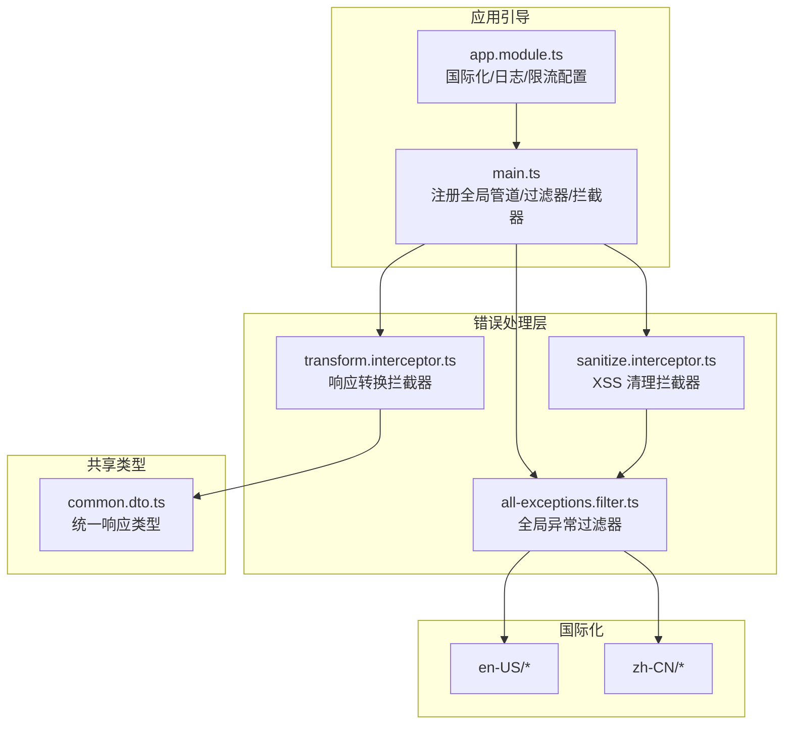
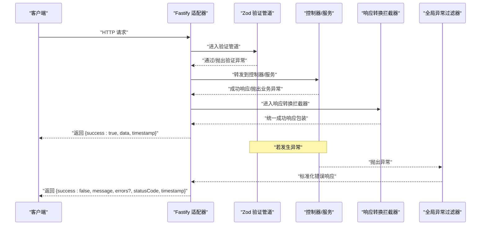
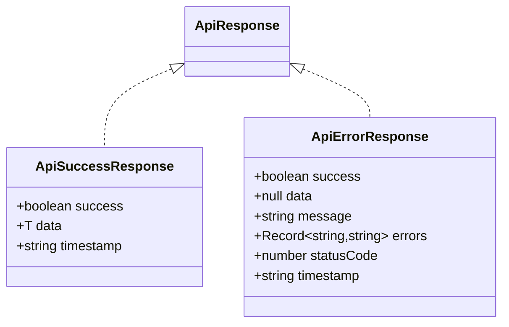
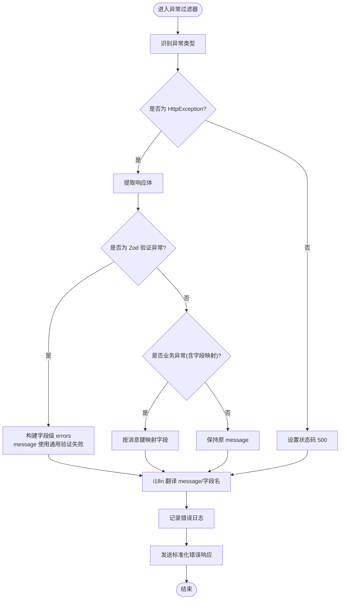
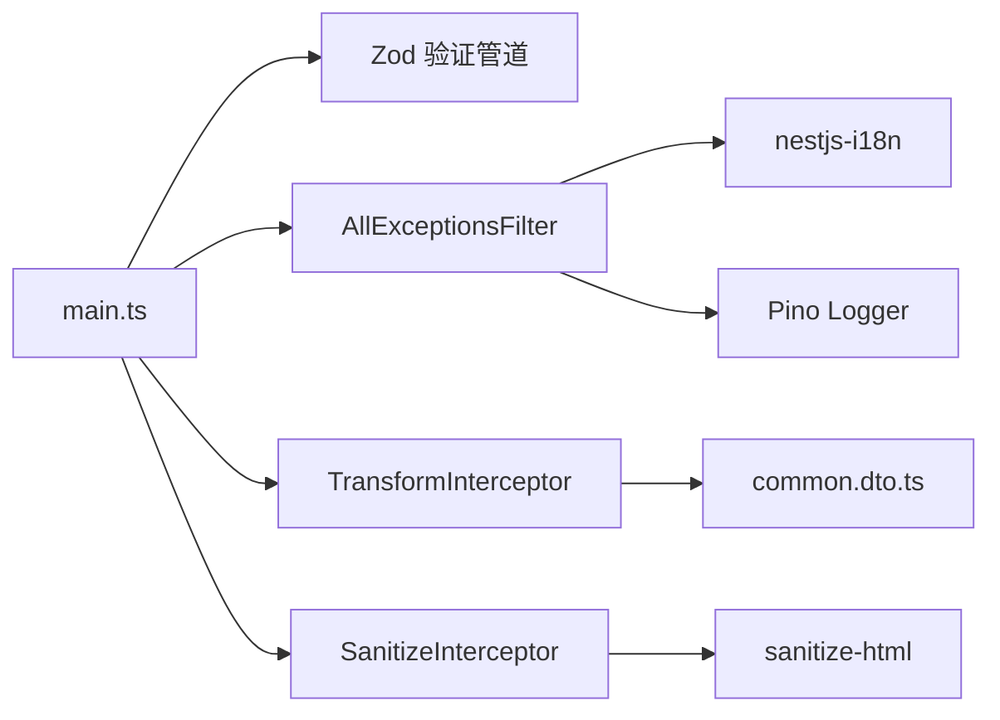

# 错误处理和响应格式

<cite>
**本文引用的文件**
- [apps/backend/src/common/filters/all-exceptions.filter.ts](file://apps/backend/src/common/filters/all-exceptions.filter.ts)
- [apps/backend/src/common/interceptors/sanitize.interceptor.ts](file://apps/backend/src/common/interceptors/sanitize.interceptor.ts)
- [apps/backend/src/common/interceptors/transform.interceptor.ts](file://apps/backend/src/common/interceptors/transform.interceptor.ts)
- [apps/backend/src/main.ts](file://apps/backend/src/main.ts)
- [apps/backend/src/app.module.ts](file://apps/backend/src/app.module.ts)
- [packages/shared/src/dto/common.dto.ts](file://packages/shared/src/dto/common.dto.ts)
- [apps/backend/src/i18n/en-US/validation.ts](file://apps/backend/src/i18n/en-US/validation.ts)
- [apps/backend/src/i18n/zh-CN/validation.ts](file://apps/backend/src/i18n/zh-CN/validation.ts)
- [apps/backend/src/i18n/en-US/auth.ts](file://apps/backend/src/i18n/en-US/auth.ts)
- [apps/backend/src/i18n/zh-CN/auth.ts](file://apps/backend/src/i18n/zh-CN/auth.ts)
- [apps/backend/src/i18n/en-US/common.ts](file://apps/backend/src/i18n/en-US/common.ts)
- [apps/backend/src/i18n/zh-CN/common.ts](file://apps/backend/src/i18n/zh-CN/common.ts)
- [apps/backend/tests/common/filters/all-exceptions.filter.spec.ts](file://apps/backend/tests/common/filters/all-exceptions.filter.spec.ts)
</cite>

## 目录
1. [简介](#简介)
2. [项目结构](#项目结构)
3. [核心组件](#核心组件)
4. [架构总览](#架构总览)
5. [详细组件分析](#详细组件分析)
6. [依赖关系分析](#依赖关系分析)
7. [性能考量](#性能考量)
8. [故障排查指南](#故障排查指南)
9. [结论](#结论)
10. [附录](#附录)

## 简介
本文件系统化阐述 Lumina Todo 后端的错误处理与统一响应格式规范，覆盖以下要点：
- 统一的错误响应结构与字段语义
- 错误码与状态码映射规则
- 异常类型与处理机制（业务异常、参数验证异常、认证授权异常等）
- 全局异常过滤器、响应转换拦截器与输入清理拦截器的实现与配置
- 输入数据清理与验证机制（XSS 清理、Zod 验证）
- 错误日志记录与监控最佳实践
- 错误信息本地化处理策略
- 客户端错误处理建议与重试策略
- API 版本兼容下的错误迁移方案
- 常见错误场景诊断与解决方案
- 错误报告与反馈机制使用指南

## 项目结构
围绕错误处理与响应格式的关键文件组织如下：
- 全局异常过滤器：统一捕获未处理异常，输出标准化错误响应
- 响应转换拦截器：统一成功响应包装
- 输入清理拦截器：XSS 清理，降低注入风险
- 主引导文件：注册全局管道、过滤器与拦截器，并启用安全中间件
- 应用模块：配置国际化、日志、限流等全局能力
- 公共响应类型：定义统一的成功/错误响应结构
- 国际化资源：验证、认证、通用错误等多语言文案

图表来源
- [apps/backend/src/main.ts:160-170](file://apps/backend/src/main.ts#L160-L170)
- [apps/backend/src/app.module.ts:139-148](file://apps/backend/src/app.module.ts#L139-L148)
- [apps/backend/src/common/filters/all-exceptions.filter.ts:16-137](file://apps/backend/src/common/filters/all-exceptions.filter.ts#L16-L137)
- [apps/backend/src/common/interceptors/transform.interceptor.ts:18-30](file://apps/backend/src/common/interceptors/transform.interceptor.ts#L18-L30)
- [apps/backend/src/common/interceptors/sanitize.interceptor.ts:9-64](file://apps/backend/src/common/interceptors/sanitize.interceptor.ts#L9-L64)
- [packages/shared/src/dto/common.dto.ts:4-35](file://packages/shared/src/dto/common.dto.ts#L4-L35)

章节来源
- [apps/backend/src/main.ts:160-170](file://apps/backend/src/main.ts#L160-L170)
- [apps/backend/src/app.module.ts:139-148](file://apps/backend/src/app.module.ts#L139-L148)

## 核心组件
- 统一响应结构
  - 成功响应：包含 success=true、data、timestamp
  - 错误响应：包含 success=false、data=null、message、可选 errors（字段级错误）、statusCode、timestamp
  - 参考：[packages/shared/src/dto/common.dto.ts:4-35](file://packages/shared/src/dto/common.dto.ts#L4-L35)

- 全局异常过滤器
  - 捕获所有未处理异常，按 HttpException 状态码或 500 输出
  - 对 Zod 验证异常进行结构化字段级错误映射
  - 对业务异常（如冲突）进行字段映射与消息本地化
  - 记录错误日志，包含方法、URL、状态码与堆栈
  - 参考：[apps/backend/src/common/filters/all-exceptions.filter.ts:16-137](file://apps/backend/src/common/filters/all-exceptions.filter.ts#L16-L137)

- 响应转换拦截器
  - 将成功响应统一包装为 { success: true, data, timestamp }
  - 参考：[apps/backend/src/common/interceptors/transform.interceptor.ts:18-30](file://apps/backend/src/common/interceptors/transform.interceptor.ts#L18-L30)

- 输入清理拦截器
  - 递归清理请求体、查询参数、路径参数中的 HTML/XSS 内容
  - 参考：[apps/backend/src/common/interceptors/sanitize.interceptor.ts:9-64](file://apps/backend/src/common/interceptors/sanitize.interceptor.ts#L9-L64)

- 主引导与全局注册
  - 注册 Zod 验证管道、全局异常过滤器、响应转换拦截器、XSS 清理拦截器
  - 启用安全中间件（Helmet、CSRF 检测、压缩、静态资源）
  - 参考：[apps/backend/src/main.ts:160-170](file://apps/backend/src/main.ts#L160-L170)

章节来源
- [packages/shared/src/dto/common.dto.ts:4-35](file://packages/shared/src/dto/common.dto.ts#L4-L35)
- [apps/backend/src/common/filters/all-exceptions.filter.ts:16-137](file://apps/backend/src/common/filters/all-exceptions.filter.ts#L16-L137)
- [apps/backend/src/common/interceptors/transform.interceptor.ts:18-30](file://apps/backend/src/common/interceptors/transform.interceptor.ts#L18-L30)
- [apps/backend/src/common/interceptors/sanitize.interceptor.ts:9-64](file://apps/backend/src/common/interceptors/sanitize.interceptor.ts#L9-L64)
- [apps/backend/src/main.ts:160-170](file://apps/backend/src/main.ts#L160-L170)

## 架构总览
统一错误处理与响应格式的端到端流程如下：

图表来源
- [apps/backend/src/main.ts:160-170](file://apps/backend/src/main.ts#L160-L170)
- [apps/backend/src/common/interceptors/transform.interceptor.ts:18-30](file://apps/backend/src/common/interceptors/transform.interceptor.ts#L18-L30)
- [apps/backend/src/common/filters/all-exceptions.filter.ts:16-137](file://apps/backend/src/common/filters/all-exceptions.filter.ts#L16-L137)

## 详细组件分析

### 统一错误响应格式
- 字段说明
  - success：布尔，true 表示成功，false 表示失败
  - data：成功时返回业务数据；错误时为 null
  - message：错误消息（可为本地化键或直接文本）
  - errors：可选，字段级错误映射，键为字段路径（点号分隔），值为本地化后的错误信息
  - statusCode：HTTP 状态码
  - timestamp：ISO 时间戳
- 参考：[packages/shared/src/dto/common.dto.ts:4-35](file://packages/shared/src/dto/common.dto.ts#L4-L35)

图表来源
- [packages/shared/src/dto/common.dto.ts:4-35](file://packages/shared/src/dto/common.dto.ts#L4-L35)

章节来源
- [packages/shared/src/dto/common.dto.ts:4-35](file://packages/shared/src/dto/common.dto.ts#L4-L35)

### 全局异常过滤器 AllExceptionsFilter
- 功能要点
  - 捕获所有异常，区分 HttpException 与未知错误
  - Zod 验证异常：提取 issues，构造字段级 errors，message 使用通用“验证失败”
  - 业务异常（如冲突）：根据消息键映射到字段（如 auth.EMAIL_EXISTS -> email）
  - 国际化：优先使用 i18n.t 翻译 message 与字段名；默认回退英文
  - 日志：记录方法、URL、状态码与堆栈
  - 结果：统一返回错误响应结构
- 参考：[apps/backend/src/common/filters/all-exceptions.filter.ts:16-137](file://apps/backend/src/common/filters/all-exceptions.filter.ts#L16-L137)

图表来源
- [apps/backend/src/common/filters/all-exceptions.filter.ts:27-137](file://apps/backend/src/common/filters/all-exceptions.filter.ts#L27-L137)

章节来源
- [apps/backend/src/common/filters/all-exceptions.filter.ts:16-137](file://apps/backend/src/common/filters/all-exceptions.filter.ts#L16-L137)

### 响应转换拦截器 TransformInterceptor
- 功能要点
  - 将控制器返回的成功结果统一包装为 { success: true, data, timestamp }
  - 保持错误由异常过滤器处理
- 参考：[apps/backend/src/common/interceptors/transform.interceptor.ts:18-30](file://apps/backend/src/common/interceptors/transform.interceptor.ts#L18-L30)

章节来源
- [apps/backend/src/common/interceptors/transform.interceptor.ts:18-30](file://apps/backend/src/common/interceptors/transform.interceptor.ts#L18-L30)

### 输入清理拦截器 SanitizeInterceptor
- 功能要点
  - 递归清理请求体、查询参数、路径参数中的字符串值
  - 使用 sanitize-html，禁用所有标签与属性，防止 XSS
- 参考：[apps/backend/src/common/interceptors/sanitize.interceptor.ts:9-64](file://apps/backend/src/common/interceptors/sanitize.interceptor.ts#L9-L64)

章节来源
- [apps/backend/src/common/interceptors/sanitize.interceptor.ts:9-64](file://apps/backend/src/common/interceptors/sanitize.interceptor.ts#L9-L64)

### 主引导与全局注册
- 全局注册
  - Zod 验证管道：替代 class-validator，统一参数校验
  - 全局异常过滤器：统一错误输出
  - 响应转换拦截器：统一成功响应
  - XSS 清理拦截器：输入安全
- 安全中间件
  - Helmet：安全头
  - CSRF 检测：缺失 X-Requested-With 时拒绝并返回统一错误
  - 压缩与静态资源
- 参考：[apps/backend/src/main.ts:160-170](file://apps/backend/src/main.ts#L160-L170)

章节来源
- [apps/backend/src/main.ts:160-170](file://apps/backend/src/main.ts#L160-L170)

### 国际化与本地化
- 资源分布
  - 验证类：validation.ts（REQUIRED、INVALID_EMAIL、MIN_LENGTH 等）
  - 认证类：auth.ts（USER_NOT_FOUND、INVALID_CREDENTIALS、TOKEN_EXPIRED 等）
  - 通用类：common.ts（VALIDATION_ERROR、INTERNAL_SERVER_ERROR、字段名映射）
- 过滤器逻辑
  - 属性名本地化：common.fields.* 键映射
  - 错误消息本地化：优先使用 i18n.t，支持参数（property、min、max、limit 等）
- 参考：
  - [apps/backend/src/i18n/en-US/validation.ts:1-12](file://apps/backend/src/i18n/en-US/validation.ts#L1-L12)
  - [apps/backend/src/i18n/zh-CN/validation.ts:1-12](file://apps/backend/src/i18n/zh-CN/validation.ts#L1-L12)
  - [apps/backend/src/i18n/en-US/auth.ts:1-16](file://apps/backend/src/i18n/en-US/auth.ts#L1-L16)
  - [apps/backend/src/i18n/zh-CN/auth.ts:1-16](file://apps/backend/src/i18n/zh-CN/auth.ts#L1-L16)
  - [apps/backend/src/i18n/en-US/common.ts:1-15](file://apps/backend/src/i18n/en-US/common.ts#L1-L15)
  - [apps/backend/src/i18n/zh-CN/common.ts:1-15](file://apps/backend/src/i18n/zh-CN/common.ts#L1-L15)
  - [apps/backend/src/common/filters/all-exceptions.filter.ts:20-25](file://apps/backend/src/common/filters/all-exceptions.filter.ts#L20-L25)
  - [apps/backend/src/common/filters/all-exceptions.filter.ts:111-124](file://apps/backend/src/common/filters/all-exceptions.filter.ts#L111-L124)

章节来源
- [apps/backend/src/i18n/en-US/validation.ts:1-12](file://apps/backend/src/i18n/en-US/validation.ts#L1-L12)
- [apps/backend/src/i18n/zh-CN/validation.ts:1-12](file://apps/backend/src/i18n/zh-CN/validation.ts#L1-L12)
- [apps/backend/src/i18n/en-US/auth.ts:1-16](file://apps/backend/src/i18n/en-US/auth.ts#L1-L16)
- [apps/backend/src/i18n/zh-CN/auth.ts:1-16](file://apps/backend/src/i18n/zh-CN/auth.ts#L1-L16)
- [apps/backend/src/i18n/en-US/common.ts:1-15](file://apps/backend/src/i18n/en-US/common.ts#L1-L15)
- [apps/backend/src/i18n/zh-CN/common.ts:1-15](file://apps/backend/src/i18n/zh-CN/common.ts#L1-L15)
- [apps/backend/src/common/filters/all-exceptions.filter.ts:20-25](file://apps/backend/src/common/filters/all-exceptions.filter.ts#L20-L25)
- [apps/backend/src/common/filters/all-exceptions.filter.ts:111-124](file://apps/backend/src/common/filters/all-exceptions.filter.ts#L111-L124)

## 依赖关系分析
- 组件耦合
  - 异常过滤器依赖 i18n 上下文与 Nest 日志器
  - 响应拦截器依赖共享响应类型
  - 输入清理拦截器依赖 sanitize-html
  - 主引导文件集中注册上述组件
- 外部依赖
  - Fastify 适配器、Zod 验证管道、Pino 日志、nestjs-i18n、@fastify/helmet、@fastify/compress、@fastify/multipart
- 参考：
  - [apps/backend/src/main.ts:160-170](file://apps/backend/src/main.ts#L160-L170)
  - [apps/backend/src/app.module.ts:139-148](file://apps/backend/src/app.module.ts#L139-L148)

图表来源
- [apps/backend/src/main.ts:160-170](file://apps/backend/src/main.ts#L160-L170)
- [apps/backend/src/app.module.ts:139-148](file://apps/backend/src/app.module.ts#L139-L148)
- [packages/shared/src/dto/common.dto.ts:4-35](file://packages/shared/src/dto/common.dto.ts#L4-L35)

章节来源
- [apps/backend/src/main.ts:160-170](file://apps/backend/src/main.ts#L160-L170)
- [apps/backend/src/app.module.ts:139-148](file://apps/backend/src/app.module.ts#L139-L148)

## 性能考量
- 全局拦截器与过滤器对每个请求都会执行，需关注序列化与日志开销
- XSS 清理为递归遍历，深层嵌套对象会增加时间复杂度
- 建议
  - 控制请求体大小与深度，避免极端嵌套
  - 合理配置日志级别与序列化器，生产环境使用 JSON 并减少额外字段
  - 对高频端点考虑缓存错误文案键（如 i18n.t）以降低重复解析成本

## 故障排查指南
- 常见问题定位
  - 参数验证失败：查看 errors 字段，定位具体字段与原因键（如 validation.REQUIRED）
  - 业务冲突：查看 message 与映射字段（如 auth.EMAIL_EXISTS -> email）
  - 未知错误：查看日志中的堆栈与状态码，确认是否被异常过滤器捕获
- 单元测试参考
  - 测试覆盖了 HttpException、业务异常映射、Zod 验证错误、未知错误等场景
  - 参考：[apps/backend/tests/common/filters/all-exceptions.filter.spec.ts:49-124](file://apps/backend/tests/common/filters/all-exceptions.filter.spec.ts#L49-L124)

章节来源
- [apps/backend/tests/common/filters/all-exceptions.filter.spec.ts:49-124](file://apps/backend/tests/common/filters/all-exceptions.filter.spec.ts#L49-L124)

## 结论
通过统一的错误响应格式、严格的输入清理与验证、完善的国际化与日志体系，Lumina Todo 实现了高一致性与可维护性的错误处理与响应规范。建议在后续版本中持续完善错误码枚举与迁移策略，增强客户端重试与幂等设计。

## 附录

### 错误码与状态码映射
- 业务异常（如冲突）：使用对应 HTTP 状态码（例如 409），message 为业务键，errors 映射字段
- 参数验证异常：统一 400，errors 为字段级错误集合
- 未知错误：统一 500，message 使用默认键并在国际化资源中提供默认文案
- 参考：
  - [apps/backend/src/common/filters/all-exceptions.filter.ts:34-35](file://apps/backend/src/common/filters/all-exceptions.filter.ts#L34-L35)
  - [apps/backend/src/common/filters/all-exceptions.filter.ts:57-86](file://apps/backend/src/common/filters/all-exceptions.filter.ts#L57-L86)
  - [apps/backend/src/common/filters/all-exceptions.filter.ts:87-117](file://apps/backend/src/common/filters/all-exceptions.filter.ts#L87-L117)

### 异常类型与处理机制
- 业务异常：通过 HttpException 或自定义异常抛出，异常过滤器进行字段映射与本地化
- 参数验证异常：Zod 验证失败时由验证管道抛出，过滤器解析 issues 生成结构化错误
- 认证授权异常：使用标准状态码（如 401/403），message 为认证相关键
- 参考：
  - [apps/backend/src/common/filters/all-exceptions.filter.ts:87-117](file://apps/backend/src/common/filters/all-exceptions.filter.ts#L87-L117)
  - [apps/backend/src/i18n/en-US/auth.ts:1-16](file://apps/backend/src/i18n/en-US/auth.ts#L1-L16)
  - [apps/backend/src/i18n/zh-CN/auth.ts:1-16](file://apps/backend/src/i18n/zh-CN/auth.ts#L1-L16)

### 输入数据清理与验证机制
- 清理：SanitizeInterceptor 递归清理请求体、查询参数、路径参数
- 验证：ZodValidationPipe 替代 class-validator，统一生成 OpenAPI 文档
- 参考：
  - [apps/backend/src/common/interceptors/sanitize.interceptor.ts:17-36](file://apps/backend/src/common/interceptors/sanitize.interceptor.ts#L17-L36)
  - [apps/backend/src/main.ts:159-160](file://apps/backend/src/main.ts#L159-L160)

### 错误日志记录与监控最佳实践
- 使用 Pino 日志模块，按状态码自定义日志级别
- 生产环境使用 JSON 日志，便于采集与检索
- 在异常过滤器中记录方法、URL、状态码与堆栈
- 参考：
  - [apps/backend/src/app.module.ts:34-88](file://apps/backend/src/app.module.ts#L34-L88)
  - [apps/backend/src/common/filters/all-exceptions.filter.ts:40-45](file://apps/backend/src/common/filters/all-exceptions.filter.ts#L40-L45)

### 错误信息本地化处理
- 属性名本地化：common.fields.* 键映射
- 错误消息本地化：i18n.t(message)，支持参数替换
- 参考：
  - [apps/backend/src/common/filters/all-exceptions.filter.ts:20-25](file://apps/backend/src/common/filters/all-exceptions.filter.ts#L20-L25)
  - [apps/backend/src/common/filters/all-exceptions.filter.ts:111-124](file://apps/backend/src/common/filters/all-exceptions.filter.ts#L111-L124)
  - [apps/backend/src/i18n/en-US/common.ts:1-15](file://apps/backend/src/i18n/en-US/common.ts#L1-L15)
  - [apps/backend/src/i18n/zh-CN/common.ts:1-15](file://apps/backend/src/i18n/zh-CN/common.ts#L1-L15)

### 客户端错误处理建议与重试策略
- 建议
  - 对 4xx 错误（除 401/403）进行用户提示与输入修正
  - 对 401/403 重新触发认证流程
  - 对 5xx 错误进行指数退避重试，最大重试次数与超时合理配置
  - 使用唯一请求 ID 与错误码辅助定位问题
- 参考：
  - [packages/shared/src/dto/common.dto.ts:16-29](file://packages/shared/src/dto/common.dto.ts#L16-L29)

### API 版本兼容性下的错误迁移方案
- 建议
  - 保持错误响应结构向后兼容（新增字段不破坏旧字段）
  - 对废弃字段提供过渡期映射与告警
  - 在文档中标注变更与迁移指引
  - 参考：[apps/backend/src/main.ts:172-180](file://apps/backend/src/main.ts#L172-L180)

### 常见错误场景与诊断
- 验证失败：检查 errors 中字段与对应验证键，核对国际化文案
- 业务冲突：根据 message 键定位业务规则，检查字段映射
- 未知错误：查看日志堆栈，确认异常是否被过滤器捕获
- 参考：
  - [apps/backend/tests/common/filters/all-exceptions.filter.spec.ts:49-124](file://apps/backend/tests/common/filters/all-exceptions.filter.spec.ts#L49-L124)

### 错误报告与反馈机制使用指南
- 建议收集
  - 请求方法、URL、状态码、时间戳
  - 客户端语言与版本
  - 错误码与 message
  - 必要时附上最小复现步骤
- 参考：
  - [packages/shared/src/dto/common.dto.ts:16-29](file://packages/shared/src/dto/common.dto.ts#L16-L29)