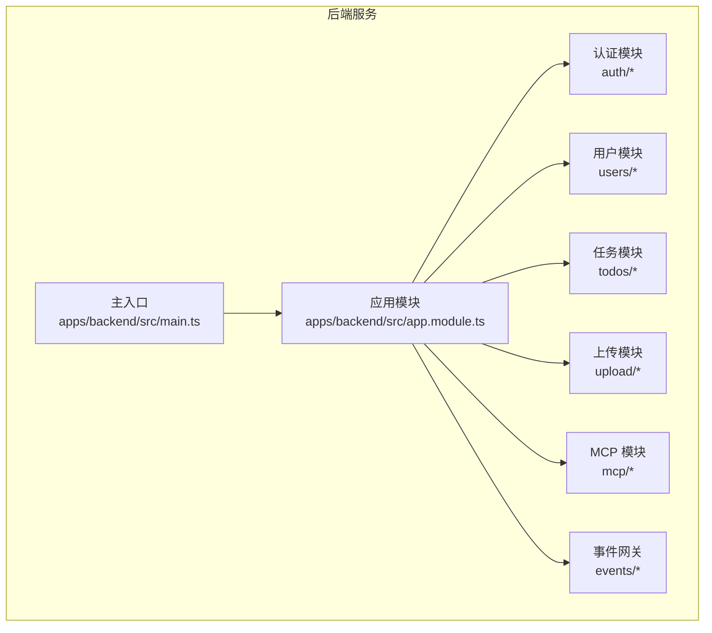
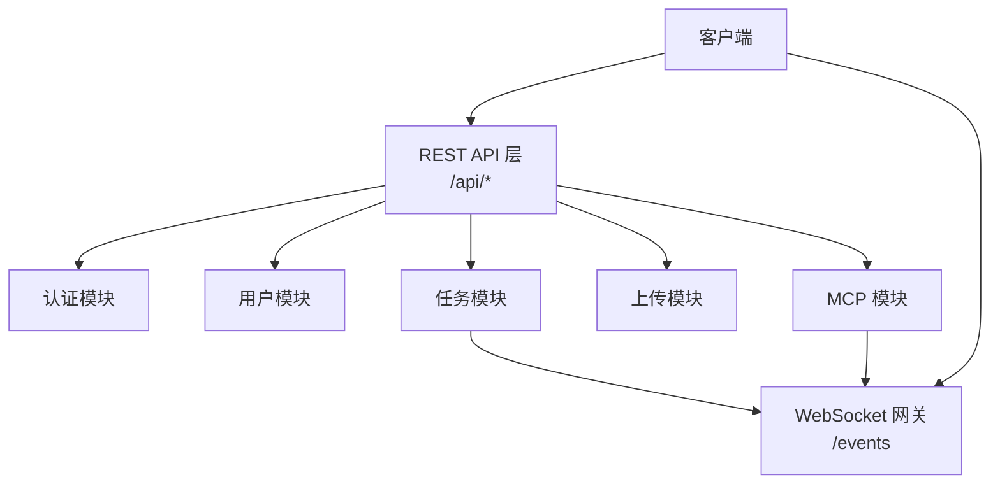
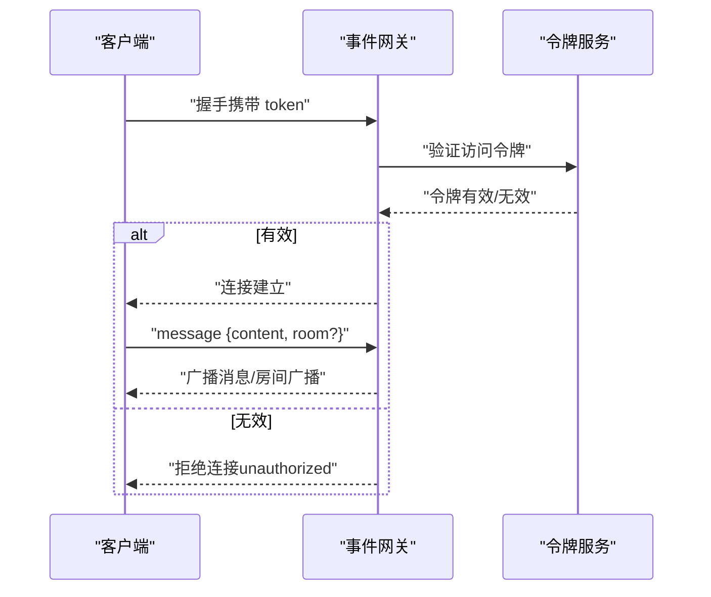
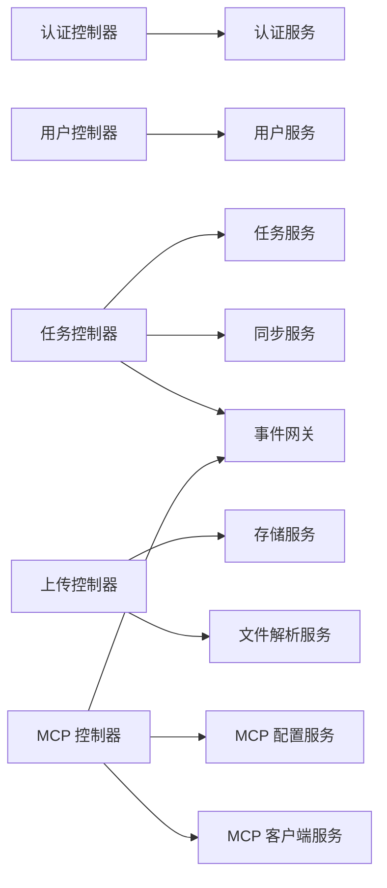

# API参考

<cite>
**本文引用的文件**
- [apps/backend/src/main.ts](file://apps/backend/src/main.ts)
- [apps/backend/src/app.module.ts](file://apps/backend/src/app.module.ts)
- [apps/backend/src/auth/auth.controller.ts](file://apps/backend/src/auth/auth.controller.ts)
- [apps/backend/src/auth/auth.dto.ts](file://apps/backend/src/auth/auth.dto.ts)
- [apps/backend/src/todos/todos.controller.ts](file://apps/backend/src/todos/todos.controller.ts)
- [apps/backend/src/todos/todos.dto.ts](file://apps/backend/src/todos/todos.dto.ts)
- [apps/backend/src/upload/upload.controller.ts](file://apps/backend/src/upload/upload.controller.ts)
- [apps/backend/src/mcp/mcp.controller.ts](file://apps/backend/src/mcp/mcp.controller.ts)
- [apps/backend/src/mcp/mcp.dto.ts](file://apps/backend/src/mcp/mcp.dto.ts)
- [apps/backend/src/users/users.controller.ts](file://apps/backend/src/users/users.controller.ts)
- [apps/backend/src/events/events.gateway.ts](file://apps/backend/src/events/events.gateway.ts)
- [packages/shared/src/dto/common.dto.ts](file://packages/shared/src/dto/common.dto.ts)
</cite>

## 目录

1. [简介](#简介)
2. [项目结构](#项目结构)
3. [核心组件](#核心组件)
4. [架构总览](#架构总览)
5. [详细组件分析](#详细组件分析)
6. [依赖关系分析](#依赖关系分析)
7. [性能考量](#性能考量)
8. [故障排除指南](#故障排除指南)
9. [结论](#结论)
10. [附录](#附录)

## 简介

本文件为 Lumina Todo 后端服务的完整 API 参考文档，覆盖认证、任务管理、MCP 工具、文件上传、用户管理以及 WebSocket 实时通信等公开接口。文档提供每个接口的 HTTP 方法、URL 模式、请求参数、响应格式、状态码、认证与权限控制、错误处理说明，并给出序列图与流程图帮助理解端到端交互。

## 项目结构

后端基于 NestJS + Fastify 架构，采用模块化设计，主要模块包括认证、用户、任务、上传、MCP、事件网关等。全局统一响应格式、Zod 验证、CSRF/XSS 安全中间件、CORS、压缩、静态资源托管等在启动脚本中集中配置。

图表来源

- [apps/backend/src/main.ts:34-211](file://apps/backend/src/main.ts#L34-L211)
- [apps/backend/src/app.module.ts:28-159](file://apps/backend/src/app.module.ts#L28-L159)

章节来源

- [apps/backend/src/main.ts:34-211](file://apps/backend/src/main.ts#L34-L211)
- [apps/backend/src/app.module.ts:28-159](file://apps/backend/src/app.module.ts#L28-L159)

## 核心组件

- 统一响应格式：所有接口返回统一的成功或错误响应体，包含 success、data/message、timestamp、statusCode 等字段。
- 全局中间件与安全：
  - CORS、Helmet 安全头、Gzip 压缩、CSRF 校验（X-Requested-With）、XSS 清理、Zod 验证管道、全局异常过滤器、全局响应拦截器。
- 路由前缀：所有 REST 接口统一使用 /api 前缀。
- 文档：Swagger/OpenAPI 在 /api/docs 提供自动生成的接口文档。

章节来源

- [packages/shared/src/dto/common.dto.ts:4-34](file://packages/shared/src/dto/common.dto.ts#L4-L34)
- [apps/backend/src/main.ts:48-191](file://apps/backend/src/main.ts#L48-L191)

## 架构总览

下图展示客户端与后端各模块之间的交互关系，包括 REST API 与 WebSocket 实时通信。

图表来源

- [apps/backend/src/main.ts:92-191](file://apps/backend/src/main.ts#L92-L191)
- [apps/backend/src/events/events.gateway.ts:20-56](file://apps/backend/src/events/events.gateway.ts#L20-L56)

## 详细组件分析

### 认证 API

- 基础信息
  - 前缀：/api/auth
  - 认证：部分接口使用 JWT，部分接口使用速率限制
  - 速率限制：登录、注册、刷新令牌分别有独立节流配置
- 接口清单
  - POST /api/auth/login
    - 功能：用户登录
    - 权限：匿名
    - 请求体：登录 DTO（邮箱/用户名、密码）
    - 响应：鉴权响应（含访问令牌、刷新令牌等）
    - 状态码：200、400、401、429
  - POST /api/auth/register
    - 功能：用户注册
    - 权限：匿名
    - 请求体：注册 DTO（邮箱、密码、确认密码等）
    - 响应：鉴权响应
    - 状态码：200、400、429
  - POST /api/auth/refresh
    - 功能：刷新访问令牌
    - 权限：匿名
    - 请求体：刷新令牌 DTO（refreshToken）
    - 响应：新的访问令牌
    - 状态码：200、400、401、429
  - GET /api/auth/me
    - 功能：获取当前用户信息
    - 权限：JWT
    - 请求头：Authorization: Bearer <token>
    - 响应：当前用户对象
    - 状态码：200、401
  - POST /api/auth/logout
    - 功能：用户登出
    - 权限：JWT
    - 请求体：登出 DTO（refreshToken）
    - 响应：登出成功消息
    - 状态码：200、400、401
- 错误处理
  - 参数校验失败返回 400，认证失败返回 401，触发速率限制返回 429
- 示例
  - 登录成功响应包含 access_token、refresh_token、expires_in 等字段
  - 登出会清除 accessToken、refreshToken Cookie

章节来源

- [apps/backend/src/auth/auth.controller.ts:23-79](file://apps/backend/src/auth/auth.controller.ts#L23-L79)
- [apps/backend/src/auth/auth.dto.ts:15-41](file://apps/backend/src/auth/auth.dto.ts#L15-L41)

### 任务管理 API

- 基础信息
  - 前缀：/api/todos
  - 认证：全部接口需 JWT
  - 同步：提供离线优先的合并同步接口，可携带 X-Socket-ID 用于去重广播
- 接口清单
  - POST /api/todos/sync
    - 功能：同步并合并待办事项（离线优先）
    - 请求头：X-Socket-ID（可选）
    - 请求体：同步合并 DTO（包含远端快照、变更集等）
    - 响应：合并后的结果
    - 状态码：200、400、401
  - GET /api/todos
    - 功能：获取当前用户所有待办事项
    - 响应：待办事项数组
    - 状态码：200、401
  - GET /api/todos/trash
    - 功能：获取回收站中的待办事项
    - 响应：回收站事项数组
    - 状态码：200、401
  - POST /api/todos/:id/restore
    - 功能：恢复已删除的待办事项
    - 响应：成功
    - 状态码：200、401、404
  - DELETE /api/todos/:id/permanent
    - 功能：永久删除待办事项
    - 响应：成功
    - 状态码：200、401、404
  - DELETE /api/todos/trash/clear
    - 功能：清空回收站
    - 响应：成功
    - 状态码：200、401
- 实时同步
  - 后端通过事件网关向用户房间广播 todos:sync 事件，客户端收到后拉取最新数据

章节来源

- [apps/backend/src/todos/todos.controller.ts:30-68](file://apps/backend/src/todos/todos.controller.ts#L30-L68)
- [apps/backend/src/todos/todos.dto.ts:4-5](file://apps/backend/src/todos/todos.dto.ts#L4-L5)
- [apps/backend/src/events/events.gateway.ts:179-202](file://apps/backend/src/events/events.gateway.ts#L179-L202)

### 文件上传 API

- 基础信息
  - 前缀：/api/upload
  - 认证：JWT
  - 速率限制：上传与解析分别有限流
  - 文件类型：受 ALLOWED_UPLOAD_EXTENSIONS 与 ALLOWED_UPLOAD_MIME_TYPES 限制
  - 单文件大小与文件数量：由启动时 multipart 限制配置决定
- 接口清单
  - POST /api/upload/single
    - 功能：上传单个文件
    - 表单字段：file（二进制）
    - 响应：上传结果（包含 key、url 等）
    - 状态码：200、400、401
  - POST /api/upload/parse
    - 功能：解析文件内容（如文本提取）
    - 表单字段：file（二进制）
    - 响应：{ content: string }
    - 状态码：200、400、401
  - POST /api/upload/multiple
    - 功能：上传多个文件（最多 10 个）
    - 表单字段：files（数组，二进制）
    - 响应：上传结果数组
    - 状态码：200、400、401
  - DELETE /api/upload/:key
    - 功能：删除文件
    - 响应：{ success: boolean }
    - 状态码：200、400、401
- 错误处理
  - 缺少文件字段、不支持的文件类型、超过大小/数量限制均返回 400

章节来源

- [apps/backend/src/upload/upload.controller.ts:70-159](file://apps/backend/src/upload/upload.controller.ts#L70-L159)

### 用户管理 API

- 基础信息
  - 前缀：/api/users
  - 认证：JWT
- 接口清单
  - GET /api/users
    - 功能：获取所有用户
    - 响应：用户数组
    - 状态码：200、401
  - GET /api/users/me
    - 功能：获取当前登录用户信息
    - 响应：当前用户对象
    - 状态码：200、401
  - GET /api/users/:id
    - 功能：根据 ID 获取单个用户
    - 响应：用户对象
    - 状态码：200、401、404
  - POST /api/users
    - 功能：创建新用户（注册）
    - 请求体：注册 DTO
    - 响应：创建的用户对象
    - 状态码：200、400、401
  - POST /api/users/avatar
    - 功能：上传用户头像
    - 表单字段：file（二进制）
    - 响应：更新后的用户对象（包含头像 URL）
    - 状态码：200、400、401
- 头像策略
  - 若用户已有本地头像，会尝试删除旧头像以节省空间

章节来源

- [apps/backend/src/users/users.controller.ts:37-133](file://apps/backend/src/users/users.controller.ts#L37-L133)

### MCP 工具 API

- 基础信息
  - 前缀：/api/mcp
  - 认证：JWT
  - 速率限制：连接、工具发现、工具调用分别有限流
  - 传输类型：HTTP 或 STDIO（由传输配置决定）
- 接口清单
  - POST /api/mcp/servers
    - 功能：创建 MCP Server 配置
    - 请求体：创建服务器 DTO（包含传输类型与配置）
    - 响应：创建的服务器配置（含 createdAt/updatedAt）
    - 状态码：201、400、401
  - GET /api/mcp/servers
    - 功能：获取当前用户的所有 MCP Server 配置
    - 响应：服务器配置数组
    - 状态码：200、401
  - GET /api/mcp/servers/:id
    - 功能：按 ID 获取服务器配置
    - 响应：服务器配置
    - 状态码：200、401、404
  - PUT /api/mcp/servers/:id
    - 功能：更新服务器配置
    - 响应：更新后的配置
    - 状态码：200、400、401、404
  - DELETE /api/mcp/servers/:id
    - 功能：删除服务器配置（同时断开连接）
    - 响应：无内容
    - 状态码：204、401、404
  - GET /api/mcp/tools
    - 功能：从所有已启用服务器获取工具清单
    - 响应：工具数组（注入 serverId）
    - 状态码：200、401
  - POST /api/mcp/servers/:id/connect
    - 功能：连接到指定 MCP 服务器（懒连接）
    - 响应：无内容
    - 状态码：204、400、401、404
  - POST /api/mcp/servers/:id/disconnect
    - 功能：断开连接
    - 响应：无内容
    - 状态码：204、401、404
  - GET /api/mcp/servers/:id/tools
    - 功能：获取指定服务器的工具清单
    - 响应：工具数组
    - 状态码：200、401、404
  - POST /api/mcp/servers/:id/tools/call
    - 功能：调用工具
    - 请求体：工具名与参数
    - 响应：工具调用结果
    - 状态码：200、400、401、404
- 错误处理
  - 权限不足、未找到、连接失败、调用失败等返回相应状态码

章节来源

- [apps/backend/src/mcp/mcp.controller.ts:51-207](file://apps/backend/src/mcp/mcp.controller.ts#L51-L207)
- [apps/backend/src/mcp/mcp.dto.ts:22-59](file://apps/backend/src/mcp/mcp.dto.ts#L22-L59)

### WebSocket 实时通信接口

- 基础信息
  - 命名空间：/events
  - 传输：polling/websocket
  - 认证：握手阶段通过 Authorization 或自定义 auth.token 校验 JWT，校验失败拒绝连接
  - 房间：自动加入 user:{userId} 房间，仅允许访问自身房间
- 连接建立
  - 客户端在握手时携带 Authorization: Bearer <token> 或在握手 auth.token 中传递
  - 服务端验证令牌有效性与会话有效性，失败返回 unauthorized
- 事件类型
  - message
    - 客户端 -> 服务端：发送消息，可指定 room
    - 服务端 -> 客户端：广播消息（或房间内广播），包含发送者、内容、时间戳
  - join
    - 客户端 -> 服务端：加入房间（仅允许加入 user:{userId} 房间）
    - 服务端 -> 客户端：返回 { success, room }
  - leave
    - 客户端 -> 服务端：离开房间
    - 服务端 -> 客户端：返回 { success }
  - todos:sync
    - 服务端 -> 客户端：通知某用户发生同步事件（防抖 500ms）
- 广播策略
  - 后端对同一用户的广播进行防抖，避免频繁通知

图表来源

- [apps/backend/src/events/events.gateway.ts:89-116](file://apps/backend/src/events/events.gateway.ts#L89-L116)
- [apps/backend/src/events/events.gateway.ts:150-175](file://apps/backend/src/events/events.gateway.ts#L150-L175)

章节来源

- [apps/backend/src/events/events.gateway.ts:20-56](file://apps/backend/src/events/events.gateway.ts#L20-L56)
- [apps/backend/src/events/events.gateway.ts:147-202](file://apps/backend/src/events/events.gateway.ts#L147-L202)

### 统一响应格式与错误处理

- 成功响应
  - 结构：{ success: true, data, timestamp }
  - 适用：绝大多数成功场景
- 错误响应
  - 结构：{ success: false, data: null, message, errors?, statusCode, timestamp }
  - 适用：参数校验失败、业务异常、认证失败、权限不足等
- 全局拦截与过滤
  - Zod 验证管道、XSS 清理拦截器、响应转换拦截器、全局异常过滤器统一处理

章节来源

- [packages/shared/src/dto/common.dto.ts:4-34](file://packages/shared/src/dto/common.dto.ts#L4-L34)
- [apps/backend/src/main.ts:169-179](file://apps/backend/src/main.ts#L169-L179)

## 依赖关系分析

- 模块耦合
  - AppModule 导入并装配认证、用户、任务、上传、MCP、事件、定时任务、技能源等模块
  - 控制器之间通过服务层解耦，事件网关通过服务调用触发广播
- 外部依赖
  - Fastify、Socket.IO、Prisma、Redis、BullMQ、Swagger、Helmet、Cookie、Compress、Multipart 等
- 认证链路
  - REST：JWT Bearer 认证
  - WebSocket：握手阶段 JWT 校验，随后基于房间权限控制

图表来源

- [apps/backend/src/app.module.ts:134-146](file://apps/backend/src/app.module.ts#L134-L146)
- [apps/backend/src/auth/auth.controller.ts:18-18](file://apps/backend/src/auth/auth.controller.ts#L18-L18)
- [apps/backend/src/todos/todos.controller.ts:25-28](file://apps/backend/src/todos/todos.controller.ts#L25-L28)
- [apps/backend/src/upload/upload.controller.ts:27-30](file://apps/backend/src/upload/upload.controller.ts#L27-L30)
- [apps/backend/src/mcp/mcp.controller.ts:43-46](file://apps/backend/src/mcp/mcp.controller.ts#L43-L46)

章节来源

- [apps/backend/src/app.module.ts:134-146](file://apps/backend/src/app.module.ts#L134-L146)

## 性能考量

- 速率限制：针对登录、注册、刷新、文件上传、文件解析、MCP 连接与工具调用设置独立节流，防止滥用
- 压缩：Gzip 压缩开启，阈值 1KB，减少网络传输
- 静态资源：/api/public/ 与 /public/ 前缀静态资源托管，降低后端压力
- 广播防抖：任务同步广播 500ms 防抖，避免风暴
- 传输优化：WebSocket 与轮询双栈，移动端优先使用 WebSocket

章节来源

- [apps/backend/src/main.ts:111-131](file://apps/backend/src/main.ts#L111-L131)
- [apps/backend/src/events/events.gateway.ts:179-202](file://apps/backend/src/events/events.gateway.ts#L179-L202)

## 故障排除指南

- 400 参数错误
  - 常见原因：缺少必填字段、文件类型不支持、超出大小/数量限制
  - 处理建议：检查请求体与 Content-Type，确认文件白名单
- 401 未授权
  - 常见原因：缺少或无效的 Authorization 头、令牌过期、会话失效
  - 处理建议：重新登录获取新令牌，或使用刷新接口
- 403 CSRF 拦截
  - 触发条件：非安全方法且缺少 X-Requested-With 头
  - 处理建议：确保客户端请求携带 X-Requested-With
- 404 资源不存在
  - 常见原因：用户 ID、任务 ID、MCP 服务器 ID 不存在
- 429 速率限制
  - 触发原因：短时间内重复请求登录/注册/刷新/上传/工具调用
  - 处理建议：等待冷却时间或降低请求频率
- WebSocket 连接失败
  - 常见原因：握手未携带有效 token、跨域配置不正确、房间权限不符
  - 处理建议：核对 token 格式与来源，确认 CORS 配置

章节来源

- [apps/backend/src/main.ts:152-167](file://apps/backend/src/main.ts#L152-L167)
- [apps/backend/src/events/events.gateway.ts:89-116](file://apps/backend/src/events/events.gateway.ts#L89-L116)

## 结论

本 API 参考文档系统性地梳理了 Lumina Todo 的 REST 与 WebSocket 接口，明确了认证与权限控制、统一响应格式、错误处理策略与性能优化措施。建议客户端在集成时：

- 使用 /api/docs 查看最新接口定义
- 严格遵循 JWT 认证与 CORS/安全头要求
- 对上传与 MCP 工具调用做好限流与重试策略
- 使用 WebSocket /events 实现低延迟的实时同步

## 附录

### API 版本管理与迁移

- 版本来源：启动时读取 npm 包版本号作为 API 版本
- 文档：Swagger 在 /api/docs 输出当前版本的 OpenAPI 文档
- 迁移建议：后端保持向后兼容，新增接口以新路径或新命名空间提供，避免破坏既有客户端行为

章节来源

- [apps/backend/src/main.ts:45-47](file://apps/backend/src/main.ts#L45-L47)
- [apps/backend/src/main.ts:182-190](file://apps/backend/src/main.ts#L182-L190)

### SDK 使用示例与客户端集成指引

- SDK 位置：前端应用位于 apps/frontend/src/api/index.ts 与 upload.ts，提供基础请求封装
- 集成要点
  - 统一设置 Authorization: Bearer <access_token>
  - 上传文件使用 multipart/form-data，字段名为 file 或 files
  - WebSocket 连接时在握手处传入 token
  - 任务同步时可选携带 X-Socket-ID 以避免重复广播
- 参考路径
  - [apps/frontend/src/api/index.ts](file://apps/frontend/src/api/index.ts)
  - [apps/frontend/src/api/upload.ts](file://apps/frontend/src/api/upload.ts)

章节来源

- [apps/frontend/src/api/index.ts](file://apps/frontend/src/api/index.ts)
- [apps/frontend/src/api/upload.ts](file://apps/frontend/src/api/upload.ts)
