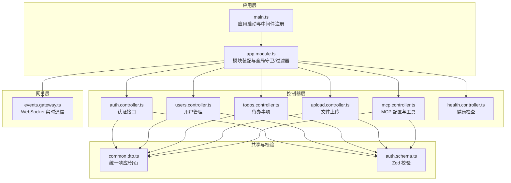
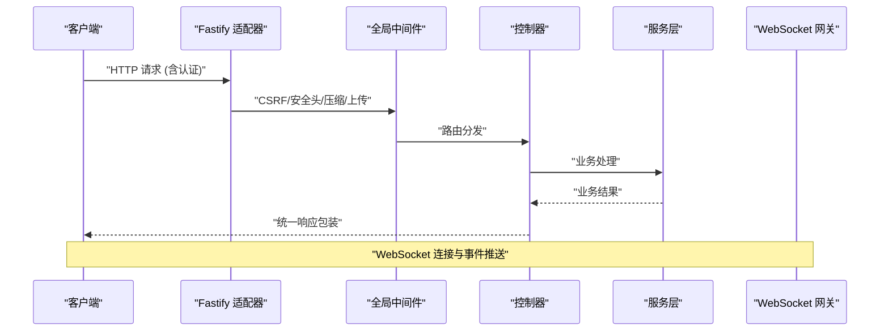
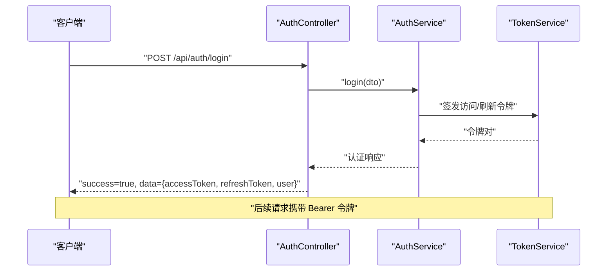
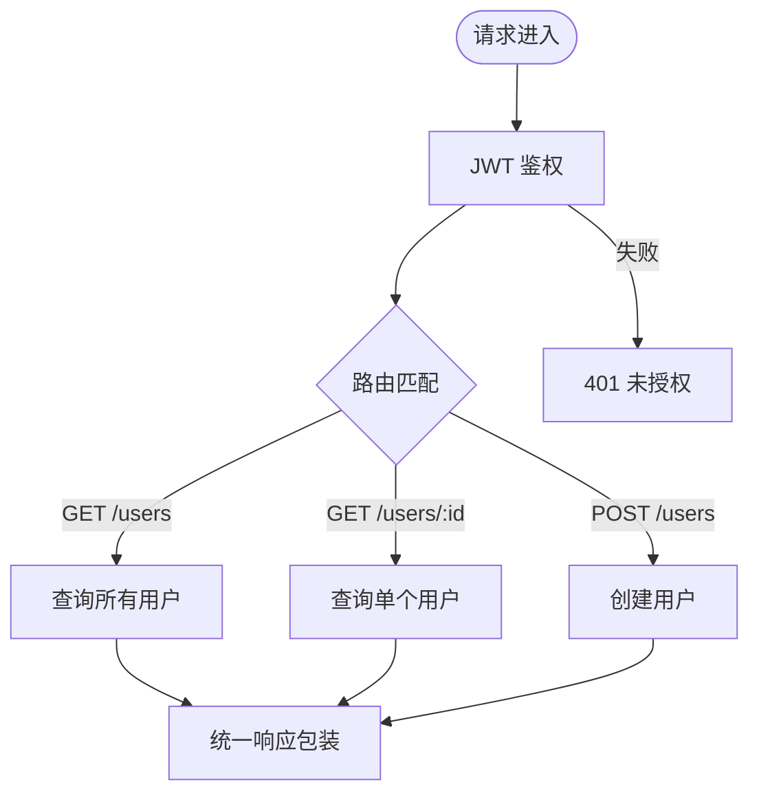
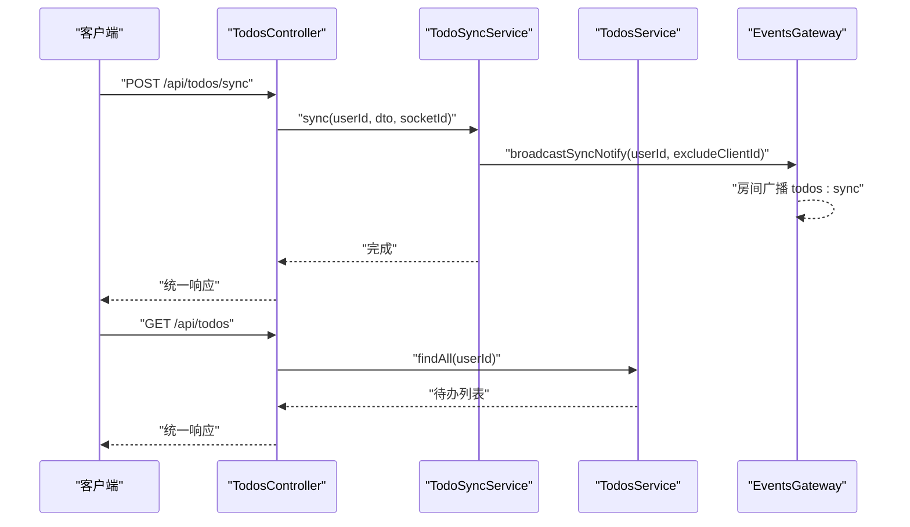
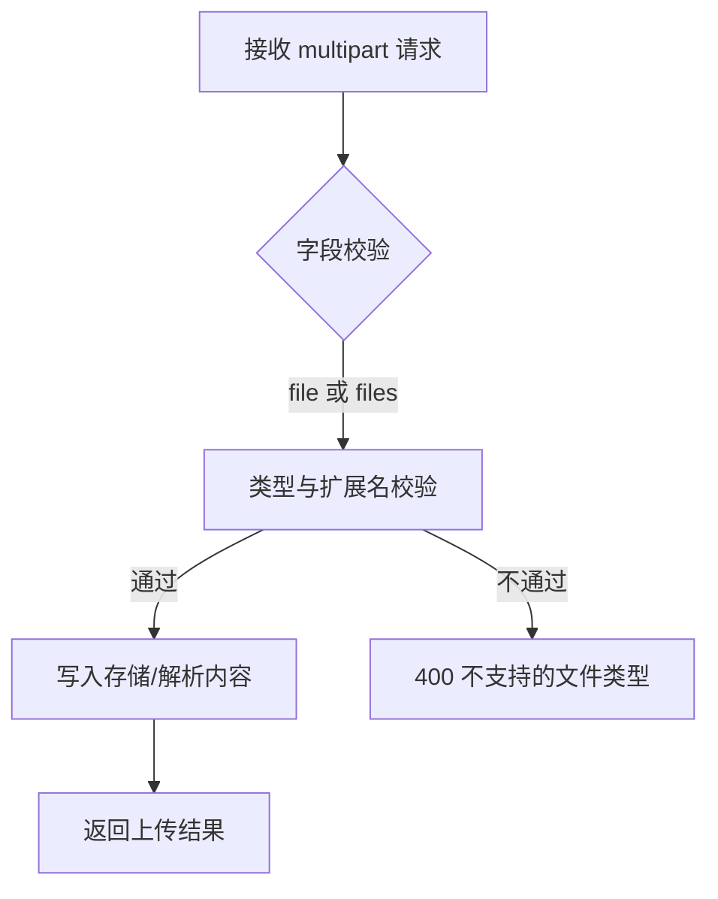
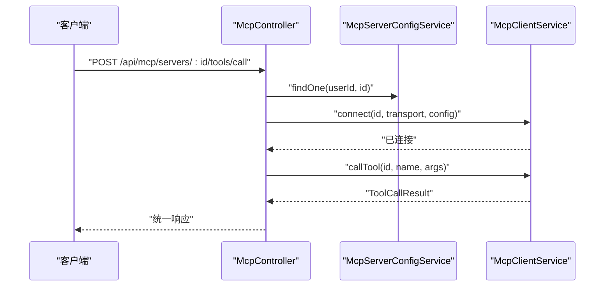
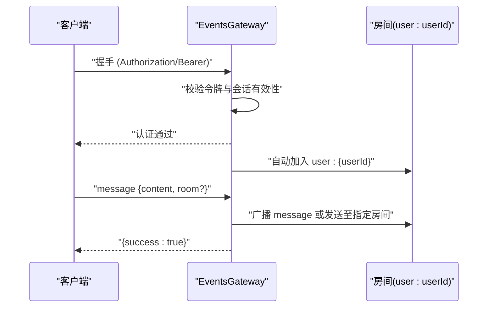
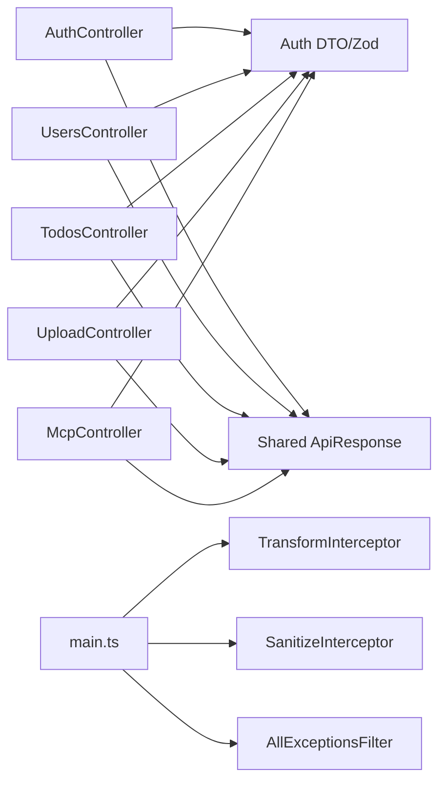

# API参考

<cite>
**本文引用的文件**
- [apps/backend/src/main.ts](file://apps/backend/src/main.ts)
- [apps/backend/src/app.module.ts](file://apps/backend/src/app.module.ts)
- [apps/backend/src/auth/auth.controller.ts](file://apps/backend/src/auth/auth.controller.ts)
- [apps/backend/src/auth/auth.dto.ts](file://apps/backend/src/auth/auth.dto.ts)
- [apps/backend/src/users/users.controller.ts](file://apps/backend/src/users/users.controller.ts)
- [apps/backend/src/todos/todos.controller.ts](file://apps/backend/src/todos/todos.controller.ts)
- [apps/backend/src/todos/todos.dto.ts](file://apps/backend/src/todos/todos.dto.ts)
- [apps/backend/src/upload/upload.controller.ts](file://apps/backend/src/upload/upload.controller.ts)
- [apps/backend/src/upload/upload.constants.ts](file://apps/backend/src/upload/upload.constants.ts)
- [apps/backend/src/mcp/mcp.controller.ts](file://apps/backend/src/mcp/mcp.controller.ts)
- [apps/backend/src/mcp/mcp.dto.ts](file://apps/backend/src/mcp/mcp.dto.ts)
- [apps/backend/src/events/events.gateway.ts](file://apps/backend/src/events/events.gateway.ts)
- [apps/backend/src/health/health.controller.ts](file://apps/backend/src/health/health.controller.ts)
- [apps/backend/src/common/types.ts](file://apps/backend/src/common/types.ts)
- [apps/backend/src/common/filters/all-exceptions.filter.ts](file://apps/backend/src/common/filters/all-exceptions.filter.ts)
- [apps/backend/src/common/interceptors/transform.interceptor.ts](file://apps/backend/src/common/interceptors/transform.interceptor.ts)
- [apps/backend/src/common/interceptors/sanitize.interceptor.ts](file://apps/backend/src/common/interceptors/sanitize.interceptor.ts)
- [packages/shared/src/dto/common.dto.ts](file://packages/shared/src/dto/common.dto.ts)
- [packages/shared/src/schemas/auth.schema.ts](file://packages/shared/src/schemas/auth.schema.ts)
</cite>

## 目录
1. [简介](#简介)
2. [项目结构](#项目结构)
3. [核心组件](#核心组件)
4. [架构总览](#架构总览)
5. [详细组件分析](#详细组件分析)
6. [依赖关系分析](#依赖关系分析)
7. [性能考量](#性能考量)
8. [故障排除指南](#故障排除指南)
9. [结论](#结论)
10. [附录](#附录)

## 简介
本文件为 Lumina 后端 API 的完整参考文档，覆盖认证、用户管理、待办事项、文件上传、MCP 配置、健康检查以及 WebSocket 实时通信等模块。文档基于实际代码实现，明确各接口的 HTTP 方法、URL 路径、请求参数、响应格式、状态码含义，并补充安全验证、错误处理、速率限制、版本控制与性能监控建议。

## 项目结构
后端采用 NestJS + Fastify 架构，通过模块化组织功能域，统一使用 Zod 进行请求校验，全局拦截器统一响应格式，异常过滤器统一错误输出，速率限制与安全中间件贯穿全链路。

**图表来源**
- [apps/backend/src/main.ts:34-195](file://apps/backend/src/main.ts#L34-L195)
- [apps/backend/src/app.module.ts:27-175](file://apps/backend/src/app.module.ts#L27-L175)
- [apps/backend/src/auth/auth.controller.ts:14-82](file://apps/backend/src/auth/auth.controller.ts#L14-L82)
- [apps/backend/src/users/users.controller.ts:12-50](file://apps/backend/src/users/users.controller.ts#L12-L50)
- [apps/backend/src/todos/todos.controller.ts:20-70](file://apps/backend/src/todos/todos.controller.ts#L20-L70)
- [apps/backend/src/upload/upload.controller.ts:20-156](file://apps/backend/src/upload/upload.controller.ts#L20-L156)
- [apps/backend/src/mcp/mcp.controller.ts:30-198](file://apps/backend/src/mcp/mcp.controller.ts#L30-L198)
- [apps/backend/src/health/health.controller.ts:16-77](file://apps/backend/src/health/health.controller.ts#L16-L77)
- [apps/backend/src/events/events.gateway.ts:57-266](file://apps/backend/src/events/events.gateway.ts#L57-L266)
- [packages/shared/src/dto/common.dto.ts:1-81](file://packages/shared/src/dto/common.dto.ts#L1-L81)
- [packages/shared/src/schemas/auth.schema.ts:1-121](file://packages/shared/src/schemas/auth.schema.ts#L1-L121)

**章节来源**
- [apps/backend/src/main.ts:34-195](file://apps/backend/src/main.ts#L34-L195)
- [apps/backend/src/app.module.ts:27-175](file://apps/backend/src/app.module.ts#L27-L175)

## 核心组件
- 应用启动与中间件
  - 全局前缀：/api
  - CORS：可配置多源，支持凭证与常用头部
  - Helmet 安全头、CSRF 防护（要求 X-Requested-With）、压缩、静态资源、multipart 上传
  - Swagger 文档：/api/docs
- 全局守卫与过滤器
  - 速率限制：短/中/长窗口三档
  - 异常过滤：统一错误响应、Zod 校验错误结构化、国际化
  - 响应拦截：统一成功响应包装
  - 输入清理：XSS 清理拦截器
- 版本控制
  - 通过进程环境变量 npm_package_version 注入 Swagger 版本

**章节来源**
- [apps/backend/src/main.ts:48-180](file://apps/backend/src/main.ts#L48-L180)
- [apps/backend/src/app.module.ts:116-138](file://apps/backend/src/app.module.ts#L116-L138)
- [apps/backend/src/common/filters/all-exceptions.filter.ts:16-137](file://apps/backend/src/common/filters/all-exceptions.filter.ts#L16-L137)
- [apps/backend/src/common/interceptors/transform.interceptor.ts:18-30](file://apps/backend/src/common/interceptors/transform.interceptor.ts#L18-L30)
- [apps/backend/src/common/interceptors/sanitize.interceptor.ts:10-64](file://apps/backend/src/common/interceptors/sanitize.interceptor.ts#L10-L64)

## 架构总览
Lumina 后端以模块化控制器为核心，结合 WebSocket 网关实现事件推送；认证采用 JWT，速率限制与安全中间件贯穿请求生命周期；Swagger 自动生成接口文档，Zod 校验保障输入质量。

**图表来源**
- [apps/backend/src/main.ts:65-157](file://apps/backend/src/main.ts#L65-L157)
- [apps/backend/src/auth/auth.controller.ts:14-82](file://apps/backend/src/auth/auth.controller.ts#L14-L82)
- [apps/backend/src/events/events.gateway.ts:86-145](file://apps/backend/src/events/events.gateway.ts#L86-L145)

## 详细组件分析

### 认证接口
- 基础信息
  - 前缀：/api/auth
  - 认证方式：Bearer Token（Swagger 已声明）
  - 速率限制：不同端点不同配额（见下方）
- 接口清单
  - POST /api/auth/login
    - 用途：用户登录
    - 请求体：登录 DTO（邮箱、密码）
    - 响应：认证响应（访问令牌、刷新令牌、用户信息）
    - 速率限制：短窗口 5 次/分钟
  - POST /api/auth/register
    - 用途：用户注册
    - 请求体：注册 DTO（邮箱、姓名、密码）
    - 响应：认证响应
    - 速率限制：1 次/分钟
  - POST /api/auth/refresh
    - 用途：刷新访问令牌
    - 请求体：刷新令牌 DTO
    - 响应：新的访问令牌与用户信息
    - 速率限制：10 次/分钟
  - GET /api/auth/me
    - 用途：获取当前用户信息
    - 响应：用户信息
    - 速率限制：跳过（由守卫保护）
  - POST /api/auth/logout
    - 用途：登出并清除 Cookie
    - 请求体：登出 DTO（刷新令牌）
    - 响应：登出成功消息
    - 速率限制：默认
- 请求参数与响应格式
  - 请求体 DTO 基于 Zod Schema，Swagger 自动生成
  - 成功响应统一包装，错误响应包含结构化错误对象
- 状态码
  - 200：成功
  - 400：请求参数无效（Zod 校验失败）
  - 401：未授权（令牌无效或过期）
  - 403：CSRF 防护拦截
  - 409：业务冲突（如邮箱已存在）
  - 500：服务器内部错误

**图表来源**
- [apps/backend/src/auth/auth.controller.ts:22-27](file://apps/backend/src/auth/auth.controller.ts#L22-L27)
- [apps/backend/src/auth/auth.controller.ts:33-38](file://apps/backend/src/auth/auth.controller.ts#L33-L38)
- [apps/backend/src/auth/auth.controller.ts:43-48](file://apps/backend/src/auth/auth.controller.ts#L43-L48)
- [apps/backend/src/auth/auth.controller.ts:53-60](file://apps/backend/src/auth/auth.controller.ts#L53-L60)
- [apps/backend/src/auth/auth.controller.ts:65-80](file://apps/backend/src/auth/auth.controller.ts#L65-L80)

**章节来源**
- [apps/backend/src/auth/auth.controller.ts:14-82](file://apps/backend/src/auth/auth.controller.ts#L14-L82)
- [apps/backend/src/auth/auth.dto.ts:15-40](file://apps/backend/src/auth/auth.dto.ts#L15-L40)
- [packages/shared/src/schemas/auth.schema.ts:24-121](file://packages/shared/src/schemas/auth.schema.ts#L24-L121)
- [packages/shared/src/dto/common.dto.ts:4-29](file://packages/shared/src/dto/common.dto.ts#L4-L29)
- [apps/backend/src/common/filters/all-exceptions.filter.ts:27-137](file://apps/backend/src/common/filters/all-exceptions.filter.ts#L27-L137)

### 用户管理接口
- 基础信息
  - 前缀：/api/users
  - 鉴权：JWT 必需
- 接口清单
  - GET /api/users
    - 用途：获取所有用户
    - 响应：用户数组
  - GET /api/users/:id
    - 用途：按 ID 获取单个用户
    - 响应：用户对象
  - POST /api/users
    - 用途：创建新用户（注册）
    - 请求体：注册 DTO
    - 响应：用户对象
- 状态码
  - 200：成功
  - 401：未授权
  - 404：用户不存在
  - 500：服务器内部错误

**图表来源**
- [apps/backend/src/users/users.controller.ts:12-50](file://apps/backend/src/users/users.controller.ts#L12-L50)

**章节来源**
- [apps/backend/src/users/users.controller.ts:12-50](file://apps/backend/src/users/users.controller.ts#L12-L50)

### 待办事项接口
- 基础信息
  - 前缀：/api/todos
  - 鉴权：JWT 必需
  - 同步头：X-Socket-ID（可选，用于广播去重）
- 接口清单
  - POST /api/todos/sync
    - 用途：离线优先合并同步
    - 请求体：同步合并 DTO
    - 响应：无（204 或空对象）
  - GET /api/todos
    - 用途：获取当前用户所有待办
    - 响应：待办数组
  - GET /api/todos/trash
    - 用途：获取回收站
    - 响应：待办数组
  - POST /api/todos/:id/restore
    - 用途：恢复已删除
    - 响应：无（204）
  - DELETE /api/todos/:id/permanent
    - 用途：永久删除
    - 响应：无（204）
  - DELETE /api/todos/trash/clear
    - 用途：清空回收站
    - 响应：无（204）
- 状态码
  - 200/204：成功
  - 401：未授权
  - 404：资源不存在
  - 500：服务器内部错误

**图表来源**
- [apps/backend/src/todos/todos.controller.ts:30-68](file://apps/backend/src/todos/todos.controller.ts#L30-L68)
- [apps/backend/src/events/events.gateway.ts:177-202](file://apps/backend/src/events/events.gateway.ts#L177-L202)

**章节来源**
- [apps/backend/src/todos/todos.controller.ts:20-70](file://apps/backend/src/todos/todos.controller.ts#L20-L70)
- [apps/backend/src/todos/todos.dto.ts:1-5](file://apps/backend/src/todos/todos.dto.ts#L1-L5)
- [apps/backend/src/events/events.gateway.ts:177-202](file://apps/backend/src/events/events.gateway.ts#L177-L202)

### 文件上传接口
- 基础信息
  - 前缀：/api/upload
  - 鉴权：JWT 必需
  - 上传大小与文件数限制：可通过环境变量配置
  - 允许的 MIME 类型与扩展名：见常量
- 接口清单
  - POST /api/upload/single
    - 用途：上传单个文件
    - 请求：multipart/form-data，字段 file
    - 响应：上传结果（包含访问地址等）
  - POST /api/upload/parse
    - 用途：解析文件内容（仅文本类）
    - 请求：multipart/form-data，字段 file
    - 响应：{ content: string }
  - POST /api/upload/multiple
    - 用途：上传多个文件（最多 10 个）
    - 请求：multipart/form-data，字段 files[]
    - 响应：上传结果数组
  - DELETE /api/upload/:key
    - 用途：删除文件
    - 响应：{ success: boolean }
- 状态码
  - 200：成功
  - 400：缺少文件、文件类型不支持
  - 401：未授权
  - 500：服务器内部错误

**图表来源**
- [apps/backend/src/upload/upload.controller.ts:68-154](file://apps/backend/src/upload/upload.controller.ts#L68-L154)
- [apps/backend/src/upload/upload.constants.ts:1-61](file://apps/backend/src/upload/upload.constants.ts#L1-L61)
- [apps/backend/src/common/types.ts:5-16](file://apps/backend/src/common/types.ts#L5-L16)

**章节来源**
- [apps/backend/src/upload/upload.controller.ts:20-156](file://apps/backend/src/upload/upload.controller.ts#L20-L156)
- [apps/backend/src/upload/upload.constants.ts:1-61](file://apps/backend/src/upload/upload.constants.ts#L1-L61)
- [apps/backend/src/common/types.ts:1-16](file://apps/backend/src/common/types.ts#L1-L16)

### MCP 配置与工具接口
- 基础信息
  - 前缀：/api/mcp
  - 鉴权：JWT 必需
  - 功能：管理 MCP 服务器配置、连接/断开、列举工具、调用工具
- 接口清单
  - POST /api/mcp/servers
    - 用途：创建 MCP 服务器配置
    - 响应：配置对象（含创建时间）
  - GET /api/mcp/servers
    - 用途：获取当前用户所有配置
    - 响应：配置数组
  - GET /api/mcp/servers/:id
    - 用途：按 ID 获取配置
    - 响应：配置对象
  - PUT /api/mcp/servers/:id
    - 用途：更新配置
    - 响应：配置对象
  - DELETE /api/mcp/servers/:id
    - 用途：删除配置并断开连接
    - 响应：无（204）
  - GET /api/mcp/tools
    - 用途：聚合所有已启用服务器的工具（懒连接）
    - 响应：工具数组（注入 serverId）
  - POST /api/mcp/servers/:id/connect
    - 用途：连接到指定服务器
    - 响应：无（204）
  - POST /api/mcp/servers/:id/disconnect
    - 用途：断开连接
    - 响应：无（204）
  - GET /api/mcp/servers/:id/tools
    - 用途：获取指定服务器的工具
    - 响应：工具数组
  - POST /api/mcp/servers/:id/tools/call
    - 用途：调用工具
    - 请求体：工具名与参数
    - 响应：工具调用结果
- 状态码
  - 200/204：成功
  - 401：未授权
  - 404：资源不存在
  - 500：服务器内部错误

**图表来源**
- [apps/backend/src/mcp/mcp.controller.ts:177-196](file://apps/backend/src/mcp/mcp.controller.ts#L177-L196)
- [apps/backend/src/mcp/mcp.dto.ts:22-59](file://apps/backend/src/mcp/mcp.dto.ts#L22-L59)

**章节来源**
- [apps/backend/src/mcp/mcp.controller.ts:30-198](file://apps/backend/src/mcp/mcp.controller.ts#L30-L198)
- [apps/backend/src/mcp/mcp.dto.ts:1-59](file://apps/backend/src/mcp/mcp.dto.ts#L1-L59)

### WebSocket 实时通信接口
- 基础信息
  - 网关：/events
  - 认证：握手阶段校验 Bearer 令牌，同时检查会话是否失效
  - 房间：自动加入 user:{userId} 房间，支持自定义房间
  - 广播：后端防抖（500ms）减少重复广播
- 事件清单
  - 客户端 -> 服务端
    - message：发送消息（可指定房间）
    - join：加入房间（鉴权房间名 user:{userId}）
    - leave：离开房间
  - 服务端 -> 客户端
    - message：广播消息
    - user:joined / user:left：房间成员变更
    - todos:sync：待办同步通知（防抖后触发）
- 连接管理
  - CORS 白名单可配置
  - 支持 polling 与 websocket 传输
  - 断开时清理定时器

**图表来源**
- [apps/backend/src/events/events.gateway.ts:86-145](file://apps/backend/src/events/events.gateway.ts#L86-L145)
- [apps/backend/src/events/events.gateway.ts:150-175](file://apps/backend/src/events/events.gateway.ts#L150-L175)
- [apps/backend/src/events/events.gateway.ts:207-250](file://apps/backend/src/events/events.gateway.ts#L207-L250)
- [apps/backend/src/events/events.gateway.ts:177-202](file://apps/backend/src/events/events.gateway.ts#L177-L202)

**章节来源**
- [apps/backend/src/events/events.gateway.ts:57-266](file://apps/backend/src/events/events.gateway.ts#L57-L266)

### 健康检查接口
- 前缀：/api/health
- 接口
  - GET /api/health：综合健康检查（数据库、Redis、内存、磁盘）
  - GET /api/health/liveness：存活探针
  - GET /api/health/readiness：就绪探针
- 响应
  - 200：服务可用
  - 5xx：依赖不可用

**章节来源**
- [apps/backend/src/health/health.controller.ts:16-77](file://apps/backend/src/health/health.controller.ts#L16-L77)

## 依赖关系分析
- 控制器依赖服务层，服务层依赖共享 DTO/Zod Schema
- 全局拦截器/过滤器在应用启动时注册，统一处理响应与异常
- WebSocket 网关独立于 HTTP 控制器，通过房间与事件进行解耦

**图表来源**
- [apps/backend/src/auth/auth.controller.ts:14-82](file://apps/backend/src/auth/auth.controller.ts#L14-L82)
- [apps/backend/src/users/users.controller.ts:12-50](file://apps/backend/src/users/users.controller.ts#L12-L50)
- [apps/backend/src/todos/todos.controller.ts:20-70](file://apps/backend/src/todos/todos.controller.ts#L20-L70)
- [apps/backend/src/upload/upload.controller.ts:20-156](file://apps/backend/src/upload/upload.controller.ts#L20-L156)
- [apps/backend/src/mcp/mcp.controller.ts:30-198](file://apps/backend/src/mcp/mcp.controller.ts#L30-L198)
- [apps/backend/src/main.ts:159-169](file://apps/backend/src/main.ts#L159-L169)
- [packages/shared/src/dto/common.dto.ts:1-81](file://packages/shared/src/dto/common.dto.ts#L1-L81)

**章节来源**
- [apps/backend/src/main.ts:159-169](file://apps/backend/src/main.ts#L159-L169)
- [packages/shared/src/dto/common.dto.ts:1-81](file://packages/shared/src/dto/common.dto.ts#L1-L81)

## 性能考量
- 传输优化
  - gzip 压缩阈值：1KB；适合中等以上体积响应
  - 静态资源托管：/public 前缀
- 速率限制
  - 短/中/长三档窗口，针对高频端点（如登录/刷新）设置更严格限制
- 广播防抖
  - 待办同步事件 500ms 防抖，降低广播风暴
- 建议
  - 对大文件上传使用分片与断点续传（当前接口为一次性上传）
  - 对频繁变更的数据采用增量推送与客户端缓存策略

[本节为通用指导，无需具体文件分析]

## 故障排除指南
- 统一错误响应
  - 结构：success=false、data=null、message、errors、statusCode、timestamp
  - Zod 校验错误：返回结构化字段级错误对象
- 常见问题定位
  - 401 未授权：确认 Bearer 令牌有效且未过期
  - 403 CSRF：确保请求包含 X-Requested-With 头
  - 400 参数错误：检查 Swagger 文档与 Zod 校验规则
  - 500 服务器错误：查看日志与堆栈信息
- 国际化
  - 错误消息与字段名可按 x-lang 或请求头语言进行本地化

**章节来源**
- [apps/backend/src/common/filters/all-exceptions.filter.ts:27-137](file://apps/backend/src/common/filters/all-exceptions.filter.ts#L27-L137)
- [apps/backend/src/common/interceptors/sanitize.interceptor.ts:10-64](file://apps/backend/src/common/interceptors/sanitize.interceptor.ts#L10-L64)
- [apps/backend/src/main.ts:142-156](file://apps/backend/src/main.ts#L142-L156)

## 结论
Lumina 后端 API 以模块化与安全为中心，通过统一的响应/错误格式、严格的输入校验与全局中间件，提供了稳定可靠的 RESTful 与 WebSocket 接口。建议在客户端集成时遵循统一的认证与错误处理流程，并结合健康检查与日志监控保障线上稳定性。

[本节为总结性内容，无需具体文件分析]

## 附录

### API 版本控制
- 版本号来源于 npm_package_version 环境变量，展示在 Swagger 文档标题中
- 建议：通过路径前缀或 Accept-Version 头实现语义化版本控制

**章节来源**
- [apps/backend/src/main.ts:45-47](file://apps/backend/src/main.ts#L45-L47)

### 请求限流
- 短：1 秒内 20 次
- 中：10 秒内 100 次
- 长：1 分钟内 300 次
- 认证端点有额外配额限制

**章节来源**
- [apps/backend/src/app.module.ts:117-138](file://apps/backend/src/app.module.ts#L117-L138)
- [apps/backend/src/auth/auth.controller.ts:22-48](file://apps/backend/src/auth/auth.controller.ts#L22-L48)

### 安全验证
- Helmet 安全头、CSP、COEP/COEP 关闭
- CSRF 防护：要求 X-Requested-With
- XSS 清理：SanitizeInterceptor
- 速率限制：ThrottlerGuard
- 认证：JWT Bearer

**章节来源**
- [apps/backend/src/main.ts:84-121](file://apps/backend/src/main.ts#L84-L121)
- [apps/backend/src/common/interceptors/sanitize.interceptor.ts:10-64](file://apps/backend/src/common/interceptors/sanitize.interceptor.ts#L10-L64)
- [apps/backend/src/app.module.ts:116-138](file://apps/backend/src/app.module.ts#L116-L138)

### 错误处理
- 全局异常过滤器：统一错误响应、Zod 结构化错误、国际化
- 响应拦截器：统一成功响应包装
- 建议：客户端对 success=false 的响应进行统一处理

**章节来源**
- [apps/backend/src/common/filters/all-exceptions.filter.ts:16-137](file://apps/backend/src/common/filters/all-exceptions.filter.ts#L16-L137)
- [apps/backend/src/common/interceptors/transform.interceptor.ts:18-30](file://apps/backend/src/common/interceptors/transform.interceptor.ts#L18-L30)

### SDK 使用与客户端集成
- 认证
  - 登录后保存 accessToken 与 refreshToken，后续请求在 Authorization 头中携带 Bearer 令牌
  - 刷新令牌失败时引导重新登录
- 上传
  - 单文件：multipart/form-data，字段 file
  - 多文件：字段 files[]，最多 10 个
  - 解析文本文件：parse 接口返回 content
- 实时通信
  - 连接 /events 命名空间，握手时携带 Authorization
  - 自动加入 user:{userId} 房间，订阅 todos:sync 事件进行增量同步

**章节来源**
- [apps/backend/src/auth/auth.controller.ts:22-80](file://apps/backend/src/auth/auth.controller.ts#L22-L80)
- [apps/backend/src/upload/upload.controller.ts:68-154](file://apps/backend/src/upload/upload.controller.ts#L68-L154)
- [apps/backend/src/events/events.gateway.ts:86-145](file://apps/backend/src/events/events.gateway.ts#L86-L145)

### API 测试工具与调试技巧
- Swagger：/api/docs 查看接口与示例
- 健康检查：/api/health、/api/health/liveness、/api/health/readiness
- 调试建议
  - 使用浏览器开发者工具或 Postman 观察请求头与响应体
  - 关注日志输出（Pino）与错误响应中的 errors 字段
  - WebSocket 场景下，先验证握手成功再发送业务事件

**章节来源**
- [apps/backend/src/main.ts:171-180](file://apps/backend/src/main.ts#L171-L180)
- [apps/backend/src/health/health.controller.ts:16-77](file://apps/backend/src/health/health.controller.ts#L16-L77)