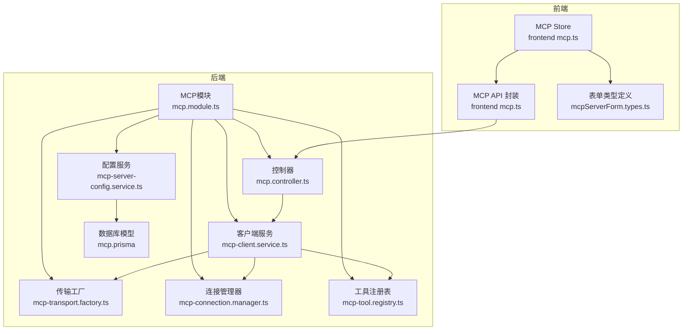
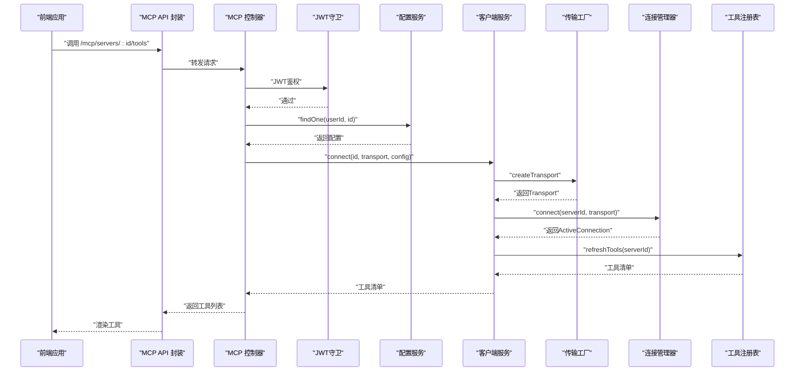
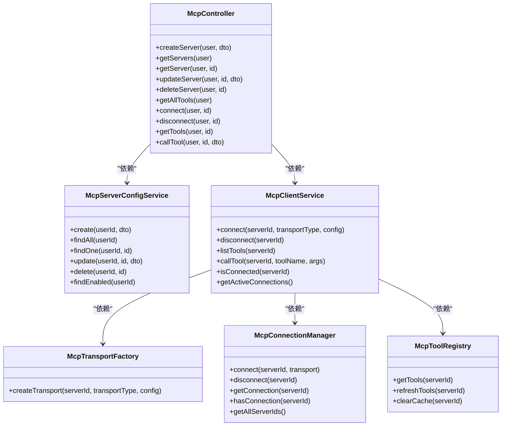

# MCP配置API

<cite>
**本文档引用的文件**
- [apps/backend/src/mcp/mcp.module.ts](file://apps/backend/src/mcp/mcp.module.ts)
- [apps/backend/src/mcp/mcp.controller.ts](file://apps/backend/src/mcp/mcp.controller.ts)
- [apps/backend/src/mcp/mcp.dto.ts](file://apps/backend/src/mcp/mcp.dto.ts)
- [apps/backend/src/mcp/mcp-server-config.service.ts](file://apps/backend/src/mcp/mcp-server-config.service.ts)
- [apps/backend/src/mcp/mcp-client.service.ts](file://apps/backend/src/mcp/mcp-client.service.ts)
- [apps/backend/src/mcp/core/mcp-transport.factory.ts](file://apps/backend/src/mcp/core/mcp-transport.factory.ts)
- [apps/backend/src/mcp/core/mcp-connection.manager.ts](file://apps/backend/src/mcp/core/mcp-connection.manager.ts)
- [apps/backend/src/mcp/core/mcp-tool.registry.ts](file://apps/backend/src/mcp/core/mcp-tool.registry.ts)
- [packages/shared/src/schemas/mcp.schema.ts](file://packages/shared/src/schemas/mcp.schema.ts)
- [apps/backend/prisma/schema/mcp.prisma](file://apps/backend/prisma/schema/mcp.prisma)
- [apps/frontend/src/features/mcp/api/mcp.ts](file://apps/frontend/src/features/mcp/api/mcp.ts)
- [apps/frontend/src/features/mcp/stores/mcp.ts](file://apps/frontend/src/features/mcp/stores/mcp.ts)
- [apps/frontend/src/features/mcp/components/mcpServerForm.types.ts](file://apps/frontend/src/features/mcp/components/mcpServerForm.types.ts)
- [apps/backend/tests/mcp/mcp-client.service.spec.ts](file://apps/backend/tests/mcp/mcp-client.service.spec.ts)
- [apps/backend/tests/mcp/mcp-server-config.service.spec.ts](file://apps/backend/tests/mcp/mcp-server-config.service.spec.ts)
</cite>

## 目录
1. [简介](#简介)
2. [项目结构](#项目结构)
3. [核心组件](#核心组件)
4. [架构总览](#架构总览)
5. [详细组件分析](#详细组件分析)
6. [依赖关系分析](#依赖关系分析)
7. [性能考量](#性能考量)
8. [故障排查指南](#故障排查指南)
9. [结论](#结论)
10. [附录](#附录)

## 简介
本文件系统性地文档化了MCP（Model Context Protocol）配置管理API，覆盖MCP服务器配置、连接管理、传输协议、工具注册与能力声明、消息路由、安全与权限控制、以及与AI助手集成的最佳实践。文档同时提供HTTP与STDIO两种传输方式的配置参数、连接建立流程、心跳与断线处理、服务器发现与工具聚合、以及调试与性能监控建议。

## 项目结构
后端采用NestJS模块化架构，MCP子系统位于apps/backend/src/mcp目录；共享模式定义位于packages/shared/src/schemas/mcp.schema.ts；前端位于apps/frontend/src/features/mcp，提供API封装与状态管理。

图表来源
- [apps/backend/src/mcp/mcp.module.ts:13-22](file://apps/backend/src/mcp/mcp.module.ts#L13-L22)
- [apps/backend/src/mcp/mcp.controller.ts:34-40](file://apps/backend/src/mcp/mcp.controller.ts#L34-L40)
- [apps/backend/src/mcp/mcp-server-config.service.ts:10-13](file://apps/backend/src/mcp/mcp-server-config.service.ts#L10-L13)
- [apps/backend/src/mcp/mcp-client.service.ts:21-28](file://apps/backend/src/mcp/mcp-client.service.ts#L21-L28)
- [apps/backend/src/mcp/core/mcp-transport.factory.ts:10-11](file://apps/backend/src/mcp/core/mcp-transport.factory.ts#L10-L11)
- [apps/backend/src/mcp/core/mcp-connection.manager.ts:12-15](file://apps/backend/src/mcp/core/mcp-connection.manager.ts#L12-L15)
- [apps/backend/src/mcp/core/mcp-tool.registry.ts:5-10](file://apps/backend/src/mcp/core/mcp-tool.registry.ts#L5-L10)
- [apps/backend/prisma/schema/mcp.prisma:1-16](file://apps/backend/prisma/schema/mcp.prisma#L1-L16)
- [apps/frontend/src/features/mcp/api/mcp.ts:16-107](file://apps/frontend/src/features/mcp/api/mcp.ts#L16-L107)
- [apps/frontend/src/features/mcp/stores/mcp.ts:15-245](file://apps/frontend/src/features/mcp/stores/mcp.ts#L15-L245)
- [apps/frontend/src/features/mcp/components/mcpServerForm.types.ts:1-25](file://apps/frontend/src/features/mcp/components/mcpServerForm.types.ts#L1-L25)

章节来源
- [apps/backend/src/mcp/mcp.module.ts:1-25](file://apps/backend/src/mcp/mcp.module.ts#L1-L25)
- [apps/backend/src/mcp/mcp.controller.ts:1-198](file://apps/backend/src/mcp/mcp.controller.ts#L1-L198)
- [apps/backend/src/mcp/mcp-server-config.service.ts:1-156](file://apps/backend/src/mcp/mcp-server-config.service.ts#L1-L156)
- [apps/backend/src/mcp/mcp-client.service.ts:1-124](file://apps/backend/src/mcp/mcp-client.service.ts#L1-L124)
- [apps/backend/src/mcp/core/mcp-transport.factory.ts:1-220](file://apps/backend/src/mcp/core/mcp-transport.factory.ts#L1-L220)
- [apps/backend/src/mcp/core/mcp-connection.manager.ts:1-101](file://apps/backend/src/mcp/core/mcp-connection.manager.ts#L1-L101)
- [apps/backend/src/mcp/core/mcp-tool.registry.ts:1-48](file://apps/backend/src/mcp/core/mcp-tool.registry.ts#L1-L48)
- [packages/shared/src/schemas/mcp.schema.ts:1-220](file://packages/shared/src/schemas/mcp.schema.ts#L1-L220)
- [apps/backend/prisma/schema/mcp.prisma:1-16](file://apps/backend/prisma/schema/mcp.prisma#L1-L16)
- [apps/frontend/src/features/mcp/api/mcp.ts:1-108](file://apps/frontend/src/features/mcp/api/mcp.ts#L1-L108)
- [apps/frontend/src/features/mcp/stores/mcp.ts:1-246](file://apps/frontend/src/features/mcp/stores/mcp.ts#L1-L246)
- [apps/frontend/src/features/mcp/components/mcpServerForm.types.ts:1-25](file://apps/frontend/src/features/mcp/components/mcpServerForm.types.ts#L1-L25)

## 核心组件
- 控制器：提供REST接口，负责鉴权、权限校验、工具发现与调用、连接生命周期管理。
- 配置服务：基于Prisma的数据访问层，实现用户维度的MCP服务器配置CRUD与启用筛选。
- 客户端服务：门面类，协调传输工厂、连接管理器与工具注册表，提供统一的工具列表与调用入口。
- 传输工厂：根据传输类型创建STDIO或HTTP传输，内置安全检查与环境变量注入。
- 连接管理器：维护活跃连接，封装SDK客户端生命周期，处理STDIO stderr事件与关闭回调。
- 工具注册表：缓存工具清单，按需刷新，支持清理缓存与回退读取。

章节来源
- [apps/backend/src/mcp/mcp.controller.ts:34-197](file://apps/backend/src/mcp/mcp.controller.ts#L34-L197)
- [apps/backend/src/mcp/mcp-server-config.service.ts:10-155](file://apps/backend/src/mcp/mcp-server-config.service.ts#L10-L155)
- [apps/backend/src/mcp/mcp-client.service.ts:17-123](file://apps/backend/src/mcp/mcp-client.service.ts#L17-L123)
- [apps/backend/src/mcp/core/mcp-transport.factory.ts:10-219](file://apps/backend/src/mcp/core/mcp-transport.factory.ts#L10-L219)
- [apps/backend/src/mcp/core/mcp-connection.manager.ts:12-100](file://apps/backend/src/mcp/core/mcp-connection.manager.ts#L12-L100)
- [apps/backend/src/mcp/core/mcp-tool.registry.ts:5-47](file://apps/backend/src/mcp/core/mcp-tool.registry.ts#L5-L47)

## 架构总览
下图展示从前端到后端的请求路径、鉴权与数据流：

图表来源
- [apps/frontend/src/features/mcp/api/mcp.ts:59-65](file://apps/frontend/src/features/mcp/api/mcp.ts#L59-L65)
- [apps/backend/src/mcp/mcp.controller.ts:160-175](file://apps/backend/src/mcp/mcp.controller.ts#L160-L175)
- [apps/backend/src/mcp/mcp-client.service.ts:33-47](file://apps/backend/src/mcp/mcp-client.service.ts#L33-L47)
- [apps/backend/src/mcp/core/mcp-transport.factory.ts:112-126](file://apps/backend/src/mcp/core/mcp-transport.factory.ts#L112-L126)
- [apps/backend/src/mcp/core/mcp-connection.manager.ts:23-73](file://apps/backend/src/mcp/core/mcp-connection.manager.ts#L23-L73)
- [apps/backend/src/mcp/core/mcp-tool.registry.ts:20-42](file://apps/backend/src/mcp/core/mcp-tool.registry.ts#L20-L42)

## 详细组件分析

### 控制器与权限控制
- 接口覆盖：创建、查询、更新、删除服务器配置；连接/断开；列出工具；调用工具。
- 权限控制：所有接口均使用JWT守卫，且在操作前进行“所有权校验”，防止越权访问。
- 工具发现：支持对启用的服务器批量拉取工具清单，并在懒连接场景中自动建立连接。
- 工具调用：确保已连接后执行，若工具不存在则抛出错误。

章节来源
- [apps/backend/src/mcp/mcp.controller.ts:42-197](file://apps/backend/src/mcp/mcp.controller.ts#L42-L197)
- [apps/backend/src/mcp/mcp-server-config.service.ts:65-96](file://apps/backend/src/mcp/mcp-server-config.service.ts#L65-L96)

### 配置服务与数据模型
- 数据持久化：使用Prisma模型McpServer，字段包括名称、描述、传输类型、配置JSON、启用状态、用户ID及时间戳。
- 查询语义：按用户ID过滤；支持启用筛选用于AI助手自动发现工具。
- 安全约束：删除与更新前进行所有权校验，防止跨用户访问。

章节来源
- [apps/backend/prisma/schema/mcp.prisma:1-16](file://apps/backend/prisma/schema/mcp.prisma#L1-L16)
- [apps/backend/src/mcp/mcp-server-config.service.ts:18-96](file://apps/backend/src/mcp/mcp-server-config.service.ts#L18-L96)

### 客户端服务与门面模式
- 统一入口：封装连接、断开、工具列表与调用。
- 连接预热：连接成功后刷新工具注册表，提升后续调用效率。
- 错误处理：对未连接、工具不存在等场景进行明确报错。

章节来源
- [apps/backend/src/mcp/mcp-client.service.ts:17-123](file://apps/backend/src/mcp/mcp-client.service.ts#L17-L123)

### 传输工厂与安全策略
- STDIO传输：
  - 命令白名单：生产环境必须配置允许命令列表；开发环境默认放行。
  - 环境变量：仅允许部分受控键注入，避免敏感泄露。
  - 包名纠错：对特定包名进行自动修正。
- HTTP传输：
  - 协议限制：仅允许http/https。
  - 主机黑名单：禁止localhost、.local、私网地址解析。
  - 认证头注入：支持Bearer/OAuth与API Key两种方式。
- 动态导入：运行时动态加载可流式的HTTP传输以支持流式响应。

章节来源
- [apps/backend/src/mcp/core/mcp-transport.factory.ts:13-219](file://apps/backend/src/mcp/core/mcp-transport.factory.ts#L13-L219)
- [packages/shared/src/schemas/mcp.schema.ts:79-118](file://packages/shared/src/schemas/mcp.schema.ts#L79-L118)

### 连接管理器与生命周期
- 生命周期：创建SDK客户端并连接，处理STDIO stderr日志与关闭事件，记录错误。
- 并发安全：同一serverId重复连接时先断开再重连。
- 资源回收：模块销毁时主动断开所有连接。

章节来源
- [apps/backend/src/mcp/core/mcp-connection.manager.ts:12-100](file://apps/backend/src/mcp/core/mcp-connection.manager.ts#L12-L100)

### 工具注册表与缓存
- 缓存策略：按serverId缓存工具清单，首次缺失时刷新。
- 刷新策略：连接建立后自动刷新，断开后清理缓存。
- 回退行为：刷新失败时回退至已有缓存或空列表。

章节来源
- [apps/backend/src/mcp/core/mcp-tool.registry.ts:5-47](file://apps/backend/src/mcp/core/mcp-tool.registry.ts#L5-L47)

### 前端API与状态管理
- API封装：统一GET/POST/PUT/DELETE请求，包含超时与错误处理。
- Store状态：维护服务器列表、连接状态、连接中状态与错误信息；支持自动连接与运行时配置变更后的重连。
- 表单类型：定义传输类型与认证类型，便于UI层渲染与校验。

章节来源
- [apps/frontend/src/features/mcp/api/mcp.ts:16-107](file://apps/frontend/src/features/mcp/api/mcp.ts#L16-L107)
- [apps/frontend/src/features/mcp/stores/mcp.ts:15-245](file://apps/frontend/src/features/mcp/stores/mcp.ts#L15-L245)
- [apps/frontend/src/features/mcp/components/mcpServerForm.types.ts:1-25](file://apps/frontend/src/features/mcp/components/mcpServerForm.types.ts#L1-L25)

### 数据模型与DTO
- 传输类型：STDIO与HTTP枚举。
- 配置模式：STDIO包含命令、参数、环境变量、工作目录；HTTP包含URL、请求头、认证信息。
- 工具与调用结果：工具包含名称、描述与输入Schema；调用结果包含内容数组与错误标记。

章节来源
- [packages/shared/src/schemas/mcp.schema.ts:6-118](file://packages/shared/src/schemas/mcp.schema.ts#L6-L118)
- [apps/backend/src/mcp/mcp.dto.ts:17-59](file://apps/backend/src/mcp/mcp.dto.ts#L17-L59)

## 依赖关系分析

图表来源
- [apps/backend/src/mcp/mcp.controller.ts:34-40](file://apps/backend/src/mcp/mcp.controller.ts#L34-L40)
- [apps/backend/src/mcp/mcp-server-config.service.ts:10-13](file://apps/backend/src/mcp/mcp-server-config.service.ts#L10-L13)
- [apps/backend/src/mcp/mcp-client.service.ts:21-28](file://apps/backend/src/mcp/mcp-client.service.ts#L21-L28)
- [apps/backend/src/mcp/core/mcp-transport.factory.ts:10-11](file://apps/backend/src/mcp/core/mcp-transport.factory.ts#L10-L11)
- [apps/backend/src/mcp/core/mcp-connection.manager.ts:12-15](file://apps/backend/src/mcp/core/mcp-connection.manager.ts#L12-L15)
- [apps/backend/src/mcp/core/mcp-tool.registry.ts:5-10](file://apps/backend/src/mcp/core/mcp-tool.registry.ts#L5-L10)

章节来源
- [apps/backend/src/mcp/mcp.module.ts:13-22](file://apps/backend/src/mcp/mcp.module.ts#L13-L22)
- [apps/backend/src/mcp/mcp.controller.ts:34-197](file://apps/backend/src/mcp/mcp.controller.ts#L34-L197)
- [apps/backend/src/mcp/mcp-client.service.ts:17-123](file://apps/backend/src/mcp/mcp-client.service.ts#L17-L123)

## 性能考量
- 连接复用：连接管理器对同一serverId进行去重与重连，避免重复握手。
- 工具缓存：工具注册表缓存工具清单，减少重复RPC调用。
- 懒连接：工具发现与调用前按需建立连接，降低无用连接开销。
- 超时设置：前端API针对不同场景设置合理超时（连接30s、工具调用60s），平衡可用性与资源占用。
- 并发控制：建议在业务侧限制并发工具调用数量，避免阻塞。

## 故障排查指南
- 连接失败
  - 检查传输配置：STDIO命令白名单、HTTP URL合法性与可达性。
  - 查看stderr日志：STDIO传输的stderr输出会被记录，定位MCP服务器启动问题。
  - 网络诊断：确认HTTP端点可解析且不在黑名单内。
- 工具不可用
  - 确认已连接目标服务器。
  - 使用“获取工具”接口验证工具清单是否正确返回。
  - 清理缓存后重试刷新。
- 权限问题
  - 确认JWT有效且用户对目标服务器拥有所有权。
  - 检查控制器中的所有权校验逻辑。
- 前端状态异常
  - Store中查看connectingStates与serverErrors，定位具体serverId的错误。
  - 自动重连：更新启用状态或运行时配置后，Store会自动断开并重新连接。

章节来源
- [apps/backend/src/mcp/core/mcp-transport.factory.ts:91-110](file://apps/backend/src/mcp/core/mcp-transport.factory.ts#L91-L110)
- [apps/backend/src/mcp/core/mcp-connection.manager.ts:44-58](file://apps/backend/src/mcp/core/mcp-connection.manager.ts#L44-L58)
- [apps/backend/src/mcp/core/mcp-tool.registry.ts:20-42](file://apps/backend/src/mcp/core/mcp-tool.registry.ts#L20-L42)
- [apps/frontend/src/features/mcp/stores/mcp.ts:174-202](file://apps/frontend/src/features/mcp/stores/mcp.ts#L174-L202)

## 结论
该MCP配置API通过清晰的分层设计实现了安全、可扩展的外部工具集成能力。后端提供严格的权限控制与传输安全策略，前端提供完善的连接状态管理与工具发现体验。结合缓存与懒连接策略，整体具备良好的性能与可维护性。

## 附录

### 接口规范概览
- 服务器配置
  - GET /mcp/servers：获取当前用户所有服务器配置
  - GET /mcp/servers/:id：按ID获取服务器配置
  - POST /mcp/servers：创建服务器配置
  - PUT /mcp/servers/:id：更新服务器配置
  - DELETE /mcp/servers/:id：删除服务器配置
- 连接管理
  - POST /mcp/servers/:id/connect：连接到指定服务器
  - POST /mcp/servers/:id/disconnect：断开指定服务器
- 工具管理
  - GET /mcp/tools：获取所有启用服务器的工具清单（用于AI助手）
  - GET /mcp/servers/:id/tools：获取指定服务器的工具清单
  - POST /mcp/servers/:id/tools/call：调用指定工具

章节来源
- [apps/backend/src/mcp/mcp.controller.ts:42-197](file://apps/backend/src/mcp/mcp.controller.ts#L42-L197)
- [apps/frontend/src/features/mcp/api/mcp.ts:16-107](file://apps/frontend/src/features/mcp/api/mcp.ts#L16-L107)

### 传输配置参数
- STDIO
  - command：可执行文件路径（生产环境需在白名单内）
  - args：字符串参数数组
  - env：环境变量映射（受控键集合）
  - cwd：工作目录
- HTTP
  - url：公网HTTP/HTTPS地址
  - headers：自定义请求头
  - auth：认证信息（type=bearer/oauth/api_key，token/apiKey/apiKeyHeader）

章节来源
- [packages/shared/src/schemas/mcp.schema.ts:79-118](file://packages/shared/src/schemas/mcp.schema.ts#L79-L118)
- [apps/backend/src/mcp/core/mcp-transport.factory.ts:189-218](file://apps/backend/src/mcp/core/mcp-transport.factory.ts#L189-L218)

### 心跳与断线处理
- 心跳：SDK客户端未显式暴露独立心跳机制，可通过定期调用工具或保持长连接维持活跃。
- 断线处理：连接管理器监听STDIO关闭事件并清理缓存；HTTP连接异常会记录错误并允许上层重试。

章节来源
- [apps/backend/src/mcp/core/mcp-connection.manager.ts:44-58](file://apps/backend/src/mcp/core/mcp-connection.manager.ts#L44-L58)

### 服务器发现与工具聚合
- 启用筛选：配置服务提供findEnabled接口，按创建时间升序返回启用服务器。
- 工具聚合：控制器在工具发现阶段为每个工具注入serverId，便于前端/模型识别归属。

章节来源
- [apps/backend/src/mcp/mcp-server-config.service.ts:102-109](file://apps/backend/src/mcp/mcp-server-config.service.ts#L102-L109)
- [apps/backend/src/mcp/mcp.controller.ts:108-129](file://apps/backend/src/mcp/mcp.controller.ts#L108-L129)

### 安全与权限控制
- 认证：所有接口使用JWT守卫。
- 授权：控制器在关键操作前校验服务器所有权。
- 传输安全：STDIO命令白名单与环境变量受控；HTTP禁止私网与本地域名，强制HTTPS。

章节来源
- [apps/backend/src/mcp/mcp.controller.ts:32-33](file://apps/backend/src/mcp/mcp.controller.ts#L32-L33)
- [apps/backend/src/mcp/mcp-server-config.service.ts:114-127](file://apps/backend/src/mcp/mcp-server-config.service.ts#L114-L127)
- [apps/backend/src/mcp/core/mcp-transport.factory.ts:67-89](file://apps/backend/src/mcp/core/mcp-transport.factory.ts#L67-L89)
- [apps/backend/src/mcp/core/mcp-transport.factory.ts:91-110](file://apps/backend/src/mcp/core/mcp-transport.factory.ts#L91-L110)

### 调试与性能监控
- 日志：传输工厂与连接管理器记录关键事件与错误。
- 前端监控：Store维护连接状态与错误信息，便于UI反馈。
- 测试：提供单元测试样例，覆盖连接、工具列表与调用、断开等场景。

章节来源
- [apps/backend/src/mcp/core/mcp-transport.factory.ts:11-11](file://apps/backend/src/mcp/core/mcp-transport.factory.ts#L11-L11)
- [apps/backend/src/mcp/core/mcp-connection.manager.ts:14-14](file://apps/backend/src/mcp/core/mcp-connection.manager.ts#L14-L14)
- [apps/frontend/src/features/mcp/stores/mcp.ts:174-202](file://apps/frontend/src/features/mcp/stores/mcp.ts#L174-L202)
- [apps/backend/tests/mcp/mcp-client.service.spec.ts:1-144](file://apps/backend/tests/mcp/mcp-client.service.spec.ts#L1-L144)
- [apps/backend/tests/mcp/mcp-server-config.service.spec.ts:1-116](file://apps/backend/tests/mcp/mcp-server-config.service.spec.ts#L1-L116)