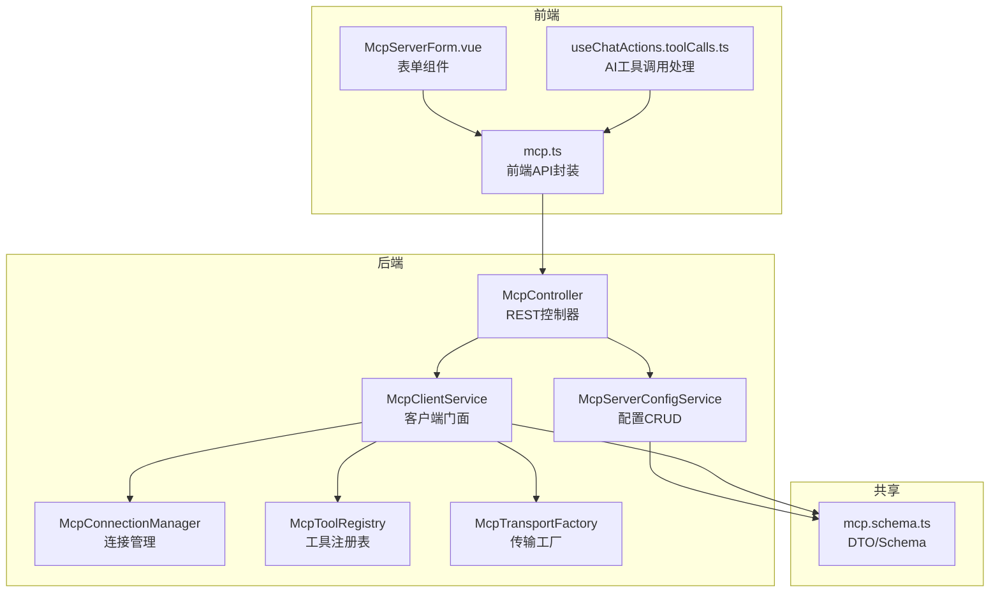
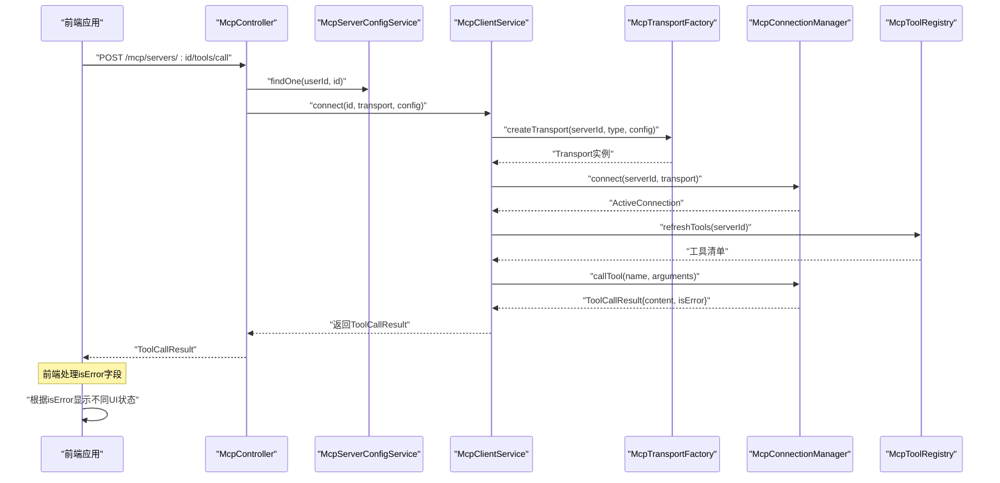
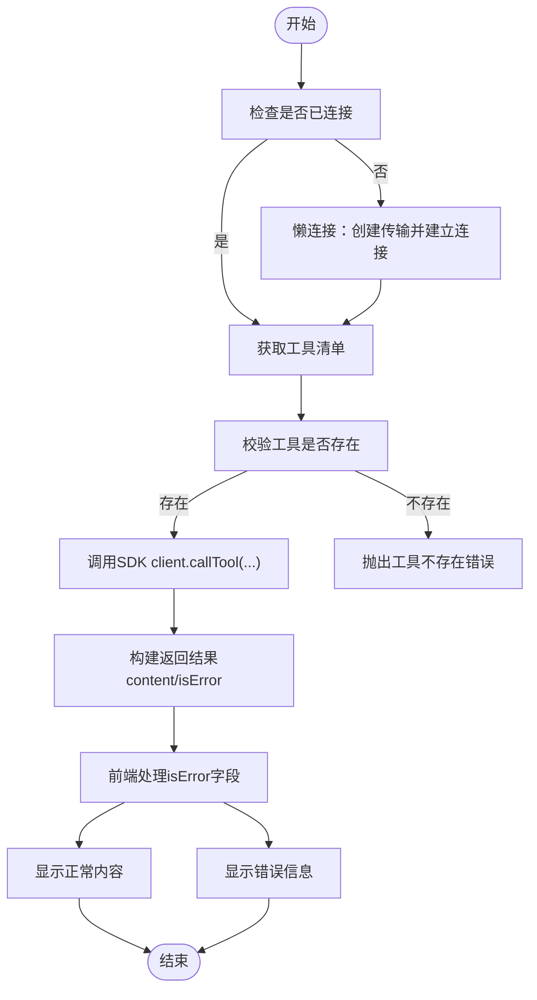
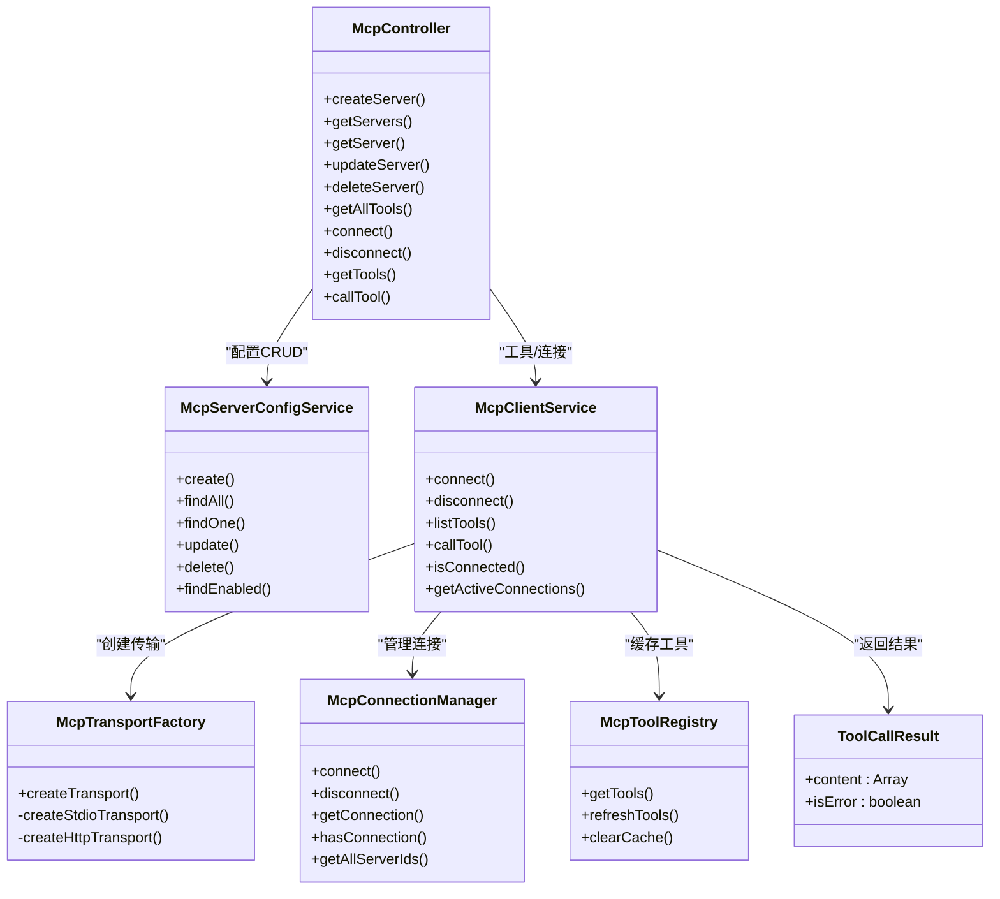

# MCP工具API

<cite>
**本文引用的文件**
- [apps/backend/src/mcp/mcp.controller.ts](file://apps/backend/src/mcp/mcp.controller.ts)
- [apps/backend/src/mcp/mcp.dto.ts](file://apps/backend/src/mcp/mcp.dto.ts)
- [apps/backend/src/mcp/mcp.module.ts](file://apps/backend/src/mcp/mcp.module.ts)
- [apps/backend/src/mcp/mcp-client.service.ts](file://apps/backend/src/mcp/mcp-client.service.ts)
- [apps/backend/src/mcp/mcp-server-config.service.ts](file://apps/backend/src/mcp/mcp-server-config.service.ts)
- [apps/backend/src/mcp/core/mcp-transport.factory.ts](file://apps/backend/src/mcp/core/mcp-transport.factory.ts)
- [apps/backend/src/mcp/core/mcp-connection.manager.ts](file://apps/backend/src/mcp/core/mcp-connection.manager.ts)
- [apps/backend/src/mcp/core/mcp-tool.registry.ts](file://apps/backend/src/mcp/core/mcp-tool.registry.ts)
- [packages/shared/src/schemas/mcp.schema.ts](file://packages/shared/src/schemas/mcp.schema.ts)
- [apps/backend/src/common/index.ts](file://apps/backend/src/common/index.ts)
- [apps/frontend/src/features/mcp/api/mcp.ts](file://apps/frontend/src/features/mcp/api/mcp.ts)
- [apps/frontend/src/features/mcp/components/McpServerForm.vue](file://apps/frontend/src/features/mcp/components/McpServerForm.vue)
- [apps/frontend/src/features/mcp/components/mcpServerForm.types.ts](file://apps/frontend/src/features/mcp/components/mcpServerForm.types.ts)
- [apps/frontend/src/features/ai/composables/useChatActions.toolCalls.ts](file://apps/frontend/src/features/ai/composables/useChatActions.toolCalls.ts)
- [apps/backend/tests/mcp/mcp-client.service.spec.ts](file://apps/backend/tests/mcp/mcp-client.service.spec.ts)
</cite>

## 更新摘要

**变更内容**

- 更新ToolCallResult类型定义，新增isError字段
- 增强前端工具调用的错误处理逻辑
- 完善后端工具调用结果的错误状态处理
- 新增工具调用错误处理的最佳实践指导

## 目录

1. [简介](#简介)
2. [项目结构](#项目结构)
3. [核心组件](#核心组件)
4. [架构总览](#架构总览)
5. [详细组件分析](#详细组件分析)
6. [依赖关系分析](#依赖关系分析)
7. [性能考量](#性能考量)
8. [故障排查指南](#故障排查指南)
9. [结论](#结论)
10. [附录](#附录)

## 简介

本文件为 Model Context Protocol（MCP）工具模块的REST API文档，覆盖MCP服务器配置、工具发现、连接管理、工具调用等接口。文档同时说明MCP客户端与后端服务的交互流程、数据格式、安全限制、连接状态管理与错误处理机制，并提供HTTP与STDIO两种传输方式的配置示例及最佳实践。

**更新** 本次更新反映了ToolCallResult类型新增isError字段的重要变更，增强了工具调用的错误处理能力和前端调用的健壮性。

## 项目结构

MCP功能由后端NestJS模块提供REST接口与内部服务，前端Vue组件负责表单与调用展示。共享Schema定义了DTO与数据模型，确保前后端一致的数据契约。

**图表来源**

- [apps/backend/src/mcp/mcp.controller.ts:39-208](file://apps/backend/src/mcp/mcp.controller.ts#L39-L208)
- [apps/backend/src/mcp/mcp-client.service.ts:17-123](file://apps/backend/src/mcp/mcp-client.service.ts#L17-L123)
- [apps/backend/src/mcp/mcp-server-config.service.ts:9-155](file://apps/backend/src/mcp/mcp-server-config.service.ts#L9-L155)
- [apps/backend/src/mcp/core/mcp-connection.manager.ts:12-100](file://apps/backend/src/mcp/core/mcp-connection.manager.ts#L12-L100)
- [apps/backend/src/mcp/core/mcp-tool.registry.ts:5-47](file://apps/backend/src/mcp/core/mcp-tool.registry.ts#L5-L47)
- [apps/backend/src/mcp/core/mcp-transport.factory.ts:9-219](file://apps/backend/src/mcp/core/mcp-transport.factory.ts#L9-L219)
- [packages/shared/src/schemas/mcp.schema.ts:1-220](file://packages/shared/src/schemas/mcp.schema.ts#L1-L220)
- [apps/frontend/src/features/mcp/api/mcp.ts:16-107](file://apps/frontend/src/features/mcp/api/mcp.ts#L16-L107)
- [apps/frontend/src/features/mcp/components/McpServerForm.vue:1-188](file://apps/frontend/src/features/mcp/components/McpServerForm.vue#L1-L188)
- [apps/frontend/src/features/ai/composables/useChatActions.toolCalls.ts:140-182](file://apps/frontend/src/features/ai/composables/useChatActions.toolCalls.ts#L140-L182)

**章节来源**

- [apps/backend/src/mcp/mcp.module.ts:9-24](file://apps/backend/src/mcp/mcp.module.ts#L9-L24)
- [apps/backend/src/mcp/mcp.controller.ts:39-208](file://apps/backend/src/mcp/mcp.controller.ts#L39-L208)
- [apps/backend/src/mcp/mcp-client.service.ts:17-123](file://apps/backend/src/mcp/mcp-client.service.ts#L17-L123)
- [apps/backend/src/mcp/mcp-server-config.service.ts:9-155](file://apps/backend/src/mcp/mcp-server-config.service.ts#L9-L155)
- [apps/backend/src/mcp/core/mcp-connection.manager.ts:12-100](file://apps/backend/src/mcp/core/mcp-connection.manager.ts#L12-L100)
- [apps/backend/src/mcp/core/mcp-tool.registry.ts:5-47](file://apps/backend/src/mcp/core/mcp-tool.registry.ts#L5-L47)
- [apps/backend/src/mcp/core/mcp-transport.factory.ts:9-219](file://apps/backend/src/mcp/core/mcp-transport.factory.ts#L9-L219)
- [packages/shared/src/schemas/mcp.schema.ts:1-220](file://packages/shared/src/schemas/mcp.schema.ts#L1-L220)
- [apps/frontend/src/features/mcp/api/mcp.ts:16-107](file://apps/frontend/src/features/mcp/api/mcp.ts#L16-L107)
- [apps/frontend/src/features/mcp/components/McpServerForm.vue:1-188](file://apps/frontend/src/features/mcp/components/McpServerForm.vue#L1-L188)
- [apps/frontend/src/features/ai/composables/useChatActions.toolCalls.ts:140-182](file://apps/frontend/src/features/ai/composables/useChatActions.toolCalls.ts#L140-L182)

## 核心组件

- REST控制器：提供MCP服务器配置、工具发现、连接/断开、工具调用等HTTP接口。
- 配置服务：负责用户维度的MCP服务器配置CRUD与权限校验。
- 客户端服务：统一门面，协调传输工厂、连接管理与工具注册表。
- 连接管理：维护活跃连接，处理连接生命周期与错误事件。
- 工具注册表：缓存工具清单，支持刷新与清理。
- 传输工厂：根据传输类型创建STDIO或HTTP传输，内置安全检查与环境控制。
- 共享Schema：定义DTO、传输配置、工具响应与调用结果的数据结构与校验规则。
- 前端API：封装HTTP请求，提供工具发现、连接、调用等方法。
- 前端表单：可视化配置STDIO/HTTP传输参数，生成后端可接受的DTO。
- AI工具调用处理器：增强的工具调用处理逻辑，支持isError字段的错误状态判断。

**更新** 新增AI工具调用处理器组件，专门处理工具调用结果的错误状态判断和前端显示逻辑。

**章节来源**

- [apps/backend/src/mcp/mcp.controller.ts:40-208](file://apps/backend/src/mcp/mcp.controller.ts#L40-L208)
- [apps/backend/src/mcp/mcp-server-config.service.ts:10-155](file://apps/backend/src/mcp/mcp-server-config.service.ts#L10-L155)
- [apps/backend/src/mcp/mcp-client.service.ts:17-123](file://apps/backend/src/mcp/mcp-client.service.ts#L17-L123)
- [apps/backend/src/mcp/core/mcp-connection.manager.ts:12-100](file://apps/backend/src/mcp/core/mcp-connection.manager.ts#L12-L100)
- [apps/backend/src/mcp/core/mcp-tool.registry.ts:5-47](file://apps/backend/src/mcp/core/mcp-tool.registry.ts#L5-L47)
- [apps/backend/src/mcp/core/mcp-transport.factory.ts:9-219](file://apps/backend/src/mcp/core/mcp-transport.factory.ts#L9-L219)
- [packages/shared/src/schemas/mcp.schema.ts:1-220](file://packages/shared/src/schemas/mcp.schema.ts#L1-L220)
- [apps/frontend/src/features/mcp/api/mcp.ts:16-107](file://apps/frontend/src/features/mcp/api/mcp.ts#L16-L107)
- [apps/frontend/src/features/mcp/components/McpServerForm.vue:1-188](file://apps/frontend/src/features/mcp/components/McpServerForm.vue#L1-L188)
- [apps/frontend/src/features/ai/composables/useChatActions.toolCalls.ts:140-182](file://apps/frontend/src/features/ai/composables/useChatActions.toolCalls.ts#L140-L182)

## 架构总览

下图展示了MCP工具API从HTTP请求到SDK调用的全链路，包括新增的错误处理机制：

**更新** 新增了ToolCallResult的错误状态处理流程，前端根据isError字段决定显示正常内容还是错误信息。

**图表来源**

- [apps/backend/src/mcp/mcp.controller.ts:190-207](file://apps/backend/src/mcp/mcp.controller.ts#L190-L207)
- [apps/backend/src/mcp/mcp-client.service.ts:73-122](file://apps/backend/src/mcp/mcp-client.service.ts#L73-L122)
- [apps/backend/src/mcp/core/mcp-transport.factory.ts:112-126](file://apps/backend/src/mcp/core/mcp-transport.factory.ts#L112-L126)
- [apps/backend/src/mcp/core/mcp-connection.manager.ts:23-73](file://apps/backend/src/mcp/core/mcp-connection.manager.ts#L23-L73)
- [apps/backend/src/mcp/core/mcp-tool.registry.ts:20-42](file://apps/backend/src/mcp/core/mcp-tool.registry.ts#L20-L42)
- [apps/frontend/src/features/ai/composables/useChatActions.toolCalls.ts:143-167](file://apps/frontend/src/features/ai/composables/useChatActions.toolCalls.ts#L143-L167)

## 详细组件分析

### REST API定义与行为

- 认证与授权
  - 使用JWT守卫保护所有MCP接口，要求Bearer Token。
  - 所有操作均进行"用户拥有者"校验，防止越权访问。
- 限流策略
  - 连接、工具发现、工具调用分别配置独立节流阈值，避免滥用。
- 接口概览
  - 服务器配置
    - POST /mcp/servers：创建服务器配置
    - GET /mcp/servers：获取当前用户全部配置
    - GET /mcp/servers/:id：按ID获取配置 - PUT /mcp/servers/:id：更新配置 - DELETE /mcp/servers/:id：删除配置（先断开连接再删除）
  - 连接管理
    - POST /mcp/servers/:id/connect：连接到指定服务器（懒连接）
    - POST /mcp/servers/:id/disconnect：断开连接
  - 工具发现与调用
    - GET /mcp/tools：获取所有启用服务器的工具清单（懒连接）
    - GET /mcp/servers/:id/tools：获取指定服务器工具清单
    - POST /mcp/servers/:id/tools/call：调用工具，返回ToolCallResult

**更新** 工具调用接口现在返回ToolCallResult类型，包含content和isError字段。

**章节来源**

- [apps/backend/src/mcp/mcp.controller.ts:48-208](file://apps/backend/src/mcp/mcp.controller.ts#L48-L208)
- [apps/backend/src/common/index.ts:8-9](file://apps/backend/src/common/index.ts#L8-L9)

### 数据模型与传输配置

- 传输类型
  - STDIO：本地进程通信，支持命令、参数、工作目录、环境变量、受限环境变量白名单。
  - HTTP：基于StreamableHTTP客户端，支持URL、请求头、认证（Bearer/OAuth/ApiKey）。
- 安全限制
  - STDIO在生产环境默认禁用，需显式允许特定命令；禁止空格命令；包名自动纠错。
  - HTTP仅允许公共地址（非localhost、.local、私网IP），并进行DNS解析校验。
- 请求/响应模型
  - 服务器配置：名称、描述、传输类型、配置对象、启用状态、时间戳。
  - 工具响应：名称、描述、输入Schema。
  - 工具调用结果：content数组（含type/text/data/mimeType等字段）、isError布尔值。

**更新** ToolCallResult类型现在包含isError字段，用于标识工具调用是否出现错误状态。

- ToolCallResult类型定义
  - content：工具调用的返回内容数组，每个元素包含type、text、data、mimeType等字段
  - isError：布尔值，指示工具调用是否发生错误

**章节来源**

- [packages/shared/src/schemas/mcp.schema.ts:6-119](file://packages/shared/src/schemas/mcp.schema.ts#L6-L119)
- [packages/shared/src/schemas/mcp.schema.ts:291-303](file://packages/shared/src/schemas/mcp.schema.ts#L291-L303)
- [apps/backend/src/mcp/core/mcp-transport.factory.ts:91-110](file://apps/backend/src/mcp/core/mcp-transport.factory.ts#L91-L110)
- [apps/backend/src/mcp/core/mcp-transport.factory.ts:128-188](file://apps/backend/src/mcp/core/mcp-transport.factory.ts#L128-L188)
- [apps/backend/src/mcp/core/mcp-transport.factory.ts:190-218](file://apps/backend/src/mcp/core/mcp-transport.factory.ts#L190-L218)
- [apps/backend/src/mcp/mcp.dto.ts:35-59](file://apps/backend/src/mcp/mcp.dto.ts#L35-L59)

### 连接状态管理与错误处理

- 连接状态
  - 通过连接管理器维护serverId到ActiveConnection映射。
  - 断开时清理注册表缓存，避免脏数据。
- 错误处理
  - 未连接调用工具抛出明确错误。
  - 工具不存在时提示找不到工具。
  - 传输工厂对STDIO/HTTP分别进行安全校验与异常抛出。
  - 控制器层捕获异常并记录日志，保证接口稳定性。
  - **新增** ToolCallResult包含isError字段，后端将其转换为布尔值返回给前端。

**更新** 增强了错误处理机制，新增isError字段用于明确标识工具调用的错误状态。

**章节来源**

- [apps/backend/src/mcp/core/mcp-connection.manager.ts:12-100](file://apps/backend/src/mcp/core/mcp-connection.manager.ts#L12-L100)
- [apps/backend/src/mcp/core/mcp-tool.registry.ts:44-46](file://apps/backend/src/mcp/core/mcp-tool.registry.ts#L44-L46)
- [apps/backend/src/mcp/mcp-client.service.ts:74-108](file://apps/backend/src/mcp/mcp-client.service.ts#L74-L108)
- [apps/backend/src/mcp/core/mcp-transport.factory.ts:67-89](file://apps/backend/src/mcp/core/mcp-transport.factory.ts#L67-L89)
- [apps/backend/src/mcp/mcp-client.service.ts:112-115](file://apps/backend/src/mcp/mcp-client.service.ts#L112-L115)

### 工具调用流程

**更新** 新增了前端处理isError字段的流程，根据错误状态显示不同的UI反馈。

**图表来源**

- [apps/backend/src/mcp/mcp.controller.ts:187-207](file://apps/backend/src/mcp/mcp.controller.ts#L187-L207)
- [apps/backend/src/mcp/mcp-client.service.ts:67-108](file://apps/backend/src/mcp/mcp-client.service.ts#L67-L108)
- [apps/frontend/src/features/ai/composables/useChatActions.toolCalls.ts:143-167](file://apps/frontend/src/features/ai/composables/useChatActions.toolCalls.ts#L143-L167)

### HTTP与STDIO传输配置示例

- HTTP传输
  - 必填：url（必须为http/https且为公共地址）
  - 可选：headers、auth（type=bearer/oauth/api_key，token/apiKey及其头部键）
- STDIO传输
  - 必填：command（不可包含空格，建议通过args传参）
  - 可选：args、env、cwd
  - 生产环境需配置MCP_ENABLE_STDIO=true或MCP_STDIO_ALLOWED_COMMANDS
  - 包名自动纠错：如检测到旧包名则自动替换为目标包名

**章节来源**

- [packages/shared/src/schemas/mcp.schema.ts:99-118](file://packages/shared/src/schemas/mcp.schema.ts#L99-L118)
- [packages/shared/src/schemas/mcp.schema.ts:77-86](file://packages/shared/src/schemas/mcp.schema.ts#L77-L86)
- [apps/backend/src/mcp/core/mcp-transport.factory.ts:128-188](file://apps/backend/src/mcp/core/mcp-transport.factory.ts#L128-L188)
- [apps/backend/src/mcp/core/mcp-transport.factory.ts:190-218](file://apps/backend/src/mcp/core/mcp-transport.factory.ts#L190-L218)
- [apps/frontend/src/features/mcp/components/McpServerForm.vue:100-135](file://apps/frontend/src/features/mcp/components/McpServerForm.vue#L100-L135)

### 前端集成与最佳实践

- 前端API封装
  - 提供获取/创建/更新/删除服务器配置、连接/断开、工具发现、工具调用等方法。
  - 对工具调用设置较长超时，对连接设置更长超时以应对冷启动。
- 表单组件
  - 统一的MCP服务器配置表单，支持STDIO与HTTP切换。
  - 自动处理认证类型与头部字段。
- AI工具调用增强处理
  - **新增** 检查ToolCallResult.isError字段，区分正常结果和错误状态
  - 当isError为true时，前端显示MCP工具错误信息而非正常内容
  - 提供详细的错误日志记录和用户友好的错误提示
- 最佳实践
  - 启用服务器优先使用HTTP传输，便于网络隔离与可观测性。
  - 生产环境严格配置STDIO命令白名单，避免任意命令执行。
  - 工具调用前先懒连接，减少不必要的阻塞。
  - 使用工具注册表缓存，降低重复查询成本。
  - **新增** 在AI对话中正确处理工具调用的错误状态，提供良好的用户体验。

**更新** 新增了AI工具调用的错误处理最佳实践，强调isError字段的重要性。

**章节来源**

- [apps/frontend/src/features/mcp/api/mcp.ts:16-107](file://apps/frontend/src/features/mcp/api/mcp.ts#L16-L107)
- [apps/frontend/src/features/mcp/components/McpServerForm.vue:1-188](file://apps/frontend/src/features/mcp/components/McpServerForm.vue#L1-L188)
- [apps/frontend/src/features/mcp/components/mcpServerForm.types.ts:1-25](file://apps/frontend/src/features/mcp/components/mcpServerForm.types.ts#L1-L25)
- [apps/frontend/src/features/ai/composables/useChatActions.toolCalls.ts:143-167](file://apps/frontend/src/features/ai/composables/useChatActions.toolCalls.ts#L143-L167)

## 依赖关系分析

**更新** 新增了ToolCallResult类的依赖关系，体现了其在系统中的重要地位。

**图表来源**

- [apps/backend/src/mcp/mcp.controller.ts:40-208](file://apps/backend/src/mcp/mcp.controller.ts#L40-L208)
- [apps/backend/src/mcp/mcp-server-config.service.ts:9-155](file://apps/backend/src/mcp/mcp-server-config.service.ts#L9-L155)
- [apps/backend/src/mcp/mcp-client.service.ts:17-123](file://apps/backend/src/mcp/mcp-client.service.ts#L17-L123)
- [apps/backend/src/mcp/core/mcp-transport.factory.ts:9-219](file://apps/backend/src/mcp/core/mcp-transport.factory.ts#L9-L219)
- [apps/backend/src/mcp/core/mcp-connection.manager.ts:12-100](file://apps/backend/src/mcp/core/mcp-connection.manager.ts#L12-L100)
- [apps/backend/src/mcp/core/mcp-tool.registry.ts:5-47](file://apps/backend/src/mcp/core/mcp-tool.registry.ts#L5-L47)
- [packages/shared/src/schemas/mcp.schema.ts:291-303](file://packages/shared/src/schemas/mcp.schema.ts#L291-L303)

**章节来源**

- [apps/backend/src/mcp/mcp.module.ts:9-24](file://apps/backend/src/mcp/mcp.module.ts#L9-L24)

## 性能考量

- 连接懒加载：工具发现与调用前才建立连接，减少资源占用。
- 工具缓存：工具注册表缓存工具清单，避免重复RPC调用。
- 超时设置：连接与工具调用分别设置合理超时，平衡可用性与可靠性。
- 限流：对连接、工具发现、工具调用分别限流，防止滥用。
- **新增** 错误状态快速判断：isError字段使前端能够快速识别错误状态，避免不必要的内容解析。

**更新** 新增了isError字段对性能的积极影响，提高了错误处理的效率。

**章节来源**

- [apps/backend/src/mcp/mcp.controller.ts:112-136](file://apps/backend/src/mcp/mcp.controller.ts#L112-L136)
- [apps/backend/src/mcp/mcp.controller.ts:187-207](file://apps/backend/src/mcp/mcp.controller.ts#L187-L207)
- [apps/backend/src/mcp/core/mcp-tool.registry.ts:12-18](file://apps/backend/src/mcp/core/mcp-tool.registry.ts#L12-L18)
- [apps/frontend/src/features/mcp/api/mcp.ts:62-82](file://apps/frontend/src/features/mcp/api/mcp.ts#L62-L82)
- [apps/frontend/src/features/ai/composables/useChatActions.toolCalls.ts:146-154](file://apps/frontend/src/features/ai/composables/useChatActions.toolCalls.ts#L146-L154)

## 故障排查指南

- "未连接到MCP服务器"
  - 现象：调用工具时报错。
  - 处理：先调用连接接口或等待懒连接自动建立。
- "工具不存在"
  - 现象：指定工具名无法找到。
  - 处理：确认工具清单已刷新，或检查工具名拼写。
- "STDIO命令未被允许"
  - 现象：生产环境报错。
  - 处理：设置MCP_ENABLE_STDIO=true或配置MCP_STDIO_ALLOWED_COMMANDS白名单。
- "HTTP主机被阻止"
  - 现象：连接失败。
  - 处理：确认URL为公网地址，避免localhost、.local或私网IP。
- "连接关闭/传输错误"
  - 现象：stderr日志或onclose事件。
  - 处理：检查远端进程状态、网络连通性与超时设置。
- **新增** "工具调用返回错误状态"
  - 现象：工具调用成功但isError为true。
  - 处理：检查后端工具实现，确认错误状态的正确设置；前端应显示错误信息而非正常内容。

**更新** 新增了工具调用错误状态的故障排查指南，帮助开发者快速定位问题。

**章节来源**

- [apps/backend/src/mcp/mcp-client.service.ts:74-108](file://apps/backend/src/mcp/mcp-client.service.ts#L74-L108)
- [apps/backend/src/mcp/core/mcp-connection.manager.ts:44-58](file://apps/backend/src/mcp/core/mcp-connection.manager.ts#L44-L58)
- [apps/backend/src/mcp/core/mcp-transport.factory.ts:67-89](file://apps/backend/src/mcp/core/mcp-transport.factory.ts#L67-L89)
- [apps/backend/src/mcp/core/mcp-transport.factory.ts:91-110](file://apps/backend/src/mcp/core/mcp-transport.factory.ts#L91-L110)
- [apps/frontend/src/features/ai/composables/useChatActions.toolCalls.ts:146-151](file://apps/frontend/src/features/ai/composables/useChatActions.toolCalls.ts#L146-L151)

## 结论

该MCP工具API通过清晰的分层设计与严格的传输安全策略，提供了稳定、可扩展的外部工具集成能力。结合懒连接、工具缓存与限流机制，既保障了用户体验，也兼顾了系统安全与性能。

**更新** 最新版本增强了工具调用的错误处理能力，ToolCallResult的isError字段为开发者提供了更精确的错误状态反馈，前端能够根据错误状态提供更好的用户体验。

建议在生产环境中严格配置STDIO白名单与HTTP可达性，并充分利用工具缓存与连接复用以提升整体效率。同时，建议在AI对话场景中正确处理工具调用的错误状态，为用户提供清晰的错误提示。

## 附录

### 接口一览（摘要）

- 服务器配置
  - POST /mcp/servers：创建
  - GET /mcp/servers：列表
  - GET /mcp/servers/:id：详情
  - PUT /mcp/servers/:id：更新
  - DELETE /mcp/servers/:id：删除（先断开）
- 连接管理
  - POST /mcp/servers/:id/connect：连接
  - POST /mcp/servers/:id/disconnect：断开
- 工具发现与调用
  - GET /mcp/tools：所有启用服务器的工具
  - GET /mcp/servers/:id/tools：指定服务器工具
  - POST /mcp/servers/:id/tools/call：调用工具，返回ToolCallResult

**更新** 工具调用接口现在返回ToolCallResult类型，包含错误状态信息。

**章节来源**

- [apps/backend/src/mcp/mcp.controller.ts:48-207](file://apps/backend/src/mcp/mcp.controller.ts#L48-L207)

### 前端调用示例（路径参考）

- 获取服务器列表：[apps/frontend/src/features/mcp/api/mcp.ts:20-23](file://apps/frontend/src/features/mcp/api/mcp.ts#L20-L23)
- 连接服务器：[apps/frontend/src/features/mcp/api/mcp.ts:89-91](file://apps/frontend/src/features/mcp/api/mcp.ts#L89-L91)
- 调用工具：[apps/frontend/src/features/mcp/api/mcp.ts:70-84](file://apps/frontend/src/features/mcp/api/mcp.ts#L70-L84)
- AI工具调用错误处理：[apps/frontend/src/features/ai/composables/useChatActions.toolCalls.ts:143-167](file://apps/frontend/src/features/ai/composables/useChatActions.toolCalls.ts#L143-L167)

**更新** 新增了AI工具调用错误处理的示例路径。

**章节来源**

- [apps/frontend/src/features/mcp/api/mcp.ts:16-107](file://apps/frontend/src/features/mcp/api/mcp.ts#L16-L107)
- [apps/frontend/src/features/ai/composables/useChatActions.toolCalls.ts:143-167](file://apps/frontend/src/features/ai/composables/useChatActions.toolCalls.ts#L143-L167)

### 单元测试参考（路径参考）

- 客户端服务行为：[apps/backend/tests/mcp/mcp-client.service.spec.ts:72-142](file://apps/backend/tests/mcp/mcp-client.service.spec.ts#L72-L142)
- ToolCallResult错误状态测试：[apps/backend/tests/mcp/mcp-client.service.spec.ts:102-116](file://apps/backend/tests/mcp/mcp-client.service.spec.ts#L102-L116)

**更新** 新增了ToolCallResult错误状态的单元测试参考。

**章节来源**

- [apps/backend/tests/mcp/mcp-client.service.spec.ts:10-144](file://apps/backend/tests/mcp/mcp-client.service.spec.ts#L10-L144)

### ToolCallResult类型定义

ToolCallResult是MCP工具调用的核心返回类型，包含以下字段：

- content：工具调用的返回内容数组
  - 每个元素包含type、text、data、mimeType等字段
  - 支持多种内容格式（文本、数据、二进制等）
- isError：布尔值，指示工具调用是否发生错误
  - true：工具调用返回错误状态
  - false：工具调用成功返回正常内容

**章节来源**

- [packages/shared/src/schemas/mcp.schema.ts:291-303](file://packages/shared/src/schemas/mcp.schema.ts#L291-L303)
- [apps/backend/src/mcp/mcp-client.service.ts:112-115](file://apps/backend/src/mcp/mcp-client.service.ts#L112-L115)
- [apps/frontend/src/features/ai/composables/useChatActions.toolCalls.ts:146-154](file://apps/frontend/src/features/ai/composables/useChatActions.toolCalls.ts#L146-L154)
