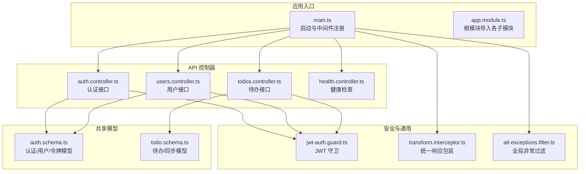
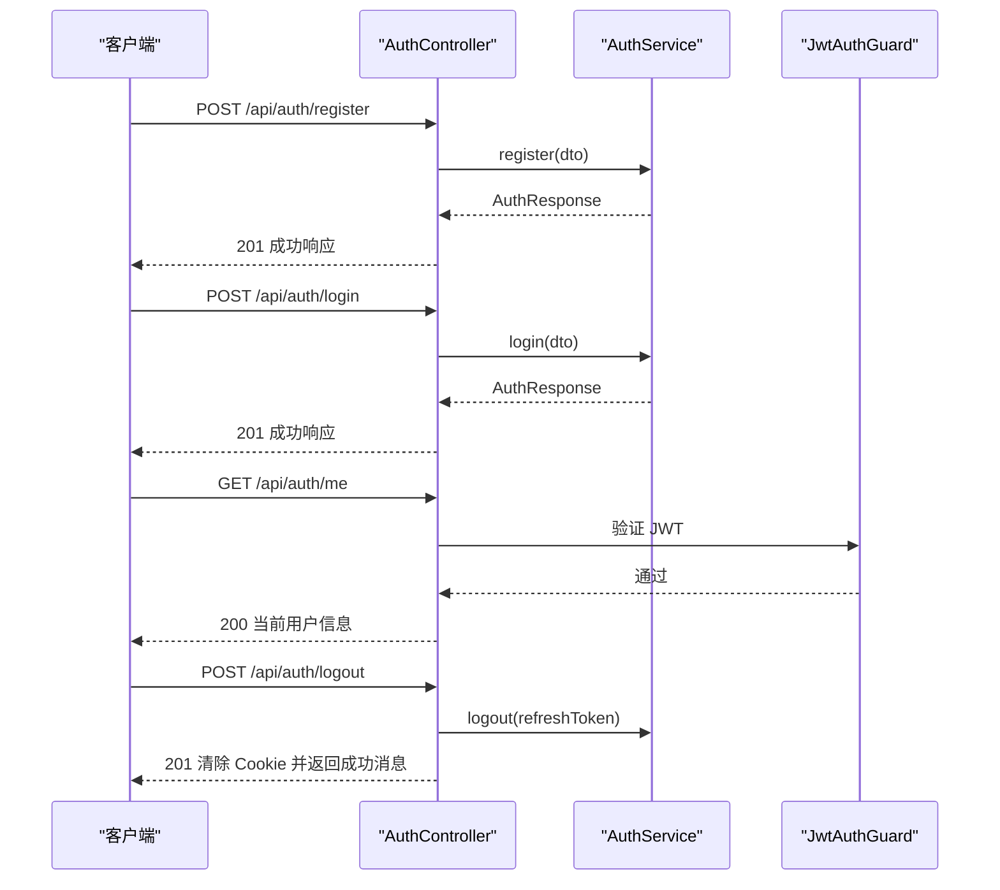
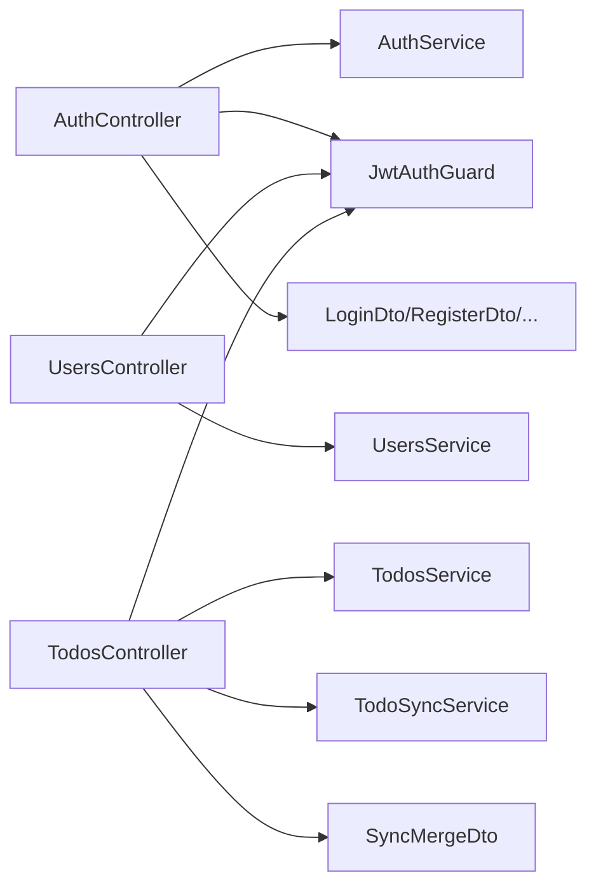

# REST API

<cite>
**本文引用的文件**
- [apps/backend/src/main.ts](file://apps/backend/src/main.ts)
- [apps/backend/src/app.module.ts](file://apps/backend/src/app.module.ts)
- [apps/backend/src/auth/auth.controller.ts](file://apps/backend/src/auth/auth.controller.ts)
- [apps/backend/src/auth/auth.dto.ts](file://apps/backend/src/auth/auth.dto.ts)
- [apps/backend/src/auth/jwt-auth.guard.ts](file://apps/backend/src/auth/jwt-auth.guard.ts)
- [apps/backend/src/todos/todos.controller.ts](file://apps/backend/src/todos/todos.controller.ts)
- [apps/backend/src/todos/todos.dto.ts](file://apps/backend/src/todos/todos.dto.ts)
- [apps/backend/src/users/users.controller.ts](file://apps/backend/src/users/users.controller.ts)
- [apps/backend/src/common/interceptors/transform.interceptor.ts](file://apps/backend/src/common/interceptors/transform.interceptor.ts)
- [apps/backend/src/common/filters/all-exceptions.filter.ts](file://apps/backend/src/common/filters/all-exceptions.filter.ts)
- [apps/backend/src/health/health.controller.ts](file://apps/backend/src/health/health.controller.ts)
- [packages/shared/src/schemas/auth.schema.ts](file://packages/shared/src/schemas/auth.schema.ts)
- [packages/shared/src/schemas/todo.schema.ts](file://packages/shared/src/schemas/todo.schema.ts)
- [apps/backend/tests/e2e/auth.e2e.spec.ts](file://apps/backend/tests/e2e/auth.e2e.spec.ts)
- [apps/backend/tests/e2e/todos.e2e.spec.ts](file://apps/backend/tests/e2e/todos.e2e.spec.ts)
</cite>

## 目录
1. [简介](#简介)
2. [项目结构](#项目结构)
3. [核心组件](#核心组件)
4. [架构总览](#架构总览)
5. [详细组件分析](#详细组件分析)
6. [依赖分析](#依赖分析)
7. [性能考虑](#性能考虑)
8. [故障排除指南](#故障排除指南)
9. [结论](#结论)
10. [附录](#附录)

## 简介
本文件为 Lumina Todo 后端 REST API 的权威文档，覆盖认证、用户、待办事项等模块的完整接口规范。文档包含：
- 所有端点的 URL 路径、HTTP 方法、请求参数、查询字符串、请求体格式与响应结构
- 成功与失败场景的请求/响应示例（通过测试用例路径引用）
- HTTP 状态码及含义说明（200、400、401、403、404、500 等）
- 认证机制（JWT 令牌）与请求头要求
- 数据验证规则与错误响应格式
- 分页、排序、过滤等通用查询参数的使用说明

## 项目结构
后端基于 NestJS + Fastify 构建，采用模块化组织，主要模块包括认证、用户、待办事项、健康检查、静态资源、安全中间件与全局拦截器/过滤器。

图表来源
- [apps/backend/src/main.ts:34-211](file://apps/backend/src/main.ts#L34-L211)
- [apps/backend/src/app.module.ts:28-159](file://apps/backend/src/app.module.ts#L28-L159)
- [apps/backend/src/auth/auth.controller.ts:15-81](file://apps/backend/src/auth/auth.controller.ts#L15-L81)
- [apps/backend/src/users/users.controller.ts:26-135](file://apps/backend/src/users/users.controller.ts#L26-L135)
- [apps/backend/src/todos/todos.controller.ts:20-70](file://apps/backend/src/todos/todos.controller.ts#L20-L70)
- [apps/backend/src/health/health.controller.ts:18-80](file://apps/backend/src/health/health.controller.ts#L18-L80)
- [apps/backend/src/auth/jwt-auth.guard.ts:1-10](file://apps/backend/src/auth/jwt-auth.guard.ts#L1-L10)
- [apps/backend/src/common/interceptors/transform.interceptor.ts:18-30](file://apps/backend/src/common/interceptors/transform.interceptor.ts#L18-L30)
- [apps/backend/src/common/filters/all-exceptions.filter.ts:16-137](file://apps/backend/src/common/filters/all-exceptions.filter.ts#L16-L137)
- [packages/shared/src/schemas/auth.schema.ts:1-121](file://packages/shared/src/schemas/auth.schema.ts#L1-L121)
- [packages/shared/src/schemas/todo.schema.ts:1-76](file://packages/shared/src/schemas/todo.schema.ts#L1-L76)

章节来源
- [apps/backend/src/main.ts:34-211](file://apps/backend/src/main.ts#L34-L211)
- [apps/backend/src/app.module.ts:28-159](file://apps/backend/src/app.module.ts#L28-L159)

## 核心组件
- 全局响应包装拦截器：将所有成功响应统一包装为包含 success、data、timestamp 的结构化对象。
- 全局异常过滤器：统一处理 HTTP 异常与 Zod 验证异常，返回包含 success、data、message、errors、statusCode、timestamp 的错误响应。
- CSRF 与安全中间件：对非 GET 请求强制要求 X-Requested-With 头；启用 Helmet、压缩、静态资源等。
- Swagger 文档：自动生成 OpenAPI 文档，包含 Bearer 认证配置。

章节来源
- [apps/backend/src/common/interceptors/transform.interceptor.ts:18-30](file://apps/backend/src/common/interceptors/transform.interceptor.ts#L18-L30)
- [apps/backend/src/common/filters/all-exceptions.filter.ts:16-137](file://apps/backend/src/common/filters/all-exceptions.filter.ts#L16-L137)
- [apps/backend/src/main.ts:48-132](file://apps/backend/src/main.ts#L48-L132)
- [apps/backend/src/main.ts:181-191](file://apps/backend/src/main.ts#L181-L191)

## 架构总览
以下序列图展示了认证流程的关键步骤与安全校验：

图表来源
- [apps/backend/src/auth/auth.controller.ts:15-81](file://apps/backend/src/auth/auth.controller.ts#L15-L81)
- [apps/backend/src/auth/jwt-auth.guard.ts:1-10](file://apps/backend/src/auth/jwt-auth.guard.ts#L1-L10)
- [apps/backend/src/auth/auth.dto.ts:15-41](file://apps/backend/src/auth/auth.dto.ts#L15-L41)
- [packages/shared/src/schemas/auth.schema.ts:69-95](file://packages/shared/src/schemas/auth.schema.ts#L69-L95)

## 详细组件分析

### 认证模块（/api/auth）
- 全局前缀：/api
- 认证方式：Bearer Token（Authorization: Bearer <accessToken>）
- CSRF 保护：非 GET 请求必须携带 X-Requested-With: XMLHttpRequest
- 速率限制：针对登录、注册、刷新分别配置独立策略（见 e2e 测试）

端点一览
- POST /api/auth/login
  - 功能：用户登录，返回 accessToken、refreshToken、user
  - 请求体：LoginDto（email、password）
  - 成功响应：201
  - 失败响应：401（凭据无效）
  - 示例参考：[apps/backend/tests/e2e/auth.e2e.spec.ts:104-115](file://apps/backend/tests/e2e/auth.e2e.spec.ts#L104-L115)

- POST /api/auth/register
  - 功能：用户注册，返回 accessToken、refreshToken、user
  - 请求体：RegisterDto（email、name、password）
  - 成功响应：201
  - 失败响应：400（验证失败或业务冲突）、429（频繁请求）
  - 示例参考：[apps/backend/tests/e2e/auth.e2e.spec.ts:65-78](file://apps/backend/tests/e2e/auth.e2e.spec.ts#L65-L78)

- POST /api/auth/refresh
  - 功能：使用 refreshToken 刷新 accessToken
  - 请求体：RefreshTokenDto（refreshToken）
  - 成功响应：201
  - 失败响应：401（令牌无效/已注销）
  - 示例参考：[apps/backend/tests/e2e/auth.e2e.spec.ts:116-125](file://apps/backend/tests/e2e/auth.e2e.spec.ts#L116-L125)

- GET /api/auth/me
  - 功能：获取当前登录用户信息
  - 请求头：Authorization: Bearer <accessToken>
  - 成功响应：200
  - 失败响应：401（未认证/令牌过期）
  - 示例参考：[apps/backend/tests/e2e/auth.e2e.spec.ts:79-89](file://apps/backend/tests/e2e/auth.e2e.spec.ts#L79-L89)

- POST /api/auth/logout
  - 功能：登出并清除 Cookie 中的 accessToken/refreshToken
  - 请求体：LogoutDto（refreshToken）
  - 成功响应：201
  - 失败响应：401（令牌无效）
  - 示例参考：[apps/backend/tests/e2e/auth.e2e.spec.ts:126-139](file://apps/backend/tests/e2e/auth.e2e.spec.ts#L126-L139)

请求头要求
- Content-Type: application/json
- X-Requested-With: XMLHttpRequest（非 GET 请求）
- Authorization: Bearer <accessToken>（受保护端点）

数据验证规则（节选）
- LoginSchema：email 必填且合法；password 长度 6-100
- RegisterSchema：email 必填且合法；name 长度 2-50；password 长度 6-100
- RefreshTokenSchema/LogoutSchema：refreshToken 必填且非空

错误响应格式
- 字段：success、data、message、errors、statusCode、timestamp
- 示例参考：[apps/backend/src/common/filters/all-exceptions.filter.ts:127-135](file://apps/backend/src/common/filters/all-exceptions.filter.ts#L127-L135)

章节来源
- [apps/backend/src/auth/auth.controller.ts:15-81](file://apps/backend/src/auth/auth.controller.ts#L15-L81)
- [apps/backend/src/auth/auth.dto.ts:15-41](file://apps/backend/src/auth/auth.dto.ts#L15-L41)
- [packages/shared/src/schemas/auth.schema.ts:25-41](file://packages/shared/src/schemas/auth.schema.ts#L25-L41)
- [apps/backend/tests/e2e/auth.e2e.spec.ts:30-45](file://apps/backend/tests/e2e/auth.e2e.spec.ts#L30-L45)
- [apps/backend/tests/e2e/auth.e2e.spec.ts:155-182](file://apps/backend/tests/e2e/auth.e2e.spec.ts#L155-L182)
- [apps/backend/tests/e2e/auth.e2e.spec.ts:184-211](file://apps/backend/tests/e2e/auth.e2e.spec.ts#L184-L211)
- [apps/backend/tests/e2e/auth.e2e.spec.ts:213-241](file://apps/backend/tests/e2e/auth.e2e.spec.ts#L213-L241)

### 用户模块（/api/users）
- 保护：需要 JWT 认证
- 用途：管理用户信息与头像上传

端点一览
- GET /api/users
  - 功能：获取所有用户列表
  - 成功响应：200
  - 失败响应：401（未认证）

- GET /api/users/me
  - 功能：获取当前登录用户信息
  - 成功响应：200
  - 失败响应：401（未认证）

- GET /api/users/:id
  - 功能：按 ID 获取单个用户
  - 成功响应：200
  - 失败响应：401（未认证）、404（用户不存在）

- POST /api/users/avatar
  - 功能：上传用户头像（multipart/form-data）
  - 表单字段：file（二进制文件）
  - 成功响应：200
  - 失败响应：400（文件类型不支持/必填缺失）、401（未认证）

- POST /api/users
  - 功能：创建新用户（注册）
  - 请求体：RegisterDto
  - 成功响应：201
  - 失败响应：400（验证失败）、401（未认证）

请求头要求
- Authorization: Bearer <accessToken>
- Content-Type: multipart/form-data（上传头像时）

数据验证规则（节选）
- 上传头像：仅允许特定扩展名与 MIME 类型
- 用户信息更新：name 长度 2-50，avatar 为合法 URL（可选）

章节来源
- [apps/backend/src/users/users.controller.ts:26-135](file://apps/backend/src/users/users.controller.ts#L26-L135)
- [apps/backend/src/auth/jwt-auth.guard.ts:1-10](file://apps/backend/src/auth/jwt-auth.guard.ts#L1-L10)

### 待办事项模块（/api/todos）
- 保护：需要 JWT 认证
- 用途：同步、查询、回收站管理与永久删除

端点一览
- POST /api/todos/sync
  - 功能：离线优先的同步与合并（批量写入/删除/冲突处理）
  - 请求头：Authorization: Bearer <accessToken>, X-Socket-ID（可选）
  - 请求体：SyncMergeDto（todos 数组、lastSyncAt 可选）
  - 成功响应：201
  - 失败响应：400（请求体验证失败）、401（未认证）

- GET /api/todos
  - 功能：获取当前用户的所有待办事项
  - 成功响应：200
  - 失败响应：401（未认证）

- GET /api/todos/trash
  - 功能：获取回收站中的待办事项
  - 成功响应：200
  - 失败响应：401（未认证）

- POST /api/todos/:id/restore
  - 功能：从回收站恢复指定待办
  - 成功响应：201
  - 失败响应：401（未认证）、404（待办不存在）

- DELETE /api/todos/:id/permanent
  - 功能：永久删除指定待办
  - 成功响应：200
  - 失败响应：401（未认证）、404（待办不存在）

- DELETE /api/todos/trash/clear
  - 功能：清空回收站
  - 成功响应：200
  - 失败响应：401（未认证）

请求头要求
- Authorization: Bearer <accessToken>
- X-Requested-With: XMLHttpRequest（非 GET 请求）

数据模型（节选）
- TodoSchema：id、title、completed、order、isPinned、parentId、version、计数与时间戳等
- SyncMergeRequestSchema：todos 数组、lastSyncAt（日期或 ISO 字符串）
- SyncResponseSchema：synced、deletedIds、acceptedIds、conflicts、serverTime

章节来源
- [apps/backend/src/todos/todos.controller.ts:20-70](file://apps/backend/src/todos/todos.controller.ts#L20-L70)
- [apps/backend/src/todos/todos.dto.ts:1-5](file://apps/backend/src/todos/todos.dto.ts#L1-L5)
- [packages/shared/src/schemas/todo.schema.ts:8-28](file://packages/shared/src/schemas/todo.schema.ts#L8-L28)
- [packages/shared/src/schemas/todo.schema.ts:40-51](file://packages/shared/src/schemas/todo.schema.ts#L40-L51)
- [packages/shared/src/schemas/todo.schema.ts:62-68](file://packages/shared/src/schemas/todo.schema.ts#L62-L68)
- [apps/backend/tests/e2e/todos.e2e.spec.ts:37-201](file://apps/backend/tests/e2e/todos.e2e.spec.ts#L37-L201)

### 健康检查（/api/health）
- 无需认证
- 用途：服务健康状态检查

端点一览
- GET /api/health
  - 功能：综合健康检查（数据库、Redis、内存、磁盘）
  - 成功响应：200（结果由 @nestjs/terminus 决定）

- GET /api/health/liveness
  - 功能：存活探针
  - 成功响应：200

- GET /api/health/readiness
  - 功能：就绪探针
  - 成功响应：200

章节来源
- [apps/backend/src/health/health.controller.ts:18-80](file://apps/backend/src/health/health.controller.ts#L18-L80)

## 依赖分析
- 控制器到服务层：控制器仅负责路由与参数解析，业务逻辑委托给对应 Service。
- 认证链路：JwtAuthGuard 依赖 Passport jwt 策略；AuthController 依赖 AuthService。
- 数据模型：共享 Zod Schema 位于 packages/shared，前端与后端共享同一套验证规则。
- 全局拦截与过滤：统一响应包装与异常处理贯穿所有请求。

图表来源
- [apps/backend/src/auth/auth.controller.ts:15-81](file://apps/backend/src/auth/auth.controller.ts#L15-L81)
- [apps/backend/src/users/users.controller.ts:26-135](file://apps/backend/src/users/users.controller.ts#L26-L135)
- [apps/backend/src/todos/todos.controller.ts:20-70](file://apps/backend/src/todos/todos.controller.ts#L20-L70)
- [apps/backend/src/auth/jwt-auth.guard.ts:1-10](file://apps/backend/src/auth/jwt-auth.guard.ts#L1-L10)
- [apps/backend/src/auth/auth.dto.ts:15-41](file://apps/backend/src/auth/auth.dto.ts#L15-L41)
- [apps/backend/src/todos/todos.dto.ts:1-5](file://apps/backend/src/todos/todos.dto.ts#L1-L5)

## 性能考虑
- 传输压缩：启用 gzip 压缩，阈值 1KB。
- 速率限制：针对认证相关操作设置独立策略，避免暴力破解。
- 静态资源：/api/public 与 /public 前缀提供静态文件服务。
- 日志与安全：Helmet 安全头、CSRF 校验、XSS 清理、输入净化拦截器。

章节来源
- [apps/backend/src/main.ts:111-123](file://apps/backend/src/main.ts#L111-L123)
- [apps/backend/src/main.ts:181-191](file://apps/backend/src/main.ts#L181-L191)
- [apps/backend/src/app.module.ts:118-123](file://apps/backend/src/app.module.ts#L118-L123)

## 故障排除指南
常见错误与处理
- 400 验证失败：检查请求体字段是否符合 Zod 规则；错误响应包含结构化 errors 对象，字段名为路径（如 email、password）。
- 401 未认证/令牌无效：确认 Authorization 头是否正确；refreshToken 是否被登出或失效。
- 403 CSRF 校验失败：确保非 GET 请求携带 X-Requested-With: XMLHttpRequest。
- 404 资源不存在：确认 ID 是否有效。
- 500 服务器内部错误：查看日志定位具体异常。

错误响应格式
- 字段：success、data、message、errors、statusCode、timestamp
- 示例参考：[apps/backend/src/common/filters/all-exceptions.filter.ts:127-135](file://apps/backend/src/common/filters/all-exceptions.filter.ts#L127-L135)

章节来源
- [apps/backend/src/common/filters/all-exceptions.filter.ts:16-137](file://apps/backend/src/common/filters/all-exceptions.filter.ts#L16-L137)
- [apps/backend/src/main.ts:152-167](file://apps/backend/src/main.ts#L152-L167)

## 结论
本 API 采用统一的响应与错误格式、严格的输入验证与安全中间件，结合 JWT 认证与速率限制，提供了稳定可靠的 REST 接口。建议在生产环境中配合健康检查端点与监控告警使用，并遵循本文的请求头与参数规范。

## 附录

### HTTP 状态码速查
- 200 OK：成功获取/修改资源
- 201 Created：成功创建资源
- 204 No Content：删除成功且无返回体
- 400 Bad Request：请求参数/格式错误或验证失败
- 401 Unauthorized：未认证或令牌无效
- 403 Forbidden：CSRF 校验失败或权限不足
- 404 Not Found：资源不存在
- 429 Too Many Requests：超过速率限制
- 500 Internal Server Error：服务器内部错误

### 通用查询参数
- 本项目未定义统一的分页、排序、过滤参数。若需实现，请在控制器中显式解析并传递至服务层。

### 请求/响应示例索引
- 认证流程（注册/登录/刷新/登出/CSRF 校验）：[apps/backend/tests/e2e/auth.e2e.spec.ts:64-153](file://apps/backend/tests/e2e/auth.e2e.spec.ts#L64-L153)
- 待办同步与回收站操作：[apps/backend/tests/e2e/todos.e2e.spec.ts:37-201](file://apps/backend/tests/e2e/todos.e2e.spec.ts#L37-L201)