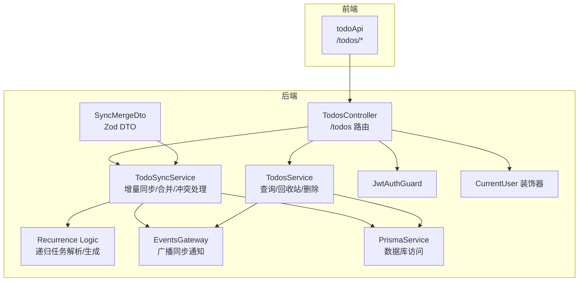
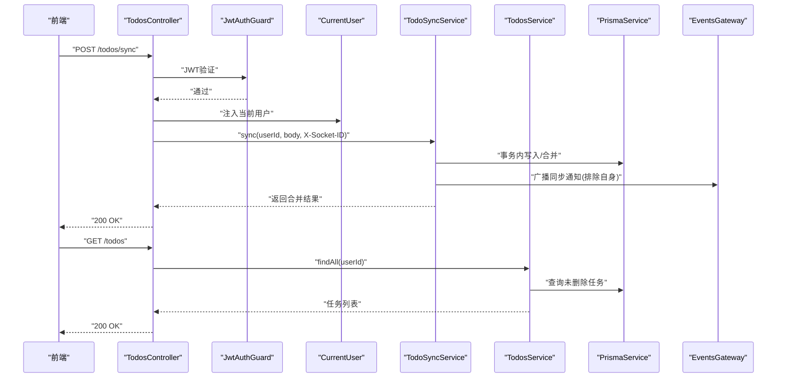
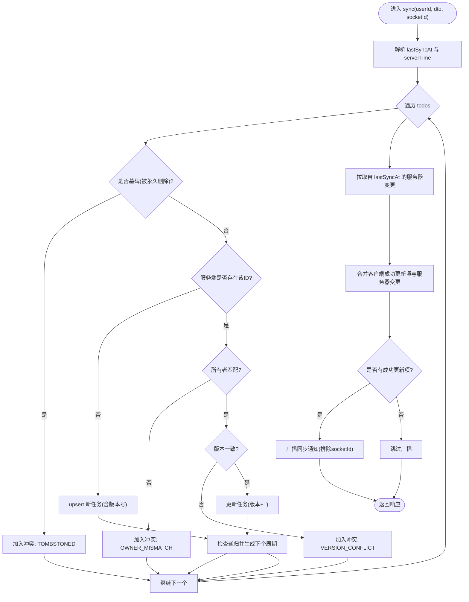
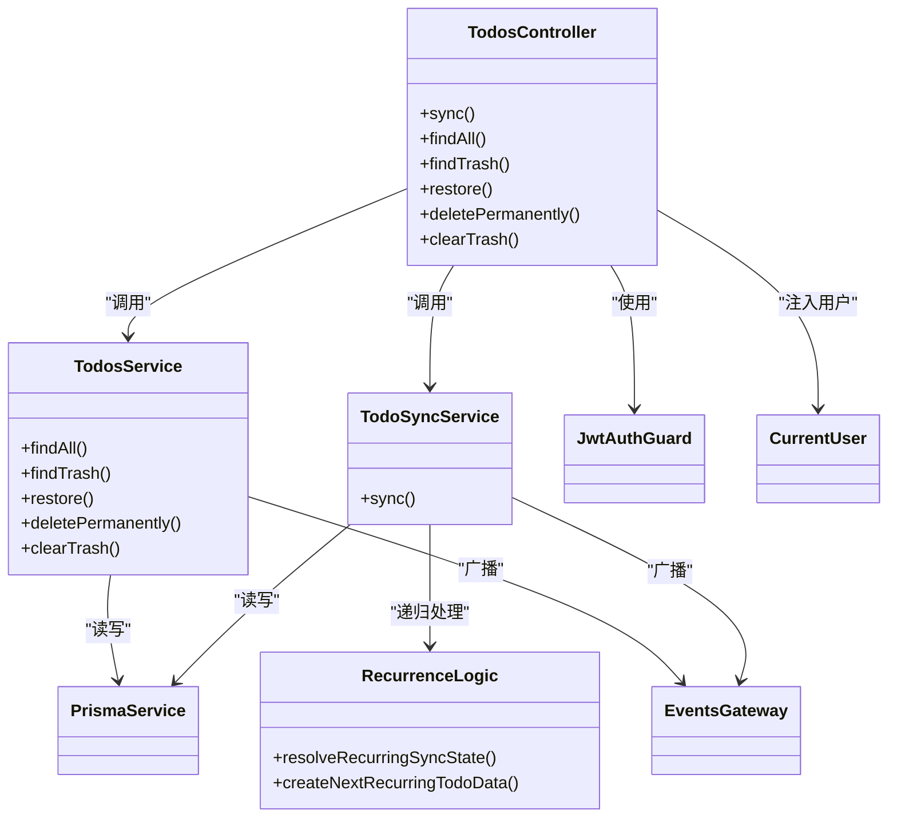

# 任务管理API

<cite>
**本文引用的文件**
- [apps/backend/src/todos/todos.controller.ts](file://apps/backend/src/todos/todos.controller.ts)
- [apps/backend/src/todos/todos.service.ts](file://apps/backend/src/todos/todos.service.ts)
- [apps/backend/src/todos/todos-sync.service.ts](file://apps/backend/src/todos/todos-sync.service.ts)
- [apps/backend/src/todos/todos-sync.recurrence.ts](file://apps/backend/src/todos/todos-sync.recurrence.ts)
- [apps/backend/src/todos/todos.dto.ts](file://apps/backend/src/todos/todos.dto.ts)
- [apps/backend/src/todos/todos.module.ts](file://apps/backend/src/todos/todos.module.ts)
- [apps/backend/src/auth/jwt-auth.guard.ts](file://apps/backend/src/auth/jwt-auth.guard.ts)
- [apps/backend/src/auth/current-user.decorator.ts](file://apps/backend/src/auth/current-user.decorator.ts)
- [packages/shared/src/schemas/todo.schema.ts](file://packages/shared/src/schemas/todo.schema.ts)
- [apps/frontend/src/features/todo/api/index.ts](file://apps/frontend/src/features/todo/api/index.ts)
- [apps/backend/prisma/schema/todo.prisma](file://apps/backend/prisma/schema/todo.prisma)
- [apps/backend/src/prisma/prisma.service.ts](file://apps/backend/src/prisma/prisma.service.ts)
</cite>

## 目录
1. [简介](#简介)
2. [项目结构](#项目结构)
3. [核心组件](#核心组件)
4. [架构总览](#架构总览)
5. [详细组件分析](#详细组件分析)
6. [依赖关系分析](#依赖关系分析)
7. [性能考量](#性能考量)
8. [故障排查指南](#故障排查指南)
9. [结论](#结论)
10. [附录](#附录)

## 简介
本文件为任务管理模块的REST API文档，覆盖以下能力：
- 获取任务列表
- 创建/更新/删除任务
- 回收站管理（查询、恢复、永久删除、清空）
- 同步接口（离线优先合并、冲突处理、递归任务生成）

所有受保护端点均采用JWT认证；同步接口支持通过请求头携带X-Socket-ID以避免自身事件广播。

## 项目结构
任务管理API由控制器、服务层、同步服务、DTO与共享Schema共同组成，并通过Prisma访问数据库，使用事件网关进行跨设备同步通知。

图表来源
- [apps/backend/src/todos/todos.controller.ts:20-69](file://apps/backend/src/todos/todos.controller.ts#L20-L69)
- [apps/backend/src/todos/todos.service.ts:27-146](file://apps/backend/src/todos/todos.service.ts#L27-L146)
- [apps/backend/src/todos/todos-sync.service.ts:41-225](file://apps/backend/src/todos/todos-sync.service.ts#L41-L225)
- [apps/backend/src/todos/todos-sync.recurrence.ts:87-151](file://apps/backend/src/todos/todos-sync.recurrence.ts#L87-L151)
- [apps/backend/src/todos/todos.dto.ts:1-5](file://apps/backend/src/todos/todos.dto.ts#L1-L5)
- [apps/backend/src/auth/jwt-auth.guard.ts:1-10](file://apps/backend/src/auth/jwt-auth.guard.ts#L1-L10)
- [apps/backend/src/auth/current-user.decorator.ts:1-19](file://apps/backend/src/auth/current-user.decorator.ts#L1-L19)
- [apps/backend/src/prisma/prisma.service.ts:1-34](file://apps/backend/src/prisma/prisma.service.ts#L1-L34)

章节来源
- [apps/backend/src/todos/todos.controller.ts:1-70](file://apps/backend/src/todos/todos.controller.ts#L1-L70)
- [apps/backend/src/todos/todos.module.ts:1-15](file://apps/backend/src/todos/todos.module.ts#L1-L15)

## 核心组件
- 控制器：定义REST端点，负责接收请求、注入用户上下文并调用服务层。
- 服务层：提供任务查询、回收站管理、删除等业务逻辑。
- 同步服务：实现离线优先的增量同步与合并，处理冲突、递归任务生成与广播通知。
- DTO与Schema：统一请求/响应的数据结构与校验。
- 认证与用户上下文：JWT守卫与CurrentUser装饰器确保端点安全与用户隔离。

章节来源
- [apps/backend/src/todos/todos.controller.ts:24-69](file://apps/backend/src/todos/todos.controller.ts#L24-L69)
- [apps/backend/src/todos/todos.service.ts:27-146](file://apps/backend/src/todos/todos.service.ts#L27-L146)
- [apps/backend/src/todos/todos-sync.service.ts:41-225](file://apps/backend/src/todos/todos-sync.service.ts#L41-L225)
- [apps/backend/src/todos/todos-sync.recurrence.ts:87-151](file://apps/backend/src/todos/todos-sync.recurrence.ts#L87-L151)
- [apps/backend/src/todos/todos.dto.ts:1-5](file://apps/backend/src/todos/todos.dto.ts#L1-L5)
- [apps/backend/src/auth/jwt-auth.guard.ts:1-10](file://apps/backend/src/auth/jwt-auth.guard.ts#L1-L10)
- [apps/backend/src/auth/current-user.decorator.ts:1-19](file://apps/backend/src/auth/current-user.decorator.ts#L1-L19)

## 架构总览
下图展示了任务管理API的端到端流程：前端调用后端控制器，控制器经JWT认证与用户上下文注入后，委派给服务层或同步服务，最终通过Prisma访问数据库，并在必要时通过事件网关广播同步通知。

图表来源
- [apps/backend/src/todos/todos.controller.ts:30-44](file://apps/backend/src/todos/todos.controller.ts#L30-L44)
- [apps/backend/src/todos/todos-sync.service.ts:52-224](file://apps/backend/src/todos/todos-sync.service.ts#L52-L224)
- [apps/backend/src/todos/todos.service.ts:38-47](file://apps/backend/src/todos/todos.service.ts#L38-L47)
- [apps/backend/src/auth/jwt-auth.guard.ts:1-10](file://apps/backend/src/auth/jwt-auth.guard.ts#L1-L10)
- [apps/backend/src/auth/current-user.decorator.ts:8-18](file://apps/backend/src/auth/current-user.decorator.ts#L8-L18)
- [apps/backend/src/prisma/prisma.service.ts:1-34](file://apps/backend/src/prisma/prisma.service.ts#L1-L34)

## 详细组件分析

### 认证与权限
- JWT认证：所有任务相关端点均使用JwtAuthGuard进行保护。
- 用户上下文：通过CurrentUser装饰器从请求中提取当前用户，确保资源隔离（按userId过滤）。
- 权限说明：仅能访问/修改属于自己的任务数据。

章节来源
- [apps/backend/src/auth/jwt-auth.guard.ts:1-10](file://apps/backend/src/auth/jwt-auth.guard.ts#L1-L10)
- [apps/backend/src/auth/current-user.decorator.ts:1-19](file://apps/backend/src/auth/current-user.decorator.ts#L1-L19)
- [apps/backend/src/todos/todos.controller.ts:22-23](file://apps/backend/src/todos/todos.controller.ts#L22-L23)

### 数据模型与排序规则
- 数据模型：基于Prisma的Todo与TodoTombstone模型，包含标题、完成状态、排序、置顶、父任务、版本号、到期/提醒时间、递归规则与时区、创建/更新/完成/延期/删除时间戳以及番茄钟计数等字段。
- 排序规则：
  - 未删除任务：先按置顶降序，再按order升序，最后按createdAt降序。
  - 回收站任务：按deletedAt降序排列。
- 索引设计：为查询效率优化了索引（用户+更新时间、提醒时间、到期时间、删除时间等）。

章节来源
- [apps/backend/prisma/schema/todo.prisma:1-40](file://apps/backend/prisma/schema/todo.prisma#L1-L40)
- [apps/backend/src/todos/todos.service.ts:45-59](file://apps/backend/src/todos/todos.service.ts#L45-L59)

### 同步接口（离线优先合并）
- 端点：POST /todos/sync
- 请求头：
  - Authorization: Bearer <token>（JWT）
  - X-Socket-ID: 可选，用于避免自身事件广播
- 请求体（SyncMergeRequest）：
  - todos: 数组，元素为SyncItem（见“附录”）
  - lastSyncAt: 可选，字符串或日期，表示上次同步时间
- 响应体（SyncResponse）：
  - synced: 合并后的任务数组
  - deletedIds: 服务器端自lastSyncAt以来被删除的任务ID集合
  - acceptedIds: 客户端推送中被成功接受的ID集合
  - conflicts: 冲突列表（TOMBSTONED/OWNER_MISMATCH/VERSION_CONFLICT）
  - serverTime: 服务器时间（ISO字符串）
- 合并策略（离线优先）：
  - 严格版本匹配（clientVersion == serverVersion）才允许更新，否则报告冲突。
  - 客户端推送成功项与服务器端变更合并，去重后返回。
  - 初次同步（since=0）默认排除回收站内容，后续按需加载。
  - 若存在递归规则且满足触发条件，将生成下一个周期任务。
- 广播通知：当有成功更新项时，向其他在线设备广播同步通知（排除传入的socketId）。

图表来源
- [apps/backend/src/todos/todos-sync.service.ts:52-224](file://apps/backend/src/todos/todos-sync.service.ts#L52-L224)
- [apps/backend/src/todos/todos-sync.recurrence.ts:87-151](file://apps/backend/src/todos/todos-sync.recurrence.ts#L87-L151)

章节来源
- [apps/backend/src/todos/todos.controller.ts:30-38](file://apps/backend/src/todos/todos.controller.ts#L30-L38)
- [apps/backend/src/todos/todos-sync.service.ts:41-225](file://apps/backend/src/todos/todos-sync.service.ts#L41-L225)
- [apps/backend/src/todos/todos-sync.recurrence.ts:1-210](file://apps/backend/src/todos/todos-sync.recurrence.ts#L1-L210)
- [apps/frontend/src/features/todo/api/index.ts:8-20](file://apps/frontend/src/features/todo/api/index.ts#L8-L20)

### 获取任务列表
- 端点：GET /todos
- 功能：获取当前用户未删除的所有任务
- 排序：isPinned降序 → order升序 → createdAt降序
- 响应：任务数组（见“附录”）

章节来源
- [apps/backend/src/todos/todos.controller.ts:40-44](file://apps/backend/src/todos/todos.controller.ts#L40-L44)
- [apps/backend/src/todos/todos.service.ts:38-47](file://apps/backend/src/todos/todos.service.ts#L38-L47)

### 回收站管理
- 查询回收站：GET /todos/trash
  - 功能：获取当前用户已被删除的任务
  - 排序：deletedAt降序
- 恢复任务：POST /todos/:id/restore
  - 功能：将指定任务从回收站恢复
  - 响应：恢复后的任务
- 永久删除：DELETE /todos/:id/permanent
  - 功能：将任务从数据库彻底删除，并写入墓碑表
  - 响应：包含被删除ID的对象
- 清空回收站：DELETE /todos/trash/clear
  - 功能：批量永久删除回收站内所有任务
  - 响应：删除计数

章节来源
- [apps/backend/src/todos/todos.controller.ts:46-68](file://apps/backend/src/todos/todos.controller.ts#L46-L68)
- [apps/backend/src/todos/todos.service.ts:52-145](file://apps/backend/src/todos/todos.service.ts#L52-L145)

### 递归任务（重复任务）
- 触发条件：当现有任务未完成、本次标记完成、无父任务、存在有效递归规则且尚未生成下一个周期时，系统将生成下个周期任务。
- 时间计算：根据DAILY/WEEKLY/MONTHLY或WEEKDAYS（工作日）规则推导下次到期与提醒时间。
- 时区处理：递归时区可为任意有效时区字符串，若无效则忽略递归。
- 生成逻辑：创建新的未完成任务，保持相同title/order/pomodoroCount等字段，设置下次dueAt/remindAt并清空completedAt/deferredAt等状态。

章节来源
- [apps/backend/src/todos/todos-sync.recurrence.ts:87-151](file://apps/backend/src/todos/todos-sync.recurrence.ts#L87-L151)
- [apps/backend/src/todos/todos-sync.recurrence.ts:153-209](file://apps/backend/src/todos/todos-sync.recurrence.ts#L153-L209)
- [apps/backend/src/todos/todos-sync.service.ts:163-176](file://apps/backend/src/todos/todos-sync.service.ts#L163-L176)

## 依赖关系分析
- 控制器依赖JWT守卫与CurrentUser装饰器，确保端点安全与用户上下文。
- 服务层依赖PrismaService进行数据库访问，依赖EventsGateway进行同步通知。
- 同步服务同样依赖PrismaService与EventsGateway，并内嵌递归逻辑模块。
- DTO与共享Schema在前后端之间提供一致的数据契约。

图表来源
- [apps/backend/src/todos/todos.controller.ts:24-69](file://apps/backend/src/todos/todos.controller.ts#L24-L69)
- [apps/backend/src/todos/todos.service.ts:27-146](file://apps/backend/src/todos/todos.service.ts#L27-L146)
- [apps/backend/src/todos/todos-sync.service.ts:41-225](file://apps/backend/src/todos/todos-sync.service.ts#L41-L225)
- [apps/backend/src/todos/todos-sync.recurrence.ts:87-151](file://apps/backend/src/todos/todos-sync.recurrence.ts#L87-L151)
- [apps/backend/src/auth/jwt-auth.guard.ts:1-10](file://apps/backend/src/auth/jwt-auth.guard.ts#L1-L10)
- [apps/backend/src/auth/current-user.decorator.ts:1-19](file://apps/backend/src/auth/current-user.decorator.ts#L1-L19)
- [apps/backend/src/prisma/prisma.service.ts:1-34](file://apps/backend/src/prisma/prisma.service.ts#L1-L34)

## 性能考量
- 查询排序与索引：未删除任务按(isPinned, order, createdAt)排序，回收站按deletedAt排序；数据库对用户+时间字段建立索引，有助于高效筛选与排序。
- 事务合并：同步过程在单事务内处理客户端推送，减少并发冲突与一致性问题。
- 广播去重：通过excludeSocketId避免自身事件重复处理，降低网络与CPU开销。
- 初次同步策略：首次同步默认排除回收站内容，减少初始负载，后续按需加载。

章节来源
- [apps/backend/src/todos/todos.service.ts:45-59](file://apps/backend/src/todos/todos.service.ts#L45-L59)
- [apps/backend/src/todos/todos-sync.service.ts:181-192](file://apps/backend/src/todos/todos-sync.service.ts#L181-L192)
- [apps/backend/prisma/schema/todo.prisma:24-27](file://apps/backend/prisma/schema/todo.prisma#L24-L27)

## 故障排查指南
- 认证失败：确认Authorization头携带有效的Bearer Token。
- 权限不足：确保当前用户与目标任务的userId一致。
- 版本冲突（VERSION_CONFLICT）：客户端与服务端版本号不一致，请重试或合并后再提交。
- 所有者不匹配（OWNER_MISMATCH）：尝试修改不属于你的任务，请检查用户上下文。
- 已被永久删除（TOMBSTONED）：对应任务已被永久删除，无法恢复；请从备份或历史记录中查找。
- 递归任务异常：检查递归规则与递归时区是否有效；无效时区将导致递归被忽略。

章节来源
- [apps/backend/src/todos/todos-sync.service.ts:115-126](file://apps/backend/src/todos/todos-sync.service.ts#L115-L126)
- [apps/backend/src/todos/todos-sync.recurrence.ts:38-50](file://apps/backend/src/todos/todos-sync.recurrence.ts#L38-L50)

## 结论
任务管理API围绕JWT认证、用户隔离与离线优先的同步机制构建，提供完整的一致性保障与良好的扩展性。通过递归任务与墓碑机制，系统支持复杂的时间管理需求；通过事件网关与索引优化，兼顾实时性与性能。

## 附录

### API定义与示例

- 获取任务列表
  - 方法与路径：GET /todos
  - 认证：是（Bearer Token）
  - 响应：任务数组（见“数据模型”）
  - 示例响应：包含多个任务对象，按排序规则排列

- 获取回收站
  - 方法与路径：GET /todos/trash
  - 认证：是（Bearer Token）
  - 响应：回收站中的任务数组（按deletedAt降序）
  - 示例响应：包含若干已删除任务

- 恢复任务
  - 方法与路径：POST /todos/:id/restore
  - 认证：是（Bearer Token）
  - 参数：id（任务ID）
  - 响应：恢复后的任务对象
  - 示例响应：任务对象（deletedAt为空）

- 永久删除
  - 方法与路径：DELETE /todos/:id/permanent
  - 认证：是（Bearer Token）
  - 参数：id（任务ID）
  - 响应：包含被删除ID的对象
  - 示例响应：{"id": "xxx"}

- 清空回收站
  - 方法与路径：DELETE /todos/trash/clear
  - 认证：是（Bearer Token）
  - 响应：删除计数对象
  - 示例响应：{"count": N}

- 同步并合并（离线优先）
  - 方法与路径：POST /todos/sync
  - 认证：是（Bearer Token）
  - 请求头：
    - Authorization: Bearer <token>
    - X-Socket-ID: 可选，避免自身事件广播
  - 请求体（SyncMergeRequest）：
    - todos: SyncItem数组
    - lastSyncAt: 可选，字符串或日期
  - 响应体（SyncResponse）：
    - synced: 合并后的任务数组
    - deletedIds: 服务器端删除的ID集合
    - acceptedIds: 客户端推送中被接受的ID集合
    - conflicts: 冲突列表
    - serverTime: 服务器时间（ISO字符串）

- 典型请求/响应示例（文字描述）
  - 同步请求：包含若干任务变更（含版本号、完成状态、到期/提醒时间、递归规则等），lastSyncAt为上次同步时间。
  - 同步响应：返回合并后的任务列表、被删除的ID集合、接受的ID集合、冲突详情与服务器时间。
  - 获取列表响应：返回当前用户未删除任务，按置顶、排序、创建时间排序。
  - 回收站响应：返回当前用户已删除任务，按删除时间排序。
  - 恢复响应：返回恢复后的任务对象。
  - 永久删除响应：返回被删除ID。
  - 清空回收站响应：返回删除计数。

章节来源
- [apps/backend/src/todos/todos.controller.ts:30-68](file://apps/backend/src/todos/todos.controller.ts#L30-L68)
- [apps/frontend/src/features/todo/api/index.ts:8-60](file://apps/frontend/src/features/todo/api/index.ts#L8-L60)
- [packages/shared/src/schemas/todo.schema.ts:40-68](file://packages/shared/src/schemas/todo.schema.ts#L40-L68)

### 数据模型与字段说明

- 任务（Todo）
  - 字段概览：id、title、completed、order、isPinned、parentId、version、dueAt、remindAt、remindedAt、recurrenceRule、recurrenceTz、recurrenceSpawnedAt、createdAt、updatedAt、completedAt、deferredAt、deletedAt、pomodoroCount、userId
  - 排序规则：未删除任务按isPinned降序→order升序→createdAt降序；回收站按deletedAt降序
  - 索引：用户+更新时间、提醒时间、到期时间、删除时间

- 递归规则（RecurrenceRule）
  - 取值：DAILY、WEEKDAYS、WEEKLY、MONTHLY
  - 时区：字符串，需为有效时区标识；无效时递归被忽略

- 同步项（SyncItem）
  - 继承任务基础字段，并作为批量同步的输入单元

- 同步响应（SyncResponse）
  - 字段：synced（任务数组）、deletedIds（ID数组）、acceptedIds（可选）、conflicts（可选）、serverTime（ISO字符串）

章节来源
- [apps/backend/prisma/schema/todo.prisma:1-40](file://apps/backend/prisma/schema/todo.prisma#L1-L40)
- [packages/shared/src/schemas/todo.schema.ts:3-28](file://packages/shared/src/schemas/todo.schema.ts#L3-L28)
- [apps/backend/src/todos/todos-sync.recurrence.ts:9-28](file://apps/backend/src/todos/todos-sync.recurrence.ts#L9-L28)
- [apps/backend/src/todos/todos-sync.service.ts:20-30](file://apps/backend/src/todos/todos-sync.service.ts#L20-L30)