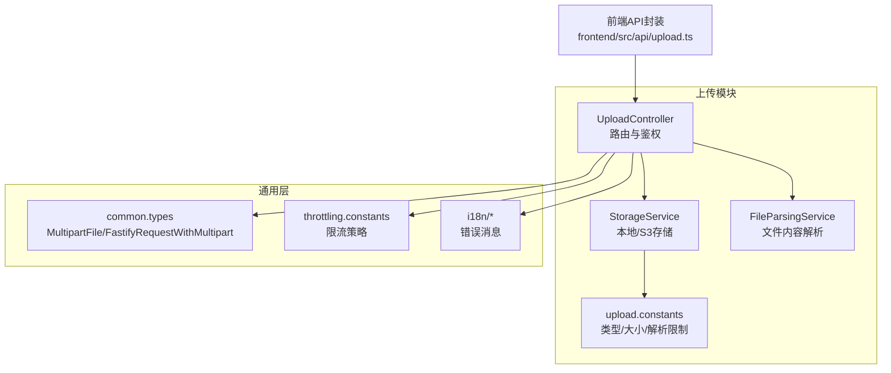
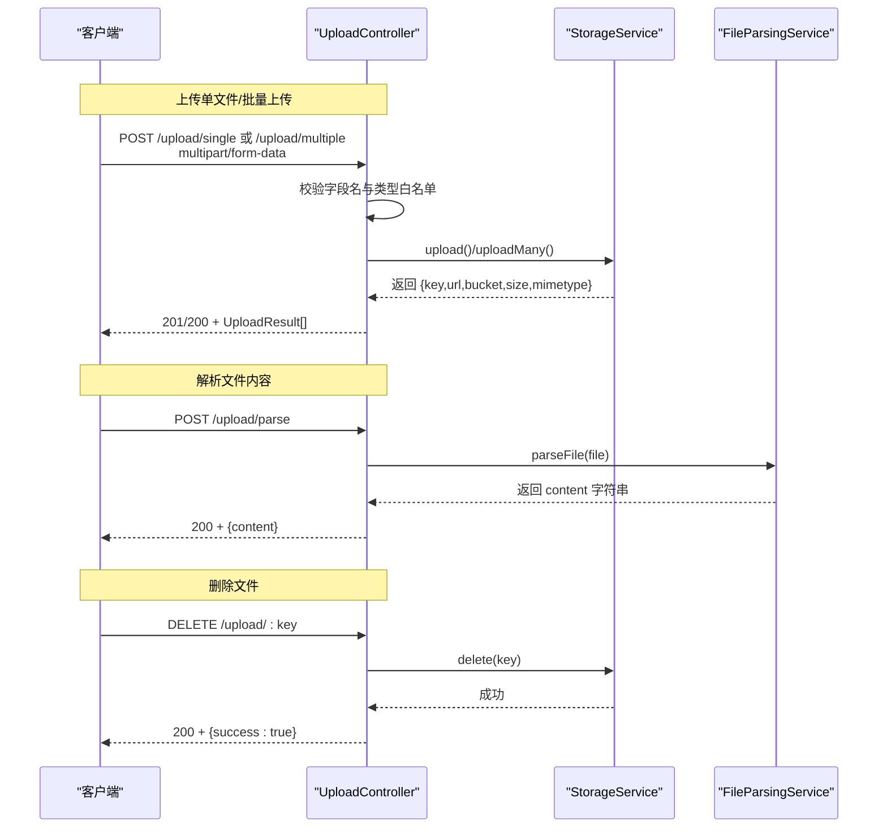
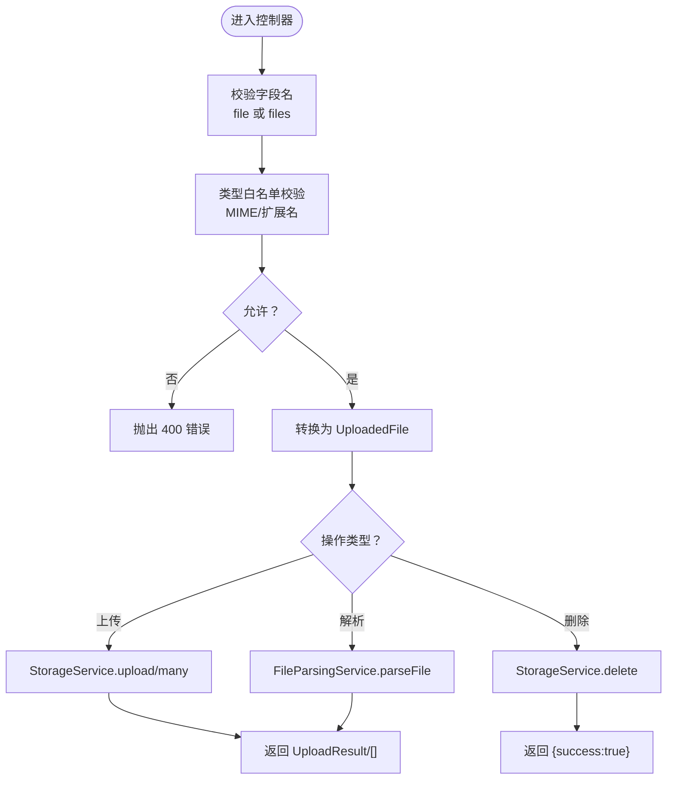
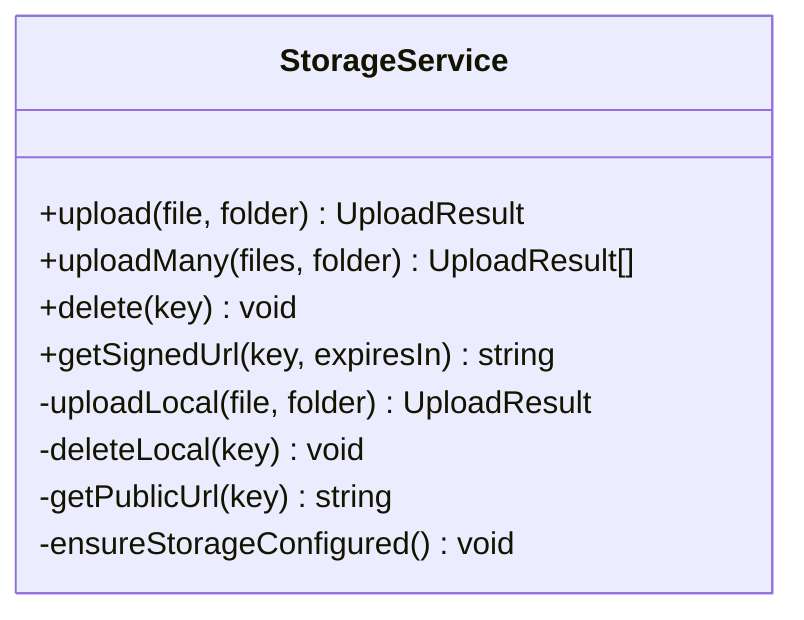
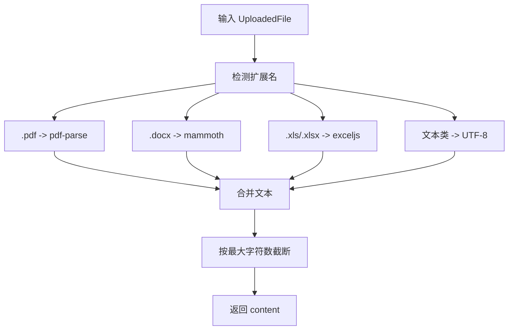
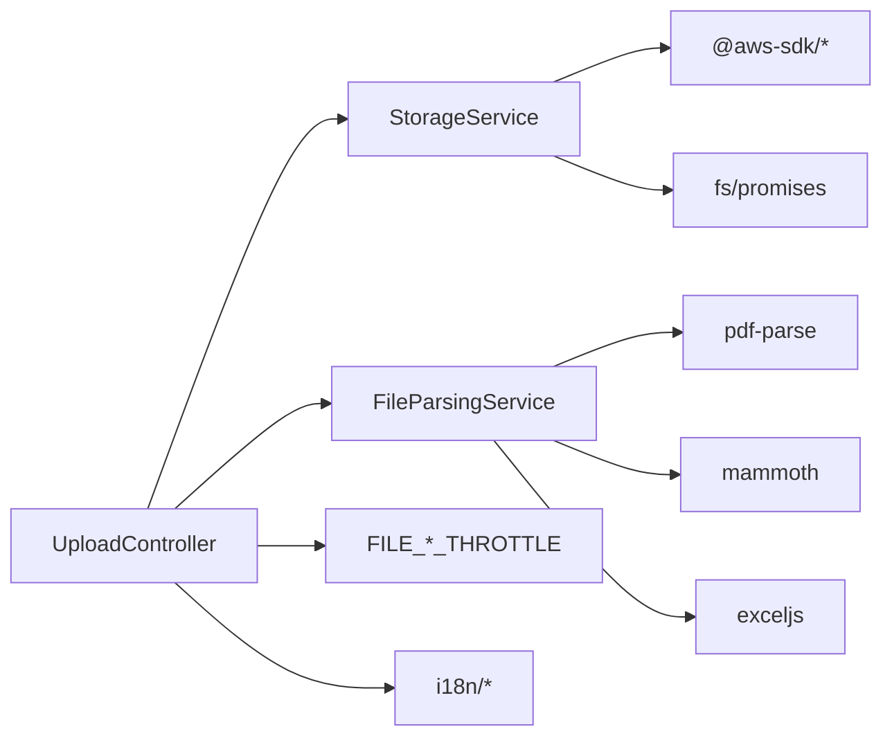

# 文件上传API

<cite>
**本文引用的文件**
- [apps/backend/src/upload/upload.controller.ts](file://apps/backend/src/upload/upload.controller.ts)
- [apps/backend/src/upload/storage.service.ts](file://apps/backend/src/upload/storage.service.ts)
- [apps/backend/src/upload/file-parsing.service.ts](file://apps/backend/src/upload/file-parsing.service.ts)
- [apps/backend/src/upload/upload.constants.ts](file://apps/backend/src/upload/upload.constants.ts)
- [apps/backend/src/upload/upload.module.ts](file://apps/backend/src/upload/upload.module.ts)
- [apps/backend/src/common/types.ts](file://apps/backend/src/common/types.ts)
- [apps/backend/src/common/throttling/throttling.constants.ts](file://apps/backend/src/common/throttling/throttling.constants.ts)
- [apps/backend/src/i18n/en-US/upload.ts](file://apps/backend/src/i18n/en-US/upload.ts)
- [apps/backend/src/i18n/zh-CN/upload.ts](file://apps/backend/src/i18n/zh-CN/upload.ts)
- [apps/frontend/src/api/upload.ts](file://apps/frontend/src/api/upload.ts)
- [apps/backend/tests/upload/upload.controller.spec.ts](file://apps/backend/tests/upload/upload.controller.spec.ts)
- [apps/backend/tests/upload/storage.service.spec.ts](file://apps/backend/tests/upload/storage.service.spec.ts)
</cite>

## 目录

1. [简介](#简介)
2. [项目结构](#项目结构)
3. [核心组件](#核心组件)
4. [架构总览](#架构总览)
5. [详细组件分析](#详细组件分析)
6. [依赖关系分析](#依赖关系分析)
7. [性能与容量规划](#性能与容量规划)
8. [故障排查指南](#故障排查指南)
9. [结论](#结论)
10. [附录：接口清单与示例](#附录接口清单与示例)

## 简介

本文件上传API文档面向后端开发者与集成方，系统性说明文件上传、解析、删除等能力，覆盖以下要点：

- REST接口定义：上传单文件、批量上传、解析文件内容、删除文件
- multipart/form-data 请求规范：字段名、文件类型白名单、大小限制与安全检查
- 存储策略：本地存储与S3/兼容S3（如OSS/MinIO）两种模式及URL生成
- 访问控制：公开URL与预签名URL（临时授权访问）
- 清理策略：删除接口与错误处理
- 前端调用示例与常见问题排查

## 项目结构

文件上传模块位于后端应用的 upload 子目录，采用分层设计：

- 控制器负责HTTP路由、鉴权、参数校验与节流
- 存储服务负责本地或S3存储的具体实现
- 文件解析服务负责对特定类型文件进行内容提取
- 常量文件集中管理允许的扩展名、MIME类型、解析范围与字符上限
- 国际化消息统一维护错误提示

图表来源

- [apps/backend/src/upload/upload.controller.ts:1-161](file://apps/backend/src/upload/upload.controller.ts#L1-L161)
- [apps/backend/src/upload/storage.service.ts:1-216](file://apps/backend/src/upload/storage.service.ts#L1-L216)
- [apps/backend/src/upload/file-parsing.service.ts:1-142](file://apps/backend/src/upload/file-parsing.service.ts#L1-L142)
- [apps/backend/src/upload/upload.constants.ts:1-66](file://apps/backend/src/upload/upload.constants.ts#L1-L66)
- [apps/backend/src/common/types.ts:1-16](file://apps/backend/src/common/types.ts#L1-L16)
- [apps/backend/src/common/throttling/throttling.constants.ts:132-142](file://apps/backend/src/common/throttling/throttling.constants.ts#L132-L142)
- [apps/frontend/src/api/upload.ts:1-23](file://apps/frontend/src/api/upload.ts#L1-L23)

章节来源

- [apps/backend/src/upload/upload.module.ts:1-16](file://apps/backend/src/upload/upload.module.ts#L1-L16)

## 核心组件

- UploadController：提供 /upload/single、/upload/multiple、/upload/parse、/upload/:key 等接口；基于JWT鉴权；对上传与解析分别施加限流；对文件类型进行白名单校验。
- StorageService：封装本地与S3存储，支持上传、批量上传、删除、生成公开URL与预签名URL；当未配置S3凭证时，抛出“存储未配置”异常。
- FileParsingService：根据扩展名选择解析器（PDF、DOCX、XLS/XLSX），对文本类文件直接读取UTF-8；对超长内容进行截断。
- upload.constants：集中定义允许的MIME类型、扩展名、可解析文本扩展名与最大解析字符数。
- common.types：定义Fastify多部分文件类型与请求类型，便于控制器接收与转换。
- throttling.constants：定义文件上传与解析的限流策略。

章节来源

- [apps/backend/src/upload/upload.controller.ts:22-161](file://apps/backend/src/upload/upload.controller.ts#L22-L161)
- [apps/backend/src/upload/storage.service.ts:30-216](file://apps/backend/src/upload/storage.service.ts#L30-L216)
- [apps/backend/src/upload/file-parsing.service.ts:9-142](file://apps/backend/src/upload/file-parsing.service.ts#L9-L142)
- [apps/backend/src/upload/upload.constants.ts:1-66](file://apps/backend/src/upload/upload.constants.ts#L1-L66)
- [apps/backend/src/common/types.ts:1-16](file://apps/backend/src/common/types.ts#L1-L16)
- [apps/backend/src/common/throttling/throttling.constants.ts:132-142](file://apps/backend/src/common/throttling/throttling.constants.ts#L132-L142)

## 架构总览

下图展示从客户端到控制器、存储与解析服务的整体流程：

图表来源

- [apps/backend/src/upload/upload.controller.ts:67-161](file://apps/backend/src/upload/upload.controller.ts#L67-L161)
- [apps/backend/src/upload/storage.service.ts:114-181](file://apps/backend/src/upload/storage.service.ts#L114-L181)
- [apps/backend/src/upload/file-parsing.service.ts:16-72](file://apps/backend/src/upload/file-parsing.service.ts#L16-L72)

## 详细组件分析

### UploadController 接口与行为

- 鉴权与权限
  - 全部接口启用JWT守卫，要求携带Bearer Token
- 限流策略
  - 上传接口使用 FILE_UPLOAD_THROTTLE
  - 解析接口使用 FILE_PARSE_THROTTLE
- 单文件上传
  - 路径：POST /upload/single
  - 请求体：multipart/form-data，字段名为 file，值为二进制文件
  - 响应：UploadResult 对象（包含 key、url、bucket、size、mimetype）
- 批量上传
  - 路径：POST /upload/multiple
  - 请求体：multipart/form-data，字段名为 files，值为二进制文件数组
  - 响应：UploadResult[] 数组
- 文件解析
  - 路径：POST /upload/parse
  - 请求体：multipart/form-data，字段名为 file
  - 响应：{ content: string }，内容按最大字符数截断
- 删除文件
  - 路径：DELETE /upload/:key
  - 响应：{ success: boolean }

图表来源

- [apps/backend/src/upload/upload.controller.ts:32-161](file://apps/backend/src/upload/upload.controller.ts#L32-L161)
- [apps/backend/src/common/throttling/throttling.constants.ts:132-142](file://apps/backend/src/common/throttling/throttling.constants.ts#L132-L142)

章节来源

- [apps/backend/src/upload/upload.controller.ts:67-161](file://apps/backend/src/upload/upload.controller.ts#L67-L161)

### StorageService 存储与URL

- 本地存储
  - 上传：将文件写入 apps/backend/public/{folder}/ 下，文件名使用UUID+原扩展名，返回本地URL前缀
  - 删除：定位到 public 目录并删除对应文件
- S3/兼容S3（含OSS/MinIO）
  - 初始化：从环境变量读取 S3_BUCKET、S3_REGION、S3_ACCESS_KEY_ID、S3_SECRET_ACCESS_KEY、S3_ENDPOINT（可选）
  - 上传：生成随机key，上传至指定Bucket
  - 删除：删除指定Key
  - URL生成：公开URL按AWS或自定义endpoint拼接；预签名URL通过SDK生成，默认有效期1小时
- 异常处理
  - 未配置S3凭证时，所有S3相关操作抛出“存储未配置”
  - 本地写入失败抛出“目录创建失败/文件写入失败”

图表来源

- [apps/backend/src/upload/storage.service.ts:30-216](file://apps/backend/src/upload/storage.service.ts#L30-L216)

章节来源

- [apps/backend/src/upload/storage.service.ts:45-216](file://apps/backend/src/upload/storage.service.ts#L45-L216)

### FileParsingService 内容解析

- 支持类型
  - PDF：使用pdf-parse解析文本
  - DOCX：使用mammoth提取纯文本
  - XLS/XLSX：使用exceljs遍历工作表，输出CSV风格文本
  - 文本类：对txt、md、json、csv及多种源码扩展名直接读取UTF-8
- 截断策略
  - 最大解析字符数由常量控制，超过则截断并追加省略标记
- 错误处理
  - 不支持的类型抛出“不支持的解析类型”
  - 其他解析异常统一转为“文件解析失败”，并记录日志

图表来源

- [apps/backend/src/upload/file-parsing.service.ts:16-142](file://apps/backend/src/upload/file-parsing.service.ts#L16-L142)
- [apps/backend/src/upload/upload.constants.ts:45-66](file://apps/backend/src/upload/upload.constants.ts#L45-L66)

章节来源

- [apps/backend/src/upload/file-parsing.service.ts:16-142](file://apps/backend/src/upload/file-parsing.service.ts#L16-L142)
- [apps/backend/src/upload/upload.constants.ts:45-66](file://apps/backend/src/upload/upload.constants.ts#L45-L66)

### 类型与常量

- MultipartFile/FastifyRequestWithMultipart：定义多部分文件与请求类型，便于控制器接收二进制流
- 允许的MIME类型与扩展名：集中于常量文件，避免散落配置
- 可解析文本扩展名与最大解析字符数：统一管理解析边界

章节来源

- [apps/backend/src/common/types.ts:1-16](file://apps/backend/src/common/types.ts#L1-L16)
- [apps/backend/src/upload/upload.constants.ts:1-66](file://apps/backend/src/upload/upload.constants.ts#L1-L66)

## 依赖关系分析

- 控制器依赖存储与解析服务，二者均无循环依赖
- 存储服务依赖AWS SDK与Node FS模块，需正确配置S3凭证
- 解析服务依赖第三方库，解析逻辑独立于存储
- 限流策略通过常量注入控制器，便于统一调整
- 国际化消息集中维护，便于多语言支持

图表来源

- [apps/backend/src/upload/upload.controller.ts:1-18](file://apps/backend/src/upload/upload.controller.ts#L1-L18)
- [apps/backend/src/upload/storage.service.ts:1-14](file://apps/backend/src/upload/storage.service.ts#L1-L14)
- [apps/backend/src/upload/file-parsing.service.ts:1-7](file://apps/backend/src/upload/file-parsing.service.ts#L1-L7)
- [apps/backend/src/common/throttling/throttling.constants.ts:132-142](file://apps/backend/src/common/throttling/throttling.constants.ts#L132-L142)
- [apps/backend/src/i18n/en-US/upload.ts:1-10](file://apps/backend/src/i18n/en-US/upload.ts#L1-L10)

章节来源

- [apps/backend/src/upload/upload.module.ts:1-16](file://apps/backend/src/upload/upload.module.ts#L1-L16)

## 性能与容量规划

- 限流
  - 上传：短窗口2次/1秒、中窗口8次/10秒、长窗口20次/1分钟
  - 解析：短窗口1次/1秒、中窗口4次/10秒、长窗口10次/1分钟
  - 可通过环境变量调整各窗口的TTL与限额
- 并发
  - 批量上传使用Promise.all并发执行，提升吞吐
- 存储
  - 本地存储适合开发与小规模场景；生产建议使用S3/兼容S3以获得高可用与CDN加速
- 解析
  - 大文件解析会占用CPU与内存，建议对超大文件引导用户压缩或拆分

章节来源

- [apps/backend/src/common/throttling/throttling.constants.ts:132-142](file://apps/backend/src/common/throttling/throttling.constants.ts#L132-L142)
- [apps/backend/src/upload/storage.service.ts:144-146](file://apps/backend/src/upload/storage.service.ts#L144-L146)

## 故障排查指南

- 400 错误：文件类型不受支持
  - 检查文件扩展名与MIME是否在白名单内
  - 参考国际化消息键：upload.UNSUPPORTED_FILE_TYPE
- 400 错误：缺少文件或字段名不匹配
  - 确保字段名为 file 或 files
  - 参考国际化消息键：upload.FILE_REQUIRED
- 400 错误：不支持的解析类型
  - 当前仅支持PDF/DOCX/XLS/XLSX与部分文本/源码扩展名
  - 参考国际化消息键：upload.UNSUPPORTED_PARSE_FILE_TYPE
- 400 错误：文件解析失败
  - 检查文件是否损坏或格式异常
  - 参考国际化消息键：upload.FILE_PARSING_FAILED
- 503 错误：存储未配置
  - 未提供S3凭证时，S3相关操作不可用
  - 参考国际化消息键：upload.STORAGE_NOT_CONFIGURED
- 本地存储写入失败
  - 检查 public 目录权限与磁盘空间
  - 参考国际化消息键：upload.DIRECTORY_CREATION_FAILED、upload.FILE_WRITE_FAILED

章节来源

- [apps/backend/src/i18n/en-US/upload.ts:1-10](file://apps/backend/src/i18n/en-US/upload.ts#L1-L10)
- [apps/backend/src/i18n/zh-CN/upload.ts:1-10](file://apps/backend/src/i18n/zh-CN/upload.ts#L1-L10)
- [apps/backend/src/upload/upload.controller.ts:50-65](file://apps/backend/src/upload/upload.controller.ts#L50-L65)
- [apps/backend/src/upload/file-parsing.service.ts:44-71](file://apps/backend/src/upload/file-parsing.service.ts#L44-L71)
- [apps/backend/src/upload/storage.service.ts:208-214](file://apps/backend/src/upload/storage.service.ts#L208-L214)

## 结论

该上传模块提供了清晰的REST接口、完善的类型与解析策略、灵活的存储后端以及可配置的限流与错误处理。生产部署建议优先使用S3/兼容S3，并结合预签名URL实现细粒度访问控制；同时配合前端合理限制文件大小与数量，保障系统稳定性与安全性。

## 附录：接口清单与示例

### 接口总览

- 上传单文件
  - 方法：POST
  - 路径：/upload/single
  - 认证：Bearer Token
  - 请求体：multipart/form-data，字段名：file，值：二进制文件
  - 响应：UploadResult
- 批量上传
  - 方法：POST
  - 路径：/upload/multiple
  - 认证：Bearer Token
  - 请求体：multipart/form-data，字段名：files，值：二进制文件数组
  - 响应：UploadResult[]
- 解析文件内容
  - 方法：POST
  - 路径：/upload/parse
  - 认证：Bearer Token
  - 请求体：multipart/form-data，字段名：file，值：二进制文件
  - 响应：{ content: string }
- 删除文件
  - 方法：DELETE
  - 路径：/upload/:key
  - 认证：Bearer Token
  - 响应：{ success: boolean }

章节来源

- [apps/backend/src/upload/upload.controller.ts:67-161](file://apps/backend/src/upload/upload.controller.ts#L67-L161)

### 请求与响应规范

- multipart/form-data 字段
  - 单文件：file
  - 多文件：files（数组）
- UploadResult 字段
  - key：存储键（如 uploads/<uuid.ext>）
  - url：公开访问URL或预签名URL
  - bucket：存储桶名称或 local
  - size：字节数
  - mimetype：MIME类型
- 响应状态
  - 201/200：成功
  - 400：参数/类型/解析错误
  - 401/403：鉴权失败
  - 503：存储未配置

章节来源

- [apps/backend/src/upload/storage.service.ts:15-28](file://apps/backend/src/upload/storage.service.ts#L15-L28)
- [apps/backend/src/upload/upload.controller.ts:74-81](file://apps/backend/src/upload/upload.controller.ts#L74-L81)

### 支持的文件类型与大小限制

- 允许的MIME类型与扩展名
  - 图片：jpeg、png、gif、webp
  - 文档：pdf、docx、xls、xlsx
  - 文本：txt、md、json、csv
  - 其他：ts、js、py、go、java、c/c++/h/hpp、rs、yaml/yml、toml
- 解析支持
  - PDF、DOCX、XLS/XLSX、文本类文件
- 最大解析字符数
  - 120,000 字符，超长自动截断

章节来源

- [apps/backend/src/upload/upload.constants.ts:1-66](file://apps/backend/src/upload/upload.constants.ts#L1-L66)

### 安全检查机制

- 类型白名单：严格比对MIME类型与扩展名，拒绝未知类型
- 限流：针对上传与解析分别限流，防止滥用
- 鉴权：全部接口启用JWT守卫
- 错误国际化：统一错误消息，便于前端友好提示

章节来源

- [apps/backend/src/upload/upload.controller.ts:50-65](file://apps/backend/src/upload/upload.controller.ts#L50-L65)
- [apps/backend/src/common/throttling/throttling.constants.ts:132-142](file://apps/backend/src/common/throttling/throttling.constants.ts#L132-L142)
- [apps/backend/src/i18n/en-US/upload.ts:1-10](file://apps/backend/src/i18n/en-US/upload.ts#L1-L10)

### 存储配置与URL生成

- 本地存储
  - 上传路径：apps/backend/public/{folder}/
  - URL前缀：/api/public/{key}
- S3/兼容S3
  - 环境变量：S3_BUCKET、S3_REGION、S3_ACCESS_KEY_ID、S3_SECRET_ACCESS_KEY、S3_ENDPOINT（可选）
  - 公开URL：AWS格式或自定义endpoint拼接
  - 预签名URL：getSignedUrl(key, expiresIn=3600)
- 删除
  - 本地：删除public目录下的文件
  - S3：删除对应Key

章节来源

- [apps/backend/src/upload/storage.service.ts:45-216](file://apps/backend/src/upload/storage.service.ts#L45-L216)

### 访问权限控制与清理策略

- 公开访问
  - 本地：/api/public/{key}
  - S3：根据bucket与region生成公开URL
- 临时访问
  - 使用预签名URL，设置合理过期时间
- 清理策略
  - 提供删除接口，删除后即失效
  - 建议定期清理不再使用的旧文件

章节来源

- [apps/backend/src/upload/storage.service.ts:183-206](file://apps/backend/src/upload/storage.service.ts#L183-L206)

### 前端调用示例

- 解析文件（不保存）
  - 使用FormData，字段名为 file
  - Content-Type 设置为自动（由浏览器设置）
  - 参考前端封装：apps/frontend/src/api/upload.ts

章节来源

- [apps/frontend/src/api/upload.ts:11-22](file://apps/frontend/src/api/upload.ts#L11-L22)

### 测试参考

- 控制器单元测试：验证类型白名单与转发行为
- 存储服务单元测试：验证S3凭证缺失时的行为

章节来源

- [apps/backend/tests/upload/upload.controller.spec.ts:46-101](file://apps/backend/tests/upload/upload.controller.spec.ts#L46-L101)
- [apps/backend/tests/upload/storage.service.spec.ts:32-72](file://apps/backend/tests/upload/storage.service.spec.ts#L32-L72)
