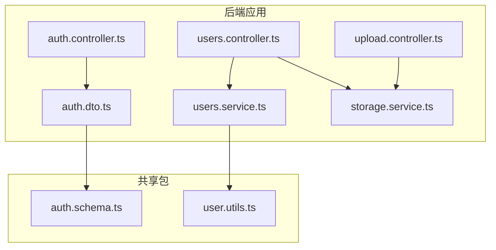
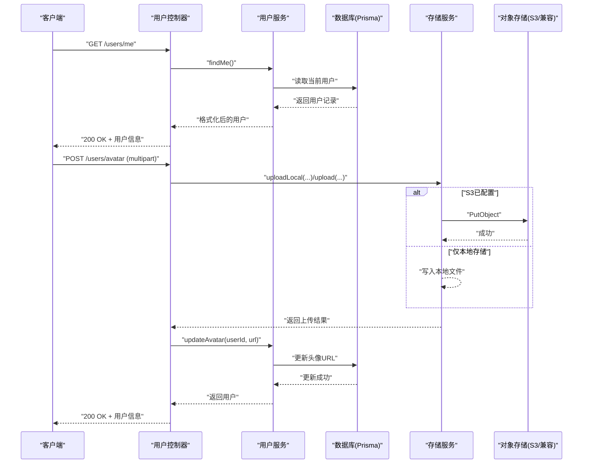
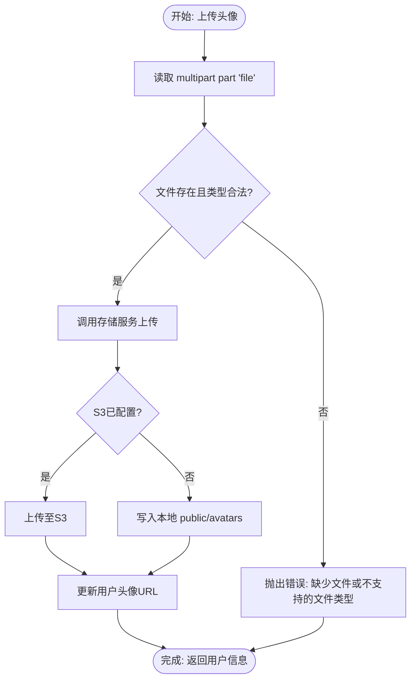
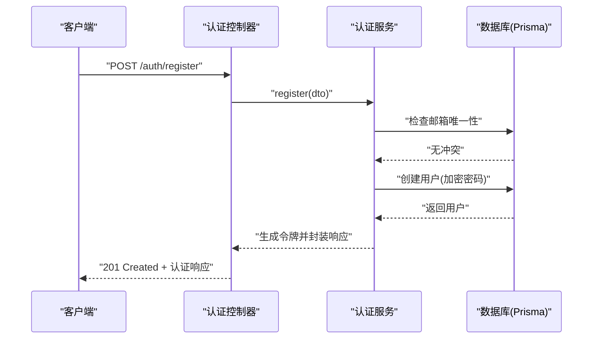
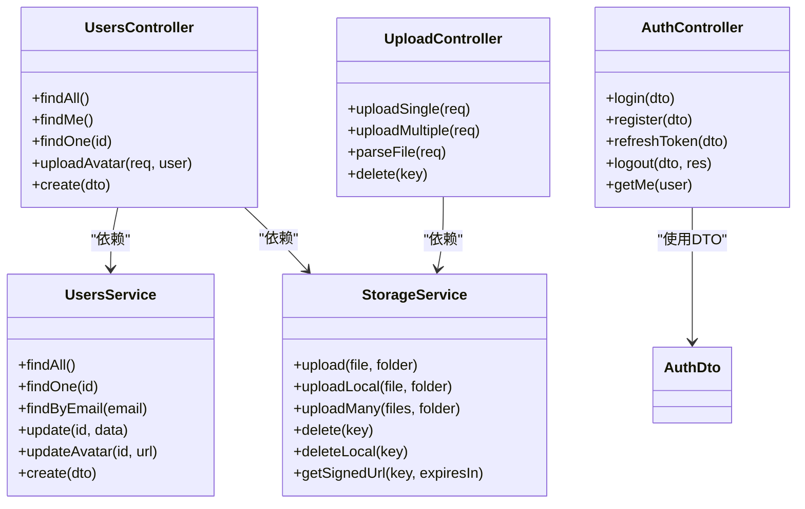

# 用户管理API

<cite>
**本文引用的文件**
- [apps/backend/src/users/users.controller.ts](file://apps/backend/src/users/users.controller.ts)
- [apps/backend/src/users/users.service.ts](file://apps/backend/src/users/users.service.ts)
- [apps/backend/src/auth/auth.controller.ts](file://apps/backend/src/auth/auth.controller.ts)
- [apps/backend/src/auth/auth.dto.ts](file://apps/backend/src/auth/auth.dto.ts)
- [apps/backend/src/upload/upload.controller.ts](file://apps/backend/src/upload/upload.controller.ts)
- [apps/backend/src/upload/storage.service.ts](file://apps/backend/src/upload/storage.service.ts)
- [apps/backend/src/upload/upload.constants.ts](file://apps/backend/src/upload/upload.constants.ts)
- [apps/backend/src/common/throttling/throttling.constants.ts](file://apps/backend/src/common/throttling/throttling.constants.ts)
- [apps/backend/src/common/types.ts](file://apps/backend/src/common/types.ts)
- [packages/shared/src/schemas/auth.schema.ts](file://packages/shared/src/schemas/auth.schema.ts)
- [packages/shared/src/utils/user.utils.ts](file://packages/shared/src/utils/user.utils.ts)
</cite>

## 目录

1. [简介](#简介)
2. [项目结构](#项目结构)
3. [核心组件](#核心组件)
4. [架构总览](#架构总览)
5. [详细组件分析](#详细组件分析)
6. [依赖关系分析](#依赖关系分析)
7. [性能与限流](#性能与限流)
8. [故障排查指南](#故障排查指南)
9. [结论](#结论)
10. [附录：接口清单与示例](#附录接口清单与示例)

## 简介

本文件为“用户管理”模块的REST API文档，覆盖以下能力：

- 用户信息查询（分页/列表、详情、当前用户）
- 用户资料修改（名称、头像URL等）
- 头像上传与管理（本地/云端存储）
- 用户注册与认证（登录、注册、刷新令牌、登出）
- 权限控制与数据访问限制
- 安全与限流策略
- 常见使用场景与请求/响应示例

## 项目结构

用户管理相关模块主要分布在后端应用中，采用按功能域划分的目录结构：

- 用户域：users.controller.ts、users.service.ts
- 认证域：auth.controller.ts、auth.dto.ts
- 上传域：upload.controller.ts、storage.service.ts、upload.constants.ts
- 通用限流与类型：throttling.constants.ts、types.ts
- 共享Schema与工具：packages/shared 下的 auth.schema.ts、user.utils.ts

图表来源

- [apps/backend/src/users/users.controller.ts:1-135](file://apps/backend/src/users/users.controller.ts#L1-135)
- [apps/backend/src/users/users.service.ts:1-118](file://apps/backend/src/users/users.service.ts#L1-118)
- [apps/backend/src/auth/auth.controller.ts:1-81](file://apps/backend/src/auth/auth.controller.ts#L1-81)
- [apps/backend/src/auth/auth.dto.ts:1-41](file://apps/backend/src/auth/auth.dto.ts#L1-41)
- [apps/backend/src/upload/upload.controller.ts:1-161](file://apps/backend/src/upload/upload.controller.ts#L1-161)
- [apps/backend/src/upload/storage.service.ts:1-216](file://apps/backend/src/upload/storage.service.ts#L1-216)
- [packages/shared/src/schemas/auth.schema.ts:1-121](file://packages/shared/src/schemas/auth.schema.ts#L1-121)
- [packages/shared/src/utils/user.utils.ts:1-36](file://packages/shared/src/utils/user.utils.ts#L1-36)

章节来源

- [apps/backend/src/users/users.controller.ts:1-135](file://apps/backend/src/users/users.controller.ts#L1-135)
- [apps/backend/src/users/users.service.ts:1-118](file://apps/backend/src/users/users.service.ts#L1-118)
- [apps/backend/src/auth/auth.controller.ts:1-81](file://apps/backend/src/auth/auth.controller.ts#L1-81)
- [apps/backend/src/auth/auth.dto.ts:1-41](file://apps/backend/src/auth/auth.dto.ts#L1-41)
- [apps/backend/src/upload/upload.controller.ts:1-161](file://apps/backend/src/upload/upload.controller.ts#L1-161)
- [apps/backend/src/upload/storage.service.ts:1-216](file://apps/backend/src/upload/storage.service.ts#L1-216)
- [packages/shared/src/schemas/auth.schema.ts:1-121](file://packages/shared/src/schemas/auth.schema.ts#L1-121)
- [packages/shared/src/utils/user.utils.ts:1-36](file://packages/shared/src/utils/user.utils.ts#L1-36)

## 核心组件

- 用户控制器（UsersController）
  - 提供用户列表、当前用户、单个用户查询、头像上传、用户创建等接口
  - 使用 JWT 认证守卫保护接口
- 用户服务（UsersService）
  - 实现用户查询、创建、头像更新等业务逻辑
  - 使用 Prisma 访问数据库，并通过共享工具进行数据格式化
- 上传控制器（UploadController）
  - 提供单文件、多文件上传与删除接口
  - 统一的文件类型校验与限流
- 存储服务（StorageService）
  - 支持本地文件系统与S3/兼容S3协议的对象存储
  - 提供上传、批量上传、删除、签名URL等能力
- 认证控制器（AuthController）
  - 提供登录、注册、刷新令牌、登出、获取当前用户等接口
  - 使用 DTO 进行输入校验，结合限流策略
- 共享Schema与工具
  - 定义用户、认证、更新等输入输出Schema
  - 提供用户对象格式化工具

章节来源

- [apps/backend/src/users/users.controller.ts:26-135](file://apps/backend/src/users/users.controller.ts#L26-L135)
- [apps/backend/src/users/users.service.ts:12-118](file://apps/backend/src/users/users.service.ts#L12-L118)
- [apps/backend/src/upload/upload.controller.ts:22-161](file://apps/backend/src/upload/upload.controller.ts#L22-L161)
- [apps/backend/src/upload/storage.service.ts:34-216](file://apps/backend/src/upload/storage.service.ts#L34-L216)
- [apps/backend/src/auth/auth.controller.ts:15-81](file://apps/backend/src/auth/auth.controller.ts#L15-L81)
- [packages/shared/src/schemas/auth.schema.ts:57-121](file://packages/shared/src/schemas/auth.schema.ts#L57-L121)
- [packages/shared/src/utils/user.utils.ts:19-35](file://packages/shared/src/utils/user.utils.ts#L19-L35)

## 架构总览

用户管理API围绕“控制器-服务-存储-共享Schema”的分层设计，配合JWT认证与全局限流策略，形成统一的安全与可扩展架构。

图表来源

- [apps/backend/src/users/users.controller.ts:48-111](file://apps/backend/src/users/users.controller.ts#L48-L111)
- [apps/backend/src/users/users.service.ts:69-82](file://apps/backend/src/users/users.service.ts#L69-L82)
- [apps/backend/src/upload/storage.service.ts:74-139](file://apps/backend/src/upload/storage.service.ts#L74-L139)

## 详细组件分析

### 用户查询与列表

- GET /users
  - 描述：获取所有用户列表
  - 权限：需要JWT认证
  - 返回：用户数组（含id、email、name、avatar、createdAt、updatedAt）
- GET /users/me
  - 描述：获取当前登录用户信息
  - 权限：需要JWT认证
  - 返回：当前用户对象
- GET /users/:id
  - 描述：根据ID获取单个用户
  - 权限：需要JWT认证
  - 参数：id（整数）
  - 返回：用户对象；当ID无效或不存在时返回错误

章节来源

- [apps/backend/src/users/users.controller.ts:37-54](file://apps/backend/src/users/users.controller.ts#L37-L54)
- [apps/backend/src/users/users.controller.ts:116-122](file://apps/backend/src/users/users.controller.ts#L116-L122)
- [apps/backend/src/users/users.service.ts:19-39](file://apps/backend/src/users/users.service.ts#L19-L39)

### 用户资料修改与头像管理

- PATCH /users/me（通过更新用户字段实现）
  - 描述：更新当前用户的资料（如名称、头像URL）
  - 权限：需要JWT认证
  - 输入校验：名称长度、头像URL格式（可空）
  - 注意：当前仓库未直接暴露PATCH /users/me接口，但可通过其他方式更新头像URL；若需头像上传，请参考下述“头像上传”流程
- POST /users/avatar
  - 描述：上传用户头像
  - 权限：需要JWT认证
  - 请求体：multipart/form-data，字段名为file
  - 文件校验：支持的MIME类型与扩展名见“上传常量”
  - 存储策略：
    - 若S3凭证已配置：上传至S3并返回公开URL
    - 否则：保存至本地public/avatars目录，返回本地URL
  - 旧头像清理：若用户已有本地头像，会尝试删除旧文件以节省空间
  - 返回：更新后的用户对象

图表来源

- [apps/backend/src/users/users.controller.ts:72-111](file://apps/backend/src/users/users.controller.ts#L72-L111)
- [apps/backend/src/upload/storage.service.ts:116-139](file://apps/backend/src/upload/storage.service.ts#L116-L139)
- [apps/backend/src/upload/storage.service.ts:74-111](file://apps/backend/src/upload/storage.service.ts#L74-L111)

章节来源

- [apps/backend/src/users/users.controller.ts:59-111](file://apps/backend/src/users/users.controller.ts#L59-L111)
- [apps/backend/src/upload/storage.service.ts:34-216](file://apps/backend/src/upload/storage.service.ts#L34-L216)
- [apps/backend/src/upload/upload.constants.ts:1-66](file://apps/backend/src/upload/upload.constants.ts#L1-L66)

### 用户注册与认证

- POST /auth/register
  - 描述：用户注册
  - 输入：email、name、password
  - 校验：邮箱格式、名称长度、密码长度
  - 结果：创建用户并返回认证响应（包含访问令牌、刷新令牌与用户信息）
- POST /auth/login
  - 描述：用户登录
  - 输入：email、password
  - 结果：返回认证响应
- POST /auth/refresh
  - 描述：刷新访问令牌
  - 输入：refreshToken
  - 结果：返回新的访问令牌与刷新令牌
- POST /auth/logout
  - 描述：用户登出
  - 输入：refreshToken
  - 行为：清除accessToken与refreshToken Cookie
  - 返回：成功消息
- GET /auth/me
  - 描述：获取当前用户信息
  - 权限：需要JWT认证

图表来源

- [apps/backend/src/auth/auth.controller.ts:33-38](file://apps/backend/src/auth/auth.controller.ts#L33-L38)
- [apps/backend/src/auth/auth.dto.ts:20-25](file://apps/backend/src/auth/auth.dto.ts#L20-L25)
- [apps/backend/src/users/users.service.ts:96-116](file://apps/backend/src/users/users.service.ts#L96-L116)
- [packages/shared/src/schemas/auth.schema.ts:33-41](file://packages/shared/src/schemas/auth.schema.ts#L33-L41)

章节来源

- [apps/backend/src/auth/auth.controller.ts:20-79](file://apps/backend/src/auth/auth.controller.ts#L20-L79)
- [apps/backend/src/auth/auth.dto.ts:15-40](file://apps/backend/src/auth/auth.dto.ts#L15-L40)
- [apps/backend/src/users/users.service.ts:96-116](file://apps/backend/src/users/users.service.ts#L96-L116)
- [packages/shared/src/schemas/auth.schema.ts:25-41](file://packages/shared/src/schemas/auth.schema.ts#L25-L41)

### 文件上传与解析（通用）

- POST /upload/single
  - 描述：上传单个文件
  - 请求体：multipart/form-data，字段名为file
  - 限流：FILE_UPLOAD_THROTTLE
  - 返回：上传结果（key、url、bucket、size、mimetype）
- POST /upload/multiple
  - 描述：上传多个文件（最多10个）
  - 请求体：multipart/form-data，字段名为files（数组）
  - 限流：FILE_UPLOAD_THROTTLE
  - 返回：上传结果数组
- POST /upload/parse
  - 描述：解析文件内容（文本类文件）
  - 请求体：multipart/form-data，字段名为file
  - 限流：FILE_PARSE_THROTTLE
  - 返回：content（字符串）
- DELETE /upload/:key
  - 描述：删除文件
  - 参数：key（文件唯一标识）
  - 返回：{ success: true }

章节来源

- [apps/backend/src/upload/upload.controller.ts:67-159](file://apps/backend/src/upload/upload.controller.ts#L67-L159)
- [apps/backend/src/common/throttling/throttling.constants.ts:132-142](file://apps/backend/src/common/throttling/throttling.constants.ts#L132-L142)

## 依赖关系分析

- 控制器依赖服务：UsersController依赖UsersService；UploadController依赖StorageService
- 服务依赖外部：UsersService依赖Prisma；StorageService依赖S3 SDK或本地文件系统
- 数据模型：用户对象由共享Schema定义，服务层通过格式化工具转换为对外响应结构
- 认证与限流：控制器通过JWT守卫与Throttle装饰器实现权限与限流

图表来源

- [apps/backend/src/users/users.controller.ts:28-32](file://apps/backend/src/users/users.controller.ts#L28-L32)
- [apps/backend/src/users/users.service.ts:12-14](file://apps/backend/src/users/users.service.ts#L12-L14)
- [apps/backend/src/upload/upload.controller.ts:26-30](file://apps/backend/src/upload/upload.controller.ts#L26-L30)
- [apps/backend/src/upload/storage.service.ts:34-43](file://apps/backend/src/upload/storage.service.ts#L34-L43)
- [apps/backend/src/auth/auth.controller.ts:17-18](file://apps/backend/src/auth/auth.controller.ts#L17-L18)

## 性能与限流

- 全局限流策略
  - 窗口定义：short（短）、medium（中）、long（长），默认TTL与限制可在环境变量中覆盖
  - 跳过规则：OPTIONS请求、/api/health及其子路径跳过全局限流
- 认证相关限流
  - 登录：short=3、medium=5、long=5
  - 注册：short=2、medium=3、long=3
  - 刷新：short=5、medium=20、long=60
- 文件操作限流
  - 文件上传：short=2、medium=8、long=20
  - 文件解析：short=1、medium=4、long=10
- 限流实现
  - 通过@Throttle装饰器在控制器方法上应用策略
  - 错误消息统一为“请求过于频繁”

章节来源

- [apps/backend/src/common/throttling/throttling.constants.ts:173-197](file://apps/backend/src/common/throttling/throttling.constants.ts#L173-L197)
- [apps/backend/src/common/throttling/throttling.constants.ts:90-142](file://apps/backend/src/common/throttling/throttling.constants.ts#L90-L142)
- [apps/backend/src/auth/auth.controller.ts:23-48](file://apps/backend/src/auth/auth.controller.ts#L23-L48)
- [apps/backend/src/upload/upload.controller.ts:70-90](file://apps/backend/src/upload/upload.controller.ts#L70-L90)

## 故障排查指南

- 上传失败
  - 现象：上传接口返回错误
  - 可能原因：
    - 缺少文件或字段名不正确（file字段）
    - 文件类型不在允许列表内
    - 本地存储目录不可写或权限不足
    - S3凭证未配置导致S3上传不可用
  - 处理建议：
    - 确认请求体为multipart/form-data且字段名为file
    - 检查文件扩展名与MIME类型是否在允许范围内
    - 检查本地public目录权限与磁盘空间
    - 配置S3_ACCESS_KEY_ID、S3_SECRET_ACCESS_KEY等环境变量
- 头像更新异常
  - 现象：头像上传成功但用户信息未更新
  - 可能原因：数据库更新失败或用户ID无效
  - 处理建议：确认JWT有效、用户ID存在
- 认证失败
  - 现象：登录/注册/刷新/登出失败
  - 可能原因：输入参数不符合Schema、限流触发、令牌无效
  - 处理建议：检查输入字段、等待限流窗口恢复、确认令牌格式

章节来源

- [apps/backend/src/users/users.controller.ts:76-92](file://apps/backend/src/users/users.controller.ts#L76-L92)
- [apps/backend/src/upload/storage.service.ts:84-101](file://apps/backend/src/upload/storage.service.ts#L84-L101)
- [apps/backend/src/upload/storage.service.ts:208-214](file://apps/backend/src/upload/storage.service.ts#L208-L214)
- [apps/backend/src/common/throttling/throttling.constants.ts:162-171](file://apps/backend/src/common/throttling/throttling.constants.ts#L162-L171)

## 结论

本用户管理API以清晰的分层架构与严格的输入校验为基础，结合JWT认证与全局限流策略，提供了安全、可扩展的用户信息管理能力。头像上传支持本地与云端双模式，文件上传与解析接口满足多样化需求。建议在生产环境中：

- 明确配置S3凭证以启用云端存储
- 合理设置限流参数以平衡用户体验与系统负载
- 对外暴露的接口遵循最小权限原则，避免不必要的公开接口

## 附录：接口清单与示例

### 用户查询

- GET /users
  - 权限：JWT
  - 响应：用户数组
- GET /users/me
  - 权限：JWT
  - 响应：当前用户
- GET /users/:id
  - 权限：JWT
  - 参数：id（整数）
  - 响应：用户对象

章节来源

- [apps/backend/src/users/users.controller.ts:37-54](file://apps/backend/src/users/users.controller.ts#L37-L54)
- [apps/backend/src/users/users.controller.ts:116-122](file://apps/backend/src/users/users.controller.ts#L116-L122)

### 头像上传与管理

- POST /users/avatar
  - 权限：JWT
  - 请求体：multipart/form-data，字段file
  - 成功响应：用户对象（包含头像URL）
  - 失败响应：缺少文件或不支持的文件类型

章节来源

- [apps/backend/src/users/users.controller.ts:59-111](file://apps/backend/src/users/users.controller.ts#L59-L111)
- [apps/backend/src/upload/upload.constants.ts:1-66](file://apps/backend/src/upload/upload.constants.ts#L1-L66)

### 用户注册与认证

- POST /auth/register
  - 请求体：email、name、password
  - 成功响应：认证响应（accessToken、refreshToken、user）
- POST /auth/login
  - 请求体：email、password
  - 成功响应：认证响应
- POST /auth/refresh
  - 请求体：refreshToken
  - 成功响应：新的认证响应
- POST /auth/logout
  - 请求体：refreshToken
  - 行为：清除Cookie
  - 成功响应：成功消息
- GET /auth/me
  - 权限：JWT
  - 成功响应：当前用户

章节来源

- [apps/backend/src/auth/auth.controller.ts:20-79](file://apps/backend/src/auth/auth.controller.ts#L20-L79)
- [apps/backend/src/auth/auth.dto.ts:15-40](file://apps/backend/src/auth/auth.dto.ts#L15-L40)
- [packages/shared/src/schemas/auth.schema.ts:33-41](file://packages/shared/src/schemas/auth.schema.ts#L33-L41)

### 文件上传与解析（通用）

- POST /upload/single
  - 请求体：multipart/form-data，字段file
  - 成功响应：上传结果
- POST /upload/multiple
  - 请求体：multipart/form-data，字段files[]
  - 成功响应：上传结果数组
- POST /upload/parse
  - 请求体：multipart/form-data，字段file
  - 成功响应：{ content: string }
- DELETE /upload/:key
  - 成功响应：{ success: true }

章节来源

- [apps/backend/src/upload/upload.controller.ts:67-159](file://apps/backend/src/upload/upload.controller.ts#L67-L159)
- [apps/backend/src/common/throttling/throttling.constants.ts:132-142](file://apps/backend/src/common/throttling/throttling.constants.ts#L132-L142)
