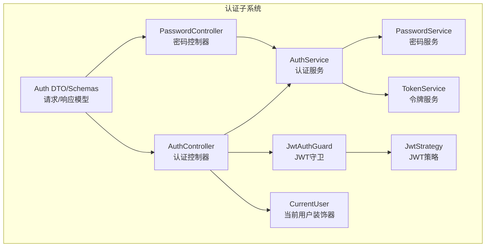
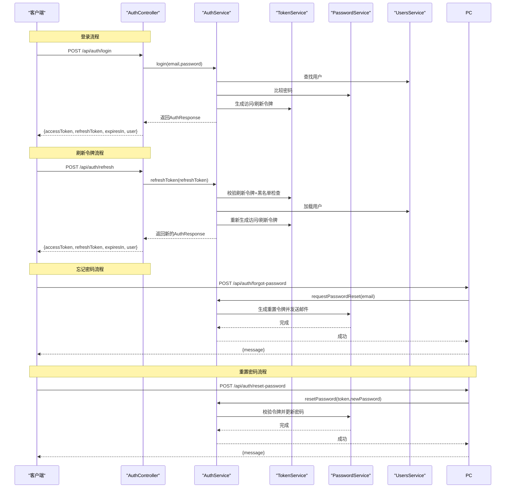
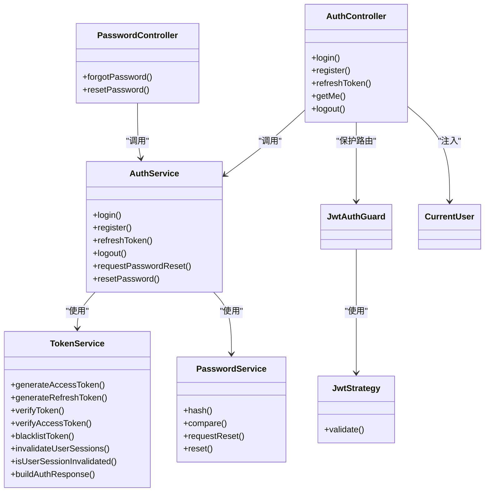
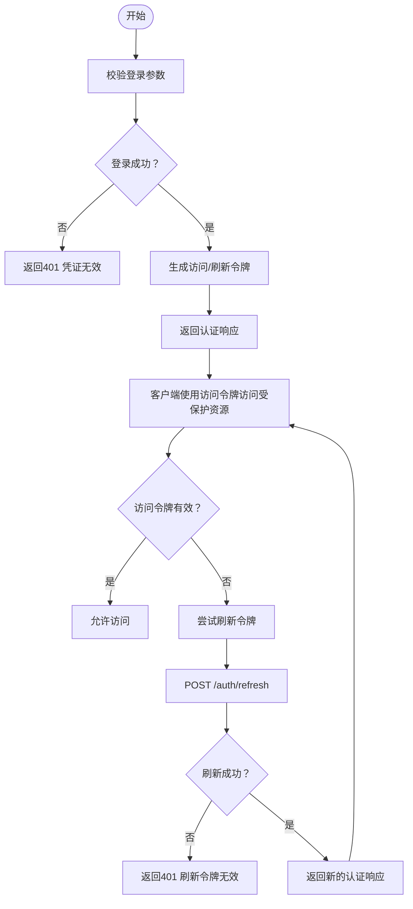

# 用户认证API

<cite>
**本文引用的文件**
- [apps/backend/src/auth/auth.controller.ts](file://apps/backend/src/auth/auth.controller.ts)
- [apps/backend/src/auth/password.controller.ts](file://apps/backend/src/auth/password.controller.ts)
- [apps/backend/src/auth/auth.service.ts](file://apps/backend/src/auth/auth.service.ts)
- [apps/backend/src/auth/password.service.ts](file://apps/backend/src/auth/password.service.ts)
- [apps/backend/src/auth/token.service.ts](file://apps/backend/src/auth/token.service.ts)
- [apps/backend/src/auth/auth.dto.ts](file://apps/backend/src/auth/auth.dto.ts)
- [apps/backend/src/auth/jwt-auth.guard.ts](file://apps/backend/src/auth/jwt-auth.guard.ts)
- [apps/backend/src/auth/current-user.decorator.ts](file://apps/backend/src/auth/current-user.decorator.ts)
- [apps/backend/src/auth/jwt.strategy.ts](file://apps/backend/src/auth/jwt.strategy.ts)
- [apps/backend/src/auth/auth.module.ts](file://apps/backend/src/auth/auth.module.ts)
- [packages/shared/src/schemas/auth.schema.ts](file://packages/shared/src/schemas/auth.schema.ts)
- [apps/backend/src/common/throttling/throttling.constants.ts](file://apps/backend/src/common/throttling/throttling.constants.ts)
- [apps/backend/tests/e2e/auth.e2e.spec.ts](file://apps/backend/tests/e2e/auth.e2e.spec.ts)
</cite>

## 目录
1. [简介](#简介)
2. [项目结构](#项目结构)
3. [核心组件](#核心组件)
4. [架构总览](#架构总览)
5. [详细组件分析](#详细组件分析)
6. [依赖关系分析](#依赖关系分析)
7. [性能考量](#性能考量)
8. [故障排查指南](#故障排查指南)
9. [结论](#结论)
10. [附录：请求/响应示例与错误对照](#附录请求响应示例与错误对照)

## 简介
本文件为用户认证模块的REST API文档，覆盖用户注册、登录、登出、令牌刷新、获取当前用户信息以及密码找回与重置等完整流程。文档同时说明JWT访问令牌与刷新令牌的生成、验证与失效机制，认证中间件的使用要求与安全注意事项，并提供典型场景的请求/响应示例及常见错误的解决方案。

## 项目结构
认证相关代码主要位于后端应用的auth目录，采用分层设计：
- 控制器：暴露REST端点，负责请求接收与响应返回
- 服务：封装业务逻辑，协调用户、令牌与邮件服务
- 策略与守卫：基于Passport/JWT实现认证与授权
- DTO与Schema：前后端共享的输入校验与输出模型
- 限流策略：对高频操作进行速率限制

图表来源
- [apps/backend/src/auth/auth.controller.ts:15-80](file://apps/backend/src/auth/auth.controller.ts#L15-L80)
- [apps/backend/src/auth/password.controller.ts:11-37](file://apps/backend/src/auth/password.controller.ts#L11-L37)
- [apps/backend/src/auth/auth.service.ts:12-126](file://apps/backend/src/auth/auth.service.ts#L12-L126)
- [apps/backend/src/auth/password.service.ts:9-99](file://apps/backend/src/auth/password.service.ts#L9-L99)
- [apps/backend/src/auth/token.service.ts:15-186](file://apps/backend/src/auth/token.service.ts#L15-L186)
- [apps/backend/src/auth/jwt.strategy.ts:19-67](file://apps/backend/src/auth/jwt.strategy.ts#L19-L67)
- [apps/backend/src/auth/jwt-auth.guard.ts:8-9](file://apps/backend/src/auth/jwt-auth.guard.ts#L8-L9)
- [apps/backend/src/auth/current-user.decorator.ts:8-18](file://apps/backend/src/auth/current-user.decorator.ts#L8-L18)
- [apps/backend/src/auth/auth.dto.ts:1-41](file://apps/backend/src/auth/auth.dto.ts#L1-L41)

章节来源
- [apps/backend/src/auth/auth.controller.ts:15-80](file://apps/backend/src/auth/auth.controller.ts#L15-L80)
- [apps/backend/src/auth/password.controller.ts:11-37](file://apps/backend/src/auth/password.controller.ts#L11-L37)
- [apps/backend/src/auth/auth.module.ts:19-39](file://apps/backend/src/auth/auth.module.ts#L19-L39)

## 核心组件
- 认证控制器：提供登录、注册、刷新、登出、获取当前用户信息等端点
- 密码控制器：提供忘记密码与重置密码端点
- 认证服务：整合用户、令牌与密码服务，提供统一认证入口
- 令牌服务：负责JWT签发、验证、黑名单与会话失效标记
- 密码服务：负责密码哈希、比较、重置令牌生成与有效期控制
- JWT策略与守卫：拦截受保护路由，验证访问令牌有效性
- DTO与Schema：前后端一致的输入校验与输出模型

章节来源
- [apps/backend/src/auth/auth.controller.ts:17-80](file://apps/backend/src/auth/auth.controller.ts#L17-L80)
- [apps/backend/src/auth/password.controller.ts:13-37](file://apps/backend/src/auth/password.controller.ts#L13-L37)
- [apps/backend/src/auth/auth.service.ts:12-126](file://apps/backend/src/auth/auth.service.ts#L12-L126)
- [apps/backend/src/auth/token.service.ts:15-186](file://apps/backend/src/auth/token.service.ts#L15-L186)
- [apps/backend/src/auth/password.service.ts:9-99](file://apps/backend/src/auth/password.service.ts#L9-L99)
- [apps/backend/src/auth/jwt.strategy.ts:19-67](file://apps/backend/src/auth/jwt.strategy.ts#L19-L67)
- [apps/backend/src/auth/jwt-auth.guard.ts:8-9](file://apps/backend/src/auth/jwt-auth.guard.ts#L8-L9)
- [apps/backend/src/auth/current-user.decorator.ts:8-18](file://apps/backend/src/auth/current-user.decorator.ts#L8-L18)
- [apps/backend/src/auth/auth.dto.ts:1-41](file://apps/backend/src/auth/auth.dto.ts#L1-L41)
- [packages/shared/src/schemas/auth.schema.ts:24-121](file://packages/shared/src/schemas/auth.schema.ts#L24-L121)

## 架构总览
认证系统采用“控制器-服务-策略/守卫”的分层架构，结合JWT与Redis实现短期访问令牌与长期刷新令牌的安全管理。

图表来源
- [apps/backend/src/auth/auth.controller.ts:23-48](file://apps/backend/src/auth/auth.controller.ts#L23-L48)
- [apps/backend/src/auth/password.controller.ts:18-36](file://apps/backend/src/auth/password.controller.ts#L18-L36)
- [apps/backend/src/auth/auth.service.ts:41-112](file://apps/backend/src/auth/auth.service.ts#L41-L112)
- [apps/backend/src/auth/token.service.ts:175-185](file://apps/backend/src/auth/token.service.ts#L175-L185)
- [apps/backend/src/auth/password.service.ts:38-89](file://apps/backend/src/auth/password.service.ts#L38-L89)

## 详细组件分析

### 认证控制器（AuthController）
- 路由前缀：/api/auth
- 主要端点：
  - POST /login：用户名+密码登录，返回访问令牌、刷新令牌与用户信息
  - POST /register：注册新用户，返回访问令牌、刷新令牌与用户信息
  - POST /refresh：使用刷新令牌换取新的访问令牌与刷新令牌
  - GET /me：在JWT守卫保护下返回当前登录用户信息
  - POST /logout：登出，清除浏览器中的访问/刷新令牌Cookie

章节来源
- [apps/backend/src/auth/auth.controller.ts:23-79](file://apps/backend/src/auth/auth.controller.ts#L23-L79)

### 密码控制器（PasswordController）
- 路由前缀：/api/auth
- 主要端点：
  - POST /forgot-password：根据邮箱发送密码重置链接
  - POST /reset-password：使用重置令牌与新密码重置账户密码

章节来源
- [apps/backend/src/auth/password.controller.ts:18-36](file://apps/backend/src/auth/password.controller.ts#L18-L36)

### 认证服务（AuthService）
- 职责：
  - 用户凭据校验与格式化
  - 统一构建认证响应（访问/刷新令牌）
  - 刷新令牌与登出流程的业务编排
  - 密码重置流程的委托

章节来源
- [apps/backend/src/auth/auth.service.ts:23-126](file://apps/backend/src/auth/auth.service.ts#L23-L126)

### 令牌服务（TokenService）
- 功能：
  - 生成访问令牌（短期）与刷新令牌（长期）
  - 验证访问/刷新令牌，区分类型与过期
  - 将令牌加入黑名单（基于Redis TTL）
  - 标记用户会话失效（通过Redis记录时间戳）
  - 检查用户会话是否被失效（对比iat与失效时间）

章节来源
- [apps/backend/src/auth/token.service.ts:78-185](file://apps/backend/src/auth/token.service.ts#L78-L185)

### 密码服务（PasswordService）
- 功能：
  - 密码哈希与比较
  - 生成重置令牌（明文与哈希），设置过期时间
  - 发送重置邮件（含前端重置链接）
  - 校验重置令牌并重置密码，同时使用户历史会话失效

章节来源
- [apps/backend/src/auth/password.service.ts:22-89](file://apps/backend/src/auth/password.service.ts#L22-L89)

### JWT策略与守卫
- JwtStrategy：从请求头解析Bearer令牌，验证访问令牌类型与有效性，检查用户是否存在与会话是否被失效
- JwtAuthGuard：用于保护受保护路由，确保仅持有有效访问令牌的请求可访问

章节来源
- [apps/backend/src/auth/jwt.strategy.ts:41-66](file://apps/backend/src/auth/jwt.strategy.ts#L41-L66)
- [apps/backend/src/auth/jwt-auth.guard.ts:8-9](file://apps/backend/src/auth/jwt-auth.guard.ts#L8-L9)

### 当前用户装饰器（CurrentUser）
- 作用：从请求对象中提取当前登录用户，支持按属性名取值或返回完整用户对象

章节来源
- [apps/backend/src/auth/current-user.decorator.ts:8-18](file://apps/backend/src/auth/current-user.decorator.ts#L8-L18)

### DTO与Schema（共享）
- 输入校验：登录、注册、刷新、登出、忘记密码、重置密码等请求体
- 输出模型：用户信息与认证响应（包含访问令牌、刷新令牌、过期时间与用户对象）

章节来源
- [apps/backend/src/auth/auth.dto.ts:15-40](file://apps/backend/src/auth/auth.dto.ts#L15-L40)
- [packages/shared/src/schemas/auth.schema.ts:24-121](file://packages/shared/src/schemas/auth.schema.ts#L24-L121)

## 依赖关系分析

图表来源
- [apps/backend/src/auth/auth.controller.ts:17-80](file://apps/backend/src/auth/auth.controller.ts#L17-L80)
- [apps/backend/src/auth/password.controller.ts:13-37](file://apps/backend/src/auth/password.controller.ts#L13-L37)
- [apps/backend/src/auth/auth.service.ts:14-21](file://apps/backend/src/auth/auth.service.ts#L14-L21)
- [apps/backend/src/auth/token.service.ts:15-45](file://apps/backend/src/auth/token.service.ts#L15-L45)
- [apps/backend/src/auth/password.service.ts:9-20](file://apps/backend/src/auth/password.service.ts#L9-L20)
- [apps/backend/src/auth/jwt.strategy.ts:19-36](file://apps/backend/src/auth/jwt.strategy.ts#L19-L36)
- [apps/backend/src/auth/jwt-auth.guard.ts:8-9](file://apps/backend/src/auth/jwt-auth.guard.ts#L8-L9)
- [apps/backend/src/auth/current-user.decorator.ts:8-18](file://apps/backend/src/auth/current-user.decorator.ts#L8-L18)

## 性能考量
- 令牌生成与验证：使用JWT签名与验证，CPU开销低；建议在生产环境启用独立的刷新密钥以增强安全性
- 会话失效与黑名单：通过Redis记录失效时间戳与黑名单TTL，避免频繁数据库查询
- 速率限制：针对登录、注册、刷新、忘记密码等端点设置不同窗口的限流策略，防止暴力破解与滥用
- 缓存与幂等：密码重置令牌哈希存储于数据库，配合Redis黑名单与会话失效，确保幂等性

[本节为通用性能讨论，不涉及具体文件分析]

## 故障排查指南
- 常见错误与原因
  - 凭证无效：登录时邮箱或密码不正确
  - 刷新令牌无效：令牌不在数据库或已被加入黑名单、类型非刷新令牌、用户不存在、会话被标记失效
  - 令牌过期或类型错误：访问令牌类型不符或已过期
  - 重置令牌无效：令牌不存在或已过期
  - 太多请求：触发限流策略
- 排查步骤
  - 确认请求头Authorization携带的是Bearer访问令牌
  - 检查刷新令牌是否仍在有效期内且未被加入黑名单
  - 确认用户存在且未被禁用
  - 检查Redis中是否存在对应键（如会话失效标记、黑名单）
  - 查看限流策略配置与当前窗口内的请求数量

章节来源
- [apps/backend/src/auth/auth.service.ts:44-92](file://apps/backend/src/auth/auth.service.ts#L44-L92)
- [apps/backend/src/auth/token.service.ts:103-125](file://apps/backend/src/auth/token.service.ts#L103-L125)
- [apps/backend/src/auth/password.service.ts:66-89](file://apps/backend/src/auth/password.service.ts#L66-L89)
- [apps/backend/tests/e2e/auth.e2e.spec.ts:123-242](file://apps/backend/tests/e2e/auth.e2e.spec.ts#L123-L242)

## 结论
本认证模块提供了完善的用户认证与密码管理能力，结合JWT与Redis实现了高可用的令牌生命周期管理，并通过限流与会话失效机制提升了安全性。建议在生产环境中：
- 明确配置JWT_SECRET与JWT_REFRESH_SECRET
- 合理设置令牌过期时间与限流策略
- 在客户端安全存储刷新令牌并使用HTTPS传输
- 对敏感操作增加二次验证与审计日志

[本节为总结性内容，不涉及具体文件分析]

## 附录：请求/响应示例与错误对照

### 端点一览与请求/响应说明
- POST /api/auth/login
  - 请求体字段：email（字符串，必填）、password（字符串，6-100字符）
  - 成功响应：包含accessToken、refreshToken、expiresIn与user
  - 可能错误：401 凭证无效
- POST /api/auth/register
  - 请求体字段：email（字符串，必填）、name（字符串，2-50字符）、password（字符串，6-100字符）
  - 成功响应：同上
  - 可能错误：400 输入校验失败（由共享Schema约束）
- POST /api/auth/refresh
  - 请求体字段：refreshToken（字符串，必填）
  - 成功响应：新的accessToken、refreshToken、expiresIn与user
  - 可能错误：401 刷新令牌无效
- GET /api/auth/me
  - 请求头：Authorization: Bearer <accessToken>
  - 成功响应：当前用户对象
  - 可能错误：401 令牌无效或过期
- POST /api/auth/logout
  - 请求体字段：refreshToken（字符串，必填）
  - 成功响应：{ message: "登出成功" }
  - 行为：清空浏览器中的accessToken与refreshToken Cookie
- POST /api/auth/forgot-password
  - 请求体字段：email（字符串，必填）
  - 成功响应：{ message: "如果该邮箱已注册，重置链接已发送到您的邮箱" }
  - 行为：若邮箱存在则发送重置链接
- POST /api/auth/reset-password
  - 请求体字段：token（字符串，必填）、password（字符串，6-100字符）
  - 成功响应：{ message: "密码重置成功，请使用新密码登录" }
  - 可能错误：400 重置令牌无效

章节来源
- [apps/backend/src/auth/auth.controller.ts:23-79](file://apps/backend/src/auth/auth.controller.ts#L23-L79)
- [apps/backend/src/auth/password.controller.ts:18-36](file://apps/backend/src/auth/password.controller.ts#L18-L36)
- [apps/backend/src/auth/auth.dto.ts:15-40](file://apps/backend/src/auth/auth.dto.ts#L15-L40)
- [packages/shared/src/schemas/auth.schema.ts:24-121](file://packages/shared/src/schemas/auth.schema.ts#L24-L121)
- [apps/backend/tests/e2e/auth.e2e.spec.ts:123-242](file://apps/backend/tests/e2e/auth.e2e.spec.ts#L123-L242)

### 令牌生成与刷新流程图

图表来源
- [apps/backend/src/auth/auth.controller.ts:23-48](file://apps/backend/src/auth/auth.controller.ts#L23-L48)
- [apps/backend/src/auth/auth.service.ts:41-93](file://apps/backend/src/auth/auth.service.ts#L41-L93)
- [apps/backend/src/auth/token.service.ts:175-185](file://apps/backend/src/auth/token.service.ts#L175-L185)

### 认证中间件与安全要求
- 使用JwtAuthGuard保护受保护路由（如GET /auth/me）
- 使用JwtStrategy验证访问令牌，确保类型为access且未被标记失效
- 登出时将刷新令牌加入黑名单，客户端同时清除Cookie
- 生产环境必须配置JWT_SECRET与JWT_REFRESH_SECRET，建议刷新密钥独立

章节来源
- [apps/backend/src/auth/jwt-auth.guard.ts:8-9](file://apps/backend/src/auth/jwt-auth.guard.ts#L8-L9)
- [apps/backend/src/auth/jwt.strategy.ts:41-66](file://apps/backend/src/auth/jwt.strategy.ts#L41-L66)
- [apps/backend/src/auth/auth.controller.ts:64-79](file://apps/backend/src/auth/auth.controller.ts#L64-L79)
- [apps/backend/src/auth/token.service.ts:127-170](file://apps/backend/src/auth/token.service.ts#L127-L170)

### 限流策略参考
- 登录：短窗口3次、中窗口5次、长窗口5次
- 注册：短窗口2次、中窗口3次、长窗口3次
- 刷新：短窗口5次、中窗口20次、长窗口60次
- 忘记密码：独立限流策略（见常量定义）

章节来源
- [apps/backend/src/common/throttling/throttling.constants.ts:90-106](file://apps/backend/src/common/throttling/throttling.constants.ts#L90-L106)
- [apps/backend/tests/e2e/auth.e2e.spec.ts:155-211](file://apps/backend/tests/e2e/auth.e2e.spec.ts#L155-L211)