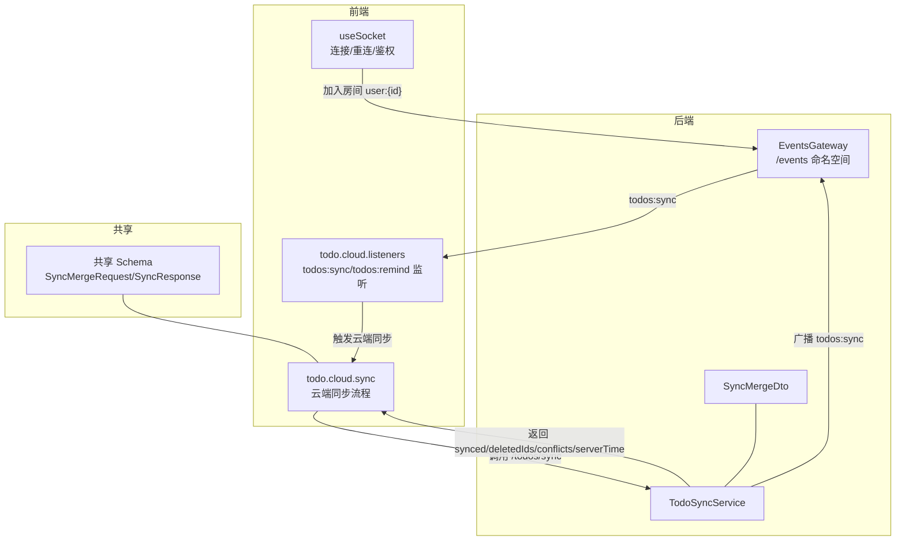
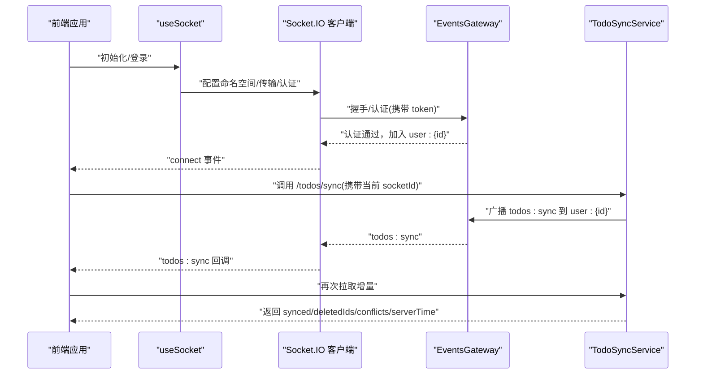
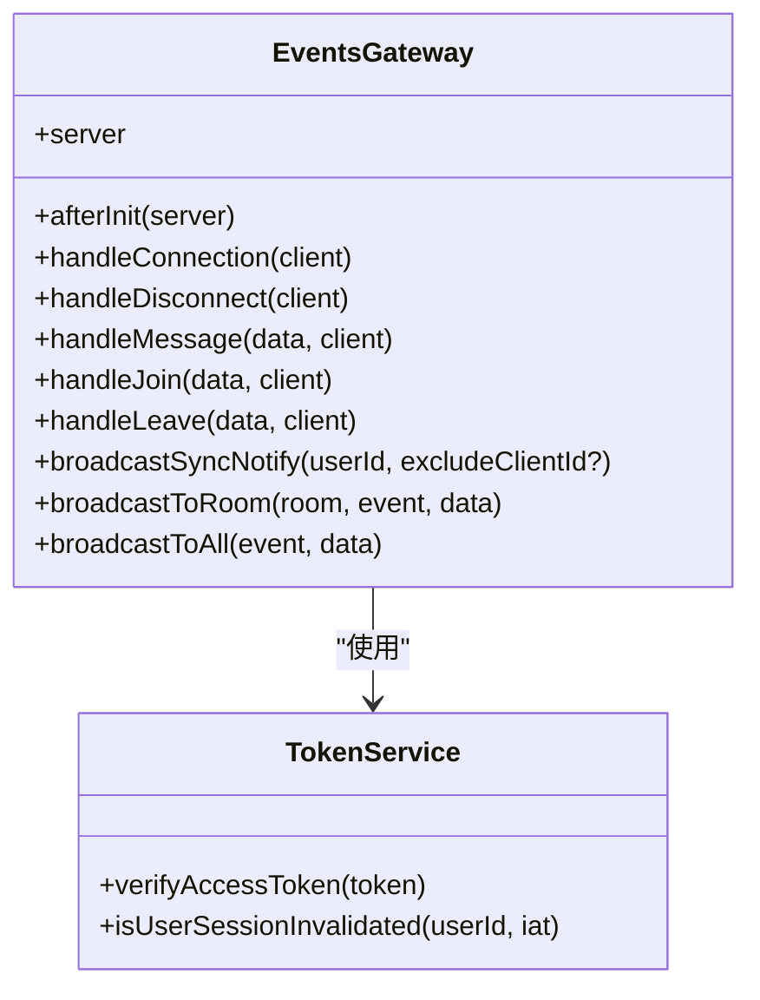
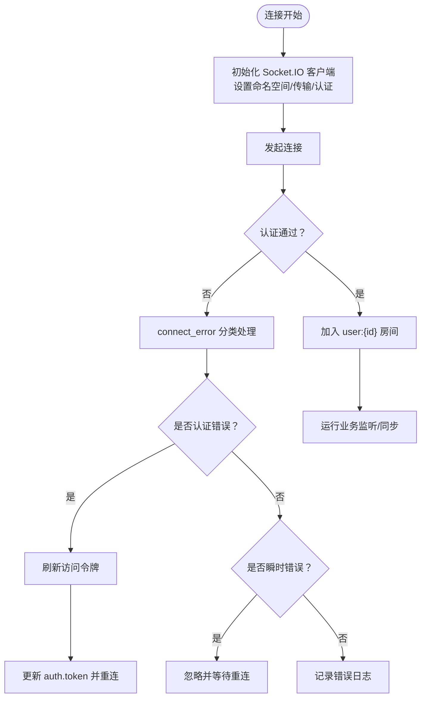
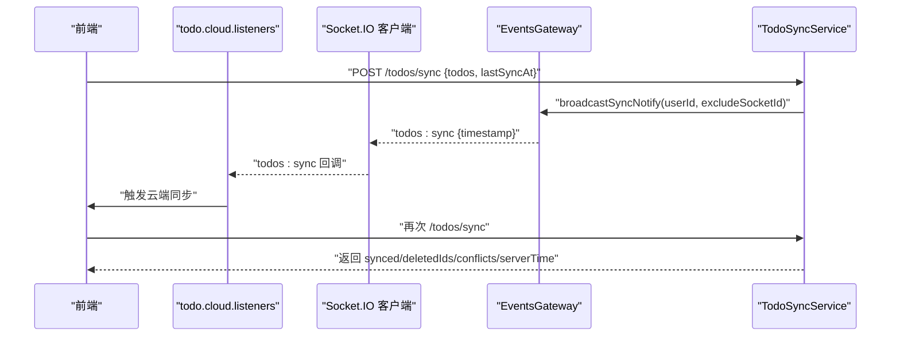
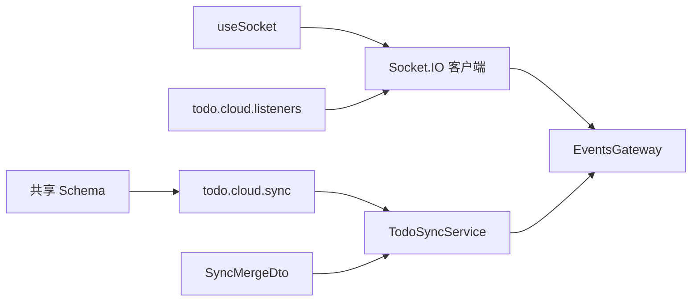

# WebSocket API

<cite>
**本文引用的文件**
- [apps/backend/src/events/events.gateway.ts](file://apps/backend/src/events/events.gateway.ts)
- [apps/backend/src/todos/todos-sync.service.ts](file://apps/backend/src/todos/todos-sync.service.ts)
- [apps/backend/src/todos/todos.dto.ts](file://apps/backend/src/todos/todos.dto.ts)
- [apps/frontend/src/composables/useSocket.ts](file://apps/frontend/src/composables/useSocket.ts)
- [apps/frontend/src/composables/useSocket.errors.ts](file://apps/frontend/src/composables/useSocket.errors.ts)
- [apps/frontend/src/features/todo/stores/todo.cloud.listeners.ts](file://apps/frontend/src/features/todo/stores/todo.cloud.listeners.ts)
- [apps/frontend/src/features/todo/stores/todo.cloud.sync.ts](file://apps/frontend/src/features/todo/stores/todo.cloud.sync.ts)
- [packages/shared/src/schemas/todo.schema.ts](file://packages/shared/src/schemas/todo.schema.ts)
</cite>

## 目录
1. [简介](#简介)
2. [项目结构](#项目结构)
3. [核心组件](#核心组件)
4. [架构总览](#架构总览)
5. [详细组件分析](#详细组件分析)
6. [依赖关系分析](#依赖关系分析)
7. [性能考量](#性能考量)
8. [故障排查指南](#故障排查指南)
9. [结论](#结论)
10. [附录](#附录)

## 简介
本文件面向 Lumina Todo 的 WebSocket 实时通信系统，系统基于 NestJS 的 @nestjs/websockets 与 socket.io，提供以下能力：
- 用户认证与授权：通过访问令牌校验，限制房间访问范围为“用户专属房间”
- 房间管理：自动加入用户房间；支持加入/离开房间；广播用户加入/离开事件
- 任务同步事件：服务端在关键变更后向用户房间广播“todos:sync”事件，触发客户端去拉取增量数据
- 聊天消息：支持点对点或房间内广播的消息事件
- 系统通知：当前实现包含“todos:remind”提醒事件，用于本地提醒与同步
- 客户端连接：统一的 useSocket 组合式函数封装连接、重连、鉴权与事件监听
- 错误处理：区分认证类与瞬时类错误，支持自动刷新令牌与指数退避重连
- 性能优化：服务端对广播做去抖，客户端对同步做冷却与防抖

## 项目结构
WebSocket 相关代码主要分布在后端网关与前端组合式函数中，并通过共享 DTO 与事件约定进行协作。

图示来源
- [apps/backend/src/events/events.gateway.ts:1-266](file://apps/backend/src/events/events.gateway.ts#L1-L266)
- [apps/backend/src/todos/todos-sync.service.ts:1-226](file://apps/backend/src/todos/todos-sync.service.ts#L1-L226)
- [apps/backend/src/todos/todos.dto.ts:1-5](file://apps/backend/src/todos/todos.dto.ts#L1-L5)
- [apps/frontend/src/composables/useSocket.ts:1-191](file://apps/frontend/src/composables/useSocket.ts#L1-L191)
- [apps/frontend/src/features/todo/stores/todo.cloud.listeners.ts:1-89](file://apps/frontend/src/features/todo/stores/todo.cloud.listeners.ts#L1-L89)
- [apps/frontend/src/features/todo/stores/todo.cloud.sync.ts:1-187](file://apps/frontend/src/features/todo/stores/todo.cloud.sync.ts#L1-L187)
- [packages/shared/src/schemas/todo.schema.ts:1-76](file://packages/shared/src/schemas/todo.schema.ts#L1-L76)

章节来源
- [apps/backend/src/events/events.gateway.ts:1-266](file://apps/backend/src/events/events.gateway.ts#L1-L266)
- [apps/frontend/src/composables/useSocket.ts:1-191](file://apps/frontend/src/composables/useSocket.ts#L1-L191)

## 核心组件
- 后端网关 EventsGateway
  - 认证中间件：从握手参数或 Authorization 头提取访问令牌，校验并写入 socket.data.user
  - 房间权限：ensureOwnRoomAccess 限制客户端只能访问自身房间 user:{userId}
  - 事件订阅：
    - message：支持指定房间广播或全站广播
    - join/leave：加入/离开房间，广播 user:joined/user:left
    - broadcastSyncNotify：对用户房间广播 todos:sync（含去抖）
  - 广播工具：broadcastToRoom/broadcastToAll
- 前端 useSocket
  - 初始化 socket.io 客户端，设置命名空间与传输方式
  - 认证：connect 时注入 auth.token，connect_error 中识别认证错误并刷新令牌后重连
  - 重连：指数退避，最大延迟上限
  - 事件：connect/disconnect/connect_error，自动加入 user:{id} 房间
- 任务同步
  - TodoSyncService：执行增量合并、冲突检测、生成 serverTime 与 deletedIds
  - 广播触发：当有成功更新项时，调用 EventsGateway.broadcastSyncNotify
  - 前端监听：todo.cloud.listeners 监听 todos:sync/todos:remind，触发云端同步

章节来源
- [apps/backend/src/events/events.gateway.ts:57-266](file://apps/backend/src/events/events.gateway.ts#L57-L266)
- [apps/frontend/src/composables/useSocket.ts:56-191](file://apps/frontend/src/composables/useSocket.ts#L56-L191)
- [apps/backend/src/todos/todos-sync.service.ts:42-226](file://apps/backend/src/todos/todos-sync.service.ts#L42-L226)

## 架构总览
WebSocket 采用“后端网关 + 前端组合式函数 + 共享 Schema”的分层设计，事件流如下：

图示来源
- [apps/frontend/src/composables/useSocket.ts:59-120](file://apps/frontend/src/composables/useSocket.ts#L59-L120)
- [apps/backend/src/events/events.gateway.ts:177-202](file://apps/backend/src/events/events.gateway.ts#L177-L202)
- [apps/backend/src/todos/todos-sync.service.ts:212-215](file://apps/backend/src/todos/todos-sync.service.ts#L212-L215)

## 详细组件分析

### 后端网关 EventsGateway
- 认证与握手
  - 从握手 auth 或 Authorization 头提取 token，verifyAccessToken 校验
  - 校验会话是否失效（如登出/换设备），失败则拒绝连接
- 房间与权限
  - 自动加入 user:{userId} 房间
  - ensureOwnRoomAccess 限制房间访问仅限本人房间
- 事件处理
  - message：支持 room 参数或广播；载荷包含 senderId/content/timestamp
  - join/leave：加入/离开房间并广播 user:joined/user:left
  - broadcastSyncNotify：对 user:{userId} 房间广播 todos:sync，内部使用定时器去抖
- 广播工具
  - broadcastToRoom/broadcastToAll：供其他服务调用

图示来源
- [apps/backend/src/events/events.gateway.ts:57-266](file://apps/backend/src/events/events.gateway.ts#L57-L266)

章节来源
- [apps/backend/src/events/events.gateway.ts:86-145](file://apps/backend/src/events/events.gateway.ts#L86-L145)
- [apps/backend/src/events/events.gateway.ts:150-175](file://apps/backend/src/events/events.gateway.ts#L150-L175)
- [apps/backend/src/events/events.gateway.ts:207-250](file://apps/backend/src/events/events.gateway.ts#L207-L250)
- [apps/backend/src/events/events.gateway.ts:177-202](file://apps/backend/src/events/events.gateway.ts#L177-L202)

### 前端 useSocket 组合式函数
- 连接参数
  - 命名空间：/events
  - 传输：websocket/polling（开发优先 polling，生产优先 websocket）
  - 认证：auth.token 注入到 socket.io
  - 重连：reconnectionAttempts=10，初始延迟1s，上限5s，随机化因子0.5
- 事件与行为
  - connect：标记连接状态与 socketId，自动加入 user:{userId} 房间
  - disconnect：清理状态
  - connect_error：识别认证错误与瞬时错误；认证错误时刷新令牌并重连
- 错误分类
  - 认证错误关键词：unauthorized/token/jwt/authentication
  - 瞬时错误关键词：timeout/transport close/error/websocket error/xhr poll/post error

图示来源
- [apps/frontend/src/composables/useSocket.ts:59-120](file://apps/frontend/src/composables/useSocket.ts#L59-L120)
- [apps/frontend/src/composables/useSocket.errors.ts:8-32](file://apps/frontend/src/composables/useSocket.errors.ts#L8-L32)

章节来源
- [apps/frontend/src/composables/useSocket.ts:56-191](file://apps/frontend/src/composables/useSocket.ts#L56-L191)
- [apps/frontend/src/composables/useSocket.errors.ts:1-33](file://apps/frontend/src/composables/useSocket.errors.ts#L1-L33)

### 任务同步事件与流程
- 服务端
  - TodoSyncService 接收客户端待同步的 todos 与 lastSyncAt
  - 执行事务性合并，检测墓碑、所有权与版本冲突
  - 返回 synced/deletedIds/conflicts/serverTime
  - 若有成功更新项，调用 EventsGateway.broadcastSyncNotify 广播 todos:sync
- 客户端
  - todo.cloud.listeners 监听 todos:sync/todos:remind
  - 当收到 todos:sync 且存在待同步任务或距离上次同步超过阈值时，触发云端同步
  - todo.cloud.sync 调用 /todos/sync，携带当前 socketId，以便服务端在广播时排除自身

图示来源
- [apps/backend/src/todos/todos-sync.service.ts:52-224](file://apps/backend/src/todos/todos-sync.service.ts#L52-L224)
- [apps/backend/src/events/events.gateway.ts:177-202](file://apps/backend/src/events/events.gateway.ts#L177-L202)
- [apps/frontend/src/features/todo/stores/todo.cloud.listeners.ts:24-31](file://apps/frontend/src/features/todo/stores/todo.cloud.listeners.ts#L24-L31)
- [apps/frontend/src/features/todo/stores/todo.cloud.sync.ts:47-74](file://apps/frontend/src/features/todo/stores/todo.cloud.sync.ts#L47-L74)

章节来源
- [apps/backend/src/todos/todos-sync.service.ts:42-226](file://apps/backend/src/todos/todos-sync.service.ts#L42-L226)
- [apps/frontend/src/features/todo/stores/todo.cloud.listeners.ts:1-89](file://apps/frontend/src/features/todo/stores/todo.cloud.listeners.ts#L1-L89)
- [apps/frontend/src/features/todo/stores/todo.cloud.sync.ts:1-187](file://apps/frontend/src/features/todo/stores/todo.cloud.sync.ts#L1-L187)

### 聊天消息与系统通知
- 聊天消息
  - 事件名：message
  - 载荷：content 必填；可选 room 字段
  - 行为：若指定房间则仅向该房间广播；否则广播给所有客户端（除发送者）
  - 权限：必须访问自身房间
- 系统通知
  - 事件名：todos:remind
  - 载荷：包含 todoId 与可选 remindedAt 时间戳
  - 行为：前端收到后更新本地提醒状态并提示

章节来源
- [apps/backend/src/events/events.gateway.ts:150-175](file://apps/backend/src/events/events.gateway.ts#L150-L175)
- [apps/frontend/src/features/todo/stores/todo.cloud.listeners.ts:33-45](file://apps/frontend/src/features/todo/stores/todo.cloud.listeners.ts#L33-L45)

### 房间管理与广播规则
- 房间命名
  - 用户房间：user:{userId}
  - 自动加入：连接成功后自动加入 user:{userId}
- 加入/离开
  - join/leave 事件要求房间名与当前用户一致
  - 成功后广播 user:joined/user:left
- 广播规则
  - 任务同步：todos:sync 发送至 user:{userId}，可选择排除某客户端
  - 聊天消息：指定房间广播或全站广播
  - 系统通知：todos:remind 由服务端按需触发

章节来源
- [apps/backend/src/events/events.gateway.ts:138-141](file://apps/backend/src/events/events.gateway.ts#L138-L141)
- [apps/backend/src/events/events.gateway.ts:207-250](file://apps/backend/src/events/events.gateway.ts#L207-L250)
- [apps/backend/src/events/events.gateway.ts:177-202](file://apps/backend/src/events/events.gateway.ts#L177-L202)

### 客户端连接示例与错误处理策略
- 连接示例（概念步骤）
  - 初始化 useSocket，传入当前访问令牌
  - 连接成功后自动加入 user:{userId} 房间
  - 监听 todos:sync/todos:remind，触发云端同步
- 错误处理
  - 认证错误：刷新令牌后重连
  - 瞬时错误：等待自动重连
  - 其他错误：记录日志并提示

章节来源
- [apps/frontend/src/composables/useSocket.ts:59-120](file://apps/frontend/src/composables/useSocket.ts#L59-L120)
- [apps/frontend/src/composables/useSocket.errors.ts:8-32](file://apps/frontend/src/composables/useSocket.errors.ts#L8-L32)

## 依赖关系分析
- 后端
  - EventsGateway 依赖 TokenService 进行认证
  - TodoSyncService 依赖 EventsGateway 进行广播
- 前端
  - todo.cloud.listeners 依赖 useSocket 提供的 socket 实例
  - todo.cloud.sync 依赖 todoApi 与共享 Schema

图示来源
- [apps/backend/src/events/events.gateway.ts:66](file://apps/backend/src/events/events.gateway.ts#L66)
- [apps/backend/src/todos/todos-sync.service.ts:43-47](file://apps/backend/src/todos/todos-sync.service.ts#L43-L47)
- [apps/frontend/src/features/todo/stores/todo.cloud.listeners.ts:61-73](file://apps/frontend/src/features/todo/stores/todo.cloud.listeners.ts#L61-L73)
- [apps/frontend/src/features/todo/stores/todo.cloud.sync.ts:58-64](file://apps/frontend/src/features/todo/stores/todo.cloud.sync.ts#L58-L64)
- [apps/backend/src/todos/todos.dto.ts:2](file://apps/backend/src/todos/todos.dto.ts#L2)
- [packages/shared/src/schemas/todo.schema.ts:40-68](file://packages/shared/src/schemas/todo.schema.ts#L40-L68)

章节来源
- [apps/backend/src/events/events.gateway.ts:57-266](file://apps/backend/src/events/events.gateway.ts#L57-L266)
- [apps/backend/src/todos/todos-sync.service.ts:42-226](file://apps/backend/src/todos/todos-sync.service.ts#L42-L226)
- [apps/frontend/src/composables/useSocket.ts:56-191](file://apps/frontend/src/composables/useSocket.ts#L56-L191)

## 性能考量
- 服务端广播去抖
  - 对同一用户在短时间内多次变更，使用定时器合并为一次广播，降低广播风暴
- 客户端同步冷却与防抖
  - 云端同步存在冷却时间与防抖策略，避免频繁请求
- 传输与重连
  - 生产环境优先 websocket，开发环境兼容 polling
  - 指数退避与上限控制，减少网络压力
- 数据模型与查询
  - 服务端按 lastSyncAt 过滤增量变更，避免重复传输

章节来源
- [apps/backend/src/events/events.gateway.ts:177-202](file://apps/backend/src/events/events.gateway.ts#L177-L202)
- [apps/frontend/src/features/todo/stores/todo.cloud.sync.ts:15-156](file://apps/frontend/src/features/todo/stores/todo.cloud.sync.ts#L15-L156)
- [apps/frontend/src/composables/useSocket.ts:14-15](file://apps/frontend/src/composables/useSocket.ts#L14-L15)
- [apps/backend/src/todos/todos-sync.service.ts:182-192](file://apps/backend/src/todos/todos-sync.service.ts#L182-L192)

## 故障排查指南
- 连接失败
  - 检查 CORS 配置与 allowedHeaders 是否包含必要头部
  - 确认握手时携带 token，且未过期或被标记失效
- 认证错误
  - 前端识别 connect_error 中包含认证关键字时，自动刷新令牌并重连
  - 后端 afterInit 中对 token 校验失败会拒绝连接
- 瞬时错误
  - 超时、传输关闭、轮询错误等被视为瞬时错误，等待自动重连
- 广播未到达
  - 确认客户端已加入 user:{userId} 房间
  - 检查 broadcastSyncNotify 是否被去抖定时器覆盖
- 事件未触发
  - 前端 listeners 是否正确绑定 todos:sync/todos:remind
  - 云端同步是否满足冷却与待同步条件

章节来源
- [apps/backend/src/events/events.gateway.ts:20-56](file://apps/backend/src/events/events.gateway.ts#L20-L56)
- [apps/backend/src/events/events.gateway.ts:86-116](file://apps/backend/src/events/events.gateway.ts#L86-L116)
- [apps/frontend/src/composables/useSocket.errors.ts:8-32](file://apps/frontend/src/composables/useSocket.errors.ts#L8-L32)
- [apps/frontend/src/features/todo/stores/todo.cloud.listeners.ts:61-73](file://apps/frontend/src/features/todo/stores/todo.cloud.listeners.ts#L61-L73)

## 结论
本 WebSocket 实时通信系统通过严格的认证与房间权限控制，结合服务端广播去抖与客户端冷却防抖策略，在保证一致性的同时兼顾了性能与稳定性。任务同步、聊天消息与系统通知三大事件族覆盖了核心交互场景，配合统一的错误分类与重连机制，能够有效应对网络波动与认证失效等异常情况。

## 附录

### 事件与载荷规范
- 通用
  - 事件名：字符串
  - 载荷：对象，包含业务所需字段
  - 时间戳：ISO 8601 字符串
- message
  - 事件名：message
  - 载荷字段：content（必填）、room（可选）
  - 行为：指定房间广播或全站广播
- join/leave
  - 事件名：join/leave
  - 载荷字段：room（必填）
  - 行为：加入/离开房间并广播 user:joined/user:left
- todos:sync
  - 事件名：todos:sync
  - 载荷字段：timestamp（必填）
  - 触发：服务端在关键变更后对 user:{userId} 房间广播
- todos:remind
  - 事件名：todos:remind
  - 载荷字段：todoId（必填）、remindedAt（可选）
  - 行为：前端收到后更新本地提醒状态

章节来源
- [apps/backend/src/events/events.gateway.ts:150-175](file://apps/backend/src/events/events.gateway.ts#L150-L175)
- [apps/backend/src/events/events.gateway.ts:207-250](file://apps/backend/src/events/events.gateway.ts#L207-L250)
- [apps/backend/src/events/events.gateway.ts:177-202](file://apps/backend/src/events/events.gateway.ts#L177-L202)
- [apps/frontend/src/features/todo/stores/todo.cloud.listeners.ts:33-45](file://apps/frontend/src/features/todo/stores/todo.cloud.listeners.ts#L33-L45)

### 连接参数与配置
- 命名空间：/events
- 传输：websocket/polling（开发优先 polling，生产优先 websocket）
- 认证：auth.token 注入
- 重连：最多 10 次，初始延迟 1s，上限 5s，随机化因子 0.5
- CORS：允许特定 origin 与必要头部，生产环境允许空 origin

章节来源
- [apps/frontend/src/composables/useSocket.ts:64-77](file://apps/frontend/src/composables/useSocket.ts#L64-L77)
- [apps/backend/src/events/events.gateway.ts:20-56](file://apps/backend/src/events/events.gateway.ts#L20-L56)

### 数据模型与同步协议
- 请求体（SyncMergeRequest）
  - todos：数组，元素为 Todo 对象
  - lastSyncAt：可选，时间戳或 ISO 字符串
- 响应体（SyncResponse）
  - synced：数组，服务端返回的 Todo 对象
  - deletedIds：数组，删除项 ID
  - acceptedIds：数组，被接受的 ID
  - conflicts：数组，冲突项（含 id、reason、serverVersion）
  - serverTime：服务端时间戳

章节来源
- [packages/shared/src/schemas/todo.schema.ts:40-68](file://packages/shared/src/schemas/todo.schema.ts#L40-L68)
- [apps/backend/src/todos/todos.dto.ts:2](file://apps/backend/src/todos/todos.dto.ts#L2)