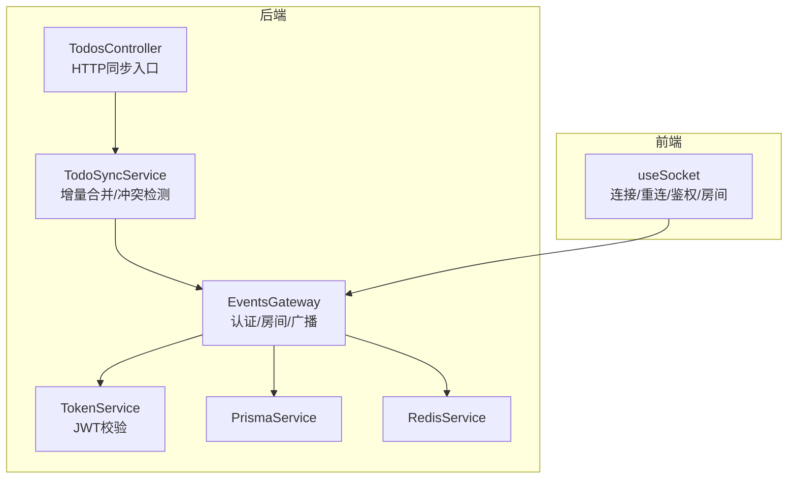
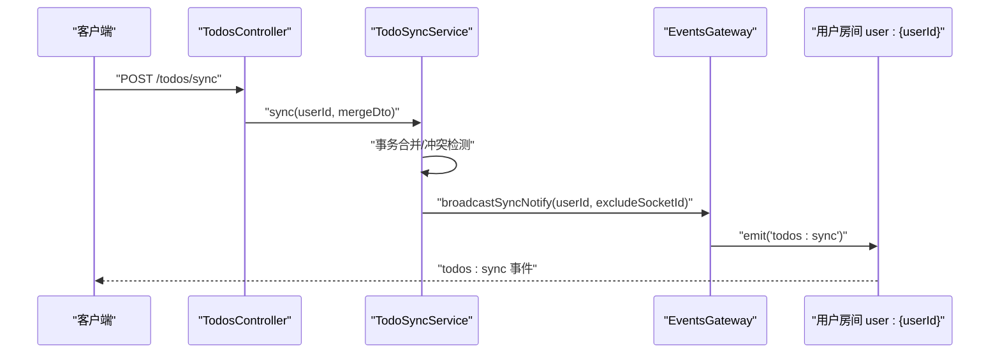
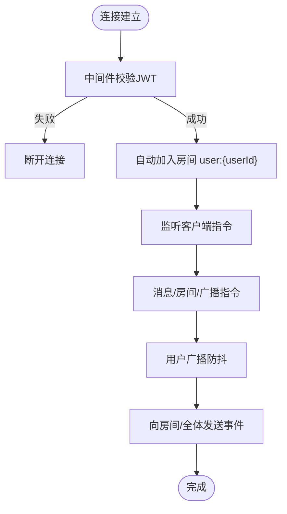
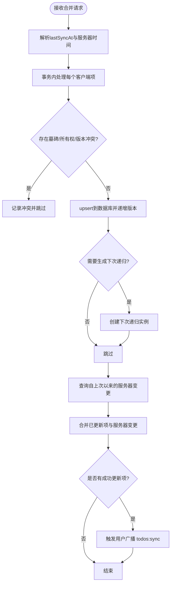
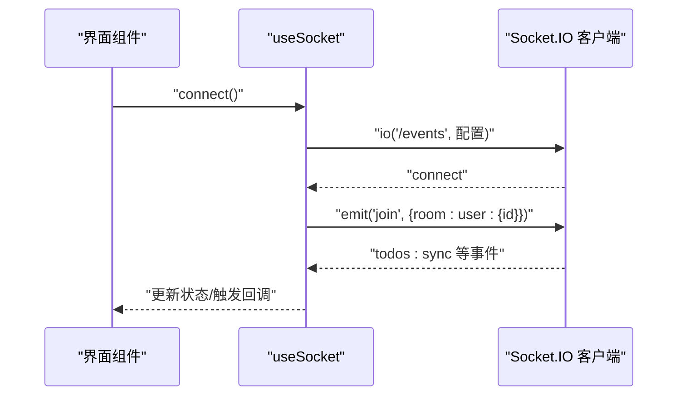
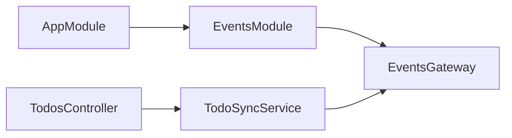

# 实时事件API

<cite>
**本文引用的文件**
- [apps/backend/src/events/events.gateway.ts](file://apps/backend/src/events/events.gateway.ts)
- [apps/backend/src/events/events.module.ts](file://apps/backend/src/events/events.module.ts)
- [apps/backend/src/todos/todos-sync.service.ts](file://apps/backend/src/todos/todos-sync.service.ts)
- [apps/backend/src/todos/todos.controller.ts](file://apps/backend/src/todos/todos.controller.ts)
- [apps/backend/src/todos/todos.dto.ts](file://apps/backend/src/todos/todos.dto.ts)
- [apps/frontend/src/composables/useSocket.ts](file://apps/frontend/src/composables/useSocket.ts)
- [packages/shared/src/schemas/todo.schema.ts](file://packages/shared/src/schemas/todo.schema.ts)
- [apps/backend/src/app.module.ts](file://apps/backend/src/app.module.ts)
- [apps/backend/tests/events/events.gateway.spec.ts](file://apps/backend/tests/events/events.gateway.spec.ts)
</cite>

## 目录
1. [简介](#简介)
2. [项目结构](#项目结构)
3. [核心组件](#核心组件)
4. [架构总览](#架构总览)
5. [详细组件分析](#详细组件分析)
6. [依赖关系分析](#依赖关系分析)
7. [性能考量](#性能考量)
8. [故障排查指南](#故障排查指南)
9. [结论](#结论)
10. [附录](#附录)

## 简介
本文件面向后端与前端开发者，系统化阐述基于 NestJS + Socket.IO 的实时事件推送API，覆盖事件订阅、连接管理、消息广播、用户房间隔离、任务同步通知、系统消息推送、连接重连与心跳、异常恢复、事件过滤与权限控制、消息去重、连接池与内存优化、并发处理策略，并提供客户端连接示例、事件监听器与调试工具使用指南。

## 项目结构
实时事件子系统由以下关键部分组成：
- 后端网关与模块：WebSocket 网关负责认证、房间管理、广播；事件模块导出网关供应用启动。
- 业务服务：任务同步服务在完成增量合并后触发用户房间广播。
- 前端组合式函数：封装 Socket.IO 客户端连接、重连、鉴权、房间加入与事件监听。
- 共享数据模型：统一的待办事项与同步Schema，保障前后端一致性。

图表来源
- [apps/backend/src/events/events.gateway.ts:1-266](file://apps/backend/src/events/events.gateway.ts#L1-L266)
- [apps/backend/src/todos/todos-sync.service.ts:1-221](file://apps/backend/src/todos/todos-sync.service.ts#L1-L221)
- [apps/backend/src/todos/todos.controller.ts:1-70](file://apps/backend/src/todos/todos.controller.ts#L1-L70)
- [apps/frontend/src/composables/useSocket.ts:1-176](file://apps/frontend/src/composables/useSocket.ts#L1-L176)

章节来源
- [apps/backend/src/events/events.module.ts:1-15](file://apps/backend/src/events/events.module.ts#L1-L15)
- [apps/backend/src/app.module.ts:1-175](file://apps/backend/src/app.module.ts#L1-L175)

## 核心组件
- WebSocket 网关（EventsGateway）
  - 认证中间件：通过握手头部或auth携带的访问令牌进行JWT校验，并检查会话是否失效。
  - 房间管理：自动将已认证用户加入其专属房间 user:{userId}；提供加入/离开房间指令，强制仅允许访问自身房间。
  - 广播机制：支持向指定房间或全体广播；对用户级广播做后端防抖，避免频繁重复通知。
  - 事件处理：订阅客户端消息、房间加入/离开等指令。
- 任务同步服务（TodoSyncService）
  - 增量合并：事务内执行客户端推送变更，冲突检测（墓碑、所有权、版本号），生成服务器变更集。
  - 通知广播：当有成功更新项时，向用户房间广播“todos:sync”事件，触发其他设备同步。
- 前端 Socket 组合式函数（useSocket）
  - 初始化：设置凭证、传输协议、重连参数、鉴权路径与命名空间。
  - 连接生命周期：连接、断开、等待连接；在认证状态变化时自动连接/断开。
  - 事件监听：连接成功后自动加入用户房间；监听服务端事件并处理重连与认证错误。
- 共享Schema（todo.schema.ts）
  - 定义待办事项、同步项、批量合并请求与响应、冲突类型等数据结构，确保前后端一致。

章节来源
- [apps/backend/src/events/events.gateway.ts:1-266](file://apps/backend/src/events/events.gateway.ts#L1-L266)
- [apps/backend/src/todos/todos-sync.service.ts:1-221](file://apps/backend/src/todos/todos-sync.service.ts#L1-L221)
- [apps/frontend/src/composables/useSocket.ts:1-176](file://apps/frontend/src/composables/useSocket.ts#L1-L176)
- [packages/shared/src/schemas/todo.schema.ts:1-75](file://packages/shared/src/schemas/todo.schema.ts#L1-L75)

## 架构总览
下图展示从HTTP同步到WebSocket广播的端到端流程，以及客户端连接与房间加入的关键交互。

图表来源
- [apps/backend/src/todos/todos.controller.ts:30-38](file://apps/backend/src/todos/todos.controller.ts#L30-L38)
- [apps/backend/src/todos/todos-sync.service.ts:207-210](file://apps/backend/src/todos/todos-sync.service.ts#L207-L210)
- [apps/backend/src/events/events.gateway.ts:180-202](file://apps/backend/src/events/events.gateway.ts#L180-L202)

## 详细组件分析

### WebSocket 网关（EventsGateway）
- 认证与握手
  - 通过中间件从握手auth或Authorization头提取令牌，校验JWT并检查会话失效。
  - 通过 socket.data.user 注入用户信息，供后续房间与权限判断使用。
- 房间与权限
  - 自动加入 user:{userId} 房间；加入/离开房间指令均强制校验目标房间必须为自身房间。
  - 对消息发送指令支持指定房间或全量广播，房间内广播自动排除发送者（可选）。
- 广播与防抖
  - 用户级广播采用后端防抖：同一用户在短时间内多次触发，仅在最后一批合并后发送一次通知，降低广播风暴。
- 生命周期
  - 初始化日志、模块销毁清理定时器，避免内存泄漏。

图表来源
- [apps/backend/src/events/events.gateway.ts:86-145](file://apps/backend/src/events/events.gateway.ts#L86-L145)
- [apps/backend/src/events/events.gateway.ts:180-202](file://apps/backend/src/events/events.gateway.ts#L180-L202)

章节来源
- [apps/backend/src/events/events.gateway.ts:1-266](file://apps/backend/src/events/events.gateway.ts#L1-L266)
- [apps/backend/tests/events/events.gateway.spec.ts:1-59](file://apps/backend/tests/events/events.gateway.spec.ts#L1-L59)

### 任务同步服务（TodoSyncService）
- 增量合并与冲突检测
  - 使用数据库事务处理客户端推送变更，先查墓碑、再查现有记录，严格比对版本号，拒绝不一致更新。
  - 对重复/递归场景计算有效规则与下次生成时间，必要时插入下一次递归实例。
- 服务器端变更拉取
  - 基于 lastSyncAt 拉取自上次同步以来的服务器变更，过滤掉已成功更新的项，合并返回。
- 广播通知
  - 当存在成功更新项时，调用网关的用户广播方法，触发“todos:sync”事件，通知其他在线设备。

图表来源
- [apps/backend/src/todos/todos-sync.service.ts:51-219](file://apps/backend/src/todos/todos-sync.service.ts#L51-L219)

章节来源
- [apps/backend/src/todos/todos-sync.service.ts:1-221](file://apps/backend/src/todos/todos-sync.service.ts#L1-L221)
- [apps/backend/src/todos/todos.controller.ts:30-38](file://apps/backend/src/todos/todos.controller.ts#L30-L38)

### 前端 Socket 组合式函数（useSocket）
- 初始化与连接
  - 设置 withCredentials、传输协议优先级、重连次数与延迟、鉴权路径与命名空间。
  - 在 connect 时注入当前token，若未连接则发起连接。
- 事件监听与房间加入
  - 连接成功后，若存在用户id则自动发送加入房间指令。
  - 监听断开与连接错误事件，针对认证错误尝试刷新token并重新连接。
- 等待连接
  - 提供超时等待连接完成的辅助方法，便于在连接就绪后再执行业务操作。

图表来源
- [apps/frontend/src/composables/useSocket.ts:25-96](file://apps/frontend/src/composables/useSocket.ts#L25-L96)
- [apps/frontend/src/composables/useSocket.ts:116-146](file://apps/frontend/src/composables/useSocket.ts#L116-L146)

章节来源
- [apps/frontend/src/composables/useSocket.ts:1-176](file://apps/frontend/src/composables/useSocket.ts#L1-L176)

### 事件类型与消息格式
- 事件类型
  - 客户端到服务端：message、join、leave。
  - 服务端到客户端：message、user:joined、user:left、todos:sync。
- 消息格式
  - message：包含发送者标识、内容与时间戳。
  - user:joined/user:left：包含用户ID与房间名。
  - todos:sync：包含时间戳，用于触发客户端同步。
- 共享Schema
  - 待办事项、同步项、批量合并请求与响应、冲突类型等，确保前后端一致的数据结构。

章节来源
- [apps/backend/src/events/events.gateway.ts:150-250](file://apps/backend/src/events/events.gateway.ts#L150-L250)
- [packages/shared/src/schemas/todo.schema.ts:1-75](file://packages/shared/src/schemas/todo.schema.ts#L1-L75)

### 权限控制与事件过滤
- 房间权限
  - 加入/离开/消息发送均要求目标房间为 user:{userId}，否则抛出异常。
- 认证与会话有效性
  - 中间件校验JWT并检查会话是否失效，未认证连接将被断开。
- 事件过滤
  - 广播时可选择排除特定客户端ID，避免向发送者回推消息。

章节来源
- [apps/backend/src/events/events.gateway.ts:77-84](file://apps/backend/src/events/events.gateway.ts#L77-L84)
- [apps/backend/src/events/events.gateway.ts:90-115](file://apps/backend/src/events/events.gateway.ts#L90-L115)

### 连接重连、心跳与异常恢复
- 重连策略
  - 前端设置最大重连次数与指数退避，避免瞬时网络波动导致频繁重建。
- 心跳与保活
  - Socket.IO 默认内置心跳与探测，结合后端传输协议（websocket/polling）提升稳定性。
- 异常恢复
  - 连接错误时识别认证类错误，尝试刷新token并重新连接；断开时清理状态。

章节来源
- [apps/frontend/src/composables/useSocket.ts:35-38](file://apps/frontend/src/composables/useSocket.ts#L35-L38)
- [apps/frontend/src/composables/useSocket.ts:60-93](file://apps/frontend/src/composables/useSocket.ts#L60-L93)

### 广播与去重机制
- 用户广播防抖
  - 后端对同一用户的广播在短时间内合并，仅发送最后一次结果，避免风暴。
- 去重与幂等
  - 客户端在收到 todos:sync 后，结合本地状态与冲突集合进行去重与幂等处理，避免重复应用。

章节来源
- [apps/backend/src/events/events.gateway.ts:180-202](file://apps/backend/src/events/events.gateway.ts#L180-L202)
- [apps/backend/src/todos/todos-sync.service.ts:207-210](file://apps/backend/src/todos/todos-sync.service.ts#L207-L210)

### 连接池管理、内存优化与并发策略
- 连接池与传输
  - 后端启用 websocket 与 polling 两种传输，优先使用 websocket 降低轮询开销。
- 内存优化
  - 模块销毁时清理广播定时器，避免泄漏；前端单例管理Socket实例，避免重复创建。
- 并发处理
  - 任务同步使用数据库事务保证原子性；广播在事件循环之外触发，避免阻塞请求。

章节来源
- [apps/backend/src/events/events.gateway.ts:54-56](file://apps/backend/src/events/events.gateway.ts#L54-L56)
- [apps/backend/src/events/events.gateway.ts:118-124](file://apps/backend/src/events/events.gateway.ts#L118-L124)
- [apps/frontend/src/composables/useSocket.ts:5-8](file://apps/frontend/src/composables/useSocket.ts#L5-L8)

## 依赖关系分析
- 模块依赖
  - AppModule 导入 EventsModule，使网关成为应用的一部分。
  - TodosModule 通过 TodoSyncService 间接依赖 EventsGateway。
- 组件耦合
  - TodoSyncService 与 EventsGateway 通过接口解耦，便于测试与替换。
- 外部依赖
  - Socket.IO 服务端与客户端；Prisma 作为ORM；Redis 用于缓存（在其他模块中使用）。

图表来源
- [apps/backend/src/app.module.ts:155-155](file://apps/backend/src/app.module.ts#L155-L155)
- [apps/backend/src/events/events.module.ts:9-14](file://apps/backend/src/events/events.module.ts#L9-L14)
- [apps/backend/src/todos/todos.controller.ts:25-28](file://apps/backend/src/todos/todos.controller.ts#L25-L28)

章节来源
- [apps/backend/src/app.module.ts:1-175](file://apps/backend/src/app.module.ts#L1-L175)
- [apps/backend/src/events/events.module.ts:1-15](file://apps/backend/src/events/events.module.ts#L1-L15)

## 性能考量
- 传输协议优先级：前端优先使用 websocket，减少 polling 带来的额外开销与错误。
- 广播防抖：后端对用户级广播进行合并，降低网络与CPU压力。
- 事务合并：数据库层事务保证一致性，减少回滚与重复写入。
- 连接复用：前端单例管理 Socket 实例，避免重复握手与资源浪费。

## 故障排查指南
- 认证失败
  - 现象：连接被拒绝或立即断开。
  - 排查：确认握手auth或Authorization头携带的token有效且未失效；检查服务端日志与TokenService行为。
- 房间访问被拒
  - 现象：加入/离开/发送消息时报 forbidden room。
  - 排查：确认目标房间为 user:{当前用户ID}；检查中间件注入的用户信息。
- 广播未到达
  - 现象：客户端未收到 todos:sync。
  - 排查：确认服务端广播防抖逻辑是否生效；检查客户端是否在正确的房间；核对excludeClientId参数。
- 连接不稳定
  - 现象：频繁断开/重连。
  - 排查：调整重连参数；检查网络与Nginx配置；确认path与命名空间一致。

章节来源
- [apps/backend/src/events/events.gateway.ts:90-115](file://apps/backend/src/events/events.gateway.ts#L90-L115)
- [apps/backend/src/events/events.gateway.ts:180-202](file://apps/backend/src/events/events.gateway.ts#L180-L202)
- [apps/frontend/src/composables/useSocket.ts:60-93](file://apps/frontend/src/composables/useSocket.ts#L60-L93)

## 结论
该实时事件API通过严格的认证与房间权限控制、事务化的任务同步、后端广播防抖与前端智能重连，构建了稳定高效的跨设备同步体验。建议在生产环境中结合Nginx反向代理与合适的超时/缓冲配置，持续监控广播频率与连接数，确保系统在高并发下的稳定性与低延迟。

## 附录

### 客户端连接示例与事件监听器
- 连接与鉴权
  - 使用 useSocket 初始化连接，自动注入token；连接成功后自动加入用户房间。
- 事件监听
  - 监听 todos:sync 事件以触发本地同步；监听 user:joined/user:left 以维护在线列表。
- 超时等待
  - 使用 waitForConnection 在关键操作前确保连接可用。

章节来源
- [apps/frontend/src/composables/useSocket.ts:25-96](file://apps/frontend/src/composables/useSocket.ts#L25-L96)
- [apps/frontend/src/composables/useSocket.ts:116-146](file://apps/frontend/src/composables/useSocket.ts#L116-L146)

### 调试工具使用指南
- 浏览器开发者工具
  - Network 面板观察 WebSocket 协商与事件收发；Console 查看连接错误与认证日志。
- 后端日志
  - 关注 WebSocket 网关初始化、认证失败、房间加入/离开、广播触发等关键日志。
- 单元测试参考
  - 事件网关权限测试用例可帮助验证房间访问控制与异常分支。

章节来源
- [apps/backend/tests/events/events.gateway.spec.ts:1-59](file://apps/backend/tests/events/events.gateway.spec.ts#L1-L59)