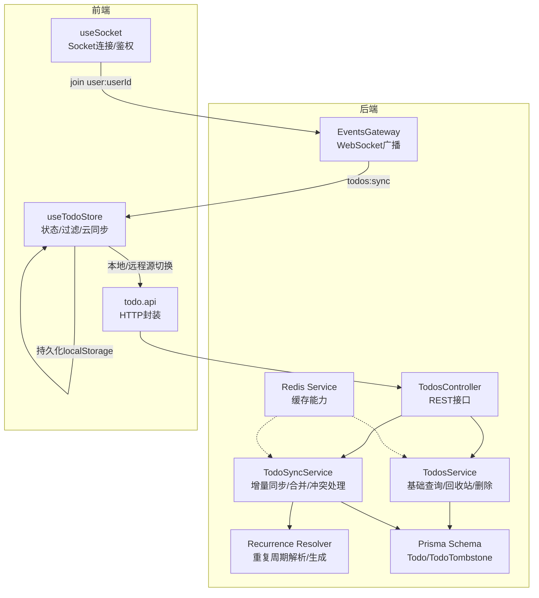
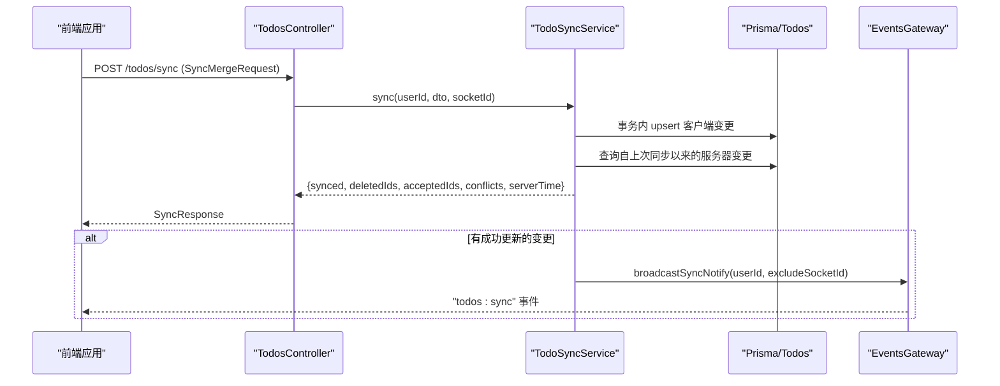
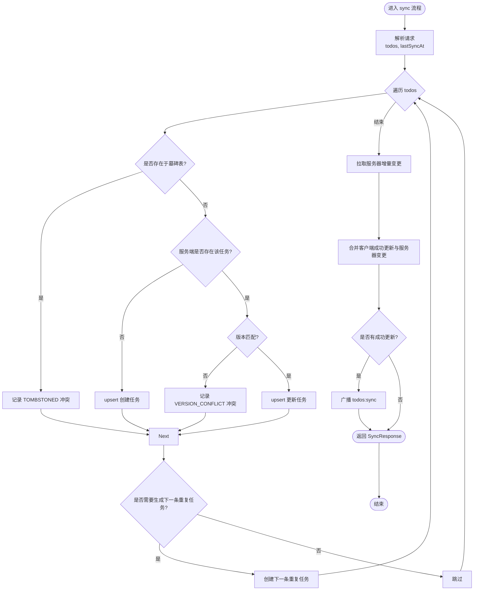
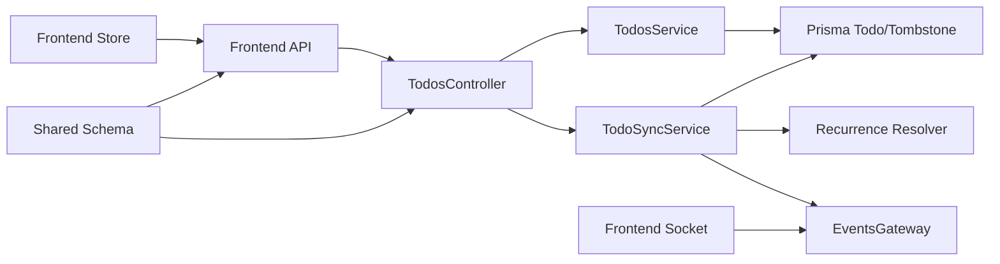

# 待办事项API

<cite>
**本文档引用的文件**
- [apps/backend/src/todos/todos.controller.ts](file://apps/backend/src/todos/todos.controller.ts)
- [apps/backend/src/todos/todos.service.ts](file://apps/backend/src/todos/todos.service.ts)
- [apps/backend/src/todos/todos-sync.service.ts](file://apps/backend/src/todos/todos-sync.service.ts)
- [apps/backend/src/todos/todos-sync.recurrence.ts](file://apps/backend/src/todos/todos-sync.recurrence.ts)
- [apps/backend/src/todos/todos.dto.ts](file://apps/backend/src/todos/todos.dto.ts)
- [apps/backend/prisma/schema/todo.prisma](file://apps/backend/prisma/schema/todo.prisma)
- [packages/shared/src/schemas/todo.schema.ts](file://packages/shared/src/schemas/todo.schema.ts)
- [apps/backend/src/events/events.gateway.ts](file://apps/backend/src/events/events.gateway.ts)
- [apps/frontend/src/features/todo/api/index.ts](file://apps/frontend/src/features/todo/api/index.ts)
- [apps/frontend/src/features/todo/stores/todo.store.ts](file://apps/frontend/src/features/todo/stores/todo.store.ts)
- [apps/frontend/src/features/todo/stores/todo.filtering.ts](file://apps/frontend/src/features/todo/stores/todo.filtering.ts)
- [apps/frontend/src/composables/useSocket.ts](file://apps/frontend/src/composables/useSocket.ts)
- [apps/backend/src/common/filters/all-exceptions.filter.ts](file://apps/backend/src/common/filters/all-exceptions.filter.ts)
- [apps/backend/src/redis/redis.service.ts](file://apps/backend/src/redis/redis.service.ts)
</cite>

## 目录
1. [简介](#简介)
2. [项目结构](#项目结构)
3. [核心组件](#核心组件)
4. [架构总览](#架构总览)
5. [详细组件分析](#详细组件分析)
6. [依赖分析](#依赖分析)
7. [性能考虑](#性能考虑)
8. [故障排查指南](#故障排查指南)
9. [结论](#结论)
10. [附录](#附录)

## 简介
本文件面向待办事项管理系统的API与实现，覆盖任务创建、更新、删除、查询等核心接口；详细说明任务树形结构与父子关系管理、批量操作支持；包含任务状态同步、冲突解决、离线缓存机制；提供任务搜索、过滤、排序、分页查询的API规范；解释任务提醒、重复周期、完成统计等功能接口；涵盖实时同步协议、增量更新、数据一致性保证；并提供完整的业务场景示例、错误处理策略与性能优化方案。

## 项目结构
后端采用NestJS + Prisma + Redis + Socket.IO架构，前端采用Vue + Pinia + Socket.IO客户端。核心模块围绕“待办事项”展开，包含控制器、服务、同步服务、递归规则解析、事件网关、共享Schema与前端API封装。

图表来源
- [apps/backend/src/todos/todos.controller.ts:20-69](file://apps/backend/src/todos/todos.controller.ts#L20-L69)
- [apps/backend/src/todos/todos.service.ts:26-145](file://apps/backend/src/todos/todos.service.ts#L26-L145)
- [apps/backend/src/todos/todos-sync.service.ts:40-220](file://apps/backend/src/todos/todos-sync.service.ts#L40-L220)
- [apps/backend/src/todos/todos-sync.recurrence.ts:87-151](file://apps/backend/src/todos/todos-sync.recurrence.ts#L87-L151)
- [apps/backend/src/events/events.gateway.ts:57-265](file://apps/backend/src/events/events.gateway.ts#L57-L265)
- [apps/backend/prisma/schema/todo.prisma:1-39](file://apps/backend/prisma/schema/todo.prisma#L1-L39)
- [apps/frontend/src/features/todo/api/index.ts:1-62](file://apps/frontend/src/features/todo/api/index.ts#L1-L62)
- [apps/frontend/src/features/todo/stores/todo.store.ts:21-335](file://apps/frontend/src/features/todo/stores/todo.store.ts#L21-L335)
- [apps/frontend/src/composables/useSocket.ts:22-176](file://apps/frontend/src/composables/useSocket.ts#L22-L176)

章节来源
- [apps/backend/src/todos/todos.controller.ts:20-69](file://apps/backend/src/todos/todos.controller.ts#L20-L69)
- [apps/backend/src/todos/todos.service.ts:26-145](file://apps/backend/src/todos/todos.service.ts#L26-L145)
- [apps/backend/src/todos/todos-sync.service.ts:40-220](file://apps/backend/src/todos/todos-sync.service.ts#L40-L220)
- [apps/backend/src/todos/todos-sync.recurrence.ts:87-151](file://apps/backend/src/todos/todos-sync.recurrence.ts#L87-L151)
- [apps/backend/src/events/events.gateway.ts:57-265](file://apps/backend/src/events/events.gateway.ts#L57-L265)
- [apps/backend/prisma/schema/todo.prisma:1-39](file://apps/backend/prisma/schema/todo.prisma#L1-L39)
- [apps/frontend/src/features/todo/api/index.ts:1-62](file://apps/frontend/src/features/todo/api/index.ts#L1-L62)
- [apps/frontend/src/features/todo/stores/todo.store.ts:21-335](file://apps/frontend/src/features/todo/stores/todo.store.ts#L21-L335)
- [apps/frontend/src/composables/useSocket.ts:22-176](file://apps/frontend/src/composables/useSocket.ts#L22-L176)

## 核心组件
- TodosController：暴露REST接口，包括同步、查询、回收站、恢复、永久删除、清空回收站。
- TodosService：提供基础查询、回收站查询、恢复、永久删除、清空回收站。
- TodoSyncService：实现离线优先的增量同步与合并，处理冲突、生成下一次重复任务。
- Recurrence Resolver：解析/计算重复周期、时区、下次到期时间与提醒时间。
- EventsGateway：WebSocket网关，负责鉴权、房间管理、广播todos:sync事件。
- Prisma Schema：定义Todo与TodoTombstone模型及索引。
- Shared Schema：定义Todo、SyncItem、SyncMergeRequest、SyncConflict等类型与校验。
- 前端API封装与状态管理：统一HTTP调用、过滤/排序/搜索、本地/远程源切换、Socket监听。

章节来源
- [apps/backend/src/todos/todos.controller.ts:24-69](file://apps/backend/src/todos/todos.controller.ts#L24-L69)
- [apps/backend/src/todos/todos.service.ts:26-145](file://apps/backend/src/todos/todos.service.ts#L26-L145)
- [apps/backend/src/todos/todos-sync.service.ts:40-220](file://apps/backend/src/todos/todos-sync.service.ts#L40-L220)
- [apps/backend/src/todos/todos-sync.recurrence.ts:87-151](file://apps/backend/src/todos/todos-sync.recurrence.ts#L87-L151)
- [apps/backend/src/events/events.gateway.ts:57-265](file://apps/backend/src/events/events.gateway.ts#L57-L265)
- [apps/backend/prisma/schema/todo.prisma:1-39](file://apps/backend/prisma/schema/todo.prisma#L1-L39)
- [packages/shared/src/schemas/todo.schema.ts:1-75](file://packages/shared/src/schemas/todo.schema.ts#L1-L75)
- [apps/frontend/src/features/todo/api/index.ts:1-62](file://apps/frontend/src/features/todo/api/index.ts#L1-L62)
- [apps/frontend/src/features/todo/stores/todo.store.ts:21-335](file://apps/frontend/src/features/todo/stores/todo.store.ts#L21-L335)

## 架构总览
系统采用“离线优先”的同步策略：客户端先本地应用变更，随后通过sync接口上传变更，服务端进行版本校验与冲突判定，返回服务器端增量变更与删除标记，客户端再合并到本地状态。WebSocket用于实时通知其他设备同步。

图表来源
- [apps/backend/src/todos/todos.controller.ts:30-38](file://apps/backend/src/todos/todos.controller.ts#L30-L38)
- [apps/backend/src/todos/todos-sync.service.ts:51-219](file://apps/backend/src/todos/todos-sync.service.ts#L51-L219)
- [apps/backend/src/events/events.gateway.ts:180-202](file://apps/backend/src/events/events.gateway.ts#L180-L202)

## 详细组件分析

### REST接口与业务流程
- 同步接口
  - 方法：POST /todos/sync
  - 请求体：SyncMergeRequest（包含todos数组与lastSyncAt时间戳）
  - 响应：SyncResponse（包含synced变更列表、deletedIds、acceptedIds、conflicts、serverTime）
  - 行为：服务端在事务内处理每个客户端变更，进行版本校验与冲突判定；随后拉取服务器端增量变更并合并；最后广播todos:sync事件
- 查询接口
  - GET /todos：获取当前用户所有未删除任务
  - GET /todos/trash：获取回收站中的任务
- 回收站管理
  - POST /todos/:id/restore：恢复已删除任务
  - DELETE /todos/:id/permanent：永久删除任务（写入墓碑表）
  - DELETE /todos/trash/clear：清空回收站（批量写入墓碑表并删除）

章节来源
- [apps/backend/src/todos/todos.controller.ts:30-68](file://apps/backend/src/todos/todos.controller.ts#L30-L68)
- [apps/backend/src/todos/todos.service.ts:37-144](file://apps/backend/src/todos/todos.service.ts#L37-L144)
- [apps/backend/src/todos/todos-sync.service.ts:51-219](file://apps/backend/src/todos/todos-sync.service.ts#L51-L219)
- [apps/backend/src/todos/todos.dto.ts:1-5](file://apps/backend/src/todos/todos.dto.ts#L1-L5)

### 数据模型与索引设计
- Todo模型
  - 关键字段：id、title、completed、order、isPinned、parentId、version、dueAt、remindAt、remindedAt、recurrenceRule、recurrenceTz、recurrenceSpawnedAt、createdAt、updatedAt、completedAt、deletedAt、pomodoroCount、userId
  - 索引：(userId, updatedAt)、(userId, remindAt)、(userId, dueAt)、(deletedAt)
- TodoTombstone模型
  - 作用：记录用户-任务的墓碑，用于标识已被删除的任务，避免客户端重复推送
  - 索引：(userId, deletedAt)

章节来源
- [apps/backend/prisma/schema/todo.prisma:1-39](file://apps/backend/prisma/schema/todo.prisma#L1-L39)

### 同步与冲突处理
- 版本控制
  - 客户端提交的todo包含version字段；服务端严格校验客户端版本与服务端版本一致，否则视为VERSION_CONFLICT
- 冲突类型
  - TOMBSTONED：客户端推送的id在墓碑表中存在，表示已被删除
  - OWNER_MISMATCH：目标任务属于其他用户
  - VERSION_CONFLICT：版本不一致
- 事务与幂等
  - 服务端在单个事务内处理所有客户端变更，保证原子性
- 下次重复任务生成
  - 当任务完成且满足重复规则条件时，服务端生成下一条重复任务，并清理remindedAt以允许再次提醒

图表来源
- [apps/backend/src/todos/todos-sync.service.ts:66-174](file://apps/backend/src/todos/todos-sync.service.ts#L66-L174)
- [apps/backend/src/todos/todos-sync.recurrence.ts:125-150](file://apps/backend/src/todos/todos-sync.recurrence.ts#L125-L150)

章节来源
- [apps/backend/src/todos/todos-sync.service.ts:51-219](file://apps/backend/src/todos/todos-sync.service.ts#L51-L219)
- [apps/backend/src/todos/todos-sync.recurrence.ts:87-151](file://apps/backend/src/todos/todos-sync.recurrence.ts#L87-L151)

### 重复周期与提醒机制
- 支持的重复规则：DAILY、WEEKDAYS、WEEKLY、MONTHLY
- 时区规范化：对recurrenceTz进行校验，确保有效时区字符串
- 下次到期时间：基于当前dueAt与规则计算
- 下次提醒时间：保持相对时差，基于下次到期时间推导
- 提醒状态保留：若客户端与服务端都设置了remindAt且时间一致，则保留remindedAt，避免重复提醒

章节来源
- [apps/backend/src/todos/todos-sync.recurrence.ts:59-85](file://apps/backend/src/todos/todos-sync.recurrence.ts#L59-L85)
- [apps/backend/src/todos/todos-sync.recurrence.ts:117-150](file://apps/backend/src/todos/todos-sync.recurrence.ts#L117-L150)

### 实时同步与广播
- WebSocket网关
  - 鉴权：通过Authorization头或握手auth携带的token进行JWT校验
  - 房间：自动加入user:{userId}房间
  - 广播：防抖500ms，向用户房间广播todos:sync事件
- 前端Socket
  - 自动连接与重连，支持connect_error时刷新token并重连
  - join user:userId房间，等待todos:sync事件驱动本地同步

章节来源
- [apps/backend/src/events/events.gateway.ts:86-202](file://apps/backend/src/events/events.gateway.ts#L86-L202)
- [apps/frontend/src/composables/useSocket.ts:22-176](file://apps/frontend/src/composables/useSocket.ts#L22-L176)

### 任务树形结构与父子关系
- 父子关系
  - 通过parentId建立层级关系；支持多级嵌套
  - 树构建：遍历任务，将有父节点的项加入父节点children，无父节点或父节点不存在的项作为根节点
- 视图渲染
  - 前端将任务转换为树形数据，支持虚拟根节点包装多个根
- 效果完成
  - 子任务完成时，若父任务未完成，则父任务视为“效果完成”，在筛选时按效果完成处理

章节来源
- [apps/frontend/src/features/todo/stores/todo.store.ts:139-160](file://apps/frontend/src/features/todo/stores/todo.store.ts#L139-L160)
- [apps/frontend/src/features/todo/stores/todo.filtering.ts:3-10](file://apps/frontend/src/features/todo/stores/todo.filtering.ts#L3-L10)
- [apps/frontend/src/features/todo/components/TodoVisualizer.chart.ts:160-200](file://apps/frontend/src/features/todo/components/TodoVisualizer.chart.ts#L160-L200)

### 搜索、过滤、排序与分页
- 搜索
  - 前端对任务标题进行大小写无关匹配
- 过滤
  - pending：未效果完成且未删除
  - completed：效果完成后未删除
  - trash：已删除
- 排序
  - 回收站：按deletedAt降序
  - 其他：isPinned优先、completed其次、order升序
- 分页
  - 当前实现未提供分页参数；可通过前端本地分页或后端扩展

章节来源
- [apps/frontend/src/features/todo/stores/todo.filtering.ts:12-53](file://apps/frontend/src/features/todo/stores/todo.filtering.ts#L12-L53)
- [apps/frontend/src/features/todo/stores/todo.store.ts:45-47](file://apps/frontend/src/features/todo/stores/todo.store.ts#L45-L47)

### 离线缓存与本地持久化
- 前端缓存
  - Pinia store持久化至localStorage，包含本地/远程任务快照、过滤器、视图模式、同步状态等
- 后端缓存
  - Redis服务提供通用缓存能力，可扩展用于热点数据缓存（如用户任务快照、配置等）

章节来源
- [apps/frontend/src/features/todo/stores/todo.store.ts:317-334](file://apps/frontend/src/features/todo/stores/todo.store.ts#L317-L334)
- [apps/backend/src/redis/redis.service.ts:146-232](file://apps/backend/src/redis/redis.service.ts#L146-L232)

### 错误处理与国际化
- 全局异常过滤器
  - 统一返回success=false、message、errors、statusCode等结构化响应
  - 支持Zod验证错误映射、业务异常字段映射、国际化消息
- 前端错误展示
  - 基于响应结构进行提示与错误定位

章节来源
- [apps/backend/src/common/filters/all-exceptions.filter.ts:27-135](file://apps/backend/src/common/filters/all-exceptions.filter.ts#L27-L135)

## 依赖分析
- 控制器依赖服务与同步服务，服务依赖Prisma与事件网关
- 同步服务依赖Prisma、事件网关与递归解析模块
- 前端API封装依赖HTTP客户端，状态管理依赖Socket与本地存储
- 共享Schema在前后端之间提供类型与校验约束

图表来源
- [apps/backend/src/todos/todos.controller.ts:24-28](file://apps/backend/src/todos/todos.controller.ts#L24-L28)
- [apps/backend/src/todos/todos.service.ts:28-32](file://apps/backend/src/todos/todos.service.ts#L28-L32)
- [apps/backend/src/todos/todos-sync.service.ts:42-46](file://apps/backend/src/todos/todos-sync.service.ts#L42-L46)
- [apps/backend/src/todos/todos-sync.recurrence.ts:87-91](file://apps/backend/src/todos/todos-sync.recurrence.ts#L87-L91)
- [apps/backend/src/events/events.gateway.ts:57-66](file://apps/backend/src/events/events.gateway.ts#L57-L66)
- [apps/frontend/src/features/todo/api/index.ts:1-20](file://apps/frontend/src/features/todo/api/index.ts#L1-L20)
- [apps/frontend/src/features/todo/stores/todo.store.ts:173-184](file://apps/frontend/src/features/todo/stores/todo.store.ts#L173-L184)
- [apps/frontend/src/composables/useSocket.ts:22-44](file://apps/frontend/src/composables/useSocket.ts#L22-L44)
- [packages/shared/src/schemas/todo.schema.ts:39-50](file://packages/shared/src/schemas/todo.schema.ts#L39-L50)

章节来源
- [apps/backend/src/todos/todos.controller.ts:24-28](file://apps/backend/src/todos/todos.controller.ts#L24-L28)
- [apps/backend/src/todos/todos.service.ts:28-32](file://apps/backend/src/todos/todos.service.ts#L28-L32)
- [apps/backend/src/todos/todos-sync.service.ts:42-46](file://apps/backend/src/todos/todos-sync.service.ts#L42-L46)
- [apps/backend/src/todos/todos-sync.recurrence.ts:87-91](file://apps/backend/src/todos/todos-sync.recurrence.ts#L87-L91)
- [apps/backend/src/events/events.gateway.ts:57-66](file://apps/backend/src/events/events.gateway.ts#L57-L66)
- [apps/frontend/src/features/todo/api/index.ts:1-20](file://apps/frontend/src/features/todo/api/index.ts#L1-L20)
- [apps/frontend/src/features/todo/stores/todo.store.ts:173-184](file://apps/frontend/src/features/todo/stores/todo.store.ts#L173-L184)
- [apps/frontend/src/composables/useSocket.ts:22-44](file://apps/frontend/src/composables/useSocket.ts#L22-L44)
- [packages/shared/src/schemas/todo.schema.ts:39-50](file://packages/shared/src/schemas/todo.schema.ts#L39-L50)

## 性能考虑
- 数据库层面
  - 为(用户, 更新时间)、(用户, 提醒时间)、(用户, 到期时间)、(删除时间)建立索引，提升查询效率
  - 使用事务批量处理客户端变更，减少锁竞争与回滚成本
- 网络与实时
  - WebSocket优先传输，降低轮询带来的延迟与错误
  - 广播防抖500ms，避免频繁通知导致的抖动
- 前端
  - Pinia持久化减少重复加载
  - 本地过滤/排序在小规模数据集上开销可控；大规模数据建议后端分页或服务端过滤
- 缓存
  - Redis可用于热点任务快照、用户偏好等缓存，降低数据库压力

章节来源
- [apps/backend/prisma/schema/todo.prisma:23-26](file://apps/backend/prisma/schema/todo.prisma#L23-L26)
- [apps/backend/src/events/events.gateway.ts:180-202](file://apps/backend/src/events/events.gateway.ts#L180-L202)
- [apps/frontend/src/features/todo/stores/todo.store.ts:317-334](file://apps/frontend/src/features/todo/stores/todo.store.ts#L317-L334)
- [apps/backend/src/redis/redis.service.ts:146-232](file://apps/backend/src/redis/redis.service.ts#L146-L232)

## 故障排查指南
- 同步冲突
  - TOMBSTONED：确认客户端是否已收到删除通知但仍推送旧变更
  - OWNER_MISMATCH：检查用户上下文是否正确
  - VERSION_CONFLICT：检查客户端时钟与服务端时间偏差，必要时重试或强制刷新
- WebSocket连接
  - 若出现unauthorized或token相关错误，前端会尝试刷新令牌并重连；检查后端CORS与鉴权中间件
- 数据一致性
  - 确认lastSyncAt传递正确；初次同步时since=0，服务端会排除回收站内容
- 错误响应
  - 使用全局异常过滤器返回的结构化错误，结合errors字段定位具体字段问题

章节来源
- [apps/backend/src/todos/todos-sync.service.ts:112-122](file://apps/backend/src/todos/todos-sync.service.ts#L112-L122)
- [apps/backend/src/events/events.gateway.ts:89-115](file://apps/backend/src/events/events.gateway.ts#L89-L115)
- [apps/backend/src/common/filters/all-exceptions.filter.ts:57-84](file://apps/backend/src/common/filters/all-exceptions.filter.ts#L57-L84)

## 结论
本系统通过“离线优先”的同步策略、严格的版本控制与冲突处理、完善的WebSocket实时通知以及清晰的树形结构与过滤排序机制，提供了稳定可靠的待办事项管理能力。配合Redis缓存与前端持久化，可在弱网与离线场景下仍保持良好的用户体验。后续可考虑引入服务端分页、更细粒度的权限控制与审计日志，进一步增强可扩展性与可观测性。

## 附录

### API规范摘要
- 同步接口
  - POST /todos/sync
  - 请求体：SyncMergeRequest（todos[], lastSyncAt）
  - 响应：SyncResponse（synced[], deletedIds[], acceptedIds?, conflicts?, serverTime）
- 查询接口
  - GET /todos
  - GET /todos/trash
- 回收站管理
  - POST /todos/{id}/restore
  - DELETE /todos/{id}/permanent
  - DELETE /todos/trash/clear

章节来源
- [apps/backend/src/todos/todos.controller.ts:30-68](file://apps/backend/src/todos/todos.controller.ts#L30-L68)
- [packages/shared/src/schemas/todo.schema.ts:39-67](file://packages/shared/src/schemas/todo.schema.ts#L39-L67)