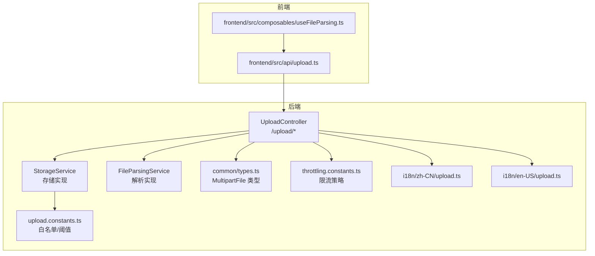
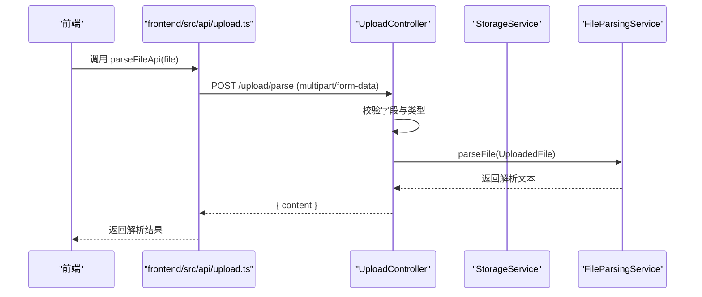
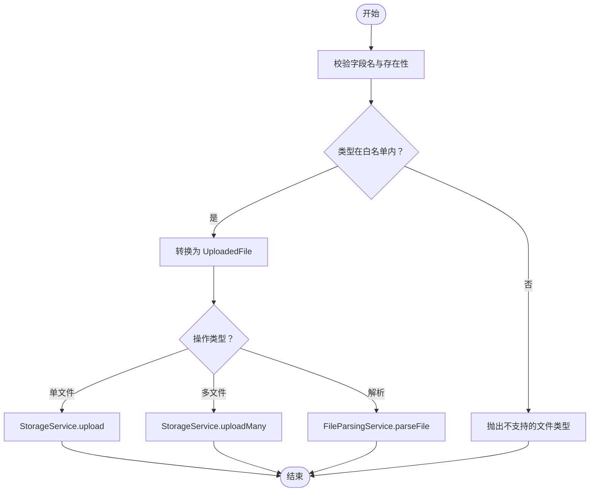
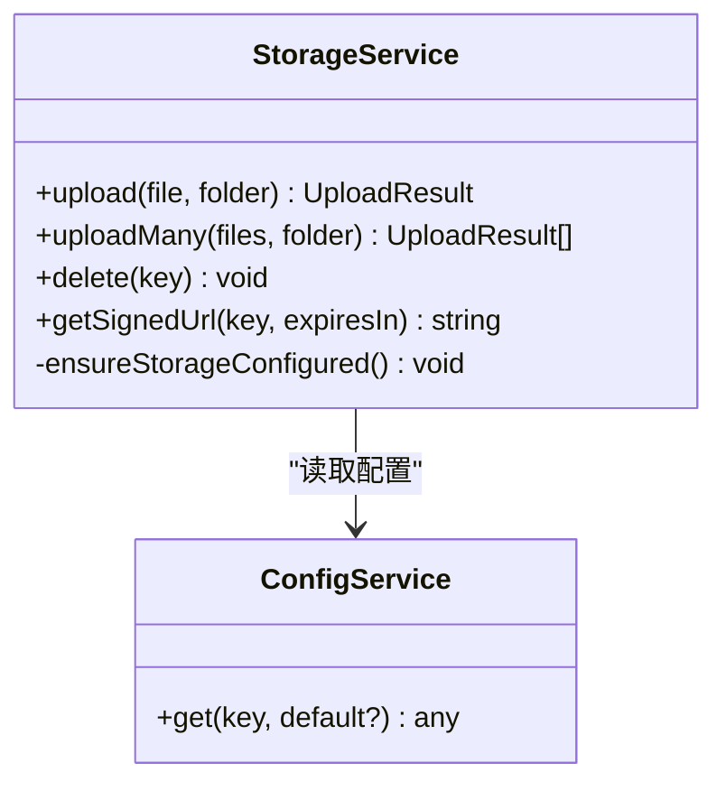
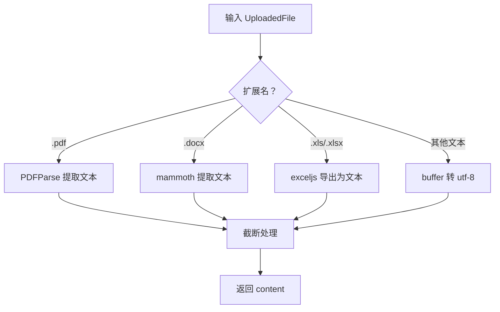
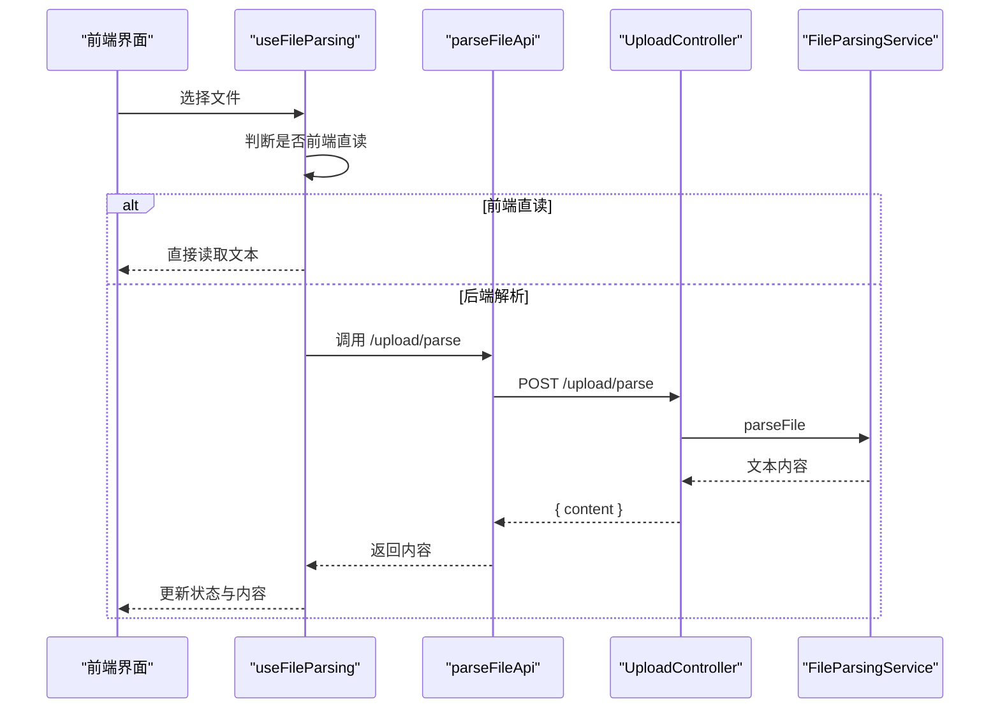
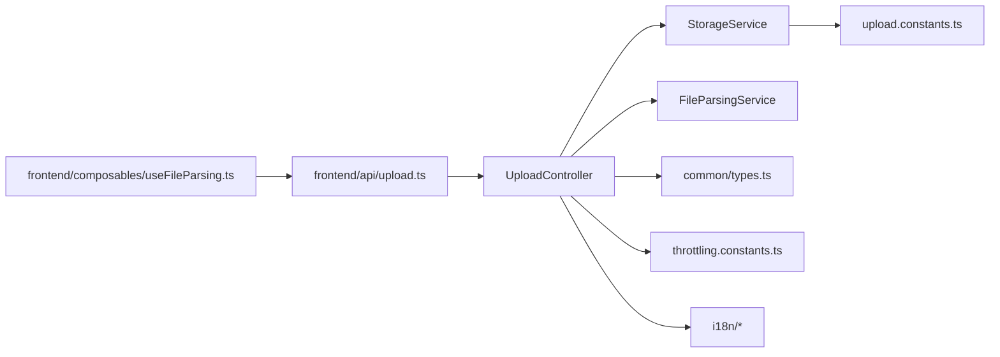

# 文件上传 API

<cite>
**本文引用的文件**
- [apps/backend/src/upload/upload.controller.ts](file://apps/backend/src/upload/upload.controller.ts)
- [apps/backend/src/upload/storage.service.ts](file://apps/backend/src/upload/storage.service.ts)
- [apps/backend/src/upload/file-parsing.service.ts](file://apps/backend/src/upload/file-parsing.service.ts)
- [apps/backend/src/upload/upload.constants.ts](file://apps/backend/src/upload/upload.constants.ts)
- [apps/backend/src/upload/upload.module.ts](file://apps/backend/src/upload/upload.module.ts)
- [apps/backend/src/common/types.ts](file://apps/backend/src/common/types.ts)
- [apps/backend/src/common/throttling/throttling.constants.ts](file://apps/backend/src/common/throttling/throttling.constants.ts)
- [apps/backend/src/i18n/zh-CN/upload.ts](file://apps/backend/src/i18n/zh-CN/upload.ts)
- [apps/backend/src/i18n/en-US/upload.ts](file://apps/backend/src/i18n/en-US/upload.ts)
- [apps/frontend/src/api/upload.ts](file://apps/frontend/src/api/upload.ts)
- [apps/frontend/src/composables/useFileParsing.ts](file://apps/frontend/src/composables/useFileParsing.ts)
</cite>

## 目录
1. [简介](#简介)
2. [项目结构](#项目结构)
3. [核心组件](#核心组件)
4. [架构总览](#架构总览)
5. [详细组件分析](#详细组件分析)
6. [依赖关系分析](#依赖关系分析)
7. [性能与容量规划](#性能与容量规划)
8. [故障排查指南](#故障排查指南)
9. [结论](#结论)
10. [附录](#附录)

## 简介
本文件为 Lumina Todo 的文件上传子系统提供完整 API 文档，覆盖以下方面：
- HTTP 接口规范：请求方法、路径、请求体格式 multipart/form-data、鉴权方式与响应结构
- 文件类型与大小限制：支持的扩展名与 MIME 类型白名单、解析内容长度上限
- 上传流程与行为：单文件、多文件、删除；后端解析能力与前端直读策略
- 存储策略：本地存储与云存储（AWS S3 及兼容协议）配置与 URL 生成
- 文件解析服务：对图片、文档、音频等多媒体文件的处理能力（当前后端支持 PDF、DOCX、XLS/XLSX 等）
- 访问权限控制、安全与合规：鉴权守卫、限流策略、错误国际化
- 元数据与后续能力：返回 key、URL、bucket、size、mimetype 等字段，为缩略图与格式转换预留空间
- 客户端使用示例与最佳实践：前端解析组合器与 API 调用方式

## 项目结构
文件上传相关模块位于后端 NestJS 应用中，前端通过独立 API 方法调用后端解析接口。

图表来源
- [apps/backend/src/upload/upload.controller.ts:1-161](file://apps/backend/src/upload/upload.controller.ts#L1-L161)
- [apps/backend/src/upload/storage.service.ts:1-216](file://apps/backend/src/upload/storage.service.ts#L1-L216)
- [apps/backend/src/upload/file-parsing.service.ts:1-142](file://apps/backend/src/upload/file-parsing.service.ts#L1-L142)
- [apps/backend/src/upload/upload.constants.ts:1-66](file://apps/backend/src/upload/upload.constants.ts#L1-L66)
- [apps/backend/src/common/types.ts:1-16](file://apps/backend/src/common/types.ts#L1-L16)
- [apps/backend/src/common/throttling/throttling.constants.ts:132-142](file://apps/backend/src/common/throttling/throttling.constants.ts#L132-L142)
- [apps/backend/src/i18n/zh-CN/upload.ts:1-10](file://apps/backend/src/i18n/zh-CN/upload.ts#L1-L10)
- [apps/backend/src/i18n/en-US/upload.ts:1-10](file://apps/backend/src/i18n/en-US/upload.ts#L1-L10)
- [apps/frontend/src/api/upload.ts:1-23](file://apps/frontend/src/api/upload.ts#L1-L23)
- [apps/frontend/src/composables/useFileParsing.ts:1-122](file://apps/frontend/src/composables/useFileParsing.ts#L1-L122)

章节来源
- [apps/backend/src/upload/upload.module.ts:1-16](file://apps/backend/src/upload/upload.module.ts#L1-L16)

## 核心组件
- UploadController：对外暴露 /upload/single、/upload/multiple、/upload/parse、/upload/:key(delete) 四个接口，负责参数校验、类型检查、转发至存储与解析服务，并应用限流。
- StorageService：封装本地与 S3（含兼容协议）存储，提供上传、批量上传、删除、生成公开 URL 或预签名 URL 的能力；当未配置凭证时，相关操作会抛出“存储未配置”异常。
- FileParsingService：对 PDF、DOCX、XLS/XLSX 等进行解析，提取文本；对纯文本/代码类文件在前端直读；对超长解析结果进行截断。
- upload.constants.ts：维护允许的 MIME 类型与扩展名白名单、可解析文本扩展名集合、解析内容最大字符数。
- 前端 API 与组合器：提供 parseFileApi 与 useFileParsing 组合器，支持混合解析策略（简单文件前端直读，复杂文件后端解析）。

章节来源
- [apps/backend/src/upload/upload.controller.ts:26-160](file://apps/backend/src/upload/upload.controller.ts#L26-L160)
- [apps/backend/src/upload/storage.service.ts:34-215](file://apps/backend/src/upload/storage.service.ts#L34-L215)
- [apps/backend/src/upload/file-parsing.service.ts:9-141](file://apps/backend/src/upload/file-parsing.service.ts#L9-L141)
- [apps/backend/src/upload/upload.constants.ts:1-66](file://apps/backend/src/upload/upload.constants.ts#L1-L66)
- [apps/frontend/src/api/upload.ts:1-23](file://apps/frontend/src/api/upload.ts#L1-L23)
- [apps/frontend/src/composables/useFileParsing.ts:19-121](file://apps/frontend/src/composables/useFileParsing.ts#L19-L121)

## 架构总览
后端采用控制器-服务分层，上传与解析职责分离；前端通过 API 层与组合器完成解析与展示。

图表来源
- [apps/frontend/src/api/upload.ts:11-22](file://apps/frontend/src/api/upload.ts#L11-L22)
- [apps/backend/src/upload/upload.controller.ts:95-116](file://apps/backend/src/upload/upload.controller.ts#L95-L116)
- [apps/backend/src/upload/file-parsing.service.ts:16-72](file://apps/backend/src/upload/file-parsing.service.ts#L16-L72)

## 详细组件分析

### 1) HTTP 接口规范

- 通用要求
  - 鉴权：所有上传接口均需携带 Bearer Token（JWT），由 JwtAuthGuard 保护
  - 内容类型：multipart/form-data
  - 限流：上传与解析接口分别应用独立限流策略
  - 错误消息：统一使用 i18n 中的 upload.* 键，便于国际化

- 接口一览
  - 上传单个文件
    - 方法与路径：POST /upload/single
    - 请求体：multipart/form-data，字段名为 file，二进制文件
    - 成功响应：UploadResult 结构（见下节）
    - 异常：缺少文件、不支持的文件类型
  - 上传多个文件
    - 方法与路径：POST /upload/multiple
    - 请求体：multipart/form-data，字段名为 files（数组），每个元素为二进制文件
    - 成功响应：UploadResult[] 数组
    - 异常：缺少文件、不支持的文件类型
  - 解析文件内容（不保存）
    - 方法与路径：POST /upload/parse
    - 请求体：multipart/form-data，字段名为 file，二进制文件
    - 成功响应：{ content: string }
    - 异常：缺少文件、不支持的文件类型、解析失败
  - 删除文件
    - 方法与路径：DELETE /upload/:key
    - 成功响应：{ success: boolean }
    - 异常：存储未配置、删除失败

- 响应结构 UploadResult
  - 字段：key、url、bucket、size、mimetype
  - 用途：用于后续访问、缩略图生成与格式转换预留字段

章节来源
- [apps/backend/src/upload/upload.controller.ts:70-159](file://apps/backend/src/upload/upload.controller.ts#L70-L159)
- [apps/backend/src/upload/storage.service.ts:15-28](file://apps/backend/src/upload/storage.service.ts#L15-L28)
- [apps/backend/src/common/throttling/throttling.constants.ts:132-142](file://apps/backend/src/common/throttling/throttling.constants.ts#L132-L142)
- [apps/backend/src/i18n/zh-CN/upload.ts:1-10](file://apps/backend/src/i18n/zh-CN/upload.ts#L1-L10)
- [apps/backend/src/i18n/en-US/upload.ts:1-10](file://apps/backend/src/i18n/en-US/upload.ts#L1-L10)

### 2) 文件类型与大小限制

- 支持的 MIME 类型与扩展名
  - 图片：jpeg、png、gif、webp
  - 文档：PDF、DOCX、XLS、XLSX
  - 文本：TXT、MD、JSON、CSV、TS、JS、PY、GO、JAVA、C、CPP、H、HPP、RS、YAML、YML、TOML
- 可解析文本扩展名集合：用于前端直读策略
- 解析内容长度上限：超过该长度的内容会被截断并追加省略标记

- 上传大小限制
  - 当前代码未设置显式的文件大小上限；建议在网关/反向代理层或业务侧增加限制，避免内存溢出与 DoS 攻击

章节来源
- [apps/backend/src/upload/upload.constants.ts:1-66](file://apps/backend/src/upload/upload.constants.ts#L1-L66)
- [apps/backend/src/upload/upload.controller.ts:53-65](file://apps/backend/src/upload/upload.controller.ts#L53-L65)
- [apps/backend/src/upload/file-parsing.service.ts:134-140](file://apps/backend/src/upload/file-parsing.service.ts#L134-L140)

### 3) 上传流程与行为

- 单文件上传
  - 控制器从 multipart 流中提取第一个名为 file 的部分，校验类型后转为 UploadedFile，调用 StorageService.upload
- 多文件上传
  - 控制器遍历名为 files 的多个部分，逐一校验与转换，再并发调用 StorageService.uploadMany
- 删除文件
  - 控制器调用 StorageService.delete；若未配置 S3 凭证则抛出“存储未配置”
- 解析文件内容
  - 控制器从 multipart 流中提取 file，校验类型后交由 FileParsingService.parseFile
  - 前端组合器 useFileParsing 提供混合解析策略：简单文本/代码在前端直读，复杂文档在后端解析

图表来源
- [apps/backend/src/upload/upload.controller.ts:82-148](file://apps/backend/src/upload/upload.controller.ts#L82-L148)
- [apps/backend/src/upload/file-parsing.service.ts:16-72](file://apps/backend/src/upload/file-parsing.service.ts#L16-L72)

章节来源
- [apps/backend/src/upload/upload.controller.ts:82-148](file://apps/backend/src/upload/upload.controller.ts#L82-L148)
- [apps/frontend/src/composables/useFileParsing.ts:19-95](file://apps/frontend/src/composables/useFileParsing.ts#L19-L95)

### 4) 存储策略与 CDN 集成

- 本地存储
  - 上传到 apps/backend/public/uploads 下，返回以 /api/public/ 开头的相对 URL
  - 适合开发与小规模部署
- 云存储（S3/兼容协议）
  - 通过环境变量配置 S3_BUCKET、S3_REGION、S3_ACCESS_KEY_ID、S3_SECRET_ACCESS_KEY，可选 S3_ENDPOINT（用于 OSS/MinIO）
  - 未配置凭证时，上传/删除/签名 URL 相关操作不可用
  - 返回标准 S3 URL 或自定义 endpoint/bucket/key 组合
- CDN 集成
  - 若通过自定义 endpoint（如 OSS/MinIO）或 CloudFront 等 CDN 暴露桶内容，可在前端以返回的 url 直接访问
  - 对于私有文件，可通过 getSignedUrl 生成带过期时间的预签名 URL

图表来源
- [apps/backend/src/upload/storage.service.ts:45-214](file://apps/backend/src/upload/storage.service.ts#L45-L214)

章节来源
- [apps/backend/src/upload/storage.service.ts:45-214](file://apps/backend/src/upload/storage.service.ts#L45-L214)

### 5) 文件解析服务 API

- 支持的格式
  - PDF：提取文本
  - DOCX：提取纯文本
  - XLS/XLSX：导出各工作表内容为 CSV 片段
  - 文本/代码类：直接读取 UTF-8 文本
- 不支持的格式：抛出“不支持解析的文件类型”
- 错误处理：解析异常统一转化为“文件解析失败”，并记录日志
- 内容截断：超过 MAX_PARSED_CONTENT_CHARS 的内容会被截断并追加省略标记

图表来源
- [apps/backend/src/upload/file-parsing.service.ts:16-72](file://apps/backend/src/upload/file-parsing.service.ts#L16-L72)
- [apps/backend/src/upload/upload.constants.ts:45-66](file://apps/backend/src/upload/upload.constants.ts#L45-L66)

章节来源
- [apps/backend/src/upload/file-parsing.service.ts:16-141](file://apps/backend/src/upload/file-parsing.service.ts#L16-L141)
- [apps/backend/src/upload/upload.constants.ts:45-66](file://apps/backend/src/upload/upload.constants.ts#L45-L66)

### 6) 访问权限控制、安全与合规

- 鉴权
  - 所有上传接口启用 JwtAuthGuard，需携带有效的 Bearer Token
- 限流
  - 上传限流策略：FILE_UPLOAD_THROTTLE
  - 解析限流策略：FILE_PARSE_THROTTLE
- 错误国际化
  - 使用 i18n 键：upload.FILE_REQUIRED、upload.UNSUPPORTED_FILE_TYPE、upload.UNSUPPORTED_PARSE_FILE_TYPE、upload.FILE_PARSING_FAILED、upload.STORAGE_NOT_CONFIGURED
- 安全扫描与病毒检测
  - 当前代码未实现安全扫描与病毒检测；建议在网关层或前置代理接入安全扫描服务，或在对象存储侧启用相应策略

章节来源
- [apps/backend/src/upload/upload.controller.ts:24-26](file://apps/backend/src/upload/upload.controller.ts#L24-L26)
- [apps/backend/src/common/throttling/throttling.constants.ts:132-142](file://apps/backend/src/common/throttling/throttling.constants.ts#L132-L142)
- [apps/backend/src/i18n/zh-CN/upload.ts:1-10](file://apps/backend/src/i18n/zh-CN/upload.ts#L1-L10)
- [apps/backend/src/i18n/en-US/upload.ts:1-10](file://apps/backend/src/i18n/en-US/upload.ts#L1-L10)

### 7) 元数据管理、缩略图与格式转换

- 返回字段
  - key、url、bucket、size、mimetype，可用于后续元数据管理与展示
- 缩略图与格式转换
  - 当前未实现；可在解析完成后基于 mimetype 与 size 判断类型，调用图像/文档处理库生成缩略图或转换格式

章节来源
- [apps/backend/src/upload/storage.service.ts:15-28](file://apps/backend/src/upload/storage.service.ts#L15-L28)

### 8) 客户端上传组件使用示例与最佳实践

- 前端解析 API
  - parseFileApi(file)：构造 FormData 并调用 /upload/parse，返回 { content }
- 混合解析策略（useFileParsing）
  - 自动判断是否前端直读（isFrontendParsable），否则调用后端解析
  - 登录态校验：非登录用户尝试后端解析会提示需要登录
  - 截断与告警：超过最大字符数时进行截断并给出警告
  - 状态管理：支持添加、移除、清空解析中的文件列表

图表来源
- [apps/frontend/src/composables/useFileParsing.ts:47-95](file://apps/frontend/src/composables/useFileParsing.ts#L47-L95)
- [apps/frontend/src/api/upload.ts:11-22](file://apps/frontend/src/api/upload.ts#L11-L22)
- [apps/backend/src/upload/upload.controller.ts:95-116](file://apps/backend/src/upload/upload.controller.ts#L95-L116)
- [apps/backend/src/upload/file-parsing.service.ts:16-72](file://apps/backend/src/upload/file-parsing.service.ts#L16-L72)

章节来源
- [apps/frontend/src/api/upload.ts:1-23](file://apps/frontend/src/api/upload.ts#L1-L23)
- [apps/frontend/src/composables/useFileParsing.ts:19-121](file://apps/frontend/src/composables/useFileParsing.ts#L19-L121)

## 依赖关系分析

图表来源
- [apps/backend/src/upload/upload.controller.ts:1-161](file://apps/backend/src/upload/upload.controller.ts#L1-L161)
- [apps/backend/src/upload/storage.service.ts:1-216](file://apps/backend/src/upload/storage.service.ts#L1-L216)
- [apps/backend/src/upload/file-parsing.service.ts:1-142](file://apps/backend/src/upload/file-parsing.service.ts#L1-L142)
- [apps/backend/src/upload/upload.constants.ts:1-66](file://apps/backend/src/upload/upload.constants.ts#L1-L66)
- [apps/backend/src/common/types.ts:1-16](file://apps/backend/src/common/types.ts#L1-L16)
- [apps/backend/src/common/throttling/throttling.constants.ts:132-142](file://apps/backend/src/common/throttling/throttling.constants.ts#L132-L142)
- [apps/frontend/src/api/upload.ts:1-23](file://apps/frontend/src/api/upload.ts#L1-L23)
- [apps/frontend/src/composables/useFileParsing.ts:1-122](file://apps/frontend/src/composables/useFileParsing.ts#L1-L122)

章节来源
- [apps/backend/src/upload/upload.module.ts:1-16](file://apps/backend/src/upload/upload.module.ts#L1-L16)

## 性能与容量规划
- 限流策略：上传与解析分别应用独立限流，避免突发流量导致资源耗尽
- 内存与磁盘：上传为内存 Buffer，建议在网关层限制请求体大小，防止 OOM
- 并发上传：uploadMany 采用 Promise.all 并发上传，注意存储后端吞吐与网络带宽
- CDN 与缓存：S3/MinIO 可配合 CDN 加速静态资源访问；私有文件建议使用预签名 URL 降低暴露风险
- 日志与可观测性：服务端对关键操作记录日志，便于问题定位与容量评估

## 故障排查指南
- 常见错误与定位
  - 上传失败（存储未配置）：检查 S3_* 环境变量是否正确配置
  - 不支持的文件类型：确认扩展名与 MIME 是否在白名单内
  - 解析失败：确认文件格式是否受支持；查看后端日志定位具体异常
  - 限流触发：调整限流窗口与配额，或在客户端做退避重试
- 国际化错误消息
  - 前端根据语言包显示对应文案，便于用户理解

章节来源
- [apps/backend/src/i18n/zh-CN/upload.ts:1-10](file://apps/backend/src/i18n/zh-CN/upload.ts#L1-L10)
- [apps/backend/src/i18n/en-US/upload.ts:1-10](file://apps/backend/src/i18n/en-US/upload.ts#L1-L10)
- [apps/backend/src/upload/storage.service.ts:208-214](file://apps/backend/src/upload/storage.service.ts#L208-L214)
- [apps/backend/src/upload/upload.controller.ts:53-65](file://apps/backend/src/upload/upload.controller.ts#L53-L65)

## 结论
Lumina Todo 的文件上传子系统提供了清晰的接口与完善的类型校验、限流与国际化支持。当前重点覆盖了上传、删除与后端解析能力，存储策略同时支持本地与云存储，并预留了 CDN 与私有访问的扩展点。建议在生产环境中补充：
- 明确的文件大小限制与安全扫描
- 私有文件的预签名 URL 策略
- 缩略图与格式转换的后续实现

## 附录

### A. 接口清单与字段说明
- POST /upload/single
  - 请求体：multipart/form-data，file: binary
  - 响应：UploadResult
- POST /upload/multiple
  - 请求体：multipart/form-data，files: array[binary]
  - 响应：UploadResult[]
- POST /upload/parse
  - 请求体：multipart/form-data，file: binary
  - 响应：{ content: string }
- DELETE /upload/:key
  - 响应：{ success: boolean }

章节来源
- [apps/backend/src/upload/upload.controller.ts:70-159](file://apps/backend/src/upload/upload.controller.ts#L70-L159)

### B. 常量与阈值
- 允许的 MIME 类型与扩展名：参考 upload.constants.ts
- 可解析文本扩展名集合：参考 upload.constants.ts
- 解析内容最大字符数：MAX_PARSED_CONTENT_CHARS

章节来源
- [apps/backend/src/upload/upload.constants.ts:1-66](file://apps/backend/src/upload/upload.constants.ts#L1-L66)