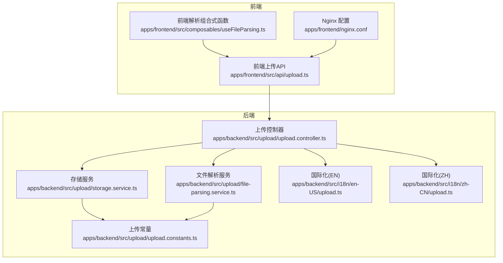
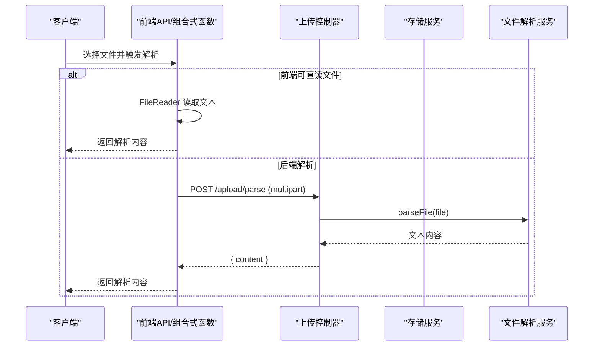
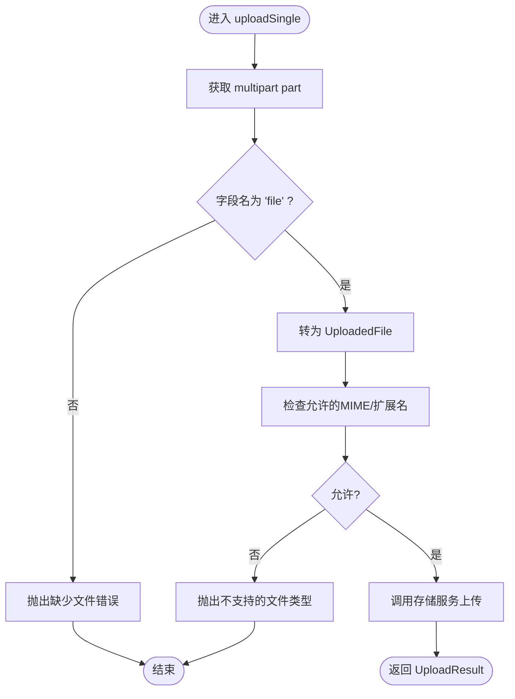
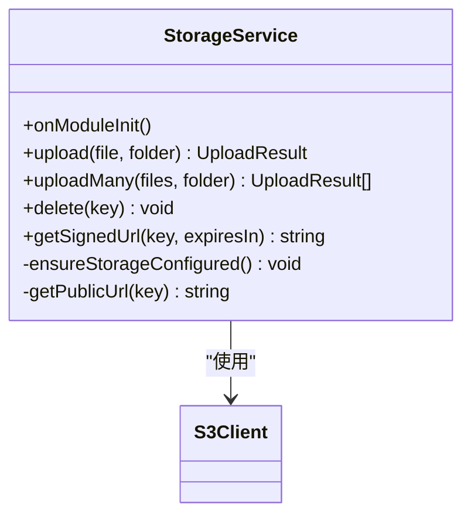
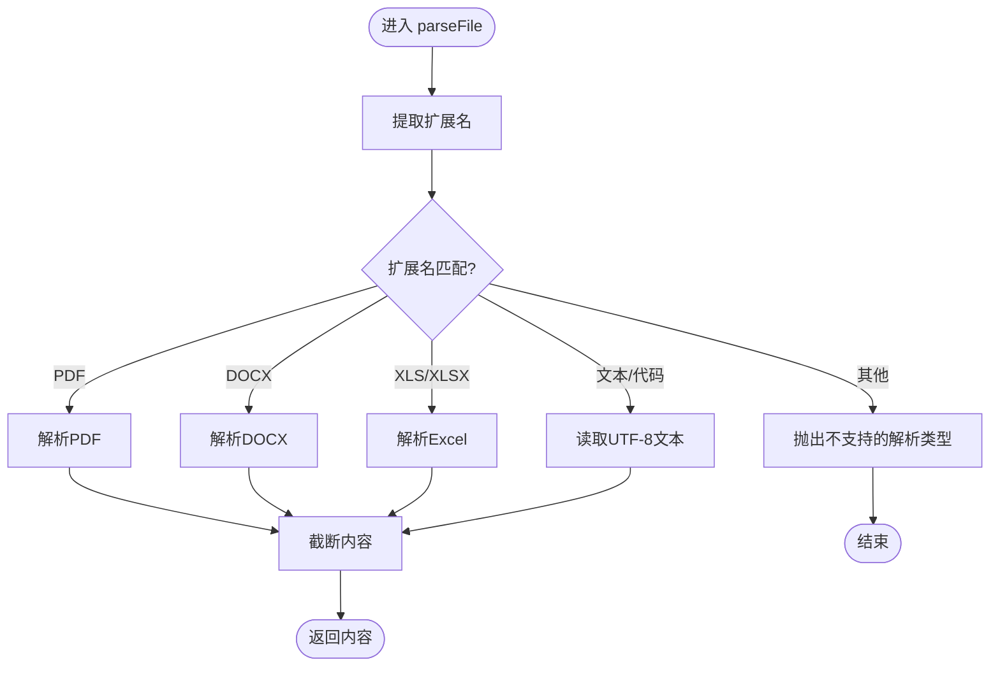
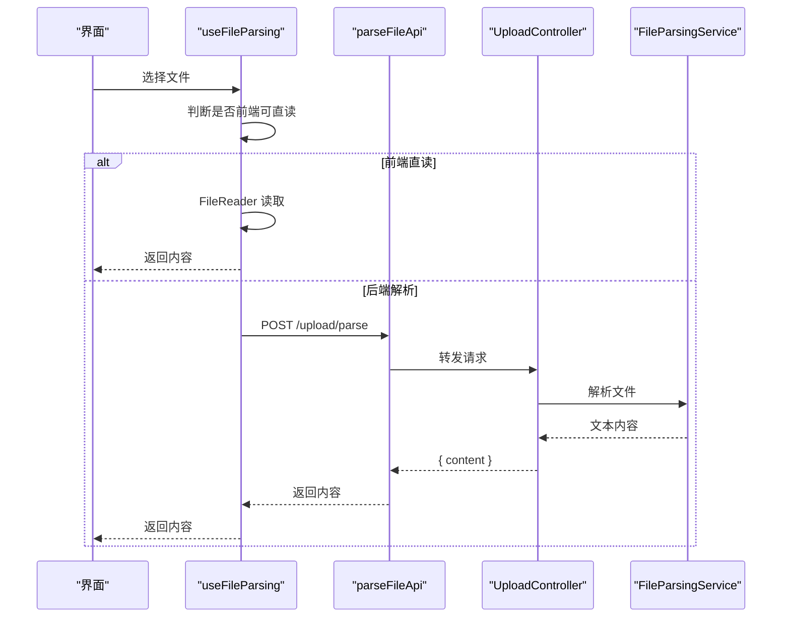
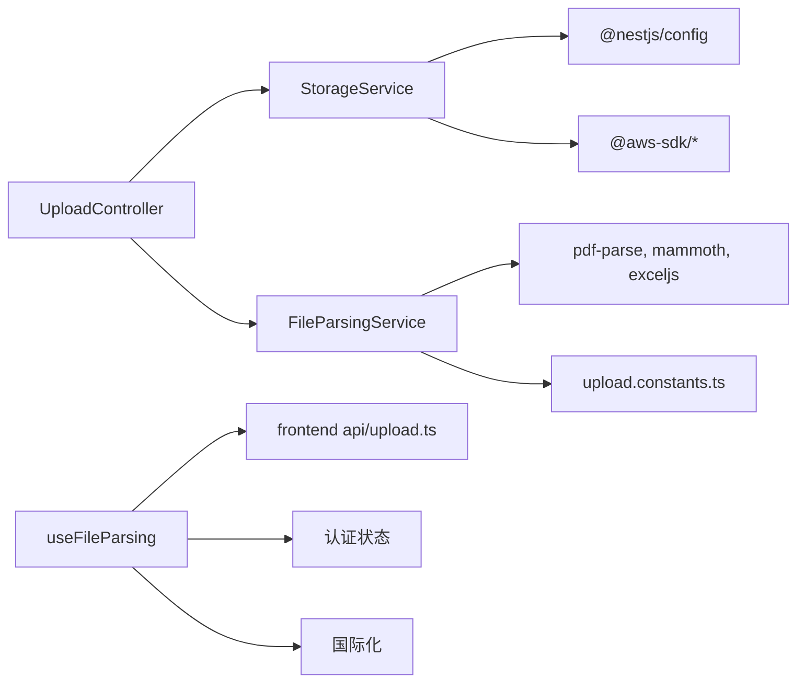

# 文件上传API

<cite>
**本文档引用的文件**
- [apps/backend/src/upload/upload.controller.ts](file://apps/backend/src/upload/upload.controller.ts)
- [apps/backend/src/upload/storage.service.ts](file://apps/backend/src/upload/storage.service.ts)
- [apps/backend/src/upload/file-parsing.service.ts](file://apps/backend/src/upload/file-parsing.service.ts)
- [apps/backend/src/upload/upload.constants.ts](file://apps/backend/src/upload/upload.constants.ts)
- [apps/backend/src/upload/upload.module.ts](file://apps/backend/src/upload/upload.module.ts)
- [apps/backend/src/i18n/en-US/upload.ts](file://apps/backend/src/i18n/en-US/upload.ts)
- [apps/backend/src/i18n/zh-CN/upload.ts](file://apps/backend/src/i18n/zh-CN/upload.ts)
- [apps/frontend/src/api/upload.ts](file://apps/frontend/src/api/upload.ts)
- [apps/frontend/src/composables/useFileParsing.ts](file://apps/frontend/src/composables/useFileParsing.ts)
- [apps/frontend/nginx.conf](file://apps/frontend/nginx.conf)
- [apps/backend/tests/upload/upload.controller.spec.ts](file://apps/backend/tests/upload/upload.controller.spec.ts)
- [apps/backend/tests/upload/storage.service.spec.ts](file://apps/backend/tests/upload/storage.service.spec.ts)
- [apps/backend/tests/upload/file-parsing.service.spec.ts](file://apps/backend/tests/upload/file-parsing.service.spec.ts)
</cite>

## 目录
1. [简介](#简介)
2. [项目结构](#项目结构)
3. [核心组件](#核心组件)
4. [架构总览](#架构总览)
5. [详细组件分析](#详细组件分析)
6. [依赖关系分析](#依赖关系分析)
7. [性能与容量规划](#性能与容量规划)
8. [故障排查指南](#故障排查指南)
9. [结论](#结论)
10. [附录](#附录)

## 简介
本文件上传API提供统一的文件上传、解析、删除能力，并通过云存储（S3兼容）实现高可用的对象存储。系统支持多种文件类型的上传与解析，包括图片、PDF、Word、Excel、纯文本及多种编程语言源码；同时提供前端直读与后端解析两种模式，以兼顾性能与功能覆盖。

## 项目结构
后端采用 NestJS + Fastify 的上传模块，前端通过 HTTP 客户端调用后端接口，Nginx 提供静态资源与反向代理、缓存与安全头配置。

图表来源
- [apps/frontend/src/api/upload.ts:1-23](file://apps/frontend/src/api/upload.ts#L1-L23)
- [apps/frontend/src/composables/useFileParsing.ts:1-122](file://apps/frontend/src/composables/useFileParsing.ts#L1-L122)
- [apps/frontend/nginx.conf:1-202](file://apps/frontend/nginx.conf#L1-L202)
- [apps/backend/src/upload/upload.controller.ts:1-156](file://apps/backend/src/upload/upload.controller.ts#L1-L156)
- [apps/backend/src/upload/storage.service.ts:1-151](file://apps/backend/src/upload/storage.service.ts#L1-L151)
- [apps/backend/src/upload/file-parsing.service.ts:1-142](file://apps/backend/src/upload/file-parsing.service.ts#L1-L142)
- [apps/backend/src/upload/upload.constants.ts:1-61](file://apps/backend/src/upload/upload.constants.ts#L1-L61)
- [apps/backend/src/i18n/en-US/upload.ts:1-10](file://apps/backend/src/i18n/en-US/upload.ts#L1-L10)
- [apps/backend/src/i18n/zh-CN/upload.ts:1-10](file://apps/backend/src/i18n/zh-CN/upload.ts#L1-L10)

章节来源
- [apps/backend/src/upload/upload.module.ts:1-16](file://apps/backend/src/upload/upload.module.ts#L1-L16)
- [apps/backend/src/upload/upload.controller.ts:1-156](file://apps/backend/src/upload/upload.controller.ts#L1-L156)
- [apps/backend/src/upload/storage.service.ts:1-151](file://apps/backend/src/upload/storage.service.ts#L1-L151)
- [apps/backend/src/upload/file-parsing.service.ts:1-142](file://apps/backend/src/upload/file-parsing.service.ts#L1-L142)
- [apps/backend/src/upload/upload.constants.ts:1-61](file://apps/backend/src/upload/upload.constants.ts#L1-L61)
- [apps/frontend/src/api/upload.ts:1-23](file://apps/frontend/src/api/upload.ts#L1-L23)
- [apps/frontend/src/composables/useFileParsing.ts:1-122](file://apps/frontend/src/composables/useFileParsing.ts#L1-L122)
- [apps/frontend/nginx.conf:1-202](file://apps/frontend/nginx.conf#L1-L202)

## 核心组件
- 上传控制器：负责接收 multipart 请求、校验文件类型、转发至存储服务或解析服务。
- 存储服务：封装 S3 客户端，支持上传、批量上传、删除、生成预签名URL与公开URL。
- 文件解析服务：根据扩展名选择解析器，提取文本内容并对结果进行长度截断。
- 上传常量：定义允许的MIME类型、扩展名、可解析文本扩展名与最大解析字符数。
- 国际化：提供错误消息的多语言支持。
- 前端API与组合式函数：封装解析请求、混合解析策略（前端直读/后端解析）、状态管理与提示。

章节来源
- [apps/backend/src/upload/upload.controller.ts:20-156](file://apps/backend/src/upload/upload.controller.ts#L20-L156)
- [apps/backend/src/upload/storage.service.ts:28-151](file://apps/backend/src/upload/storage.service.ts#L28-L151)
- [apps/backend/src/upload/file-parsing.service.ts:9-142](file://apps/backend/src/upload/file-parsing.service.ts#L9-L142)
- [apps/backend/src/upload/upload.constants.ts:1-61](file://apps/backend/src/upload/upload.constants.ts#L1-L61)
- [apps/frontend/src/api/upload.ts:1-23](file://apps/frontend/src/api/upload.ts#L1-L23)
- [apps/frontend/src/composables/useFileParsing.ts:1-122](file://apps/frontend/src/composables/useFileParsing.ts#L1-L122)

## 架构总览
后端通过 JWT 认证保护上传接口，前端在解析复杂文档时需要登录态；Nginx 提供静态资源缓存、压缩与安全头。

图表来源
- [apps/frontend/src/composables/useFileParsing.ts:19-95](file://apps/frontend/src/composables/useFileParsing.ts#L19-L95)
- [apps/frontend/src/api/upload.ts:8-22](file://apps/frontend/src/api/upload.ts#L8-L22)
- [apps/backend/src/upload/upload.controller.ts:92-112](file://apps/backend/src/upload/upload.controller.ts#L92-L112)
- [apps/backend/src/upload/file-parsing.service.ts:13-72](file://apps/backend/src/upload/file-parsing.service.ts#L13-L72)

## 详细组件分析

### 上传控制器（UploadController）
- 功能
  - 单文件上传：接收 multipart/form-data，校验字段名与文件类型，转换为内部格式并调用存储服务。
  - 批量上传：遍历 files 字段，最多 10 个，逐个校验并并行上传。
  - 文件解析：接收文件并调用解析服务，返回纯文本内容。
  - 删除文件：按 key 删除对象存储中的文件。
- 认证与权限
  - 使用 JWT 守卫，要求携带 Bearer Token。
- 错误处理
  - 缺少文件、不支持的文件类型、解析失败等均返回明确的国际化错误消息。

图表来源
- [apps/backend/src/upload/upload.controller.ts:68-87](file://apps/backend/src/upload/upload.controller.ts#L68-L87)
- [apps/backend/src/upload/upload.controller.ts:30-63](file://apps/backend/src/upload/upload.controller.ts#L30-L63)

章节来源
- [apps/backend/src/upload/upload.controller.ts:20-156](file://apps/backend/src/upload/upload.controller.ts#L20-L156)
- [apps/backend/src/i18n/en-US/upload.ts:1-10](file://apps/backend/src/i18n/en-US/upload.ts#L1-L10)
- [apps/backend/src/i18n/zh-CN/upload.ts:1-10](file://apps/backend/src/i18n/zh-CN/upload.ts#L1-L10)

### 存储服务（StorageService）
- 功能
  - 初始化 S3 客户端（支持 AWS S3 与 OSS/MinIO）。
  - 上传单个/批量文件，生成唯一 key 并返回可访问 URL。
  - 删除对象。
  - 生成预签名 URL（临时访问私有文件）。
- 配置
  - 通过环境变量读取桶名、区域、端点、凭证；若凭证缺失则抛出“存储未配置”异常。
- URL 生成
  - 公开 URL：AWS S3 或自定义 endpoint 格式。
  - 预签名 URL：基于 GetObjectCommand 生成，支持过期时间。

图表来源
- [apps/backend/src/upload/storage.service.ts:32-151](file://apps/backend/src/upload/storage.service.ts#L32-L151)

章节来源
- [apps/backend/src/upload/storage.service.ts:1-151](file://apps/backend/src/upload/storage.service.ts#L1-L151)

### 文件解析服务（FileParsingService）
- 功能
  - 根据扩展名选择解析器：PDF、DOCX、XLS/XLSX、纯文本/Markdown/JSON/CSV/代码类扩展。
  - 对解析结果进行长度截断，避免超大内容影响性能。
- 错误处理
  - 不支持的类型抛出“不支持的解析类型”。
  - 其他解析异常统一转换为“文件解析失败”。

图表来源
- [apps/backend/src/upload/file-parsing.service.ts:13-72](file://apps/backend/src/upload/file-parsing.service.ts#L13-L72)
- [apps/backend/src/upload/upload.constants.ts:40-61](file://apps/backend/src/upload/upload.constants.ts#L40-L61)

章节来源
- [apps/backend/src/upload/file-parsing.service.ts:1-142](file://apps/backend/src/upload/file-parsing.service.ts#L1-L142)
- [apps/backend/src/upload/upload.constants.ts:1-61](file://apps/backend/src/upload/upload.constants.ts#L1-L61)

### 前端集成与解析策略
- 前端 API
  - 提供 parseFileApi，构造 FormData 并调用 /upload/parse。
- 组合式函数 useFileParsing
  - 混合解析策略：简单文本/代码文件由前端 FileReader 直接读取；复杂文档（PDF/DOCX/Excel）由后端解析。
  - 登录态校验：后端解析前需确保用户已登录。
  - 截断与提示：超过最大解析字符数时截断并给出警告。
  - 状态管理：记录解析进度与错误信息。

图表来源
- [apps/frontend/src/composables/useFileParsing.ts:19-95](file://apps/frontend/src/composables/useFileParsing.ts#L19-L95)
- [apps/frontend/src/api/upload.ts:8-22](file://apps/frontend/src/api/upload.ts#L8-L22)
- [apps/backend/src/upload/upload.controller.ts:92-112](file://apps/backend/src/upload/upload.controller.ts#L92-L112)
- [apps/backend/src/upload/file-parsing.service.ts:13-72](file://apps/backend/src/upload/file-parsing.service.ts#L13-L72)

章节来源
- [apps/frontend/src/api/upload.ts:1-23](file://apps/frontend/src/api/upload.ts#L1-L23)
- [apps/frontend/src/composables/useFileParsing.ts:1-122](file://apps/frontend/src/composables/useFileParsing.ts#L1-L122)

## 依赖关系分析
- 控制器依赖存储服务与文件解析服务。
- 存储服务依赖配置服务与 AWS SDK。
- 文件解析服务依赖第三方库（PDFParse、mammoth、exceljs）与上传常量。
- 前端解析组合式函数依赖认证状态、国际化与HTTP客户端。

图表来源
- [apps/backend/src/upload/upload.controller.ts:1-28](file://apps/backend/src/upload/upload.controller.ts#L1-L28)
- [apps/backend/src/upload/storage.service.ts:1-41](file://apps/backend/src/upload/storage.service.ts#L1-L41)
- [apps/backend/src/upload/file-parsing.service.ts:1-7](file://apps/backend/src/upload/file-parsing.service.ts#L1-L7)
- [apps/frontend/src/composables/useFileParsing.ts:1-8](file://apps/frontend/src/composables/useFileParsing.ts#L1-L8)

章节来源
- [apps/backend/src/upload/upload.module.ts:1-16](file://apps/backend/src/upload/upload.module.ts#L1-L16)
- [apps/backend/src/upload/upload.controller.ts:1-28](file://apps/backend/src/upload/upload.controller.ts#L1-L28)
- [apps/backend/src/upload/storage.service.ts:1-41](file://apps/backend/src/upload/storage.service.ts#L1-L41)
- [apps/backend/src/upload/file-parsing.service.ts:1-7](file://apps/backend/src/upload/file-parsing.service.ts#L1-L7)
- [apps/frontend/src/composables/useFileParsing.ts:1-8](file://apps/frontend/src/composables/useFileParsing.ts#L1-L8)

## 性能与容量规划
- 文件类型与大小
  - 支持的扩展名与MIME类型见上传常量；未在白名单中的类型将被拒绝。
  - 解析结果最大字符数受 MAX_PARSED_CONTENT_CHARS 限制，超限自动截断。
- 并发与批处理
  - 批量上传采用 Promise.all 并行处理，提升吞吐。
- CDN与缓存
  - Nginx 提供静态资源长期缓存（1年）、Gzip/Brotli 压缩、open_file_cache 优化文件打开。
  - 对于上传后的对象存储文件，建议在网关/CDN层配置缓存策略与边缘加速。
- 安全与访问控制
  - 接口启用 JWT 认证；对象存储默认不公开访问，可通过预签名URL实现临时访问。
  - Nginx 设置安全头（X-Frame-Options、X-Content-Type-Options、X-XSS-Protection、Referrer-Policy）。

章节来源
- [apps/backend/src/upload/upload.constants.ts:1-61](file://apps/backend/src/upload/upload.constants.ts#L1-L61)
- [apps/backend/src/upload/storage.service.ts:98-102](file://apps/backend/src/upload/storage.service.ts#L98-L102)
- [apps/frontend/nginx.conf:11-72](file://apps/frontend/nginx.conf#L11-L72)
- [apps/frontend/nginx.conf:182-187](file://apps/frontend/nginx.conf#L182-L187)

## 故障排查指南
- 常见错误与定位
  - “请选择要上传的文件”：前端未正确构造 multipart 或字段名非预期。
  - “不支持的文件类型”：扩展名或MIME不在白名单。
  - “不支持解析的文件类型”：当前解析器不支持该扩展名。
  - “文件解析失败”：解析过程异常或第三方库处理失败。
  - “对象存储未配置”：S3 凭证缺失导致无法上传/删除/签名。
- 单元测试参考
  - 上传控制器：验证不支持的MIME类型与允许类型的行为。
  - 存储服务：验证凭证缺失时的异常行为。
  - 文件解析服务：验证不支持扩展名与超长内容截断。

章节来源
- [apps/backend/src/i18n/en-US/upload.ts:1-10](file://apps/backend/src/i18n/en-US/upload.ts#L1-L10)
- [apps/backend/src/i18n/zh-CN/upload.ts:1-10](file://apps/backend/src/i18n/zh-CN/upload.ts#L1-L10)
- [apps/backend/tests/upload/upload.controller.spec.ts:1-102](file://apps/backend/tests/upload/upload.controller.spec.ts#L1-L102)
- [apps/backend/tests/upload/storage.service.spec.ts:1-46](file://apps/backend/tests/upload/storage.service.spec.ts#L1-L46)
- [apps/backend/tests/upload/file-parsing.service.spec.ts:1-52](file://apps/backend/tests/upload/file-parsing.service.spec.ts#L1-L52)

## 结论
本文件上传API以清晰的职责分离实现了上传、解析与存储的完整链路，结合前端混合解析策略与后端严格校验，兼顾了易用性与安全性。通过 S3 兼容存储与 Nginx 缓存/压缩，系统具备良好的扩展性与性能表现。建议在生产环境中完善病毒扫描与访问审计，并在网关层引入 CDN 与 WAF 进一步强化安全与性能。

## 附录

### 接口规范概览
- 上传单个文件
  - 方法：POST
  - 路径：/upload/single
  - 认证：Bearer Token
  - 内容类型：multipart/form-data
  - 表单字段：file（二进制）
  - 成功响应：UploadResult（包含 key、url、bucket、size、mimetype）
- 批量上传文件
  - 方法：POST
  - 路径：/upload/multiple
  - 认证：Bearer Token
  - 内容类型：multipart/form-data
  - 表单字段：files[]（数组，二进制）
  - 成功响应：UploadResult[]（最多 10 个）
- 解析文件内容
  - 方法：POST
  - 路径：/upload/parse
  - 认证：Bearer Token（复杂文档解析时）
  - 内容类型：multipart/form-data
  - 表单字段：file（二进制）
  - 成功响应：{ content: string }
- 删除文件
  - 方法：DELETE
  - 路径：/upload/{key}
  - 认证：Bearer Token
  - 成功响应：{ success: boolean }

章节来源
- [apps/backend/src/upload/upload.controller.ts:68-154](file://apps/backend/src/upload/upload.controller.ts#L68-L154)
- [apps/backend/src/upload/storage.service.ts:13-19](file://apps/backend/src/upload/storage.service.ts#L13-L19)

### 支持的文件类型与大小限制
- 支持的扩展名与MIME类型
  - 图片：jpeg、png、gif、webp
  - 文档：pdf、docx、xls、xlsx
  - 文本：txt、md、json、csv
  - 代码：ts、js、py、go、java、c、cpp、h、hpp、rs、yaml、yml、toml
- 大小限制
  - 上传控制器对文件类型进行白名单校验；未见显式的字节大小限制逻辑，建议在网关或业务层补充大小限制。
- 解析结果长度
  - 最大字符数：120,000；超限自动截断。

章节来源
- [apps/backend/src/upload/upload.constants.ts:1-61](file://apps/backend/src/upload/upload.constants.ts#L1-L61)

### 存储策略与URL生成
- 存储位置
  - 默认桶：lumina-uploads
  - 区域：us-east-1
  - 端点：可选（用于 OSS/MinIO）
- URL 类型
  - 公开URL：AWS S3 或自定义endpoint
  - 预签名URL：Get 对象命令，支持过期时间参数

章节来源
- [apps/backend/src/upload/storage.service.ts:43-67](file://apps/backend/src/upload/storage.service.ts#L43-L67)
- [apps/backend/src/upload/storage.service.ts:134-141](file://apps/backend/src/upload/storage.service.ts#L134-L141)

### 安全扫描、病毒检测与访问控制
- 当前实现
  - JWT 认证保护接口；对象存储默认不公开访问。
- 建议增强
  - 在上传后增加病毒扫描与内容审核流程。
  - 引入访问审计日志与速率限制。
  - 在网关层部署 WAF 与 CDN，提升抗攻击与性能。

章节来源
- [apps/backend/src/upload/upload.controller.ts:22-23](file://apps/backend/src/upload/upload.controller.ts#L22-L23)
- [apps/frontend/nginx.conf:74-85](file://apps/frontend/nginx.conf#L74-L85)

### CDN集成与缓存策略
- Nginx 已配置
  - Gzip/Brotli 压缩、open_file_cache、静态资源长期缓存（1年）
  - 安全头与代理缓冲关闭（适用于实时通信场景）
- 建议
  - 对对象存储文件在 CDN 层配置缓存与边缘加速；对私有文件使用预签名URL。

章节来源
- [apps/frontend/nginx.conf:11-72](file://apps/frontend/nginx.conf#L11-L72)
- [apps/frontend/nginx.conf:182-187](file://apps/frontend/nginx.conf#L182-L187)

### 客户端集成示例与错误恢复
- 前端解析流程
  - 前端直读：对简单文本/代码文件使用 FileReader。
  - 后端解析：对复杂文档调用 /upload/parse，需登录态。
  - 错误恢复：捕获异常、显示国际化提示、保留错误状态以便重试。
- 建议
  - 在 UI 中提供“重试解析”按钮；对超长内容给出截断提示。

章节来源
- [apps/frontend/src/composables/useFileParsing.ts:19-95](file://apps/frontend/src/composables/useFileParsing.ts#L19-L95)
- [apps/frontend/src/api/upload.ts:8-22](file://apps/frontend/src/api/upload.ts#L8-L22)

### 性能监控指标
- 建议采集
  - 上传/解析耗时、成功率、失败率、对象存储请求延迟与错误码。
  - 前端解析耗时分布、截断比例。
  - Nginx 访问日志统计（QPS、响应时间、状态码）。

章节来源
- [apps/frontend/nginx.conf:11-72](file://apps/frontend/nginx.conf#L11-L72)