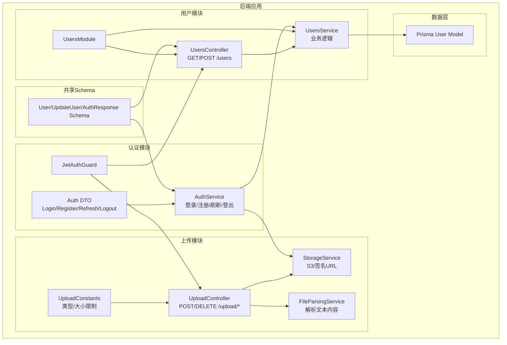
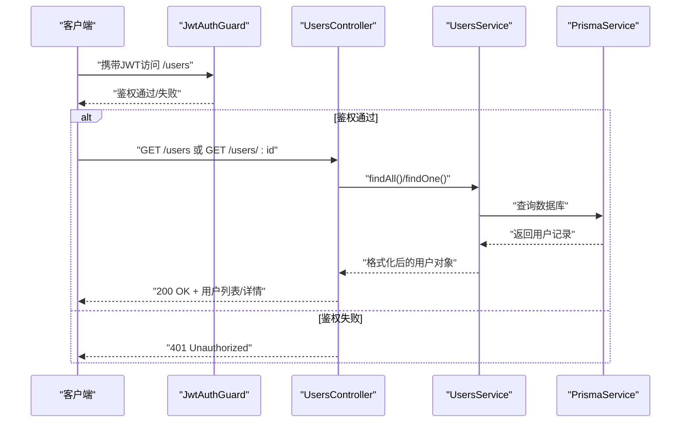
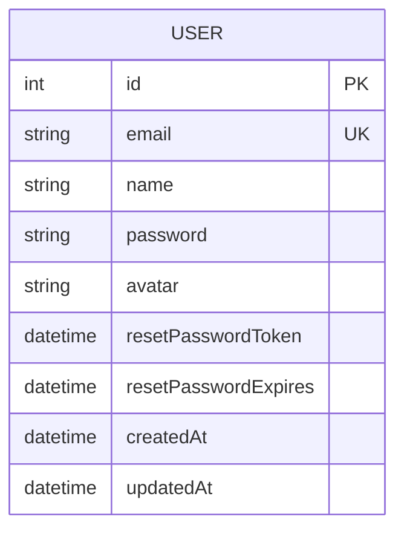
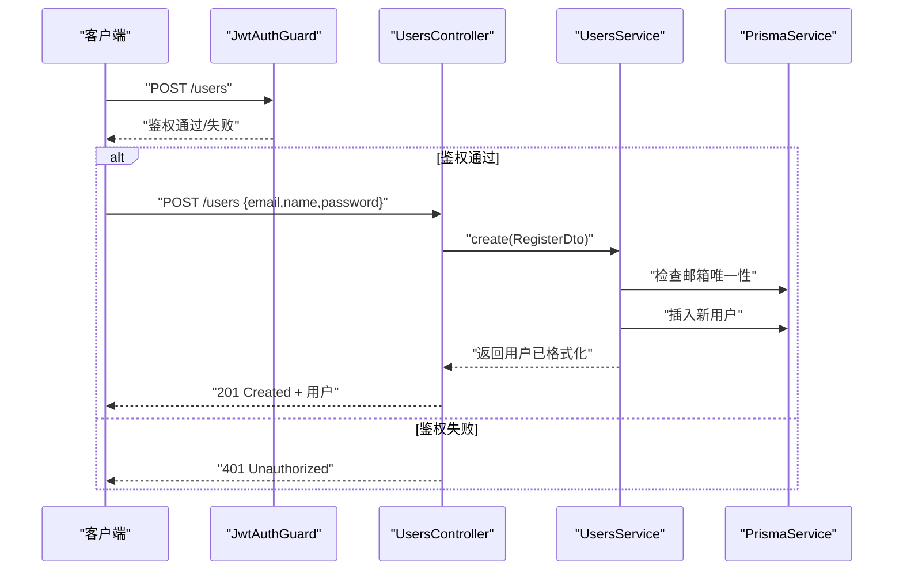
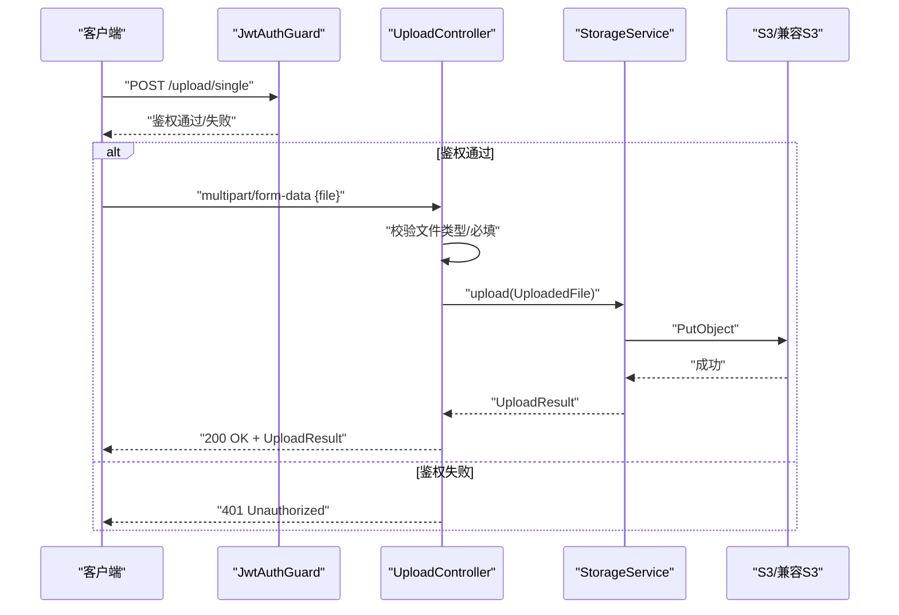
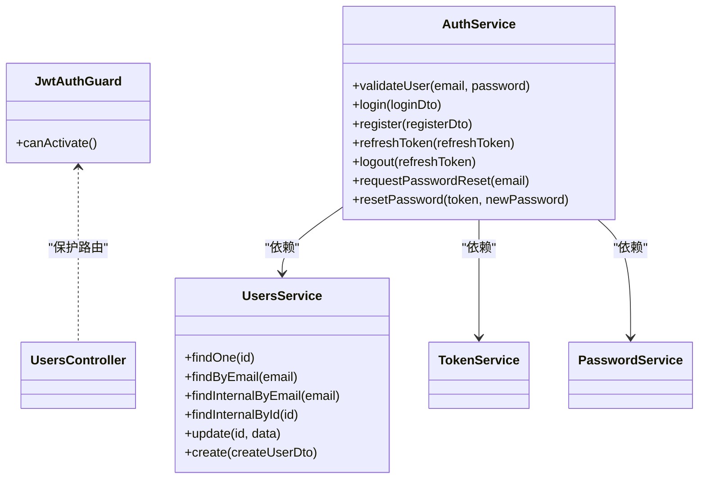
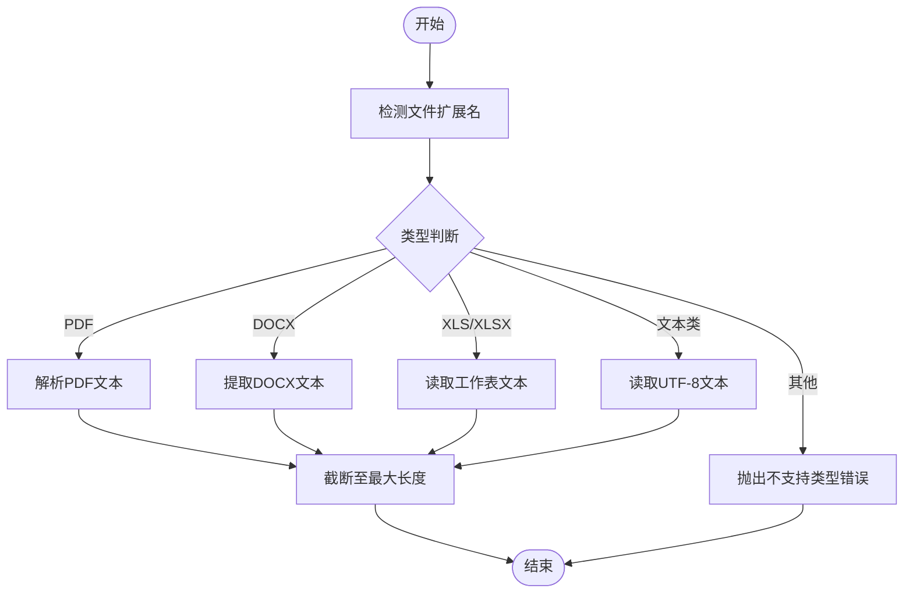
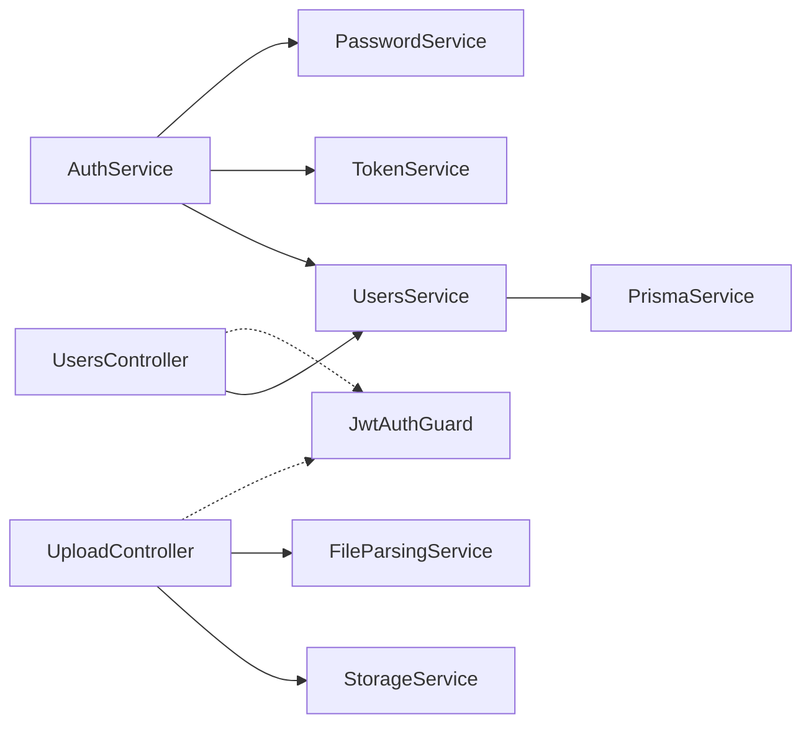

# 用户API

<cite>
**本文引用的文件**
- [apps/backend/src/users/users.controller.ts](file://apps/backend/src/users/users.controller.ts)
- [apps/backend/src/users/users.service.ts](file://apps/backend/src/users/users.service.ts)
- [apps/backend/src/users/users.module.ts](file://apps/backend/src/users/users.module.ts)
- [apps/backend/src/auth/auth.dto.ts](file://apps/backend/src/auth/auth.dto.ts)
- [apps/backend/src/auth/auth.service.ts](file://apps/backend/src/auth/auth.service.ts)
- [apps/backend/src/auth/jwt-auth.guard.ts](file://apps/backend/src/auth/jwt-auth.guard.ts)
- [apps/backend/src/upload/upload.controller.ts](file://apps/backend/src/upload/upload.controller.ts)
- [apps/backend/src/upload/storage.service.ts](file://apps/backend/src/upload/storage.service.ts)
- [apps/backend/src/upload/file-parsing.service.ts](file://apps/backend/src/upload/file-parsing.service.ts)
- [apps/backend/src/upload/upload.constants.ts](file://apps/backend/src/upload/upload.constants.ts)
- [apps/backend/prisma/schema/user.prisma](file://apps/backend/prisma/schema/user.prisma)
- [packages/shared/src/schemas/auth.schema.ts](file://packages/shared/src/schemas/auth.schema.ts)
- [packages/shared/src/utils/user.utils.ts](file://packages/shared/src/utils/user.utils.ts)
</cite>

## 目录
1. [简介](#简介)
2. [项目结构](#项目结构)
3. [核心组件](#核心组件)
4. [架构总览](#架构总览)
5. [详细组件分析](#详细组件分析)
6. [依赖关系分析](#依赖关系分析)
7. [性能考虑](#性能考虑)
8. [故障排查指南](#故障排查指南)
9. [结论](#结论)
10. [附录](#附录)

## 简介
本文件面向后端开发者与产品/测试人员，系统性梳理“用户管理API”的接口规范、数据模型、权限控制、隐私保护与访问控制策略，并提供请求/响应示例、错误处理机制与性能优化建议。当前仓库中用户管理能力主要由用户模块与认证模块协同提供，头像上传通过独立的上传模块完成；用户信息查询与创建接口已实现，更新与列表查询接口尚未在后端控制器中暴露，但数据模型与DTO已具备支撑能力。

## 项目结构
用户相关功能分布在以下模块与文件中：
- 用户模块：控制器、服务、模块装配
- 认证模块：登录、注册、令牌刷新与登出、密码服务
- 上传模块：文件上传、解析、删除与签名URL
- 数据模型：Prisma User 模型
- 共享Schema：用户、认证、更新等输入输出Schema

图表来源
- [apps/backend/src/users/users.controller.ts:1-50](file://apps/backend/src/users/users.controller.ts#L1-L50)
- [apps/backend/src/users/users.service.ts:1-110](file://apps/backend/src/users/users.service.ts#L1-L110)
- [apps/backend/src/users/users.module.ts:1-13](file://apps/backend/src/users/users.module.ts#L1-L13)
- [apps/backend/src/auth/auth.dto.ts:1-41](file://apps/backend/src/auth/auth.dto.ts#L1-L41)
- [apps/backend/src/auth/auth.service.ts:1-127](file://apps/backend/src/auth/auth.service.ts#L1-L127)
- [apps/backend/src/auth/jwt-auth.guard.ts:1-10](file://apps/backend/src/auth/jwt-auth.guard.ts#L1-L10)
- [apps/backend/src/upload/upload.controller.ts:1-156](file://apps/backend/src/upload/upload.controller.ts#L1-L156)
- [apps/backend/src/upload/storage.service.ts:1-151](file://apps/backend/src/upload/storage.service.ts#L1-L151)
- [apps/backend/src/upload/file-parsing.service.ts:1-142](file://apps/backend/src/upload/file-parsing.service.ts#L1-L142)
- [apps/backend/src/upload/upload.constants.ts:1-61](file://apps/backend/src/upload/upload.constants.ts#L1-L61)
- [apps/backend/prisma/schema/user.prisma:1-16](file://apps/backend/prisma/schema/user.prisma#L1-L16)
- [packages/shared/src/schemas/auth.schema.ts:1-121](file://packages/shared/src/schemas/auth.schema.ts#L1-L121)
- [packages/shared/src/utils/user.utils.ts:1-36](file://packages/shared/src/utils/user.utils.ts#L1-L36)

章节来源
- [apps/backend/src/users/users.controller.ts:1-50](file://apps/backend/src/users/users.controller.ts#L1-L50)
- [apps/backend/src/users/users.service.ts:1-110](file://apps/backend/src/users/users.service.ts#L1-L110)
- [apps/backend/src/users/users.module.ts:1-13](file://apps/backend/src/users/users.module.ts#L1-L13)
- [apps/backend/src/auth/auth.dto.ts:1-41](file://apps/backend/src/auth/auth.dto.ts#L1-L41)
- [apps/backend/src/auth/auth.service.ts:1-127](file://apps/backend/src/auth/auth.service.ts#L1-L127)
- [apps/backend/src/auth/jwt-auth.guard.ts:1-10](file://apps/backend/src/auth/jwt-auth.guard.ts#L1-L10)
- [apps/backend/src/upload/upload.controller.ts:1-156](file://apps/backend/src/upload/upload.controller.ts#L1-L156)
- [apps/backend/src/upload/storage.service.ts:1-151](file://apps/backend/src/upload/storage.service.ts#L1-L151)
- [apps/backend/src/upload/file-parsing.service.ts:1-142](file://apps/backend/src/upload/file-parsing.service.ts#L1-L142)
- [apps/backend/src/upload/upload.constants.ts:1-61](file://apps/backend/src/upload/upload.constants.ts#L1-L61)
- [apps/backend/prisma/schema/user.prisma:1-16](file://apps/backend/prisma/schema/user.prisma#L1-L16)
- [packages/shared/src/schemas/auth.schema.ts:1-121](file://packages/shared/src/schemas/auth.schema.ts#L1-L121)
- [packages/shared/src/utils/user.utils.ts:1-36](file://packages/shared/src/utils/user.utils.ts#L1-L36)

## 核心组件
- 用户控制器：提供用户列表查询与单个用户查询、创建接口，均受JWT保护。
- 用户服务：封装用户查询、创建、更新、按邮箱查找等业务逻辑，使用Prisma访问数据库。
- 认证服务：整合用户校验、令牌构建、刷新与登出、密码重置流程。
- 上传控制器：提供单文件/多文件上传、文件解析、删除接口，受JWT保护。
- 存储服务：封装S3/兼容S3存储的上传、删除、签名URL生成。
- 文件解析服务：支持PDF、DOCX、XLS/XLSX等文件的内容提取与文本截断。
- 数据模型：Prisma User 模型定义用户字段与关联。
- 共享Schema：定义用户、注册、更新、认证响应等输入输出结构与校验规则。

章节来源
- [apps/backend/src/users/users.controller.ts:1-50](file://apps/backend/src/users/users.controller.ts#L1-L50)
- [apps/backend/src/users/users.service.ts:1-110](file://apps/backend/src/users/users.service.ts#L1-L110)
- [apps/backend/src/auth/auth.service.ts:1-127](file://apps/backend/src/auth/auth.service.ts#L1-L127)
- [apps/backend/src/upload/upload.controller.ts:1-156](file://apps/backend/src/upload/upload.controller.ts#L1-L156)
- [apps/backend/src/upload/storage.service.ts:1-151](file://apps/backend/src/upload/storage.service.ts#L1-L151)
- [apps/backend/src/upload/file-parsing.service.ts:1-142](file://apps/backend/src/upload/file-parsing.service.ts#L1-L142)
- [apps/backend/prisma/schema/user.prisma:1-16](file://apps/backend/prisma/schema/user.prisma#L1-L16)
- [packages/shared/src/schemas/auth.schema.ts:1-121](file://packages/shared/src/schemas/auth.schema.ts#L1-L121)

## 架构总览
用户API遵循“控制器-服务-数据层”分层设计，认证采用JWT守卫保护路由，上传模块独立于用户模块以提升内聚性与可扩展性。

图表来源
- [apps/backend/src/users/users.controller.ts:1-50](file://apps/backend/src/users/users.controller.ts#L1-L50)
- [apps/backend/src/users/users.service.ts:1-110](file://apps/backend/src/users/users.service.ts#L1-L110)
- [apps/backend/src/auth/jwt-auth.guard.ts:1-10](file://apps/backend/src/auth/jwt-auth.guard.ts#L1-L10)
- [apps/backend/prisma/schema/user.prisma:1-16](file://apps/backend/prisma/schema/user.prisma#L1-L16)

## 详细组件分析

### 用户数据模型
- 字段定义
  - id: 自增主键
  - email: 唯一索引，字符串
  - name: 字符串
  - password: 可空，仅内部使用
  - avatar: 可空，头像URL
  - resetPasswordToken/resetPasswordExpires: 密码重置相关
  - createdAt/updatedAt: 时间戳
  - 关联: 与McpServer、Todo存在一对多关系
- 格式化
  - 服务层将Prisma日期类型转换为ISO字符串，避免传输二进制时间类型

图表来源
- [apps/backend/prisma/schema/user.prisma:1-16](file://apps/backend/prisma/schema/user.prisma#L1-L16)
- [packages/shared/src/utils/user.utils.ts:1-36](file://packages/shared/src/utils/user.utils.ts#L1-L36)

章节来源
- [apps/backend/prisma/schema/user.prisma:1-16](file://apps/backend/prisma/schema/user.prisma#L1-L16)
- [packages/shared/src/utils/user.utils.ts:1-36](file://packages/shared/src/utils/user.utils.ts#L1-L36)

### 用户查询与创建接口
- 获取所有用户
  - 方法: GET /users
  - 权限: 需JWT
  - 返回: 用户数组（已格式化）
- 获取单个用户
  - 方法: GET /users/:id
  - 参数: id（整数）
  - 权限: 需JWT
  - 返回: 用户详情（已格式化）
- 创建用户（注册）
  - 方法: POST /users
  - 权限: 需JWT
  - 请求体: RegisterDto（邮箱、姓名、密码）
  - 返回: 新用户（已格式化）

图表来源
- [apps/backend/src/users/users.controller.ts:1-50](file://apps/backend/src/users/users.controller.ts#L1-L50)
- [apps/backend/src/users/users.service.ts:1-110](file://apps/backend/src/users/users.service.ts#L1-L110)
- [apps/backend/src/auth/auth.dto.ts:1-41](file://apps/backend/src/auth/auth.dto.ts#L1-L41)
- [apps/backend/src/auth/jwt-auth.guard.ts:1-10](file://apps/backend/src/auth/jwt-auth.guard.ts#L1-L10)

章节来源
- [apps/backend/src/users/users.controller.ts:1-50](file://apps/backend/src/users/users.controller.ts#L1-L50)
- [apps/backend/src/users/users.service.ts:1-110](file://apps/backend/src/users/users.service.ts#L1-L110)
- [apps/backend/src/auth/auth.dto.ts:1-41](file://apps/backend/src/auth/auth.dto.ts#L1-L41)
- [apps/backend/src/auth/jwt-auth.guard.ts:1-10](file://apps/backend/src/auth/jwt-auth.guard.ts#L1-L10)

### 用户更新与头像上传
- 当前状态
  - 控制器未暴露用户更新接口（如PUT/PATCH /users/:id）
  - 头像上传通过独立的上传模块完成（/upload/single、/upload/multiple、/upload/parse、/upload/:key）
- 建议实现
  - 在UsersController中增加更新接口，使用UpdateUserSchema进行参数校验
  - 在UsersService中实现update方法，支持name与avatar字段更新
  - 对头像URL进行有效性校验（UpdateUserSchema已包含URL校验）
- 头像上传流程
  - 客户端上传文件至/ upload/single，服务端校验类型与大小，调用StorageService上传至S3/兼容S3
  - 返回UploadResult（key、url、bucket、size、mimetype），前端保存avatar URL

图表来源
- [apps/backend/src/upload/upload.controller.ts:1-156](file://apps/backend/src/upload/upload.controller.ts#L1-L156)
- [apps/backend/src/upload/storage.service.ts:1-151](file://apps/backend/src/upload/storage.service.ts#L1-L151)
- [apps/backend/src/auth/jwt-auth.guard.ts:1-10](file://apps/backend/src/auth/jwt-auth.guard.ts#L1-L10)

章节来源
- [apps/backend/src/upload/upload.controller.ts:1-156](file://apps/backend/src/upload/upload.controller.ts#L1-L156)
- [apps/backend/src/upload/storage.service.ts:1-151](file://apps/backend/src/upload/storage.service.ts#L1-L151)
- [apps/backend/src/upload/upload.constants.ts:1-61](file://apps/backend/src/upload/upload.constants.ts#L1-L61)
- [packages/shared/src/schemas/auth.schema.ts:44-54](file://packages/shared/src/schemas/auth.schema.ts#L44-L54)

### 认证与权限控制
- JWT守卫
  - JwtAuthGuard用于保护需要认证的路由
- 认证服务
  - validateUser：按邮箱查找用户并比对密码
  - login/register：构建认证响应（accessToken、refreshToken、expiresIn、user）
  - refreshToken/logout：令牌刷新与登出（含黑名单与会话失效校验）
- DTO与Schema
  - LoginDto/RegisterDto/RefreshTokenDto/LogoutDto/ResetPasswordDto
  - UserSchema、AuthResponseSchema、UpdateUserSchema

图表来源
- [apps/backend/src/auth/jwt-auth.guard.ts:1-10](file://apps/backend/src/auth/jwt-auth.guard.ts#L1-L10)
- [apps/backend/src/auth/auth.service.ts:1-127](file://apps/backend/src/auth/auth.service.ts#L1-L127)
- [apps/backend/src/users/users.service.ts:1-110](file://apps/backend/src/users/users.service.ts#L1-L110)

章节来源
- [apps/backend/src/auth/jwt-auth.guard.ts:1-10](file://apps/backend/src/auth/jwt-auth.guard.ts#L1-L10)
- [apps/backend/src/auth/auth.service.ts:1-127](file://apps/backend/src/auth/auth.service.ts#L1-L127)
- [apps/backend/src/auth/auth.dto.ts:1-41](file://apps/backend/src/auth/auth.dto.ts#L1-L41)
- [packages/shared/src/schemas/auth.schema.ts:1-121](file://packages/shared/src/schemas/auth.schema.ts#L1-L121)

### 文件解析与内容提取
- 支持格式：PDF、DOCX、XLS/XLSX、纯文本类（txt、md、json、csv等）
- 截断策略：超过最大字符数时截断并追加省略标记
- 异常处理：解析失败抛出400错误，日志记录具体原因

图表来源
- [apps/backend/src/upload/file-parsing.service.ts:1-142](file://apps/backend/src/upload/file-parsing.service.ts#L1-L142)
- [apps/backend/src/upload/upload.constants.ts:1-61](file://apps/backend/src/upload/upload.constants.ts#L1-L61)

章节来源
- [apps/backend/src/upload/file-parsing.service.ts:1-142](file://apps/backend/src/upload/file-parsing.service.ts#L1-L142)
- [apps/backend/src/upload/upload.constants.ts:1-61](file://apps/backend/src/upload/upload.constants.ts#L1-L61)

## 依赖关系分析
- 用户模块依赖认证模块（循环依赖通过forwardRef解决）
- 控制器依赖服务，服务依赖PrismaService
- 上传模块与用户模块解耦，通过独立路由提供能力
- 共享Schema在前后端复用，保证输入输出一致性

图表来源
- [apps/backend/src/users/users.controller.ts:1-50](file://apps/backend/src/users/users.controller.ts#L1-L50)
- [apps/backend/src/users/users.service.ts:1-110](file://apps/backend/src/users/users.service.ts#L1-L110)
- [apps/backend/src/auth/auth.service.ts:1-127](file://apps/backend/src/auth/auth.service.ts#L1-L127)
- [apps/backend/src/upload/upload.controller.ts:1-156](file://apps/backend/src/upload/upload.controller.ts#L1-L156)
- [apps/backend/src/upload/storage.service.ts:1-151](file://apps/backend/src/upload/storage.service.ts#L1-L151)
- [apps/backend/src/upload/file-parsing.service.ts:1-142](file://apps/backend/src/upload/file-parsing.service.ts#L1-L142)
- [apps/backend/src/auth/jwt-auth.guard.ts:1-10](file://apps/backend/src/auth/jwt-auth.guard.ts#L1-L10)

章节来源
- [apps/backend/src/users/users.module.ts:1-13](file://apps/backend/src/users/users.module.ts#L1-L13)
- [apps/backend/src/auth/auth.service.ts:1-127](file://apps/backend/src/auth/auth.service.ts#L1-L127)
- [apps/backend/src/upload/upload.controller.ts:1-156](file://apps/backend/src/upload/upload.controller.ts#L1-L156)

## 性能考虑
- 查询优化
  - 使用Prisma的findMany/findUnique减少不必要的字段加载
  - 对高频查询建立合适索引（如email唯一索引）
- 序列化开销
  - 服务层统一格式化日期为ISO字符串，避免传输大对象
- 上传性能
  - 使用流式处理与并发上传（uploadMany）
  - 合理设置最大解析字符数，避免内存溢出
- 缓存策略
  - 对静态资源（头像）启用CDN与缓存头
- 并发与限流
  - 在网关或反向代理层对敏感接口（登录/注册/密码重置）实施限流

## 故障排查指南
- 401 未授权
  - 检查请求头是否包含有效的Bearer Token
  - 确认Token未过期且未被加入黑名单
- 404 用户不存在
  - 校验用户ID合法性与存在性
- 409 邮箱已存在
  - 注册时检查邮箱唯一性
- 400 文件类型不支持/文件必填
  - 确认文件扩展名与MIME类型在允许列表内
  - 确认字段名为file或files（单/多文件）
- 503 存储未配置
  - 检查S3相关环境变量是否正确配置

章节来源
- [apps/backend/src/users/users.service.ts:28-39](file://apps/backend/src/users/users.service.ts#L28-L39)
- [apps/backend/src/upload/upload.controller.ts:51-63](file://apps/backend/src/upload/upload.controller.ts#L51-L63)
- [apps/backend/src/upload/storage.service.ts:143-149](file://apps/backend/src/upload/storage.service.ts#L143-L149)

## 结论
当前用户API已具备基本的用户查询与注册能力，并通过JWT守卫保障安全性；头像上传通过独立上传模块实现，具备良好的扩展性。建议尽快补齐用户更新接口与列表/分页查询能力，完善头像URL校验与隐私脱敏策略，持续优化查询与上传性能，并加强监控与告警体系。

## 附录

### API规范概览
- 用户
  - GET /users — 获取所有用户（JWT）
  - GET /users/:id — 获取单个用户（JWT）
  - POST /users — 创建用户（JWT）
- 上传
  - POST /upload/single — 上传单个文件（JWT）
  - POST /upload/multiple — 上传多个文件（JWT）
  - POST /upload/parse — 解析文件内容（JWT）
  - DELETE /upload/:key — 删除文件（JWT）

章节来源
- [apps/backend/src/users/users.controller.ts:1-50](file://apps/backend/src/users/users.controller.ts#L1-L50)
- [apps/backend/src/upload/upload.controller.ts:1-156](file://apps/backend/src/upload/upload.controller.ts#L1-L156)

### 数据模型与字段定义
- User
  - id: number
  - email: string
  - name: string
  - avatar: string?（URL）
  - createdAt: string（ISO）
  - updatedAt: string（ISO）

章节来源
- [apps/backend/prisma/schema/user.prisma:1-16](file://apps/backend/prisma/schema/user.prisma#L1-L16)
- [packages/shared/src/utils/user.utils.ts:19-35](file://packages/shared/src/utils/user.utils.ts#L19-L35)

### 权限与隐私
- 权限控制
  - 所有用户相关接口均受JwtAuthGuard保护
  - 不在响应中暴露password字段
- 隐私保护
  - 头像URL应指向安全域名或使用签名URL
  - 对外部展示的用户信息进行必要脱敏（如隐藏敏感字段）

章节来源
- [apps/backend/src/auth/jwt-auth.guard.ts:1-10](file://apps/backend/src/auth/jwt-auth.guard.ts#L1-L10)
- [apps/backend/src/users/users.service.ts:44-50](file://apps/backend/src/users/users.service.ts#L44-L50)
- [packages/shared/src/schemas/auth.schema.ts:59-66](file://packages/shared/src/schemas/auth.schema.ts#L59-L66)