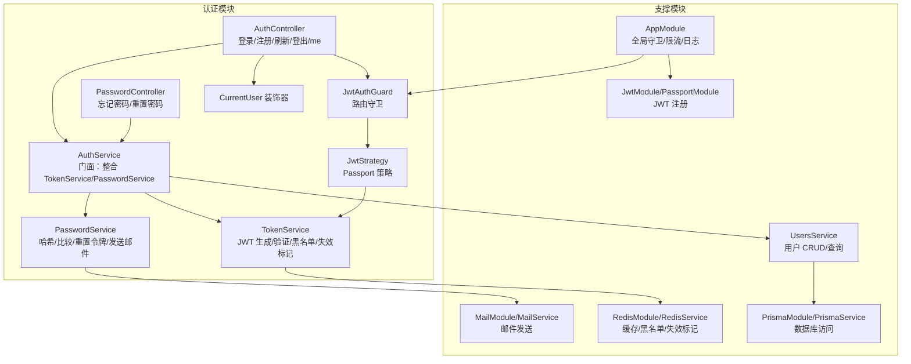
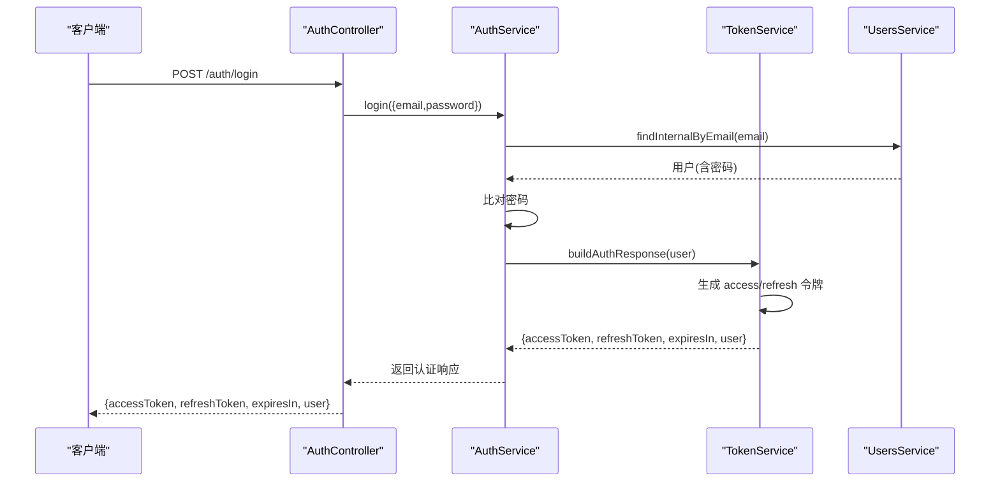
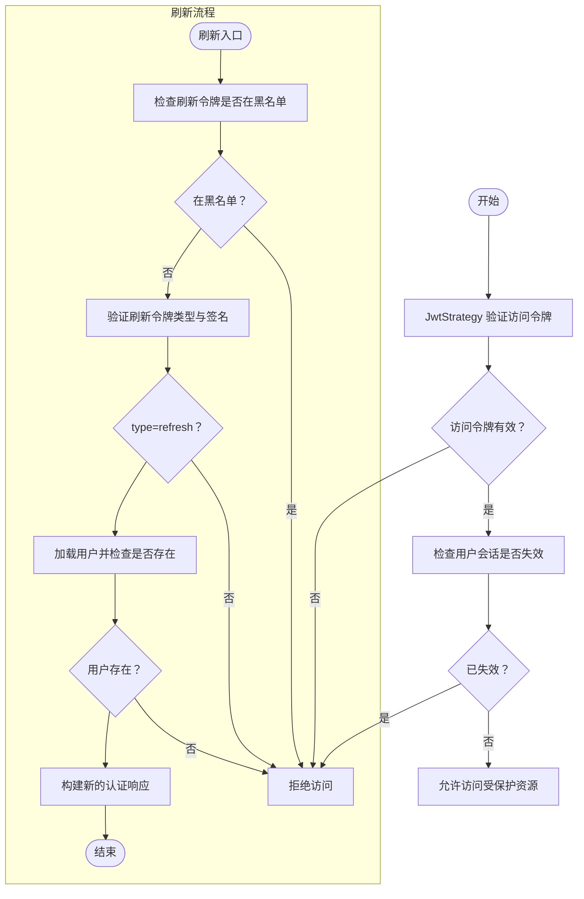
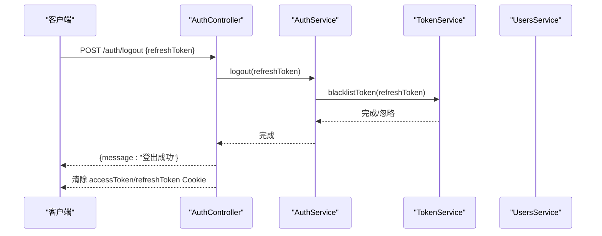
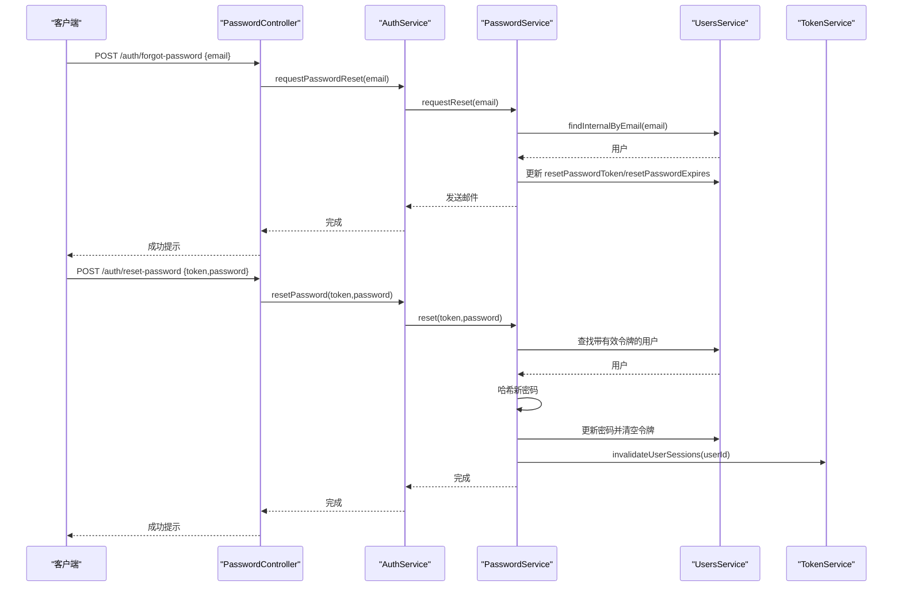
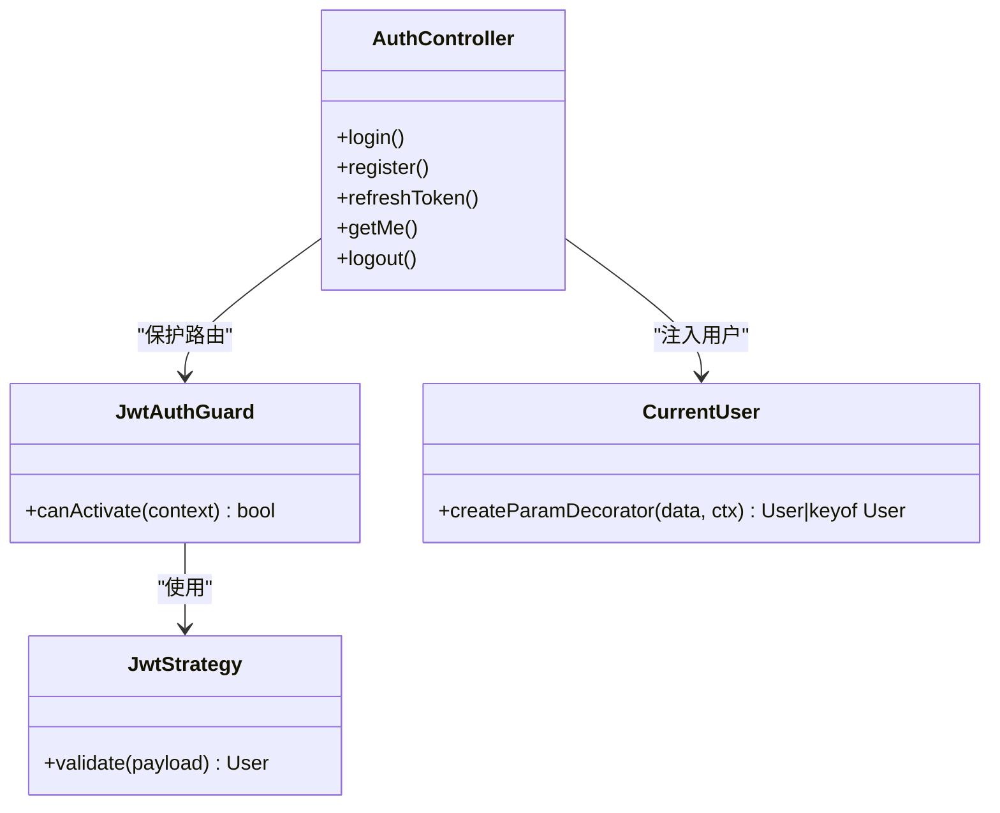
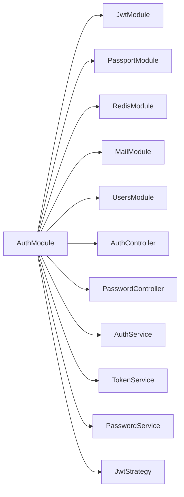

# 认证 API

<cite>
**本文引用的文件**
- [apps/backend/src/auth/auth.controller.ts](file://apps/backend/src/auth/auth.controller.ts)
- [apps/backend/src/auth/auth.service.ts](file://apps/backend/src/auth/auth.service.ts)
- [apps/backend/src/auth/token.service.ts](file://apps/backend/src/auth/token.service.ts)
- [apps/backend/src/auth/password.service.ts](file://apps/backend/src/auth/password.service.ts)
- [apps/backend/src/auth/password.controller.ts](file://apps/backend/src/auth/password.controller.ts)
- [apps/backend/src/auth/auth.dto.ts](file://apps/backend/src/auth/auth.dto.ts)
- [apps/backend/src/auth/jwt-auth.guard.ts](file://apps/backend/src/auth/jwt-auth.guard.ts)
- [apps/backend/src/auth/jwt.strategy.ts](file://apps/backend/src/auth/jwt.strategy.ts)
- [apps/backend/src/auth/current-user.decorator.ts](file://apps/backend/src/auth/current-user.decorator.ts)
- [apps/backend/src/auth/auth.module.ts](file://apps/backend/src/auth/auth.module.ts)
- [apps/backend/src/users/users.service.ts](file://apps/backend/src/users/users.service.ts)
- [packages/shared/src/schemas/auth.schema.ts](file://packages/shared/src/schemas/auth.schema.ts)
- [apps/backend/src/common/throttling/throttling.constants.ts](file://apps/backend/src/common/throttling/throttling.constants.ts)
- [apps/backend/src/app.module.ts](file://apps/backend/src/app.module.ts)
</cite>

## 目录
1. [简介](#简介)
2. [项目结构](#项目结构)
3. [核心组件](#核心组件)
4. [架构总览](#架构总览)
5. [详细组件分析](#详细组件分析)
6. [依赖关系分析](#依赖关系分析)
7. [性能考量](#性能考量)
8. [故障排除指南](#故障排除指南)
9. [结论](#结论)
10. [附录：API 规范](#附录api-规范)

## 简介
本文件为 Lumina Todo 的认证子系统提供完整的 API 文档与实现解析，覆盖以下主题：
- JWT 令牌生成、验证与刷新机制
- 登录、注册、登出、获取当前用户信息等端点流程
- 密码加密存储、密码重置与邮箱验证流程
- 权限控制机制（基于 JWT 的守卫与装饰器）
- 会话管理、令牌黑名单与安全注销
- 速率限制、全局异常过滤与日志
- OAuth/第三方认证扩展建议（当前仓库未实现）

## 项目结构
认证相关代码主要位于后端应用的 auth 子模块，配合用户服务、邮件服务、Redis 缓存与 Prisma 数据库模块协同工作。

图表来源
- [apps/backend/src/auth/auth.controller.ts:15-80](file://apps/backend/src/auth/auth.controller.ts#L15-L80)
- [apps/backend/src/auth/password.controller.ts:11-37](file://apps/backend/src/auth/password.controller.ts#L11-L37)
- [apps/backend/src/auth/auth.service.ts:12-21](file://apps/backend/src/auth/auth.service.ts#L12-L21)
- [apps/backend/src/auth/token.service.ts:15-45](file://apps/backend/src/auth/token.service.ts#L15-L45)
- [apps/backend/src/auth/password.service.ts:9-20](file://apps/backend/src/auth/password.service.ts#L9-L20)
- [apps/backend/src/auth/jwt.strategy.ts:19-36](file://apps/backend/src/auth/jwt.strategy.ts#L19-L36)
- [apps/backend/src/auth/jwt-auth.guard.ts:8-9](file://apps/backend/src/auth/jwt-auth.guard.ts#L8-L9)
- [apps/backend/src/auth/current-user.decorator.ts:8-18](file://apps/backend/src/auth/current-user.decorator.ts#L8-L18)
- [apps/backend/src/auth/auth.module.ts:19-39](file://apps/backend/src/auth/auth.module.ts#L19-L39)
- [apps/backend/src/users/users.service.ts:12-14](file://apps/backend/src/users/users.service.ts#L12-L14)
- [apps/backend/src/app.module.ts:147-153](file://apps/backend/src/app.module.ts#L147-L153)

章节来源
- [apps/backend/src/auth/auth.module.ts:19-39](file://apps/backend/src/auth/auth.module.ts#L19-L39)
- [apps/backend/src/app.module.ts:147-153](file://apps/backend/src/app.module.ts#L147-L153)

## 核心组件
- 控制器
  - AuthController：提供登录、注册、刷新、登出、获取当前用户信息端点
  - PasswordController：提供忘记密码与重置密码端点
- 服务
  - AuthService：认证门面，协调 UsersService、TokenService、PasswordService
  - TokenService：JWT 生成、验证、黑名单、会话失效标记
  - PasswordService：密码哈希/比较、重置令牌生成与校验、邮件通知
  - UsersService：用户数据访问与唯一性约束
- 安全与工具
  - JwtStrategy：JWT 验证策略（访问令牌类型校验、用户存在性校验、会话失效校验）
  - JwtAuthGuard：基于 JWT 的路由守卫
  - CurrentUser 装饰器：从请求中提取当前用户对象或字段
  - DTO 与 Schema：Zod 输入校验与 Swagger 文档生成
  - 限流与全局异常：Throttler、全局守卫、统一异常过滤

章节来源
- [apps/backend/src/auth/auth.controller.ts:15-80](file://apps/backend/src/auth/auth.controller.ts#L15-L80)
- [apps/backend/src/auth/password.controller.ts:11-37](file://apps/backend/src/auth/password.controller.ts#L11-L37)
- [apps/backend/src/auth/auth.service.ts:12-21](file://apps/backend/src/auth/auth.service.ts#L12-L21)
- [apps/backend/src/auth/token.service.ts:15-45](file://apps/backend/src/auth/token.service.ts#L15-L45)
- [apps/backend/src/auth/password.service.ts:9-20](file://apps/backend/src/auth/password.service.ts#L9-L20)
- [apps/backend/src/auth/jwt.strategy.ts:19-36](file://apps/backend/src/auth/jwt.strategy.ts#L19-L36)
- [apps/backend/src/auth/jwt-auth.guard.ts:8-9](file://apps/backend/src/auth/jwt-auth.guard.ts#L8-L9)
- [apps/backend/src/auth/current-user.decorator.ts:8-18](file://apps/backend/src/auth/current-user.decorator.ts#L8-L18)
- [apps/backend/src/auth/auth.dto.ts:15-40](file://apps/backend/src/auth/auth.dto.ts#L15-L40)
- [packages/shared/src/schemas/auth.schema.ts:24-120](file://packages/shared/src/schemas/auth.schema.ts#L24-L120)
- [apps/backend/src/common/throttling/throttling.constants.ts:90-118](file://apps/backend/src/common/throttling/throttling.constants.ts#L90-L118)

## 架构总览
认证系统采用“控制器-服务-策略-守卫”的分层设计，结合 Redis 实现令牌黑名单与会话失效标记，使用 Prisma 访问数据库，通过邮件服务完成密码重置通知。

图表来源
- [apps/backend/src/auth/auth.controller.ts:23-28](file://apps/backend/src/auth/auth.controller.ts#L23-L28)
- [apps/backend/src/auth/auth.service.ts:41-49](file://apps/backend/src/auth/auth.service.ts#L41-L49)
- [apps/backend/src/auth/token.service.ts:175-185](file://apps/backend/src/auth/token.service.ts#L175-L185)
- [apps/backend/src/users/users.service.ts:54-57](file://apps/backend/src/users/users.service.ts#L54-L57)

## 详细组件分析

### JWT 令牌生成、验证与刷新
- 生成
  - 访问令牌：短期有效，用于受保护资源访问
  - 刷新令牌：长期有效，用于换取新的访问令牌
- 验证
  - 访问令牌：由 JwtStrategy 校验，要求 type=access，且用户存在、会话未失效
  - 刷新令牌：由 TokenService 校验，要求 type=refresh，且未在黑名单、未被用户强制失效
- 刷新流程
  - 使用刷新令牌调用刷新端点，服务端验证后返回新的访问/刷新令牌组合
- 黑名单与会话失效
  - 登出时将刷新令牌加入黑名单；用户密码重置会标记其会话为失效，旧令牌无法再刷新

图表来源
- [apps/backend/src/auth/jwt.strategy.ts:41-66](file://apps/backend/src/auth/jwt.strategy.ts#L41-L66)
- [apps/backend/src/auth/token.service.ts:55-76](file://apps/backend/src/auth/token.service.ts#L55-L76)
- [apps/backend/src/auth/token.service.ts:103-125](file://apps/backend/src/auth/token.service.ts#L103-L125)
- [apps/backend/src/auth/token.service.ts:166-170](file://apps/backend/src/auth/token.service.ts#L166-L170)
- [apps/backend/src/auth/auth.service.ts:59-93](file://apps/backend/src/auth/auth.service.ts#L59-L93)

章节来源
- [apps/backend/src/auth/token.service.ts:17-45](file://apps/backend/src/auth/token.service.ts#L17-L45)
- [apps/backend/src/auth/token.service.ts:78-98](file://apps/backend/src/auth/token.service.ts#L78-L98)
- [apps/backend/src/auth/token.service.ts:103-125](file://apps/backend/src/auth/token.service.ts#L103-L125)
- [apps/backend/src/auth/token.service.ts:130-149](file://apps/backend/src/auth/token.service.ts#L130-L149)
- [apps/backend/src/auth/token.service.ts:166-170](file://apps/backend/src/auth/token.service.ts#L166-L170)
- [apps/backend/src/auth/jwt.strategy.ts:41-66](file://apps/backend/src/auth/jwt.strategy.ts#L41-L66)
- [apps/backend/src/auth/auth.service.ts:59-93](file://apps/backend/src/auth/auth.service.ts#L59-L93)

### 登录、注册、登出与获取当前用户
- 登录
  - 输入：邮箱、密码
  - 流程：查询用户、比对密码、签发访问/刷新令牌
- 注册
  - 输入：邮箱、姓名、密码
  - 流程：检查唯一性、哈希密码、创建用户、签发令牌
- 刷新
  - 输入：刷新令牌
  - 流程：黑名单/类型/失效检查、加载用户、签发新令牌
- 登出
  - 输入：刷新令牌
  - 流程：将刷新令牌加入黑名单，清除浏览器 Cookie
- 获取当前用户
  - 需要携带访问令牌，通过守卫与策略解析用户信息

图表来源
- [apps/backend/src/auth/auth.controller.ts:64-79](file://apps/backend/src/auth/auth.controller.ts#L64-L79)
- [apps/backend/src/auth/auth.service.ts:95-101](file://apps/backend/src/auth/auth.service.ts#L95-L101)
- [apps/backend/src/auth/token.service.ts:130-149](file://apps/backend/src/auth/token.service.ts#L130-L149)

章节来源
- [apps/backend/src/auth/auth.controller.ts:23-79](file://apps/backend/src/auth/auth.controller.ts#L23-L79)
- [apps/backend/src/auth/auth.service.ts:41-54](file://apps/backend/src/auth/auth.service.ts#L41-L54)
- [apps/backend/src/auth/auth.service.ts:95-101](file://apps/backend/src/auth/auth.service.ts#L95-L101)
- [apps/backend/src/users/users.service.ts:96-116](file://apps/backend/src/users/users.service.ts#L96-L116)

### 密码加密存储与密码重置
- 密码加密存储
  - 注册与更新密码均使用 bcrypt 哈希，成本因子固定
- 密码重置
  - 请求重置：生成随机令牌并进行 SHA-256 哈希存储，设置过期时间，向邮箱发送重置链接
  - 重置密码：校验令牌与过期时间，哈希新密码并清除令牌，同时使该用户的会话失效（强制重新登录）

图表来源
- [apps/backend/src/auth/password.controller.ts:18-25](file://apps/backend/src/auth/password.controller.ts#L18-L25)
- [apps/backend/src/auth/password.controller.ts:29-36](file://apps/backend/src/auth/password.controller.ts#L29-L36)
- [apps/backend/src/auth/auth.service.ts:106-112](file://apps/backend/src/auth/auth.service.ts#L106-L112)
- [apps/backend/src/auth/password.service.ts:39-61](file://apps/backend/src/auth/password.service.ts#L39-L61)
- [apps/backend/src/auth/password.service.ts:66-89](file://apps/backend/src/auth/password.service.ts#L66-L89)
- [apps/backend/src/auth/token.service.ts:47-53](file://apps/backend/src/auth/token.service.ts#L47-L53)

章节来源
- [apps/backend/src/auth/password.service.ts:24-34](file://apps/backend/src/auth/password.service.ts#L24-L34)
- [apps/backend/src/auth/password.service.ts:39-61](file://apps/backend/src/auth/password.service.ts#L39-L61)
- [apps/backend/src/auth/password.service.ts:66-89](file://apps/backend/src/auth/password.service.ts#L66-L89)
- [apps/backend/src/users/users.service.ts:96-116](file://apps/backend/src/users/users.service.ts#L96-L116)
- [apps/backend/src/auth/token.service.ts:47-53](file://apps/backend/src/auth/token.service.ts#L47-L53)

### 权限控制机制与中间件
- 路由守卫
  - JwtAuthGuard：基于 passport-jwt 的访问令牌验证
- 参数装饰器
  - CurrentUser：从请求上下文提取当前用户对象或指定字段
- 全局与端点级限流
  - 全局 Throttler 守卫，按短/中/长窗口限制请求频率
  - 认证相关端点配置独立限流策略，防暴力破解
- 异常与日志
  - 统一异常过滤器与 Pino 日志模块，生产环境输出 JSON 日志

图表来源
- [apps/backend/src/auth/jwt-auth.guard.ts:8-9](file://apps/backend/src/auth/jwt-auth.guard.ts#L8-L9)
- [apps/backend/src/auth/jwt.strategy.ts:41-66](file://apps/backend/src/auth/jwt.strategy.ts#L41-L66)
- [apps/backend/src/auth/current-user.decorator.ts:8-18](file://apps/backend/src/auth/current-user.decorator.ts#L8-L18)
- [apps/backend/src/auth/auth.controller.ts:53-59](file://apps/backend/src/auth/auth.controller.ts#L53-L59)

章节来源
- [apps/backend/src/auth/jwt-auth.guard.ts:8-9](file://apps/backend/src/auth/jwt-auth.guard.ts#L8-L9)
- [apps/backend/src/auth/jwt.strategy.ts:41-66](file://apps/backend/src/auth/jwt.strategy.ts#L41-L66)
- [apps/backend/src/auth/current-user.decorator.ts:8-18](file://apps/backend/src/auth/current-user.decorator.ts#L8-L18)
- [apps/backend/src/common/throttling/throttling.constants.ts:90-118](file://apps/backend/src/common/throttling/throttling.constants.ts#L90-L118)
- [apps/backend/src/app.module.ts:147-153](file://apps/backend/src/app.module.ts#L147-L153)

### 会话管理、令牌黑名单与安全注销
- 会话失效
  - 密码重置后通过 Redis 标记用户会话失效时间，旧访问令牌将被拒绝
- 令牌黑名单
  - 登出时将刷新令牌写入黑名单，保证其无法再次刷新
- Cookie 清理
  - 登出接口同时清除浏览器中的访问/刷新令牌 Cookie

章节来源
- [apps/backend/src/auth/token.service.ts:47-53](file://apps/backend/src/auth/token.service.ts#L47-L53)
- [apps/backend/src/auth/token.service.ts:130-149](file://apps/backend/src/auth/token.service.ts#L130-L149)
- [apps/backend/src/auth/auth.controller.ts:74-76](file://apps/backend/src/auth/auth.controller.ts#L74-L76)

### API 密钥管理、OAuth 集成与第三方认证
- 当前仓库未实现 API Key 管理与 OAuth/第三方认证集成
- 如需扩展，建议：
  - 引入独立的密钥服务与权限模型
  - 在 JwtModule/JwtStrategy 中扩展多密钥/多租户支持
  - 新增 OAuth 策略与用户关联逻辑

[本节为概念性说明，不直接分析具体文件]

## 依赖关系分析
认证模块通过依赖注入整合多个子系统，形成清晰的职责边界与低耦合关系。

图表来源
- [apps/backend/src/auth/auth.module.ts:19-39](file://apps/backend/src/auth/auth.module.ts#L19-L39)

章节来源
- [apps/backend/src/auth/auth.module.ts:19-39](file://apps/backend/src/auth/auth.module.ts#L19-L39)

## 性能考量
- 令牌签名与验证
  - 使用短期访问令牌与长期刷新令牌，降低频繁登录开销
  - 访问令牌过期时间可配置，默认值来自环境变量
- 会话失效与黑名单
  - 通过 Redis TTL 管理黑名单与失效标记，避免内存膨胀
- 速率限制
  - 全局与端点级限流策略，防止暴力破解与滥用
- 日志与异常
  - 生产环境使用结构化日志，减少解析成本

[本节提供一般性指导，不直接分析具体文件]

## 故障排除指南
- 常见错误与定位
  - 凭证无效：登录返回无效凭据，检查邮箱/密码与用户是否存在
  - 令牌过期/无效：访问令牌过期或类型不符，需使用刷新令牌或重新登录
  - 刷新令牌无效：可能已被登出加入黑名单或用户会话被强制失效
  - 用户不存在：令牌指向的用户被删除或数据不一致
  - 重置令牌无效：令牌不存在或已过期
- 定位手段
  - 查看统一异常过滤器输出与 Pino 日志
  - 检查 Redis 中的黑名单与失效标记键
  - 核对 JWT_SECRET/JWT_REFRESH_SECRET 配置

章节来源
- [apps/backend/src/auth/auth.service.ts:44-46](file://apps/backend/src/auth/auth.service.ts#L44-L46)
- [apps/backend/src/auth/auth.service.ts:63-70](file://apps/backend/src/auth/auth.service.ts#L63-L70)
- [apps/backend/src/auth/auth.service.ts:81-83](file://apps/backend/src/auth/auth.service.ts#L81-L83)
- [apps/backend/src/auth/password.service.ts:76-78](file://apps/backend/src/auth/password.service.ts#L76-L78)
- [apps/backend/src/auth/token.service.ts:103-113](file://apps/backend/src/auth/token.service.ts#L103-L113)
- [apps/backend/src/auth/token.service.ts:166-170](file://apps/backend/src/auth/token.service.ts#L166-L170)

## 结论
Lumina Todo 的认证系统以 NestJS 的 Passport/JWT 为核心，结合 Redis 实现了可靠的令牌管理与会话控制，并通过严格的输入校验、速率限制与统一异常处理保障了安全性与可用性。当前未包含 API Key 与 OAuth 扩展，后续可在现有模块基础上平滑演进。

[本节为总结性内容，不直接分析具体文件]

## 附录：API 规范

### 通用响应
- 成功响应通常包含标准字段与业务数据
- 失败响应遵循统一异常过滤器的错误结构

章节来源
- [apps/backend/src/auth/auth.controller.ts:23-79](file://apps/backend/src/auth/auth.controller.ts#L23-L79)
- [apps/backend/src/auth/password.controller.ts:18-36](file://apps/backend/src/auth/password.controller.ts#L18-L36)

### 登录
- 方法与路径
  - POST /auth/login
- 请求体
  - 邮箱、密码（Zod 校验）
- 响应
  - 认证响应：包含短期访问令牌、长期刷新令牌、过期时间与用户信息
- 安全要点
  - 速率限制防暴力破解
  - 访问令牌用于后续受保护请求

章节来源
- [apps/backend/src/auth/auth.controller.ts:23-28](file://apps/backend/src/auth/auth.controller.ts#L23-L28)
- [apps/backend/src/auth/auth.dto.ts:15-15](file://apps/backend/src/auth/auth.dto.ts#L15-L15)
- [packages/shared/src/schemas/auth.schema.ts:24-28](file://packages/shared/src/schemas/auth.schema.ts#L24-L28)
- [apps/backend/src/common/throttling/throttling.constants.ts:90-94](file://apps/backend/src/common/throttling/throttling.constants.ts#L90-L94)

### 注册
- 方法与路径
  - POST /auth/register
- 请求体
  - 邮箱、姓名、密码（Zod 校验）
- 响应
  - 认证响应：包含短期访问令牌、长期刷新令牌、过期时间与用户信息
- 安全要点
  - 唯一性约束（邮箱）
  - 密码哈希存储

章节来源
- [apps/backend/src/auth/auth.controller.ts:33-38](file://apps/backend/src/auth/auth.controller.ts#L33-L38)
- [apps/backend/src/auth/auth.dto.ts:20-20](file://apps/backend/src/auth/auth.dto.ts#L20-L20)
- [packages/shared/src/schemas/auth.schema.ts:32-41](file://packages/shared/src/schemas/auth.schema.ts#L32-L41)
- [apps/backend/src/common/throttling/throttling.constants.ts:96-100](file://apps/backend/src/common/throttling/throttling.constants.ts#L96-L100)
- [apps/backend/src/users/users.service.ts:96-116](file://apps/backend/src/users/users.service.ts#L96-L116)

### 刷新访问令牌
- 方法与路径
  - POST /auth/refresh
- 请求体
  - 刷新令牌（Zod 校验）
- 响应
  - 认证响应：新的短期访问令牌与刷新令牌
- 安全要点
  - 类型校验（必须为 refresh）
  - 黑名单检查
  - 用户会话失效检查

章节来源
- [apps/backend/src/auth/auth.controller.ts:43-48](file://apps/backend/src/auth/auth.controller.ts#L43-L48)
- [apps/backend/src/auth/auth.dto.ts:25-25](file://apps/backend/src/auth/auth.dto.ts#L25-L25)
- [packages/shared/src/schemas/auth.schema.ts:80-86](file://packages/shared/src/schemas/auth.schema.ts#L80-L86)
- [apps/backend/src/common/throttling/throttling.constants.ts:102-106](file://apps/backend/src/common/throttling/throttling.constants.ts#L102-L106)
- [apps/backend/src/auth/auth.service.ts:59-93](file://apps/backend/src/auth/auth.service.ts#L59-L93)

### 获取当前用户信息
- 方法与路径
  - GET /auth/me
- 请求头
  - Authorization: Bearer <访问令牌>
- 响应
  - 当前用户信息
- 安全要点
  - 需要有效的访问令牌并通过 JwtStrategy 校验

章节来源
- [apps/backend/src/auth/auth.controller.ts:53-59](file://apps/backend/src/auth/auth.controller.ts#L53-L59)
- [apps/backend/src/auth/jwt-auth.guard.ts:8-9](file://apps/backend/src/auth/jwt-auth.guard.ts#L8-L9)
- [apps/backend/src/auth/jwt.strategy.ts:41-66](file://apps/backend/src/auth/jwt.strategy.ts#L41-L66)

### 登出
- 方法与路径
  - POST /auth/logout
- 请求体
  - 刷新令牌（Zod 校验）
- 响应
  - 成功消息
- 安全要点
  - 将刷新令牌加入黑名单
  - 清除浏览器 Cookie

章节来源
- [apps/backend/src/auth/auth.controller.ts:64-79](file://apps/backend/src/auth/auth.controller.ts#L64-L79)
- [apps/backend/src/auth/auth.dto.ts:39-40](file://apps/backend/src/auth/auth.dto.ts#L39-L40)
- [packages/shared/src/schemas/auth.schema.ts:88-95](file://packages/shared/src/schemas/auth.schema.ts#L88-L95)
- [apps/backend/src/auth/auth.service.ts:95-101](file://apps/backend/src/auth/auth.service.ts#L95-L101)
- [apps/backend/src/auth/token.service.ts:130-149](file://apps/backend/src/auth/token.service.ts#L130-L149)

### 忘记密码
- 方法与路径
  - POST /auth/forgot-password
- 请求体
  - 邮箱（Zod 校验）
- 响应
  - 成功消息（若邮箱存在则发送重置链接）
- 安全要点
  - 防止枚举攻击（无论邮箱是否存在均快速返回）

章节来源
- [apps/backend/src/auth/password.controller.ts:18-25](file://apps/backend/src/auth/password.controller.ts#L18-L25)
- [apps/backend/src/auth/auth.dto.ts:30-30](file://apps/backend/src/auth/auth.dto.ts#L30-L30)
- [packages/shared/src/schemas/auth.schema.ts:98-102](file://packages/shared/src/schemas/auth.schema.ts#L98-L102)
- [apps/backend/src/common/throttling/throttling.constants.ts:108-112](file://apps/backend/src/common/throttling/throttling.constants.ts#L108-L112)
- [apps/backend/src/auth/password.service.ts:39-61](file://apps/backend/src/auth/password.service.ts#L39-L61)

### 重置密码
- 方法与路径
  - POST /auth/reset-password
- 请求体
  - 令牌、新密码（Zod 校验）
- 响应
  - 成功消息
- 安全要点
  - 令牌有效性与过期时间校验
  - 重置后强制用户重新登录

章节来源
- [apps/backend/src/auth/password.controller.ts:29-36](file://apps/backend/src/auth/password.controller.ts#L29-L36)
- [apps/backend/src/auth/auth.dto.ts:35-35](file://apps/backend/src/auth/auth.dto.ts#L35-L35)
- [packages/shared/src/schemas/auth.schema.ts:105-110](file://packages/shared/src/schemas/auth.schema.ts#L105-L110)
- [apps/backend/src/common/throttling/throttling.constants.ts:114-118](file://apps/backend/src/common/throttling/throttling.constants.ts#L114-L118)
- [apps/backend/src/auth/password.service.ts:66-89](file://apps/backend/src/auth/password.service.ts#L66-L89)
- [apps/backend/src/auth/token.service.ts:47-53](file://apps/backend/src/auth/token.service.ts#L47-L53)

### 速率限制与限流策略
- 全局限流
  - 基于 Redis 的多窗口限流策略，支持短/中/长窗口
- 认证相关限流
  - 登录、注册、刷新、忘记密码、重置密码分别配置独立策略
- 跳过条件
  - OPTIONS 预检与健康检查端点跳过全局限流

章节来源
- [apps/backend/src/common/throttling/throttling.constants.ts:90-118](file://apps/backend/src/common/throttling/throttling.constants.ts#L90-L118)
- [apps/backend/src/common/throttling/throttling.constants.ts:162-171](file://apps/backend/src/common/throttling/throttling.constants.ts#L162-L171)
- [apps/backend/src/app.module.ts:117-123](file://apps/backend/src/app.module.ts#L117-L123)