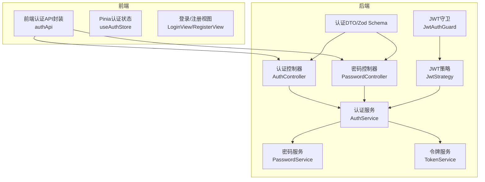
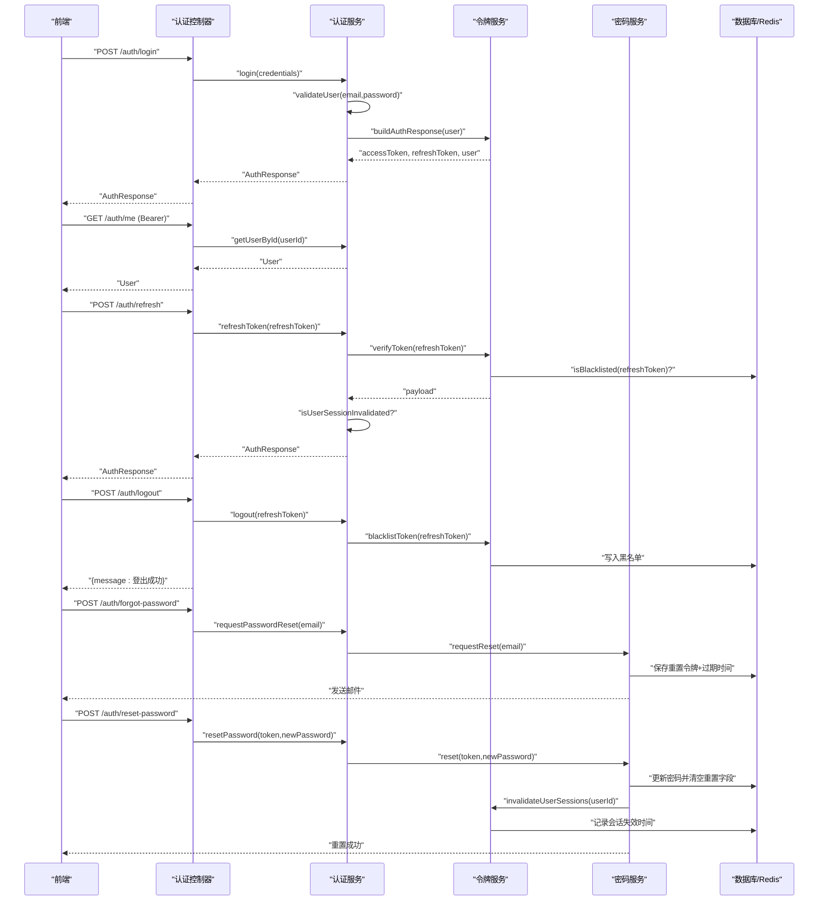
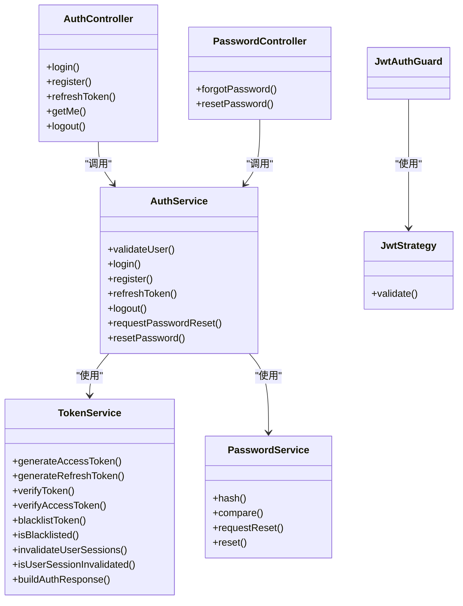

# 认证API

<cite>
**本文引用的文件**
- [apps/backend/src/auth/auth.controller.ts](file://apps/backend/src/auth/auth.controller.ts)
- [apps/backend/src/auth/auth.service.ts](file://apps/backend/src/auth/auth.service.ts)
- [apps/backend/src/auth/auth.dto.ts](file://apps/backend/src/auth/auth.dto.ts)
- [apps/backend/src/auth/token.service.ts](file://apps/backend/src/auth/token.service.ts)
- [apps/backend/src/auth/password.controller.ts](file://apps/backend/src/auth/password.controller.ts)
- [apps/backend/src/auth/password.service.ts](file://apps/backend/src/auth/password.service.ts)
- [apps/backend/src/auth/jwt-auth.guard.ts](file://apps/backend/src/auth/jwt-auth.guard.ts)
- [apps/backend/src/auth/jwt.strategy.ts](file://apps/backend/src/auth/jwt.strategy.ts)
- [packages/shared/src/schemas/auth.schema.ts](file://packages/shared/src/schemas/auth.schema.ts)
- [apps/backend/src/app.module.ts](file://apps/backend/src/app.module.ts)
- [apps/backend/src/common/types.ts](file://apps/backend/src/common/types.ts)
- [apps/backend/tests/e2e/auth.e2e.spec.ts](file://apps/backend/tests/e2e/auth.e2e.spec.ts)
- [apps/frontend/src/features/auth/api/index.ts](file://apps/frontend/src/features/auth/api/index.ts)
- [apps/frontend/src/features/auth/stores/auth.ts](file://apps/frontend/src/features/auth/stores/auth.ts)
- [apps/frontend/src/features/auth/views/LoginView.vue](file://apps/frontend/src/features/auth/views/LoginView.vue)
- [apps/frontend/src/features/auth/views/RegisterView.vue](file://apps/frontend/src/features/auth/views/RegisterView.vue)
</cite>

## 目录
1. [简介](#简介)
2. [项目结构](#项目结构)
3. [核心组件](#核心组件)
4. [架构总览](#架构总览)
5. [详细组件分析](#详细组件分析)
6. [依赖关系分析](#依赖关系分析)
7. [性能考量](#性能考量)
8. [故障排查指南](#故障排查指南)
9. [结论](#结论)
10. [附录](#附录)

## 简介
本文件系统性地文档化了认证API，覆盖用户登录、注册、令牌刷新、登出、密码重置等完整流程。重点说明JWT认证流程、Cookie与令牌管理、安全策略（速率限制、CSRF防护、令牌黑名单与会话失效）、请求参数校验规则、响应数据结构、错误码定义，并提供前后端集成要点、SDK使用方式、前端认证状态管理策略、安全最佳实践与防暴力破解措施。

## 项目结构
认证能力由后端NestJS模块与前端Pinia状态管理共同实现，共享Schema通过Zod保障前后一致的输入校验；后端采用JWT策略与Redis黑名单/会话失效机制，前端通过拦截器与Pinia持久化管理令牌与用户态。

图表来源
- [apps/backend/src/auth/auth.controller.ts:14-81](file://apps/backend/src/auth/auth.controller.ts#L14-L81)
- [apps/backend/src/auth/password.controller.ts:10-38](file://apps/backend/src/auth/password.controller.ts#L10-L38)
- [apps/backend/src/auth/auth.service.ts:12-126](file://apps/backend/src/auth/auth.service.ts#L12-L126)
- [apps/backend/src/auth/token.service.ts:15-186](file://apps/backend/src/auth/token.service.ts#L15-L186)
- [apps/backend/src/auth/password.service.ts:9-99](file://apps/backend/src/auth/password.service.ts#L9-L99)
- [apps/backend/src/auth/jwt-auth.guard.ts:8-9](file://apps/backend/src/auth/jwt-auth.guard.ts#L8-L9)
- [apps/backend/src/auth/jwt.strategy.ts:19-67](file://apps/backend/src/auth/jwt.strategy.ts#L19-L67)
- [apps/frontend/src/features/auth/api/index.ts:7-78](file://apps/frontend/src/features/auth/api/index.ts#L7-L78)
- [apps/frontend/src/features/auth/stores/auth.ts:23-390](file://apps/frontend/src/features/auth/stores/auth.ts#L23-L390)
- [apps/frontend/src/features/auth/views/LoginView.vue:1-111](file://apps/frontend/src/features/auth/views/LoginView.vue#L1-L111)
- [apps/frontend/src/features/auth/views/RegisterView.vue:1-121](file://apps/frontend/src/features/auth/views/RegisterView.vue#L1-L121)

章节来源
- [apps/backend/src/auth/auth.controller.ts:14-81](file://apps/backend/src/auth/auth.controller.ts#L14-L81)
- [apps/backend/src/auth/password.controller.ts:10-38](file://apps/backend/src/auth/password.controller.ts#L10-L38)
- [apps/backend/src/auth/auth.service.ts:12-126](file://apps/backend/src/auth/auth.service.ts#L12-L126)
- [apps/backend/src/auth/token.service.ts:15-186](file://apps/backend/src/auth/token.service.ts#L15-L186)
- [apps/backend/src/auth/password.service.ts:9-99](file://apps/backend/src/auth/password.service.ts#L9-L99)
- [apps/backend/src/auth/jwt-auth.guard.ts:8-9](file://apps/backend/src/auth/jwt-auth.guard.ts#L8-L9)
- [apps/backend/src/auth/jwt.strategy.ts:19-67](file://apps/backend/src/auth/jwt.strategy.ts#L19-L67)
- [apps/frontend/src/features/auth/api/index.ts:7-78](file://apps/frontend/src/features/auth/api/index.ts#L7-L78)
- [apps/frontend/src/features/auth/stores/auth.ts:23-390](file://apps/frontend/src/features/auth/stores/auth.ts#L23-L390)
- [apps/frontend/src/features/auth/views/LoginView.vue:1-111](file://apps/frontend/src/features/auth/views/LoginView.vue#L1-L111)
- [apps/frontend/src/features/auth/views/RegisterView.vue:1-121](file://apps/frontend/src/features/auth/views/RegisterView.vue#L1-L121)

## 核心组件
- 认证控制器：暴露 /auth/login、/auth/register、/auth/refresh、/auth/me、/auth/logout、/auth/forgot-password、/auth/reset-password 等端点，内置速率限制与Swagger标注。
- 认证服务：整合用户、令牌、密码服务，提供登录/注册/刷新/登出/密码重置入口。
- 令牌服务：生成短期访问令牌与长期刷新令牌，维护黑名单与用户会话失效标记，构建统一认证响应。
- 密码服务：哈希/比较密码，生成带过期的重置令牌，发送邮件，重置后使旧会话失效。
- JWT策略与守卫：从请求头解析Bearer令牌，校验类型与有效性，结合Redis会话失效策略。
- 前端API封装与状态管理：统一调用后端认证接口，持久化令牌与用户信息，自动刷新访问令牌，登出时清理本地状态并通知后端。

章节来源
- [apps/backend/src/auth/auth.controller.ts:16-81](file://apps/backend/src/auth/auth.controller.ts#L16-L81)
- [apps/backend/src/auth/auth.service.ts:13-126](file://apps/backend/src/auth/auth.service.ts#L13-L126)
- [apps/backend/src/auth/token.service.ts:16-186](file://apps/backend/src/auth/token.service.ts#L16-L186)
- [apps/backend/src/auth/password.service.ts:9-99](file://apps/backend/src/auth/password.service.ts#L9-L99)
- [apps/backend/src/auth/jwt-auth.guard.ts:8-9](file://apps/backend/src/auth/jwt-auth.guard.ts#L8-L9)
- [apps/backend/src/auth/jwt.strategy.ts:19-67](file://apps/backend/src/auth/jwt.strategy.ts#L19-L67)
- [apps/frontend/src/features/auth/api/index.ts:7-78](file://apps/frontend/src/features/auth/api/index.ts#L7-L78)
- [apps/frontend/src/features/auth/stores/auth.ts:23-390](file://apps/frontend/src/features/auth/stores/auth.ts#L23-L390)

## 架构总览
下图展示认证端到端流程：前端发起登录/注册，后端返回访问与刷新令牌；后续受保护接口使用访问令牌；访问令牌过期则使用刷新令牌换取新令牌；登出时将刷新令牌加入黑名单并清空Cookie；密码重置通过邮件发送链接，校验令牌后更新密码并使旧会话失效。

图表来源
- [apps/backend/src/auth/auth.controller.ts:22-80](file://apps/backend/src/auth/auth.controller.ts#L22-L80)
- [apps/backend/src/auth/auth.service.ts:41-101](file://apps/backend/src/auth/auth.service.ts#L41-L101)
- [apps/backend/src/auth/token.service.ts:175-185](file://apps/backend/src/auth/token.service.ts#L175-L185)
- [apps/backend/src/auth/password.service.ts:39-89](file://apps/backend/src/auth/password.service.ts#L39-L89)
- [apps/frontend/src/features/auth/api/index.ts:11-77](file://apps/frontend/src/features/auth/api/index.ts#L11-L77)

章节来源
- [apps/backend/src/auth/auth.controller.ts:22-80](file://apps/backend/src/auth/auth.controller.ts#L22-L80)
- [apps/backend/src/auth/auth.service.ts:41-101](file://apps/backend/src/auth/auth.service.ts#L41-L101)
- [apps/backend/src/auth/token.service.ts:175-185](file://apps/backend/src/auth/token.service.ts#L175-L185)
- [apps/backend/src/auth/password.service.ts:39-89](file://apps/backend/src/auth/password.service.ts#L39-L89)
- [apps/frontend/src/features/auth/api/index.ts:11-77](file://apps/frontend/src/features/auth/api/index.ts#L11-L77)

## 详细组件分析

### 认证控制器与端点规范
- 登录
  - 路径：POST /auth/login
  - 速率限制：默认每1分钟最多5次
  - 请求体：LoginInput（email、password）
  - 响应：AuthResponse（accessToken、refreshToken、expiresIn、user）
- 注册
  - 路径：POST /auth/register
  - 速率限制：默认每1分钟最多3次
  - 请求体：RegisterInput（email、name、password）
  - 响应：AuthResponse
- 刷新访问令牌
  - 路径：POST /auth/refresh
  - 速率限制：默认每1分钟最多10次
  - 请求体：RefreshTokenInput（refreshToken）
  - 响应：AuthResponse
- 获取当前用户
  - 路径：GET /auth/me
  - 守卫：JwtAuthGuard（Bearer）
  - 响应：User
- 登出
  - 路径：POST /auth/logout
  - 守卫：JwtAuthGuard（Bearer）
  - 请求体：LogoutInput（refreshToken）
  - 行为：后端将刷新令牌加入黑名单，前端清空Cookie
  - 响应：{ message: "登出成功" }
- 密码找回
  - 路径：POST /auth/forgot-password
  - 速率限制：默认每1分钟最多3次
  - 请求体：ForgotPasswordInput（email）
  - 响应：{ message: "...已发送到您的邮箱" }
- 重置密码
  - 路径：POST /auth/reset-password
  - 速率限制：默认每1分钟最多5次
  - 请求体：ResetPasswordInput（token、password）
  - 响应：{ message: "密码重置成功..." }

章节来源
- [apps/backend/src/auth/auth.controller.ts:22-80](file://apps/backend/src/auth/auth.controller.ts#L22-L80)
- [apps/backend/src/auth/password.controller.ts:19-37](file://apps/backend/src/auth/password.controller.ts#L19-L37)
- [apps/backend/src/auth/auth.dto.ts:15-40](file://apps/backend/src/auth/auth.dto.ts#L15-L40)
- [packages/shared/src/schemas/auth.schema.ts:24-110](file://packages/shared/src/schemas/auth.schema.ts#L24-L110)

### 认证服务与令牌服务
- 认证服务
  - validateUser：按邮箱查找用户并比对密码
  - login/register：返回统一AuthResponse
  - refreshToken：校验刷新令牌合法性、用户会话是否被失效、用户是否存在，失败抛Unauthorized
  - logout：将刷新令牌加入黑名单（忽略失败）
  - 密码重置：委托密码服务
- 令牌服务
  - 生成短期访问令牌与长期刷新令牌，分别配置过期时间与密钥
  - blacklistToken：基于JWT剩余有效期写入Redis黑名单
  - isBlacklisted：查询黑名单
  - isUserSessionInvalidated/invalidateUserSessions：基于Redis记录用户会话失效时间，防止旧令牌继续生效
  - buildAuthResponse：组合accessToken、refreshToken、expiresIn与user

章节来源
- [apps/backend/src/auth/auth.service.ts:26-101](file://apps/backend/src/auth/auth.service.ts#L26-L101)
- [apps/backend/src/auth/token.service.ts:47-185](file://apps/backend/src/auth/token.service.ts#L47-L185)

### JWT策略与守卫
- JwtAuthGuard：基于Passport的JWT守卫，保护受注解的路由
- JwtStrategy：
  - 从Authorization头解析Bearer令牌
  - 校验令牌类型必须为access
  - 校验sub为正整数
  - 结合Redis判断用户会话是否被失效
  - 从数据库加载用户并返回

章节来源
- [apps/backend/src/auth/jwt-auth.guard.ts:8-9](file://apps/backend/src/auth/jwt-auth.guard.ts#L8-L9)
- [apps/backend/src/auth/jwt.strategy.ts:41-66](file://apps/backend/src/auth/jwt.strategy.ts#L41-L66)

### 密码重置流程
- 请求重置：生成随机token并SHA256散列存储，设置过期时间，向邮箱发送重置链接
- 重置密码：校验token与过期时间，更新密码并清空重置字段，调用令牌服务使用户旧会话失效

章节来源
- [apps/backend/src/auth/password.service.ts:39-89](file://apps/backend/src/auth/password.service.ts#L39-L89)
- [apps/backend/src/auth/token.service.ts:47-53](file://apps/backend/src/auth/token.service.ts#L47-L53)

### 前端认证状态管理与SDK集成
- SDK封装：authApi提供login/register/forgotPassword/resetPassword/refreshToken/logout/getMe
- Pinia状态：
  - 状态：token、refreshToken、user、loading、error、fieldErrors
  - 计算：isAuthenticated
  - 方法：login/register/fetchCurrentUser/refreshAccessToken/logout/clearError
  - 持久化：localStorage持久化token与user
  - 令牌刷新：带重试与瞬时错误处理
  - 登出：清理本地状态并调用后端logout

章节来源
- [apps/frontend/src/features/auth/api/index.ts:7-78](file://apps/frontend/src/features/auth/api/index.ts#L7-L78)
- [apps/frontend/src/features/auth/stores/auth.ts:23-390](file://apps/frontend/src/features/auth/stores/auth.ts#L23-L390)

### 请求参数验证规则与响应结构
- 输入验证（Zod）：
  - LoginInput：email（必填、邮箱格式、小写、去空白），password（6-100字符）
  - RegisterInput：email/name/password同上
  - RefreshTokenInput/LogoutInput：refreshToken必填
  - ForgotPasswordInput：email必填
  - ResetPasswordInput：token/password必填
- 响应结构：
  - AuthResponse：accessToken、refreshToken、expiresIn、user
  - User：id、email、name、avatar、createdAt、updatedAt

章节来源
- [packages/shared/src/schemas/auth.schema.ts:24-110](file://packages/shared/src/schemas/auth.schema.ts#L24-L110)

### 错误码与国际化键
- 后端错误码（Unauthorized/BadRequest）：
  - auth.INVALID_CREDENTIALS、auth.INVALID_REFRESH_TOKEN、auth.USER_NOT_FOUND、auth.TOKEN_EXPIRED、auth.INVALID_TOKEN、auth.INVALID_RESET_TOKEN
- 前端错误显示：
  - 统一处理401与瞬时错误，支持字段级错误映射

章节来源
- [apps/backend/src/auth/auth.service.ts:44-91](file://apps/backend/src/auth/auth.service.ts#L44-L91)
- [apps/backend/src/auth/password.service.ts:77-78](file://apps/backend/src/auth/password.service.ts#L77-L78)
- [apps/backend/src/auth/token.service.ts:103-124](file://apps/backend/src/auth/token.service.ts#L103-L124)
- [apps/frontend/src/features/auth/stores/auth.ts:40-97](file://apps/frontend/src/features/auth/stores/auth.ts#L40-L97)

### Cookie与令牌管理
- 登出时后端返回响应并清空accessToken/refreshToken Cookie（通过FastifyReplyWithCookie）
- 前端通过拦截器设置/清除Authorization头，不依赖Cookie
- 令牌刷新：前端轮询刷新，成功后更新本地状态并持久化

章节来源
- [apps/backend/src/auth/auth.controller.ts:69-80](file://apps/backend/src/auth/auth.controller.ts#L69-L80)
- [apps/backend/src/common/types.ts:3-4](file://apps/backend/src/common/types.ts#L3-L4)
- [apps/frontend/src/features/auth/stores/auth.ts:325-351](file://apps/frontend/src/features/auth/stores/auth.ts#L325-L351)

### 安全策略与防暴力破解
- 速率限制：全局Throttler配置短/中/长窗口，认证端点额外限流
- CSRF防护：E2E测试验证非GET请求需携带X-Requested-With头，否则拒绝
- 令牌安全：
  - 访问令牌短期有效，刷新令牌长期有效
  - 刷新令牌加入黑名单，登出后不可再使用
  - 用户会话失效：服务端记录失效时间，旧令牌无法通过验证
- 密码安全：bcrypt哈希、重置令牌SHA256散列存储、过期控制

章节来源
- [apps/backend/src/app.module.ts:116-138](file://apps/backend/src/app.module.ts#L116-L138)
- [apps/backend/tests/e2e/auth.e2e.spec.ts:30-62](file://apps/backend/tests/e2e/auth.e2e.spec.ts#L30-L62)
- [apps/backend/src/auth/token.service.ts:130-170](file://apps/backend/src/auth/token.service.ts#L130-L170)
- [apps/backend/src/auth/password.service.ts:25-34](file://apps/backend/src/auth/password.service.ts#L25-L34)

## 依赖关系分析

图表来源
- [apps/backend/src/auth/auth.controller.ts:16-81](file://apps/backend/src/auth/auth.controller.ts#L16-L81)
- [apps/backend/src/auth/password.controller.ts:11-38](file://apps/backend/src/auth/password.controller.ts#L11-L38)
- [apps/backend/src/auth/auth.service.ts:13-126](file://apps/backend/src/auth/auth.service.ts#L13-L126)
- [apps/backend/src/auth/token.service.ts:15-186](file://apps/backend/src/auth/token.service.ts#L15-L186)
- [apps/backend/src/auth/password.service.ts:9-99](file://apps/backend/src/auth/password.service.ts#L9-L99)
- [apps/backend/src/auth/jwt-auth.guard.ts:8-9](file://apps/backend/src/auth/jwt-auth.guard.ts#L8-L9)
- [apps/backend/src/auth/jwt.strategy.ts:19-67](file://apps/backend/src/auth/jwt.strategy.ts#L19-L67)

章节来源
- [apps/backend/src/auth/auth.controller.ts:16-81](file://apps/backend/src/auth/auth.controller.ts#L16-L81)
- [apps/backend/src/auth/password.controller.ts:11-38](file://apps/backend/src/auth/password.controller.ts#L11-L38)
- [apps/backend/src/auth/auth.service.ts:13-126](file://apps/backend/src/auth/auth.service.ts#L13-L126)
- [apps/backend/src/auth/token.service.ts:15-186](file://apps/backend/src/auth/token.service.ts#L15-L186)
- [apps/backend/src/auth/password.service.ts:9-99](file://apps/backend/src/auth/password.service.ts#L9-L99)
- [apps/backend/src/auth/jwt-auth.guard.ts:8-9](file://apps/backend/src/auth/jwt-auth.guard.ts#L8-L9)
- [apps/backend/src/auth/jwt.strategy.ts:19-67](file://apps/backend/src/auth/jwt.strategy.ts#L19-L67)

## 性能考量
- 令牌生成与校验：JWT签名/验签开销低，Redis黑名单与会话失效查询为O(1)，建议合理设置Redis TTL与过期策略。
- 速率限制：短/中/长窗口组合可抑制突发流量；认证端点独立限流避免暴力破解。
- 前端刷新重试：指数退避与最大重试次数减少无效重试，提升用户体验。
- 数据库与缓存：密码重置令牌与会话失效标记均走Redis，降低数据库压力。

## 故障排查指南
- 登录失败
  - 检查email/password是否符合Zod规则
  - 后端返回401且message为INVALID_CREDENTIALS
- 刷新令牌失败
  - 检查refreshToken是否在黑名单
  - 检查用户会话是否被失效（invalidateUserSessions）
  - 确认令牌类型为refresh且未过期
- 获取当前用户失败
  - 确认Authorization头携带Bearer访问令牌
  - 检查令牌类型是否为access
- 登出后仍可刷新
  - 确认后端已将refreshToken加入黑名单
  - 前端是否正确清除了Cookie
- 密码重置无效
  - 检查token是否过期
  - 检查resetPasswordToken与resetPasswordExpires是否正确写入

章节来源
- [apps/backend/src/auth/auth.service.ts:59-93](file://apps/backend/src/auth/auth.service.ts#L59-L93)
- [apps/backend/src/auth/token.service.ts:166-170](file://apps/backend/src/auth/token.service.ts#L166-L170)
- [apps/backend/src/auth/jwt.strategy.ts:41-66](file://apps/backend/src/auth/jwt.strategy.ts#L41-L66)
- [apps/backend/tests/e2e/auth.e2e.spec.ts:91-153](file://apps/backend/tests/e2e/auth.e2e.spec.ts#L91-L153)

## 结论
本认证体系以JWT为核心，结合Redis黑名单与会话失效机制，提供可靠的令牌生命周期管理；前后端通过共享Schema保证输入一致性，前端Pinia状态管理与SDK封装简化了集成；配合速率限制与CSRF防护，整体具备良好的安全性与可用性。

## 附录

### API调用示例（路径参考）
- 登录
  - POST /auth/login
  - 请求体：LoginInput
  - 响应：AuthResponse
  - 参考：[apps/backend/src/auth/auth.controller.ts:22-27](file://apps/backend/src/auth/auth.controller.ts#L22-L27)
- 注册
  - POST /auth/register
  - 请求体：RegisterInput
  - 响应：AuthResponse
  - 参考：[apps/backend/src/auth/auth.controller.ts:33-38](file://apps/backend/src/auth/auth.controller.ts#L33-L38)
- 刷新访问令牌
  - POST /auth/refresh
  - 请求体：RefreshTokenInput
  - 响应：AuthResponse
  - 参考：[apps/backend/src/auth/auth.controller.ts:43-48](file://apps/backend/src/auth/auth.controller.ts#L43-L48)
- 获取当前用户
  - GET /auth/me
  - 请求头：Authorization: Bearer <accessToken>
  - 响应：User
  - 参考：[apps/backend/src/auth/auth.controller.ts:53-60](file://apps/backend/src/auth/auth.controller.ts#L53-L60)
- 登出
  - POST /auth/logout
  - 请求体：LogoutInput
  - 响应：{ message: "登出成功" }
  - 参考：[apps/backend/src/auth/auth.controller.ts:65-80](file://apps/backend/src/auth/auth.controller.ts#L65-L80)
- 密码找回
  - POST /auth/forgot-password
  - 请求体：ForgotPasswordInput
  - 响应：{ message: "..." }
  - 参考：[apps/backend/src/auth/password.controller.ts:19-25](file://apps/backend/src/auth/password.controller.ts#L19-L25)
- 重置密码
  - POST /auth/reset-password
  - 请求体：ResetPasswordInput
  - 响应：{ message: "..." }
  - 参考：[apps/backend/src/auth/password.controller.ts:31-37](file://apps/backend/src/auth/password.controller.ts#L31-L37)

### SDK集成方法（前端）
- 使用authApi进行认证操作
  - 登录/注册：接收AuthResponse并更新本地状态
  - 刷新：在访问令牌即将过期前调用
  - 登出：清理本地状态并调用后端logout
- 参考：
  - [apps/frontend/src/features/auth/api/index.ts:7-78](file://apps/frontend/src/features/auth/api/index.ts#L7-L78)
  - [apps/frontend/src/features/auth/stores/auth.ts:148-351](file://apps/frontend/src/features/auth/stores/auth.ts#L148-L351)

### 前端认证状态管理
- Pinia Store关键点
  - 持久化：localStorage保存token/refreshToken/user
  - 自动刷新：访问令牌过期时使用refreshToken刷新
  - 错误处理：区分401与瞬时错误，上报遥测事件
- 参考：
  - [apps/frontend/src/features/auth/stores/auth.ts:23-390](file://apps/frontend/src/features/auth/stores/auth.ts#L23-L390)

### 视图与表单校验
- 登录页：基于LoginSchema进行表单校验
- 注册页：扩展确认密码校验
- 参考：
  - [apps/frontend/src/features/auth/views/LoginView.vue:23-37](file://apps/frontend/src/features/auth/views/LoginView.vue#L23-L37)
  - [apps/frontend/src/features/auth/views/RegisterView.vue:23-47](file://apps/frontend/src/features/auth/views/RegisterView.vue#L23-L47)

### 令牌过期与会话管理策略
- 访问令牌短期有效，刷新令牌长期有效
- 刷新令牌加入黑名单，登出后不可再用
- 用户会话失效：服务端记录失效时间，旧令牌无法通过验证
- 参考：
  - [apps/backend/src/auth/token.service.ts:47-76](file://apps/backend/src/auth/token.service.ts#L47-L76)
  - [apps/backend/src/auth/token.service.ts:130-170](file://apps/backend/src/auth/token.service.ts#L130-L170)