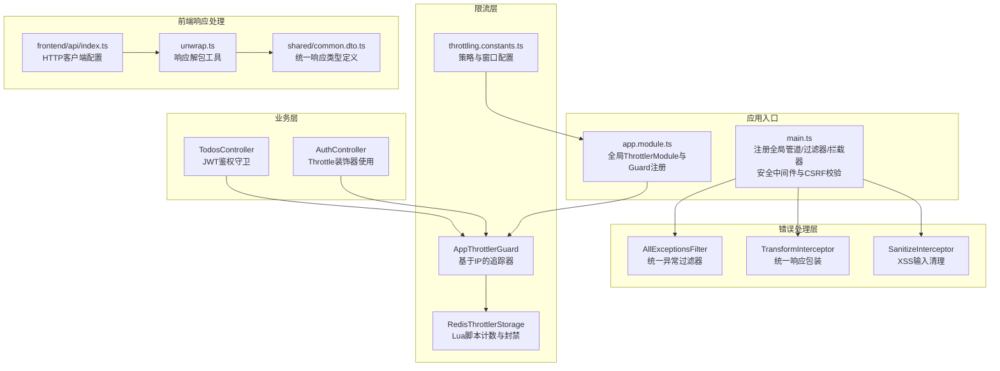
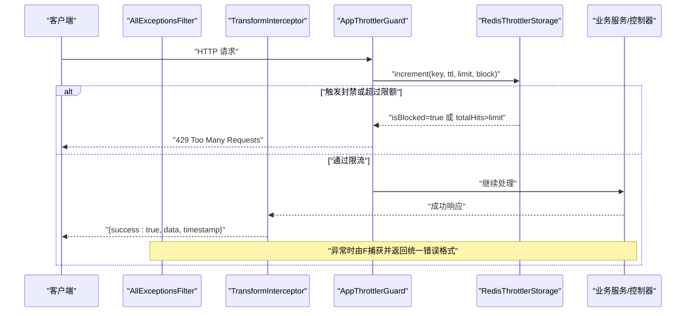
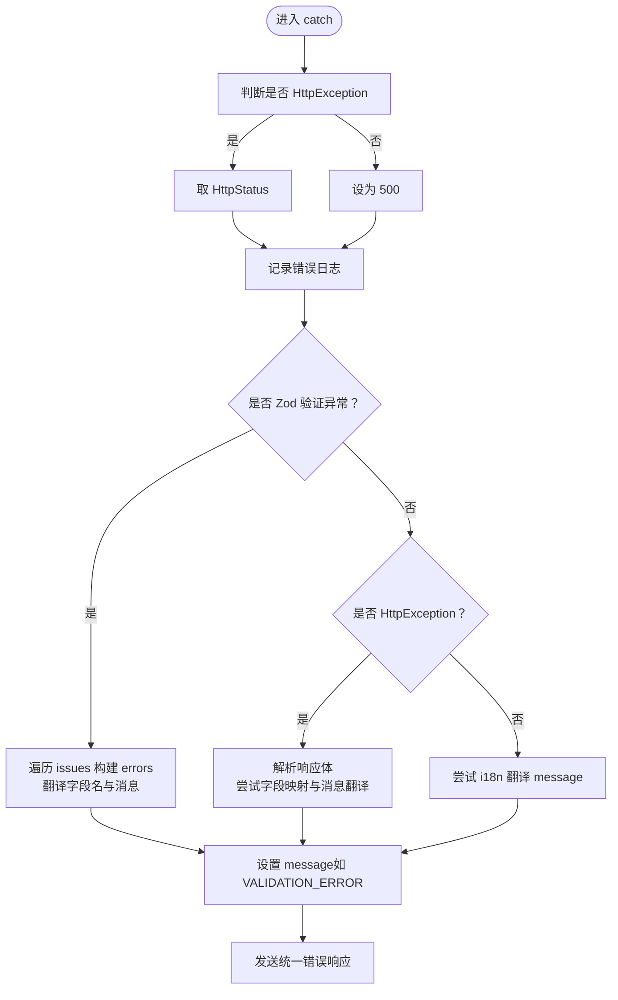
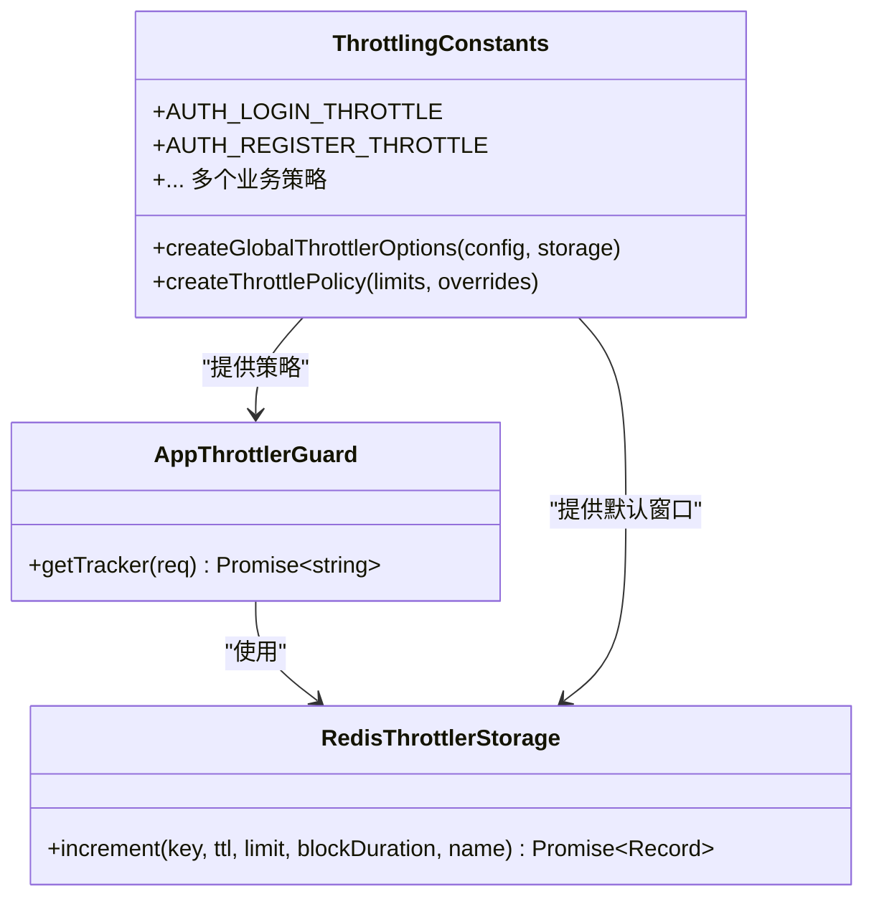
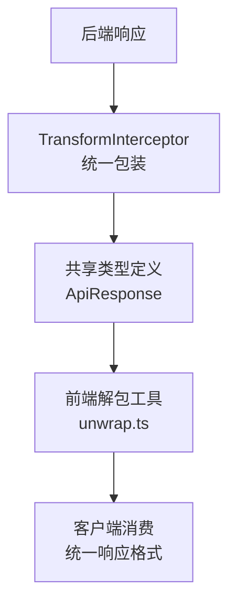
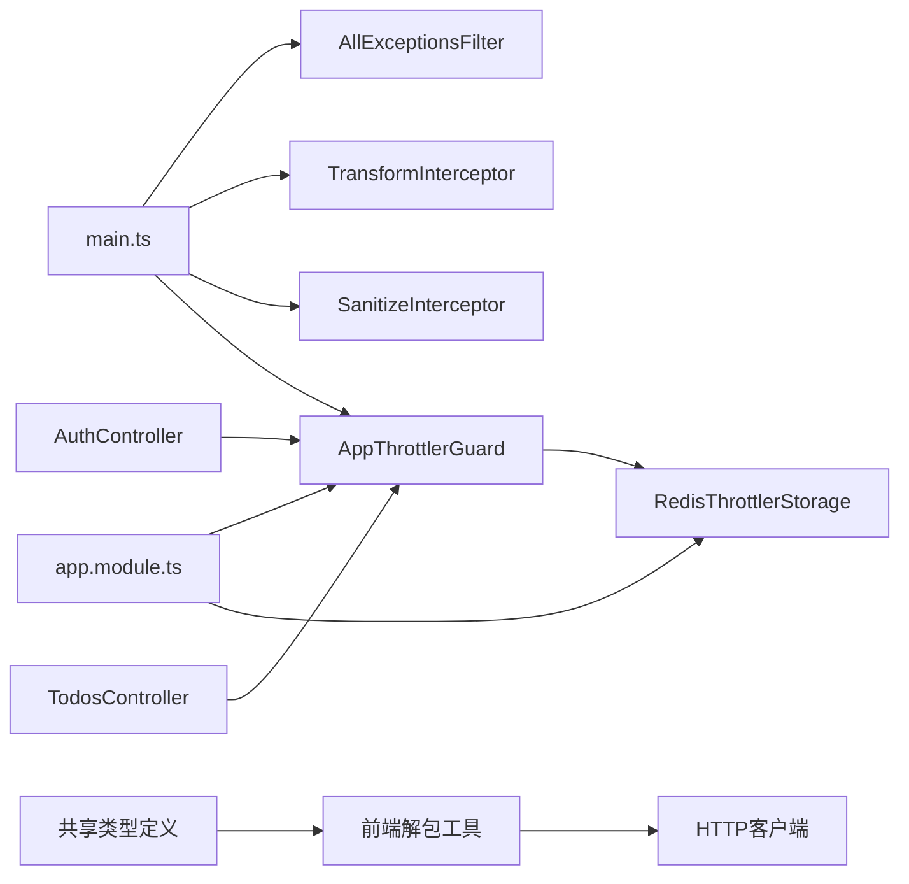

# 错误处理

<cite>
**本文引用的文件**
- [apps/backend/src/common/filters/all-exceptions.filter.ts](file://apps/backend/src/common/filters/all-exceptions.filter.ts)
- [apps/backend/src/common/throttling/throttling.guard.ts](file://apps/backend/src/common/throttling/throttling.guard.ts)
- [apps/backend/src/common/throttling/redis-throttler.storage.ts](file://apps/backend/src/common/throttling/redis-throttler.storage.ts)
- [apps/backend/src/common/throttling/throttling.constants.ts](file://apps/backend/src/common/throttling/throttling.constants.ts)
- [apps/backend/src/common/interceptors/transform.interceptor.ts](file://apps/backend/src/common/interceptors/transform.interceptor.ts)
- [apps/backend/src/common/interceptors/sanitize.interceptor.ts](file://apps/backend/src/common/interceptors/sanitize.interceptor.ts)
- [apps/backend/src/app.module.ts](file://apps/backend/src/app.module.ts)
- [apps/backend/src/main.ts](file://apps/backend/src/main.ts)
- [apps/backend/src/auth/auth.controller.ts](file://apps/backend/src/auth/auth.controller.ts)
- [apps/backend/src/todos/todos.controller.ts](file://apps/backend/src/todos/todos.controller.ts)
- [apps/backend/src/i18n/en-US/common.ts](file://apps/backend/src/i18n/en-US/common.ts)
- [apps/backend/src/i18n/zh-CN/common.ts](file://apps/backend/src/i18n/zh-CN/common.ts)
- [apps/backend/src/i18n/en-US/auth.ts](file://apps/backend/src/i18n/en-US/auth.ts)
- [apps/backend/tests/common/filters/all-exceptions.filter.spec.ts](file://apps/backend/tests/common/filters/all-exceptions.filter.spec.ts)
- [apps/backend/tests/common/throttling.guard.spec.ts](file://apps/backend/tests/common/throttling.guard.spec.ts)
- [apps/backend/tests/auth/auth.service.spec.ts](file://apps/backend/tests/auth/auth.service.spec.ts)
- [apps/frontend/src/api/unwrap.ts](file://apps/frontend/src/api/unwrap.ts)
- [packages/shared/src/dto/common.dto.ts](file://packages/shared/src/dto/common.dto.ts)
- [apps/frontend/tests/api/unwrap.spec.ts](file://apps/frontend/tests/api/unwrap.spec.ts)
- [apps/frontend/src/api/index.ts](file://apps/frontend/src/api/index.ts)
</cite>

## 更新摘要

**变更内容**

- 新增统一API响应处理系统，通过 TransformInterceptor 提供标准化响应包装
- 新增 unwrap.ts 辅助函数，确保前后端一致的响应格式
- 共享 ApiResponse 类型定义，支持前后端一致性
- 增强错误处理机制，前后端都有一致的响应格式

## 目录

1. [简介](#简介)
2. [项目结构](#项目结构)
3. [核心组件](#核心组件)
4. [架构总览](#架构总览)
5. [详细组件分析](#详细组件分析)
6. [依赖关系分析](#依赖关系分析)
7. [性能考量](#性能考量)
8. [故障排查指南](#故障排查指南)
9. [结论](#结论)
10. [附录](#附录)

## 简介

本文件系统性梳理 Lumina Todo 后端的 API 错误处理机制，覆盖以下方面：

- 统一的全局异常过滤器与自定义错误响应格式
- HTTP 状态码与典型错误场景的对应关系及解决方案
- 全局限流与频率限制策略、Redis 存储实现与回退机制
- 防滥用与安全防护（CSRF、XSS、CORS、Helmet 等）
- 客户端错误处理策略（重试、降级、用户体验优化）
- 日志记录规范、错误追踪与调试信息收集
- 生产环境错误监控与告警最佳实践
- **新增**：统一API响应处理系统，确保前后端一致的响应格式

## 项目结构

围绕错误处理的关键目录与文件如下：

- 过滤器与拦截器：统一异常过滤、响应包装、输入清理
- 限流模块：全局守卫、Redis 存储脚本、策略常量
- 应用入口与模块：全局注册、安全中间件、Swagger 文档
- 控制器与服务：业务异常抛出与限流装饰器使用
- 国际化：错误消息与字段名本地化
- **新增**：前端响应解包工具，确保前后端一致性

**图表来源**

- [apps/backend/src/main.ts:172-179](file://apps/backend/src/main.ts#L172-L179)
- [apps/backend/src/app.module.ts:118-123](file://apps/backend/src/app.module.ts#L118-L123)
- [apps/backend/src/common/filters/all-exceptions.filter.ts:16-137](file://apps/backend/src/common/filters/all-exceptions.filter.ts#L16-L137)
- [apps/backend/src/common/interceptors/transform.interceptor.ts:18-29](file://apps/backend/src/common/interceptors/transform.interceptor.ts#L18-L29)
- [apps/backend/src/common/interceptors/sanitize.interceptor.ts:9-64](file://apps/backend/src/common/interceptors/sanitize.interceptor.ts#L9-L64)
- [apps/backend/src/common/throttling/throttling.guard.ts:28-34](file://apps/backend/src/common/throttling/throttling.guard.ts#L28-L34)
- [apps/backend/src/common/throttling/redis-throttler.storage.ts:106-156](file://apps/backend/src/common/throttling/redis-throttler.storage.ts#L106-L156)
- [apps/backend/src/common/throttling/throttling.constants.ts:173-197](file://apps/backend/src/common/throttling/throttling.constants.ts#L173-L197)
- [apps/backend/src/auth/auth.controller.ts:23-48](file://apps/backend/src/auth/auth.controller.ts#L23-L48)
- [apps/backend/src/todos/todos.controller.ts:21-24](file://apps/backend/src/todos/todos.controller.ts#L21-L24)
- [apps/frontend/src/api/unwrap.ts:1-30](file://apps/frontend/src/api/unwrap.ts#L1-L30)
- [packages/shared/src/dto/common.dto.ts:1-99](file://packages/shared/src/dto/common.dto.ts#L1-L99)
- [apps/frontend/src/api/index.ts:1-198](file://apps/frontend/src/api/index.ts#L1-L198)

**章节来源**

- [apps/backend/src/main.ts:172-179](file://apps/backend/src/main.ts#L172-L179)
- [apps/backend/src/app.module.ts:118-123](file://apps/backend/src/app.module.ts#L118-L123)

## 核心组件

- 全局异常过滤器：捕获所有未处理异常，统一输出结构化错误响应；支持 Zod 验证错误拆解、业务异常字段映射、国际化消息与字段名翻译。
- 统一响应拦截器：将所有成功响应统一包装为包含 success、data、timestamp 的结构，确保前后端一致性。
- 输入清理拦截器：对请求体、查询参数、路径参数进行递归 XSS 清理。
- 全局限流守卫：基于客户端真实 IP（考虑反向代理链）进行限流；Redis Lua 脚本原子计数与封禁；失败回退到内存存储。
- 安全中间件与 CSRF 校验：Helmet 安全头、CORS、压缩、静态资源、CSRF 校验（缺失 X-Requested-With 时拒绝并返回统一错误格式）。
- **新增**：前端响应解包工具：通过 unwrap.ts 辅助函数确保前后端一致的响应格式，避免 v-for 错遍历包装对象的问题。

**章节来源**

- [apps/backend/src/common/filters/all-exceptions.filter.ts:16-137](file://apps/backend/src/common/filters/all-exceptions.filter.ts#L16-L137)
- [apps/backend/src/common/interceptors/transform.interceptor.ts:18-29](file://apps/backend/src/common/interceptors/transform.interceptor.ts#L18-L29)
- [apps/backend/src/common/interceptors/sanitize.interceptor.ts:9-64](file://apps/backend/src/common/interceptors/sanitize.interceptor.ts#L9-L64)
- [apps/backend/src/common/throttling/throttling.guard.ts:28-34](file://apps/backend/src/common/throttling/throttling.guard.ts#L28-L34)
- [apps/backend/src/common/throttling/redis-throttler.storage.ts:106-156](file://apps/backend/src/common/throttling/redis-throttler.storage.ts#L106-L156)
- [apps/backend/src/main.ts:94-167](file://apps/backend/src/main.ts#L94-L167)
- [apps/frontend/src/api/unwrap.ts:1-30](file://apps/frontend/src/api/unwrap.ts#L1-L30)

## 架构总览

统一错误处理与限流在应用启动阶段完成全局注册，并贯穿所有控制器与服务调用链。新增的统一响应处理系统确保前后端响应格式的一致性。

**图表来源**

- [apps/backend/src/common/throttling/throttling.guard.ts:28-34](file://apps/backend/src/common/throttling/throttling.guard.ts#L28-L34)
- [apps/backend/src/common/throttling/redis-throttler.storage.ts:114-156](file://apps/backend/src/common/throttling/redis-throttler.storage.ts#L114-L156)
- [apps/backend/src/common/interceptors/transform.interceptor.ts:18-29](file://apps/backend/src/common/interceptors/transform.interceptor.ts#L18-L29)
- [apps/backend/src/common/filters/all-exceptions.filter.ts:16-137](file://apps/backend/src/common/filters/all-exceptions.filter.ts#L16-L137)

## 详细组件分析

### 全局异常过滤器 AllExceptionsFilter

- 功能要点
  - 统一捕获异常并输出结构化错误响应：包含 success、data、message、errors、statusCode、timestamp。
  - 对 Zod 验证错误进行拆解，按字段生成结构化 errors，并支持国际化字段名与消息。
  - 对业务异常（如 ConflictException）进行字段映射（例如 auth.EMAIL_EXISTS -> email 字段）。
  - 国际化：优先使用 i18n 翻译键值，否则回退到默认消息；字段名通过 common.fields.\* 进行翻译。
  - 日志：记录方法、URL、状态码与堆栈信息，便于问题定位。
- 错误响应格式
  - 结构：success=false、data=null、message（可为翻译键或文本）、errors（可选，结构化字段错误）、statusCode、timestamp。
  - 示例场景
    - Zod 验证失败：返回 400，errors 包含每个字段的错误消息。
    - 业务冲突：如邮箱已存在，返回 409，errors 映射到具体字段。
    - 未知错误：返回 500，message 为国际化"服务器内部错误"。

**图表来源**

- [apps/backend/src/common/filters/all-exceptions.filter.ts:27-137](file://apps/backend/src/common/filters/all-exceptions.filter.ts#L27-L137)

**章节来源**

- [apps/backend/src/common/filters/all-exceptions.filter.ts:16-137](file://apps/backend/src/common/filters/all-exceptions.filter.ts#L16-L137)
- [apps/backend/tests/common/filters/all-exceptions.filter.spec.ts:49-124](file://apps/backend/tests/common/filters/all-exceptions.filter.spec.ts#L49-L124)

### 统一响应拦截器 TransformInterceptor

- 功能要点
  - 将所有成功响应统一包装为 { success: true, data, timestamp }。
  - 保持上游返回的数据结构不变，仅增加统一字段。
  - 与共享的 ApiResponse 类型定义保持一致，确保前后端响应格式统一。
- 适用范围
  - 适用于所有控制器的成功响应，保证前端一致的响应结构。
- **新增**：响应格式与共享类型定义完全一致，支持前后端一致性。

**章节来源**

- [apps/backend/src/common/interceptors/transform.interceptor.ts:18-29](file://apps/backend/src/common/interceptors/transform.interceptor.ts#L18-L29)

### 输入清理拦截器 SanitizeInterceptor

- 功能要点
  - 对请求体、查询参数、路径参数进行递归清理，移除所有 HTML 标签，防止 XSS。
  - 通过 sanitize-html 的配置，确保不渲染任何标签，避免注入风险。
- 适用范围
  - 全局生效，对所有请求进行净化，降低 XSS 风险。

**章节来源**

- [apps/backend/src/common/interceptors/sanitize.interceptor.ts:9-64](file://apps/backend/src/common/interceptors/sanitize.interceptor.ts#L9-L64)

### 全局限流与频率限制

- 全局守卫 AppThrottlerGuard
  - 基于客户端真实 IP 进行追踪：优先使用 request.ip，若为空则从 X-Forwarded-For 链表取最后一个非空 IP。
  - 与反向代理/负载均衡配合，确保限流准确。
- Redis 存储与 Lua 脚本
  - 使用 Redis ZSET 记录时间戳序列，原子执行 TTL 清理、计数、封禁判定与过期时间计算。
  - 当 Redis 不可用时，自动回退到内存存储，避免服务中断。
- 策略与窗口
  - 提供短/中/长三档窗口，默认 TTL 与限制可在环境变量中覆盖。
  - 针对不同业务场景（登录、注册、刷新、外部源、文件上传/解析、MCP 工具调用等）预置限流策略。
  - 全局跳过规则：OPTIONS 预检与 /api/health 路径不参与限流。
- 全局注册
  - 在 AppModule 中注册 ThrottlerModule 并注入全局 Guard；同时提供 Redis 存储实例。

**图表来源**

- [apps/backend/src/common/throttling/throttling.guard.ts:28-34](file://apps/backend/src/common/throttling/throttling.guard.ts#L28-L34)
- [apps/backend/src/common/throttling/redis-throttler.storage.ts:106-156](file://apps/backend/src/common/throttling/redis-throttler.storage.ts#L106-L156)
- [apps/backend/src/common/throttling/throttling.constants.ts:67-197](file://apps/backend/src/common/throttling/throttling.constants.ts#L67-L197)

**章节来源**

- [apps/backend/src/common/throttling/throttling.guard.ts:28-34](file://apps/backend/src/common/throttling/throttling.guard.ts#L28-L34)
- [apps/backend/src/common/throttling/redis-throttler.storage.ts:106-156](file://apps/backend/src/common/throttling/redis-throttler.storage.ts#L106-L156)
- [apps/backend/src/common/throttling/throttling.constants.ts:67-197](file://apps/backend/src/common/throttling/throttling.constants.ts#L67-L197)
- [apps/backend/src/app.module.ts:118-123](file://apps/backend/src/app.module.ts#L118-L123)

### 安全中间件与 CSRF 校验

- Helmet：设置 CSP、跨站策略等安全头。
- CORS：显式允许来源、方法与头部，避免通配符导致的安全问题。
- CSRF 校验：对非安全方法请求检查 X-Requested-With 头，缺失时返回 403 并使用统一错误格式。
- 压缩与静态资源：启用 gzip 压缩与公共静态资源托管。

**章节来源**

- [apps/backend/src/main.ts:48-131](file://apps/backend/src/main.ts#L48-L131)

### 控制器与业务异常

- 认证控制器：对登录、注册、刷新等接口使用 Throttle 装饰器应用相应策略。
- 待办控制器：使用 JWT 守卫保护接口，避免未授权访问。
- 业务异常：服务层抛出的异常（如 UnauthorizedException）由全局过滤器捕获并返回统一格式。

**章节来源**

- [apps/backend/src/auth/auth.controller.ts:23-48](file://apps/backend/src/auth/auth.controller.ts#L23-L48)
- [apps/backend/src/todos/todos.controller.ts:21-24](file://apps/backend/src/todos/todos.controller.ts#L21-L24)
- [apps/backend/tests/auth/auth.service.spec.ts:86-91](file://apps/backend/tests/auth/auth.service.spec.ts#L86-L91)

### **新增**：统一API响应处理系统

- **TransformInterceptor**：全局响应转换拦截器，将所有成功响应统一包装为标准格式
- **共享类型定义**：在 packages/shared 中定义 ApiResponse、ApiSuccessResponse、ApiErrorResponse 类型
- **前端解包工具**：unwrap.ts 提供 getJson、postJson、putJson、patchJson、deleteJson 等辅助函数
- **前后端一致性**：确保前后端响应格式完全一致，避免 v-for 错遍历包装对象的问题

**图表来源**

- [apps/backend/src/common/interceptors/transform.interceptor.ts:18-29](file://apps/backend/src/common/interceptors/transform.interceptor.ts#L18-L29)
- [packages/shared/src/dto/common.dto.ts:1-99](file://packages/shared/src/dto/common.dto.ts#L1-L99)
- [apps/frontend/src/api/unwrap.ts:1-30](file://apps/frontend/src/api/unwrap.ts#L1-L30)

**章节来源**

- [apps/backend/src/common/interceptors/transform.interceptor.ts:18-29](file://apps/backend/src/common/interceptors/transform.interceptor.ts#L18-L29)
- [packages/shared/src/dto/common.dto.ts:1-99](file://packages/shared/src/dto/common.dto.ts#L1-L99)
- [apps/frontend/src/api/unwrap.ts:1-30](file://apps/frontend/src/api/unwrap.ts#L1-L30)

## 依赖关系分析

- 组件耦合
  - main.ts 注册全局管道/过滤器/拦截器与安全中间件，形成统一的错误与安全边界。
  - app.module.ts 注入全局 ThrottlerModule 与 Guard，集中管理限流策略。
  - 控制器通过装饰器使用限流策略，服务层异常由过滤器统一处理。
  - **新增**：共享类型定义被前后端共同使用，确保响应格式一致性。
- 外部依赖
  - Redis 用于限流存储；当不可用时自动回退至内存存储，保障可用性。
  - i18n 用于错误消息与字段名的多语言支持。
  - **新增**：Axios 作为 HTTP 客户端，配合前端解包工具处理统一响应格式。

**图表来源**

- [apps/backend/src/main.ts:172-179](file://apps/backend/src/main.ts#L172-L179)
- [apps/backend/src/app.module.ts:118-123](file://apps/backend/src/app.module.ts#L118-L123)
- [apps/backend/src/auth/auth.controller.ts:23-48](file://apps/backend/src/auth/auth.controller.ts#L23-L48)
- [apps/backend/src/todos/todos.controller.ts:21-24](file://apps/backend/src/todos/todos.controller.ts#L21-L24)
- [packages/shared/src/dto/common.dto.ts:1-99](file://packages/shared/src/dto/common.dto.ts#L1-L99)
- [apps/frontend/src/api/unwrap.ts:1-30](file://apps/frontend/src/api/unwrap.ts#L1-L30)

## 性能考量

- 限流性能
  - Redis Lua 原子操作减少往返开销；内存回退仅在极端情况下触发，日常应稳定走 Redis。
  - 合理设置 TTL 与限制，避免过小 TTL 导致频繁过期与重建。
- 响应与安全
  - 统一响应包装与拦截器链路简单，开销极低。
  - Helmet、CORS、压缩等中间件在生产环境建议开启，提升安全性与传输效率。
- 日志级别
  - Pino 根据状态码动态调整日志级别，减少噪音，提高可观测性。
- **新增**：统一响应处理的性能影响
  - TransformInterceptor 开销极小，仅在成功响应时执行。
  - 前端解包工具使用轻量级函数，避免额外的内存分配。

## 故障排查指南

- 常见错误与定位
  - 400 验证失败：检查请求体与 Zod 规则；查看 errors 中字段映射与国际化消息。
  - 401/403 未授权/禁止访问：确认 JWT 是否有效、是否携带 Cookie、CSRF 头是否缺失。
  - 409 冲突：如邮箱已存在，检查业务逻辑与数据库约束。
  - 429 请求过多：核对 Throttle 策略与客户端重试策略；检查 Redis 可用性。
  - 500 服务器内部错误：查看日志中的堆栈信息，定位具体异常位置。
- 客户端策略
  - 重试机制：对 5xx 与 429 建议指数退避重试；对 4xx 不建议盲目重试。
  - 降级方案：在限流或 Redis 不可用时，可临时放宽策略或引导用户稍后重试。
  - 用户体验：统一错误提示与本地化消息，避免暴露敏感信息。
- 日志与追踪
  - 使用统一错误格式中的 timestamp 与 statusCode 辅助定位问题。
  - 在 Swagger 文档中核对接口签名与期望响应，结合测试用例验证行为。
- **新增**：统一响应处理相关问题排查
  - 前端解包失败：检查响应格式是否符合 ApiResponse 类型定义。
  - v-for 遍历问题：确认使用 unwrap.ts 辅助函数而非直接访问包装对象。
  - 类型不匹配：验证共享类型定义是否在前后端保持一致。

**章节来源**

- [apps/backend/tests/common/filters/all-exceptions.filter.spec.ts:49-124](file://apps/backend/tests/common/filters/all-exceptions.filter.spec.ts#L49-L124)
- [apps/backend/tests/common/throttling.guard.spec.ts:5-42](file://apps/backend/tests/common/throttling.guard.spec.ts#L5-L42)
- [apps/backend/src/i18n/en-US/common.ts:10-14](file://apps/backend/src/i18n/en-US/common.ts#L10-L14)
- [apps/backend/src/i18n/zh-CN/common.ts:10-14](file://apps/backend/src/i18n/zh-CN/common.ts#L10-L14)
- [apps/backend/src/i18n/en-US/auth.ts:2-14](file://apps/backend/src/i18n/en-US/auth.ts#L2-L14)
- [apps/frontend/tests/api/unwrap.spec.ts:1-151](file://apps/frontend/tests/api/unwrap.spec.ts#L1-L151)

## 结论

Lumina Todo 的错误处理体系以"统一、可追踪、可扩展"为目标，通过全局异常过滤器、统一响应包装、输入清理与限流策略，构建了健壮的 API 错误处理与安全防护能力。**新增的统一API响应处理系统进一步增强了系统的可靠性**，通过 TransformInterceptor 和共享类型定义确保前后端响应格式的一致性，配合国际化与完善的测试用例，能够为生产环境提供稳定可靠的错误处理与可观测性基础。

## 附录

### HTTP 状态码与错误场景对照

- 400 Bad Request
  - 场景：请求体不符合 Zod 规则；字段缺失或类型不符。
  - 解决：根据 errors 中字段逐项修正；参考国际化字段名与消息。
- 401 Unauthorized
  - 场景：JWT 无效、过期或缺失；刷新令牌无效。
  - 解决：重新登录或使用有效的刷新令牌；检查 Cookie 与请求头。
- 403 Forbidden
  - 场景：CSRF 校验失败（缺少 X-Requested-With）；权限不足。
  - 解决：确保前端正确携带 X-Requested-With；检查用户权限。
- 404 Not Found
  - 场景：资源不存在。
  - 解决：检查路径参数与业务逻辑一致性。
- 409 Conflict
  - 场景：业务冲突（如邮箱已存在）。
  - 解决：根据 errors.email 映射提示用户修改邮箱。
- 429 Too Many Requests
  - 场景：触发限流或封禁。
  - 解决：遵循回退策略等待冷却；检查 Throttle 策略与 Redis 可用性。
- 500 Internal Server Error
  - 场景：未捕获异常或系统内部错误。
  - 解决：查看日志堆栈，修复服务端代码或依赖。

**章节来源**

- [apps/backend/src/common/filters/all-exceptions.filter.ts:16-137](file://apps/backend/src/common/filters/all-exceptions.filter.ts#L16-L137)
- [apps/backend/src/common/throttling/throttling.constants.ts:162-171](file://apps/backend/src/common/throttling/throttling.constants.ts#L162-L171)
- [apps/backend/src/main.ts:153-166](file://apps/backend/src/main.ts#L153-L166)

### API 限流策略与配置

- 策略定义
  - 短/中/长三档窗口，分别对应高并发、中等并发与低频场景。
  - 预置策略：登录、注册、刷新、忘记密码、重置密码、外部源、技能运行时、文件上传/解析、MCP 连接与工具调用等。
- 环境变量
  - THROTTLE_SHORT_TTL/THROTTLE_SHORT_LIMIT、THROTTLE_MEDIUM_TTL/THROTTLE_MEDIUM_LIMIT、THROTTLE_LONG_TTL/THROTTLE_LONG_LIMIT。
- 全局选项
  - errorMessage 使用国际化键；skipIf 跳过 OPTIONS 与 /api/health 路径。
- Redis 回退
  - 当 Redis 不可用时自动切换到内存存储，避免服务中断。

**章节来源**

- [apps/backend/src/common/throttling/throttling.constants.ts:11-197](file://apps/backend/src/common/throttling/throttling.constants.ts#L11-L197)
- [apps/backend/src/common/throttling/redis-throttler.storage.ts:106-156](file://apps/backend/src/common/throttling/redis-throttler.storage.ts#L106-L156)
- [apps/backend/src/app.module.ts:118-123](file://apps/backend/src/app.module.ts#L118-L123)

### 客户端错误处理策略

- 重试机制
  - 5xx 与 429：指数退避重试，最大重试次数与间隔需配置。
  - 4xx：不建议重试，引导用户修正输入。
- 降级方案
  - 限流高峰期：提示稍后重试；或临时放宽策略。
  - Redis 不可用：提示网络或缓存异常，引导用户稍后重试。
- 用户体验
  - 使用统一错误格式与本地化消息，避免泄露内部错误细节。
- **新增**：统一响应处理客户端策略
  - 使用 unwrap.ts 辅助函数自动解包响应，避免手动处理包装对象。
  - 通过 isApiSuccess 类型守卫区分成功与失败响应。
  - ApiError 类型提供完整的错误信息，包括 statusCode、errors、timestamp。

### 日志记录规范与调试

- 日志级别
  - 5xx 或错误：error；4xx：warn；其他：info。
- 日志内容
  - 方法、URL、状态码、错误消息与堆栈；成功与错误的消息格式统一。
- 调试信息
  - 统一错误响应中的 timestamp、statusCode 与 message 有助于快速定位问题。
- **新增**：统一响应处理日志
  - TransformInterceptor 记录响应包装信息。
  - 前端解包工具记录响应格式验证结果。

**章节来源**

- [apps/backend/src/app.module.ts:58-86](file://apps/backend/src/app.module.ts#L58-L86)
- [apps/backend/src/common/filters/all-exceptions.filter.ts:37-45](file://apps/backend/src/common/filters/all-exceptions.filter.ts#L37-L45)

### 生产环境监控与告警

- 建议指标
  - 5xx 错误率、429 限流次数、Redis 可用性、响应时间与吞吐。
- 告警阈值
  - 5xx 错误率超过阈值立即告警；持续限流占比过高需扩容或调整策略。
- 运维建议
  - 开启 Pino JSON 输出；集中化日志收集；对关键错误建立告警通道。
- **新增**：统一响应处理监控
  - 监控 TransformInterceptor 的执行性能。
  - 监控前端解包工具的错误率与性能。
  - 跟踪前后端响应格式一致性指标。

### **新增**：统一API响应处理技术细节

- **共享类型定义**
  - ApiSuccessResponse：成功响应的标准格式，包含 success: true、data、timestamp
  - ApiErrorResponse：错误响应的标准格式，包含 success: false、data: null、message、errors、statusCode、timestamp
  - ApiResponse：联合类型，支持类型守卫判断响应类型
  - ApiError：错误类，继承 Error，包含 statusCode、errors、timestamp 属性
- **前端解包工具**
  - getJson/postJson/putJson/patchJson/deleteJson：统一的 HTTP 请求封装
  - unwrapApiResponse：核心解包函数，支持新旧格式兼容
  - isApiSuccess：类型守卫，用于区分成功与失败响应
- **前后端一致性保证**
  - 共享类型定义确保前后端响应格式完全一致
  - TransformInterceptor 与共享类型定义保持同步
  - 前端解包工具与后端响应格式严格匹配

**章节来源**

- [packages/shared/src/dto/common.dto.ts:1-99](file://packages/shared/src/dto/common.dto.ts#L1-L99)
- [apps/frontend/src/api/unwrap.ts:1-30](file://apps/frontend/src/api/unwrap.ts#L1-L30)
- [apps/frontend/tests/api/unwrap.spec.ts:1-151](file://apps/frontend/tests/api/unwrap.spec.ts#L1-L151)
- [apps/backend/src/common/interceptors/transform.interceptor.ts:18-29](file://apps/backend/src/common/interceptors/transform.interceptor.ts#L18-L29)
