# AI 服务核心

<cite>
**本文档引用的文件**
- [apps/frontend/src/features/ai/services/core.ts](file://apps/frontend/src/features/ai/services/core.ts)
- [apps/frontend/src/features/ai/services/types.ts](file://apps/frontend/src/features/ai/services/types.ts)
- [apps/frontend/src/features/ai/services/utils.ts](file://apps/frontend/src/features/ai/services/utils.ts)
- [apps/frontend/src/features/ai/services/utils/http.ts](file://apps/frontend/src/features/ai/services/utils/http.ts)
- [apps/frontend/src/features/ai/services/utils/systemPrompts.ts](file://apps/frontend/src/features/ai/services/utils/systemPrompts.ts)
- [apps/frontend/src/features/ai/services/features.ts](file://apps/frontend/src/features/ai/services/features.ts)
- [apps/frontend/src/features/ai/services/index.ts](file://apps/frontend/src/features/ai/services/index.ts)
- [apps/frontend/src/features/ai/services/aiService.ts](file://apps/frontend/src/features/ai/services/aiService.ts)
- [apps/frontend/src/features/ai/composables/useAIConfig.ts](file://apps/frontend/src/features/ai/composables/useAIConfig.ts)
- [apps/frontend/src/features/ai/composables/useChat.ts](file://apps/frontend/src/features/ai/composables/useChat.ts)
- [apps/frontend/src/features/ai/composables/useChatActions.ts](file://apps/frontend/src/features/ai/composables/useChatActions.ts)
- [apps/frontend/src/features/ai/composables/useChatState.ts](file://apps/frontend/src/features/ai/composables/useChatState.ts)
- [apps/frontend/src/features/ai/composables/useChatHistory.ts](file://apps/frontend/src/features/ai/composables/useChatHistory.ts)
- [apps/frontend/src/features/ai/composables/useAiAssistantComposer.ts](file://apps/frontend/src/features/ai/composables/useAiAssistantComposer.ts)
- [apps/frontend/src/features/ai/composables/useAiAssistantPanels.ts](file://apps/frontend/src/features/ai/composables/useAiAssistantPanels.ts)
- [apps/frontend/src/features/ai/components/AiAssistantDrawer.vue](file://apps/frontend/src/features/ai/components/AiAssistantDrawer.vue)
- [apps/frontend/src/features/ai/components/ChatMessageList.vue](file://apps/frontend/src/features/ai/components/ChatMessageList.vue)
- [apps/frontend/src/features/ai/components/AiAssistantHistoryOverlay.vue](file://apps/frontend/src/features/ai/components/AiAssistantHistoryOverlay.vue)
- [apps/frontend/src/features/ai/components/ChatHistoryPanel.vue](file://apps/frontend/src/features/ai/components/ChatHistoryPanel.vue)
- [apps/frontend/src/features/ai/components/AiAssistantHeader.vue](file://apps/frontend/src/features/ai/components/AiAssistantHeader.vue)
- [apps/frontend/src/features/ai/components/AiAssistantToolbar.vue](file://apps/frontend/src/features/ai/components/AiAssistantToolbar.vue)
- [apps/frontend/src/features/ai/components/AiAssistantInput.vue](file://apps/frontend/src/features/ai/components/AiAssistantInput.vue)
- [apps/frontend/src/features/ai/constants/attachments.ts](file://apps/frontend/src/features/ai/constants/attachments.ts)
</cite>

## 更新摘要
**所做更改**
- 新增抽屉式AI助手架构详细说明
- 补充聊天状态管理机制分析
- 添加消息历史存储与持久化实现
- 完善实时交互逻辑与组件通信流程
- 更新AI助手组件生态系统架构图
- 增强用户界面交互与状态同步说明

## 目录
1. [简介](#简介)
2. [项目结构](#项目结构)
3. [核心组件](#核心组件)
4. [架构概览](#架构概览)
5. [详细组件分析](#详细组件分析)
6. [抽屉式AI助手架构](#抽屉式ai助手架构)
7. [聊天状态管理](#聊天状态管理)
8. [消息历史存储](#消息历史存储)
9. [实时交互逻辑](#实时交互逻辑)
10. [依赖关系分析](#依赖关系分析)
11. [性能考虑](#性能考虑)
12. [故障排除指南](#故障排除指南)
13. [结论](#结论)

## 简介

AI 服务核心是一个基于 Vue 3 和 TypeScript 构建的智能对话服务核心模块。该模块提供了完整的 AI 对话功能，包括流式响应处理、多模态输入支持、技能系统集成、上下文压缩、工具调用等功能。

**更新** 新增了完整的抽屉式AI助手架构，包括聊天状态管理、消息历史存储、实时交互逻辑等核心技术组件。

该服务核心主要分为四个层次：
- **服务层**：提供核心的 AI 请求处理逻辑
- **工具层**：包含各种辅助工具函数和配置管理
- **组合式函数层**：提供 Vue 组合式 API 接口
- **UI 组件层**：提供完整的用户界面交互组件

## 项目结构

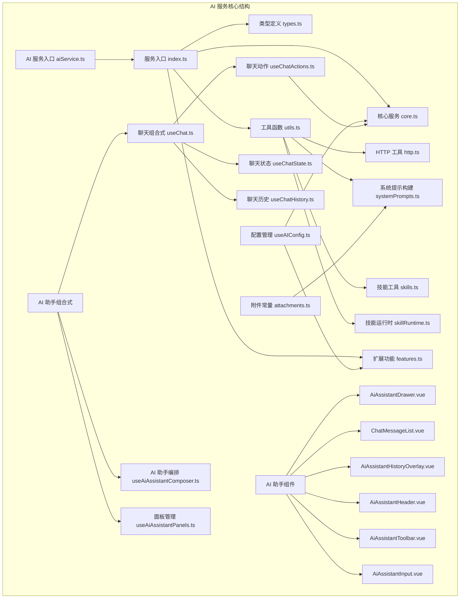

**图表来源**
- [apps/frontend/src/features/ai/services/index.ts:1-9](file://apps/frontend/src/features/ai/services/index.ts#L1-L9)
- [apps/frontend/src/features/ai/services/core.ts:1-442](file://apps/frontend/src/features/ai/services/core.ts#L1-L442)
- [apps/frontend/src/features/ai/services/utils.ts:1-10](file://apps/frontend/src/features/ai/services/utils.ts#L1-L10)

**章节来源**
- [apps/frontend/src/features/ai/services/index.ts:1-9](file://apps/frontend/src/features/ai/services/index.ts#L1-L9)
- [apps/frontend/src/features/ai/services/core.ts:1-442](file://apps/frontend/src/features/ai/services/core.ts#L1-L442)

## 核心组件

### 1. 核心服务 (core.ts)

核心服务提供了 AI 请求的核心逻辑，包括：

- **流式响应处理**：支持 SSE 格式的流式数据处理
- **请求中断机制**：通过 AbortController 实现请求取消
- **多模态支持**：处理文本和图像混合输入
- **工具调用支持**：支持函数调用和工具执行

### 2. 类型定义 (types.ts)

定义了完整的类型系统，包括：
- **ChatMessage**：聊天消息结构
- **AIRequestOptions**：请求配置选项
- **ToolCall/Tool**：工具调用和定义
- **AISkill/AISkillRuntime**：技能系统相关类型
- **StructuredBlock**：结构化块类型

### 3. 工具函数 (utils.ts)

提供了各种辅助工具：
- **HTTP 工具**：API URL 构建和请求头管理
- **系统提示构建**：动态生成系统提示词
- **技能管理**：技能目录和运行时管理
- **附件处理**：文档和图像处理

**章节来源**
- [apps/frontend/src/features/ai/services/types.ts:1-232](file://apps/frontend/src/features/ai/services/types.ts#L1-L232)
- [apps/frontend/src/features/ai/services/utils.ts:1-10](file://apps/frontend/src/features/ai/services/utils.ts#L1-L10)

## 架构概览

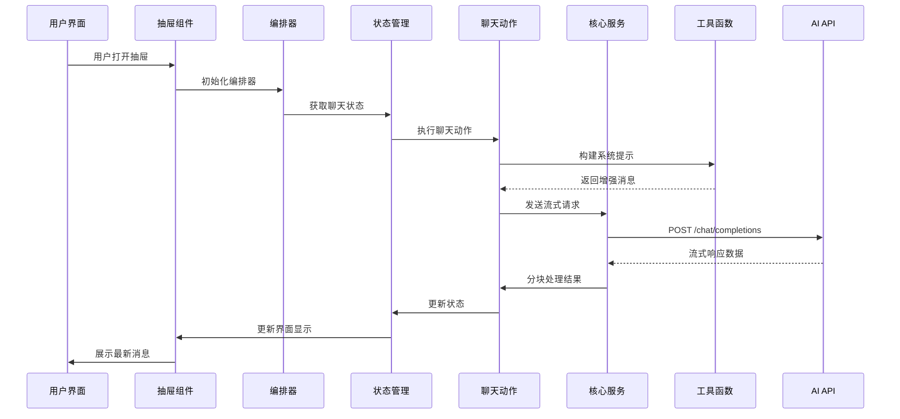

**图表来源**
- [apps/frontend/src/features/ai/components/AiAssistantDrawer.vue:1-336](file://apps/frontend/src/features/ai/components/AiAssistantDrawer.vue#L1-L336)
- [apps/frontend/src/features/ai/composables/useAiAssistantComposer.ts:1-113](file://apps/frontend/src/features/ai/composables/useAiAssistantComposer.ts#L1-L113)
- [apps/frontend/src/features/ai/composables/useChat.ts:1-119](file://apps/frontend/src/features/ai/composables/useChat.ts#L1-L119)

## 详细组件分析

### 核心服务流程

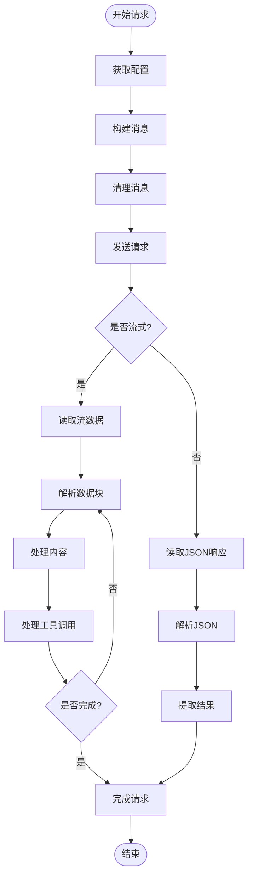

**图表来源**
- [apps/frontend/src/features/ai/services/core.ts:115-338](file://apps/frontend/src/features/ai/services/core.ts#L115-L338)

### 配置管理系统

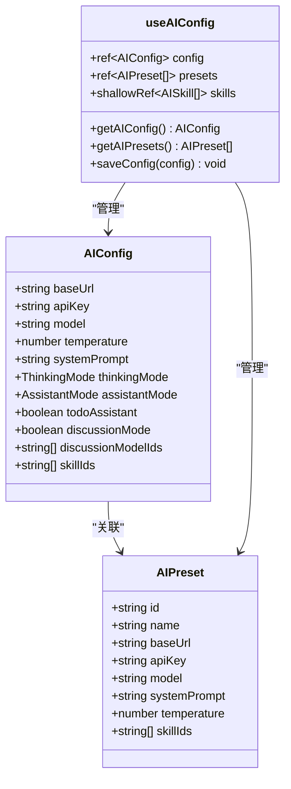

**图表来源**
- [apps/frontend/src/features/ai/composables/useAIConfig.ts:18-51](file://apps/frontend/src/features/ai/composables/useAIConfig.ts#L18-L51)
- [apps/frontend/src/features/ai/composables/useAIConfig.ts:624-627](file://apps/frontend/src/features/ai/composables/useAIConfig.ts#L624-L627)

### 技能系统架构

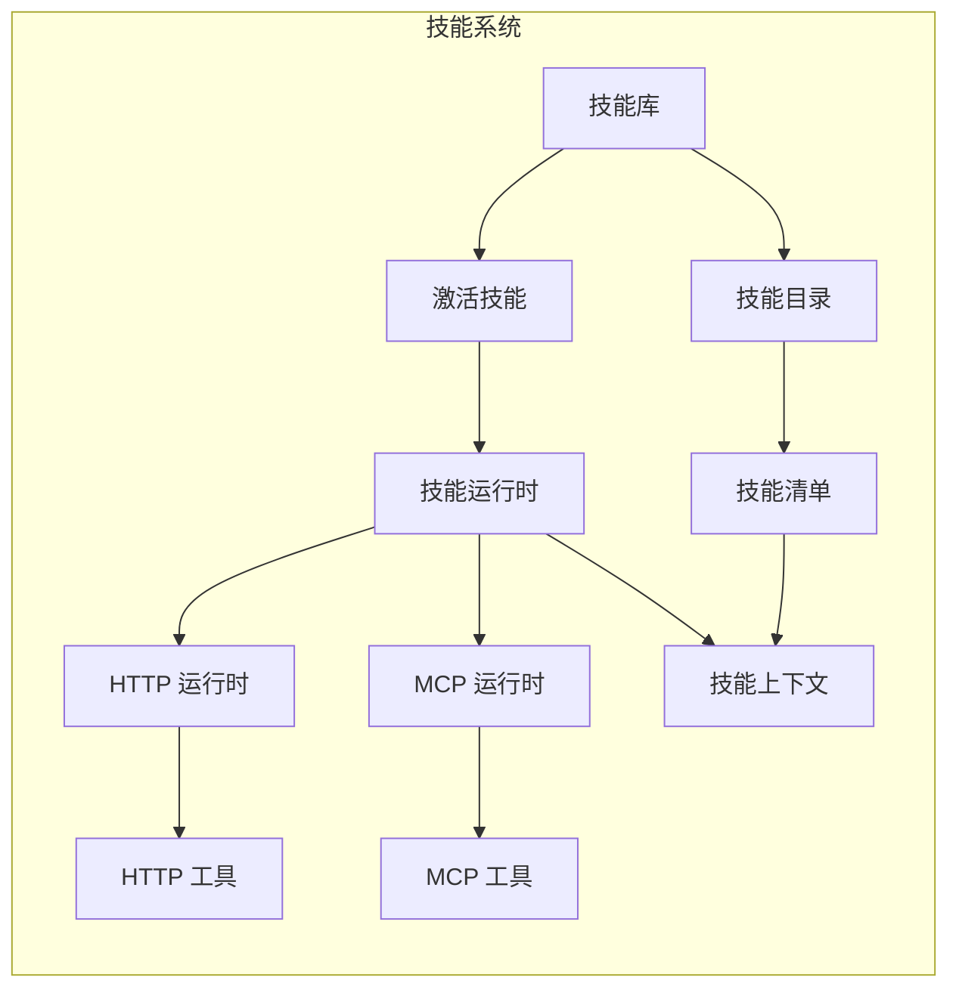

**图表来源**
- [apps/frontend/src/features/ai/services/types.ts:105-130](file://apps/frontend/src/features/ai/services/types.ts#L105-L130)
- [apps/frontend/src/features/ai/services/utils/skillRuntime.ts:1-10](file://apps/frontend/src/features/ai/services/utils/skillRuntime.ts#L1-L10)

**章节来源**
- [apps/frontend/src/features/ai/composables/useAIConfig.ts:1-800](file://apps/frontend/src/features/ai/composables/useAIConfig.ts#L1-L800)

## 抽屉式AI助手架构

### 架构设计

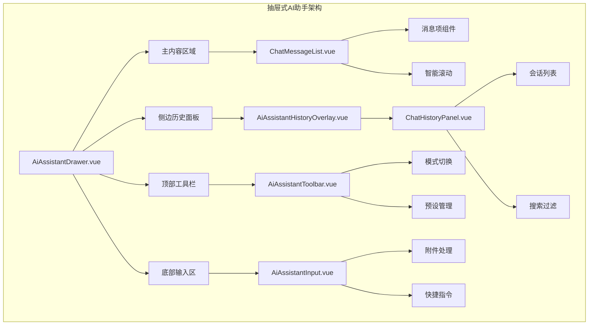

**图表来源**
- [apps/frontend/src/features/ai/components/AiAssistantDrawer.vue:1-336](file://apps/frontend/src/features/ai/components/AiAssistantDrawer.vue#L1-L336)
- [apps/frontend/src/features/ai/components/AiAssistantHistoryOverlay.vue:1-68](file://apps/frontend/src/features/ai/components/AiAssistantHistoryOverlay.vue#L1-L68)
- [apps/frontend/src/features/ai/components/ChatHistoryPanel.vue:1-313](file://apps/frontend/src/features/ai/components/ChatHistoryPanel.vue#L1-L313)

### 组件通信机制

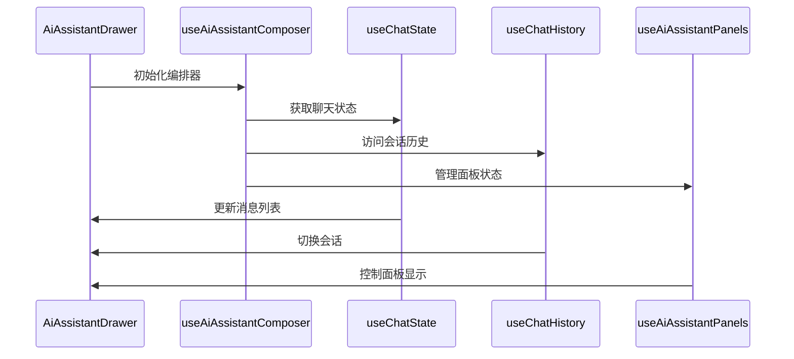

**图表来源**
- [apps/frontend/src/features/ai/composables/useAiAssistantComposer.ts:1-113](file://apps/frontend/src/features/ai/composables/useAiAssistantComposer.ts#L1-L113)
- [apps/frontend/src/features/ai/composables/useChatState.ts:1-144](file://apps/frontend/src/features/ai/composables/useChatState.ts#L1-L144)
- [apps/frontend/src/features/ai/composables/useChatHistory.ts:1-479](file://apps/frontend/src/features/ai/composables/useChatHistory.ts#L1-L479)
- [apps/frontend/src/features/ai/composables/useAiAssistantPanels.ts:1-47](file://apps/frontend/src/features/ai/composables/useAiAssistantPanels.ts#L1-L47)

**章节来源**
- [apps/frontend/src/features/ai/components/AiAssistantDrawer.vue:1-336](file://apps/frontend/src/features/ai/components/AiAssistantDrawer.vue#L1-L336)
- [apps/frontend/src/features/ai/components/AiAssistantHistoryOverlay.vue:1-68](file://apps/frontend/src/features/ai/components/AiAssistantHistoryOverlay.vue#L1-L68)
- [apps/frontend/src/features/ai/components/ChatHistoryPanel.vue:1-313](file://apps/frontend/src/features/ai/components/ChatHistoryPanel.vue#L1-L313)

## 聊天状态管理

### 状态架构

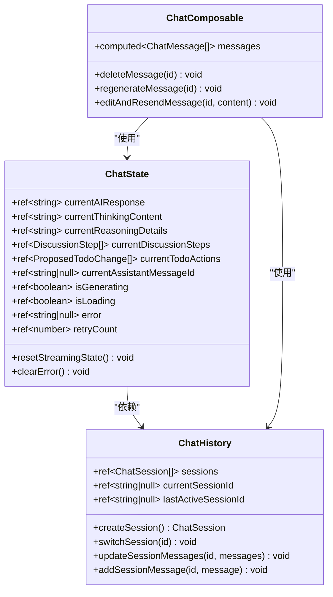

**图表来源**
- [apps/frontend/src/features/ai/composables/useChatState.ts:1-144](file://apps/frontend/src/features/ai/composables/useChatState.ts#L1-L144)
- [apps/frontend/src/features/ai/composables/useChatHistory.ts:1-479](file://apps/frontend/src/features/ai/composables/useChatHistory.ts#L1-L479)
- [apps/frontend/src/features/ai/composables/useChat.ts:1-119](file://apps/frontend/src/features/ai/composables/useChat.ts#L1-L119)

### 状态同步机制

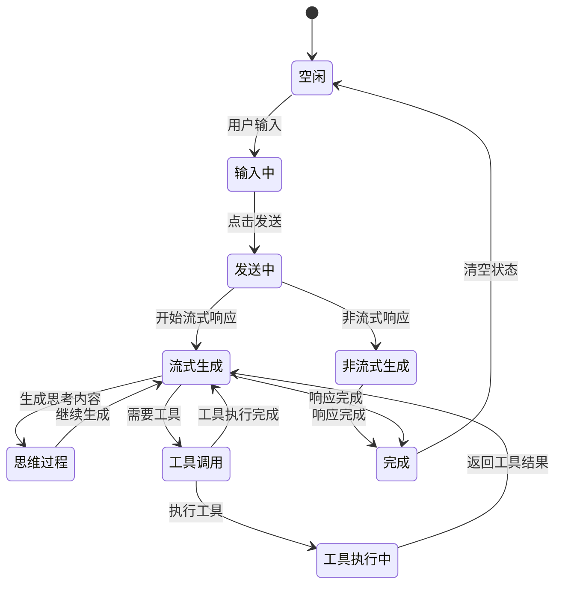

**图表来源**
- [apps/frontend/src/features/ai/composables/useChatActions.ts:147-372](file://apps/frontend/src/features/ai/composables/useChatActions.ts#L147-L372)
- [apps/frontend/src/features/ai/composables/useChatState.ts:53-77](file://apps/frontend/src/features/ai/composables/useChatState.ts#L53-L77)

**章节来源**
- [apps/frontend/src/features/ai/composables/useChatState.ts:1-144](file://apps/frontend/src/features/ai/composables/useChatState.ts#L1-L144)
- [apps/frontend/src/features/ai/composables/useChat.ts:1-119](file://apps/frontend/src/features/ai/composables/useChat.ts#L1-L119)

## 消息历史存储

### 存储架构

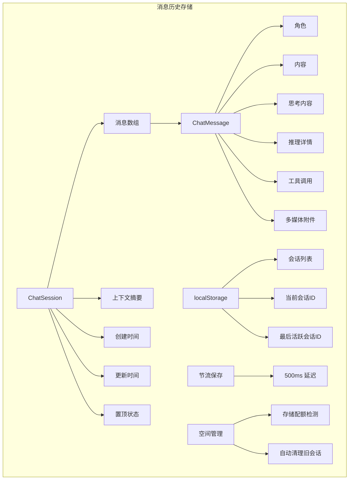

**图表来源**
- [apps/frontend/src/features/ai/composables/useChatHistory.ts:13-25](file://apps/frontend/src/features/ai/composables/useChatHistory.ts#L13-L25)
- [apps/frontend/src/features/ai/composables/useChatHistory.ts:27-30](file://apps/frontend/src/features/ai/composables/useChatHistory.ts#L27-L30)
- [apps/frontend/src/features/ai/composables/useChatHistory.ts:133-162](file://apps/frontend/src/features/ai/composables/useChatHistory.ts#L133-L162)

### 数据持久化策略

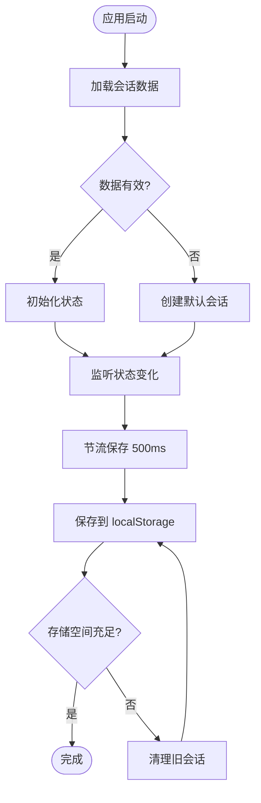

**图表来源**
- [apps/frontend/src/features/ai/composables/useChatHistory.ts:164-205](file://apps/frontend/src/features/ai/composables/useChatHistory.ts#L164-L205)
- [apps/frontend/src/features/ai/composables/useChatHistory.ts:174-196](file://apps/frontend/src/features/ai/composables/useChatHistory.ts#L174-L196)

**章节来源**
- [apps/frontend/src/features/ai/composables/useChatHistory.ts:1-479](file://apps/frontend/src/features/ai/composables/useChatHistory.ts#L1-L479)

## 实时交互逻辑

### 交互流程

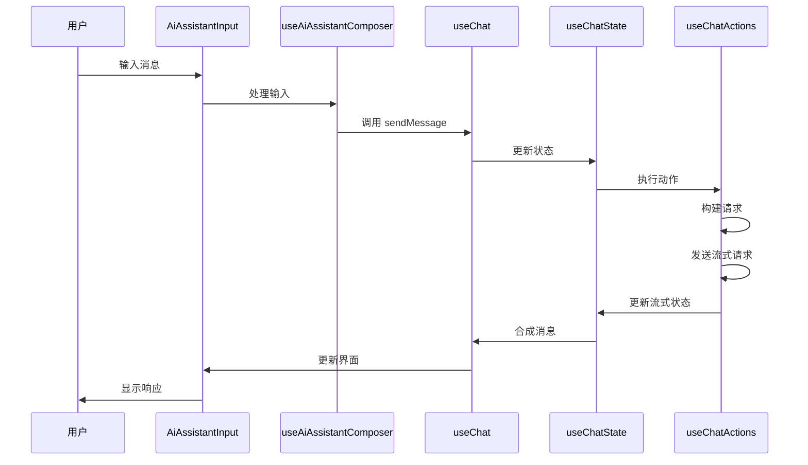

**图表来源**
- [apps/frontend/src/features/ai/components/AiAssistantInput.vue:1-329](file://apps/frontend/src/features/ai/components/AiAssistantInput.vue#L1-L329)
- [apps/frontend/src/features/ai/composables/useAiAssistantComposer.ts:31-49](file://apps/frontend/src/features/ai/composables/useAiAssistantComposer.ts#L31-L49)
- [apps/frontend/src/features/ai/composables/useChat.ts:40-85](file://apps/frontend/src/features/ai/composables/useChat.ts#L40-L85)

### 智能滚动机制

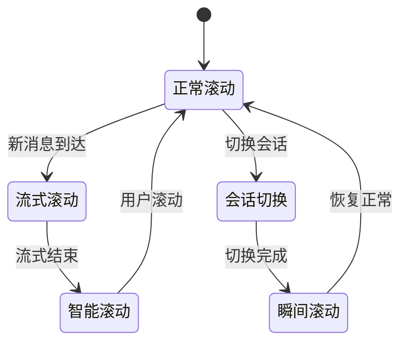

**图表来源**
- [apps/frontend/src/features/ai/components/ChatMessageList.vue:191-226](file://apps/frontend/src/features/ai/components/ChatMessageList.vue#L191-L226)
- [apps/frontend/src/features/ai/components/ChatMessageList.vue:82-137](file://apps/frontend/src/features/ai/components/ChatMessageList.vue#L82-L137)

**章节来源**
- [apps/frontend/src/features/ai/components/AiAssistantInput.vue:1-329](file://apps/frontend/src/features/ai/components/AiAssistantInput.vue#L1-L329)
- [apps/frontend/src/features/ai/components/ChatMessageList.vue:1-489](file://apps/frontend/src/features/ai/components/ChatMessageList.vue#L1-L489)

## 依赖关系分析

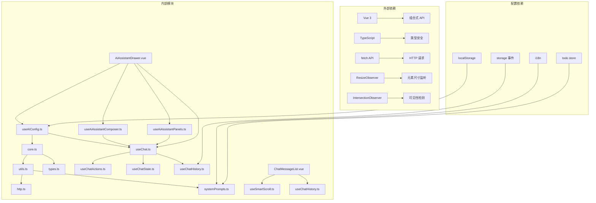

**图表来源**
- [apps/frontend/src/features/ai/services/core.ts:5-14](file://apps/frontend/src/features/ai/services/core.ts#L5-L14)
- [apps/frontend/src/features/ai/composables/useAIConfig.ts:1-14](file://apps/frontend/src/features/ai/composables/useAIConfig.ts#L1-L14)
- [apps/frontend/src/features/ai/components/ChatMessageList.vue:1-12](file://apps/frontend/src/features/ai/components/ChatMessageList.vue#L1-L12)

**章节来源**
- [apps/frontend/src/features/ai/services/core.ts:1-442](file://apps/frontend/src/features/ai/services/core.ts#L1-L442)
- [apps/frontend/src/features/ai/composables/useAIConfig.ts:1-800](file://apps/frontend/src/features/ai/composables/useAIConfig.ts#L1-L800)

## 性能考虑

### 1. 流式处理优化
- **内存管理**：使用流式读取避免大响应占用内存
- **增量渲染**：实时更新界面减少等待时间
- **背压控制**：合理处理高并发请求

### 2. 缓存策略
- **配置缓存**：本地存储 AI 配置减少初始化开销
- **技能缓存**：缓存已加载的技能定义
- **会话缓存**：维护聊天历史和状态

### 3. 错误处理
- **重试机制**：自动重试失败的请求
- **超时控制**：设置合理的请求超时时间
- **降级策略**：网络异常时的备用方案

### 4. UI 性能优化
- **虚拟滚动**：大量消息时的性能优化
- **智能滚动**：避免不必要的重渲染
- **组件懒加载**：按需加载面板组件

## 故障排除指南

### 常见问题及解决方案

| 问题类型 | 症状 | 可能原因 | 解决方案 |
|---------|------|----------|----------|
| 请求超时 | 网络错误或超时 | 网络连接不稳定 | 检查网络设置，增加重试次数 |
| 流式响应中断 | 部分内容丢失 | 网络波动或服务器关闭 | 实现断线重连机制 |
| 工具调用失败 | 工具执行异常 | 权限不足或配置错误 | 检查工具权限和配置 |
| 内存泄漏 | 页面卡顿 | 事件监听器未清理 | 确保组件卸载时清理资源 |
| 会话丢失 | 刷新后历史消失 | 存储空间不足 | 清理旧会话或增加配额 |
| 滚动异常 | 消息位置错误 | DOM 更新时机问题 | 使用 nextTick 确保更新顺序 |

### 调试技巧

1. **启用详细日志**：在开发环境中开启详细的调试信息
2. **监控网络请求**：使用浏览器开发者工具查看请求状态
3. **检查配置**：验证 AI 配置和 API 密钥的有效性
4. **测试工具**：单独测试工具调用功能
5. **状态检查**：使用 Vue DevTools 检查响应式状态

**章节来源**
- [apps/frontend/src/features/ai/services/core.ts:327-337](file://apps/frontend/src/features/ai/services/core.ts#L327-L337)

## 结论

AI 服务核心提供了一个完整、可扩展的 AI 对话服务框架。其设计特点包括：

### 主要优势
- **模块化设计**：清晰的分层架构便于维护和扩展
- **类型安全**：完整的 TypeScript 类型定义确保代码质量
- **灵活配置**：支持多种 AI 服务提供商和配置选项
- **工具集成**：内置技能系统和工具调用支持
- **用户体验**：流式响应和实时更新提升交互体验
- **抽屉式架构**：现代化的 UI 设计提供沉浸式体验
- **状态管理**：完善的聊天状态和历史管理机制
- **实时交互**：智能滚动和状态同步保证流畅体验

### 技术特色
- **流式处理**：高效的 SSE 流式数据处理
- **多模态支持**：文本和图像混合输入处理
- **上下文管理**：智能的上下文压缩和记忆管理
- **错误恢复**：完善的错误处理和重试机制
- **性能优化**：虚拟滚动和智能缓存策略
- **跨平台支持**：桌面和移动端的统一体验

该服务核心为构建复杂的 AI 应用程序提供了坚实的基础，支持从简单的聊天机器人到复杂的企业级 AI 辅助系统等各种场景。新增的抽屉式AI助手架构进一步提升了用户体验，使其成为现代 Web 应用的理想选择。