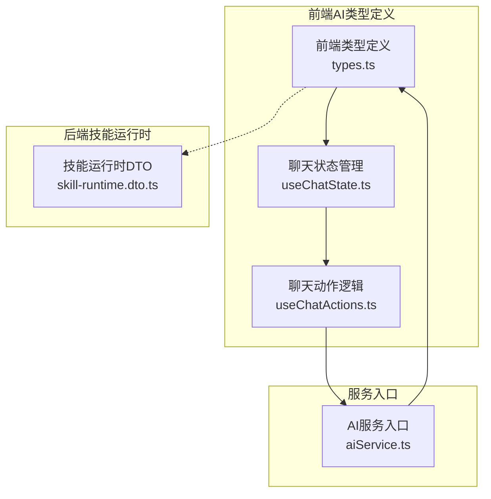
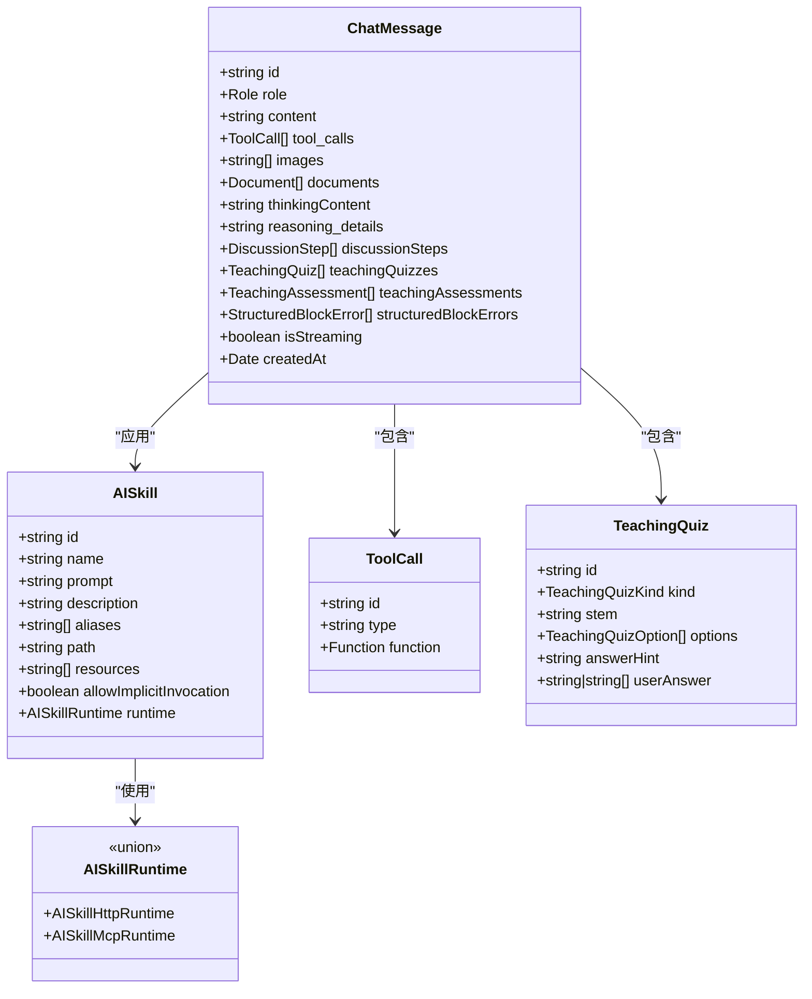
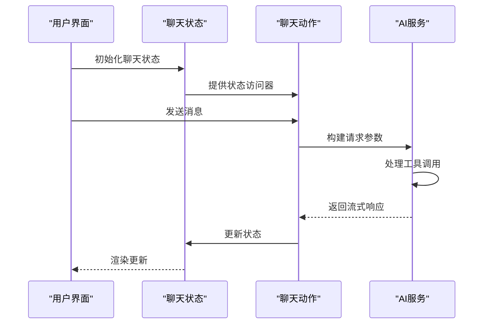
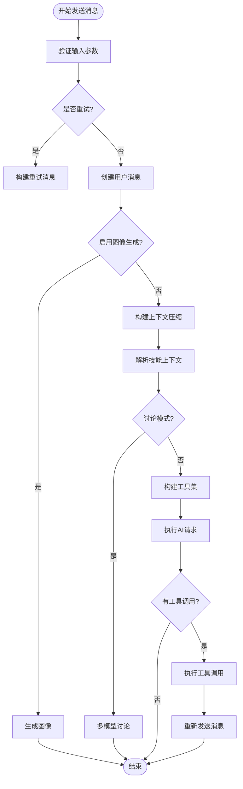
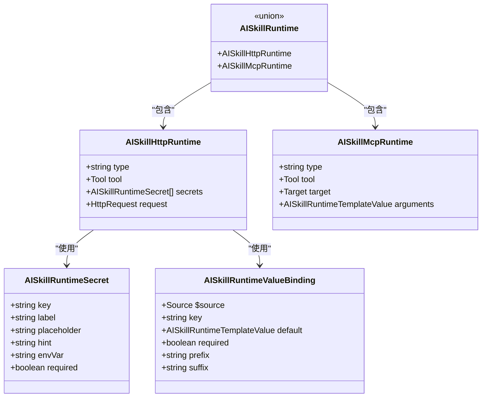
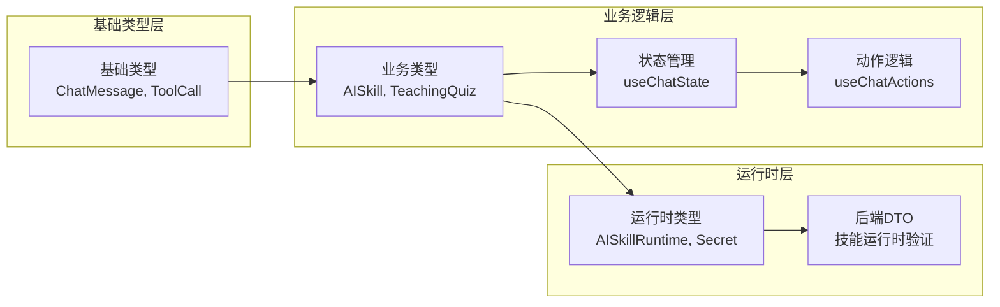

# Ai 类型定义

<cite>
**本文档引用的文件**
- [apps/frontend/src/features/ai/services/types.ts](file://apps/frontend/src/features/ai/services/types.ts)
- [apps/frontend/src/features/ai/composables/useChatState.ts](file://apps/frontend/src/features/ai/composables/useChatState.ts)
- [apps/frontend/src/features/ai/composables/useChatActions.ts](file://apps/frontend/src/features/ai/composables/useChatActions.ts)
- [apps/backend/src/skill-sources/skill-runtime.dto.ts](file://apps/backend/src/skill-sources/skill-runtime.dto.ts)
- [apps/frontend/src/features/ai/services/aiService.ts](file://apps/frontend/src/features/ai/services/aiService.ts)
</cite>

## 目录
1. [简介](#简介)
2. [项目结构](#项目结构)
3. [核心组件](#核心组件)
4. [架构概览](#架构概览)
5. [详细组件分析](#详细组件分析)
6. [依赖关系分析](#依赖关系分析)
7. [性能考虑](#性能考虑)
8. [故障排除指南](#故障排除指南)
9. [结论](#结论)

## 简介

本文件系统性地梳理了项目中的AI类型定义体系，涵盖了前端AI服务的完整类型结构、后端技能运行时的验证模型，以及前后端交互的关键数据接口。通过对这些类型的深入分析，开发者可以更好地理解AI功能的数据流转、状态管理和扩展机制。

## 项目结构

AI类型定义主要分布在以下位置：
- 前端AI服务类型定义：`apps/frontend/src/features/ai/services/types.ts`
- 前端聊天状态管理：`apps/frontend/src/features/ai/composables/useChatState.ts`
- 前端聊天动作逻辑：`apps/frontend/src/features/ai/composables/useChatActions.ts`
- 后端技能运行时DTO：`apps/backend/src/skill-sources/skill-runtime.dto.ts`
- 前端AI服务入口：`apps/frontend/src/features/ai/services/aiService.ts`

**图表来源**
- [apps/frontend/src/features/ai/services/types.ts:1-232](file://apps/frontend/src/features/ai/services/types.ts#L1-L232)
- [apps/frontend/src/features/ai/composables/useChatState.ts:1-144](file://apps/frontend/src/features/ai/composables/useChatState.ts#L1-L144)
- [apps/frontend/src/features/ai/composables/useChatActions.ts:1-492](file://apps/frontend/src/features/ai/composables/useChatActions.ts#L1-L492)
- [apps/backend/src/skill-sources/skill-runtime.dto.ts:1-98](file://apps/backend/src/skill-sources/skill-runtime.dto.ts#L1-L98)

**章节来源**
- [apps/frontend/src/features/ai/services/types.ts:1-232](file://apps/frontend/src/features/ai/services/types.ts#L1-L232)
- [apps/frontend/src/features/ai/composables/useChatState.ts:1-144](file://apps/frontend/src/features/ai/composables/useChatState.ts#L1-L144)
- [apps/frontend/src/features/ai/composables/useChatActions.ts:1-492](file://apps/frontend/src/features/ai/composables/useChatActions.ts#L1-L492)
- [apps/backend/src/skill-sources/skill-runtime.dto.ts:1-98](file://apps/backend/src/skill-sources/skill-runtime.dto.ts#L1-L98)

## 核心组件

### 前端AI类型定义

前端AI类型定义文件包含了完整的AI服务类型结构，涵盖对话消息、工具调用、技能运行时等核心概念：

#### 对话消息类型
- `ChatMessage`: 完整的消息结构，支持文本、图片、文档、思维过程等多种内容
- `MultiModalContent`: 多模态内容表示，支持文本和图片URL
- `AIChatCompletionMessage`: AI聊天完成消息的联合类型

#### 工具系统类型
- `ToolCall`: 工具调用结构，包含ID、类型和函数参数
- `ToolResult`: 工具执行结果
- `Tool`: 工具定义，包含名称、描述和参数结构

#### 技能运行时类型
- `AISkillRuntimeSecret`: 技能运行时密钥配置
- `AISkillRuntimeValueBinding`: 值绑定机制
- `AISkillHttpRuntime`: HTTP技能运行时
- `AISkillMcpRuntime`: MCP技能运行时
- `AISkill`: 技能定义

#### 教学评估类型
- `TeachingQuiz`: 教学测验结构
- `TeachingAssessment`: 教学评估结果
- `StructuredBlockError`: 结构化块错误

**章节来源**
- [apps/frontend/src/features/ai/services/types.ts:5-232](file://apps/frontend/src/features/ai/services/types.ts#L5-L232)

### 后端技能运行时DTO

后端提供了完整的技能运行时验证模型，使用Zod进行类型安全验证：

#### 验证模型
- `SkillRuntimeTemplateValueSchema`: 模板值验证
- `SkillRuntimeValueBindingSchema`: 值绑定验证
- `HttpSkillRuntimeSchema`: HTTP技能运行时验证
- `ExecuteHttpSkillRuntimeRequestSchema`: 执行请求验证

#### 数据结构
- `HttpSkillRuntime`: HTTP技能运行时接口
- `SkillRuntimeValueBinding`: 值绑定接口
- `SkillRuntimeExecutionSecret`: 执行密钥接口

**章节来源**
- [apps/backend/src/skill-sources/skill-runtime.dto.ts:1-98](file://apps/backend/src/skill-sources/skill-runtime.dto.ts#L1-L98)

## 架构概览

AI类型定义形成了一个完整的数据类型体系，从前端的用户交互到后端的服务验证，实现了端到端的类型安全。

**图表来源**
- [apps/frontend/src/features/ai/services/types.ts:170-232](file://apps/frontend/src/features/ai/services/types.ts#L170-L232)
- [apps/frontend/src/features/ai/services/types.ts:105-115](file://apps/frontend/src/features/ai/services/types.ts#L105-L115)
- [apps/frontend/src/features/ai/services/types.ts:19-26](file://apps/frontend/src/features/ai/services/types.ts#L19-L26)
- [apps/frontend/src/features/ai/services/types.ts:153-160](file://apps/frontend/src/features/ai/services/types.ts#L153-L160)

## 详细组件分析

### 聊天状态管理系统

聊天状态管理通过组合式函数实现了全局状态共享和状态同步：

**图表来源**
- [apps/frontend/src/features/ai/composables/useChatState.ts:41-143](file://apps/frontend/src/features/ai/composables/useChatState.ts#L41-L143)
- [apps/frontend/src/features/ai/composables/useChatActions.ts:147-372](file://apps/frontend/src/features/ai/composables/useChatActions.ts#L147-L372)

#### 状态管理特性
- 全局单例状态：确保多处调用共享同一状态
- 流式响应处理：支持实时更新AI响应
- 错误状态管理：提供统一的错误处理机制
- 教学模式支持：专门的教学问答状态管理

**章节来源**
- [apps/frontend/src/features/ai/composables/useChatState.ts:1-144](file://apps/frontend/src/features/ai/composables/useChatState.ts#L1-L144)

### 聊天动作逻辑系统

聊天动作逻辑封装了复杂的AI交互流程，包括工具调用、多模态处理和错误恢复：

**图表来源**
- [apps/frontend/src/features/ai/composables/useChatActions.ts:147-372](file://apps/frontend/src/features/ai/composables/useChatActions.ts#L147-L372)

#### 核心功能特性
- 多模态支持：文本、图片、文档混合处理
- 工具调用链：支持本地和远程工具调用
- 讨论模式：多模型协作讨论
- 错误恢复：自动重试机制
- 内存管理：智能上下文压缩

**章节来源**
- [apps/frontend/src/features/ai/composables/useChatActions.ts:1-492](file://apps/frontend/src/features/ai/composables/useChatActions.ts#L1-L492)

### 技能运行时系统

技能运行时系统提供了灵活的工具扩展机制，支持HTTP和MCP两种运行时：

**图表来源**
- [apps/frontend/src/features/ai/services/types.ts:70-103](file://apps/frontend/src/features/ai/services/types.ts#L70-L103)
- [apps/frontend/src/features/ai/services/types.ts:43-50](file://apps/frontend/src/features/ai/services/types.ts#L43-L50)
- [apps/frontend/src/features/ai/services/types.ts:52-59](file://apps/frontend/src/features/ai/services/types.ts#L52-L59)

#### 运行时特性
- HTTP运行时：支持RESTful API调用
- MCP运行时：支持MCP协议工具调用
- 密钥管理：安全的密钥存储和传递
- 模板系统：灵活的参数模板绑定
- 类型安全：完整的TypeScript类型定义

**章节来源**
- [apps/frontend/src/features/ai/services/types.ts:43-103](file://apps/frontend/src/features/ai/services/types.ts#L43-L103)

## 依赖关系分析

AI类型定义之间的依赖关系体现了清晰的分层架构：

**图表来源**
- [apps/frontend/src/features/ai/services/types.ts:170-232](file://apps/frontend/src/features/ai/services/types.ts#L170-L232)
- [apps/frontend/src/features/ai/composables/useChatState.ts:1-144](file://apps/frontend/src/features/ai/composables/useChatState.ts#L1-L144)
- [apps/frontend/src/features/ai/composables/useChatActions.ts:1-492](file://apps/frontend/src/features/ai/composables/useChatActions.ts#L1-L492)
- [apps/backend/src/skill-sources/skill-runtime.dto.ts:1-98](file://apps/backend/src/skill-sources/skill-runtime.dto.ts#L1-L98)

### 关键依赖关系

1. **类型继承关系**：`ChatMessage` 继承自基础消息类型，扩展了AI特定字段
2. **组合关系**：`AISkill` 组合了 `AISkillRuntime`，形成完整的技能定义
3. **状态依赖**：`useChatActions` 依赖 `useChatState` 提供的状态管理
4. **运行时依赖**：前端类型与后端DTO保持兼容性

**章节来源**
- [apps/frontend/src/features/ai/services/types.ts:170-232](file://apps/frontend/src/features/ai/services/types.ts#L170-L232)
- [apps/frontend/src/features/ai/composables/useChatActions.ts:1-492](file://apps/frontend/src/features/ai/composables/useChatActions.ts#L1-L492)

## 性能考虑

AI类型定义在设计时充分考虑了性能优化：

### 类型安全与编译时检查
- 使用TypeScript联合类型确保运行时类型安全
- Zod验证模型提供运行时数据校验
- 泛型约束减少不必要的类型转换

### 内存管理
- 流式响应处理避免大对象一次性加载
- 智能状态清理机制防止内存泄漏
- 条件渲染优化减少DOM操作

### 并发处理
- 工具调用并行执行提升响应速度
- 请求取消机制避免资源浪费
- 重试策略平衡可靠性与性能

## 故障排除指南

### 常见问题诊断

1. **类型不匹配错误**
   - 检查前端类型与后端DTO的一致性
   - 验证Zod Schema的字段映射

2. **状态同步问题**
   - 确认全局状态单例实现
   - 检查Vue响应式系统的更新机制

3. **工具调用失败**
   - 验证技能运行时配置
   - 检查密钥和认证信息

**章节来源**
- [apps/frontend/src/features/ai/composables/useChatActions.ts:358-371](file://apps/frontend/src/features/ai/composables/useChatActions.ts#L358-L371)
- [apps/frontend/src/features/ai/composables/useChatState.ts:25-36](file://apps/frontend/src/features/ai/composables/useChatState.ts#L25-L36)

## 结论

AI类型定义体系展现了现代前端应用的类型安全设计理念。通过精心设计的类型层次结构、完善的错误处理机制和灵活的扩展接口，该体系为AI功能的开发提供了坚实的基础。建议在后续开发中继续遵循现有的类型设计原则，确保系统的可维护性和可扩展性。