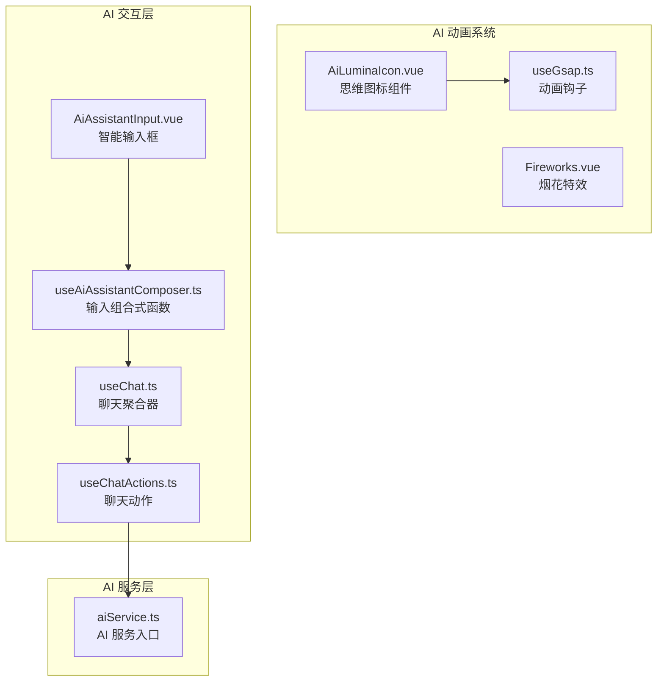
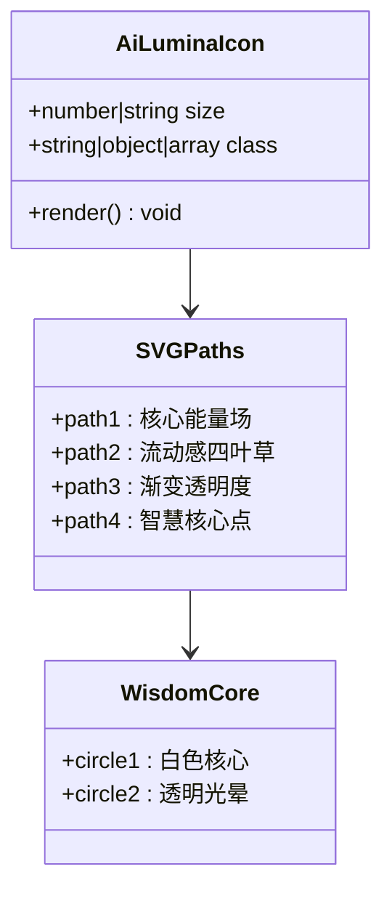
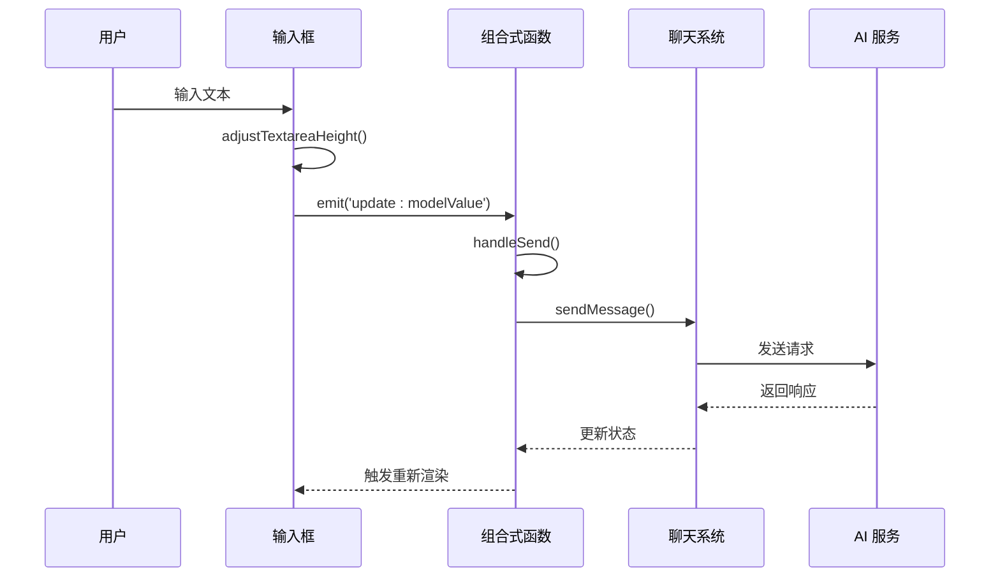
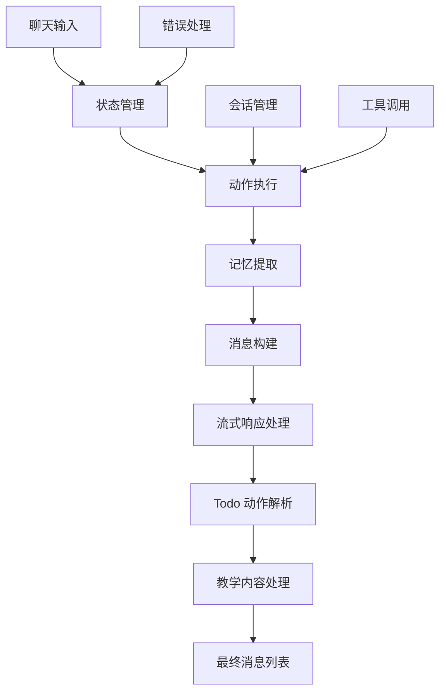
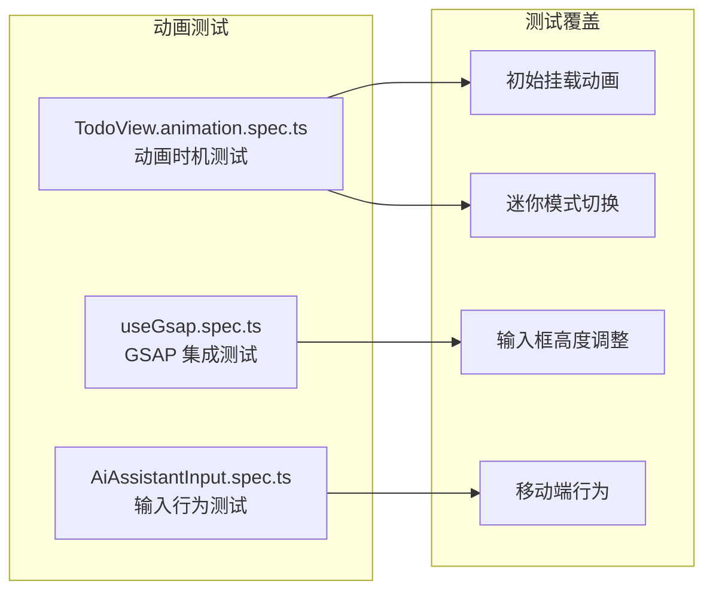
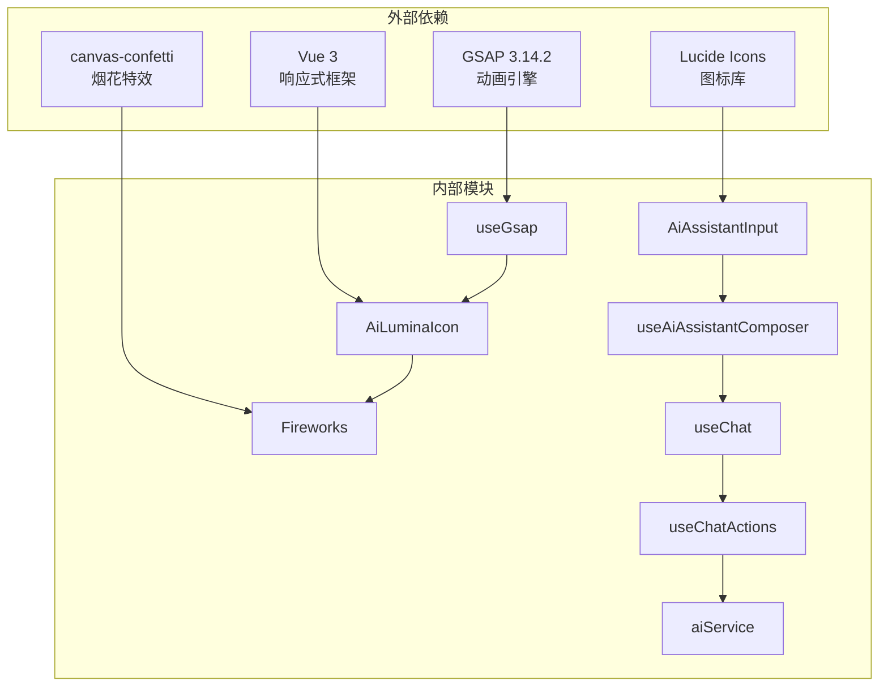

# AI 思维图标动画系统

<cite>
**本文档中引用的文件**
- [AiLuminaIcon.vue](file://apps/frontend/src/features/ai/components/AiLuminaIcon.vue)
- [useGsap.ts](file://apps/frontend/src/composables/useGsap.ts)
- [Fireworks.vue](file://apps/frontend/src/components/Fireworks.vue)
- [AiAssistantInput.vue](file://apps/frontend/src/features/ai/components/AiAssistantInput.vue)
- [useAiAssistantComposer.ts](file://apps/frontend/src/features/ai/composables/useAiAssistantComposer.ts)
- [useChat.ts](file://apps/frontend/src/features/ai/composables/useChat.ts)
- [useChatActions.ts](file://apps/frontend/src/features/ai/composables/useChatActions.ts)
- [aiService.ts](file://apps/frontend/src/features/ai/services/aiService.ts)
- [TodoView.animation.spec.ts](file://apps/frontend/tests/features/todo/TodoView.animation.spec.ts)
- [AiAssistantInput.spec.ts](file://apps/frontend/tests/features/ai/components/AiAssistantInput.spec.ts)
</cite>

## 目录
1. [简介](#简介)
2. [项目结构](#项目结构)
3. [核心组件](#核心组件)
4. [架构概览](#架构概览)
5. [详细组件分析](#详细组件分析)
6. [依赖关系分析](#依赖关系分析)
7. [性能考虑](#性能考虑)
8. [故障排除指南](#故障排除指南)
9. [结论](#结论)

## 简介

AI 思维图标动画系统是一个集成了创意视觉设计和流畅动画效果的前端系统。该系统主要包含三个核心部分：

1. **Lumina AI 思维图标** - 一个优雅的四叶草形态四点星图标，代表 AI 的智慧核心
2. **GSAP 动画引擎集成** - 提供强大的动画控制和过渡效果
3. **烟花特效系统** - 基于 canvas-confetti 的庆祝动画效果

该系统通过 Vue 3 组合式 API 构建，采用现代化的前端技术栈，实现了从基础图标设计到复杂动画交互的完整解决方案。

## 项目结构

项目采用模块化架构，主要分布在前端应用的 AI 功能模块中：



**图表来源**
- [AiLuminaIcon.vue:1-53](file://apps/frontend/src/features/ai/components/AiLuminaIcon.vue#L1-L53)
- [useGsap.ts:1-20](file://apps/frontend/src/composables/useGsap.ts#L1-L20)
- [AiAssistantInput.vue:1-329](file://apps/frontend/src/features/ai/components/AiAssistantInput.vue#L1-L329)

**章节来源**
- [AiLuminaIcon.vue:1-53](file://apps/frontend/src/features/ai/components/AiLuminaIcon.vue#L1-L53)
- [useGsap.ts:1-20](file://apps/frontend/src/composables/useGsap.ts#L1-L20)
- [Fireworks.vue:1-45](file://apps/frontend/src/components/Fireworks.vue#L1-L45)

## 核心组件

### Lumina AI 思维图标组件

AiLuminaIcon 是系统的核心视觉标识，采用 SVG 技术实现的四叶草形态四点星图标。该组件具有以下特点：

- **多层透明度设计**：使用四个不同透明度的路径创建渐变效果
- **响应式尺寸**：支持动态尺寸调整
- **可扩展类名**：允许外部样式定制

### GSAP 动画钩子

useGsap 提供了全局的动画上下文管理，确保组件卸载时自动清理动画资源：

- **自动清理机制**：组件销毁时自动调用 ctx.revert()
- **插件注册**：预注册 Flip 插件
- **上下文隔离**：每个组件拥有独立的动画上下文

### 烟花特效系统

Fireworks 组件基于 canvas-confetti 实现，提供沉浸式的视觉反馈：

- **触发式动画**：通过 active 属性控制动画启停
- **自动完成回调**：动画完成后自动发出 complete 事件
- **无障碍优化**：支持减少运动设置

**章节来源**
- [AiLuminaIcon.vue:1-53](file://apps/frontend/src/features/ai/components/AiLuminaIcon.vue#L1-L53)
- [useGsap.ts:1-20](file://apps/frontend/src/composables/useGsap.ts#L1-L20)
- [Fireworks.vue:1-45](file://apps/frontend/src/components/Fireworks.vue#L1-L45)

## 架构概览

系统采用分层架构设计，从底层动画引擎到上层业务逻辑形成清晰的层次结构：

```mermaid
graph TD
subgraph "表现层"
A[AiLuminaIcon<br/>SVG 图标]
B[AiAssistantInput<br/>智能输入框]
C[Fireworks<br/>烟花特效]
end
subgraph "动画层"
D[useGsap<br/>GSAP 集成]
E[动画上下文<br/>ctx.revert()]
end
subgraph "业务逻辑层"
F[useAiAssistantComposer<br/>输入组合式函数]
G[useChat<br/>聊天聚合器]
H[useChatActions<br/>聊天动作]
end
subgraph "服务层"
I[aiService<br/>AI 服务入口]
end
A --> D
B --> F
F --> G
G --> H
H --> I
D --> E
```

**图表来源**
- [AiLuminaIcon.vue:17-52](file://apps/frontend/src/features/ai/components/AiLuminaIcon.vue#L17-L52)
- [useGsap.ts:7-19](file://apps/frontend/src/composables/useGsap.ts#L7-L19)
- [AiAssistantInput.vue:1-329](file://apps/frontend/src/features/ai/components/AiAssistantInput.vue#L1-L329)
- [useAiAssistantComposer.ts:1-113](file://apps/frontend/src/features/ai/composables/useAiAssistantComposer.ts#L1-L113)

## 详细组件分析

### 思维图标组件深度分析

AiLuminaIcon 采用精心设计的 SVG 路径创建四叶草形态，体现了 AI 智慧的核心理念：



**图表来源**
- [AiLuminaIcon.vue:6-14](file://apps/frontend/src/features/ai/components/AiLuminaIcon.vue#L6-L14)
- [AiLuminaIcon.vue:27-46](file://apps/frontend/src/features/ai/components/AiLuminaIcon.vue#L27-L46)

该组件的设计特点包括：

1. **多层路径设计**：四个 path 元素创建渐变的四叶草形态
2. **透明度递减**：从 90% 到 30% 的透明度渐变创造深度感
3. **中心聚焦**：白色圆形核心突出智慧主题
4. **响应式设计**：支持动态尺寸调整

**章节来源**
- [AiLuminaIcon.vue:1-53](file://apps/frontend/src/features/ai/components/AiLuminaIcon.vue#L1-L53)

### 输入框动画流程

AiAssistantInput 组件展示了复杂的用户交互和动画处理：



**图表来源**
- [AiAssistantInput.vue:106-137](file://apps/frontend/src/features/ai/components/AiAssistantInput.vue#L106-L137)
- [useAiAssistantComposer.ts:31-49](file://apps/frontend/src/features/ai/composables/useAiAssistantComposer.ts#L31-L49)

**章节来源**
- [AiAssistantInput.vue:1-329](file://apps/frontend/src/features/ai/components/AiAssistantInput.vue#L1-L329)
- [useAiAssistantComposer.ts:1-113](file://apps/frontend/src/features/ai/composables/useAiAssistantComposer.ts#L1-L113)

### 聊天系统架构

useChat 作为聊天功能的聚合器，协调多个子系统的协作：



**图表来源**
- [useChat.ts:21-85](file://apps/frontend/src/features/ai/composables/useChat.ts#L21-L85)
- [useChatActions.ts:147-372](file://apps/frontend/src/features/ai/composables/useChatActions.ts#L147-L372)

**章节来源**
- [useChat.ts:1-119](file://apps/frontend/src/features/ai/composables/useChat.ts#L1-L119)
- [useChatActions.ts:1-492](file://apps/frontend/src/features/ai/composables/useChatActions.ts#L1-L492)

### 动画系统测试验证

系统提供了完善的测试覆盖，确保动画行为的正确性：



**图表来源**
- [TodoView.animation.spec.ts:94-151](file://apps/frontend/tests/features/todo/TodoView.animation.spec.ts#L94-L151)
- [AiAssistantInput.spec.ts:40-85](file://apps/frontend/tests/features/ai/components/AiAssistantInput.spec.ts#L40-L85)

**章节来源**
- [TodoView.animation.spec.ts:1-151](file://apps/frontend/tests/features/todo/TodoView.animation.spec.ts#L1-L151)
- [AiAssistantInput.spec.ts:1-85](file://apps/frontend/tests/features/ai/components/AiAssistantInput.spec.ts#L1-L85)

## 依赖关系分析

系统采用松耦合的设计原则，各组件间通过清晰的接口进行通信：



**图表来源**
- [useGsap.ts:1-3](file://apps/frontend/src/composables/useGsap.ts#L1-L3)
- [AiAssistantInput.vue:5-12](file://apps/frontend/src/features/ai/components/AiAssistantInput.vue#L5-L12)

**章节来源**
- [pnpm-lock.yaml:5280-5281](file://pnpm-lock.yaml#L5280-L5281)

## 性能考虑

系统在性能优化方面采用了多项策略：

### 动画性能优化
- **上下文隔离**：每个组件独立的 GSAP 上下文，避免全局状态污染
- **自动清理**：组件卸载时自动清理动画资源
- **批量更新**：使用 requestAnimationFrame 优化动画帧率

### 内存管理
- **响应式数据**：利用 Vue 3 的响应式系统优化内存使用
- **条件渲染**：根据状态动态控制组件渲染
- **事件监听器**：在组件卸载时清理事件监听器

### 性能监控
- **测试覆盖**：完整的单元测试确保性能指标
- **动画时机验证**：专门的测试验证动画执行时机
- **移动端适配**：针对不同设备优化动画表现

## 故障排除指南

### 常见问题及解决方案

#### 动画不工作
1. **检查 GSAP 注册**：确认 useGsap 钩子正确初始化
2. **验证上下文**：确保 ctx.revert() 在组件卸载时被调用
3. **浏览器兼容性**：检查目标浏览器对 Web Animations API 的支持

#### 图标显示异常
1. **SVG 路径验证**：检查 viewBox 和路径数据的正确性
2. **CSS 样式冲突**：确认没有外部样式覆盖图标样式
3. **尺寸参数**：验证传入的 size 参数格式

#### 动画性能问题
1. **帧率监控**：使用浏览器开发者工具监控动画帧率
2. **内存泄漏**：检查是否有未清理的事件监听器
3. **过度渲染**：优化组件的响应式依赖

**章节来源**
- [useGsap.ts:10-12](file://apps/frontend/src/composables/useGsap.ts#L10-L12)
- [AiLuminaIcon.vue:18-25](file://apps/frontend/src/features/ai/components/AiLuminaIcon.vue#L18-L25)

## 结论

AI 思维图标动画系统展现了现代前端开发的最佳实践，通过精心设计的组件架构和动画系统，实现了从视觉识别到交互体验的完整解决方案。系统的主要优势包括：

1. **设计理念先进**：以 SVG 技术实现的优雅图标设计
2. **动画系统完善**：基于 GSAP 的专业级动画控制
3. **测试覆盖全面**：从单元测试到集成测试的完整保障
4. **性能优化到位**：多维度的性能优化策略

该系统为类似 AI 产品界面的开发提供了优秀的参考模板，特别是在图标设计、动画集成和用户体验方面的实践经验具有很高的借鉴价值。