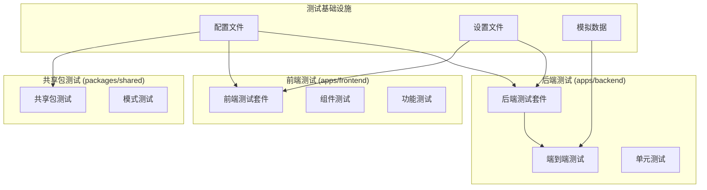
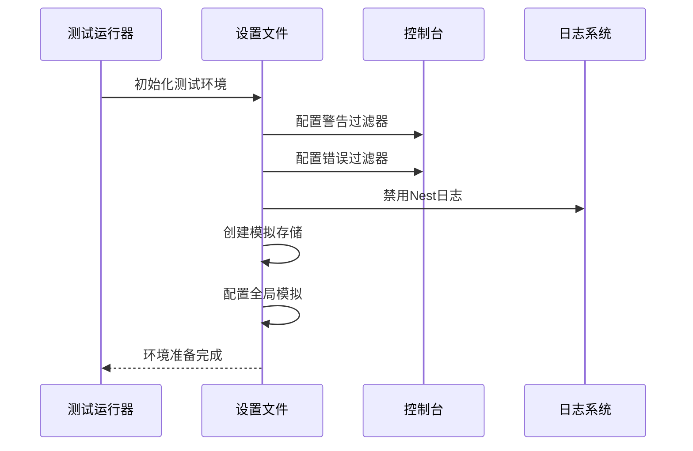
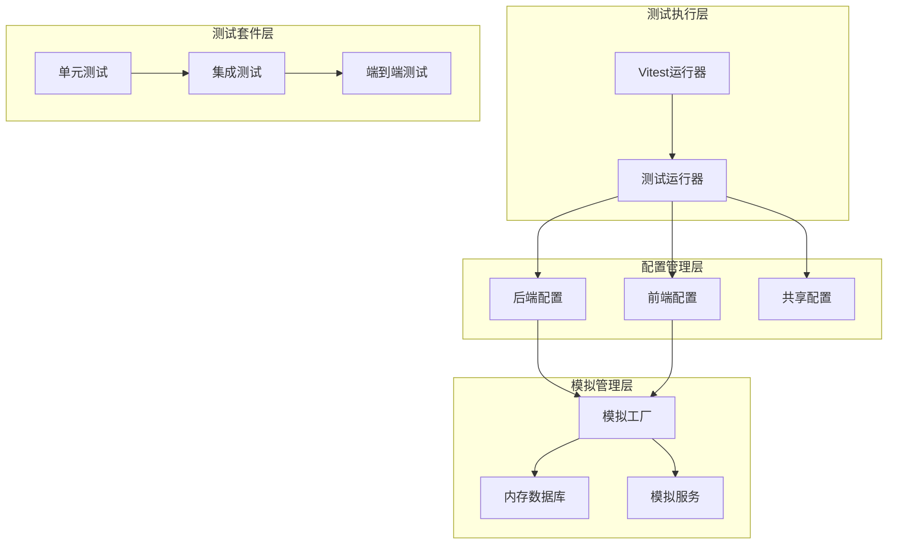
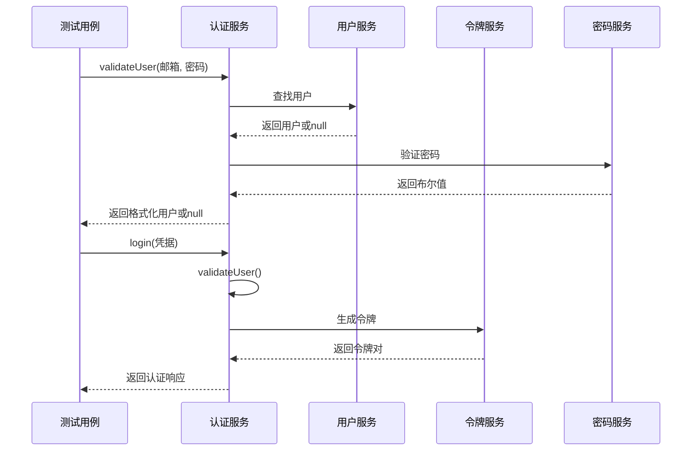
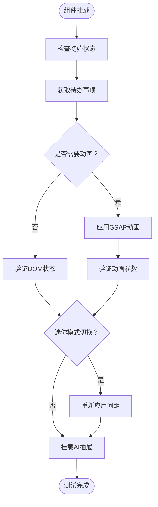
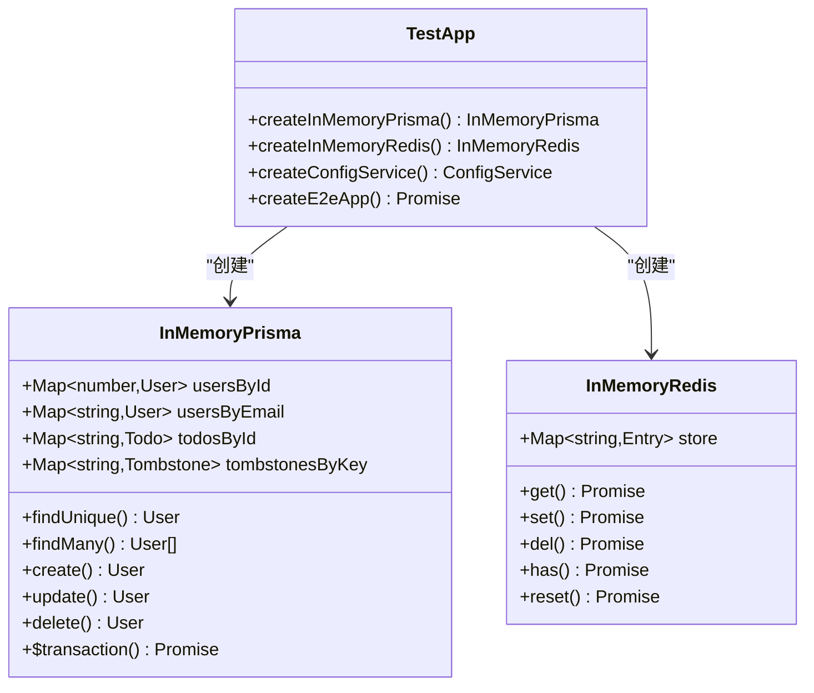
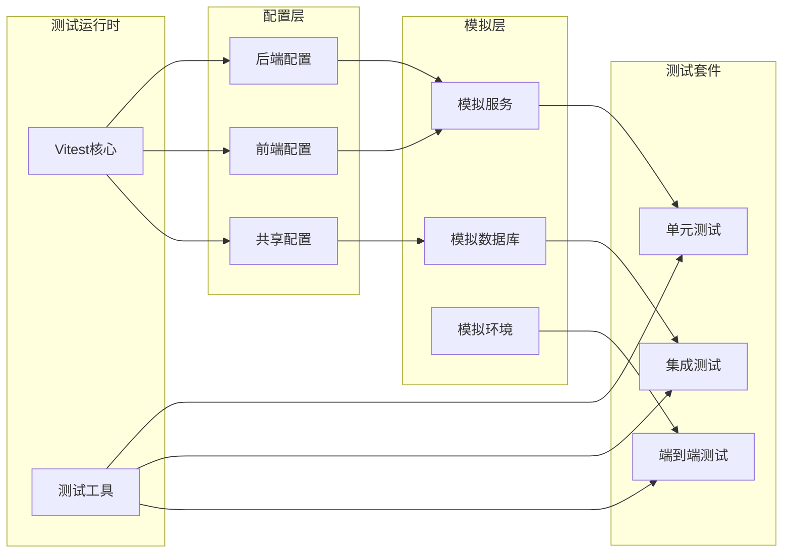

# 组件测试基础设施

<cite>
**本文档引用的文件**
- [apps/backend/vitest.config.mts](file://apps/backend/vitest.config.mts)
- [apps/frontend/vitest.config.mts](file://apps/frontend/vitest.config.mts)
- [packages/shared/vitest.config.ts](file://packages/shared/vitest.config.ts)
- [apps/backend/tests/setup.ts](file://apps/backend/tests/setup.ts)
- [apps/frontend/tests/setup.ts](file://apps/frontend/tests/setup.ts)
- [apps/backend/tests/e2e/test-app.ts](file://apps/backend/tests/e2e/test-app.ts)
- [apps/backend/tests/auth/auth.service.spec.ts](file://apps/backend/tests/auth/auth.service.spec.ts)
- [apps/frontend/tests/features/todo/TodoView.animation.spec.ts](file://apps/frontend/tests/features/todo/TodoView.animation.spec.ts)
- [apps/backend/tests/common/filters/all-exceptions.filter.spec.ts](file://apps/backend/tests/common/filters/all-exceptions.filter.spec.ts)
- [apps/backend/tests/common/throttling.guard.spec.ts](file://apps/backend/tests/common/throttling.guard.spec.ts)
- [apps/backend/tests/e2e/auth.e2e.spec.ts](file://apps/backend/tests/e2e/auth.e2e.spec.ts)
- [packages/shared/src/schemas/auth.schema.ts](file://packages/shared/src/schemas/auth.schema.ts)
- [apps/backend/package.json](file://apps/backend/package.json)
- [apps/frontend/package.json](file://apps/frontend/package.json)
</cite>

## 目录
1. [简介](#简介)
2. [项目结构](#项目结构)
3. [核心组件](#核心组件)
4. [架构概览](#架构概览)
5. [详细组件分析](#详细组件分析)
6. [依赖关系分析](#依赖关系分析)
7. [性能考虑](#性能考虑)
8. [故障排除指南](#故障排除指南)
9. [结论](#结论)

## 简介

本项目采用现代化的组件测试基础设施，基于Vitest构建了完整的前端、后端和共享包测试体系。该基础设施支持单元测试、集成测试和端到端测试，提供了统一的测试配置、模拟机制和测试工具。

测试基础设施的核心特点包括：
- 多环境支持：Node.js后端、浏览器前端、共享包测试
- 完整的模拟生态系统：依赖注入、HTTP客户端、数据库模拟
- 统一的测试配置和别名解析
- 企业级安全检查和性能监控

## 项目结构

项目采用Monorepo架构，包含三个主要测试环境：

**图表来源**
- [apps/backend/vitest.config.mts:1-34](file://apps/backend/vitest.config.mts#L1-L34)
- [apps/frontend/vitest.config.mts:1-23](file://apps/frontend/vitest.config.mts#L1-L23)
- [packages/shared/vitest.config.ts:1-22](file://packages/shared/vitest.config.ts#L1-L22)

**章节来源**
- [apps/backend/vitest.config.mts:1-34](file://apps/backend/vitest.config.mts#L1-L34)
- [apps/frontend/vitest.config.mts:1-23](file://apps/frontend/vitest.config.mts#L1-L23)
- [packages/shared/vitest.config.ts:1-22](file://packages/shared/vitest.config.ts#L1-L22)

## 核心组件

### 测试配置系统

每个应用都有独立的Vitest配置，确保最佳的测试性能和隔离性：

| 组件 | 环境 | 关键特性 |
|------|------|----------|
| 后端配置 | Node.js | 全局变量、UTC时区、覆盖率报告、模块别名 |
| 前端配置 | 浏览器 | HappyDOM环境、Vue插件、组件模拟 |
| 共享包配置 | Node.js | 纯函数测试、类型安全 |

### 设置文件系统

测试设置文件负责全局环境配置和日志管理：

**图表来源**
- [apps/backend/tests/setup.ts:1-66](file://apps/backend/tests/setup.ts#L1-L66)
- [apps/frontend/tests/setup.ts:1-134](file://apps/frontend/tests/setup.ts#L1-L134)

**章节来源**
- [apps/backend/tests/setup.ts:1-66](file://apps/backend/tests/setup.ts#L1-L66)
- [apps/frontend/tests/setup.ts:1-134](file://apps/frontend/tests/setup.ts#L1-L134)

## 架构概览

测试基础设施采用分层架构设计，确保测试的可维护性和可扩展性：

**图表来源**
- [apps/backend/vitest.config.mts:9-26](file://apps/backend/vitest.config.mts#L9-L26)
- [apps/frontend/vitest.config.mts:10-21](file://apps/frontend/vitest.config.mts#L10-L21)
- [packages/shared/vitest.config.ts:4-15](file://packages/shared/vitest.config.ts#L4-L15)

## 详细组件分析

### 后端测试基础设施

后端测试专注于业务逻辑验证和API行为测试：

#### 认证服务测试

认证服务测试覆盖了完整的身份验证流程：

**图表来源**
- [apps/backend/tests/auth/auth.service.spec.ts:34-176](file://apps/backend/tests/auth/auth.service.spec.ts#L34-L176)

#### 异常过滤器测试

异常过滤器确保所有未处理异常都被正确格式化：

| 异常类型 | HTTP状态码 | 错误格式 | 特殊处理 |
|----------|------------|----------|----------|
| HttpException | 对应状态码 | `{ success: false, message, statusCode }` | 直接映射 |
| 业务异常 | 409 | `{ success: false, message, errors }` | 错误映射 |
| Zod验证错误 | 400 | `{ success: false, message, errors }` | 字段级错误 |
| 未知错误 | 500 | `{ success: false, message }` | 通用错误消息 |

**章节来源**
- [apps/backend/tests/auth/auth.service.spec.ts:1-177](file://apps/backend/tests/auth/auth.service.spec.ts#L1-L177)
- [apps/backend/tests/common/filters/all-exceptions.filter.spec.ts:1-126](file://apps/backend/tests/common/filters/all-exceptions.filter.spec.ts#L1-L126)

### 前端测试基础设施

前端测试专注于组件行为和用户交互验证：

#### Todo视图动画测试

Todo视图测试验证复杂的动画逻辑和状态管理：

**图表来源**
- [apps/frontend/tests/features/todo/TodoView.animation.spec.ts:94-150](file://apps/frontend/tests/features/todo/TodoView.animation.spec.ts#L94-L150)

#### 组件模拟策略

前端测试使用多种模拟技术：

| 模拟类型 | 实现方式 | 应用场景 |
|----------|----------|----------|
| Vue组合式API | `vi.mock()` | 状态管理和计算属性 |
| GSAP动画库 | 函数模拟 | 动画效果验证 |
| 路由和导航 | 存储模拟 | 页面跳转测试 |
| 国际化 | 翻译函数模拟 | 多语言支持 |

**章节来源**
- [apps/frontend/tests/features/todo/TodoView.animation.spec.ts:1-151](file://apps/frontend/tests/features/todo/TodoView.animation.spec.ts#L1-L151)

### 端到端测试框架

端到端测试提供完整的系统集成验证：

#### 内存数据库模拟

测试应用创建了完整的内存数据库模拟：

**图表来源**
- [apps/backend/tests/e2e/test-app.ts:149-420](file://apps/backend/tests/e2e/test-app.ts#L149-L420)

#### 安全检查测试

端到端测试验证了关键的安全措施：

| 安全检查 | 测试场景 | 预期结果 |
|----------|----------|----------|
| CSRF防护 | 缺少X-Requested-With头 | 403错误 |
| 请求伪造 | 通过查询字符串绕过 | 403错误 |
| 速率限制 | 重复注册尝试 | 429错误 |
| 认证绕过 | 无效访问令牌 | 401错误 |

**章节来源**
- [apps/backend/tests/e2e/test-app.ts:1-567](file://apps/backend/tests/e2e/test-app.ts#L1-L567)
- [apps/backend/tests/e2e/auth.e2e.spec.ts:1-243](file://apps/backend/tests/e2e/auth.e2e.spec.ts#L1-L243)

## 依赖关系分析

测试基础设施的依赖关系展现了清晰的层次结构：

**图表来源**
- [apps/backend/package.json:88-108](file://apps/backend/package.json#L88-L108)
- [apps/frontend/package.json:72-104](file://apps/frontend/package.json#L72-L104)

**章节来源**
- [apps/backend/package.json:1-109](file://apps/backend/package.json#L1-L109)
- [apps/frontend/package.json:1-105](file://apps/frontend/package.json#L1-L105)

## 性能考虑

测试基础设施在性能优化方面采用了多项策略：

### 并行执行优化

- **工作进程池**：最大并发工作进程数为50%
- **测试隔离**：每个测试用例独立执行，避免状态污染
- **内存管理**：自动清理模拟对象和事件监听器

### 覆盖率收集

- **多格式报告**：文本、JSON、HTML三种格式
- **排除规则**：忽略类型定义文件和主入口文件
- **增量更新**：仅报告变更部分的覆盖率

### 缓存策略

- **模块缓存**：Vitest内置模块解析缓存
- **测试缓存**：重复运行时利用缓存结果
- **模拟缓存**：模拟对象状态重置机制

## 故障排除指南

### 常见问题及解决方案

#### 测试超时问题

**症状**：测试长时间运行或无限等待
**原因**：异步操作未正确清理
**解决**：检查`beforeEach`和`afterEach`钩子中的清理逻辑

#### 模拟不生效

**症状**：被测代码仍然调用真实依赖
**原因**：模拟导入路径不匹配
**解决**：确认模拟文件的相对路径与实际导入路径一致

#### 环境变量冲突

**症状**：测试间相互影响
**原因**：全局状态未重置
**解决**：使用`vi.restoreAllMocks()`重置所有模拟

#### 内存泄漏

**症状**：长时间运行后内存占用持续增长
**原因**：事件监听器未移除
**解决**：在测试完成后清理所有监听器和定时器

**章节来源**
- [apps/frontend/tests/setup.ts:85-101](file://apps/frontend/tests/setup.ts#L85-L101)
- [apps/backend/tests/setup.ts:37-65](file://apps/backend/tests/setup.ts#L37-L65)

## 结论

本项目的组件测试基础设施展现了现代JavaScript测试的最佳实践：

### 主要优势

1. **完整的测试金字塔**：从单元测试到端到端测试的完整覆盖
2. **企业级安全性**：内置CSRF防护和速率限制测试
3. **高性能执行**：并行测试执行和智能缓存机制
4. **开发体验**：直观的模拟API和详细的错误报告

### 技术亮点

- **统一的测试配置**：跨平台一致的测试环境
- **智能模拟系统**：完整的依赖注入和状态管理
- **安全测试优先**：专门的安全检查和防护测试
- **可观测性**：全面的覆盖率报告和性能指标

该测试基础设施为项目的长期维护和发展提供了坚实的基础，确保代码质量和系统稳定性。