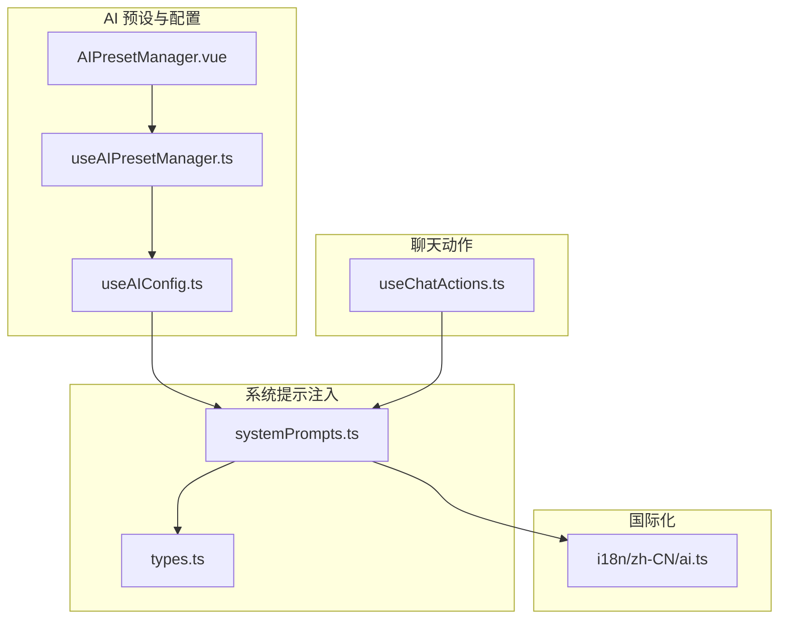
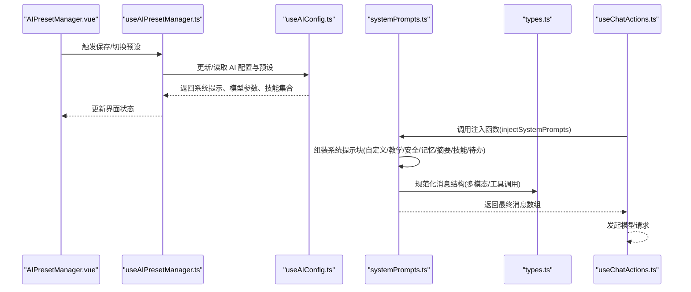
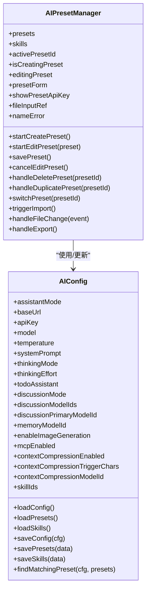
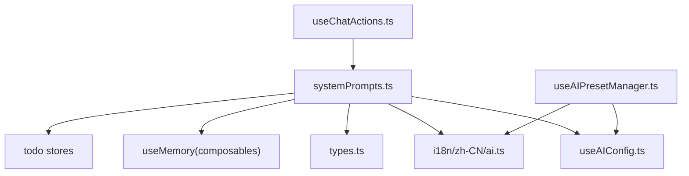

# 系统提示注入（System Prompts Injection）

<cite>
**本文档引用的文件**
- [apps/frontend/src/features/ai/services/utils/systemPrompts.ts](file://apps/frontend/src/features/ai/services/utils/systemPrompts.ts)
- [apps/frontend/src/features/ai/composables/useAIConfig.ts](file://apps/frontend/src/features/ai/composables/useAIConfig.ts)
- [apps/frontend/src/features/ai/composables/useAIPresetManager.ts](file://apps/frontend/src/features/ai/composables/useAIPresetManager.ts)
- [apps/frontend/src/features/ai/components/AIPresetManager.vue](file://apps/frontend/src/features/ai/components/AIPresetManager.vue)
- [apps/frontend/src/features/ai/services/types.ts](file://apps/frontend/src/features/ai/services/types.ts)
- [apps/frontend/src/i18n/locales/zh-CN/ai.ts](file://apps/frontend/src/i18n/locales/zh-CN/ai.ts)
- [apps/frontend/src/features/ai/composables/useChatActions.ts](file://apps/frontend/src/features/ai/composables/useChatActions.ts)
</cite>

## 目录
1. [简介](#简介)
2. [项目结构](#项目结构)
3. [核心组件](#核心组件)
4. [架构总览](#架构总览)
5. [详细组件分析](#详细组件分析)
6. [依赖关系分析](#依赖关系分析)
7. [性能考量](#性能考量)
8. [故障排除指南](#故障排除指南)
9. [结论](#结论)

## 简介
本文件围绕“系统提示注入（System Prompts Injection）”主题，系统梳理前端 AI 能力中如何将系统提示（System Prompt）与上下文信息组合，形成最终的模型请求消息序列。重点覆盖以下方面：
- 系统提示的来源与构建：包括用户自定义系统提示、教学模式提示、安全边界提示、记忆上下文、上下文摘要、技能运行边界与可用性提示、待办助手上下文等。
- 预设与配置：如何通过 AI 预设管理器持久化与切换系统提示，以及与全局 AI 配置的联动。
- 请求消息的规范化与注入流程：如何将系统提示注入到消息序列的首位，并对用户消息进行文档与图片增强。
- 国际化与本地化：系统提示文本的本地化存储与动态模板替换。

## 项目结构
本主题涉及的前端模块主要位于 `apps/frontend/src/features/ai/` 目录下，关键文件包括：
- 系统提示注入工具：`apps/frontend/src/features/ai/services/utils/systemPrompts.ts`
- AI 配置与预设：`apps/frontend/src/features/ai/composables/useAIConfig.ts`、`apps/frontend/src/features/ai/composables/useAIPresetManager.ts`、`apps/frontend/src/features/ai/components/AIPresetManager.vue`
- 类型定义：`apps/frontend/src/features/ai/services/types.ts`
- 国际化文案：`apps/frontend/src/i18n/locales/zh-CN/ai.ts`
- 聊天动作与请求集成：`apps/frontend/src/features/ai/composables/useChatActions.ts`

**图表来源**
- [apps/frontend/src/features/ai/components/AIPresetManager.vue](file://apps/frontend/src/features/ai/components/AIPresetManager.vue)
- [apps/frontend/src/features/ai/composables/useAIPresetManager.ts](file://apps/frontend/src/features/ai/composables/useAIPresetManager.ts)
- [apps/frontend/src/features/ai/composables/useAIConfig.ts](file://apps/frontend/src/features/ai/composables/useAIConfig.ts)
- [apps/frontend/src/features/ai/services/utils/systemPrompts.ts](file://apps/frontend/src/features/ai/services/utils/systemPrompts.ts)
- [apps/frontend/src/features/ai/services/types.ts](file://apps/frontend/src/features/ai/services/types.ts)
- [apps/frontend/src/i18n/locales/zh-CN/ai.ts](file://apps/frontend/src/i18n/locales/zh-CN/ai.ts)
- [apps/frontend/src/features/ai/composables/useChatActions.ts](file://apps/frontend/src/features/ai/composables/useChatActions.ts)

**章节来源**
- [apps/frontend/src/features/ai/services/utils/systemPrompts.ts](file://apps/frontend/src/features/ai/services/utils/systemPrompts.ts)
- [apps/frontend/src/features/ai/composables/useAIConfig.ts](file://apps/frontend/src/features/ai/composables/useAIConfig.ts)
- [apps/frontend/src/features/ai/composables/useAIPresetManager.ts](file://apps/frontend/src/features/ai/composables/useAIPresetManager.ts)
- [apps/frontend/src/features/ai/components/AIPresetManager.vue](file://apps/frontend/src/features/ai/components/AIPresetManager.vue)
- [apps/frontend/src/features/ai/services/types.ts](file://apps/frontend/src/features/ai/services/types.ts)
- [apps/frontend/src/i18n/locales/zh-CN/ai.ts](file://apps/frontend/src/i18n/locales/zh-CN/ai.ts)
- [apps/frontend/src/features/ai/composables/useChatActions.ts](file://apps/frontend/src/features/ai/composables/useChatActions.ts)

## 核心组件
- 系统提示注入器：负责将多种来源的系统提示块拼接为单一 system 消息，并将用户消息扩展为包含文档与图片的多模态内容，最终输出符合模型接口的消息数组。
- AI 预设管理器：提供预设的创建、编辑、导入、导出、切换等功能，支持持久化系统提示、模型参数、技能集合等。
- AI 配置：提供全局 AI 配置与默认值，包括系统提示、温度、思考模式、讨论模式、上下文压缩、技能 ID 列表等。
- 类型定义：定义聊天消息、工具调用、技能运行时、AI 请求选项等类型，确保注入流程的数据结构一致。
- 国际化文案：提供系统提示文本、模板与本地化消息，支持动态替换占位符。
- 聊天动作：在发送消息前调用系统提示注入器，生成最终请求消息并发起流式请求。

**章节来源**
- [apps/frontend/src/features/ai/services/utils/systemPrompts.ts](file://apps/frontend/src/features/ai/services/utils/systemPrompts.ts)
- [apps/frontend/src/features/ai/composables/useAIPresetManager.ts](file://apps/frontend/src/features/ai/composables/useAIPresetManager.ts)
- [apps/frontend/src/features/ai/composables/useAIConfig.ts](file://apps/frontend/src/features/ai/composables/useAIConfig.ts)
- [apps/frontend/src/features/ai/services/types.ts](file://apps/frontend/src/features/ai/services/types.ts)
- [apps/frontend/src/i18n/locales/zh-CN/ai.ts](file://apps/frontend/src/i18n/locales/zh-CN/ai.ts)
- [apps/frontend/src/features/ai/composables/useChatActions.ts](file://apps/frontend/src/features/ai/composables/useChatActions.ts)

## 架构总览
系统提示注入的整体流程如下：
- 读取用户配置与预设，确定系统提示、思考模式、讨论模式、上下文摘要、记忆快照、技能集合等。
- 根据场景动态拼接系统提示块：用户自定义系统提示、教学模式提示、安全边界提示、记忆上下文、上下文摘要、技能运行边界与可用性提示、待办助手上下文。
- 将系统提示块合并为单一 system 消息，插入到消息序列首位。
- 对用户消息进行增强：附加文档内容与图片为多模态内容，工具消息进行规范化。
- 将最终消息数组传递给模型请求接口。

**图表来源**
- [apps/frontend/src/features/ai/components/AIPresetManager.vue](file://apps/frontend/src/features/ai/components/AIPresetManager.vue)
- [apps/frontend/src/features/ai/composables/useAIPresetManager.ts](file://apps/frontend/src/features/ai/composables/useAIPresetManager.ts)
- [apps/frontend/src/features/ai/composables/useAIConfig.ts](file://apps/frontend/src/features/ai/composables/useAIConfig.ts)
- [apps/frontend/src/features/ai/services/utils/systemPrompts.ts](file://apps/frontend/src/features/ai/services/utils/systemPrompts.ts)
- [apps/frontend/src/features/ai/services/types.ts](file://apps/frontend/src/features/ai/services/types.ts)
- [apps/frontend/src/features/ai/composables/useChatActions.ts](file://apps/frontend/src/features/ai/composables/useChatActions.ts)

## 详细组件分析

### 系统提示注入器（injectSystemPrompts）
- 功能概述
  - 接收聊天消息、系统提示、待办助手开关、助手模式、上下文摘要、记忆快照、技能目录、已激活技能、技能运行时可用性等参数。
  - 动态构建系统提示块：用户自定义系统提示、教学模式提示、安全边界提示、记忆上下文、上下文摘要、技能运行边界与可用性提示、待办助手上下文。
  - 将系统提示块合并为单一 system 消息，插入到消息序列首位。
  - 对用户消息进行增强：附加文档内容与图片为多模态内容；对工具消息进行规范化。
  - 返回符合模型接口的消息数组。

- 关键流程
  - 初始化系统提示块数组与文档字符计数。
  - 按条件追加系统提示块：自定义系统提示、教学模式提示、安全边界提示、记忆上下文、上下文摘要、技能运行边界、技能可用性、已激活技能、待办助手上下文。
  - 合并系统提示块为单一 system 消息并加入结果数组。
  - 遍历原始消息，过滤 system 消息，对用户/助手/工具消息进行内容增强与规范化，加入结果数组。
  - 返回最终消息数组。

- 安全与边界
  - 当存在文档或工具消息时，追加安全边界提示，强调 system 消息优先级与不可信数据处理原则。
  - 对工具调用与工具消息进行严格校验与清理，防止注入风险。

- 多模态支持
  - 当消息包含图片时，将文本与图片封装为多模态内容数组，确保模型可处理图像输入。

- 文档内容截断
  - 对文档内容按单文件与总量进行字符截断，避免超出上下文限制。

```mermaid
flowchart TD
Start(["开始注入"]) --> Init["初始化系统提示块与计数"]
Init --> CheckCustom{"是否存在自定义系统提示?"}
CheckCustom --> |是| AddCustom["追加自定义系统提示块"]
CheckCustom --> |否| Next1["跳过"]
AddCustom --> Next1
Next1 --> CheckTeaching{"是否教学模式?"}
CheckTeaching --> |是| AddTeaching["追加教学模式提示与进度上下文"]
CheckTeaching --> |否| Next2["跳过"]
AddTeaching --> Next2
Next2 --> CheckDocsOrTools{"是否存在文档或工具消息?"}
CheckDocsOrTools --> |是| AddSecurity["追加安全边界提示"]
CheckDocsOrTools --> |否| Next3["跳过"]
AddSecurity --> Next3
Next3 --> CheckMem{"是否存在记忆快照或启用记忆?"}
CheckMem --> |是| AddMemory["追加记忆上下文"]
CheckMem --> |否| Next4["跳过"]
AddMemory --> Next4
Next4 --> CheckSummary{"是否存在上下文摘要?"}
CheckSummary --> |是| AddSummary["追加上下文摘要提示"]
CheckSummary --> |否| Next5["跳过"]
AddSummary --> Next5
Next5 --> CheckSkills{"是否存在技能目录或已激活技能?"}
CheckSkills --> |是| AddSkillBoundary["追加技能运行边界提示"]
CheckSkills --> |否| Next6["跳过"]
AddSkillBoundary --> Next6
Next6 --> CheckAvail{"是否存在技能可用性状态?"}
CheckAvail --> |是| AddAvail["追加技能可用性提示"]
CheckAvail --> |否| Next7["跳过"]
AddAvail --> Next7
Next7 --> CheckActive{"是否存在已激活技能?"}
CheckActive --> |是| AddActive["追加已激活技能提示"]
CheckActive --> |否| Next8["跳过"]
AddActive --> Next8
Next8 --> CheckTodo{"是否启用待办助手?"}
CheckTodo --> |是| AddTodo["追加待办助手上下文"]
CheckTodo --> |否| Next9["跳过"]
AddTodo --> Next9
Next9 --> Merge["合并系统提示块为单一 system 消息"]
Merge --> BuildUserMsgs["遍历原始消息，过滤 system 并增强内容"]
BuildUserMsgs --> Sanitize["规范化工具调用与工具消息"]
Sanitize --> Return(["返回最终消息数组"])
```

**图表来源**
- [apps/frontend/src/features/ai/services/utils/systemPrompts.ts](file://apps/frontend/src/features/ai/services/utils/systemPrompts.ts)

**章节来源**
- [apps/frontend/src/features/ai/services/utils/systemPrompts.ts](file://apps/frontend/src/features/ai/services/utils/systemPrompts.ts)

### AI 预设管理器与配置
- 预设管理器
  - 提供创建、编辑、保存、删除、复制、导入、导出、切换预设等能力。
  - 支持预设表单字段：名称、基础 URL、API Key、模型、系统提示、温度、思考努力度、待办助手开关、技能 ID 列表。
  - 通过防抖机制自动保存编辑中的预设，减少频繁写入。

- AI 配置
  - 提供全局 AI 配置与默认值，包括系统提示、温度、思考模式、讨论模式、上下文压缩、技能 ID 列表等。
  - 支持从 localStorage 加载与保存配置、预设、技能，保证持久化与跨会话一致性。
  - 提供预设匹配逻辑，用于判断当前配置是否与某个预设一致。

**图表来源**
- [apps/frontend/src/features/ai/composables/useAIPresetManager.ts](file://apps/frontend/src/features/ai/composables/useAIPresetManager.ts)
- [apps/frontend/src/features/ai/composables/useAIConfig.ts](file://apps/frontend/src/features/ai/composables/useAIConfig.ts)

**章节来源**
- [apps/frontend/src/features/ai/composables/useAIPresetManager.ts](file://apps/frontend/src/features/ai/composables/useAIPresetManager.ts)
- [apps/frontend/src/features/ai/composables/useAIConfig.ts](file://apps/frontend/src/features/ai/composables/useAIConfig.ts)

### 国际化与本地化
- 系统提示文本通过 i18n 存储在本地化文件中，支持动态模板替换与占位符注入。
- 教学模式、技能运行边界、安全边界、记忆上下文、上下文摘要、待办助手等提示均有对应的本地化文案。
- 注入器通过模板函数对占位符进行替换，确保提示内容与当前上下文一致。

**章节来源**
- [apps/frontend/src/i18n/locales/zh-CN/ai.ts](file://apps/frontend/src/i18n/locales/zh-CN/ai.ts)
- [apps/frontend/src/features/ai/services/utils/systemPrompts.ts](file://apps/frontend/src/features/ai/services/utils/systemPrompts.ts)

### 聊天动作与请求集成
- 在发送消息前，聊天动作会读取当前 AI 配置，调用系统提示注入器生成最终消息数组。
- 支持多模型协同讨论、图片生成、工具调用、上下文压缩、记忆提取与压缩等高级特性。
- 对工具调用与工具消息进行严格规范化，确保模型请求的安全与稳定。

**章节来源**
- [apps/frontend/src/features/ai/composables/useChatActions.ts](file://apps/frontend/src/features/ai/composables/useChatActions.ts)
- [apps/frontend/src/features/ai/services/utils/systemPrompts.ts](file://apps/frontend/src/features/ai/services/utils/systemPrompts.ts)

## 依赖关系分析
- 系统提示注入器依赖：
  - AI 配置：获取系统提示、思考模式、讨论模式、上下文摘要、记忆快照、技能集合等。
  - 类型定义：确保消息结构与工具调用的类型安全。
  - 国际化：获取本地化提示文本与模板。
  - 记忆与待办：在教学模式与待办助手场景下动态注入上下文。

- 预设管理器依赖：
  - AI 配置：读取与保存预设、切换活动预设。
  - 国际化：错误提示与成功反馈的本地化文案。

**图表来源**
- [apps/frontend/src/features/ai/services/utils/systemPrompts.ts](file://apps/frontend/src/features/ai/services/utils/systemPrompts.ts)
- [apps/frontend/src/features/ai/composables/useAIConfig.ts](file://apps/frontend/src/features/ai/composables/useAIConfig.ts)
- [apps/frontend/src/features/ai/services/types.ts](file://apps/frontend/src/features/ai/services/types.ts)
- [apps/frontend/src/i18n/locales/zh-CN/ai.ts](file://apps/frontend/src/i18n/locales/zh-CN/ai.ts)
- [apps/frontend/src/features/ai/composables/useAIPresetManager.ts](file://apps/frontend/src/features/ai/composables/useAIPresetManager.ts)
- [apps/frontend/src/features/ai/composables/useChatActions.ts](file://apps/frontend/src/features/ai/composables/useChatActions.ts)

**章节来源**
- [apps/frontend/src/features/ai/services/utils/systemPrompts.ts](file://apps/frontend/src/features/ai/services/utils/systemPrompts.ts)
- [apps/frontend/src/features/ai/composables/useAIConfig.ts](file://apps/frontend/src/features/ai/composables/useAIConfig.ts)
- [apps/frontend/src/features/ai/composables/useAIPresetManager.ts](file://apps/frontend/src/features/ai/composables/useAIPresetManager.ts)
- [apps/frontend/src/features/ai/composables/useChatActions.ts](file://apps/frontend/src/features/ai/composables/useChatActions.ts)

## 性能考量
- 文档内容截断：对单文件与总字符数进行限制，避免超长文档导致上下文溢出与性能下降。
- 防抖保存：预设编辑采用防抖机制，减少频繁写入 localStorage 的开销。
- 多模态消息：仅在需要时将图片封装为多模态内容，避免不必要的结构复杂化。
- 工具调用规范化：对工具调用与工具消息进行严格校验，减少无效或恶意内容带来的处理负担。

## 故障排除指南
- 系统提示为空或无效
  - 检查预设中的系统提示字段是否正确保存与加载。
  - 确认国际化文案是否正确加载，模板占位符是否被正确替换。

- 文档解析与注入异常
  - 确认文档大小与字符数未超过限制，必要时进行截断。
  - 检查文档内容是否包含非法字符，注入器会对空字符进行清理。

- 工具调用与工具消息错误
  - 确认工具调用结构符合类型定义，注入器会对无效字段进行清理。
  - 检查工具消息内容是否为字符串或可序列化对象，避免复杂结构导致的错误。

- 预设导入/导出失败
  - 检查导入文件格式是否为有效 JSON，确保字段与类型匹配。
  - 导出时确认预设列表非空，避免生成空文件。

**章节来源**
- [apps/frontend/src/features/ai/services/utils/systemPrompts.ts](file://apps/frontend/src/features/ai/services/utils/systemPrompts.ts)
- [apps/frontend/src/features/ai/composables/useAIPresetManager.ts](file://apps/frontend/src/features/ai/composables/useAIPresetManager.ts)
- [apps/frontend/src/i18n/locales/zh-CN/ai.ts](file://apps/frontend/src/i18n/locales/zh-CN/ai.ts)

## 结论
系统提示注入是 AI 对话能力的核心环节，通过将用户自定义系统提示、教学模式提示、安全边界、记忆上下文、上下文摘要、技能运行边界与可用性、待办助手等多维信息整合为单一 system 消息，并对用户消息进行增强与规范化，确保模型在复杂场景下仍能遵循安全与可控的原则。配合 AI 预设管理器与全局配置，系统实现了灵活、可定制、可持久化的提示注入体验。