# 任务列表样式文档

<cite>
**本文档引用的文件**
- [TodoList.vue](file://apps/frontend/src/features/todo/components/TodoList.vue)
- [TodoItem.vue](file://apps/frontend/src/features/todo/components/TodoItem.vue)
- [TodoFilter.vue](file://apps/frontend/src/features/todo/components/TodoFilter.vue)
- [TodoInput.vue](file://apps/frontend/src/features/todo/components/TodoInput.vue)
- [Tabs.vue](file://apps/frontend/src/components/ui/tabs/Tabs.vue)
- [TabsList.vue](file://apps/frontend/src/components/ui/tabs/TabsList.vue)
- [TabsTrigger.vue](file://apps/frontend/src/components/ui/tabs/TabsTrigger.vue)
- [base.css](file://apps/frontend/src/styles/base.css)
- [theme.css](file://apps/frontend/src/styles/theme.css)
- [main.css](file://apps/frontend/src/styles/main.css)
- [ui.css](file://apps/frontend/src/styles/ui.css)
- [utils.ts](file://apps/frontend/src/lib/utils.ts)
- [colors.ts](file://apps/frontend/src/lib/colors.ts)
- [Checkbox.vue](file://apps/frontend/src/components/ui/checkbox/Checkbox.vue)
- [Button.vue](file://apps/frontend/src/components/ui/button/Button.vue)
- [ScrollArea.vue](file://apps/frontend/src/components/ui/scroll-area/ScrollArea.vue)
- [ScrollBar.vue](file://apps/frontend/src/components/ui/scroll-area/ScrollBar.vue)
</cite>

## 更新摘要
**所做更改**
- 新增 TodoFilter 组件样式系统分析
- 新增 TodoInput 组件样式系统分析  
- 新增 Tabs 组件样式系统分析
- 更新 CSS 变量系统说明（新增 --todo-* 变量）
- 更新响应式设计实现章节
- 更新字体排版系统说明
- 新增 Typography 系统详细分析

## 目录
1. [简介](#简介)
2. [项目结构概览](#项目结构概览)
3. [核心组件架构](#核心组件架构)
4. [样式系统设计](#样式系统设计)
5. [任务列表组件详解](#任务列表组件详解)
6. [交互状态管理](#交互状态管理)
7. [响应式设计实现](#响应式设计实现)
8. [性能优化策略](#性能优化策略)
9. [故障排除指南](#故障排除指南)
10. [总结](#总结)

## 简介

这是一个基于 Vue 3 和 Tailwind CSS 构建的任务管理系统，专注于提供流畅的用户体验和现代化的界面设计。该系统采用组件化架构，通过精心设计的样式系统实现了高度可定制的主题和丰富的交互效果。

系统的核心特色包括：
- **模块化组件设计**：清晰的组件层次结构和职责分离
- **主题化样式系统**：基于 CSS 变量的主题支持，包含明暗模式切换
- **流畅的动画效果**：使用 CSS 过渡和硬件加速优化
- **响应式布局**：适配各种设备尺寸的界面设计
- **无障碍访问**：完整的键盘导航和屏幕阅读器支持

## 项目结构概览

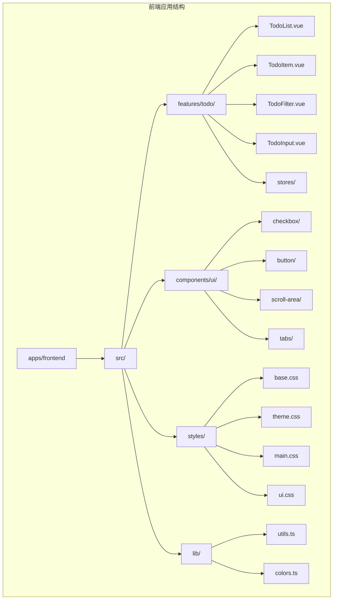

**图表来源**
- [TodoList.vue:1-274](file://apps/frontend/src/features/todo/components/TodoList.vue#L1-L274)
- [TodoItem.vue:1-344](file://apps/frontend/src/features/todo/components/TodoItem.vue#L1-L344)
- [TodoFilter.vue:1-204](file://apps/frontend/src/features/todo/components/TodoFilter.vue#L1-L204)
- [TodoInput.vue:1-152](file://apps/frontend/src/features/todo/components/TodoInput.vue#L1-L152)

**章节来源**
- [TodoList.vue:1-274](file://apps/frontend/src/features/todo/components/TodoList.vue#L1-L274)
- [TodoItem.vue:1-344](file://apps/frontend/src/features/todo/components/TodoItem.vue#L1-L344)
- [TodoFilter.vue:1-204](file://apps/frontend/src/features/todo/components/TodoFilter.vue#L1-L204)
- [TodoInput.vue:1-152](file://apps/frontend/src/features/todo/components/TodoInput.vue#L1-L152)

## 核心组件架构

### 组件层次结构

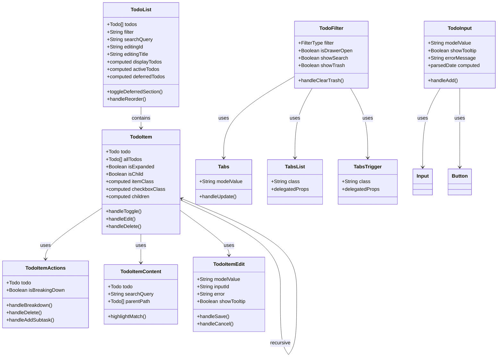

**图表来源**
- [TodoList.vue:26-43](file://apps/frontend/src/features/todo/components/TodoList.vue#L26-L43)
- [TodoItem.vue:28-46](file://apps/frontend/src/features/todo/components/TodoItem.vue#L28-L46)
- [TodoFilter.vue:1-204](file://apps/frontend/src/features/todo/components/TodoFilter.vue#L1-L204)
- [TodoInput.vue:1-152](file://apps/frontend/src/features/todo/components/TodoInput.vue#L1-L152)
- [Tabs.vue:1-16](file://apps/frontend/src/components/ui/tabs/Tabs.vue#L1-L16)
- [TabsList.vue:1-26](file://apps/frontend/src/components/ui/tabs/TabsList.vue#L1-L26)
- [TabsTrigger.vue:1-28](file://apps/frontend/src/components/ui/tabs/TabsTrigger.vue#L1-L28)

### 样式系统架构

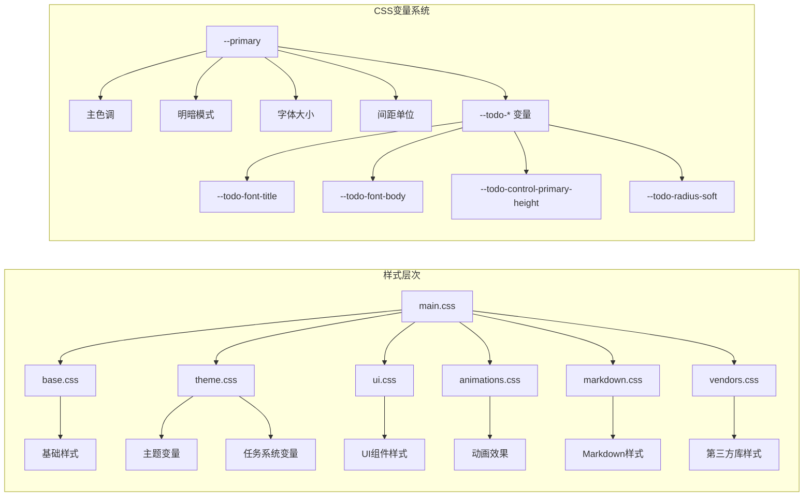

**图表来源**
- [main.css:1-7](file://apps/frontend/src/styles/main.css#L1-L7)
- [base.css:1-89](file://apps/frontend/src/styles/base.css#L1-L89)
- [theme.css:1-170](file://apps/frontend/src/styles/theme.css#L1-L170)
- [ui.css:80-89](file://apps/frontend/src/styles/ui.css#L80-L89)

**章节来源**
- [main.css:1-7](file://apps/frontend/src/styles/main.css#L1-L7)
- [base.css:1-89](file://apps/frontend/src/styles/base.css#L1-L89)
- [theme.css:1-170](file://apps/frontend/src/styles/theme.css#L1-L170)
- [ui.css:80-89](file://apps/frontend/src/styles/ui.css#L80-L89)

## 样式系统设计

### 主题变量系统

系统采用基于 CSS 自定义属性的主题系统，提供了完整的明暗模式支持：

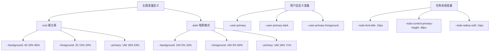

**图表来源**
- [theme.css:2-89](file://apps/frontend/src/styles/theme.css#L2-L89)
- [theme.css:91-141](file://apps/frontend/src/styles/theme.css#L91-L141)
- [ui.css:80-89](file://apps/frontend/src/styles/ui.css#L80-L89)

### 颜色系统实现

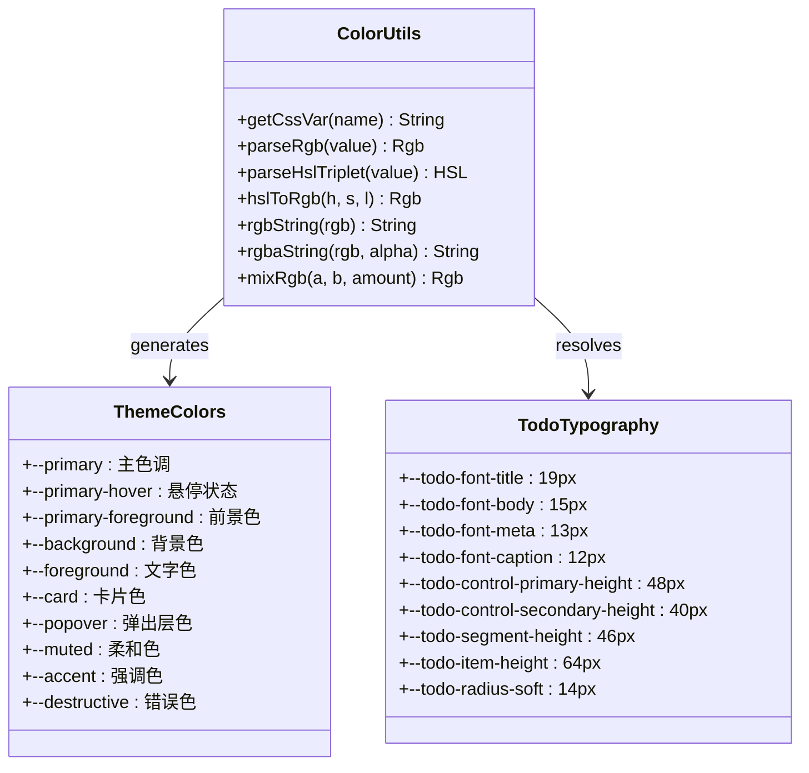

**图表来源**
- [colors.ts:1-96](file://apps/frontend/src/lib/colors.ts#L1-L96)
- [theme.css:5-56](file://apps/frontend/src/styles/theme.css#L5-L56)
- [ui.css:80-89](file://apps/frontend/src/styles/ui.css#L80-L89)

**章节来源**
- [colors.ts:1-96](file://apps/frontend/src/lib/colors.ts#L1-L96)
- [theme.css:1-170](file://apps/frontend/src/styles/theme.css#L1-L170)
- [ui.css:80-89](file://apps/frontend/src/styles/ui.css#L80-L89)

## 任务列表组件详解

### TodoList 组件分析

TodoList 是任务列表的主要容器组件，负责管理任务的显示逻辑和交互：

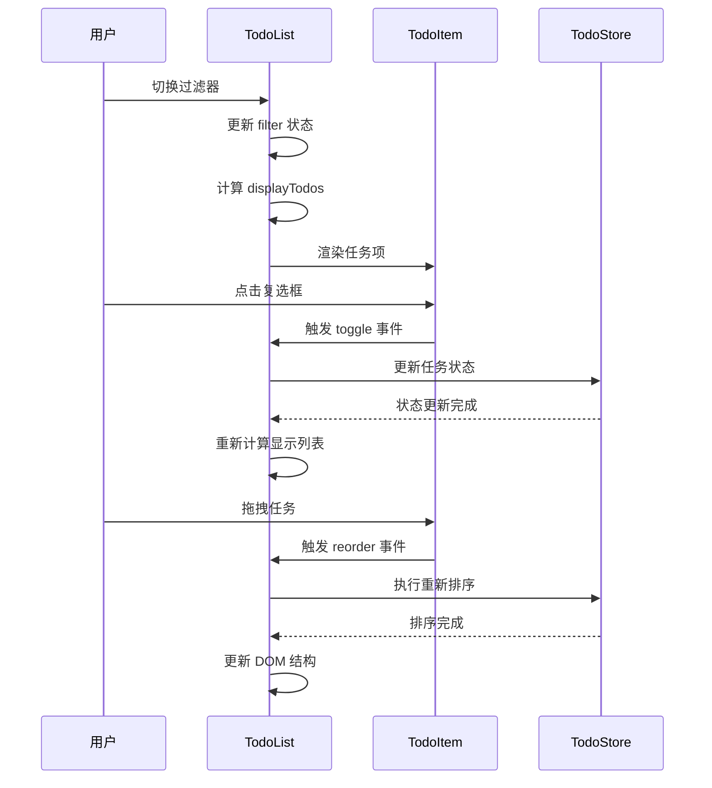

**图表来源**
- [TodoList.vue:34-43](file://apps/frontend/src/features/todo/components/TodoList.vue#L34-L43)
- [TodoList.vue:45-67](file://apps/frontend/src/features/todo/components/TodoList.vue#L45-L67)

### TodoItem 组件详细分析

TodoItem 是单个任务项的核心组件，实现了复杂的交互逻辑：

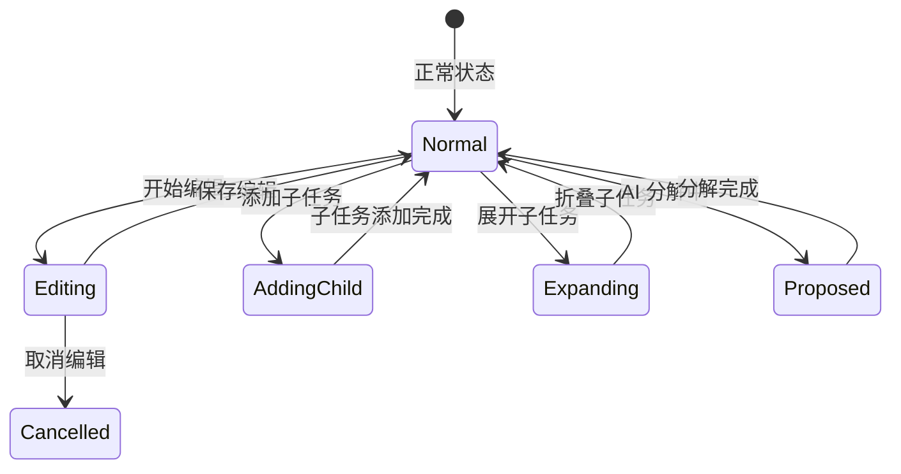

**图表来源**
- [TodoItem.vue:48-103](file://apps/frontend/src/features/todo/components/TodoItem.vue#L48-L103)

### TodoFilter 组件样式系统

TodoFilter 是任务过滤器组件，集成了 Tabs 组件和工具栏按钮：

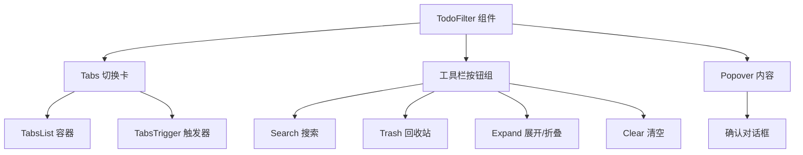

**图表来源**
- [TodoFilter.vue:50-89](file://apps/frontend/src/features/todo/components/TodoFilter.vue#L50-L89)
- [TodoFilter.vue:92-202](file://apps/frontend/src/features/todo/components/TodoFilter.vue#L92-L202)

### TodoInput 组件样式系统

TodoInput 是任务输入组件，支持自然语言日期解析和智能提示：

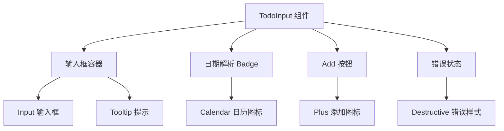

**图表来源**
- [TodoInput.vue:85-151](file://apps/frontend/src/features/todo/components/TodoInput.vue#L85-L151)

**章节来源**
- [TodoList.vue:1-274](file://apps/frontend/src/features/todo/components/TodoList.vue#L1-L274)
- [TodoItem.vue:1-344](file://apps/frontend/src/features/todo/components/TodoItem.vue#L1-L344)
- [TodoFilter.vue:1-204](file://apps/frontend/src/features/todo/components/TodoFilter.vue#L1-L204)
- [TodoInput.vue:1-152](file://apps/frontend/src/features/todo/components/TodoInput.vue#L1-L152)

## 交互状态管理

### 状态流转机制

系统通过 Vue 的响应式系统实现了复杂的状态管理：

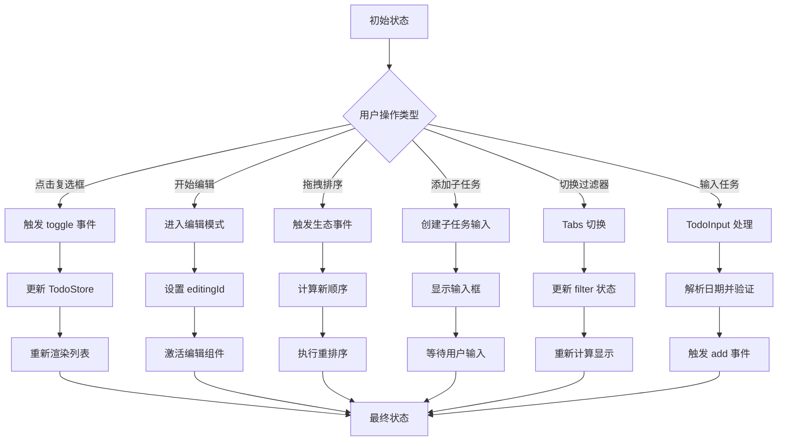

**图表来源**
- [TodoItem.vue:145-178](file://apps/frontend/src/features/todo/components/TodoItem.vue#L145-L178)
- [TodoList.vue:34-43](file://apps/frontend/src/features/todo/components/TodoList.vue#L34-L43)
- [TodoFilter.vue:37-47](file://apps/frontend/src/features/todo/components/TodoFilter.vue#L37-L47)
- [TodoInput.vue:21-25](file://apps/frontend/src/features/todo/components/TodoInput.vue#L21-L25)

### 动画和过渡效果

系统实现了多层次的动画效果来增强用户体验：

| 动画类型 | 触发条件 | 持续时间 | 缓动函数 |
|---------|----------|----------|----------|
| 列表项悬停 | 鼠标悬停 | 200ms | ease-in-out |
| 复选框点击 | 用户点击 | 150ms | cubic-bezier(0.4, 0, 0.2, 1) |
| 拖拽动画 | 任务拖拽 | 200ms | ease-out |
| 展开折叠 | 子任务展开 | 300ms | ease-in-out |
| 主题切换 | 明暗模式切换 | 500ms | cubic-bezier(0.4, 0, 0.2, 1) |
| Tabs 切换 | 过滤器切换 | 200ms | cubic-bezier(0.4, 0, 0.2, 1) |
| 输入动画 | 错误状态 | 300ms | ease-out |

**章节来源**
- [TodoItem.vue:191-203](file://apps/frontend/src/features/todo/components/TodoItem.vue#L191-L203)
- [theme.css:152-160](file://apps/frontend/src/styles/theme.css#L152-L160)
- [TodoFilter.vue:100-105](file://apps/frontend/src/features/todo/components/TodoFilter.vue#L100-L105)
- [TodoInput.vue:105-112](file://apps/frontend/src/features/todo/components/TodoInput.vue#L105-L112)

## 响应式设计实现

### 移动端适配策略

系统采用了渐进增强的响应式设计：

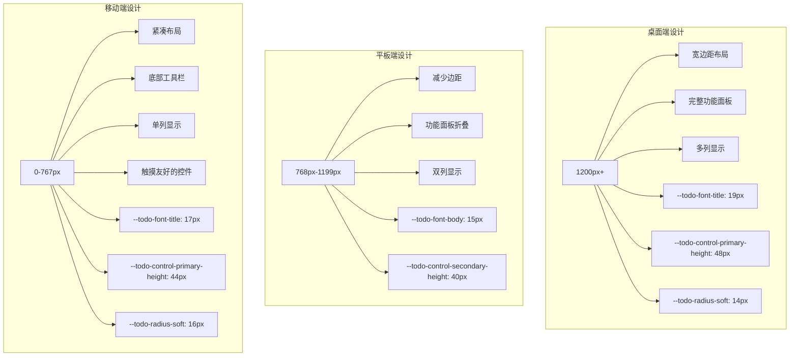

**图表来源**
- [base.css:73-88](file://apps/frontend/src/styles/base.css#L73-L88)
- [TodoItem.vue](file://apps/frontend/src/features/todo/components/TodoItem.vue#L269)
- [ui.css:80-89](file://apps/frontend/src/styles/ui.css#L80-L89)

### 字体和排版系统

系统使用了精心选择的字体组合来确保良好的可读性，并引入了专门的 Typography 系统：

| 字体类别 | 字体名称 | 使用场景 | 字重范围 | 响应式调整 |
|---------|----------|----------|----------|------------|
| 主字体 | LXGW WenKai Screen | 标题和正文 | 300-700 | 移动端降级 |
| 等宽字体 | JetBrains Mono | 代码和等宽内容 | 400-700 | 固定字号 |
| 备用字体 | 系统默认字体 | 兼容性支持 | 自适应 | 自适应 |

**Typography 变量系统**：

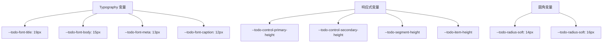

**图表来源**
- [base.css:1-4](file://apps/frontend/src/styles/base.css#L1-L4)
- [TodoList.vue:155-162](file://apps/frontend/src/features/todo/components/TodoList.vue#L155-L162)
- [ui.css:80-89](file://apps/frontend/src/styles/ui.css#L80-L89)

**章节来源**
- [base.css:1-4](file://apps/frontend/src/styles/base.css#L1-L4)
- [TodoList.vue:155-162](file://apps/frontend/src/features/todo/components/TodoList.vue#L155-L162)
- [ui.css:80-89](file://apps/frontend/src/styles/ui.css#L80-L89)

## 性能优化策略

### 渲染优化技术

系统采用了多种性能优化技术来确保流畅的用户体验：

1. **虚拟滚动**：对于大量数据的场景，使用虚拟滚动技术只渲染可见区域
2. **懒加载组件**：子任务组件按需加载，减少初始渲染负担
3. **防抖处理**：搜索和过滤操作使用防抖技术避免频繁重渲染
4. **内存管理**：及时清理事件监听器和定时器，防止内存泄漏
5. **CSS 变量缓存**：使用 CSS 变量减少重复计算
6. **硬件加速**：合理使用 will-change 和 transform 属性

### 样式优化策略

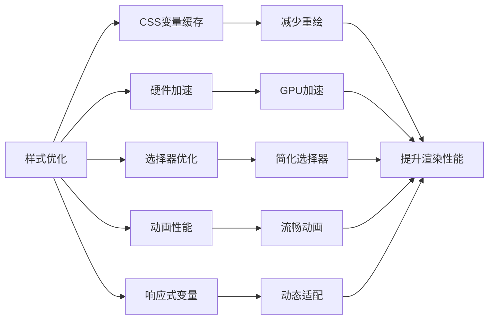

**图表来源**
- [theme.css:144-149](file://apps/frontend/src/styles/theme.css#L144-L149)
- [base.css:73-88](file://apps/frontend/src/styles/base.css#L73-L88)
- [theme.css:152-160](file://apps/frontend/src/styles/theme.css#L152-L160)

**章节来源**
- [utils.ts:5-7](file://apps/frontend/src/lib/utils.ts#L5-L7)
- [theme.css:143-169](file://apps/frontend/src/styles/theme.css#L143-L169)

## 故障排除指南

### 常见问题诊断

| 问题类型 | 症状描述 | 可能原因 | 解决方案 |
|---------|----------|----------|----------|
| 样式不生效 | 组件样式异常 | CSS 优先级问题 | 检查样式覆盖和 !important 使用 |
| 动画卡顿 | 过渡效果不流畅 | GPU 加速未启用 | 添加 will-change 属性 |
| 响应速度慢 | 用户交互延迟 | 重绘过多 | 优化选择器和减少 DOM 操作 |
| 主题切换失败 | 明暗模式不工作 | CSS 变量未正确设置 | 检查 :root 和 .dark 类的定义 |
| 响应式失效 | 移动端显示异常 | 媒体查询问题 | 检查断点和变量值 |
| 字体显示异常 | 字体加载失败 | 网络或缓存问题 | 检查 CDN 连接和缓存 |

### 调试技巧

1. **开发者工具检查**：使用浏览器开发者工具检查元素的实际样式
2. **性能分析**：利用 Chrome DevTools 的 Performance 面板分析渲染性能
3. **网络监控**：检查字体和资源文件的加载情况
4. **控制台日志**：添加必要的日志输出来跟踪状态变化
5. **CSS 变量调试**：使用开发者工具检查 CSS 变量的实际值

**章节来源**
- [utils.ts:12-32](file://apps/frontend/src/lib/utils.ts#L12-L32)
- [colors.ts:11-14](file://apps/frontend/src/lib/colors.ts#L11-L14)

## 总结

这个任务列表样式系统展现了现代前端开发的最佳实践，通过精心设计的组件架构、灵活的样式系统和完善的交互体验，为用户提供了优秀的任务管理体验。

### 核心优势

1. **模块化设计**：清晰的组件分离和职责划分
2. **主题化支持**：完整的明暗模式和可定制主题
3. **性能优化**：多项性能优化技术和最佳实践
4. **响应式布局**：适配各种设备尺寸的设计方案
5. **无障碍访问**：完整的键盘导航和屏幕阅读器支持
6. **Typography 系统**：专门的字体排版变量系统
7. **组件化 Tabs**：可复用的标签页组件系统

### 技术亮点

- 基于 CSS 变量的主题系统，支持动态主题切换
- Vue 3 Composition API 的现代化开发模式
- Tailwind CSS 实现的原子化样式设计
- 硬件加速的动画效果优化
- 完整的 TypeScript 类型支持
- 响应式 Typography 变量系统
- 智能的自然语言日期解析
- 完善的错误状态管理和用户反馈

这个系统为类似的任务管理应用提供了一个优秀的参考实现，展示了如何在保证功能完整性的同时，实现高质量的用户体验和代码可维护性。