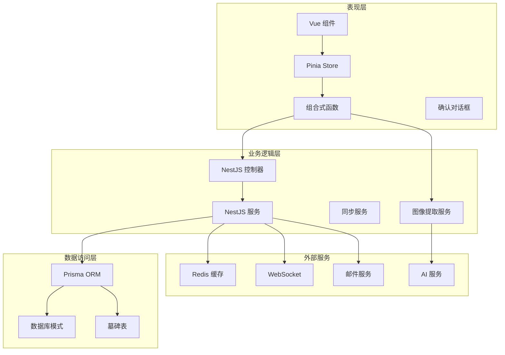
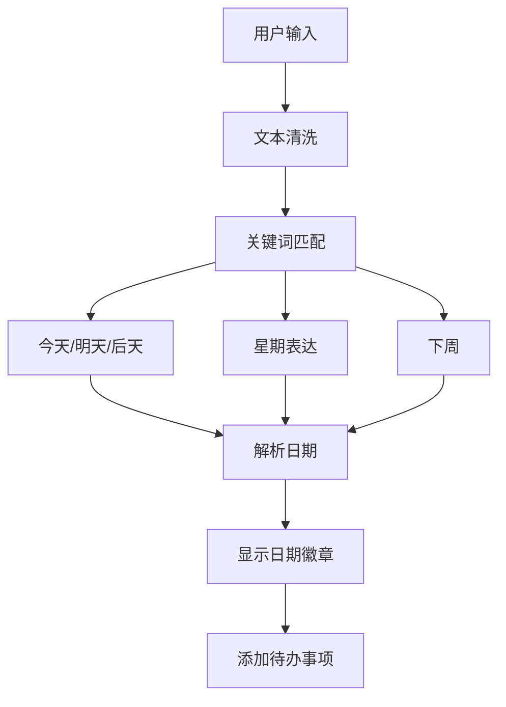
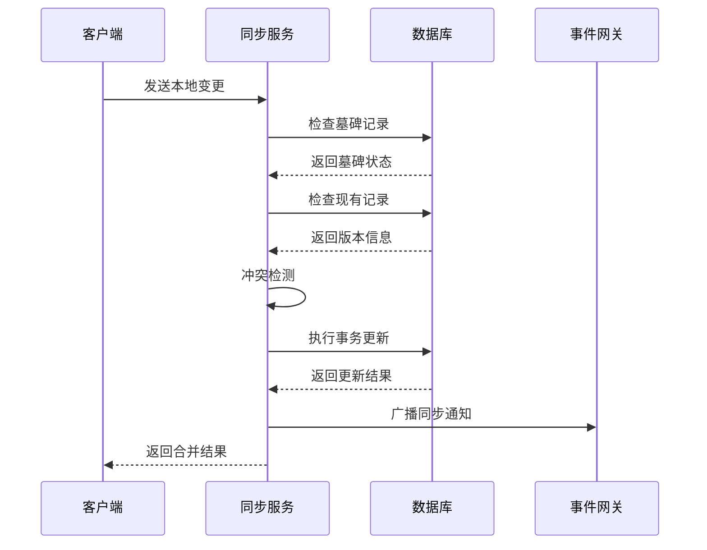
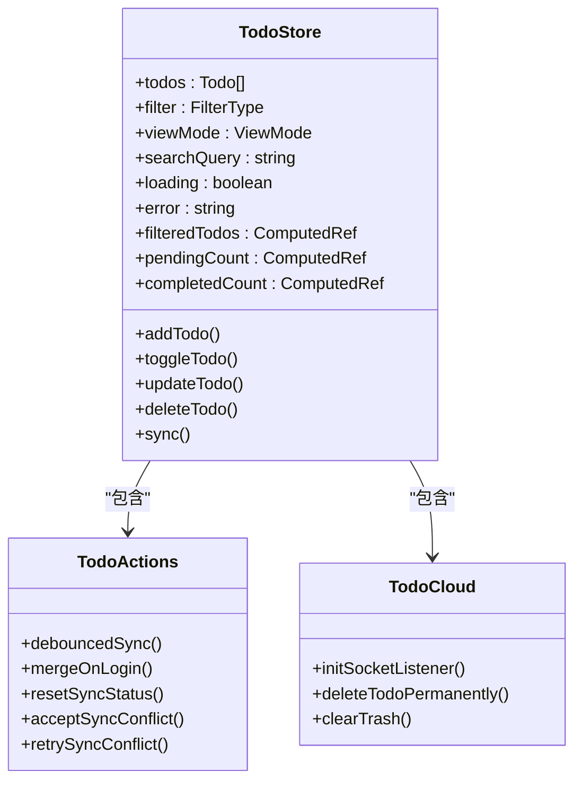
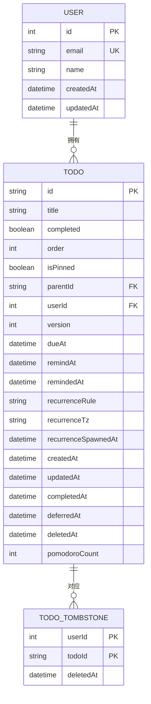
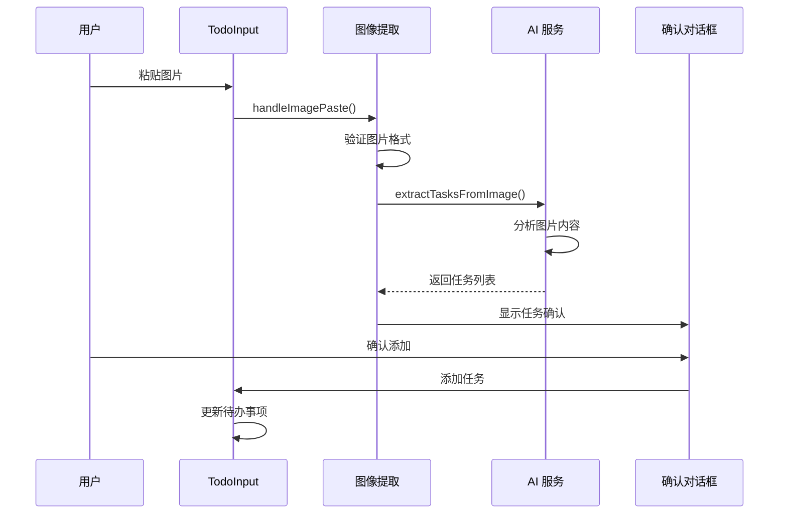

# Todo 输入增强

<cite>
**本文档引用的文件**
- [apps/backend/src/app.module.ts](file://apps/backend/src/app.module.ts)
- [apps/backend/src/todos/todos.module.ts](file://apps/backend/src/todos/todos.module.ts)
- [apps/backend/src/todos/todos.controller.ts](file://apps/backend/src/todos/todos.controller.ts)
- [apps/backend/src/todos/todos.service.ts](file://apps/backend/src/todos/todos.service.ts)
- [apps/backend/src/todos/todos-sync.service.ts](file://apps/backend/src/todos/todos-sync.service.ts)
- [apps/backend/src/todos/todos.dto.ts](file://apps/backend/src/todos/todos.dto.ts)
- [apps/backend/prisma/schema/todo.prisma](file://apps/backend/prisma/schema/todo.prisma)
- [apps/frontend/src/App.vue](file://apps/frontend/src/App.vue)
- [apps/frontend/src/features/todo/TodoView.vue](file://apps/frontend/src/features/todo/TodoView.vue)
- [apps/frontend/src/features/todo/stores/todo.store.ts](file://apps/frontend/src/features/todo/stores/todo.store.ts)
- [apps/frontend/src/features/todo/composables/useTodo.ts](file://apps/frontend/src/features/todo/composables/useTodo.ts)
- [apps/frontend/src/features/todo/components/TodoInput.vue](file://apps/frontend/src/features/todo/components/TodoInput.vue)
- [apps/frontend/src/features/todo/composables/useImageTaskExtraction.ts](file://apps/frontend/src/features/todo/composables/useImageTaskExtraction.ts)
- [apps/frontend/src/features/todo/components/TodoImageTaskConfirmDialog.vue](file://apps/frontend/src/features/todo/components/TodoImageTaskConfirmDialog.vue)
- [apps/frontend/src/features/ai/services/imageTaskExtraction.ts](file://apps/frontend/src/features/ai/services/imageTaskExtraction.ts)
- [apps/frontend/package.json](file://apps/frontend/package.json)
- [packages/shared/src/index.ts](file://packages/shared/src/index.ts)
</cite>

## 更新摘要
**变更内容**
- 新增图像粘贴事件处理功能，增强 TodoInput 组件
- 添加 preventDefault 阻止浏览器默认粘贴行为
- 实现完整的图像任务提取工作流程
- 集成 AI 服务进行智能任务解析

## 目录
1. [简介](#简介)
2. [项目结构](#项目结构)
3. [核心组件](#核心组件)
4. [架构概览](#架构概览)
5. [详细组件分析](#详细组件分析)
6. [图像粘贴增强功能](#图像粘贴增强功能)
7. [依赖关系分析](#依赖关系分析)
8. [性能考虑](#性能考虑)
9. [故障排除指南](#故障排除指南)
10. [结论](#结论)

## 简介

Todo 输入增强是一个基于 Vue 3 和 NestJS 构建的现代化待办事项管理应用。该系统专注于提供卓越的用户体验，特别是在待办事项输入方面进行了深度优化。应用支持多平台部署（Web、Android、iOS、桌面应用），具备实时同步、智能日期解析、图像任务提取、AI 助手集成等功能。

**更新** 本次更新重点增强了 TodoInput 组件的图像粘贴处理能力，通过阻止浏览器默认粘贴行为并集成 AI 服务，实现了从图片中智能提取待办事项的功能。

## 项目结构

该项目采用 Monorepo 架构，包含前端、后端、共享包等多个子项目：

```mermaid
graph TB
subgraph "应用层"
FE[前端应用<br/>Vue 3 + TypeScript]
BE[后端服务<br/>NestJS + TypeScript]
WAILS[桌面应用<br/>Wails]
end
subgraph "共享层"
SHARED[共享包<br/>@lumina/shared]
DTO[Zod 数据验证模型]
UTILS[工具函数]
end
subgraph "基础设施"
DB[(数据库<br/>PostgreSQL)]
REDIS[(缓存<br/>Redis)]
WS[WebSocket<br/>实时通信]
end
FE --> BE
WAILS --> BE
BE --> DB
BE --> REDIS
BE --> WS
FE --> SHARED
BE --> SHARED
```

**图表来源**
- [apps/backend/src/app.module.ts:28-155](file://apps/backend/src/app.module.ts#L28-L155)
- [apps/frontend/package.json:31-71](file://apps/frontend/package.json#L31-L71)

**章节来源**
- [apps/backend/src/app.module.ts:1-160](file://apps/backend/src/app.module.ts#L1-L160)
- [apps/frontend/package.json:1-105](file://apps/frontend/package.json#L1-L105)

## 核心组件

### 前端 Todo 系统

前端 Todo 系统由多个精心设计的组件构成，提供流畅的用户体验：

- **TodoView**: 主视图容器，管理整体布局和状态
- **TodoInput**: 增强的输入组件，支持智能日期解析和图像粘贴
- **TodoList**: 待办事项列表展示
- **TodoFilter**: 过滤和搜索功能
- **TodoStore**: Pinia 状态管理

### 后端 Todo 服务

后端提供完整的待办事项管理服务：

- **TodosController**: REST API 控制器
- **TodosService**: 基础 CRUD 操作
- **TodoSyncService**: 增量同步和冲突解决
- **Prisma Schema**: 数据库模型定义

**章节来源**
- [apps/frontend/src/features/todo/TodoView.vue:1-504](file://apps/frontend/src/features/todo/TodoView.vue#L1-L504)
- [apps/backend/src/todos/todos.controller.ts:1-70](file://apps/backend/src/todos/todos.controller.ts#L1-L70)

## 架构概览

系统采用分层架构设计，确保关注点分离和可维护性：



**图表来源**
- [apps/backend/src/app.module.ts:134-146](file://apps/backend/src/app.module.ts#L134-L146)
- [apps/backend/src/todos/todos.module.ts:8-14](file://apps/backend/src/todos/todos.module.ts#L8-L14)

## 详细组件分析

### Todo 输入组件增强

Todo 输入组件是整个系统的核心增强点，提供了多项智能化功能：

#### 智能日期解析

组件内置了自然语言日期解析功能，支持多种语言表达：



**图表来源**
- [apps/frontend/src/features/todo/components/TodoInput.vue:30-73](file://apps/frontend/src/features/todo/components/TodoInput.vue#L30-L73)

#### 输入增强特性

- **自动聚焦**: 非移动端自动聚焦输入框
- **实时验证**: 实时错误提示和样式反馈
- **日期徽章**: 智能识别并显示解析的日期
- **国际化支持**: 多语言日期表达支持

**章节来源**
- [apps/frontend/src/features/todo/components/TodoInput.vue:1-154](file://apps/frontend/src/features/todo/components/TodoInput.vue#L1-L154)

### 同步机制

系统实现了复杂的增量同步机制，确保多设备间的数据一致性：



**图表来源**
- [apps/backend/src/todos/todos-sync.service.ts:52-224](file://apps/backend/src/todos/todos-sync.service.ts#L52-L224)

#### 冲突解决策略

系统采用严格的版本控制机制解决同步冲突：

- **版本比较**: 基于版本号的精确冲突检测
- **墓碑机制**: 处理已删除项目的同步
- **所有者验证**: 确保数据所有权安全
- **递归规则**: 支持重复任务的智能处理

**章节来源**
- [apps/backend/src/todos/todos-sync.service.ts:35-47](file://apps/backend/src/todos/todos-sync.service.ts#L35-L47)

### 状态管理系统

Todo 状态管理采用 Pinia 架构，提供响应式和持久化的状态存储：



**图表来源**
- [apps/frontend/src/features/todo/stores/todo.store.ts:21-341](file://apps/frontend/src/features/todo/stores/todo.store.ts#L21-L341)

**章节来源**
- [apps/frontend/src/features/todo/stores/todo.store.ts:1-362](file://apps/frontend/src/features/todo/stores/todo.store.ts#L1-L362)

### 数据模型

系统使用 Prisma ORM 管理数据模型，支持复杂的关系和索引：



**图表来源**
- [apps/backend/prisma/schema/todo.prisma:1-40](file://apps/backend/prisma/schema/todo.prisma#L1-L40)

**章节来源**
- [apps/backend/prisma/schema/todo.prisma:1-40](file://apps/backend/prisma/schema/todo.prisma#L1-L40)

## 图像粘贴增强功能

**新增** 本次更新最重要的功能增强是 TodoInput 组件的图像粘贴处理能力。

### 图像粘贴事件处理

TodoInput 组件现在能够处理剪贴板中的图像数据，并阻止浏览器的默认粘贴行为：

```mermaid
flowchart TD
PASTE[用户粘贴图片] --> EVENT[ClipboardEvent 触发]
EVENT --> CHECK[检查剪贴板数据]
CHECK --> IMAGE_FOUND{找到图片?}
IMAGE_FOUND --> |否| DEFAULT[执行默认粘贴]
IMAGE_FOUND --> |是| PREVENT[event.preventDefault()]
PREVENT --> CONVERT[转换为 base64]
CONVERT --> VALIDATE[验证图片大小]
VALIDATE --> SIZE_OK{大小合法?}
SIZE_OK --> |否| ERROR[显示错误提示]
SIZE_OK --> |是| EXTRACT[开始任务提取]
EXTRACT --> DIALOG[显示确认对话框]
DIALOG --> CONFIRM[用户确认]
CONFIRM --> ADD[添加任务到列表]
```

**图表来源**
- [apps/frontend/src/features/todo/composables/useImageTaskExtraction.ts:30-63](file://apps/frontend/src/features/todo/composables/useImageTaskExtraction.ts#L30-L63)

### 完整工作流程

1. **事件监听**: TodoInput 组件监听 `@paste` 事件
2. **数据提取**: 从 ClipboardEvent 中提取图片文件
3. **默认行为阻止**: 调用 `event.preventDefault()` 阻止浏览器默认粘贴
4. **格式转换**: 将图片文件转换为 base64 编码
5. **大小验证**: 检查图片大小是否超过限制（默认 10MB）
6. **AI 任务提取**: 调用 AI 服务从图片中提取待办事项
7. **用户确认**: 通过对话框让用户确认提取的任务
8. **批量添加**: 将确认的任务批量添加到待办事项列表

### AI 任务提取服务

系统集成了强大的 AI 服务来解析图片中的任务：



**图表来源**
- [apps/frontend/src/features/todo/composables/useImageTaskExtraction.ts:82-102](file://apps/frontend/src/features/todo/composables/useImageTaskExtraction.ts#L82-L102)

### 确认对话框功能

用户可以通过对话框对提取的任务进行编辑和确认：

- **任务列表**: 显示从图片中提取的所有任务
- **编辑功能**: 允许用户修改、删除或添加新的任务
- **批量操作**: 支持一次性确认多个任务
- **错误处理**: 显示提取过程中的任何错误信息

**章节来源**
- [apps/frontend/src/features/todo/components/TodoInput.vue:105](file://apps/frontend/src/features/todo/components/TodoInput.vue#L105)
- [apps/frontend/src/features/todo/composables/useImageTaskExtraction.ts:30-63](file://apps/frontend/src/features/todo/composables/useImageTaskExtraction.ts#L30-L63)
- [apps/frontend/src/features/todo/components/TodoImageTaskConfirmDialog.vue:1-208](file://apps/frontend/src/features/todo/components/TodoImageTaskConfirmDialog.vue#L1-L208)

## 依赖关系分析

系统依赖关系清晰，模块间耦合度低：

```mermaid
graph LR
subgraph "前端依赖"
VUE[Vue 3]
PINIA[Pinia]
GSAP[G.S.A.P]
SOCKET[Socket.IO]
ZOD[Zod]
AI[AI 服务]
END
subgraph "后端依赖"
NEST[NestJS]
PRISMA[Prisma]
BULLMQ[BullMQ]
I18N[NestJS I18n]
JWT[JWT]
end
subgraph "共享依赖"
SHARED[@lumina/shared]
DTO[Zod DTO]
UTILS[工具函数]
end
VUE --> SHARED
NEST --> SHARED
SHARED --> DTO
SHARED --> UTILS
AI --> VUE
```

**图表来源**
- [apps/frontend/package.json:31-71](file://apps/frontend/package.json#L31-L71)
- [apps/backend/src/app.module.ts:134-146](file://apps/backend/src/app.module.ts#L134-L146)

**章节来源**
- [apps/frontend/package.json:1-105](file://apps/frontend/package.json#L1-L105)
- [apps/backend/src/app.module.ts:1-160](file://apps/backend/src/app.module.ts#L1-L160)

## 性能考虑

系统在多个层面进行了性能优化：

### 前端性能优化

- **组件懒加载**: 使用 `defineAsyncComponent` 实现按需加载
- **动画优化**: GSAP 硬件加速动画
- **状态持久化**: Pinia 持久化减少重新计算
- **虚拟滚动**: 大列表的高效渲染
- **事件防抖**: 图像粘贴处理的异步操作优化

### 后端性能优化

- **数据库索引**: 多字段复合索引优化查询
- **事务批量处理**: 减少数据库往返次数
- **缓存策略**: Redis 缓存热点数据
- **队列处理**: 异步任务处理

### 图像处理性能

- **文件大小限制**: 默认 10MB 限制防止内存溢出
- **Base64 编码优化**: 高效的图片编码和解码
- **AI 服务调用**: 异步处理避免阻塞主线程

## 故障排除指南

### 常见问题

1. **同步冲突**: 检查版本号和冲突原因
2. **输入验证错误**: 查看 Zod 验证错误信息
3. **WebSocket 连接**: 确认连接状态和重连机制
4. **图像提取失败**: 检查图片格式和网络连接
5. **AI 服务错误**: 验证 API 密钥和配置

### 调试技巧

- 使用浏览器开发者工具监控网络请求
- 在后端启用详细日志记录
- 利用 Socket.IO 调试工具
- 检查数据库查询性能
- 监控 AI 服务的响应时间

**章节来源**
- [apps/frontend/src/features/todo/composables/useTodo.ts:26-40](file://apps/frontend/src/features/todo/composables/useTodo.ts#L26-L40)

## 结论

Todo 输入增强项目展现了现代全栈应用的最佳实践。通过精心设计的架构、智能化的功能特性和优秀的用户体验，该系统为用户提供了高效、可靠的待办事项管理解决方案。

**更新** 本次更新特别增强了 TodoInput 组件的图像粘贴处理能力，通过阻止浏览器默认行为并集成 AI 服务，实现了从图片中智能提取待办事项的功能。这一增强不仅提升了用户的输入体验，还展示了现代 Web 应用中 AI 技术的实际应用场景。

系统的模块化设计和清晰的依赖关系使其具有良好的可维护性和扩展性，为未来的功能扩展奠定了坚实的基础。图像粘贴功能的成功集成证明了该架构能够灵活地支持新技术和新功能的添加。