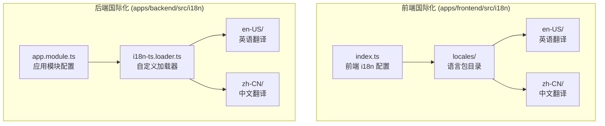
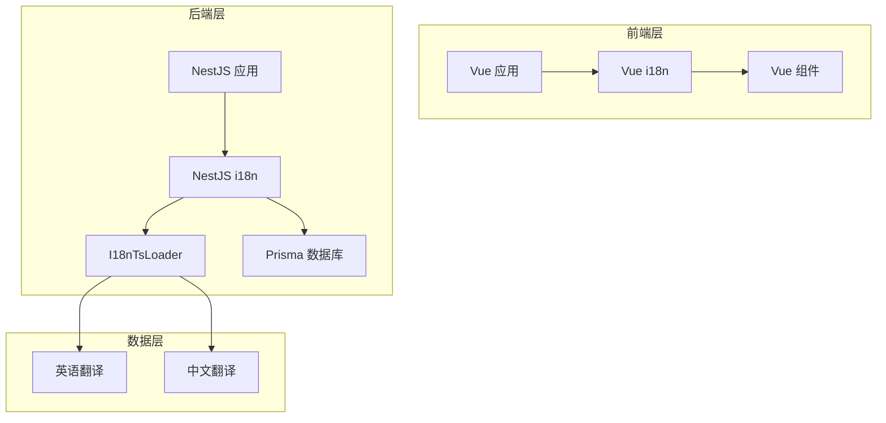
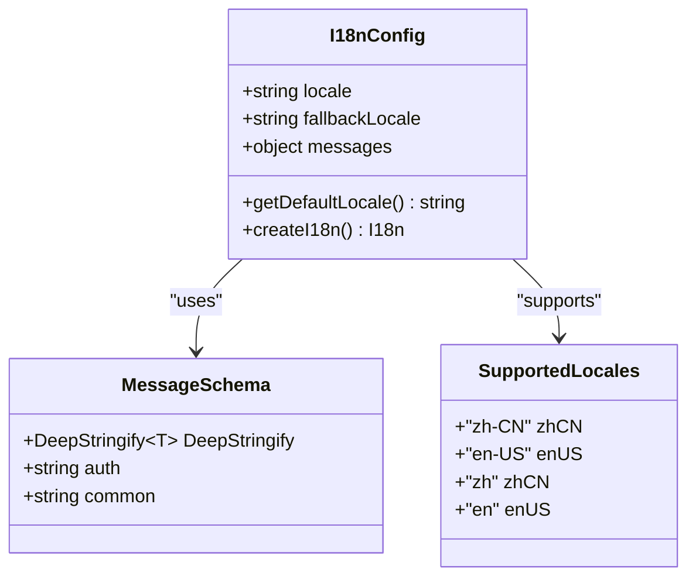
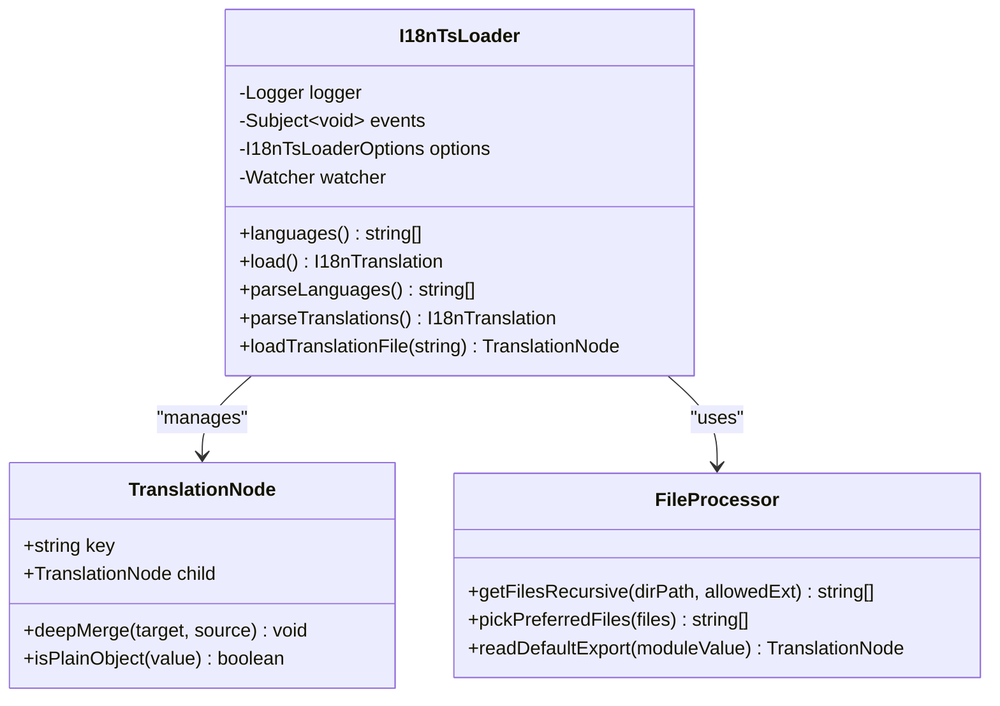
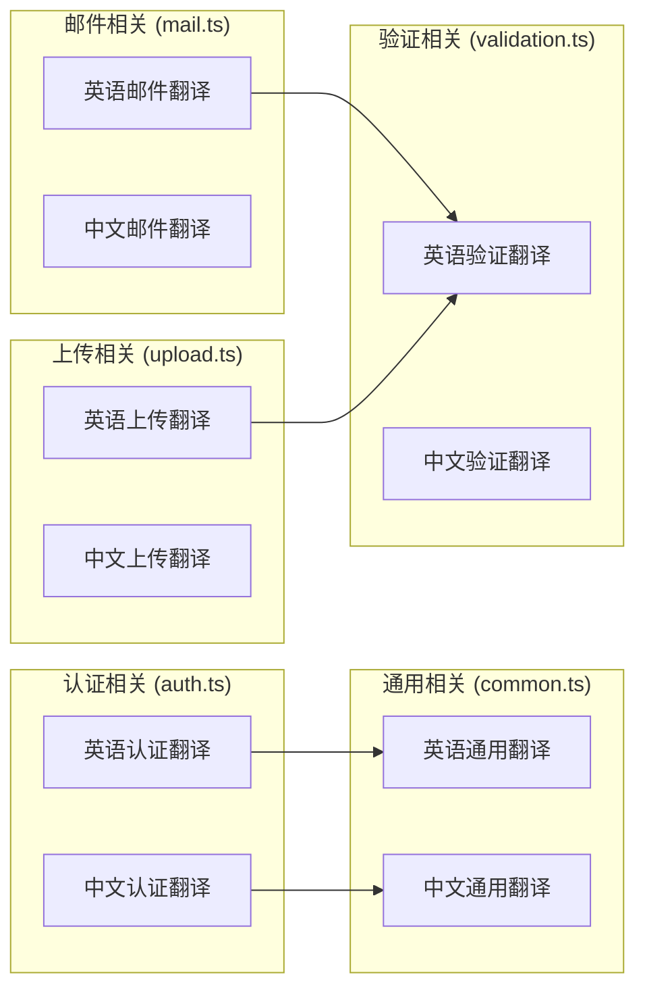
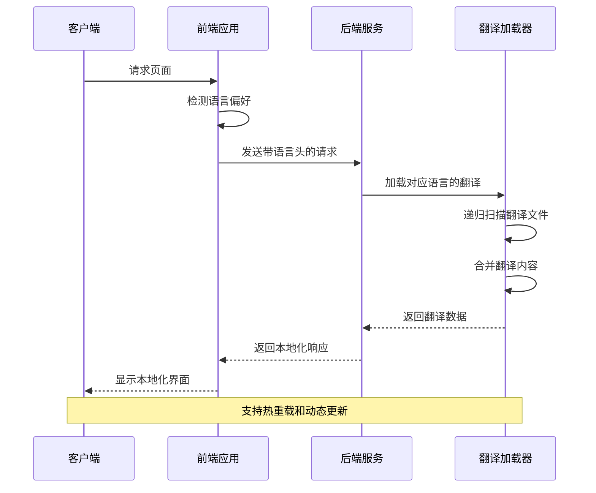
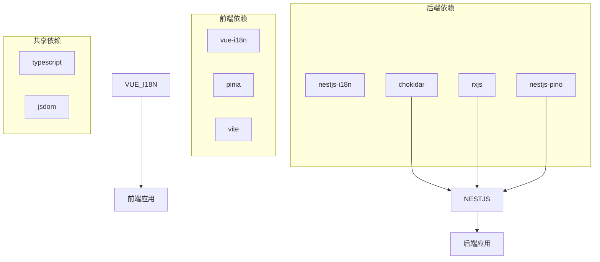

# Todo Store 国际化

<cite>
**本文档引用的文件**
- [apps/backend/src/i18n/i18n-ts.loader.ts](file://apps/backend/src/i18n/i18n-ts.loader.ts)
- [apps/backend/src/i18n/en-US/auth.ts](file://apps/backend/src/i18n/en-US/auth.ts)
- [apps/backend/src/i18n/zh-CN/auth.ts](file://apps/backend/src/i18n/zh-CN/auth.ts)
- [apps/backend/src/i18n/en-US/common.ts](file://apps/backend/src/i18n/en-US/common.ts)
- [apps/backend/src/app.module.ts](file://apps/backend/src/app.module.ts)
- [apps/frontend/src/i18n/index.ts](file://apps/frontend/src/i18n/index.ts)
- [apps/frontend/src/i18n/locales/en-US/auth.ts](file://apps/frontend/src/i18n/locales/en-US/auth.ts)
- [apps/frontend/src/i18n/locales/zh-CN/auth.ts](file://apps/frontend/src/i18n/locales/zh-CN/auth.ts)
- [apps/frontend/src/i18n/locales/en-US/common.ts](file://apps/frontend/src/i18n/locales/en-US/common.ts)
- [apps/frontend/src/main.ts](file://apps/frontend/src/main.ts)
</cite>

## 目录
1. [简介](#简介)
2. [项目结构](#项目结构)
3. [核心组件](#核心组件)
4. [架构概览](#架构概览)
5. [详细组件分析](#详细组件分析)
6. [依赖关系分析](#依赖关系分析)
7. [性能考虑](#性能考虑)
8. [故障排除指南](#故障排除指南)
9. [结论](#结论)

## 简介

Todo Store 国际化系统是一个完整的多语言支持解决方案，涵盖了前后端的国际化需求。该系统实现了从基础的翻译键值对管理到复杂的动态加载机制，支持中英文双语环境，并具备热重载功能。

系统采用模块化设计，前端使用 Vue i18n 进行界面文本国际化，后端使用 NestJS i18n 结合自定义的 TypeScript 加载器实现服务端翻译管理。整个系统支持运行时语言切换、动态翻译加载和错误处理机制。

## 项目结构

国际化系统在项目中的组织结构如下：

**图表来源**
- [apps/frontend/src/i18n/index.ts:1-37](file://apps/frontend/src/i18n/index.ts#L1-L37)
- [apps/backend/src/app.module.ts:124-133](file://apps/backend/src/app.module.ts#L124-L133)

**章节来源**
- [apps/frontend/src/i18n/index.ts:1-37](file://apps/frontend/src/i18n/index.ts#L1-L37)
- [apps/backend/src/app.module.ts:124-133](file://apps/backend/src/app.module.ts#L124-L133)

## 核心组件

### 前端国际化组件

前端国际化系统基于 Vue i18n 实现，主要包含以下核心组件：

1. **i18n 配置模块**：负责初始化和配置国际化功能
2. **语言包管理**：支持中英文双语翻译
3. **类型安全**：通过深度字符串化确保类型安全

### 后端国际化组件

后端国际化系统基于 NestJS i18n 实现，主要包含以下核心组件：

1. **自定义加载器**：I18nTsLoader 类实现 TypeScript 文件的动态加载
2. **翻译文件管理**：按模块分类的翻译文件组织
3. **热重载机制**：支持开发环境下的实时翻译更新

**章节来源**
- [apps/frontend/src/i18n/index.ts:24-34](file://apps/frontend/src/i18n/index.ts#L24-L34)
- [apps/backend/src/i18n/i18n-ts.loader.ts:86-102](file://apps/backend/src/i18n/i18n-ts.loader.ts#L86-L102)

## 架构概览

国际化系统的整体架构采用分层设计，前后端分离实现：

**图表来源**
- [apps/frontend/src/main.ts:28-131](file://apps/frontend/src/main.ts#L28-L131)
- [apps/backend/src/app.module.ts:124-133](file://apps/backend/src/app.module.ts#L124-L133)

## 详细组件分析

### 前端 i18n 配置分析

前端国际化配置实现了智能的语言检测和类型安全机制：

**图表来源**
- [apps/frontend/src/i18n/index.ts:6-34](file://apps/frontend/src/i18n/index.ts#L6-L34)

前端配置的关键特性包括：

1. **智能语言检测**：优先使用本地存储的语言设置，其次使用浏览器语言
2. **类型安全**：通过深度字符串化确保翻译键值的类型正确性
3. **多语言支持**：同时支持完整语言代码和简写形式

**章节来源**
- [apps/frontend/src/i18n/index.ts:12-34](file://apps/frontend/src/i18n/index.ts#L12-L34)

### 后端 I18nTsLoader 分析

后端自定义加载器实现了复杂的文件处理和合并逻辑：

**图表来源**
- [apps/backend/src/i18n/i18n-ts.loader.ts:86-184](file://apps/backend/src/i18n/i18n-ts.loader.ts#L86-L184)

加载器的核心功能包括：

1. **递归文件扫描**：遍历指定目录下的所有 TypeScript 和 JavaScript 文件
2. **文件优先级处理**：优先选择源文件而非编译后的 JavaScript 文件
3. **深度合并机制**：将多个翻译文件的内容进行深度合并
4. **热重载支持**：使用 chokidar 监控文件变化并触发重新加载

**章节来源**
- [apps/backend/src/i18n/i18n-ts.loader.ts:146-183](file://apps/backend/src/i18n/i18n-ts.loader.ts#L146-L183)

### 翻译文件结构分析

翻译文件采用模块化组织方式，按功能领域进行分类：

**图表来源**
- [apps/backend/src/i18n/en-US/auth.ts:1-16](file://apps/backend/src/i18n/en-US/auth.ts#L1-L16)
- [apps/backend/src/i18n/zh-CN/auth.ts:1-16](file://apps/backend/src/i18n/zh-CN/auth.ts#L1-L16)

**章节来源**
- [apps/backend/src/i18n/en-US/auth.ts:1-16](file://apps/backend/src/i18n/en-US/auth.ts#L1-L16)
- [apps/backend/src/i18n/zh-CN/auth.ts:1-16](file://apps/backend/src/i18n/zh-CN/auth.ts#L1-L16)

### 国际化流程分析

国际化系统的工作流程如下：

**图表来源**
- [apps/frontend/src/main.ts:28-131](file://apps/frontend/src/main.ts#L28-L131)
- [apps/backend/src/app.module.ts:124-133](file://apps/backend/src/app.module.ts#L124-L133)

**章节来源**
- [apps/frontend/src/main.ts:28-131](file://apps/frontend/src/main.ts#L28-L131)
- [apps/backend/src/app.module.ts:124-133](file://apps/backend/src/app.module.ts#L124-L133)

## 依赖关系分析

国际化系统的依赖关系呈现清晰的层次结构：

**图表来源**
- [apps/frontend/src/main.ts:10-29](file://apps/frontend/src/main.ts#L10-L29)
- [apps/backend/src/app.module.ts:8-10](file://apps/backend/src/app.module.ts#L8-L10)

**章节来源**
- [apps/frontend/src/main.ts:10-29](file://apps/frontend/src/main.ts#L10-L29)
- [apps/backend/src/app.module.ts:8-10](file://apps/backend/src/app.module.ts#L8-L10)

## 性能考虑

国际化系统在性能方面采用了多项优化策略：

1. **懒加载机制**：翻译文件按需加载，减少初始启动时间
2. **缓存策略**：利用 Node.js 的模块缓存机制避免重复加载
3. **热重载优化**：仅在开发环境下启用文件监控，生产环境关闭监控以提升性能
4. **类型预编译**：前端使用 TypeScript 编译时类型检查，运行时无需额外开销

## 故障排除指南

### 常见问题及解决方案

1. **翻译文件加载失败**
   - 检查文件路径是否正确
   - 确认文件扩展名符合要求（.ts 或 .js）
   - 验证导出格式是否为默认导出

2. **语言切换不生效**
   - 确认浏览器语言设置
   - 检查本地存储的语言偏好设置
   - 验证 i18n 配置中的回退语言设置

3. **热重载失效**
   - 确认开发模式下启用了文件监控
   - 检查 chokidar 依赖是否正确安装
   - 验证文件权限设置

**章节来源**
- [apps/backend/src/i18n/i18n-ts.loader.ts:152-155](file://apps/backend/src/i18n/i18n-ts.loader.ts#L152-L155)

## 结论

Todo Store 国际化系统展现了现代全栈应用的国际化最佳实践。系统通过前后端分离的设计，实现了灵活且高效的多语言支持。前端使用 Vue i18n 提供了完善的类型安全和用户体验，后端通过自定义的 I18nTsLoader 实现了强大的动态加载能力。

该系统的主要优势包括：

1. **模块化设计**：翻译文件按功能领域组织，便于维护和扩展
2. **类型安全**：前后端都实现了严格的类型检查
3. **热重载支持**：开发体验良好，支持实时更新
4. **性能优化**：采用多种优化策略确保运行效率
5. **错误处理**：完善的错误处理和回退机制

未来可以考虑的功能增强包括：支持更多语言、实现翻译文件的在线编辑、添加翻译进度跟踪等功能。