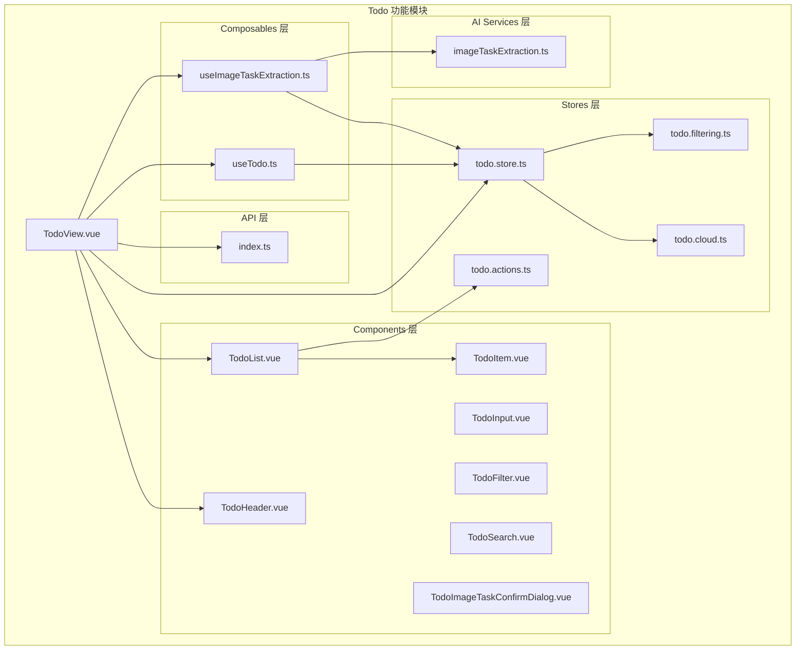
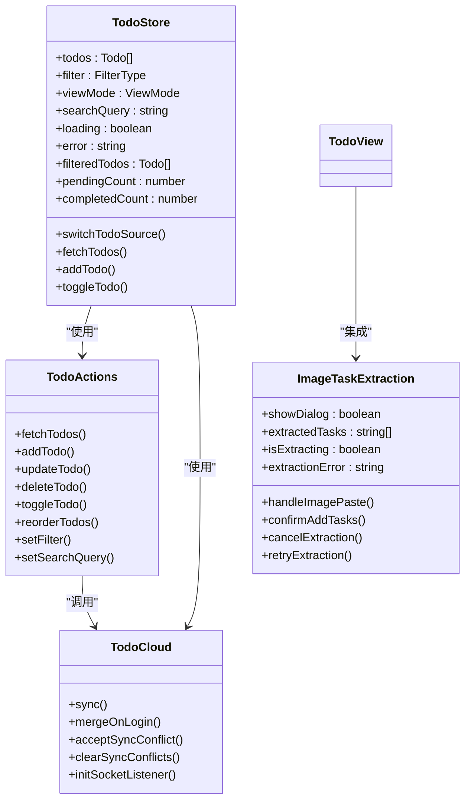
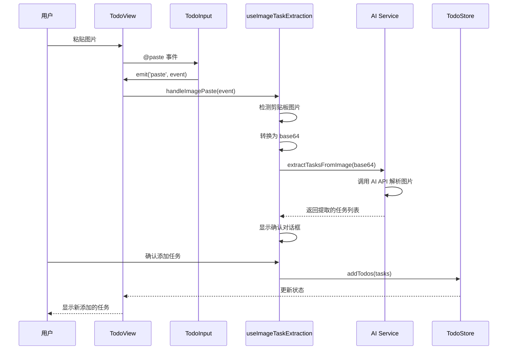
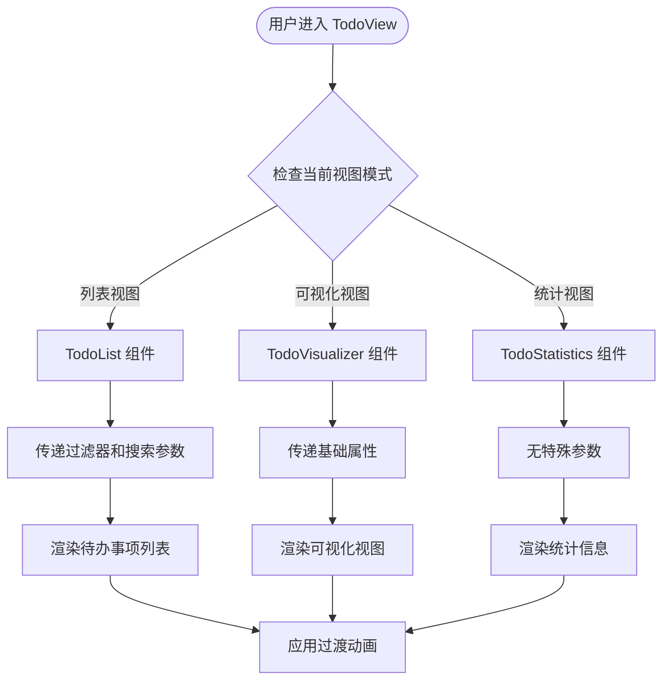
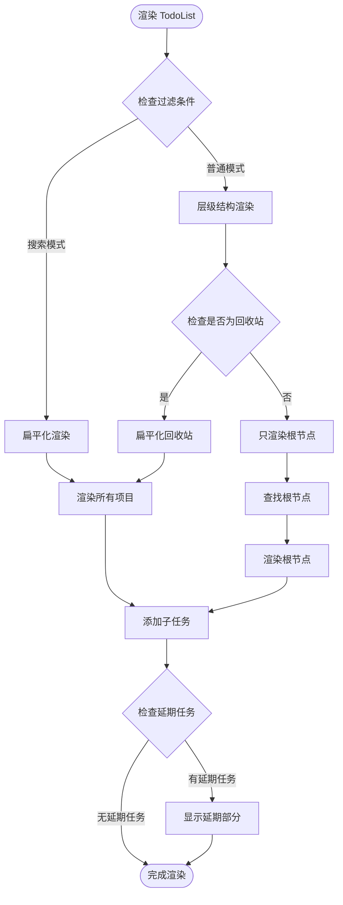
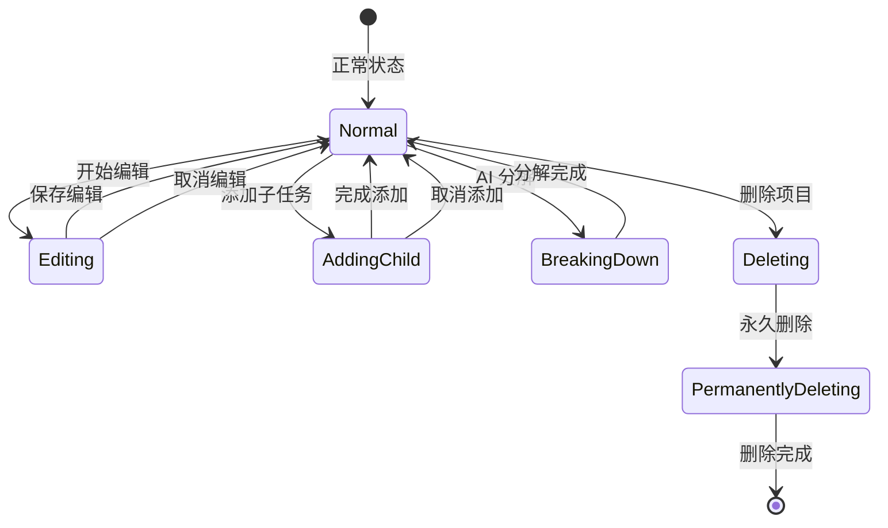
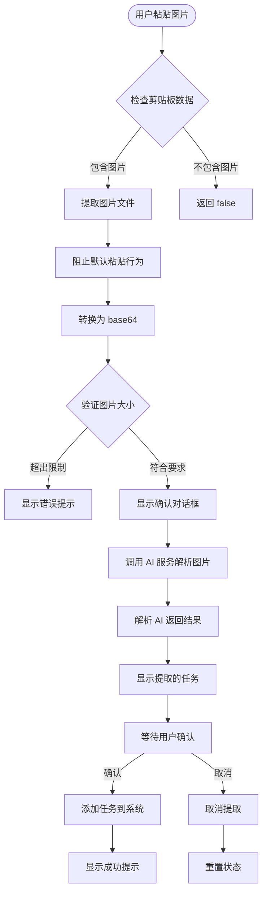
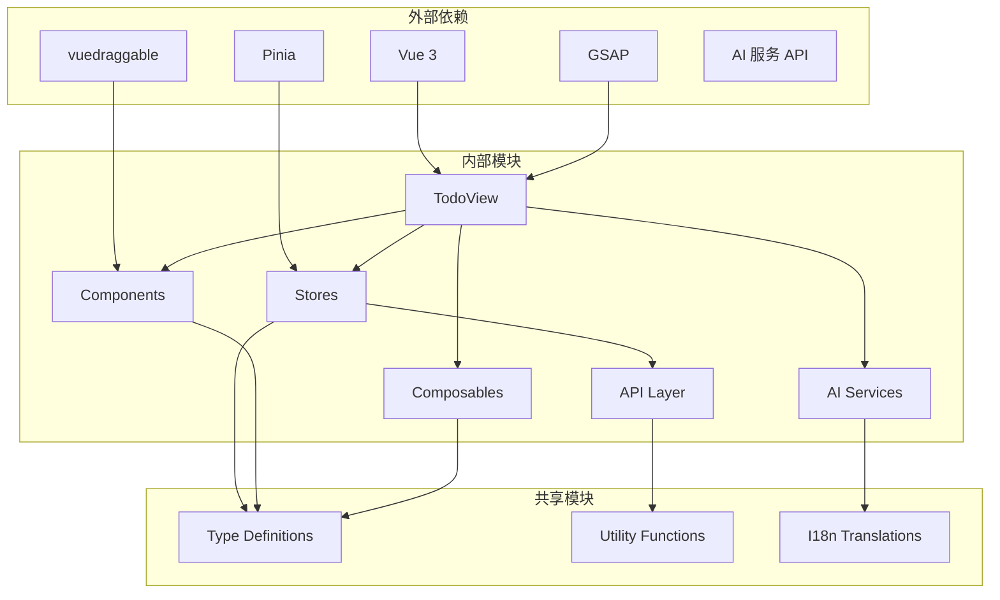

# Todo View 集成

<cite>
**本文档引用的文件**
- [TodoView.vue](file://apps/frontend/src/features/todo/TodoView.vue)
- [todo.store.ts](file://apps/frontend/src/features/todo/stores/todo.store.ts)
- [index.ts](file://apps/frontend/src/features/todo/api/index.ts)
- [TodoItem.vue](file://apps/frontend/src/features/todo/components/TodoItem.vue)
- [useTodo.ts](file://apps/frontend/src/features/todo/composables/useTodo.ts)
- [TodoList.vue](file://apps/frontend/src/features/todo/components/TodoList.vue)
- [todo.types.ts](file://apps/frontend/src/features/todo/stores/todo.types.ts)
- [todo.filtering.ts](file://apps/frontend/src/features/todo/stores/todo.filtering.ts)
- [todo.actions.ts](file://apps/frontend/src/features/todo/stores/todo.actions.ts)
- [todo.cloud.ts](file://apps/frontend/src/features/todo/stores/todo.cloud.ts)
- [TodoHeader.vue](file://apps/frontend/src/features/todo/components/TodoHeader.vue)
- [TodoInput.vue](file://apps/frontend/src/features/todo/components/TodoInput.vue)
- [TodoFilter.vue](file://apps/frontend/src/features/todo/components/TodoFilter.vue)
- [TodoSearch.vue](file://apps/frontend/src/features/todo/components/TodoSearch.vue)
- [useImageTaskExtraction.ts](file://apps/frontend/src/features/todo/composables/useImageTaskExtraction.ts)
- [TodoImageTaskConfirmDialog.vue](file://apps/frontend/src/features/todo/components/TodoImageTaskConfirmDialog.vue)
- [imageTaskExtraction.ts](file://apps/frontend/src/features/ai/services/imageTaskExtraction.ts)
- [todo.ts (中文)](file://apps/frontend/src/i18n/locales/zh-CN/todo.ts)
- [todo.ts (英文)](file://apps/frontend/src/i18n/locales/en-US/todo.ts)
</cite>

## 更新摘要
**所做更改**
- 新增图像粘贴事件检测和自动提取功能的详细说明
- 更新 TodoView 组件的粘贴事件处理机制
- 新增 TodoImageTaskConfirmDialog 对话框组件的集成说明
- 补充 AI 任务提取服务的技术实现细节
- 更新国际化翻译键的完整覆盖

## 目录
1. [简介](#简介)
2. [项目结构](#项目结构)
3. [核心组件](#核心组件)
4. [架构概览](#架构概览)
5. [详细组件分析](#详细组件分析)
6. [图像任务提取功能](#图像任务提取功能)
7. [依赖关系分析](#依赖关系分析)
8. [性能考虑](#性能考虑)
9. [故障排除指南](#故障排除指南)
10. [结论](#结论)

## 简介

Todo View 是 Lumina Todo 应用的核心界面组件，负责管理待办事项的展示、交互和状态管理。该组件实现了现代化的用户界面设计，集成了多种视图模式、过滤功能、搜索功能以及高级特性如图像任务提取和 AI 助手集成。

**更新** 本次更新重点增强了图像任务提取功能，用户现在可以通过粘贴图片快速提取待办事项，系统会自动检测粘贴事件并调用 AI 服务进行智能解析。

Todo View 采用模块化的架构设计，通过 Pinia 状态管理、Vue 组合式 API 和响应式设计原则，提供了流畅的用户体验和强大的功能集。

## 项目结构

Todo View 集成位于前端应用的 Todo 功能模块中，采用清晰的分层架构：



**图表来源**
- [TodoView.vue:1-504](file://apps/frontend/src/features/todo/TodoView.vue#L1-L504)
- [todo.store.ts:1-362](file://apps/frontend/src/features/todo/stores/todo.store.ts#L1-L362)
- [useImageTaskExtraction.ts:1-169](file://apps/frontend/src/features/todo/composables/useImageTaskExtraction.ts#L1-L169)

**章节来源**
- [TodoView.vue:1-504](file://apps/frontend/src/features/todo/TodoView.vue#L1-L504)
- [todo.store.ts:1-362](file://apps/frontend/src/features/todo/stores/todo.store.ts#L1-L362)

## 核心组件

### TodoView 主组件

TodoView 是整个 Todo 功能的主控制器，负责协调所有子组件和状态管理。其核心功能包括：

- **多视图模式支持**：列表视图、可视化视图和统计视图
- **响应式布局**：自适应桌面和移动设备
- **动画系统**：基于 GSAP 的高性能动画
- **状态管理**：集中管理 Todo 应用的所有状态
- **图像粘贴处理**：新增的图片粘贴事件检测和处理能力

### 状态管理架构

Todo 应用采用 Pinia 状态管理，通过模块化的方式组织状态：



**图表来源**
- [todo.store.ts:21-362](file://apps/frontend/src/features/todo/stores/todo.store.ts#L21-L362)
- [todo.actions.ts:8-111](file://apps/frontend/src/features/todo/stores/todo.actions.ts#L8-L111)
- [todo.cloud.ts:6-44](file://apps/frontend/src/features/todo/stores/todo.cloud.ts#L6-L44)
- [useImageTaskExtraction.ts:14-169](file://apps/frontend/src/features/todo/composables/useImageTaskExtraction.ts#L14-L169)

**章节来源**
- [todo.store.ts:21-362](file://apps/frontend/src/features/todo/stores/todo.store.ts#L21-L362)
- [todo.types.ts:1-69](file://apps/frontend/src/features/todo/stores/todo.types.ts#L1-L69)

## 架构概览

Todo View 采用了现代前端架构的最佳实践，实现了清晰的关注点分离和模块化设计：



**图表来源**
- [TodoView.vue:334-336](file://apps/frontend/src/features/todo/TodoView.vue#L334-L336)
- [TodoInput.vue:104-106](file://apps/frontend/src/features/todo/components/TodoInput.vue#L104-L106)
- [useImageTaskExtraction.ts:30-63](file://apps/frontend/src/features/todo/composables/useImageTaskExtraction.ts#L30-L63)
- [imageTaskExtraction.ts:44-95](file://apps/frontend/src/features/ai/services/imageTaskExtraction.ts#L44-L95)

## 详细组件分析

### TodoView 主界面组件

TodoView 作为核心界面组件，实现了以下关键功能：

#### 视图模式管理



**图表来源**
- [TodoView.vue:98-108](file://apps/frontend/src/features/todo/TodoView.vue#L98-L108)
- [TodoView.vue:222-238](file://apps/frontend/src/features/todo/TodoView.vue#L222-L238)

#### 动画系统

TodoView 集成了基于 GSAP 的高性能动画系统：

- **鼠标跟踪动画**：根据鼠标位置计算卡片倾斜角度
- **过渡动画**：视图切换时的平滑过渡效果
- **输入框动画**：动态调整输入框的高度和透明度

#### 响应式设计

TodoView 实现了完整的响应式设计：

- **移动端适配**：触摸友好的交互设计
- **桌面端优化**：键盘快捷键支持
- **动态布局**：根据屏幕尺寸调整组件布局

**章节来源**
- [TodoView.vue:1-504](file://apps/frontend/src/features/todo/TodoView.vue#L1-L504)

### TodoList 列表组件

TodoList 组件负责渲染待办事项列表，支持多种视图模式：

#### 列表渲染逻辑



**图表来源**
- [TodoList.vue:98-121](file://apps/frontend/src/features/todo/components/TodoList.vue#L98-L121)
- [TodoList.vue:167-203](file://apps/frontend/src/features/todo/components/TodoList.vue#L167-L203)

#### 子任务管理

TodoList 支持无限层级的子任务嵌套：

- **递归渲染**：子任务通过 TodoItem 组件递归渲染
- **拖拽排序**：支持父子任务之间的拖拽重新排序
- **展开/折叠**：控制子任务的显示和隐藏

**章节来源**
- [TodoList.vue:1-289](file://apps/frontend/src/features/todo/components/TodoList.vue#L1-L289)

### TodoItem 项目组件

TodoItem 是待办事项的基本单元，提供了完整的 CRUD 操作：

#### 项目状态管理



**图表来源**
- [TodoItem.vue:112-133](file://apps/frontend/src/features/todo/components/TodoItem.vue#L112-L133)
- [TodoItem.vue:159-167](file://apps/frontend/src/features/todo/components/TodoItem.vue#L159-L167)

#### 交互功能

TodoItem 组件支持多种用户交互：

- **任务切换**：点击复选框切换任务完成状态
- **编辑功能**：双击进入编辑模式
- **删除操作**：软删除和永久删除
- **子任务管理**：添加和管理子任务
- **AI 助手集成**：通过 AI 分解复杂任务

**章节来源**
- [TodoItem.vue:1-347](file://apps/frontend/src/features/todo/components/TodoItem.vue#L1-L347)

### 状态管理模块

Todo Store 是整个 Todo 功能的核心状态管理中心：

#### 状态结构

```mermaid
erDiagram
TodoStore {
Todo[] todos
FilterType filter
ViewMode viewMode
string searchQuery
boolean loading
boolean isDragging
string error
Record<string,boolean> todoExpansionState
boolean|NULL deferredSectionExpandedPreference
boolean isDrawerOpen
boolean isMaximized
boolean isSilencingToast
boolean isTrashLoaded
}
Todo {
string id PK
string title
boolean completed
number order
string parentId
boolean isPinned
Date dueAt
Date createdAt
Date updatedAt
Date deletedAt
}
FilterType {
string PENDING
string COMPLETED
string TRASH
}
ViewMode {
string LIST
string VISUAL
string STATS
}
TodoStore ||--o{ Todo : contains
FilterType ||--|| TodoStore : filters
ViewMode ||--|| TodoStore : controls
```

**图表来源**
- [todo.store.ts:24-46](file://apps/frontend/src/features/todo/stores/todo.store.ts#L24-L46)
- [todo.types.ts:3-19](file://apps/frontend/src/features/todo/stores/todo.types.ts#L3-L19)

#### 计算属性

Todo Store 提供了多个智能计算属性：

- **过滤后的待办事项**：根据当前过滤条件和搜索查询筛选
- **计数属性**：统计待完成和已完成任务数量
- **预览状态**：支持提议更改的实时预览
- **扩展状态**：管理树形结构的展开/折叠状态

**章节来源**
- [todo.store.ts:47-156](file://apps/frontend/src/features/todo/stores/todo.store.ts#L47-L156)

### 组合式函数

Todo 应用使用了多个组合式函数来封装可复用的功能：

#### useTodo 组合式函数

useTodo 提供了 Todo View 的核心业务逻辑：

- **输入处理**：管理新任务输入和验证
- **搜索功能**：实现防抖搜索和搜索状态管理
- **全局快捷键**：支持键盘快捷键操作
- **错误处理**：统一的错误提示和处理机制

#### useImageTaskExtraction 组合式函数

**更新** 新增的图像任务提取功能组合式函数：

- **图片粘贴处理**：监听粘贴事件并提取图片
- **AI 任务提取**：调用 AI 服务从图片中提取任务
- **状态管理**：管理提取过程中的各种状态
- **批量添加**：支持一次性添加多个提取的任务
- **错误处理**：处理图片大小限制和提取失败的情况

**章节来源**
- [useTodo.ts:1-186](file://apps/frontend/src/features/todo/composables/useTodo.ts#L1-L186)
- [useImageTaskExtraction.ts:1-169](file://apps/frontend/src/features/todo/composables/useImageTaskExtraction.ts#L1-L169)

## 图像任务提取功能

**新增章节** 图像任务提取功能是 Todo View 的重要增强特性，为用户提供了从图片中智能提取待办事项的能力。

### 功能概述

图像任务提取功能通过以下流程实现：

1. **粘贴事件检测**：监听用户在输入框中的粘贴操作
2. **图片提取**：从剪贴板中识别并提取图片数据
3. **格式转换**：将图片转换为 base64 编码格式
4. **大小验证**：检查图片大小是否符合系统限制
5. **AI 解析**：调用 AI 服务解析图片内容
6. **结果展示**：显示提取的任务列表供用户确认
7. **批量添加**：支持一键添加所有提取的任务

### 技术实现

#### 粘贴事件处理



**图表来源**
- [useImageTaskExtraction.ts:30-63](file://apps/frontend/src/features/todo/composables/useImageTaskExtraction.ts#L30-L63)
- [TodoView.vue:201-210](file://apps/frontend/src/features/todo/TodoView.vue#L201-L210)

#### AI 服务集成

AI 服务使用先进的多模态模型来解析图片内容：

- **系统提示词**：精心设计的指令引导 AI 正确提取任务
- **多模态输入**：同时包含文本描述和图片数据
- **JSON 输出**：标准化的任务列表格式
- **错误处理**：优雅处理解析失败的情况

#### 用户界面集成

图像任务提取功能通过以下组件实现：

- **TodoImageTaskConfirmDialog**：模态对话框展示提取结果
- **实时编辑**：用户可以修改、删除或添加任务
- **批量操作**：支持一键确认添加所有任务
- **状态反馈**：提供加载状态、错误信息和成功提示

**章节来源**
- [useImageTaskExtraction.ts:1-169](file://apps/frontend/src/features/todo/composables/useImageTaskExtraction.ts#L1-L169)
- [TodoImageTaskConfirmDialog.vue:1-208](file://apps/frontend/src/features/todo/components/TodoImageTaskConfirmDialog.vue#L1-L208)
- [imageTaskExtraction.ts:1-155](file://apps/frontend/src/features/ai/services/imageTaskExtraction.ts#L1-L155)

## 依赖关系分析

Todo View 的依赖关系体现了清晰的分层架构：



**图表来源**
- [TodoView.vue:2-19](file://apps/frontend/src/features/todo/TodoView.vue#L2-L19)
- [todo.store.ts:1-20](file://apps/frontend/src/features/todo/stores/todo.store.ts#L1-L20)
- [useImageTaskExtraction.ts:6-10](file://apps/frontend/src/features/todo/composables/useImageTaskExtraction.ts#L6-L10)

### 核心依赖

Todo View 的核心依赖包括：

- **Vue 3 Composition API**：提供响应式状态管理和生命周期钩子
- **Pinia**：轻量级状态管理库，支持 TypeScript 和组合式 API
- **GSAP**：高性能动画库，提供流畅的过渡效果
- **vuedraggable**：拖拽排序库，支持复杂的拖拽交互
- **AI 服务**：提供图像解析和任务提取能力

### 模块间通信

Todo View 通过以下方式实现模块间的通信：

- **Props 和 Events**：父子组件间的标准通信方式
- **Pinia Store**：跨组件的状态共享
- **组合式函数**：可复用的业务逻辑封装
- **API 层**：与后端服务的数据交换
- **AI 服务**：与外部 AI 模型的集成

**章节来源**
- [TodoView.vue:171-255](file://apps/frontend/src/features/todo/TodoView.vue#L171-L255)
- [todo.store.ts:292-340](file://apps/frontend/src/features/todo/stores/todo.store.ts#L292-L340)

## 性能考虑

Todo View 在设计时充分考虑了性能优化：

### 渲染优化

- **虚拟滚动**：对于大量数据的场景，考虑使用虚拟滚动技术
- **组件缓存**：使用 KeepAlive 缓存组件实例
- **懒加载**：异步组件按需加载，减少初始包体积
- **计算属性缓存**：利用 Vue 的计算属性缓存机制

### 状态管理优化

- **细粒度状态**：将大对象拆分为更小的状态片段
- **选择性订阅**：只订阅需要的状态变化
- **批处理更新**：合并多个状态更新操作

### 动画性能

- **GPU 加速**：使用 transform 和 opacity 属性进行动画
- **动画队列**：避免同时执行多个复杂的动画
- **性能监控**：使用浏览器开发者工具监控性能指标

### 图像处理优化

**新增** 图像任务提取功能的性能优化措施：

- **图片大小限制**：最大 10MB 的图片限制，防止内存溢出
- **异步处理**：AI 解析过程异步执行，不阻塞主线程
- **状态管理**：使用响应式状态跟踪处理进度和错误
- **缓存机制**：避免重复处理相同的图片数据

## 故障排除指南

### 常见问题及解决方案

#### 状态不同步问题

**症状**：本地修改无法同步到服务器或其他设备

**解决方案**：
1. 检查网络连接状态
2. 验证认证状态
3. 查看同步冲突解决面板
4. 重新初始化同步连接

#### 动画性能问题

**症状**：界面动画卡顿或不流畅

**解决方案**：
1. 检查是否有过多的动画同时运行
2. 减少复杂的 CSS 过渡效果
3. 使用 GPU 加速的属性
4. 优化动画帧率

#### 拖拽功能异常

**症状**：拖拽排序失效或出现意外行为

**解决方案**：
1. 检查拖拽元素的唯一标识符
2. 验证拖拽容器的配置
3. 确认没有其他元素干扰拖拽事件
4. 检查移动端触摸事件处理

#### 图像任务提取失败

**症状**：粘贴图片后无法提取任务

**解决方案**：
1. 检查图片格式是否为常见格式（JPG、PNG等）
2. 验证图片大小是否超过 10MB 限制
3. 确认 AI 服务是否正常运行
4. 查看错误提示信息并重试
5. 检查网络连接状态

**章节来源**
- [TodoView.vue:310-315](file://apps/frontend/src/features/todo/TodoView.vue#L310-L315)
- [useTodo.ts:26-40](file://apps/frontend/src/features/todo/composables/useTodo.ts#L26-L40)

### 调试技巧

- **Vue DevTools**：使用浏览器扩展调试 Vue 组件和状态
- **Pinia DevTools**：监控状态变化和时间旅行调试
- **网络面板**：检查 API 请求和响应
- **性能面板**：分析渲染性能和内存使用
- **AI 服务调试**：监控图像解析 API 的调用情况

## 结论

Todo View 集成展现了现代前端开发的最佳实践，通过清晰的架构设计、模块化的组件结构和高效的性能优化，为用户提供了优秀的待办事项管理体验。

**更新** 本次更新显著增强了 Todo View 的智能化水平，图像任务提取功能的集成使得用户能够通过简单的图片粘贴操作快速创建待办事项，大大提升了用户体验和工作效率。

该实现的关键优势包括：

- **模块化设计**：清晰的职责分离和可维护的代码结构
- **响应式状态管理**：基于 Pinia 的高效状态管理
- **丰富的交互功能**：从基本的 CRUD 操作到高级的 AI 集成
- **智能化增强**：新增的图像任务提取功能提供更自然的输入方式
- **性能优化**：注重用户体验的性能考量
- **可扩展性**：为未来功能扩展预留了良好的架构基础

Todo View 不仅是一个功能完整的待办事项应用，更是现代前端技术栈应用的优秀范例，为类似项目的开发提供了宝贵的参考价值。图像任务提取功能的加入使其成为了一个真正意义上的智能待办事项管理工具。