# AI 聊天样式系统

<cite>
**本文档引用的文件**
- [AiAssistantDrawer.vue](file://apps/frontend/src/features/ai/components/AiAssistantDrawer.vue)
- [ChatMessage.vue](file://apps/frontend/src/features/ai/components/ChatMessage.vue)
- [ChatMessageList.vue](file://apps/frontend/src/features/ai/components/ChatMessageList.vue)
- [ChatMessageMarkdown.vue](file://apps/frontend/src/features/ai/components/ChatMessageMarkdown.vue)
- [ChatMessageImages.vue](file://apps/frontend/src/features/ai/components/ChatMessageImages.vue)
- [ChatMessageActions.vue](file://apps/frontend/src/features/ai/components/ChatMessageActions.vue)
- [useChat.ts](file://apps/frontend/src/features/ai/composables/useChat.ts)
- [useChatActions.ts](file://apps/frontend/src/features/ai/composables/useChatActions.ts)
- [useChatActions.stream.ts](file://apps/frontend/src/features/ai/composables/useChatActions.stream.ts)
- [useChatState.ts](file://apps/frontend/src/features/ai/composables/useChatState.ts)
- [useAIConfig.ts](file://apps/frontend/src/features/ai/composables/useAIConfig.ts)
- [useChatMessageMarkdownRender.ts](file://apps/frontend/src/features/ai/composables/useChatMessageMarkdownRender.ts)
- [useChatMessageImagePreview.ts](file://apps/frontend/src/features/ai/composables/useChatMessageImagePreview.ts)
- [theme.css](file://apps/frontend/src/styles/theme.css)
- [ui.css](file://apps/frontend/src/styles/ui.css)
- [markdown.css](file://apps/frontend/src/styles/markdown.css)
- [base.css](file://apps/frontend/src/styles/base.css)
- [colors.ts](file://apps/frontend/src/lib/colors.ts)
</cite>

## 更新摘要
**变更内容**
- 新增 hasUnsavedResponse 条件检查机制，解决流式响应完成后重复消息bug
- 优化消息显示逻辑，确保流式完成到状态完全同步期间用户不会丢失最终响应内容
- 增强流式渲染的时序控制，避免状态不同步导致的消息重复问题

## 目录
1. [简介](#简介)
2. [项目结构](#项目结构)
3. [核心组件](#核心组件)
4. [架构概览](#架构概览)
5. [详细组件分析](#详细组件分析)
6. [依赖关系分析](#依赖关系分析)
7. [性能考虑](#性能考虑)
8. [故障排除指南](#故障排除指南)
9. [结论](#结论)

## 简介

AI 聊天样式系统是一个基于 Vue 3 和 TypeScript 构建的现代化聊天界面系统，专注于提供优秀的用户体验和丰富的样式表现。该系统采用模块化设计，通过组合式 API 实现状态管理和组件复用，支持多种 AI 功能包括多模态对话、思维过程展示、教学模式、待办事项集成等。

系统的核心特色包括：
- 响应式设计，支持桌面端和移动端
- 流式渲染和智能滚动
- 丰富的 Markdown 渲染支持
- 主题系统和自定义样式变量
- 图片预览和交互功能
- 教学模式和思维过程可视化

**更新** 本次更新重点修复了流式响应完成后可能出现重复消息的bug，通过新增 hasUnsavedResponse 条件检查机制，确保在流式完成到状态完全同步期间用户不会丢失最终响应内容。

## 项目结构

AI 聊天样式系统采用清晰的分层架构，主要分为以下几个层次：

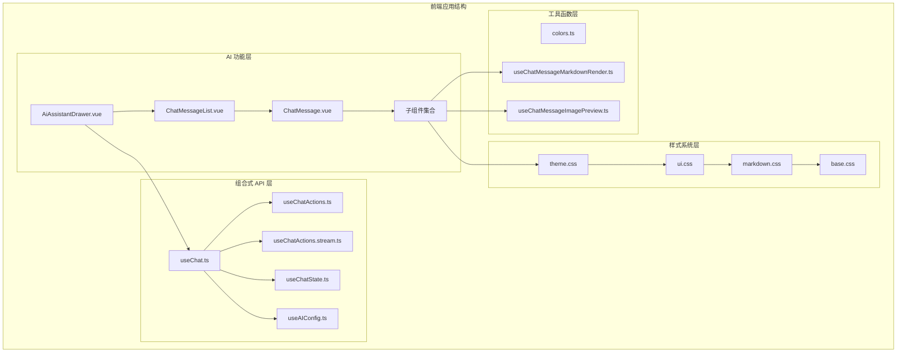

**图表来源**
- [AiAssistantDrawer.vue:1-336](file://apps/frontend/src/features/ai/components/AiAssistantDrawer.vue#L1-L336)
- [ChatMessageList.vue:1-492](file://apps/frontend/src/features/ai/components/ChatMessageList.vue#L1-L492)
- [useChat.ts:1-133](file://apps/frontend/src/features/ai/composables/useChat.ts#L1-L133)

**章节来源**
- [AiAssistantDrawer.vue:1-336](file://apps/frontend/src/features/ai/components/AiAssistantDrawer.vue#L1-L336)
- [ChatMessageList.vue:1-492](file://apps/frontend/src/features/ai/components/ChatMessageList.vue#L1-L492)
- [useChat.ts:1-133](file://apps/frontend/src/features/ai/composables/useChat.ts#L1-L133)

## 核心组件

### 抽屉式聊天界面

AiAssistantDrawer 是整个聊天系统的核心容器组件，负责管理整体布局和状态协调。

**关键特性：**
- 响应式抽屉布局，支持最大化模式
- 集成设置面板和历史记录面板
- 文件上传和粘贴功能支持
- 快捷键监听（Command + J）

### 消息列表组件

ChatMessageList 负责渲染聊天历史记录，实现智能滚动和虚拟化渲染。

**核心功能：**
- 消息窗口化渲染，提升大消息量性能
- 智能滚动到最新消息
- 会话切换动画效果
- 无限滚动加载更多消息

### 单个消息组件

ChatMessage 提供完整的消息渲染能力，支持多种消息类型和交互。

**支持的消息类型：**
- 用户消息（带编辑功能）
- AI 助手消息（Markdown 渲染）
- 工具调用结果
- 思维过程展示
- 图片消息
- 教学模式内容

**更新** 新增流式响应时序控制机制，通过 hasUnsavedResponse 条件检查避免重复消息显示。

**章节来源**
- [AiAssistantDrawer.vue:1-336](file://apps/frontend/src/features/ai/components/AiAssistantDrawer.vue#L1-L336)
- [ChatMessageList.vue:1-492](file://apps/frontend/src/features/ai/components/ChatMessageList.vue#L1-L492)
- [ChatMessage.vue:1-411](file://apps/frontend/src/features/ai/components/ChatMessage.vue#L1-L411)

## 架构概览

系统采用组合式 API 设计模式，通过多个独立的组合式函数实现关注点分离：

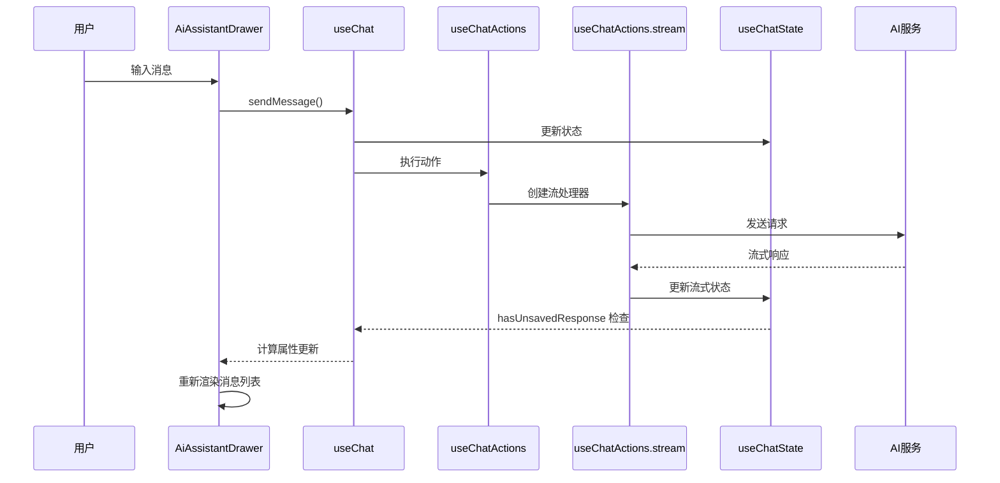

**图表来源**
- [useChat.ts:43-99](file://apps/frontend/src/features/ai/composables/useChat.ts#L43-L99)
- [useChatActions.stream.ts:202-269](file://apps/frontend/src/features/ai/composables/useChatActions.stream.ts#L202-L269)
- [useChatState.ts:41-144](file://apps/frontend/src/features/ai/composables/useChatState.ts#L41-L144)

### 数据流架构

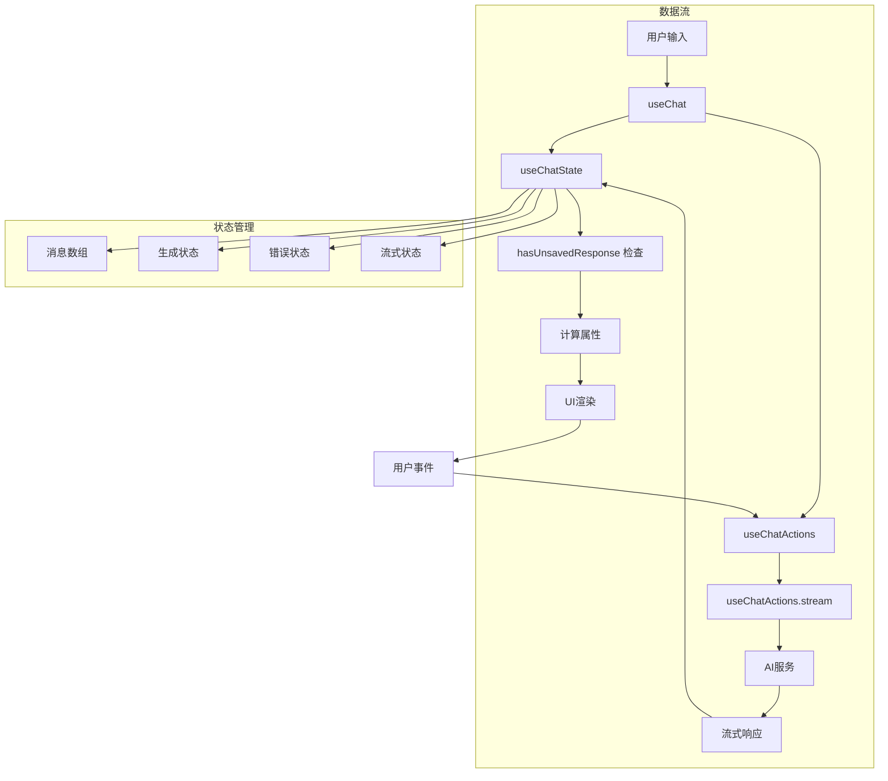

**图表来源**
- [useChat.ts:40-99](file://apps/frontend/src/features/ai/composables/useChat.ts#L40-L99)
- [useChatState.ts:44-70](file://apps/frontend/src/features/ai/composables/useChatState.ts#L44-L70)

**章节来源**
- [useChat.ts:1-133](file://apps/frontend/src/features/ai/composables/useChat.ts#L1-L133)
- [useChatActions.ts:1-484](file://apps/frontend/src/features/ai/composables/useChatActions.ts#L1-L484)
- [useChatActions.stream.ts:1-269](file://apps/frontend/src/features/ai/composables/useChatActions.stream.ts#L1-L269)
- [useChatState.ts:1-144](file://apps/frontend/src/features/ai/composables/useChatState.ts#L1-L144)

## 详细组件分析

### 聊天状态管理系统

useChatState 提供了完整的聊天状态管理，包括流式响应状态、错误处理和会话管理。

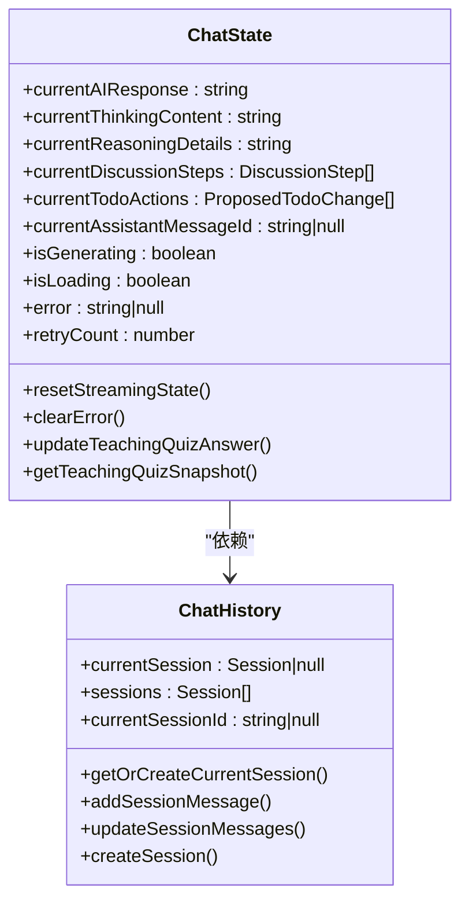

**图表来源**
- [useChatState.ts:7-144](file://apps/frontend/src/features/ai/composables/useChatState.ts#L7-L144)

### 消息渲染系统

ChatMessage 组件实现了复杂的消息渲染逻辑，支持多种内容类型和交互功能。

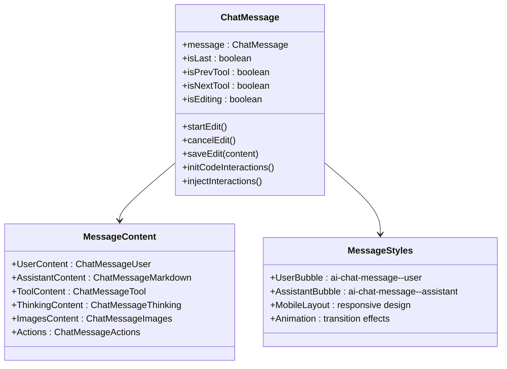

**图表来源**
- [ChatMessage.vue:23-125](file://apps/frontend/src/features/ai/components/ChatMessage.vue#L23-L125)

### 流式响应处理系统

**更新** 新增 hasUnsavedResponse 条件检查机制，专门处理流式响应完成后的状态同步问题。

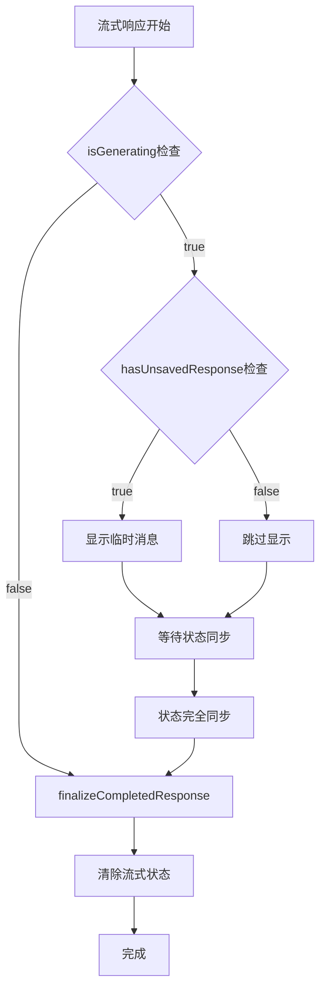

**图表来源**
- [useChat.ts:43-99](file://apps/frontend/src/features/ai/composables/useChat.ts#L43-L99)
- [useChatActions.stream.ts:222-248](file://apps/frontend/src/features/ai/composables/useChatActions.stream.ts#L222-L248)

### Markdown 渲染引擎

useChatMessageMarkdownRender 提供了强大的 Markdown 渲染能力，支持代码高亮、Mermaid 图表等高级功能。

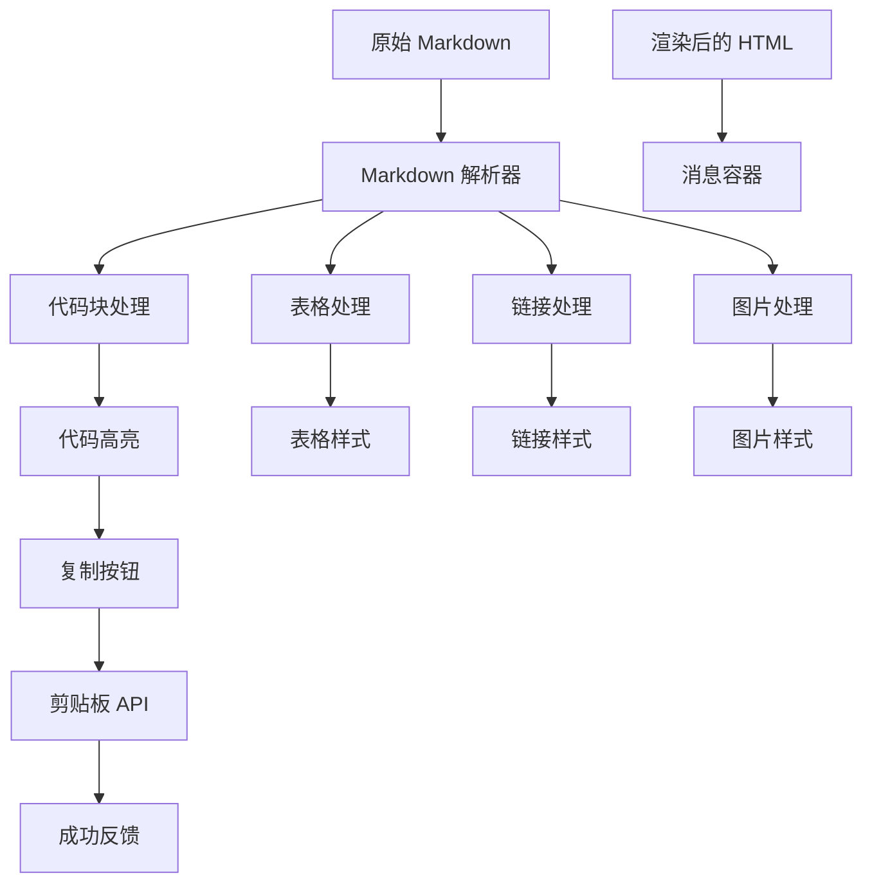

**图表来源**
- [useChatMessageMarkdownRender.ts:113-276](file://apps/frontend/src/features/ai/composables/useChatMessageMarkdownRender.ts#L113-L276)

**章节来源**
- [ChatMessage.vue:1-411](file://apps/frontend/src/features/ai/components/ChatMessage.vue#L1-L411)
- [useChatMessageMarkdownRender.ts:1-276](file://apps/frontend/src/features/ai/composables/useChatMessageMarkdownRender.ts#L1-L276)
- [useChat.ts:43-99](file://apps/frontend/src/features/ai/composables/useChat.ts#L43-L99)

### 主题和样式系统

系统采用 CSS 变量驱动的主题系统，支持明暗模式切换和自定义主题。

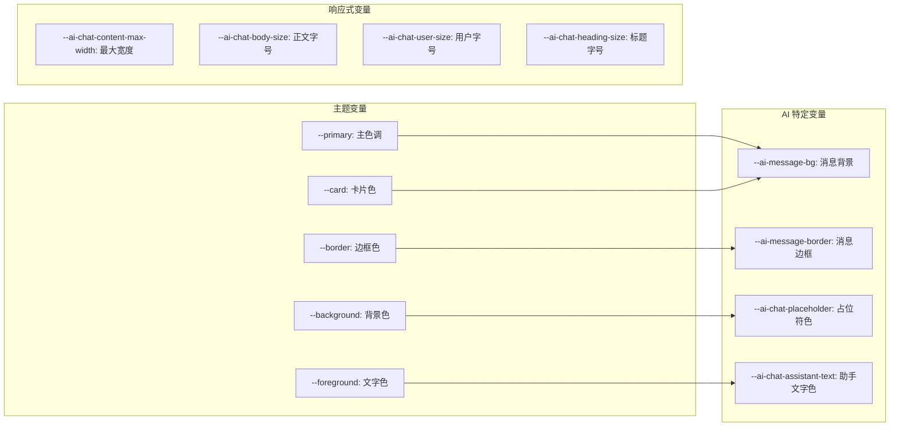

**图表来源**
- [theme.css:57-89](file://apps/frontend/src/styles/theme.css#L57-L89)

**章节来源**
- [theme.css:1-170](file://apps/frontend/src/styles/theme.css#L1-L170)
- [ui.css:1-89](file://apps/frontend/src/styles/ui.css#L1-L89)
- [markdown.css:1-672](file://apps/frontend/src/styles/markdown.css#L1-L672)

## 依赖关系分析

系统采用模块化设计，各组件之间的依赖关系清晰明确：

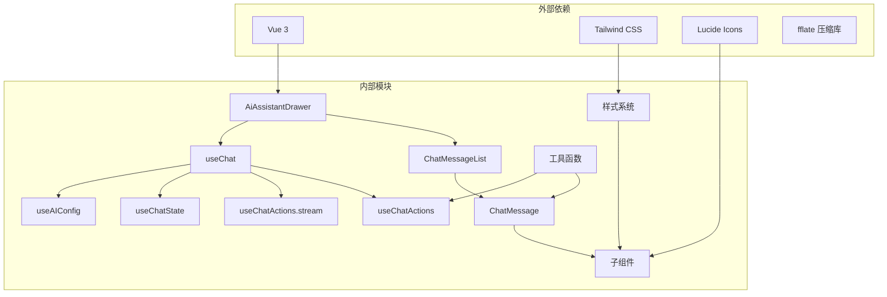

**图表来源**
- [AiAssistantDrawer.vue:1-20](file://apps/frontend/src/features/ai/components/AiAssistantDrawer.vue#L1-L20)
- [useChat.ts:1-15](file://apps/frontend/src/features/ai/composables/useChat.ts#L1-L15)

### 组件间通信机制

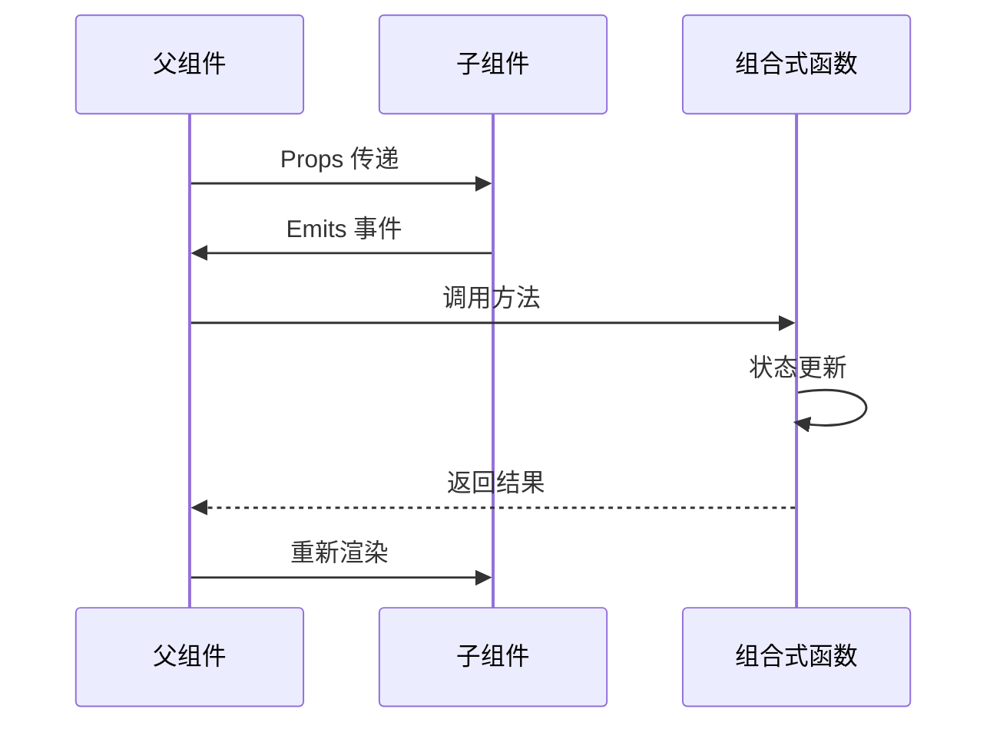

**图表来源**
- [ChatMessageList.vue:19-31](file://apps/frontend/src/features/ai/components/ChatMessageList.vue#L19-L31)
- [ChatMessage.vue:30-44](file://apps/frontend/src/features/ai/components/ChatMessage.vue#L30-L44)

**章节来源**
- [AiAssistantDrawer.vue:1-336](file://apps/frontend/src/features/ai/components/AiAssistantDrawer.vue#L1-L336)
- [useChat.ts:1-133](file://apps/frontend/src/features/ai/composables/useChat.ts#L1-L133)

## 性能考虑

### 虚拟化渲染优化

系统实现了智能的消息列表渲染，通过窗口化技术提升大消息量场景下的性能：

- **默认渲染窗口**: 200 条消息
- **增量加载**: 每次增加 200 条消息
- **智能滚动**: 自动滚动到最新消息
- **会话切换保护**: 防止切换时的状态冲突

### 流式渲染优化

**更新** 新增 hasUnsavedResponse 条件检查，优化流式渲染时序控制：

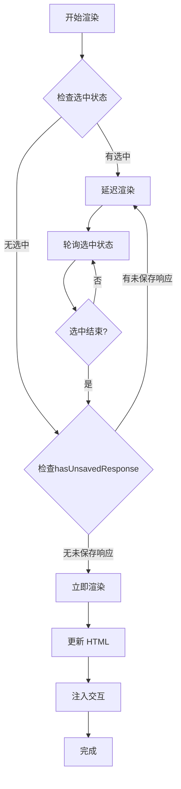

**图表来源**
- [useChatMessageMarkdownRender.ts:175-246](file://apps/frontend/src/features/ai/composables/useChatMessageMarkdownRender.ts#L175-L246)
- [useChat.ts:43-99](file://apps/frontend/src/features/ai/composables/useChat.ts#L43-L99)

### 样式性能优化

- **CSS 变量**: 减少样式计算开销
- **GPU 加速**: 使用 will-change 和 transform
- **响应式设计**: 移动端优化
- **懒加载**: 图片和资源的按需加载

## 故障排除指南

### 常见问题诊断

**消息不显示问题**
1. 检查 `chatHistory` 状态是否正确更新
2. 验证 `messages` 计算属性的逻辑
3. 确认 `isGenerating` 状态是否阻塞渲染
4. **新增** 检查 `hasUnsavedResponse` 条件检查是否正确执行

**流式响应重复消息问题**
1. 检查 `finalizeCompletedResponse` 函数的执行顺序
2. 验证 `resetStreamingState` 是否在状态同步后正确调用
3. 确认 `hasUnsavedResponse` 条件检查逻辑
4. 检查 Vue 响应式更新时序是否正确

**渲染性能问题**
1. 检查 `renderLimit` 设置
2. 验证虚拟化窗口大小
3. 确认是否有不必要的重新渲染

**样式异常问题**
1. 检查 CSS 变量是否正确设置
2. 验证主题切换逻辑
3. 确认媒体查询条件

### 调试技巧

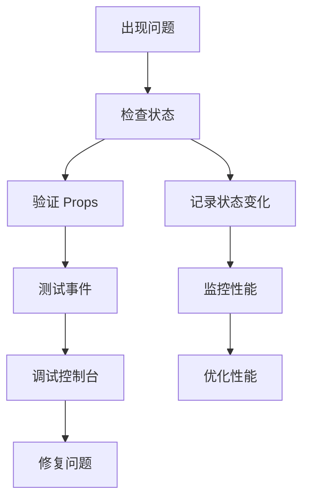

**更新** 新增 hasUnsavedResponse 相关调试步骤：
1. 在 `useChat.ts` 中添加 `hasUnsavedResponse` 条件检查日志
2. 监控流式完成到状态同步的时间差
3. 验证 `finalizeCompletedResponse` 和 `resetStreamingState` 的执行顺序

**章节来源**
- [useChatState.ts:25-36](file://apps/frontend/src/features/ai/composables/useChatState.ts#L25-L36)
- [useChatActions.ts:350-363](file://apps/frontend/src/features/ai/composables/useChatActions.ts#L350-L363)
- [useChat.ts:43-99](file://apps/frontend/src/features/ai/composables/useChat.ts#L43-L99)

## 结论

AI 聊天样式系统展现了现代前端开发的最佳实践，通过模块化设计、组合式 API 和响应式架构实现了高度可维护和可扩展的聊天界面。系统的主要优势包括：

**技术优势：**
- 清晰的关注点分离和模块化设计
- 高性能的虚拟化渲染和流式处理
- 完善的主题系统和样式管理
- 丰富的交互功能和用户体验

**架构优势：**
- 响应式设计支持多平台
- 灵活的状态管理模式
- 强大的扩展性和定制能力
- 良好的性能表现和用户体验

**更新** 本次更新重点解决了流式响应完成后可能出现重复消息的关键bug，通过新增 hasUnsavedResponse 条件检查机制，确保了消息显示的准确性和用户体验的稳定性。这一改进体现了系统在细节处理上的完善和对用户体验的重视。

该系统为构建复杂的聊天应用提供了优秀的基础设施，开发者可以在此基础上快速扩展新的功能和特性。