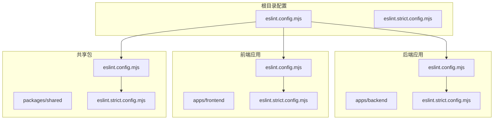
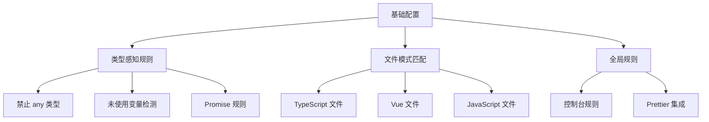
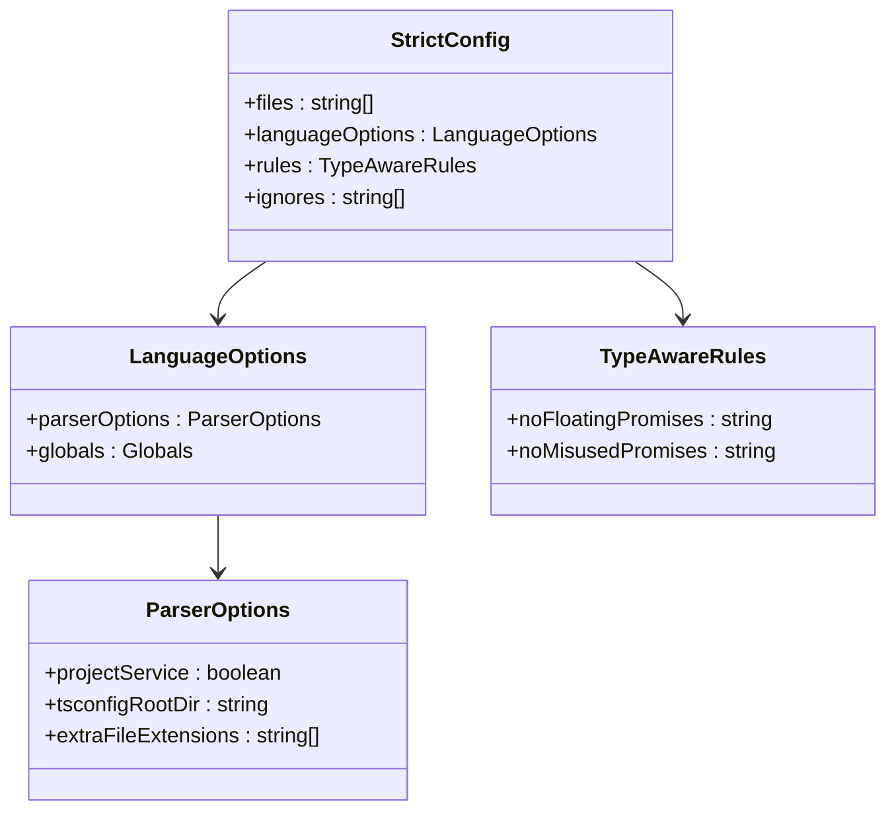
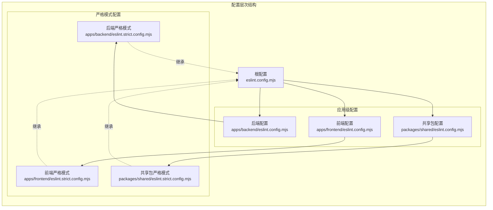
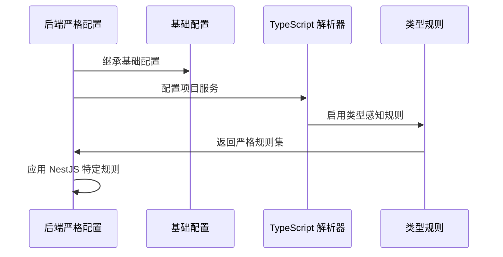
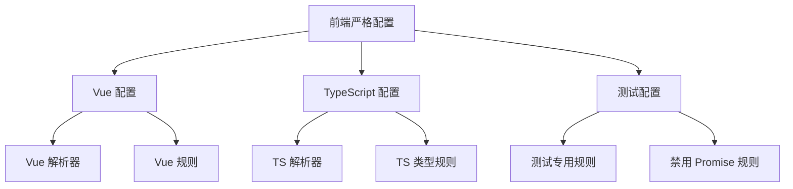
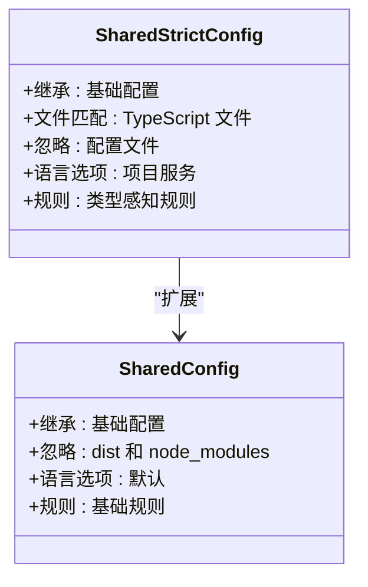
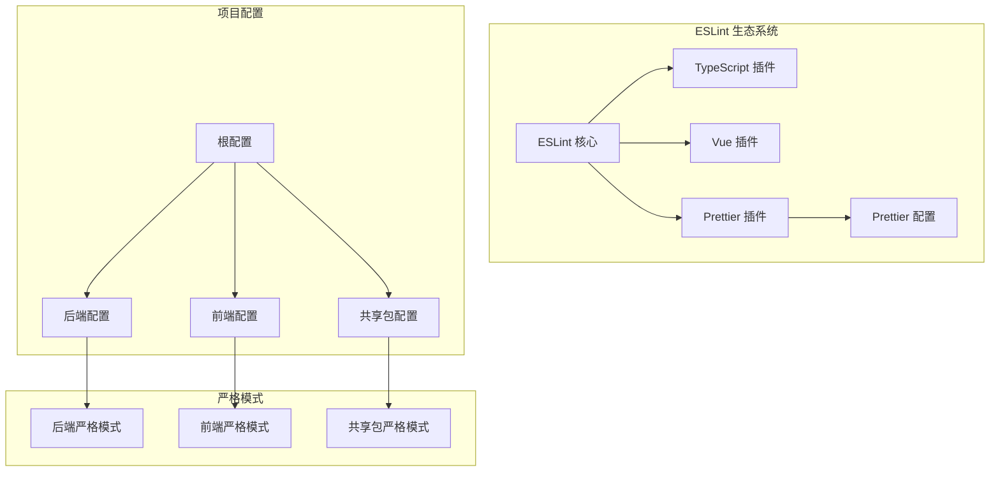

# ESLint 严格配置

<cite>
**本文档引用的文件**
- [eslint.config.mjs](file://eslint.config.mjs)
- [eslint.strict.config.mjs](file://apps/backend/eslint.strict.config.mjs)
- [eslint.strict.config.mjs](file://apps/frontend/eslint.strict.config.mjs)
- [eslint.strict.config.mjs](file://packages/shared/eslint.strict.config.mjs)
- [eslint.config.mjs](file://apps/backend/eslint.config.mjs)
- [eslint.config.mjs](file://apps/frontend/eslint.config.mjs)
- [eslint.config.mjs](file://packages/shared/eslint.config.mjs)
- [package.json](file://package.json)
</cite>

## 目录
1. [简介](#简介)
2. [项目结构](#项目结构)
3. [核心组件](#核心组件)
4. [架构概览](#架构概览)
5. [详细组件分析](#详细组件分析)
6. [依赖分析](#依赖分析)
7. [性能考虑](#性能考虑)
8. [故障排除指南](#故障排除指南)
9. [结论](#结论)

## 简介

本项目采用严格的 ESLint 配置体系，通过分层配置实现对 TypeScript、Vue.js 和共享包的统一代码质量管控。该配置体系基于现代 JavaScript/TypeScript 开发的最佳实践，结合项目的技术栈特点，提供了从基础规则到严格模式的完整解决方案。

项目采用 monorepo 架构，包含三个主要应用：
- **后端应用**：基于 NestJS 的 Node.js 后端服务
- **前端应用**：基于 Vue.js 的单页应用
- **共享包**：跨应用共享的 TypeScript 包

## 项目结构

**图表来源**
- [eslint.config.mjs:1-71](file://eslint.config.mjs#L1-L71)
- [apps/backend/eslint.config.mjs:1-25](file://apps/backend/eslint.config.mjs#L1-L25)
- [apps/frontend/eslint.config.mjs:1-74](file://apps/frontend/eslint.config.mjs#L1-L74)
- [packages/shared/eslint.config.mjs:1-20](file://packages/shared/eslint.config.mjs#L1-L20)

**章节来源**
- [eslint.config.mjs:1-71](file://eslint.config.mjs#L1-L71)
- [apps/backend/eslint.config.mjs:1-25](file://apps/backend/eslint.config.mjs#L1-L25)
- [apps/frontend/eslint.config.mjs:1-74](file://apps/frontend/eslint.config.mjs#L1-L74)
- [packages/shared/eslint.config.mjs:1-20](file://packages/shared/eslint.config.mjs#L1-L20)

## 核心组件

### 基础配置系统

项目的核心配置由根目录的 `eslint.config.mjs` 提供，定义了基础规则和通用配置：

**图表来源**
- [eslint.config.mjs:8-50](file://eslint.config.mjs#L8-L50)

### 严格模式配置

严格模式通过 `eslint.strict.config.mjs` 文件实现，为每个应用提供更严格的类型检查：

**图表来源**
- [apps/backend/eslint.strict.config.mjs:6-16](file://apps/backend/eslint.strict.config.mjs#L6-L16)
- [apps/frontend/eslint.strict.config.mjs:7-28](file://apps/frontend/eslint.strict.config.mjs#L7-L28)
- [eslint.config.mjs:8-11](file://eslint.config.mjs#L8-L11)

**章节来源**
- [eslint.config.mjs:8-50](file://eslint.config.mjs#L8-L50)
- [apps/backend/eslint.strict.config.mjs:1-18](file://apps/backend/eslint.strict.config.mjs#L1-L18)
- [apps/frontend/eslint.strict.config.mjs:1-51](file://apps/frontend/eslint.strict.config.mjs#L1-L51)
- [packages/shared/eslint.strict.config.mjs:1-18](file://packages/shared/eslint.strict.config.mjs#L1-L18)

## 架构概览

**图表来源**
- [eslint.config.mjs:1-71](file://eslint.config.mjs#L1-L71)
- [apps/backend/eslint.config.mjs:1-25](file://apps/backend/eslint.config.mjs#L1-L25)
- [apps/frontend/eslint.config.mjs:1-74](file://apps/frontend/eslint.config.mjs#L1-L74)
- [packages/shared/eslint.config.mjs:1-20](file://packages/shared/eslint.config.mjs#L1-L20)

## 详细组件分析

### 后端严格配置分析

后端应用的严格配置专注于 NestJS 特定的类型安全要求：

**图表来源**
- [apps/backend/eslint.strict.config.mjs:1-18](file://apps/backend/eslint.strict.config.mjs#L1-L18)
- [apps/backend/eslint.config.mjs:11-19](file://apps/backend/eslint.config.mjs#L11-L19)

关键特性包括：
- **类型感知解析**：启用 `projectService` 进行精确的 TypeScript 类型检查
- **NestJS 规则**：禁用特定的 NestJS 装饰器规则以适应框架特性
- **忽略配置**：排除配置文件和测试文件的严格检查

**章节来源**
- [apps/backend/eslint.strict.config.mjs:1-18](file://apps/backend/eslint.strict.config.mjs#L1-L18)
- [apps/backend/eslint.config.mjs:11-19](file://apps/backend/eslint.config.mjs#L11-L19)

### 前端严格配置分析

前端应用的严格配置同时支持 Vue 单文件组件和 TypeScript：

**图表来源**
- [apps/frontend/eslint.strict.config.mjs:1-51](file://apps/frontend/eslint.strict.config.mjs#L1-L51)

前端配置的独特之处在于：
- **双解析器支持**：同时处理 `.vue` 和 `.ts` 文件
- **Vue 组件规则**：强制组件命名规范和模板结构
- **测试宽松模式**：为测试文件禁用某些严格规则

**章节来源**
- [apps/frontend/eslint.strict.config.mjs:1-51](file://apps/frontend/eslint.strict.config.mjs#L1-L51)
- [apps/frontend/eslint.config.mjs:24-44](file://apps/frontend/eslint.config.mjs#L24-L44)

### 共享包严格配置分析

共享包的严格配置保持简洁，专注于核心 TypeScript 功能：

**图表来源**
- [packages/shared/eslint.strict.config.mjs:1-18](file://packages/shared/eslint.strict.config.mjs#L1-L18)
- [packages/shared/eslint.config.mjs:1-20](file://packages/shared/eslint.config.mjs#L1-L20)

**章节来源**
- [packages/shared/eslint.strict.config.mjs:1-18](file://packages/shared/eslint.strict.config.mjs#L1-L18)
- [packages/shared/eslint.config.mjs:1-20](file://packages/shared/eslint.config.mjs#L1-L20)

## 依赖分析

**图表来源**
- [package.json:78-92](file://package.json#L78-L92)
- [eslint.config.mjs:1-5](file://eslint.config.mjs#L1-L5)

**章节来源**
- [package.json:78-92](file://package.json#L78-L92)
- [eslint.config.mjs:1-5](file://eslint.config.mjs#L1-L5)

## 性能考虑

### 缓存策略

项目实现了多层级的缓存机制以提升 ESLint 性能：

- **根目录缓存**：`apps/backend/.eslintcache-fast`
- **前端缓存**：`apps/frontend/.eslintcache-fast`
- **共享包缓存**：`packages/shared/.eslintcache-fast`

### 并行处理

通过 `turbo` 实现并行 lint 执行：
- 后端应用：`pnpm --filter @lumina/backend eslint --fix`
- 前端应用：`pnpm --filter @lumina/frontend eslint --fix`
- 共享包：`pnpm --filter @lumina/shared eslint --fix`

## 故障排除指南

### 常见问题及解决方案

#### 1. 类型检查失败

**症状**：严格模式下出现 TypeScript 类型错误

**解决方案**：
- 检查 `typeAwareRules` 配置
- 验证 `projectService` 设置
- 确认 tsconfig 文件路径正确

#### 2. Vue 文件解析错误

**症状**：`.vue` 文件无法正确解析

**解决方案**：
- 确认 `extraFileExtensions` 包含 `.vue`
- 检查 `parser` 配置是否正确
- 验证 Vue 插件版本兼容性

#### 3. 测试文件规则冲突

**症状**：测试文件中 Promise 相关规则报错

**解决方案**：
- 检查测试配置中的 `no-floating-promises` 规则
- 确认测试文件模式匹配正确
- 验证 `projectService` 设置为 `false`

**章节来源**
- [apps/frontend/eslint.strict.config.mjs:30-49](file://apps/frontend/eslint.strict.config.mjs#L30-L49)
- [apps/backend/eslint.strict.config.mjs:8-8](file://apps/backend/eslint.strict.config.mjs#L8-L8)

## 结论

本项目的 ESLint 严格配置体系体现了现代前端工程化的最佳实践，通过分层配置实现了：

1. **统一的代码质量标准**：所有应用遵循相同的规则基线
2. **渐进式的严格程度**：从基础配置到严格模式的平滑过渡
3. **技术栈适配**：针对 NestJS、Vue.js 和共享包的特定需求
4. **性能优化**：通过缓存和并行处理提升开发体验

该配置体系为大型 monorepo 项目提供了可维护、可扩展的代码质量保障机制，确保团队协作的一致性和代码的长期可维护性。