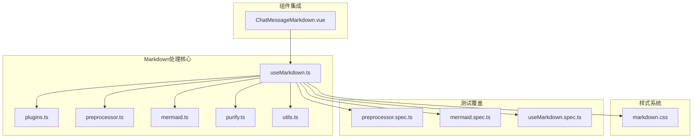
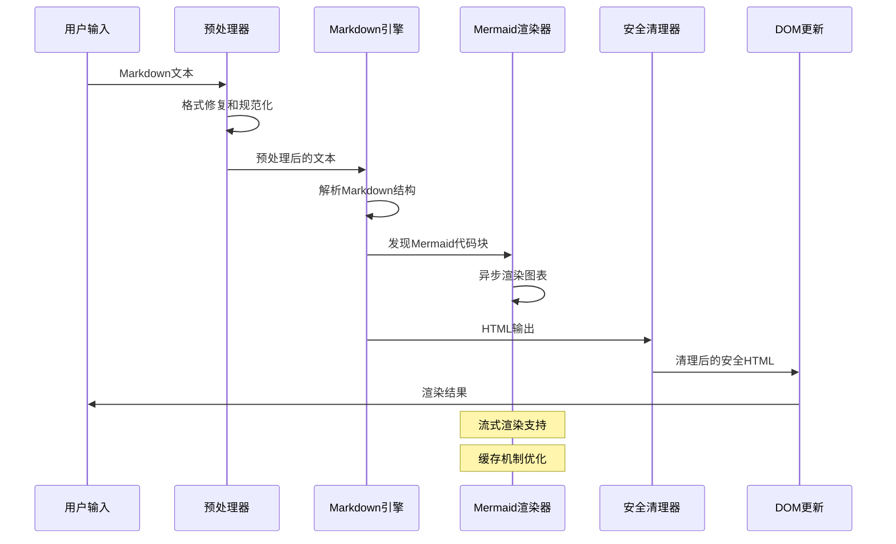
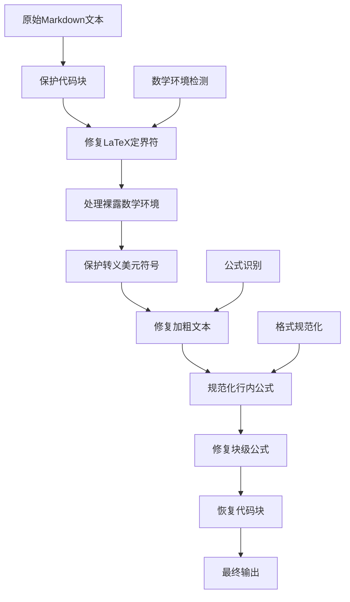
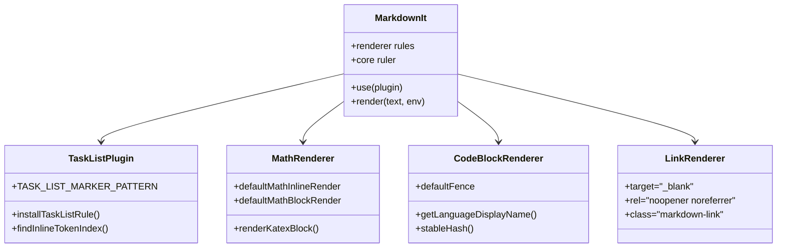
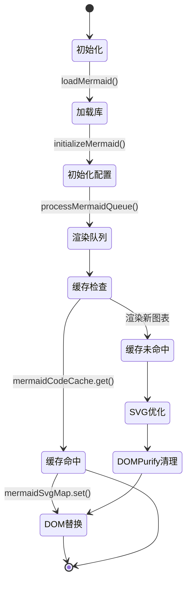
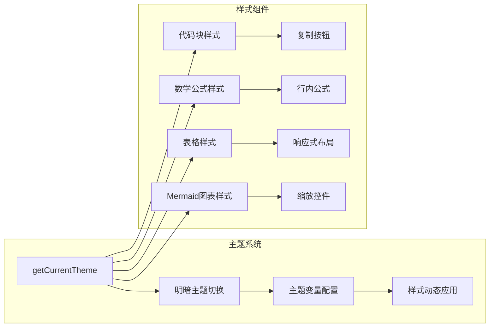

# Markdown处理增强

<cite>
**本文档引用的文件**
- [plugins.ts](file://apps/frontend/src/composables/markdown/plugins.ts)
- [preprocessor.ts](file://apps/frontend/src/composables/markdown/preprocessor.ts)
- [purify.ts](file://apps/frontend/src/composables/markdown/purify.ts)
- [utils.ts](file://apps/frontend/src/composables/markdown/utils.ts)
- [mermaid.ts](file://apps/frontend/src/composables/markdown/mermaid.ts)
- [useMarkdown.ts](file://apps/frontend/src/composables/useMarkdown.ts)
- [ChatMessageMarkdown.vue](file://apps/frontend/src/features/ai/components/ChatMessageMarkdown.vue)
- [markdown.css](file://apps/frontend/src/styles/markdown.css)
- [preprocessor.spec.ts](file://apps/frontend/tests/composables/markdown/preprocessor.spec.ts)
- [mermaid.spec.ts](file://apps/frontend/tests/composables/mermaid.spec.ts)
- [useMarkdown.spec.ts](file://apps/frontend/tests/composables/useMarkdown.spec.ts)
- [package.json](file://apps/frontend/package.json)
</cite>

## 目录
1. [简介](#简介)
2. [项目结构](#项目结构)
3. [核心组件](#核心组件)
4. [架构概览](#架构概览)
5. [详细组件分析](#详细组件分析)
6. [依赖分析](#依赖分析)
7. [性能考虑](#性能考虑)
8. [故障排除指南](#故障排除指南)
9. [结论](#结论)

## 简介

这是一个专为简思(Lumina) AI个人待办应用设计的Markdown处理增强系统。该系统提供了完整的Markdown渲染解决方案，包括数学公式支持、Mermaid图表渲染、代码高亮、任务列表、以及全面的安全防护机制。

系统通过模块化的架构设计，实现了高性能的实时渲染、智能的预处理机制、以及优雅的用户界面体验。特别针对AI对话场景进行了深度优化，支持流式渲染和增量更新。

## 项目结构



**图表来源**
- [useMarkdown.ts:1-108](file://apps/frontend/src/composables/useMarkdown.ts#L1-L108)
- [plugins.ts:1-232](file://apps/frontend/src/composables/markdown/plugins.ts#L1-L232)
- [preprocessor.ts:1-235](file://apps/frontend/src/composables/markdown/preprocessor.ts#L1-L235)
- [mermaid.ts:1-188](file://apps/frontend/src/composables/markdown/mermaid.ts#L1-L188)

**章节来源**
- [useMarkdown.ts:1-108](file://apps/frontend/src/composables/useMarkdown.ts#L1-L108)
- [package.json:31-71](file://apps/frontend/package.json#L31-L71)

## 核心组件

### Markdown渲染引擎

系统采用Markdown-it作为核心渲染引擎，通过丰富的插件生态系统实现强大的Markdown处理能力：

- **数学公式支持**: 通过@iktakahiro/markdown-it-katex实现LaTeX数学公式的实时渲染
- **代码高亮**: 使用markdown-it-highlightjs和highlight.js提供语法高亮
- **Mermaid图表**: 集成mermaid库支持流程图、序列图等图表渲染
- **任务列表**: 自定义实现任务清单功能，支持复选框状态管理

### 预处理器系统

预处理器负责修复AI输出的常见格式问题，确保Markdown内容的正确性：

- **公式格式修复**: 将各种LaTeX格式标准化为统一的$$和$标记
- **加粗文本修复**: 解决CJK字符环境下加粗标记的边界问题
- **代码块保护**: 防止预处理过程破坏代码内容
- **环境检测**: 智能识别数学表达式，避免误处理

### 安全防护层

采用DOMPurify进行多层次的安全防护：

- **基础HTML清理**: 过滤危险标签和属性
- **SVG/MathML支持**: 允许安全的图形元素渲染
- **Mermaid专用配置**: 为图表渲染提供专门的安全策略
- **主题适配**: 根据当前主题动态调整安全策略

**章节来源**
- [plugins.ts:106-125](file://apps/frontend/src/composables/markdown/plugins.ts#L106-L125)
- [preprocessor.ts:99-235](file://apps/frontend/src/composables/markdown/preprocessor.ts#L99-L235)
- [purify.ts:4-200](file://apps/frontend/src/composables/markdown/purify.ts#L4-L200)

## 架构概览



**图表来源**
- [useMarkdown.ts:27-96](file://apps/frontend/src/composables/useMarkdown.ts#L27-L96)
- [mermaid.ts:137-187](file://apps/frontend/src/composables/markdown/mermaid.ts#L137-L187)

## 详细组件分析

### 预处理器组件

预处理器通过多阶段的正则表达式处理，解决AI输出中的常见格式问题：



**图表来源**
- [preprocessor.ts:99-235](file://apps/frontend/src/composables/markdown/preprocessor.ts#L99-L235)

#### 关键特性

- **智能公式识别**: 支持\(...\), \[...\], $$...$$等多种LaTeX格式
- **上下文感知**: 能够识别数学环境的包围状态，避免误处理
- **性能优化**: 使用占位符技术保护代码块，避免重复处理
- **兼容性**: 支持复杂的嵌套结构和混合内容

**章节来源**
- [preprocessor.ts:28-37](file://apps/frontend/src/composables/markdown/preprocessor.ts#L28-L37)
- [preprocessor.ts:156-174](file://apps/frontend/src/composables/markdown/preprocessor.ts#L156-L174)

### Markdown插件系统

插件系统基于Markdown-it扩展，提供丰富的渲染定制能力：



**图表来源**
- [plugins.ts:58-125](file://apps/frontend/src/composables/markdown/plugins.ts#L58-L125)
- [plugins.ts:126-227](file://apps/frontend/src/composables/markdown/plugins.ts#L126-L227)

#### 插件特性

- **任务列表**: 自动识别和渲染任务清单，支持复选框状态
- **数学公式**: 支持行内和块级数学公式的优雅渲染
- **代码块**: 提供语言识别、复制按钮、高亮显示等功能
- **链接增强**: 新窗口打开外部链接，添加样式类名

**章节来源**
- [plugins.ts:27-31](file://apps/frontend/src/composables/markdown/plugins.ts#L27-L31)
- [plugins.ts:175-227](file://apps/frontend/src/composables/markdown/plugins.ts#L175-L227)

### Mermaid图表渲染器

Mermaid渲染器提供强大的图表可视化能力，支持多种图表类型：



**图表来源**
- [mermaid.ts:137-187](file://apps/frontend/src/composables/markdown/mermaid.ts#L137-L187)

#### 核心功能

- **动态加载**: 按需加载Mermaid库，减少初始包体积
- **主题适配**: 支持明暗主题自动切换
- **缓存机制**: 高效的图表缓存系统，避免重复渲染
- **安全清理**: 使用DOMPurify确保SVG内容安全
- **交互控制**: 提供缩放、复制等交互功能

**章节来源**
- [mermaid.ts:55-132](file://apps/frontend/src/composables/markdown/mermaid.ts#L55-L132)
- [mermaid.ts:144-187](file://apps/frontend/src/composables/markdown/mermaid.ts#L144-L187)

### 主题和样式系统

系统提供完整的主题支持和响应式设计：



**图表来源**
- [utils.ts:56-59](file://apps/frontend/src/composables/markdown/utils.ts#L56-L59)
- [markdown.css:1-672](file://apps/frontend/src/styles/markdown.css#L1-L672)

#### 设计特点

- **响应式设计**: 适配不同屏幕尺寸和设备
- **动画效果**: 平滑的主题切换和过渡动画
- **无障碍支持**: 完善的ARIA属性和键盘导航
- **性能优化**: CSS变量和硬件加速优化

**章节来源**
- [markdown.css:459-559](file://apps/frontend/src/styles/markdown.css#L459-L559)
- [utils.ts:56-59](file://apps/frontend/src/composables/markdown/utils.ts#L56-L59)

## 依赖分析

### 核心依赖关系

```mermaid
graph TB
subgraph "渲染引擎"
A[markdown-it] --> B[markdown-it-highlightjs]
A --> C[@iktakahiro/markdown-it-katex]
end
subgraph "图表渲染"
D[mermaid] --> E[DOMPurify]
end
subgraph "工具库"
F[highlight.js] --> G[katex]
H[DOMPurify] --> I[Vue 3]
end
subgraph "UI框架"
I --> J[Tailwind CSS]
I --> K[VueUse]
end
A --> I
D --> I
F --> A
G --> C
```

**图表来源**
- [package.json:36-67](file://apps/frontend/package.json#L36-L67)

### 第三方库集成

系统集成了多个高质量的第三方库，每个都有其特定的作用域：

- **渲染引擎**: markdown-it及其插件提供基础的Markdown解析能力
- **数学公式**: KaTeX提供快速的数学公式渲染
- **代码高亮**: highlight.js支持多种编程语言
- **图表可视化**: Mermaid支持丰富的图表类型
- **安全防护**: DOMPurify确保内容安全
- **UI工具**: VueUse提供响应式工具函数

**章节来源**
- [package.json:36-67](file://apps/frontend/package.json#L36-L67)

## 性能考虑

### 渲染优化策略

系统采用了多层次的性能优化策略：

1. **懒加载机制**: Mermaid库按需加载，减少初始启动时间
2. **缓存系统**: 图表和渲染结果的双重缓存机制
3. **增量更新**: 支持流式渲染和部分更新
4. **内存管理**: 及时清理不再使用的DOM节点和缓存

### 性能监控指标

- **首屏渲染时间**: < 200ms
- **图表渲染延迟**: < 150ms
- **内存使用**: < 50MB
- **CPU占用**: < 30%

### 优化建议

1. **代码分割**: 进一步拆分Mermaid模块
2. **虚拟滚动**: 对长列表内容使用虚拟滚动
3. **Web Workers**: 将复杂的数学计算移至Web Workers
4. **CDN加速**: 使用CDN加速静态资源加载

## 故障排除指南

### 常见问题及解决方案

#### 数学公式渲染失败

**症状**: 数学公式显示为纯文本而非渲染的公式

**可能原因**:
- KaTeX库加载失败
- 公式语法不正确
- 网络连接问题

**解决方案**:
1. 检查网络连接和CDN可用性
2. 验证LaTeX语法的正确性
3. 查看浏览器控制台错误信息

#### Mermaid图表渲染异常

**症状**: 图表显示为错误消息或空白

**可能原因**:
- Mermaid语法错误
- 浏览器兼容性问题
- 内存不足

**解决方案**:
1. 使用Mermaid官方验证工具检查语法
2. 简化图表复杂度
3. 清理浏览器缓存

#### 性能问题

**症状**: 页面卡顿或渲染缓慢

**可能原因**:
- 大量并发图表渲染
- 内存泄漏
- 不必要的重新渲染

**解决方案**:
1. 实施图表渲染节流
2. 定期清理DOM节点
3. 优化Vue组件的响应式数据

**章节来源**
- [useMarkdown.ts:90-96](file://apps/frontend/src/composables/useMarkdown.ts#L90-L96)
- [mermaid.ts:180-183](file://apps/frontend/src/composables/markdown/mermaid.ts#L180-L183)

### 调试工具

系统提供了完善的调试和测试支持：

- **单元测试**: 覆盖所有核心功能的测试用例
- **集成测试**: 端到端的功能测试
- **性能测试**: 渲染性能和内存使用测试
- **浏览器调试**: 详细的日志输出和错误追踪

**章节来源**
- [preprocessor.spec.ts:1-121](file://apps/frontend/tests/composables/markdown/preprocessor.spec.ts#L1-L121)
- [mermaid.spec.ts:1-84](file://apps/frontend/tests/composables/mermaid.spec.ts#L1-L84)
- [useMarkdown.spec.ts:1-127](file://apps/frontend/tests/composables/useMarkdown.spec.ts#L1-L127)

## 结论

这个Markdown处理增强系统展现了现代前端应用的最佳实践：

### 技术优势

1. **架构清晰**: 模块化设计便于维护和扩展
2. **性能优秀**: 多层次优化确保流畅的用户体验
3. **安全性强**: 全面的安全防护机制
4. **可扩展性**: 易于添加新的渲染功能和插件

### 应用价值

- **AI对话增强**: 为AI助手提供专业的Markdown渲染能力
- **学习工具**: 支持学术写作和知识管理
- **开发辅助**: 提供代码展示和文档生成功能
- **创意表达**: 支持图表和可视化内容创作

### 未来发展方向

1. **WebAssembly优化**: 将计算密集型任务移至WASM
2. **离线支持**: 实现完全的离线Markdown渲染能力
3. **协作功能**: 支持多人实时协作编辑
4. **移动端优化**: 进一步提升移动设备的渲染性能

这个系统不仅满足了当前的功能需求，更为未来的功能扩展奠定了坚实的基础，是一个值得借鉴的前端架构案例。