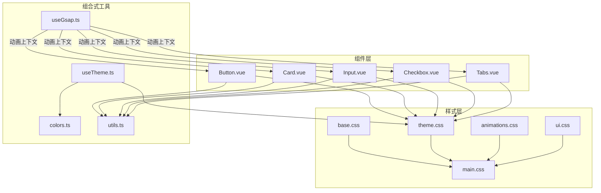
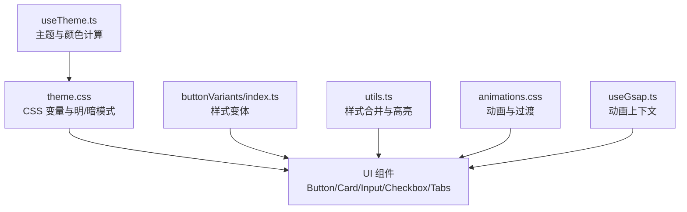
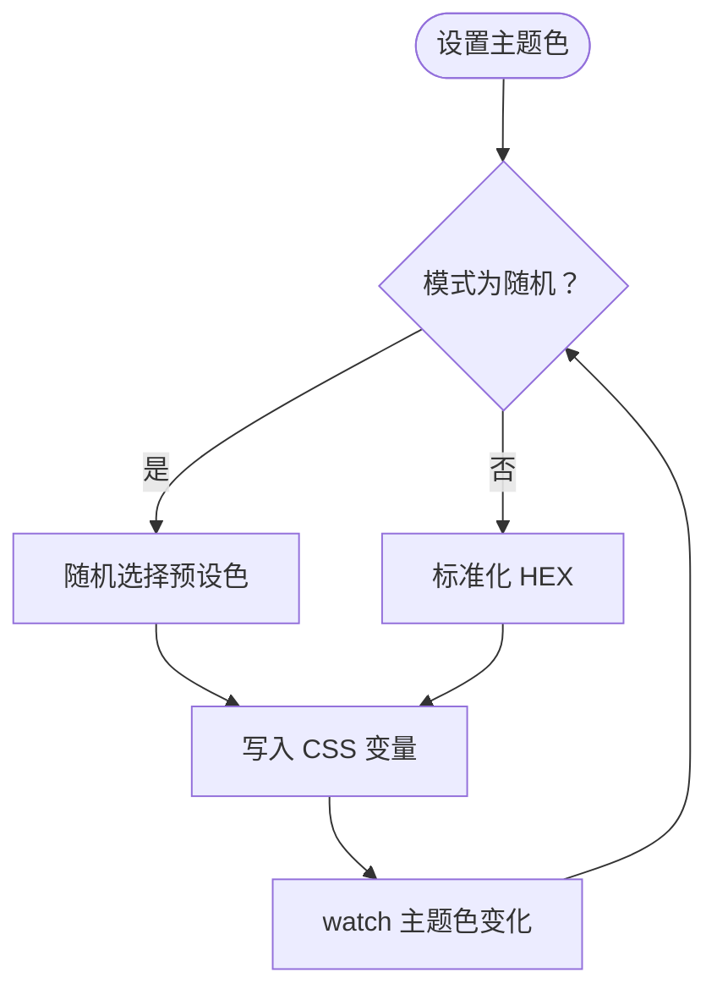
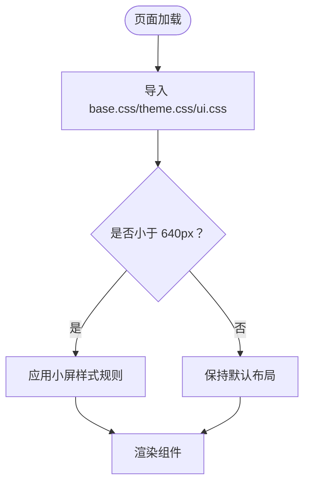
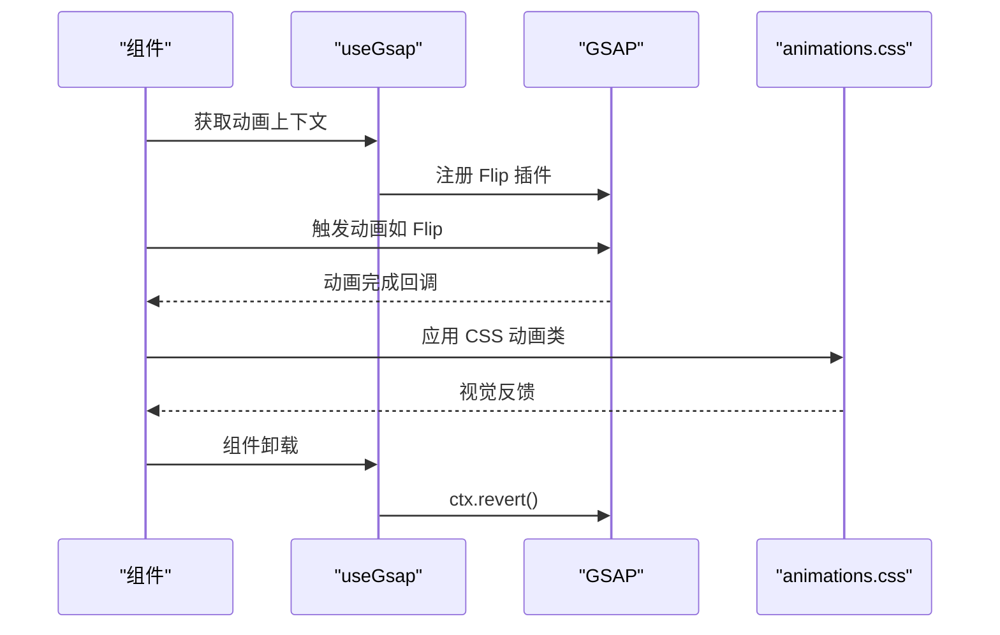
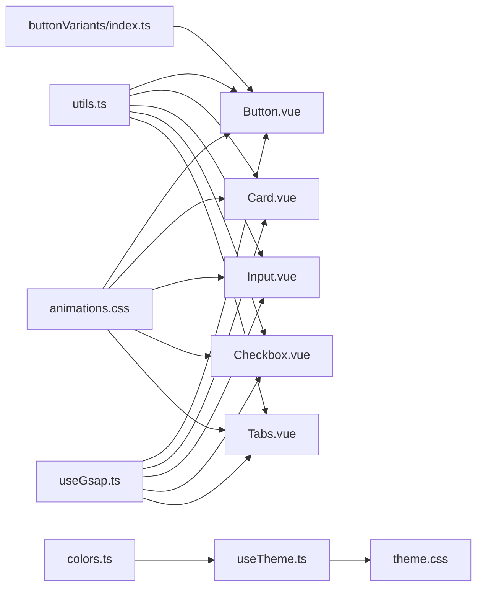

# UI组件库

<cite>
**本文引用的文件**
- [apps/frontend/src/composables/useTheme.ts](file://apps/frontend/src/composables/useTheme.ts)
- [apps/frontend/src/styles/theme.css](file://apps/frontend/src/styles/theme.css)
- [apps/frontend/src/styles/base.css](file://apps/frontend/src/styles/base.css)
- [apps/frontend/src/styles/animations.css](file://apps/frontend/src/styles/animations.css)
- [apps/frontend/src/styles/ui.css](file://apps/frontend/src/styles/ui.css)
- [apps/frontend/src/styles/main.css](file://apps/frontend/src/styles/main.css)
- [apps/frontend/src/lib/colors.ts](file://apps/frontend/src/lib/colors.ts)
- [apps/frontend/src/lib/utils.ts](file://apps/frontend/src/lib/utils.ts)
- [apps/frontend/src/components/ui/button/Button.vue](file://apps/frontend/src/components/ui/button/Button.vue)
- [apps/frontend/src/components/ui/button/index.ts](file://apps/frontend/src/components/ui/button/index.ts)
- [apps/frontend/src/components/ui/card/Card.vue](file://apps/frontend/src/components/ui/card/Card.vue)
- [apps/frontend/src/components/ui/input/Input.vue](file://apps/frontend/src/components/ui/input/Input.vue)
- [apps/frontend/src/components/ui/checkbox/Checkbox.vue](file://apps/frontend/src/components/ui/checkbox/Checkbox.vue)
- [apps/frontend/src/components/ui/tabs/Tabs.vue](file://apps/frontend/src/components/ui/tabs/Tabs.vue)
- [apps/frontend/src/composables/useGsap.ts](file://apps/frontend/src/composables/useGsap.ts)
</cite>

## 目录
1. [简介](#简介)
2. [项目结构](#项目结构)
3. [核心组件](#核心组件)
4. [架构总览](#架构总览)
5. [组件详解](#组件详解)
6. [依赖关系分析](#依赖关系分析)
7. [性能考量](#性能考量)
8. [故障排查指南](#故障排查指南)
9. [结论](#结论)
10. [附录](#附录)

## 简介
本文件为 Lumina Todo 前端应用的 UI 组件库文档，聚焦于基于 Radix UI（通过 reka-ui 封装）与自定义组件的统一设计体系。内容涵盖组件属性接口、事件处理与插槽使用方式；主题系统与颜色方案实现；响应式设计与断点管理；动画与过渡效果；无障碍支持与最佳实践；以及组件定制化与样式覆盖方法，并给出文档生成与维护策略建议。

## 项目结构
前端 UI 组件库主要位于 apps/frontend/src/components/ui 下，采用按功能域分层组织：
- 组件层：每个 UI 组件以独立 Vue 单文件组件形式存在，封装基础交互与样式。
- 样式层：通过 Tailwind 与 CSS 变量驱动的主题系统，配合动画与媒体查询实现响应式与动效。
- 组合式工具层：useTheme、useGsap、colors、utils 等提供主题切换、GSAP 动画上下文、颜色转换与通用工具函数。

**图示来源**
- [apps/frontend/src/components/ui/button/Button.vue:1-32](file://apps/frontend/src/components/ui/button/Button.vue#L1-L32)
- [apps/frontend/src/components/ui/card/Card.vue:1-15](file://apps/frontend/src/components/ui/card/Card.vue#L1-L15)
- [apps/frontend/src/components/ui/input/Input.vue:1-42](file://apps/frontend/src/components/ui/input/Input.vue#L1-L42)
- [apps/frontend/src/components/ui/checkbox/Checkbox.vue:1-34](file://apps/frontend/src/components/ui/checkbox/Checkbox.vue#L1-L34)
- [apps/frontend/src/components/ui/tabs/Tabs.vue:1-16](file://apps/frontend/src/components/ui/tabs/Tabs.vue#L1-L16)
- [apps/frontend/src/styles/base.css:1-89](file://apps/frontend/src/styles/base.css#L1-L89)
- [apps/frontend/src/styles/theme.css:1-146](file://apps/frontend/src/styles/theme.css#L1-L146)
- [apps/frontend/src/styles/animations.css:1-159](file://apps/frontend/src/styles/animations.css#L1-L159)
- [apps/frontend/src/styles/ui.css:1-36](file://apps/frontend/src/styles/ui.css#L1-L36)
- [apps/frontend/src/styles/main.css:1-7](file://apps/frontend/src/styles/main.css#L1-L7)
- [apps/frontend/src/composables/useTheme.ts:1-248](file://apps/frontend/src/composables/useTheme.ts#L1-L248)
- [apps/frontend/src/composables/useGsap.ts:1-20](file://apps/frontend/src/composables/useGsap.ts#L1-L20)
- [apps/frontend/src/lib/colors.ts:1-96](file://apps/frontend/src/lib/colors.ts#L1-L96)
- [apps/frontend/src/lib/utils.ts:1-33](file://apps/frontend/src/lib/utils.ts#L1-L33)

**章节来源**
- [apps/frontend/src/styles/main.css:1-7](file://apps/frontend/src/styles/main.css#L1-L7)
- [apps/frontend/src/styles/base.css:1-89](file://apps/frontend/src/styles/base.css#L1-L89)
- [apps/frontend/src/styles/theme.css:1-146](file://apps/frontend/src/styles/theme.css#L1-L146)
- [apps/frontend/src/styles/animations.css:1-159](file://apps/frontend/src/styles/animations.css#L1-L159)
- [apps/frontend/src/styles/ui.css:1-36](file://apps/frontend/src/styles/ui.css#L1-L36)

## 核心组件
本节概述 UI 组件库的关键组成与职责：
- 主题系统：通过 useTheme 提供明/暗模式与用户主题色（含随机模式），并写入 CSS 变量驱动全站样式。
- 组件基座：Button、Card、Input、Checkbox、Tabs 等均以 reka-ui 的原生语义组件为基础，结合 cn 工具与 Variants 实现一致的外观与交互。
- 动效系统：通过 animations.css 定义动画与过渡，配合 useGsap 提供复杂场景的 FLIP 动画上下文。
- 样式管线：base.css 引入 Tailwind 与字体资源，theme.css 定义 CSS 变量与明/暗模式分支，ui.css 提供组件级响应式与细节样式。

**章节来源**
- [apps/frontend/src/composables/useTheme.ts:188-247](file://apps/frontend/src/composables/useTheme.ts#L188-L247)
- [apps/frontend/src/styles/theme.css:1-146](file://apps/frontend/src/styles/theme.css#L1-L146)
- [apps/frontend/src/lib/utils.ts:5-7](file://apps/frontend/src/lib/utils.ts#L5-L7)
- [apps/frontend/src/components/ui/button/index.ts:7-35](file://apps/frontend/src/components/ui/button/index.ts#L7-L35)
- [apps/frontend/src/composables/useGsap.ts:7-19](file://apps/frontend/src/composables/useGsap.ts#L7-L19)

## 架构总览
UI 组件库围绕“主题变量 + 组件 Variants + 动画管线”的三层架构运行：
- 主题变量层：在 :root 与 .dark 中声明语义化 CSS 变量，支持用户主题色覆盖与明暗模式切换。
- 组件层：组件通过 Variants 与 cn 合并样式，遵循 Radix 语义与无障碍约定。
- 动效层：CSS 动画与 GSAP Flip 插件协同，提供流畅的交互动画与状态切换。

**图示来源**
- [apps/frontend/src/composables/useTheme.ts:188-247](file://apps/frontend/src/composables/useTheme.ts#L188-L247)
- [apps/frontend/src/styles/theme.css:1-146](file://apps/frontend/src/styles/theme.css#L1-L146)
- [apps/frontend/src/components/ui/button/index.ts:7-35](file://apps/frontend/src/components/ui/button/index.ts#L7-L35)
- [apps/frontend/src/lib/utils.ts:5-7](file://apps/frontend/src/lib/utils.ts#L5-L7)
- [apps/frontend/src/styles/animations.css:1-159](file://apps/frontend/src/styles/animations.css#L1-L159)
- [apps/frontend/src/composables/useGsap.ts:7-19](file://apps/frontend/src/composables/useGsap.ts#L7-L19)

## 组件详解

### 主题系统与颜色方案
- 明/暗模式：通过 useColorMode 切换根节点 class='dark'，theme.css 中 .dark 分支重定义变量，实现无缝切换。
- 用户主题色：支持固定 HEX、随机模式（random）。随机模式每 30-60 分钟自动更换一次，避免频繁干扰。
- 颜色计算：useTheme 内部将 HEX 转换为 HSL，限定饱和度与亮度范围，生成主色、悬停、前景等派生变量，写入 CSS 变量供全站使用。
- 颜色解析工具：colors.ts 提供 HSL/RGB 解析、混合与字符串化，便于在运行时读取与计算。

**图示来源**
- [apps/frontend/src/composables/useTheme.ts:188-247](file://apps/frontend/src/composables/useTheme.ts#L188-L247)
- [apps/frontend/src/styles/theme.css:1-146](file://apps/frontend/src/styles/theme.css#L1-L146)
- [apps/frontend/src/lib/colors.ts:40-78](file://apps/frontend/src/lib/colors.ts#L40-L78)

**章节来源**
- [apps/frontend/src/composables/useTheme.ts:1-248](file://apps/frontend/src/composables/useTheme.ts#L1-L248)
- [apps/frontend/src/styles/theme.css:1-146](file://apps/frontend/src/styles/theme.css#L1-L146)
- [apps/frontend/src/lib/colors.ts:1-96](file://apps/frontend/src/lib/colors.ts#L1-L96)

### 响应式设计与断点管理
- 全局背景与滚动条：base.css 设置径向渐变背景与自定义滚动条，提升可读性与一致性。
- 组件级响应式：ui.css 在小屏设备上调整思考态内容与加载态间距、字号与图标尺寸，确保移动端体验。
- 动画与过渡：theme.css 对全局过渡进行统一配置，排除 Canvas/ECharts 等高性能场景的过渡开销。

**图示来源**
- [apps/frontend/src/styles/base.css:9-43](file://apps/frontend/src/styles/base.css#L9-L43)
- [apps/frontend/src/styles/ui.css:14-35](file://apps/frontend/src/styles/ui.css#L14-L35)
- [apps/frontend/src/styles/theme.css:127-144](file://apps/frontend/src/styles/theme.css#L127-L144)

**章节来源**
- [apps/frontend/src/styles/base.css:1-89](file://apps/frontend/src/styles/base.css#L1-L89)
- [apps/frontend/src/styles/ui.css:1-36](file://apps/frontend/src/styles/ui.css#L1-L36)
- [apps/frontend/src/styles/theme.css:1-146](file://apps/frontend/src/styles/theme.css#L1-L146)

### 动画与过渡效果
- CSS 动画：animations.css 定义 gradient-x、pulse-custom、sparkle、pulse-slow、spin-slow、shimmer-thinking 等动画，用于强调与反馈。
- 过渡统一：theme.css 使用 CSS 变量控制过渡时长与缓动曲线，全局生效，同时提供 .no-transition 排除特定元素。
- GSAP 动画：useGsap 注册 Flip 插件并提供上下文，在组件卸载时自动清理，适合复杂场景的状态切换与列表动效。

**图示来源**
- [apps/frontend/src/composables/useGsap.ts:7-19](file://apps/frontend/src/composables/useGsap.ts#L7-L19)
- [apps/frontend/src/styles/animations.css:1-159](file://apps/frontend/src/styles/animations.css#L1-L159)
- [apps/frontend/src/styles/theme.css:127-144](file://apps/frontend/src/styles/theme.css#L127-L144)

**章节来源**
- [apps/frontend/src/composables/useGsap.ts:1-20](file://apps/frontend/src/composables/useGsap.ts#L1-L20)
- [apps/frontend/src/styles/animations.css:1-159](file://apps/frontend/src/styles/animations.css#L1-L159)
- [apps/frontend/src/styles/theme.css:1-146](file://apps/frontend/src/styles/theme.css#L1-L146)

### 组件属性接口、事件与插槽

#### Button（按钮）
- 属性接口
  - as: 原生标签或组件类型，默认按钮
  - variant: 变体（default/destructive/outline/secondary/ghost/link）
  - size: 尺寸（default/xs/sm/lg/icon/icon-sm/icon-lg）
  - class: 自定义样式类
- 事件与插槽
  - 透传原生按钮事件
  - 默认插槽用于放置按钮内容
- 样式来源
  - Variants 定义在 buttonVariants 中，结合 cn 合并样式

**章节来源**
- [apps/frontend/src/components/ui/button/Button.vue:9-20](file://apps/frontend/src/components/ui/button/Button.vue#L9-L20)
- [apps/frontend/src/components/ui/button/index.ts:7-35](file://apps/frontend/src/components/ui/button/index.ts#L7-L35)

#### Card（卡片）
- 属性接口
  - class: 自定义样式类
- 事件与插槽
  - 默认插槽用于放置卡片内容
- 样式来源
  - 直接使用 Tailwind 类组合，继承主题变量

**章节来源**
- [apps/frontend/src/components/ui/card/Card.vue:5-7](file://apps/frontend/src/components/ui/card/Card.vue#L5-L7)

#### Input（输入框）
- 属性接口
  - defaultValue/modelValue: 双向绑定值
  - id/name: 表单标识
  - class: 自定义样式类
- 事件
  - update:modelValue: v-model 更新事件
- 插槽
  - 默认插槽
- 特性
  - 自动生成 id，支持 v-model 与原生属性透传

**章节来源**
- [apps/frontend/src/components/ui/input/Input.vue:7-25](file://apps/frontend/src/components/ui/input/Input.vue#L7-L25)

#### Checkbox（复选框）
- 属性接口
  - 透传 CheckboxRootProps，支持受控/非受控
  - class: 自定义样式类
- 事件
  - 透传 CheckboxRootEmits
- 插槽
  - Indicator 默认插槽可自定义勾选图标
- 特性
  - 使用 reka-ui 的 CheckboxRoot/Indicator，结合 cn 合并样式

**章节来源**
- [apps/frontend/src/components/ui/checkbox/Checkbox.vue:9-14](file://apps/frontend/src/components/ui/checkbox/Checkbox.vue#L9-L14)

#### Tabs（选项卡）
- 属性接口
  - 透传 TabsRootProps
- 事件
  - 透传 TabsRootEmits
- 插槽
  - 默认插槽用于放置 TabsList/TabsTrigger/TabsContent
- 特性
  - 使用 reka-ui 的 TabsRoot，简化状态管理

**章节来源**
- [apps/frontend/src/components/ui/tabs/Tabs.vue:5-8](file://apps/frontend/src/components/ui/tabs/Tabs.vue#L5-L8)

### 无障碍支持（ARIA）与最佳实践
- 语义化标签：Button 使用原生 button 或通过 as 指定语义标签，保证键盘可达与屏幕阅读器识别。
- Focus Ring：通过 Variants 与 Tailwind 类提供可见焦点环，确保键盘导航体验。
- 原生属性透传：Input 支持 name、id 等原生属性，Checkbox/Tabs 透传原生事件与状态，保障可访问性。
- 高对比度与色彩安全：主题系统限制饱和度与亮度范围，避免低可读性配色；暗色模式下进一步优化对比度。

**章节来源**
- [apps/frontend/src/components/ui/button/Button.vue:24-30](file://apps/frontend/src/components/ui/button/Button.vue#L24-L30)
- [apps/frontend/src/components/ui/input/Input.vue:29-40](file://apps/frontend/src/components/ui/input/Input.vue#L29-L40)
- [apps/frontend/src/components/ui/checkbox/Checkbox.vue:18-32](file://apps/frontend/src/components/ui/checkbox/Checkbox.vue#L18-L32)
- [apps/frontend/src/components/ui/tabs/Tabs.vue:12-14](file://apps/frontend/src/components/ui/tabs/Tabs.vue#L12-L14)
- [apps/frontend/src/styles/theme.css:69-117](file://apps/frontend/src/styles/theme.css#L69-L117)

### 组件定制化与样式覆盖
- Variants 扩展：在 buttonVariants 等定义处新增变体，即可通过 variant 参数扩展按钮样式族。
- cn 工具：通过 cn 合并多个样式输入，支持条件样式与第三方类名叠加。
- CSS 变量覆盖：通过 useTheme 写入 --user-primary 系列变量，即可在不修改组件源码的情况下改变主题色系。
- 组件级样式：ui.css 提供针对组件的响应式与细节样式，可在不破坏主题变量的前提下进行局部覆盖。

**章节来源**
- [apps/frontend/src/components/ui/button/index.ts:7-35](file://apps/frontend/src/components/ui/button/index.ts#L7-L35)
- [apps/frontend/src/lib/utils.ts:5-7](file://apps/frontend/src/lib/utils.ts#L5-L7)
- [apps/frontend/src/composables/useTheme.ts:132-186](file://apps/frontend/src/composables/useTheme.ts#L132-L186)
- [apps/frontend/src/styles/ui.css:1-36](file://apps/frontend/src/styles/ui.css#L1-L36)

## 依赖关系分析

**图示来源**
- [apps/frontend/src/lib/utils.ts:5-7](file://apps/frontend/src/lib/utils.ts#L5-L7)
- [apps/frontend/src/components/ui/button/index.ts:7-35](file://apps/frontend/src/components/ui/button/index.ts#L7-L35)
- [apps/frontend/src/composables/useTheme.ts:188-247](file://apps/frontend/src/composables/useTheme.ts#L188-L247)
- [apps/frontend/src/lib/colors.ts:40-78](file://apps/frontend/src/lib/colors.ts#L40-L78)
- [apps/frontend/src/styles/animations.css:1-159](file://apps/frontend/src/styles/animations.css#L1-L159)
- [apps/frontend/src/composables/useGsap.ts:7-19](file://apps/frontend/src/composables/useGsap.ts#L7-L19)

**章节来源**
- [apps/frontend/src/lib/utils.ts:1-33](file://apps/frontend/src/lib/utils.ts#L1-L33)
- [apps/frontend/src/components/ui/button/index.ts:1-38](file://apps/frontend/src/components/ui/button/index.ts#L1-L38)
- [apps/frontend/src/composables/useTheme.ts:1-248](file://apps/frontend/src/composables/useTheme.ts#L1-L248)
- [apps/frontend/src/lib/colors.ts:1-96](file://apps/frontend/src/lib/colors.ts#L1-L96)
- [apps/frontend/src/styles/animations.css:1-159](file://apps/frontend/src/styles/animations.css#L1-L159)
- [apps/frontend/src/composables/useGsap.ts:1-20](file://apps/frontend/src/composables/useGsap.ts#L1-L20)

## 性能考量
- 过渡优化：通过 CSS 变量统一过渡时长与缓动，同时提供 .no-transition 排除 Canvas/ECharts 等高频更新区域，减少不必要的重绘。
- GPU 加速：base.css 中提供 scroll-smooth-gpu 辅助类，启用 will-change/transform 以提升滚动与动画性能。
- 动画上下文：useGsap 在组件卸载时自动 revert，避免内存泄漏与残留动画影响后续渲染。

**章节来源**
- [apps/frontend/src/styles/theme.css:127-144](file://apps/frontend/src/styles/theme.css#L127-L144)
- [apps/frontend/src/styles/base.css:119-125](file://apps/frontend/src/styles/base.css#L119-L125)
- [apps/frontend/src/composables/useGsap.ts:10-12](file://apps/frontend/src/composables/useGsap.ts#L10-L12)

## 故障排查指南
- 主题色无效
  - 检查 useTheme 是否正确写入 CSS 变量，确认未被 .dark 分支覆盖。
  - 若使用随机模式，确认定时器是否被重复启动。
- 动画异常
  - 确认组件是否在卸载时触发 ctx.revert。
  - 检查是否存在 .no-transition 导致过渡被禁用。
- 输入框可访问性问题
  - 确保 Input 正确生成 id 并透传 name/id。
  - 检查暗色模式下的自动填充样式是否被覆盖。

**章节来源**
- [apps/frontend/src/composables/useTheme.ts:200-226](file://apps/frontend/src/composables/useTheme.ts#L200-L226)
- [apps/frontend/src/composables/useGsap.ts:10-12](file://apps/frontend/src/composables/useGsap.ts#L10-L12)
- [apps/frontend/src/components/ui/input/Input.vue:19-25](file://apps/frontend/src/components/ui/input/Input.vue#L19-L25)

## 结论
本 UI 组件库以 Radix 语义组件为核心，结合 Variants 与 CSS 变量主题系统，实现了高内聚、低耦合且易于扩展的组件生态。通过统一的动效与无障碍规范，兼顾了可用性与性能。建议在后续迭代中持续完善文档与测试覆盖率，确保主题与动画在多场景下的稳定性。

## 附录

### 文档生成与维护策略
- 组件文档：为每个组件生成独立的 Storybook/Playground 示例，标注属性、事件、插槽与无障碍注意事项。
- 主题与样式：维护 theme.css 的变更日志，记录变量命名与取值范围，确保团队一致理解。
- 动效规范：沉淀 animations.css 的动效清单与适用场景，避免滥用动画影响性能。
- 测试策略：为关键组件编写单元测试与可访问性测试脚本，确保跨浏览器与跨平台兼容。