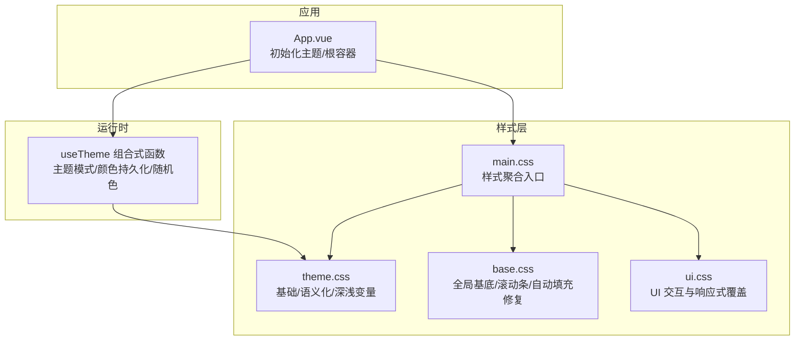
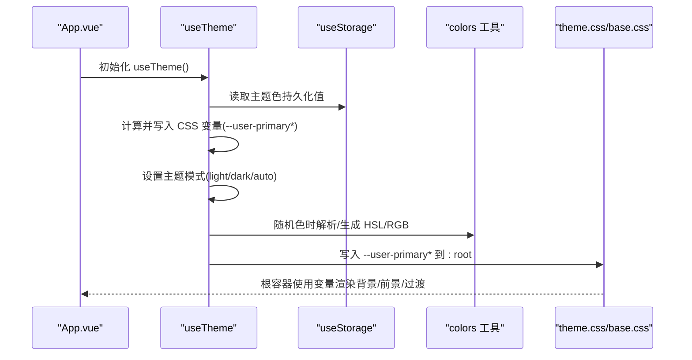
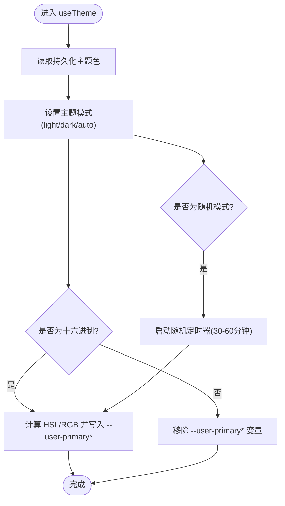
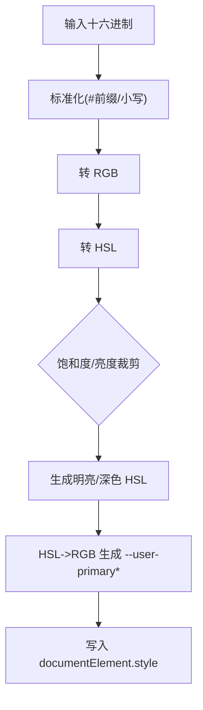
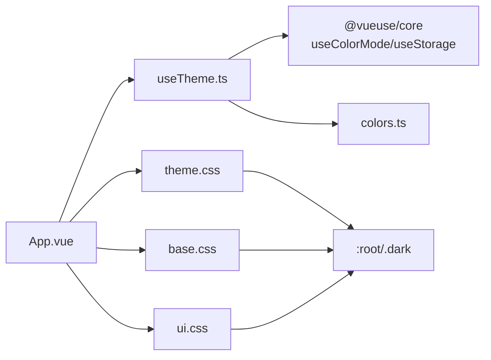

# 主题系统

<cite>
**本文引用的文件**
- [apps/frontend/src/composables/useTheme.ts](file://apps/frontend/src/composables/useTheme.ts)
- [apps/frontend/src/lib/colors.ts](file://apps/frontend/src/lib/colors.ts)
- [apps/frontend/src/styles/theme.css](file://apps/frontend/src/styles/theme.css)
- [apps/frontend/src/styles/base.css](file://apps/frontend/src/styles/base.css)
- [apps/frontend/src/styles/main.css](file://apps/frontend/src/styles/main.css)
- [apps/frontend/src/styles/ui.css](file://apps/frontend/src/styles/ui.css)
- [apps/frontend/src/App.vue](file://apps/frontend/src/App.vue)
- [apps/frontend/tests/composables/useTheme.spec.ts](file://apps/frontend/tests/composables/useTheme.spec.ts)
</cite>

## 目录
1. [简介](#简介)
2. [项目结构](#项目结构)
3. [核心组件](#核心组件)
4. [架构总览](#架构总览)
5. [详细组件分析](#详细组件分析)
6. [依赖关系分析](#依赖关系分析)
7. [性能考量](#性能考量)
8. [故障排查指南](#故障排查指南)
9. [结论](#结论)
10. [附录](#附录)

## 简介
本文件系统性阐述 Lumina Todo 的主题系统，包括颜色体系、主题切换机制、样式变量管理、动态切换与持久化、系统主题适配、CSS 变量使用与覆盖策略、组件级主题定制、深色/浅色差异处理与最佳实践，并提供扩展与品牌定制的实现思路。目标是帮助开发者与设计师在不破坏一致性的同时，灵活地进行主题扩展与品牌化。

## 项目结构
主题系统由“运行时主题控制”“样式变量层”“基础样式与覆盖层”三部分组成：
- 运行时主题控制：通过组合式函数集中管理主题模式（浅色/深色/自动）与用户主题色（支持随机），并持久化到本地存储。
- 样式变量层：以 CSS 自定义属性为核心，定义基础色板、语义化变量、动效参数等；深色/浅色两套变量，支持用户主题色覆盖。
- 基础样式与覆盖层：基础样式统一应用变量，UI 层样式按需覆盖或增强交互细节。



**图示来源**
- [apps/frontend/src/composables/useTheme.ts:188-247](file://apps/frontend/src/composables/useTheme.ts#L188-L247)
- [apps/frontend/src/styles/theme.css:1-146](file://apps/frontend/src/styles/theme.css#L1-L146)
- [apps/frontend/src/styles/base.css:1-89](file://apps/frontend/src/styles/base.css#L1-L89)
- [apps/frontend/src/styles/main.css:1-7](file://apps/frontend/src/styles/main.css#L1-L7)
- [apps/frontend/src/styles/ui.css:1-36](file://apps/frontend/src/styles/ui.css#L1-L36)
- [apps/frontend/src/App.vue:1-77](file://apps/frontend/src/App.vue#L1-L77)

**章节来源**
- [apps/frontend/src/styles/main.css:1-7](file://apps/frontend/src/styles/main.css#L1-L7)
- [apps/frontend/src/styles/theme.css:1-146](file://apps/frontend/src/styles/theme.css#L1-L146)
- [apps/frontend/src/styles/base.css:1-89](file://apps/frontend/src/styles/base.css#L1-L89)
- [apps/frontend/src/styles/ui.css:1-36](file://apps/frontend/src/styles/ui.css#L1-L36)
- [apps/frontend/src/App.vue:1-77](file://apps/frontend/src/App.vue#L1-L77)

## 核心组件
- 主题控制组合式函数：负责主题模式（浅色/深色/自动）、用户主题色（十六进制/随机）、持久化存储、随机色定时轮换。
- 颜色工具库：提供 CSS 变量读取、RGB/HSL 解析与转换、颜色混合等能力，支撑主题色生成与覆盖。
- 样式变量层：定义基础色板、语义化变量、动效参数；深色/浅色两套变量，支持用户主题色覆盖。
- 应用入口：在挂载时初始化主题，确保首屏即正确主题。

**章节来源**
- [apps/frontend/src/composables/useTheme.ts:1-248](file://apps/frontend/src/composables/useTheme.ts#L1-L248)
- [apps/frontend/src/lib/colors.ts:1-96](file://apps/frontend/src/lib/colors.ts#L1-L96)
- [apps/frontend/src/styles/theme.css:1-146](file://apps/frontend/src/styles/theme.css#L1-L146)
- [apps/frontend/src/App.vue:1-77](file://apps/frontend/src/App.vue#L1-L77)

## 架构总览
主题系统采用“运行时控制 + CSS 变量层”的分层设计：
- 运行时层：useTheme 负责监听主题模式与用户主题色变化，计算并写入 CSS 变量，同时维护随机色定时器。
- 样式层：theme.css 定义默认变量与深/浅两套覆盖；base.css 提供全局基底与兼容性修复；ui.css 提供 UI 交互细节覆盖。
- 应用层：App.vue 在启动时调用 useTheme，根容器使用变量驱动背景/前景色与过渡效果。



**图示来源**
- [apps/frontend/src/App.vue:9-12](file://apps/frontend/src/App.vue#L9-L12)
- [apps/frontend/src/composables/useTheme.ts:188-247](file://apps/frontend/src/composables/useTheme.ts#L188-L247)
- [apps/frontend/src/lib/colors.ts:11-96](file://apps/frontend/src/lib/colors.ts#L11-L96)
- [apps/frontend/src/styles/theme.css:1-146](file://apps/frontend/src/styles/theme.css#L1-L146)

## 详细组件分析

### 主题控制组合式函数 useTheme
- 主题模式：基于 useColorMode 管理 class 属性（light/dark/auto），默认浅色为空字符串，深色为 'dark'。
- 用户主题色：支持十六进制（含简写/#规范化）、随机模式；随机模式下每 30-60 分钟随机切换一次。
- 变量注入：将用户主题色转换为 HSL，限定饱和度/亮度范围，生成“明亮/深色”两套变量及对应前景色，写入 :root。
- 持久化：使用 useStorage 将主题色保存在本地存储，重启后恢复。



**图示来源**
- [apps/frontend/src/composables/useTheme.ts:188-247](file://apps/frontend/src/composables/useTheme.ts#L188-L247)

**章节来源**
- [apps/frontend/src/composables/useTheme.ts:1-248](file://apps/frontend/src/composables/useTheme.ts#L1-L248)

### 颜色工具库 colors
- CSS 变量读取：在浏览器环境读取 :root 上的 CSS 变量值。
- RGB/HSL 解析：支持逗号/空格分隔的 HSL 字符串解析。
- HSL<->RGB 转换：提供数学公式实现双向转换。
- 颜色混合：线性插值混合两个 RGB 值，用于派生中间色调。



**图示来源**
- [apps/frontend/src/lib/colors.ts:11-96](file://apps/frontend/src/lib/colors.ts#L11-L96)
- [apps/frontend/src/composables/useTheme.ts:132-186](file://apps/frontend/src/composables/useTheme.ts#L132-L186)

**章节来源**
- [apps/frontend/src/lib/colors.ts:1-96](file://apps/frontend/src/lib/colors.ts#L1-L96)

### 样式变量层 theme.css
- 基础变量：背景/前景/卡片/弹出层/边框/输入/环形高亮等。
- 主题色变量：优先使用用户主题色（--user-primary*），否则回退到默认值。
- 深/浅两套变量：深色模式下降低极端对比度，提升可读性与沉浸感。
- 语义化变量：文本主次色、完成态、成功/错误等。
- 动效参数：统一过渡曲线与持续时间，全局生效，可通过 .no-transition 排除特定元素。

```mermaid
classDiagram
class 主题变量 {
"+基础 : background, foreground, card, popover"
"+主题 : primary, primary-hover, primary-foreground, primary-rgb"
"+次要 : secondary, muted, accent"
"+警告 : destructive"
"+边界 : border, input, ring"
"+圆角 : radius, border-radius"
"+动效 : theme-transition"
"+语义 : text-color, text-secondary, todo-completed, success, error"
}
class 深色覆盖 {
"+同名变量的深色版本"
"+降低极端对比度"
}
主题变量 <|-- 深色覆盖
```

**图示来源**
- [apps/frontend/src/styles/theme.css:1-146](file://apps/frontend/src/styles/theme.css#L1-L146)

**章节来源**
- [apps/frontend/src/styles/theme.css:1-146](file://apps/frontend/src/styles/theme.css#L1-L146)

### 基础样式与覆盖层 base.css/ui.css
- base.css：引入字体、Tailwind 基础/组件/工具；全局 body 使用径向渐变背景，随主题色微妙变化；修复浏览器自动填充的背景与文字颜色；自定义滚动条样式。
- ui.css：输入容器聚焦高亮、移动端响应式调整、AI 相关交互细节等。

**章节来源**
- [apps/frontend/src/styles/base.css:1-89](file://apps/frontend/src/styles/base.css#L1-L89)
- [apps/frontend/src/styles/ui.css:1-36](file://apps/frontend/src/styles/ui.css#L1-L36)

### 应用入口 App.vue
- 启动时调用 useTheme 初始化主题。
- 根容器使用变量驱动背景/前景色与过渡，Wails 平台下添加平台类名以启用特定样式。

**章节来源**
- [apps/frontend/src/App.vue:1-77](file://apps/frontend/src/App.vue#L1-L77)

## 依赖关系分析
- useTheme 依赖 @vueuse/core 的 useColorMode/useStorage，依赖 colors 工具进行颜色计算。
- 样式层通过 CSS 变量与 :root/.dark 类名耦合，UI 层样式通过类名与变量间接耦合。
- App.vue 作为入口依赖 useTheme，间接依赖样式层。



**图示来源**
- [apps/frontend/src/composables/useTheme.ts:1-248](file://apps/frontend/src/composables/useTheme.ts#L1-L248)
- [apps/frontend/src/lib/colors.ts:1-96](file://apps/frontend/src/lib/colors.ts#L1-L96)
- [apps/frontend/src/styles/theme.css:1-146](file://apps/frontend/src/styles/theme.css#L1-L146)
- [apps/frontend/src/styles/base.css:1-89](file://apps/frontend/src/styles/base.css#L1-L89)
- [apps/frontend/src/styles/ui.css:1-36](file://apps/frontend/src/styles/ui.css#L1-L36)
- [apps/frontend/src/App.vue:1-77](file://apps/frontend/src/App.vue#L1-L77)

**章节来源**
- [apps/frontend/src/composables/useTheme.ts:1-248](file://apps/frontend/src/composables/useTheme.ts#L1-L248)
- [apps/frontend/src/App.vue:1-77](file://apps/frontend/src/App.vue#L1-L77)

## 性能考量
- 变量驱动渲染：通过 CSS 变量与 class 切换实现主题切换，避免重排与重绘风暴。
- 动效统一：全局过渡参数统一，可按需通过 .no-transition 排除复杂场景（如图表/进度条）以减少动画开销。
- 随机色定时：随机主题色切换周期较长（30-60 分钟），降低对专注度的影响。
- 字体与滚动条：外部字体按需加载，滚动条样式轻量，不影响主线程。

[本节为通用建议，无需具体文件分析]

## 故障排查指南
- 主题未生效
  - 检查 App.vue 是否已调用 useTheme 初始化。
  - 确认浏览器支持 CSS 变量，且 :root 未被其他样式覆盖。
- 深色模式异常
  - 确认根元素存在 'dark' class 或系统主题自动切换生效。
  - 检查 --user-primary* 是否被意外移除或覆盖。
- 随机主题色不更新
  - 确认主题色为 'random'，并检查定时器是否被清理。
  - 查看控制台是否有异常中断定时器。
- 浏览器自动填充颜色异常
  - base.css 中已针对 -webkit-autofill 做了颜色修复，确认未被其他样式覆盖。

**章节来源**
- [apps/frontend/src/App.vue:1-77](file://apps/frontend/src/App.vue#L1-L77)
- [apps/frontend/src/composables/useTheme.ts:200-226](file://apps/frontend/src/composables/useTheme.ts#L200-L226)
- [apps/frontend/src/styles/base.css:32-42](file://apps/frontend/src/styles/base.css#L32-L42)

## 结论
Lumina Todo 的主题系统以 CSS 变量为核心，结合运行时组合式函数实现“可定制、可持久化、可扩展”的主题体验。通过语义化变量与深/浅两套覆盖，兼顾可访问性与视觉舒适度；通过随机主题色与定时切换，平衡个性化与专注力。整体架构清晰、耦合度低，便于进一步扩展品牌色与组件级主题定制。

[本节为总结，无需具体文件分析]

## 附录

### 设计原则与语义化命名
- 设计原则
  - 低对比度与柔和过渡：深色模式降低极端对比，避免眩光。
  - 可访问性：保证文本对比度与色彩安全；提供减少动效偏好支持。
  - 一致性：语义化变量贯穿全局，组件仅消费变量，避免硬编码颜色。
- 语义化命名
  - 文本主次色：--text-color / --text-secondary
  - 成功/错误：--success / --error
  - 完成态：--todo-completed
  - 图表色：--chart-1..5
  - AI 相关：--ai-* 系列变量

**章节来源**
- [apps/frontend/src/styles/theme.css:50-67](file://apps/frontend/src/styles/theme.css#L50-L67)
- [apps/frontend/src/styles/theme.css:101-116](file://apps/frontend/src/styles/theme.css#L101-L116)

### 深色模式与浅色模式差异
- 背景/前景/卡片/弹出层：深色模式整体提亮，避免死黑带来的压迫感。
- 主题色：深色模式保留活力但更沉稳，避免荧光感。
- 边框/输入/环形高亮：深色模式采用更细腻灰度，降低视觉负担。
- 文本与完成态：深色模式降低亮度，提升可读性。

**章节来源**
- [apps/frontend/src/styles/theme.css:69-117](file://apps/frontend/src/styles/theme.css#L69-L117)

### 动态切换与持久化
- 动态切换：useTheme 监听主题模式与主题色变化，即时写入 CSS 变量。
- 持久化：主题色通过 useStorage 存储，刷新后恢复。
- 系统主题适配：useColorMode 支持 auto，跟随系统深色/浅色切换。

**章节来源**
- [apps/frontend/src/composables/useTheme.ts:188-226](file://apps/frontend/src/composables/useTheme.ts#L188-L226)

### CSS 变量使用与样式覆盖策略
- 使用方式
  - 全局：:root 定义基础变量，组件通过 hsl(var(--variable)) 使用。
  - 深色：.dark 下提供覆盖变量，确保深色一致性。
  - 用户主题色：--user-primary* 优先于默认变量。
- 覆盖策略
  - 基础样式：通过 base.css 统一应用变量。
  - UI 交互：通过 ui.css 对输入容器、滚动条、移动端等做细节覆盖。
  - 组件定制：组件内部可局部覆盖变量或使用语义化变量，避免硬编码。

**章节来源**
- [apps/frontend/src/styles/theme.css:1-146](file://apps/frontend/src/styles/theme.css#L1-L146)
- [apps/frontend/src/styles/base.css:9-43](file://apps/frontend/src/styles/base.css#L9-L43)
- [apps/frontend/src/styles/ui.css:1-36](file://apps/frontend/src/styles/ui.css#L1-L36)

### 组件主题定制示例
- 输入容器聚焦高亮：基于 --primary 变量实现统一高亮与阴影。
- 滚动条：根据 --muted-foreground / --border 动态生成浅/深色滚动条。
- 移动端：在小屏下调整布局与字号，同时保持变量一致。

**章节来源**
- [apps/frontend/src/styles/ui.css:5-35](file://apps/frontend/src/styles/ui.css#L5-L35)
- [apps/frontend/src/styles/base.css:72-89](file://apps/frontend/src/styles/base.css#L72-L89)

### 主题扩展与品牌定制
- 扩展步骤
  - 在 :root 下新增品牌变量（如 --brand-primary）。
  - 在 .dark 下提供深色覆盖。
  - 在组件中优先使用语义化变量或品牌变量，避免直接绑定默认变量。
- 品牌定制
  - 通过 useTheme 注入 --user-primary*，再由 theme.css 生成派生变量，确保品牌色贯穿全站。
  - 如需多品牌，可增加多组变量并在运行时切换。

**章节来源**
- [apps/frontend/src/styles/theme.css:1-146](file://apps/frontend/src/styles/theme.css#L1-L146)
- [apps/frontend/src/composables/useTheme.ts:132-186](file://apps/frontend/src/composables/useTheme.ts#L132-L186)

### 测试参考
- useTheme.spec.ts：对 useTheme 的行为进行单元测试，验证主题模式与主题色的持久化与切换逻辑。

**章节来源**
- [apps/frontend/tests/composables/useTheme.spec.ts:1-30](file://apps/frontend/tests/composables/useTheme.spec.ts#L1-L30)