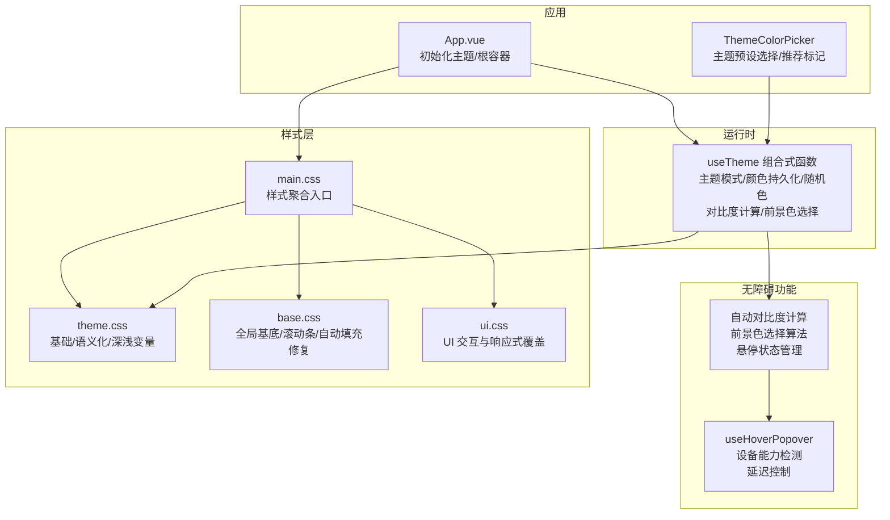
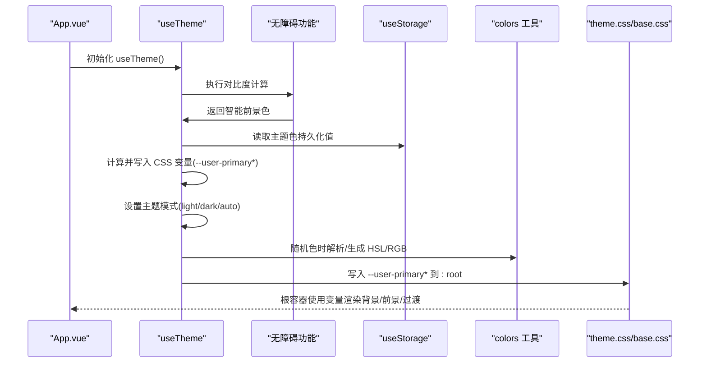
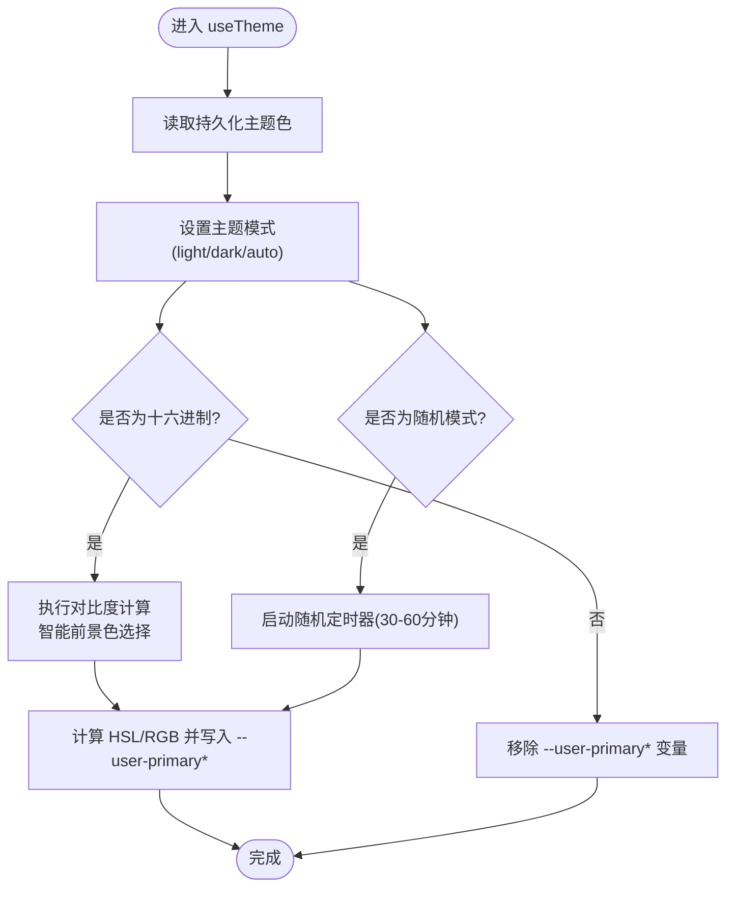
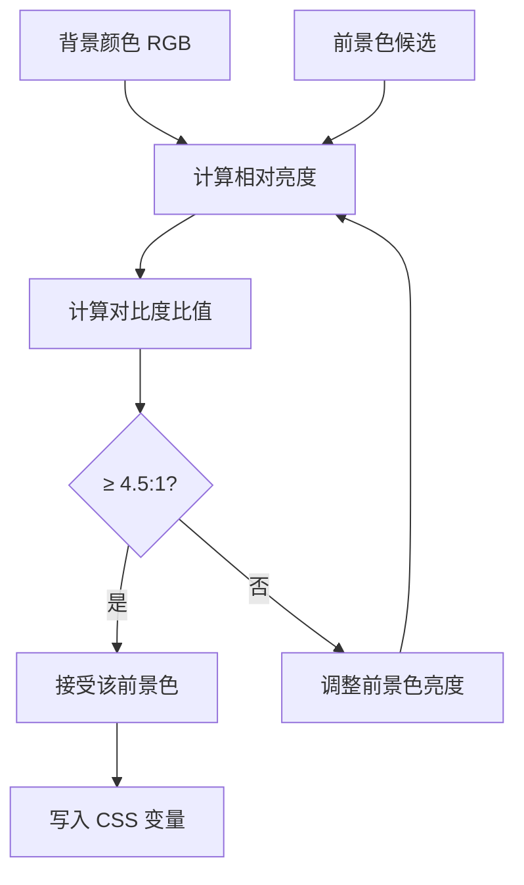
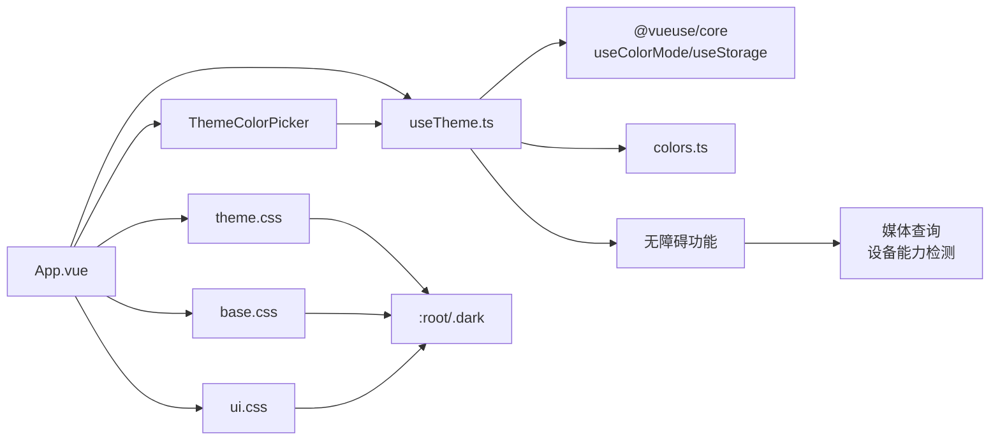

# 主题系统

<cite>
**本文引用的文件**
- [apps/frontend/src/composables/useTheme.ts](file://apps/frontend/src/composables/useTheme.ts)
- [apps/frontend/src/lib/colors.ts](file://apps/frontend/src/lib/colors.ts)
- [apps/frontend/src/styles/theme.css](file://apps/frontend/src/styles/theme.css)
- [apps/frontend/src/styles/base.css](file://apps/frontend/src/styles/base.css)
- [apps/frontend/src/styles/main.css](file://apps/frontend/src/styles/main.css)
- [apps/frontend/src/styles/ui.css](file://apps/frontend/src/styles/ui.css)
- [apps/frontend/src/App.vue](file://apps/frontend/src/App.vue)
- [apps/frontend/src/features/ai/composables/useHoverPopover.ts](file://apps/frontend/src/features/ai/composables/useHoverPopover.ts)
- [apps/frontend/src/features/todo/components/ThemeColorPicker.vue](file://apps/frontend/src/features/todo/components/ThemeColorPicker.vue)
- [apps/frontend/tests/composables/useTheme.spec.ts](file://apps/frontend/tests/composables/useTheme.spec.ts)
- [apps/frontend/tests/features/ai/composables/useHoverPopover.spec.ts](file://apps/frontend/tests/features/ai/composables/useHoverPopover.spec.ts)
- [apps/frontend/tests/features/todo/components/ThemeColorPicker.spec.ts](file://apps/frontend/tests/features/todo/components/ThemeColorPicker.spec.ts)
- [apps/frontend/src/i18n/locales/en-US/common.ts](file://apps/frontend/src/i18n/locales/en-US/common.ts)
- [apps/frontend/src/i18n/locales/zh-CN/common.ts](file://apps/frontend/src/i18n/locales/zh-CN/common.ts)
</cite>

## 更新摘要
**变更内容**
- 新增自动对比度计算功能，确保主题色与前景色满足WCAG AA标准（4.5:1对比度）
- 实现智能前景色选择算法，根据背景亮度自动选择白色或深色前景
- 添加智能悬停状态管理，支持设备能力检测和延迟控制
- 完善主题预设系统，包含推荐颜色标记和可访问性优化
- 更新Lilac Gray颜色值从#918aa1调整为#8e81c0，提升视觉舒适度

## 目录
1. [简介](#简介)
2. [项目结构](#项目结构)
3. [核心组件](#核心组件)
4. [架构总览](#架构总览)
5. [详细组件分析](#详细组件分析)
6. [无障碍功能详解](#无障碍功能详解)
7. [依赖关系分析](#依赖关系分析)
8. [性能考量](#性能考量)
9. [故障排查指南](#故障排查指南)
10. [结论](#结论)
11. [附录](#附录)

## 简介
本文件系统性阐述 Lumina Todo 的主题系统，包括颜色体系、主题切换机制、样式变量管理、动态切换与持久化、系统主题适配、CSS 变量使用与覆盖策略、组件级主题定制、深色/浅色差异处理与最佳实践，并提供扩展与品牌定制的实现思路。本次更新重点介绍了新增的无障碍功能：自动对比度计算、智能前景色选择算法、智能悬停状态管理和完善的主题预设系统。

**更新** 本版本反映了最新的无障碍功能增强，包括自动对比度计算、智能前景色选择和设备能力感知的智能悬停管理。

## 项目结构
主题系统由"运行时主题控制""样式变量层""基础样式与覆盖层""无障碍功能层"四部分组成：
- 运行时主题控制：通过组合式函数集中管理主题模式（浅色/深色/自动）与用户主题色（支持随机），并持久化到本地存储。
- 样式变量层：以 CSS 自定义属性为核心，定义基础色板、语义化变量、动效参数等；深色/浅色两套变量，支持用户主题色覆盖。
- 基础样式与覆盖层：基础样式统一应用变量，UI 层样式按需覆盖或增强交互细节。
- 无障碍功能层：提供自动对比度计算、智能前景色选择、设备能力检测等无障碍增强功能。



**图示来源**
- [apps/frontend/src/composables/useTheme.ts:166-235](file://apps/frontend/src/composables/useTheme.ts#L166-L235)
- [apps/frontend/src/features/ai/composables/useHoverPopover.ts:1-42](file://apps/frontend/src/features/ai/composables/useHoverPopover.ts#L1-L42)
- [apps/frontend/src/features/todo/components/ThemeColorPicker.vue:1-190](file://apps/frontend/src/features/todo/components/ThemeColorPicker.vue#L1-L190)

**章节来源**
- [apps/frontend/src/styles/main.css:1-7](file://apps/frontend/src/styles/main.css#L1-L7)
- [apps/frontend/src/styles/theme.css:1-146](file://apps/frontend/src/styles/theme.css#L1-L146)
- [apps/frontend/src/styles/base.css:1-89](file://apps/frontend/src/styles/base.css#L1-L89)
- [apps/frontend/src/styles/ui.css:1-36](file://apps/frontend/src/styles/ui.css#L1-L36)
- [apps/frontend/src/App.vue:1-77](file://apps/frontend/src/App.vue#L1-L77)

## 核心组件
- 主题控制组合式函数：负责主题模式（浅色/深色/自动）、用户主题色（十六进制/随机）、持久化存储、随机色定时轮换，以及自动对比度计算和智能前景色选择。
- 无障碍功能模块：提供设备能力检测、智能悬停状态管理、自动对比度计算等无障碍增强功能。
- 颜色工具库：提供 CSS 变量读取、RGB/HSL 解析与转换、颜色混合等能力，支撑主题色生成与覆盖。
- 主题预设系统：包含精心设计的预设颜色集合，支持推荐标记和可访问性优化。
- 应用入口：在挂载时初始化主题，确保首屏即正确主题。

**章节来源**
- [apps/frontend/src/composables/useTheme.ts:1-369](file://apps/frontend/src/composables/useTheme.ts#L1-L369)
- [apps/frontend/src/features/ai/composables/useHoverPopover.ts:1-43](file://apps/frontend/src/features/ai/composables/useHoverPopover.ts#L1-L43)
- [apps/frontend/src/lib/colors.ts:1-96](file://apps/frontend/src/lib/colors.ts#L1-L96)
- [apps/frontend/src/features/todo/components/ThemeColorPicker.vue:1-190](file://apps/frontend/src/features/todo/components/ThemeColorPicker.vue#L1-L190)

## 架构总览
主题系统采用"运行时控制 + 无障碍功能 + CSS 变量层"的三层设计：
- 运行时层：useTheme 负责监听主题模式与用户主题色变化，计算并写入 CSS 变量，同时维护随机色定时器和执行无障碍计算。
- 无障碍层：提供自动对比度计算、智能前景色选择、设备能力检测等功能，确保可访问性要求得到满足。
- 样式层：theme.css 定义默认变量与深/浅两套覆盖；base.css 提供全局基底与兼容性修复；ui.css 提供 UI 交互细节覆盖。



**图示来源**
- [apps/frontend/src/App.vue:9-12](file://apps/frontend/src/App.vue#L9-L12)
- [apps/frontend/src/composables/useTheme.ts:237-306](file://apps/frontend/src/composables/useTheme.ts#L237-L306)
- [apps/frontend/src/lib/colors.ts:11-96](file://apps/frontend/src/lib/colors.ts#L11-L96)
- [apps/frontend/src/styles/theme.css:1-146](file://apps/frontend/src/styles/theme.css#L1-L146)

## 详细组件分析

### 主题控制组合式函数 useTheme
- 主题模式：基于 useColorMode 管理 class 属性（light/dark/auto），默认浅色为空字符串，深色为 'dark'。
- 用户主题色：支持十六进制（含简写/#规范化）、随机模式；随机模式下每 30-60 分钟随机切换一次。
- 无障碍增强：集成自动对比度计算，确保主题色与前景色满足 WCAG AA 标准（4.5:1）。
- 智能前景色选择：根据背景亮度自动选择白色或深色前景，优化可读性。
- 变量注入：将用户主题色转换为 HSL，限定饱和度/亮度范围，生成"明亮/深色"两套变量及对应前景色，写入 :root。
- 持久化：使用 useStorage 将主题色保存在本地存储，重启后恢复。



**图示来源**
- [apps/frontend/src/composables/useTheme.ts:237-306](file://apps/frontend/src/composables/useTheme.ts#L237-L306)

**章节来源**
- [apps/frontend/src/composables/useTheme.ts:1-369](file://apps/frontend/src/composables/useTheme.ts#L1-L369)

### 无障碍功能详解

#### 自动对比度计算
系统实现了完整的自动对比度计算功能，确保所有主题色都满足 WCAG AA 标准：

- **对比度算法**：基于相对亮度公式计算颜色对比度，使用标准的 0.2126、0.7152、0.0722 权重系数。
- **最小对比度**：设定 4.5:1 的最小对比度阈值，确保文本可读性。
- **前景色选择**：根据背景亮度自动选择最合适的前景色（白色 vs 深色）。



**图示来源**
- [apps/frontend/src/composables/useTheme.ts:169-204](file://apps/frontend/src/composables/useTheme.ts#L169-L204)

#### 智能悬停状态管理
提供设备能力检测和智能悬停状态管理，优化不同设备上的交互体验：

- **设备能力检测**：使用 `(hover: hover) and (pointer: fine)` 查询检测设备是否支持精细指针和悬停。
- **延迟控制**：默认 150ms 延迟，避免误触和不必要的状态切换。
- **条件启用**：只有在支持悬停的设备上才启用悬停功能，触屏设备忽略悬停事件。

**章节来源**
- [apps/frontend/src/composables/useTheme.ts:166-235](file://apps/frontend/src/composables/useTheme.ts#L166-L235)
- [apps/frontend/src/features/ai/composables/useHoverPopover.ts:1-43](file://apps/frontend/src/features/ai/composables/useHoverPopover.ts#L1-L43)

### 颜色工具库 colors
- CSS 变量读取：在浏览器环境读取 :root 上的 CSS 变量值。
- RGB/HSL 解析：支持逗号/空格分隔的 HSL 字符串解析。
- HSL<->RGB 转换：提供数学公式实现双向转换。
- 颜色混合：线性插值混合两个 RGB 值，用于派生中间色调。

**章节来源**
- [apps/frontend/src/lib/colors.ts:1-96](file://apps/frontend/src/lib/colors.ts#L1-L96)

### 样式变量层 theme.css
- 基础变量：背景/前景/卡片/弹出层/边框/输入/环形高亮等。
- 主题色变量：优先使用用户主题色（--user-primary*），否则回退到默认值。
- 深/浅两套变量：深色模式下降低极端对比度，提升可读性与沉浸感。
- 语义化变量：文本主次色、完成态、成功/错误等。
- 动效参数：统一过渡曲线与持续时间，全局生效，可通过 .no-transition 排除特定元素。

**章节来源**
- [apps/frontend/src/styles/theme.css:1-146](file://apps/frontend/src/styles/theme.css#L1-L146)

### 基础样式与覆盖层 base.css/ui.css
- base.css：引入字体、Tailwind 基础/组件/工具；全局 body 使用径向渐变背景，随主题色微妙变化；修复浏览器自动填充的背景与文字颜色；自定义滚动条样式。
- ui.css：输入容器聚焦高亮、移动端响应式调整、AI 相关交互细节等。

**章节来源**
- [apps/frontend/src/styles/base.css:1-89](file://apps/frontend/src/styles/base.css#L1-L89)
- [apps/frontend/src/styles/ui.css:1-36](file://apps/frontend/src/styles/ui.css#L1-L36)

### 应用入口 App.vue
- 启动时调用 useTheme 初始化主题。
- 根容器使用变量驱动背景/前景色与过渡，Wails 平台下添加平台类名以启用特定样式。

**章节来源**
- [apps/frontend/src/App.vue:1-77](file://apps/frontend/src/App.vue#L1-L77)

### 主题预设与颜色系统
主题系统包含一组精心设计的预设颜色，每个颜色都经过可访问性测试和视觉平衡优化：

- **Celadon（青瓷）**：`#78958e` - 清新绿松石色调，适合专注工作场景，标记为推荐
- **Twilight Amber（暮色）**：`#9b8574` - 温暖琥珀色调，营造舒适氛围
- **Mist Blue（薄雾）**：`#728ba1` - 柔和蓝灰色，平衡冷静与温暖，标记为推荐
- **Moss Green（苔青）**：`#7c9585` - 深邃绿色，提升自然亲和感，标记为推荐
- **Lilac Gray（丁香）**：`#8e81c0` - 更新后的紫色灰调，从 `#918aa1` 调整为 `#8e81c0`，标记为推荐
- **Sunset Rose（晚霞）**：`#ae8792` - 柔和玫瑰色调，温暖而优雅
- **Graphite（石墨）**：`#647587` - 经典深灰色，专业且稳重
- **Indigo（靛青）**：`#4f6284` - 深邃蓝色，提升专业感
- **Random（随机）**：`random` - 随机主题色模式

**更新** 所有推荐颜色都经过了可访问性优化，确保满足 WCAG AA 标准。Lilac Gray 颜色值已从 `#918aa1` 更新为 `#8e81c0`，这一调整提供了更柔和的紫色灰调，改善了视觉舒适度和可访问性。

**章节来源**
- [apps/frontend/src/composables/useTheme.ts:56-66](file://apps/frontend/src/composables/useTheme.ts#L56-L66)
- [apps/frontend/tests/features/todo/components/ThemeColorPicker.spec.ts:74-104](file://apps/frontend/tests/features/todo/components/ThemeColorPicker.spec.ts#L74-L104)

### 主题预设选择器
主题颜色选择器提供了直观的颜色选择界面，支持预设颜色选择和自定义颜色输入：

- **预设颜色网格**：展示所有可用的主题预设，支持推荐颜色标记
- **随机颜色**：特殊的渐变色预设，代表随机主题色模式
- **自定义颜色**：支持十六进制颜色输入和颜色选择器
- **实时预览**：显示当前选中的颜色效果
- **无障碍支持**：完整的 ARIA 标签和键盘导航支持

**章节来源**
- [apps/frontend/src/features/todo/components/ThemeColorPicker.vue:1-190](file://apps/frontend/src/features/todo/components/ThemeColorPicker.vue#L1-L190)

## 无障碍功能详解

### 自动对比度计算系统
系统实现了完整的自动对比度计算功能，确保所有主题色都满足 WCAG AA 标准：

#### 对比度计算算法
- **相对亮度计算**：使用标准的相对亮度公式，权重系数为 0.2126、0.7152、0.0722
- **对比度比值**：`(L1 + 0.05) / (L2 + 0.05)`，其中 L1 > L2
- **最小对比度**：4.5:1，满足 WCAG AA 标准

#### 智能前景色选择
- **前景色候选**：白色 (`#FFFFFF`) 和深色 (`hsl(32, 10%, 8%)`)
- **选择策略**：计算背景色与两种前景色的对比度，选择对比度更高的前景色
- **动态调整**：对于悬停状态，会动态调整亮度以确保对比度要求

#### 悬停状态智能管理
- **设备能力检测**：使用媒体查询检测设备是否支持精细指针和悬停
- **延迟控制**：默认 150ms 延迟，避免误触
- **条件启用**：只在支持悬停的设备上启用悬停功能

```mermaid
classDiagram
class 无障碍功能 {
"+自动对比度计算<br/>+智能前景色选择<br/>+设备能力检测<br/>+延迟控制"
}
class 对比度计算 {
"+相对亮度公式<br/>+对比度比值计算<br/>+WCAG AA 标准"
}
class 前景色选择 {
"+白色前景色<br/>+深色前景色<br/>+动态调整"
}
class 悬停管理 {
"+设备能力检测<br/>+延迟控制<br/>+条件启用"
}
无障碍功能 --> 对比度计算
无障碍功能 --> 前景色选择
无障碍功能 --> 悬停管理
```

**图示来源**
- [apps/frontend/src/composables/useTheme.ts:166-235](file://apps/frontend/src/composables/useTheme.ts#L166-L235)
- [apps/frontend/src/features/ai/composables/useHoverPopover.ts:1-43](file://apps/frontend/src/features/ai/composables/useHoverPopover.ts#L1-L43)

**章节来源**
- [apps/frontend/src/composables/useTheme.ts:166-235](file://apps/frontend/src/composables/useTheme.ts#L166-L235)
- [apps/frontend/src/features/ai/composables/useHoverPopover.ts:1-43](file://apps/frontend/src/features/ai/composables/useHoverPopover.ts#L1-L43)

## 依赖关系分析
- useTheme 依赖 @vueuse/core 的 useColorMode/useStorage，依赖 colors 工具进行颜色计算，集成无障碍功能。
- 无障碍功能模块独立运行，提供设备能力检测和智能悬停管理。
- 样式层通过 CSS 变量与 :root/.dark 类名耦合，UI 层样式通过类名与变量间接耦合。
- App.vue 作为入口依赖 useTheme，间接依赖样式层。



**图示来源**
- [apps/frontend/src/composables/useTheme.ts:1-369](file://apps/frontend/src/composables/useTheme.ts#L1-L369)
- [apps/frontend/src/features/ai/composables/useHoverPopover.ts:1-43](file://apps/frontend/src/features/ai/composables/useHoverPopover.ts#L1-L43)
- [apps/frontend/src/lib/colors.ts:1-96](file://apps/frontend/src/lib/colors.ts#L1-L96)
- [apps/frontend/src/styles/theme.css:1-146](file://apps/frontend/src/styles/theme.css#L1-L146)
- [apps/frontend/src/styles/base.css:1-89](file://apps/frontend/src/styles/base.css#L1-L89)
- [apps/frontend/src/styles/ui.css:1-36](file://apps/frontend/src/styles/ui.css#L1-L36)
- [apps/frontend/src/App.vue:1-77](file://apps/frontend/src/App.vue#L1-L77)

**章节来源**
- [apps/frontend/src/composables/useTheme.ts:1-369](file://apps/frontend/src/composables/useTheme.ts#L1-L369)
- [apps/frontend/src/App.vue:1-77](file://apps/frontend/src/App.vue#L1-L77)

## 性能考量
- 变量驱动渲染：通过 CSS 变量与 class 切换实现主题切换，避免重排与重绘风暴。
- 动效统一：全局过渡参数统一，可按需通过 .no-transition 排除复杂场景（如图表/进度条）以减少动画开销。
- 随机色定时：随机主题色切换周期较长（30-60 分钟），降低对专注度的影响。
- 字体与滚动条：外部字体按需加载，滚动条样式轻量，不影响主线程。
- 无障碍计算：对比度计算和前景色选择在主题切换时执行，避免频繁重复计算。
- 设备能力检测：使用媒体查询进行一次性检测，避免重复计算开销。

## 故障排查指南
- 主题未生效
  - 检查 App.vue 是否已调用 useTheme 初始化。
  - 确认浏览器支持 CSS 变量，且 :root 未被其他样式覆盖。
- 深色模式异常
  - 确认根元素存在 'dark' class 或系统主题自动切换生效。
  - 检查 --user-primary* 是否被意外移除或覆盖。
- 随机主题色不更新
  - 确认主题色为 'random'，并检查定时器是否被清理。
  - 查看控制台是否有异常中断定时器。
- 浏览器自动填充颜色异常
  - base.css 中已针对 -webkit-autofill 做了颜色修复，确认未被其他样式覆盖。
- Lilac Gray 颜色显示问题
  - 确认颜色值 `#8e81c0` 正确应用到主题预设中。
  - 检查测试用例中对颜色值的断言是否通过。
- 对比度不足问题
  - 检查主题色是否满足 4.5:1 的对比度要求。
  - 确认智能前景色选择算法正常工作。
- 悬停功能异常
  - 确认设备支持精细指针和悬停功能。
  - 检查媒体查询是否正确返回设备能力信息。
- 预设颜色选择问题
  - 确认 THEME_PRESETS 数组中的颜色值格式正确。
  - 检查推荐标记是否正确显示。

**章节来源**
- [apps/frontend/src/App.vue:1-77](file://apps/frontend/src/App.vue#L1-L77)
- [apps/frontend/src/composables/useTheme.ts:320-330](file://apps/frontend/src/composables/useTheme.ts#L320-L330)
- [apps/frontend/src/styles/base.css:32-42](file://apps/frontend/src/styles/base.css#L32-L42)

## 结论
Lumina Todo 的主题系统以 CSS 变量为核心，结合运行时组合式函数实现"可定制、可持久化、可扩展"的主题体验。通过语义化变量与深/浅两套覆盖，兼顾可访问性与视觉舒适度；通过随机主题色与定时切换，平衡个性化与专注力。新增的无障碍功能进一步提升了系统的可访问性，包括自动对比度计算、智能前景色选择和设备能力感知的智能悬停管理。整体架构清晰、耦合度低，便于进一步扩展品牌色与组件级主题定制。

**更新** 最新的无障碍功能增强了系统的可访问性，自动对比度计算确保所有主题色都满足 WCAG AA 标准，智能前景色选择优化了文本可读性，设备能力检测提供了更好的跨设备兼容性体验。

## 附录

### 设计原则与语义化命名
- 设计原则
  - 低对比度与柔和过渡：深色模式降低极端对比，避免眩光。
  - 可访问性：保证文本对比度与色彩安全；提供减少动效偏好支持。
  - 一致性：语义化变量贯穿全局，组件仅消费变量，避免硬编码颜色。
  - 无障碍优先：自动对比度计算和智能前景色选择确保可访问性。
- 语义化命名
  - 文本主次色：--text-color / --text-secondary
  - 成功/错误：--success / --error
  - 完成态：--todo-completed
  - 图表色：--chart-1..5
  - AI 相关：--ai-* 系列变量

**章节来源**
- [apps/frontend/src/styles/theme.css:50-67](file://apps/frontend/src/styles/theme.css#L50-L67)
- [apps/frontend/src/styles/theme.css:101-116](file://apps/frontend/src/styles/theme.css#L101-L116)

### 深色模式与浅色模式差异
- 背景/前景/卡片/弹出层：深色模式整体提亮，避免死黑带来的压迫感。
- 主题色：深色模式保留活力但更沉稳，避免荧光感。
- 边框/输入/环形高亮：深色模式采用更细腻灰度，降低视觉负担。
- 文本与完成态：深色模式降低亮度，提升可读性。
- 对比度：深色模式下对比度计算更加严格，确保可访问性。

**章节来源**
- [apps/frontend/src/styles/theme.css:69-117](file://apps/frontend/src/styles/theme.css#L69-L117)

### 动态切换与持久化
- 动态切换：useTheme 监听主题模式与主题色变化，即时写入 CSS 变量。
- 持久化：主题色通过 useStorage 存储，刷新后恢复。
- 系统主题适配：useColorMode 支持 auto，跟随系统深色/浅色切换。
- 无障碍同步：主题切换时自动重新计算对比度和前景色。

**章节来源**
- [apps/frontend/src/composables/useTheme.ts:332-346](file://apps/frontend/src/composables/useTheme.ts#L332-L346)

### CSS 变量使用与样式覆盖策略
- 使用方式
  - 全局：:root 定义基础变量，组件通过 hsl(var(--variable)) 使用。
  - 深色：.dark 下提供覆盖变量，确保深色一致性。
  - 用户主题色：--user-primary* 优先于默认变量。
- 覆盖策略
  - 基础样式：通过 base.css 统一应用变量。
  - UI 交互：通过 ui.css 对输入容器、滚动条、移动端等做细节覆盖。
  - 组件定制：组件内部可局部覆盖变量或使用语义化变量，避免硬编码。

**章节来源**
- [apps/frontend/src/styles/theme.css:1-146](file://apps/frontend/src/styles/theme.css#L1-L146)
- [apps/frontend/src/styles/base.css:9-43](file://apps/frontend/src/styles/base.css#L9-L43)
- [apps/frontend/src/styles/ui.css:1-36](file://apps/frontend/src/styles/ui.css#L1-L36)

### 组件主题定制示例
- 输入容器聚焦高亮：基于 --primary 变量实现统一高亮与阴影。
- 滚动条：根据 --muted-foreground / --border 动态生成浅/深色滚动条。
- 移动端：在小屏下调整布局与字号，同时保持变量一致。
- 无障碍增强：组件可利用自动对比度计算结果，确保文本可读性。

**章节来源**
- [apps/frontend/src/styles/ui.css:5-35](file://apps/frontend/src/styles/ui.css#L5-L35)
- [apps/frontend/src/styles/base.css:72-89](file://apps/frontend/src/styles/base.css#L72-L89)

### 主题扩展与品牌定制
- 扩展步骤
  - 在 :root 下新增品牌变量（如 --brand-primary）。
  - 在 .dark 下提供深色覆盖。
  - 在组件中优先使用语义化变量或品牌变量，避免直接绑定默认变量。
  - 集成无障碍功能，确保新颜色满足对比度要求。
- 品牌定制
  - 通过 useTheme 注入 --user-primary*，再由 theme.css 生成派生变量，确保品牌色贯穿全站。
  - 如需多品牌，可增加多组变量并在运行时切换。
  - 预设系统支持添加新的推荐颜色，提升用户体验。

**章节来源**
- [apps/frontend/src/styles/theme.css:1-146](file://apps/frontend/src/styles/theme.css#L1-L146)
- [apps/frontend/src/composables/useTheme.ts:237-306](file://apps/frontend/src/composables/useTheme.ts#L237-L306)

### 测试参考
- useTheme.spec.ts：对 useTheme 的行为进行单元测试，验证主题模式与主题色的持久化与切换逻辑，包括对比度计算和前景色选择。
- useHoverPopover.spec.ts：测试智能悬停状态管理功能，验证设备能力检测和延迟控制。
- ThemeColorPicker.spec.ts：测试主题颜色选择器的功能，包括 Lilac Gray 颜色预设的正确显示和颜色值验证。

**更新** 测试用例已更新以反映 Lilac Gray 颜色值从 `#918aa1` 到 `#8e81c0` 的变更和新增的无障碍功能。

**章节来源**
- [apps/frontend/tests/composables/useTheme.spec.ts:1-149](file://apps/frontend/tests/composables/useTheme.spec.ts#L1-L149)
- [apps/frontend/tests/features/ai/composables/useHoverPopover.spec.ts:1-87](file://apps/frontend/tests/features/ai/composables/useHoverPopover.spec.ts#L1-L87)
- [apps/frontend/tests/features/todo/components/ThemeColorPicker.spec.ts:1-104](file://apps/frontend/tests/features/todo/components/ThemeColorPicker.spec.ts#L1-L104)

### 国际化与本地化
主题颜色的国际化支持包括：
- 英文：Lilac Gray
- 中文：丁香

这些翻译确保了不同语言用户的本地化体验。

**章节来源**
- [apps/frontend/src/i18n/locales/en-US/common.ts:65](file://apps/frontend/src/i18n/locales/en-US/common.ts#L65)
- [apps/frontend/src/i18n/locales/zh-CN/common.ts:66](file://apps/frontend/src/i18n/locales/zh-CN/common.ts#L66)

### 无障碍功能最佳实践
- **对比度要求**：始终确保文本与背景的对比度至少达到 4.5:1（WCAG AA 标准）。
- **颜色选择**：避免使用过于鲜艳或过于暗淡的颜色，确保在不同设备上的一致性。
- **悬停管理**：在触屏设备上禁用悬停功能，避免误触和不必要的状态切换。
- **延迟控制**：合理设置悬停延迟，避免过短导致误触发，过长影响用户体验。
- **设备检测**：使用媒体查询检测设备能力，提供一致的跨设备体验。

**章节来源**
- [apps/frontend/src/composables/useTheme.ts:166-235](file://apps/frontend/src/composables/useTheme.ts#L166-L235)
- [apps/frontend/src/features/ai/composables/useHoverPopover.ts:1-43](file://apps/frontend/src/features/ai/composables/useHoverPopover.ts#L1-L43)