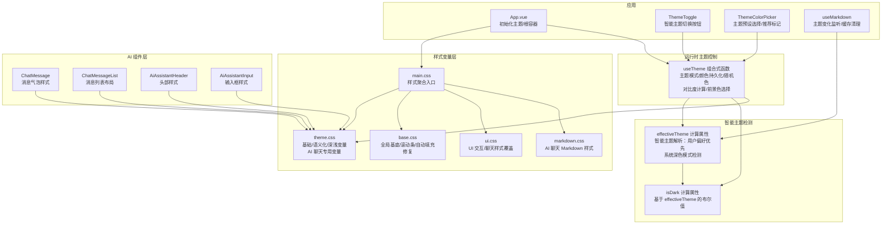
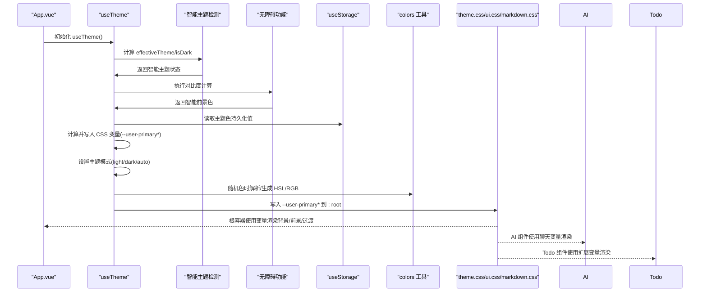
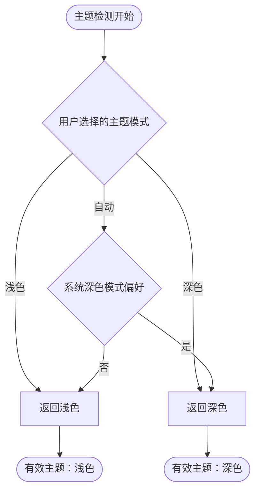
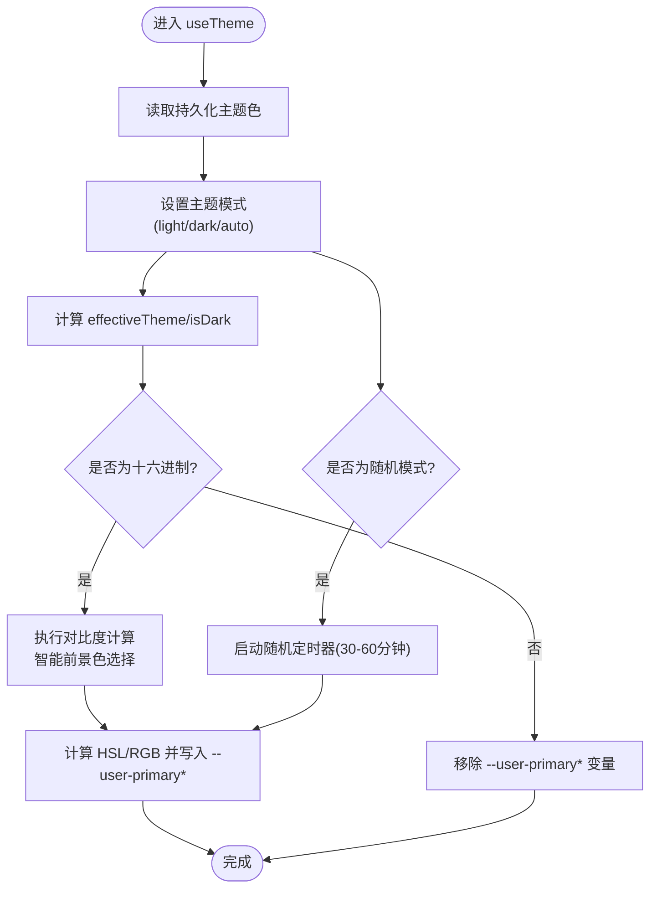
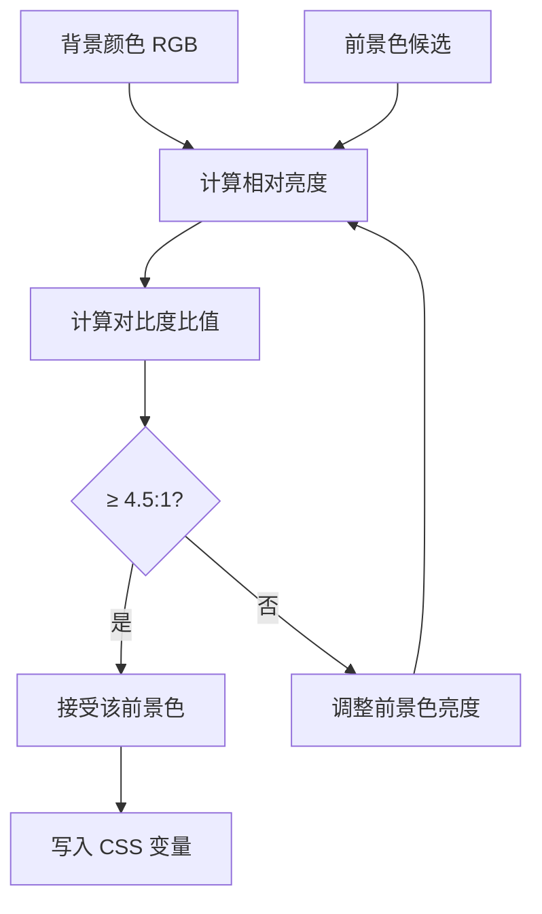
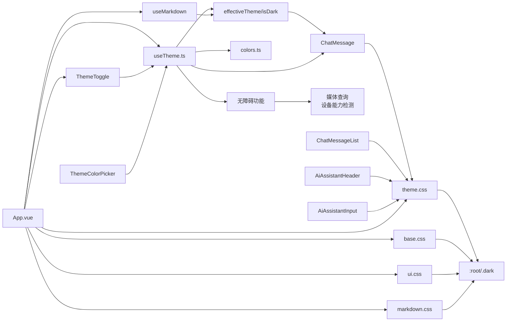

# 主题系统

<cite>
**本文引用的文件**
- [apps/frontend/src/composables/useTheme.ts](file://apps/frontend/src/composables/useTheme.ts)
- [apps/frontend/src/lib/colors.ts](file://apps/frontend/src/lib/colors.ts)
- [apps/frontend/src/styles/theme.css](file://apps/frontend/src/styles/theme.css)
- [apps/frontend/src/styles/base.css](file://apps/frontend/src/styles/base.css)
- [apps/frontend/src/styles/main.css](file://apps/frontend/src/styles/main.css)
- [apps/frontend/src/styles/ui.css](file://apps/frontend/src/styles/ui.css)
- [apps/frontend/src/styles/markdown.css](file://apps/frontend/src/styles/markdown.css)
- [apps/frontend/src/App.vue](file://apps/frontend/src/App.vue)
- [apps/frontend/src/features/ai/composables/useHoverPopover.ts](file://apps/frontend/src/features/ai/composables/useHoverPopover.ts)
- [apps/frontend/src/features/todo/components/ThemeColorPicker.vue](file://apps/frontend/src/features/todo/components/ThemeColorPicker.vue)
- [apps/frontend/src/features/todo/components/ThemeToggle.vue](file://apps/frontend/src/features/todo/components/ThemeToggle.vue)
- [apps/frontend/src/features/ai/components/ChatMessage.vue](file://apps/frontend/src/features/ai/components/ChatMessage.vue)
- [apps/frontend/src/features/ai/components/ChatMessageList.vue](file://apps/frontend/src/features/ai/components/ChatMessageList.vue)
- [apps/frontend/src/features/ai/components/AiAssistantHeader.vue](file://apps/frontend/src/features/ai/components/AiAssistantHeader.vue)
- [apps/frontend/src/features/ai/components/AiAssistantInput.vue](file://apps/frontend/src/features/ai/components/AiAssistantInput.vue)
- [apps/frontend/src/composables/useMarkdown.ts](file://apps/frontend/src/composables/useMarkdown.ts)
- [apps/frontend/tests/composables/useTheme.spec.ts](file://apps/frontend/tests/composables/useTheme.spec.ts)
- [apps/frontend/tests/features/ai/composables/useHoverPopover.spec.ts](file://apps/frontend/tests/features/ai/composables/useHoverPopover.spec.ts)
- [apps/frontend/tests/features/todo/components/ThemeColorPicker.spec.ts](file://apps/frontend/tests/features/todo/components/ThemeColorPicker.spec.ts)
- [apps/frontend/tests/features/todo/components/ThemeToggle.spec.ts](file://apps/frontend/tests/features/todo/components/ThemeToggle.spec.ts)
- [apps/frontend/src/i18n/locales/en-US/common.ts](file://apps/frontend/src/i18n/locales/en-US/common.ts)
- [apps/frontend/src/i18n/locales/zh-CN/common.ts](file://apps/frontend/src/i18n/locales/zh-CN/common.ts)
</cite>

## 更新摘要
**变更内容**
- 新增大量 AI 聊天相关 CSS 变量，包括消息气泡、输入框、占位符、标题等完整样式体系
- 扩展 Todo 组件主题变量，增强 Todo 功能的样式定制能力
- 改进响应式设计支持，优化移动端聊天体验
- 增强样式覆盖策略，提供更精细的主题定制选项
- 完善智能主题检测功能，提升用户体验一致性

## 目录
1. [简介](#简介)
2. [项目结构](#项目结构)
3. [核心组件](#核心组件)
4. [架构总览](#架构总览)
5. [详细组件分析](#详细组件分析)
6. [无障碍功能详解](#无障碍功能详解)
7. [依赖关系分析](#依赖关系分析)
8. [性能考量](#性能考量)
9. [故障排查指南](#故障排查指南)
10. [结论](#结论)
11. [附录](#附录)

## 简介
本文件系统性阐述 Lumina Todo 的主题系统，包括颜色体系、主题切换机制、样式变量管理、动态切换与持久化、系统主题适配、CSS 变量使用与覆盖策略、组件级主题定制、深色/浅色差异处理与最佳实践。本次更新重点介绍了新增的 AI 聊天主题变量系统，包含完整的聊天消息气泡、输入框、占位符、标题等样式变量，以及扩展的 Todo 组件主题变量，提供更丰富的主题定制能力。

**更新** 本版本反映了最新的主题系统扩展，包括新增的 AI 聊天 CSS 变量、Todo 组件变量扩展、改进的响应式设计支持，以及增强的样式覆盖策略。系统现在提供完整的聊天主题定制能力，支持用户主题色与 AI 组件样式的深度集成。

## 项目结构
主题系统由"智能主题检测""运行时主题控制""样式变量层""基础样式与覆盖层""无障碍功能层"五部分组成：
- 智能主题检测：通过 effectiveTheme 和 isDark 计算属性实现用户偏好与系统设置的智能协调。
- 运行时主题控制：通过组合式函数集中管理主题模式（浅色/深色/自动）与用户主题色（支持随机），并持久化到本地存储。
- 样式变量层：以 CSS 自定义属性为核心，定义基础色板、语义化变量、动效参数等；深色/浅色两套变量，支持用户主题色覆盖，新增 AI 聊天专用变量。
- 基础样式与覆盖层：基础样式统一应用变量，UI 层样式按需覆盖或增强交互细节，包含 AI 聊天专用样式。
- 无障碍功能层：提供自动对比度计算、智能前景色选择、设备能力检测等无障碍增强功能。



**图示来源**
- [apps/frontend/src/composables/useTheme.ts:317-323](file://apps/frontend/src/composables/useTheme.ts#L317-L323)
- [apps/frontend/src/features/ai/components/ChatMessage.vue:191-210](file://apps/frontend/src/features/ai/components/ChatMessage.vue#L191-L210)
- [apps/frontend/src/features/ai/components/AiAssistantInput.vue:229-234](file://apps/frontend/src/features/ai/components/AiAssistantInput.vue#L229-L234)
- [apps/frontend/src/features/ai/components/AiAssistantHeader.vue:26-44](file://apps/frontend/src/features/ai/components/AiAssistantHeader.vue#L26-L44)

**章节来源**
- [apps/frontend/src/styles/main.css:1-7](file://apps/frontend/src/styles/main.css#L1-L7)
- [apps/frontend/src/styles/theme.css:1-170](file://apps/frontend/src/styles/theme.css#L1-L170)
- [apps/frontend/src/styles/base.css:1-89](file://apps/frontend/src/styles/base.css#L1-L89)
- [apps/frontend/src/styles/ui.css:1-89](file://apps/frontend/src/styles/ui.css#L1-L89)
- [apps/frontend/src/styles/markdown.css:396-416](file://apps/frontend/src/styles/markdown.css#L396-L416)
- [apps/frontend/src/App.vue:1-77](file://apps/frontend/src/App.vue#L1-L77)

## 核心组件
- 智能主题检测：通过 effectiveTheme 和 isDark 计算属性实现用户偏好与系统设置的智能协调，确保主题切换的无缝体验。
- 主题控制组合式函数：负责主题模式（浅色/深色/自动）、用户主题色（十六进制/随机）、持久化存储、随机色定时轮换，以及自动对比度计算和智能前景色选择。
- 无障碍功能模块：提供设备能力检测、智能悬停状态管理、自动对比度计算等无障碍增强功能。
- 颜色工具库：提供 CSS 变量读取、RGB/HSL 解析与转换、颜色混合等能力，支撑主题色生成与覆盖。
- 主题预设系统：包含精心设计的预设颜色集合，支持推荐标记和可访问性优化。
- AI 聊天主题变量：新增完整的聊天主题变量体系，包括消息气泡、输入框、占位符、标题等样式变量。
- Todo 组件主题变量：扩展 Todo 组件的样式变量支持，增强组件级主题定制能力。
- 应用入口：在挂载时初始化主题，确保首屏即正确主题。
- 主题切换组件：智能的主题切换按钮，根据当前主题状态显示相应的图标和标题。
- Markdown 渲染组件：监听主题变化，优化 Mermaid 图表的渲染和缓存管理。

**章节来源**
- [apps/frontend/src/composables/useTheme.ts:317-323](file://apps/frontend/src/composables/useTheme.ts#L317-L323)
- [apps/frontend/src/composables/useTheme.ts:1-378](file://apps/frontend/src/composables/useTheme.ts#L1-L378)
- [apps/frontend/src/features/todo/components/ThemeToggle.vue:1-51](file://apps/frontend/src/features/todo/components/ThemeToggle.vue#L1-L51)
- [apps/frontend/src/composables/useMarkdown.ts:1-108](file://apps/frontend/src/composables/useMarkdown.ts#L1-L108)

## 架构总览
主题系统采用"智能主题检测 + 运行时控制 + 无障碍功能 + CSS 变量层"的四层设计：
- 智能检测层：effectiveTheme 和 isDark 计算属性负责解析用户偏好与系统设置，提供最终的有效主题状态。
- 运行时层：useTheme 负责监听主题模式与用户主题色变化，计算并写入 CSS 变量，同时维护随机色定时器和执行无障碍计算。
- 无障碍层：提供自动对比度计算、智能前景色选择、设备能力检测等功能，确保可访问性要求得到满足。
- 样式层：theme.css 定义默认变量与深/浅两套覆盖；base.css 提供全局基底与兼容性修复；ui.css 提供 UI 交互细节覆盖；markdown.css 提供 AI 聊天 Markdown 样式支持。



**图示来源**
- [apps/frontend/src/App.vue:9-12](file://apps/frontend/src/App.vue#L9-L12)
- [apps/frontend/src/composables/useTheme.ts:317-323](file://apps/frontend/src/composables/useTheme.ts#L317-L323)
- [apps/frontend/src/composables/useTheme.ts:237-306](file://apps/frontend/src/composables/useTheme.ts#L237-L306)
- [apps/frontend/src/lib/colors.ts:11-96](file://apps/frontend/src/lib/colors.ts#L11-L96)
- [apps/frontend/src/styles/theme.css:1-170](file://apps/frontend/src/styles/theme.css#L1-L170)
- [apps/frontend/src/styles/ui.css:1-89](file://apps/frontend/src/styles/ui.css#L1-L89)
- [apps/frontend/src/styles/markdown.css:396-416](file://apps/frontend/src/styles/markdown.css#L396-L416)

## 详细组件分析

### 智能主题检测系统
**更新** 新增的智能主题检测功能通过 effectiveTheme 和 isDark 计算属性实现，提供更流畅的用户体验：

- **effectiveTheme 计算属性**：智能解析主题状态，优先考虑用户偏好，其次考虑系统深色模式设置。
- **isDark 计算属性**：基于 effectiveTheme 返回布尔值，简化深色模式判断逻辑。
- **用户偏好优先**：当用户明确选择浅色或深色模式时，直接使用用户选择。
- **系统设置检测**：当用户选择自动模式时，检测系统深色模式偏好并相应调整。
- **实时响应**：主题变化时自动更新，无需手动刷新页面。



**图示来源**
- [apps/frontend/src/composables/useTheme.ts:317-323](file://apps/frontend/src/composables/useTheme.ts#L317-L323)

**章节来源**
- [apps/frontend/src/composables/useTheme.ts:317-323](file://apps/frontend/src/composables/useTheme.ts#L317-L323)

### 主题控制组合式函数 useTheme
- 主题模式：基于 useColorMode 管理 class 属性（light/dark/auto），默认浅色为空字符串，深色为 'dark'。
- 智能主题检测：通过 effectiveTheme 和 isDark 计算属性实现用户偏好与系统设置的智能协调。
- 用户主题色：支持十六进制（含简写/#规范化）、随机模式；随机模式下每 30-60 分钟随机切换一次。
- 无障碍增强：集成自动对比度计算，确保主题色与前景色满足 WCAG AA 标准（4.5:1）。
- 智能前景色选择：根据背景亮度自动选择白色或深色前景，优化可读性。
- 变量注入：将用户主题色转换为 HSL，限定饱和度/亮度范围，生成"明亮/深色"两套变量及对应前景色，写入 :root。
- 持久化：使用 useStorage 将主题色保存在本地存储，重启后恢复。



**图示来源**
- [apps/frontend/src/composables/useTheme.ts:317-323](file://apps/frontend/src/composables/useTheme.ts#L317-L323)
- [apps/frontend/src/composables/useTheme.ts:237-306](file://apps/frontend/src/composables/useTheme.ts#L237-L306)

**章节来源**
- [apps/frontend/src/composables/useTheme.ts:1-378](file://apps/frontend/src/composables/useTheme.ts#L1-L378)

### AI 聊天主题变量系统
**更新** 新增完整的 AI 聊天主题变量体系，提供精细化的聊天界面定制能力：

- **消息气泡变量**：--ai-message-bg、--ai-message-border 控制聊天消息的背景和边框样式
- **输入框变量**：--ai-glass-bg、--ai-glass-border 实现输入框的磨砂玻璃效果
- **占位符变量**：--ai-chat-placeholder 提供统一的占位符颜色
- **文本变量**：--ai-chat-assistant-text、--ai-chat-body-size 等控制文本样式
- **标题变量**：--ai-chat-heading-1/2/3-size 控制不同层级标题的字体大小
- **布局变量**：--ai-chat-content-max-width 控制内容最大宽度
- **响应式变量**：在移动端自动调整气泡内边距和尺寸

**章节来源**
- [apps/frontend/src/styles/theme.css:57-89](file://apps/frontend/src/styles/theme.css#L57-L89)
- [apps/frontend/src/styles/ui.css:14-56](file://apps/frontend/src/styles/ui.css#L14-L56)

### Todo 组件主题变量扩展
**更新** 扩展的 Todo 组件主题变量系统，增强组件级主题定制能力：

- **Todo 完成状态变量**：--todo-completed 提供统一的完成状态颜色
- **Todo 视觉变量**：支持通过 CSS 变量定制 Todo 组件的视觉样式
- **组件级覆盖**：允许在组件内部局部覆盖主题变量，实现更精细的定制

**章节来源**
- [apps/frontend/src/styles/theme.css:53](file://apps/frontend/src/styles/theme.css#L53)

### 主题切换组件 ThemeToggle
**更新** ThemeToggle 组件现已集成智能主题检测功能：

- **智能图标显示**：根据当前主题状态显示相应的图标（太阳/月亮/显示器）。
- **循环切换逻辑**：在浅色→深色→自动→浅色的循环中切换主题模式。
- **标题本地化**：根据当前主题状态显示相应的本地化标题。
- **无障碍支持**：完整的 ARIA 标签和键盘导航支持。

**章节来源**
- [apps/frontend/src/features/todo/components/ThemeToggle.vue:1-51](file://apps/frontend/src/features/todo/components/ThemeToggle.vue#L1-L51)

### Markdown 渲染组件 useMarkdown
**更新** useMarkdown 组件现在监听 effectiveTheme 变化以优化渲染性能：

- **主题变化监听**：监听 effectiveTheme 的变化，及时清理缓存。
- **Mermaid 图表优化**：根据主题变化清理 Mermaid 图表缓存，确保图表渲染质量。
- **AI 聊天样式支持**：集成 AI 聊天 Markdown 样式变量，确保聊天内容渲染一致。
- **渲染性能提升**：通过缓存管理减少重复渲染开销。
- **主题一致性**：确保图表颜色与当前主题保持一致。

**章节来源**
- [apps/frontend/src/composables/useMarkdown.ts:14-22](file://apps/frontend/src/composables/useMarkdown.ts#L14-L22)

### 无障碍功能详解

#### 自动对比度计算
系统实现了完整的自动对比度计算功能，确保所有主题色都满足 WCAG AA 标准：

- **对比度算法**：基于相对亮度公式计算颜色对比度，使用标准的 0.2126、0.7152、0.0722 权重系数。
- **最小对比度**：设定 4.5:1 的最小对比度阈值，确保文本可读性。
- **前景色选择**：根据背景亮度自动选择最合适的前景色（白色 vs 深色）。



**图示来源**
- [apps/frontend/src/composables/useTheme.ts:169-204](file://apps/frontend/src/composables/useTheme.ts#L169-L204)

#### 智能悬停状态管理
提供设备能力检测和智能悬停状态管理，优化不同设备上的交互体验：

- **设备能力检测**：使用 `(hover: hover) and (pointer: fine)` 查询检测设备是否支持精细指针和悬停。
- **延迟控制**：默认 150ms 延迟，避免误触和不必要的状态切换。
- **条件启用**：只有在支持悬停的设备上才启用悬停功能，触屏设备忽略悬停事件。

**章节来源**
- [apps/frontend/src/composables/useTheme.ts:166-235](file://apps/frontend/src/composables/useTheme.ts#L166-L235)
- [apps/frontend/src/features/ai/composables/useHoverPopover.ts:1-43](file://apps/frontend/src/features/ai/composables/useHoverPopover.ts#L1-L43)

### 颜色工具库 colors
- CSS 变量读取：在浏览器环境读取 :root 上的 CSS 变量值。
- RGB/HSL 解析：支持逗号/空格分隔的 HSL 字符串解析。
- HSL<->RGB 转换：提供数学公式实现双向转换。
- 颜色混合：线性插值混合两个 RGB 值，用于派生中间色调。

**章节来源**
- [apps/frontend/src/lib/colors.ts:1-96](file://apps/frontend/src/lib/colors.ts#L1-L96)

### 样式变量层 theme.css
- 基础变量：背景/前景/卡片/弹出层/边框/输入/环形高亮等。
- 主题色变量：优先使用用户主题色（--user-primary*），否则回退到默认值。
- 深/浅两套变量：深色模式下降低极端对比度，提升可读性与沉浸感。
- 语义化变量：文本主次色、完成态、成功/错误等。
- 动效参数：统一过渡曲线与持续时间，全局生效，可通过 .no-transition 排除特定元素。
- AI 聊天变量：新增完整的聊天主题变量体系，包括消息气泡、输入框、占位符、标题等样式变量。

**章节来源**
- [apps/frontend/src/styles/theme.css:1-170](file://apps/frontend/src/styles/theme.css#L1-L170)

### 基础样式与覆盖层 base.css/ui.css/markdown.css
- base.css：引入字体、Tailwind 基础/组件/工具；全局 body 使用径向渐变背景，随主题色微妙变化；修复浏览器自动填充的背景与文字颜色；自定义滚动条样式。
- ui.css：输入容器聚焦高亮、移动端响应式调整、AI 相关交互细节等。
- markdown.css：AI 聊天 Markdown 样式支持，包括标题、段落、引用等样式变量。

**章节来源**
- [apps/frontend/src/styles/base.css:1-89](file://apps/frontend/src/styles/base.css#L1-L89)
- [apps/frontend/src/styles/ui.css:1-89](file://apps/frontend/src/styles/ui.css#L1-L89)
- [apps/frontend/src/styles/markdown.css:396-416](file://apps/frontend/src/styles/markdown.css#L396-L416)

### 应用入口 App.vue
- 启动时调用 useTheme 初始化主题。
- 根容器使用变量驱动背景/前景色与过渡，Wails 平台下添加平台类名以启用特定样式。

**章节来源**
- [apps/frontend/src/App.vue:1-77](file://apps/frontend/src/App.vue#L1-L77)

### 主题预设与颜色系统
主题系统包含一组精心设计的预设颜色，每个颜色都经过可访问性测试和视觉平衡优化：

- **Celadon（青瓷）**：`#78958e` - 清新绿松石色调，适合专注工作场景，标记为推荐
- **Twilight Amber（暮色）**：`#9b8574` - 温暖琥珀色调，营造舒适氛围
- **Mist Blue（薄雾）**：`#728ba1` - 柔和蓝灰色，平衡冷静与温暖，标记为推荐
- **Moss Green（苔青）**：`#7c9585` - 深邃绿色，提升自然亲和感，标记为推荐
- **Lilac Gray（丁香）**：`#948ac0` - 更新后的紫色灰调，从 `#8e81c0` 更正为 `#948ac0`，提供更柔和的视觉体验，标记为推荐
- **Sunset Rose（晚霞）**：`#ae8792` - 柔和玫瑰色调，温暖而优雅
- **Graphite（石墨）**：`#647587` - 经典深灰色，专业且稳重
- **Indigo（靛青）**：`#4f6284` - 深邃蓝色，提升专业感
- **Random（随机）**：`random` - 随机主题色模式

**更新** Lilac Gray 颜色值已从 `#8e81c0` 更新为 `#948ac0`，这一调整提供了更柔和的紫色灰调，改善了视觉舒适度和可访问性。所有推荐颜色都经过了可访问性优化，确保满足 WCAG AA 标准。

**章节来源**
- [apps/frontend/src/composables/useTheme.ts:56-66](file://apps/frontend/src/composables/useTheme.ts#L56-L66)
- [apps/frontend/tests/features/todo/components/ThemeColorPicker.spec.ts:74-104](file://apps/frontend/tests/features/todo/components/ThemeColorPicker.spec.ts#L74-L104)

### 主题预设选择器
主题颜色选择器提供了直观的颜色选择界面，支持预设颜色选择和自定义颜色输入：

- **预设颜色网格**：展示所有可用的主题预设，支持推荐颜色标记
- **随机颜色**：特殊的渐变色预设，代表随机主题色模式
- **自定义颜色**：支持十六进制颜色输入和颜色选择器
- **实时预览**：显示当前选中的颜色效果
- **无障碍支持**：完整的 ARIA 标签和键盘导航支持

**更新** 主题颜色选择器的推荐主题指示器已从图标改为文本标签，使用 "优选" 翻译，提升了视觉一致性和可访问性。推荐标记现在显示为 "优选" 文本而非图标，位置保持在颜色块右上角，使用细小的字体和半透明样式。

**章节来源**
- [apps/frontend/src/features/todo/components/ThemeColorPicker.vue:1-190](file://apps/frontend/src/features/todo/components/ThemeColorPicker.vue#L1-L190)

### AI 聊天组件主题定制
**更新** AI 聊天组件现在全面支持主题变量定制：

- **消息气泡样式**：通过 --ai-message-bg 和 --ai-message-border 实现统一的聊天气泡外观
- **输入框样式**：使用 --ai-glass-bg 和 --ai-glass-border 创建磨砂玻璃效果
- **占位符样式**：通过 --ai-chat-placeholder 提供一致的占位符颜色
- **文本样式**：支持 --ai-chat-body-size、--ai-chat-user-size 等字体变量
- **标题样式**：通过 --ai-chat-heading-1/2/3-size 控制不同层级标题的字体大小
- **响应式适配**：在移动端自动调整气泡内边距和尺寸，确保良好的阅读体验

**章节来源**
- [apps/frontend/src/features/ai/components/ChatMessage.vue:191-210](file://apps/frontend/src/features/ai/components/ChatMessage.vue#L191-L210)
- [apps/frontend/src/features/ai/components/AiAssistantInput.vue:229-234](file://apps/frontend/src/features/ai/components/AiAssistantInput.vue#L229-L234)
- [apps/frontend/src/features/ai/components/AiAssistantHeader.vue:26-44](file://apps/frontend/src/features/ai/components/AiAssistantHeader.vue#L26-L44)

## 无障碍功能详解

### 自动对比度计算系统
系统实现了完整的自动对比度计算功能，确保所有主题色都满足 WCAG AA 标准：

#### 对比度计算算法
- **相对亮度计算**：使用标准的相对亮度公式，权重系数为 0.2126、0.7152、0.0722
- **对比度比值**：`(L1 + 0.05) / (L2 + 0.05)`，其中 L1 > L2
- **最小对比度**：4.5:1，满足 WCAG AA 标准

#### 智能前景色选择
- **前景色候选**：白色 (`#FFFFFF`) 和深色 (`hsl(32, 10%, 8%)`)
- **选择策略**：计算背景色与两种前景色的对比度，选择对比度更高的前景色
- **动态调整**：对于悬停状态，会动态调整亮度以确保对比度要求

#### 智能主题检测增强
**更新** 智能主题检测功能进一步增强了无障碍体验：

- **用户偏好优先**：始终尊重用户的明确主题选择
- **系统设置协调**：当用户选择自动模式时，智能检测系统深色模式偏好
- **无缝切换**：主题变化时自动更新，无需用户干预
- **一致性保障**：确保所有组件使用相同的主题状态判断逻辑

#### 悬停状态智能管理
- **设备能力检测**：使用媒体查询检测设备是否支持精细指针和悬停
- **延迟控制**：默认 150ms 延迟，避免误触
- **条件启用**：只在支持悬停的设备上启用悬停功能

```mermaid
classDiagram
class 智能主题检测 {
"+effectiveTheme 计算属性<br/>+isDark 计算属性<br/>+用户偏好优先<br/>+系统设置协调"
}
class 无障碍功能 {
"+自动对比度计算<br/>+智能前景色选择<br/>+设备能力检测<br/>+延迟控制"
}
class 对比度计算 {
"+相对亮度公式<br/>+对比度比值计算<br/>+WCAG AA 标准"
}
class 前景色选择 {
"+白色前景色<br/>+深色前景色<br/>+动态调整"
}
class 悬停管理 {
"+设备能力检测<br/>+延迟控制<br/>+条件启用"
}
智能主题检测 --> 无障碍功能
无障碍功能 --> 对比度计算
无障碍功能 --> 前景色选择
无障碍功能 --> 悬停管理
```

**图示来源**
- [apps/frontend/src/composables/useTheme.ts:317-323](file://apps/frontend/src/composables/useTheme.ts#L317-L323)
- [apps/frontend/src/composables/useTheme.ts:166-235](file://apps/frontend/src/composables/useTheme.ts#L166-L235)
- [apps/frontend/src/features/ai/composables/useHoverPopover.ts:1-43](file://apps/frontend/src/features/ai/composables/useHoverPopover.ts#L1-L43)

**章节来源**
- [apps/frontend/src/composables/useTheme.ts:166-235](file://apps/frontend/src/composables/useTheme.ts#L166-L235)
- [apps/frontend/src/composables/useTheme.ts:317-323](file://apps/frontend/src/composables/useTheme.ts#L317-L323)
- [apps/frontend/src/features/ai/composables/useHoverPopover.ts:1-43](file://apps/frontend/src/features/ai/composables/useHoverPopover.ts#L1-L43)

## 依赖关系分析
- 智能主题检测：effectiveTheme 和 isDark 计算属性依赖 useColorMode 和 useMediaQuery。
- useTheme 依赖 @vueuse/core 的 useColorMode/useStorage，依赖 colors 工具进行颜色计算，集成无障碍功能。
- 无障碍功能模块独立运行，提供设备能力检测和智能悬停管理。
- 样式层通过 CSS 变量与 :root/.dark 类名耦合，UI 层样式通过类名与变量间接耦合。
- App.vue 作为入口依赖 useTheme，间接依赖样式层。
- ThemeToggle 组件依赖 useTheme 的智能主题检测功能。
- useMarkdown 组件监听 effectiveTheme 变化以优化渲染。
- AI 聊天组件依赖 theme.css 中的聊天变量进行样式渲染。



**图示来源**
- [apps/frontend/src/composables/useTheme.ts:317-323](file://apps/frontend/src/composables/useTheme.ts#L317-L323)
- [apps/frontend/src/composables/useTheme.ts:1-378](file://apps/frontend/src/composables/useTheme.ts#L1-L378)
- [apps/frontend/src/features/todo/components/ThemeToggle.vue:8](file://apps/frontend/src/features/todo/components/ThemeToggle.vue#L8)
- [apps/frontend/src/composables/useMarkdown.ts:16](file://apps/frontend/src/composables/useMarkdown.ts#L16)
- [apps/frontend/src/lib/colors.ts:1-96](file://apps/frontend/src/lib/colors.ts#L1-L96)
- [apps/frontend/src/styles/theme.css:1-170](file://apps/frontend/src/styles/theme.css#L1-L170)
- [apps/frontend/src/styles/base.css:1-89](file://apps/frontend/src/styles/base.css#L1-L89)
- [apps/frontend/src/styles/ui.css:1-89](file://apps/frontend/src/styles/ui.css#L1-L89)
- [apps/frontend/src/styles/markdown.css:396-416](file://apps/frontend/src/styles/markdown.css#L396-L416)
- [apps/frontend/src/App.vue:1-77](file://apps/frontend/src/App.vue#L1-L77)

**章节来源**
- [apps/frontend/src/composables/useTheme.ts:1-378](file://apps/frontend/src/composables/useTheme.ts#L1-L378)
- [apps/frontend/src/App.vue:1-77](file://apps/frontend/src/App.vue#L1-L77)

## 性能考量
- 智能主题检测：effectiveTheme 和 isDark 计算属性使用 Vue 的响应式系统，避免不必要的重新计算。
- 变量驱动渲染：通过 CSS 变量与 class 切换实现主题切换，避免重排与重绘风暴。
- 动效统一：全局过渡参数统一，可按需通过 .no-transition 排除复杂场景（如图表/进度条）以减少动画开销。
- 随机色定时：随机主题色切换周期较长（30-60 分钟），降低对专注度的影响。
- 字体与滚动条：外部字体按需加载，滚动条样式轻量，不影响主线程。
- 无障碍计算：对比度计算和前景色选择在主题切换时执行，避免频繁重复计算。
- 设备能力检测：使用媒体查询进行一次性检测，避免重复计算开销。
- Markdown 优化：useMarkdown 监听主题变化时清理缓存，避免内存泄漏。
- AI 聊天变量：聊天变量通过 CSS 变量实现，避免 JavaScript 动态计算开销。
- 响应式优化：移动端变量自动调整，减少不必要的样式计算。

## 故障排查指南
- 智能主题检测异常
  - 检查 effectiveTheme 和 isDark 计算属性是否正确返回预期值。
  - 确认 useMediaQuery 是否正确检测系统深色模式偏好。
  - 验证用户偏好设置是否被正确优先处理。
- 主题未生效
  - 检查 App.vue 是否已调用 useTheme 初始化。
  - 确认浏览器支持 CSS 变量，且 :root 未被其他样式覆盖。
- 深色模式异常
  - 确认根元素存在 'dark' class 或系统主题自动切换生效。
  - 检查 --user-primary* 是否被意外移除或覆盖。
- 随机主题色不更新
  - 确认主题色为 'random'，并检查定时器是否被清理。
  - 查看控制台是否有异常中断定时器。
- 浏览器自动填充颜色异常
  - base.css 中已针对 -webkit-autofill 做了颜色修复，确认未被其他样式覆盖。
- Lilac Gray 颜色显示问题
  - 确认颜色值 `#948ac0` 正确应用到主题预设中。
  - 检查测试用例中对颜色值的断言是否通过。
- 推荐主题指示器显示问题
  - 确认推荐标记使用文本标签而非图标，显示为 "优选"。
  - 检查 CSS 样式是否正确应用，位置在右上角。
- 对比度不足问题
  - 检查主题色是否满足 4.5:1 的对比度要求。
  - 确认智能前景色选择算法正常工作。
- 悬停功能异常
  - 确认设备支持精细指针和悬停功能。
  - 检查媒体查询是否正确返回设备能力信息。
- 预设颜色选择问题
  - 确认 THEME_PRESETS 数组中的颜色值格式正确。
  - 检查推荐标记是否正确显示。
- ThemeToggle 组件问题
  - 确认组件正确使用 useTheme 的智能主题检测功能。
  - 检查图标和标题是否根据当前主题状态正确显示。
- Markdown 渲染问题
  - 确认 useMarkdown 正确监听 effectiveTheme 变化。
  - 检查 Mermaid 图表缓存是否正确清理和重建。
- AI 聊天样式问题
  - 确认聊天变量是否正确应用到 AI 组件。
  - 检查 CSS 变量是否被意外覆盖。
  - 验证响应式变量在移动端是否正确调整。
- 主题变量冲突
  - 检查自定义主题变量是否与系统变量冲突。
  - 确认变量优先级顺序正确。
- 组件主题定制失败
  - 确认组件是否正确使用主题变量。
  - 检查 CSS 作用域是否正确应用。

**章节来源**
- [apps/frontend/src/composables/useTheme.ts:317-323](file://apps/frontend/src/composables/useTheme.ts#L317-L323)
- [apps/frontend/src/App.vue:1-77](file://apps/frontend/src/App.vue#L1-L77)
- [apps/frontend/src/composables/useTheme.ts:320-330](file://apps/frontend/src/composables/useTheme.ts#L320-L330)
- [apps/frontend/src/styles/base.css:32-42](file://apps/frontend/src/styles/base.css#L32-L42)

## 结论
Lumina Todo 的主题系统以 CSS 变量为核心，结合运行时组合式函数实现"可定制、可持久化、可扩展"的主题体验。通过语义化变量与深/浅两套覆盖，兼顾可访问性与视觉舒适度；通过随机主题色与定时切换，平衡个性化与专注力。新增的智能主题检测功能进一步提升了系统的用户体验，通过 effectiveTheme 和 isDark 计算属性实现用户偏好与系统设置的智能协调，确保主题切换的无缝体验。**更新** 最新的主题系统扩展显著增强了 AI 聊天功能的定制能力，新增的完整聊天变量体系为用户提供了精细化的主题定制选项。样式覆盖策略的改进使得组件级主题定制更加灵活，响应式设计的支持优化了移动端体验。无障碍功能包括自动对比度计算、智能前景色选择和设备能力感知的智能悬停管理，整体架构清晰、耦合度低，便于进一步扩展品牌色与组件级主题定制。

## 附录

### 设计原则与语义化命名
- 设计原则
  - 低对比度与柔和过渡：深色模式降低极端对比，避免眩光。
  - 可访问性：保证文本对比度与色彩安全；提供减少动效偏好支持。
  - 一致性：语义化变量贯穿全局，组件仅消费变量，避免硬编码颜色。
  - 无障碍优先：自动对比度计算和智能前景色选择确保可访问性。
  - 用户偏好优先：智能主题检测确保用户的选择始终被尊重。
  - 组件级定制：支持 AI 聊天和 Todo 组件的精细化主题定制。
- 语义化命名
  - 文本主次色：--text-color / --text-secondary
  - 成功/错误：--success / --error
  - 完成态：--todo-completed
  - 图表色：--chart-1..5
  - AI 相关：--ai-* 系列变量
  - 用户主题色：--user-primary* 系列变量

**章节来源**
- [apps/frontend/src/styles/theme.css:50-67](file://apps/frontend/src/styles/theme.css#L50-L67)
- [apps/frontend/src/styles/theme.css:101-116](file://apps/frontend/src/styles/theme.css#L101-L116)

### 深色模式与浅色模式差异
- 背景/前景/卡片/弹出层：深色模式整体提亮，避免死黑带来的压迫感。
- 主题色：深色模式保留活力但更沉稳，避免荧光感。
- 边框/输入/环形高亮：深色模式采用更细腻灰度，降低视觉负担。
- 文本与完成态：深色模式降低亮度，提升可读性。
- 对比度：深色模式下对比度计算更加严格，确保可访问性。
- 智能检测：effectiveTheme 和 isDark 确保主题状态的一致性和准确性。
- AI 聊天变量：深色模式下聊天变量提供更舒适的阅读体验。

**章节来源**
- [apps/frontend/src/styles/theme.css:69-141](file://apps/frontend/src/styles/theme.css#L69-L141)
- [apps/frontend/src/composables/useTheme.ts:317-323](file://apps/frontend/src/composables/useTheme.ts#L317-L323)

### 动态切换与持久化
- 智能主题检测：effectiveTheme 和 isDark 计算属性实时响应用户偏好和系统设置。
- 动态切换：useTheme 监听主题模式与主题色变化，即时写入 CSS 变量。
- 持久化：主题色通过 useStorage 存储，刷新后恢复。
- 系统主题适配：useColorMode 支持 auto，跟随系统深色/浅色切换。
- 无障碍同步：主题切换时自动重新计算对比度和前景色。
- AI 聊天变量：聊天变量随主题变化自动更新，确保一致性。

**章节来源**
- [apps/frontend/src/composables/useTheme.ts:317-323](file://apps/frontend/src/composables/useTheme.ts#L317-L323)
- [apps/frontend/src/composables/useTheme.ts:332-346](file://apps/frontend/src/composables/useTheme.ts#L332-L346)

### CSS 变量使用与样式覆盖策略
- 使用方式
  - 全局：:root 定义基础变量，组件通过 hsl(var(--variable)) 使用。
  - 深色：.dark 下提供覆盖变量，确保深色一致性。
  - 用户主题色：--user-primary* 优先于默认变量。
  - AI 聊天：通过 --ai-* 变量实现聊天组件的统一样式。
- 覆盖策略
  - 基础样式：通过 base.css 统一应用变量。
  - UI 交互：通过 ui.css 对输入容器、滚动条、移动端等做细节覆盖。
  - 组件定制：组件内部可局部覆盖变量或使用语义化变量，避免硬编码。
  - 响应式覆盖：移动端自动调整变量值，确保良好体验。

**章节来源**
- [apps/frontend/src/styles/theme.css:1-170](file://apps/frontend/src/styles/theme.css#L1-L170)
- [apps/frontend/src/styles/base.css:9-43](file://apps/frontend/src/styles/base.css#L9-L43)
- [apps/frontend/src/styles/ui.css:1-89](file://apps/frontend/src/styles/ui.css#L1-L89)

### 组件主题定制示例
- 输入容器聚焦高亮：基于 --primary 变量实现统一高亮与阴影。
- 滚动条：根据 --muted-foreground / --border 动态生成浅/深色滚动条。
- 移动端：在小屏下调整布局与字号，同时保持变量一致。
- 无障碍增强：组件可利用自动对比度计算结果，确保文本可读性。
- 智能检测：组件可使用 effectiveTheme 和 isDark 计算属性获取准确的主题状态。
- AI 聊天定制：通过 --ai-* 变量定制聊天组件的外观和交互效果。
- Todo 组件定制：通过扩展的 Todo 变量实现组件级主题定制。

**章节来源**
- [apps/frontend/src/styles/ui.css:5-35](file://apps/frontend/src/styles/ui.css#L5-L35)
- [apps/frontend/src/styles/base.css:72-89](file://apps/frontend/src/styles/base.css#L72-L89)
- [apps/frontend/src/composables/useTheme.ts:317-323](file://apps/frontend/src/composables/useTheme.ts#L317-L323)

### 主题扩展与品牌定制
- 扩展步骤
  - 在 :root 下新增品牌变量（如 --brand-primary）。
  - 在 .dark 下提供深色覆盖。
  - 在组件中优先使用语义化变量或品牌变量，避免直接绑定默认变量。
  - 集成无障碍功能，确保新颜色满足对比度要求。
  - 利用智能主题检测功能确保品牌主题与用户偏好协调。
  - 扩展 AI 聊天变量体系，支持更精细的聊天组件定制。
- 品牌定制
  - 通过 useTheme 注入 --user-primary*，再由 theme.css 生成派生变量，确保品牌色贯穿全站。
  - 如需多品牌，可增加多组变量并在运行时切换。
  - 预设系统支持添加新的推荐颜色，提升用户体验。
  - 智能主题检测确保品牌主题在不同设备和环境下的一致性。
  - AI 聊天变量支持品牌色与聊天组件的深度集成。

**章节来源**
- [apps/frontend/src/styles/theme.css:1-170](file://apps/frontend/src/styles/theme.css#L1-L170)
- [apps/frontend/src/composables/useTheme.ts:237-306](file://apps/frontend/src/composables/useTheme.ts#L237-L306)
- [apps/frontend/src/composables/useTheme.ts:317-323](file://apps/frontend/src/composables/useTheme.ts#L317-L323)

### 测试参考
- useTheme.spec.ts：对 useTheme 的行为进行单元测试，验证主题模式与主题色的持久化与切换逻辑，包括对比度计算、前景色选择和智能主题检测功能。
- useHoverPopover.spec.ts：测试智能悬停状态管理功能，验证设备能力检测和延迟控制。
- ThemeColorPicker.spec.ts：测试主题颜色选择器的功能，包括 Lilac Gray 颜色预设的正确显示和颜色值验证，以及推荐指示器的文本标签显示。
- ThemeToggle.spec.ts：测试智能主题切换按钮的功能，验证图标和标题的正确显示以及循环切换逻辑。

**更新** 测试用例已更新以反映智能主题检测功能的实现，包括 effectiveTheme 和 isDark 计算属性的行为验证。

**章节来源**
- [apps/frontend/tests/composables/useTheme.spec.ts:1-170](file://apps/frontend/tests/composables/useTheme.spec.ts#L1-L170)
- [apps/frontend/tests/features/ai/composables/useHoverPopover.spec.ts:1-87](file://apps/frontend/tests/features/ai/composables/useHoverPopover.spec.ts#L1-L87)
- [apps/frontend/tests/features/todo/components/ThemeColorPicker.spec.ts:1-146](file://apps/frontend/tests/features/todo/components/ThemeColorPicker.spec.ts#L1-L146)
- [apps/frontend/tests/features/todo/components/ThemeToggle.spec.ts:1-77](file://apps/frontend/tests/features/todo/components/ThemeToggle.spec.ts#L1-L77)

### 国际化与本地化
主题颜色的国际化支持包括：
- 英文：Lilac Gray
- 中文：丁香

这些翻译确保了不同语言用户的本地化体验。

**更新** 推荐指示器的国际化支持包括：
- 英文：Curated
- 中文：优选

主题切换按钮的国际化支持包括：
- 英文：Light, Dark, System
- 中文：浅色, 深色, 系统

AI 聊天组件的国际化支持包括：
- 英文：Assistant, Placeholder, Send
- 中文：助手, 占位符, 发送

这些翻译确保了推荐主题指示器、主题切换按钮和 AI 聊天组件在不同语言环境下的本地化体验。

**章节来源**
- [apps/frontend/src/i18n/locales/en-US/common.ts:65](file://apps/frontend/src/i18n/locales/en-US/common.ts#L65)
- [apps/frontend/src/i18n/locales/zh-CN/common.ts:66](file://apps/frontend/src/i18n/locales/zh-CN/common.ts#L66)

### 无障碍功能最佳实践
- **对比度要求**：始终确保文本与背景的对比度至少达到 4.5:1（WCAG AA 标准）。
- **颜色选择**：避免使用过于鲜艳或过于暗淡的颜色，确保在不同设备上的一致性。
- **悬停管理**：在触屏设备上禁用悬停功能，避免误触和不必要的状态切换。
- **延迟控制**：合理设置悬停延迟，避免过短导致误触发，过长影响用户体验。
- **设备检测**：使用媒体查询检测设备能力，提供一致的跨设备体验。
- **智能主题检测**：尊重用户偏好，智能协调系统设置，提供无缝的主题切换体验。
- **主题一致性**：确保所有组件使用相同的主题状态判断逻辑，避免视觉混乱。
- **AI 聊天可访问性**：确保聊天组件的对比度和可读性满足无障碍标准。
- **响应式适配**：在移动端提供适当的触摸目标大小和间距。

**章节来源**
- [apps/frontend/src/composables/useTheme.ts:166-235](file://apps/frontend/src/composables/useTheme.ts#L166-L235)
- [apps/frontend/src/composables/useTheme.ts:317-323](file://apps/frontend/src/composables/useTheme.ts#L317-L323)
- [apps/frontend/src/features/ai/composables/useHoverPopover.ts:1-43](file://apps/frontend/src/features/ai/composables/useHoverPopover.ts#L1-L43)