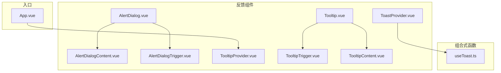
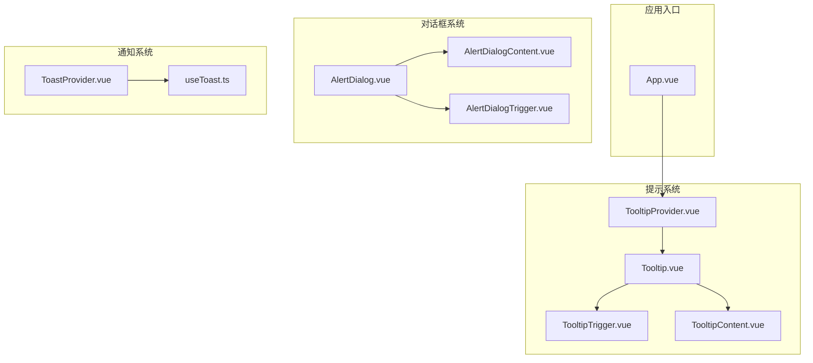
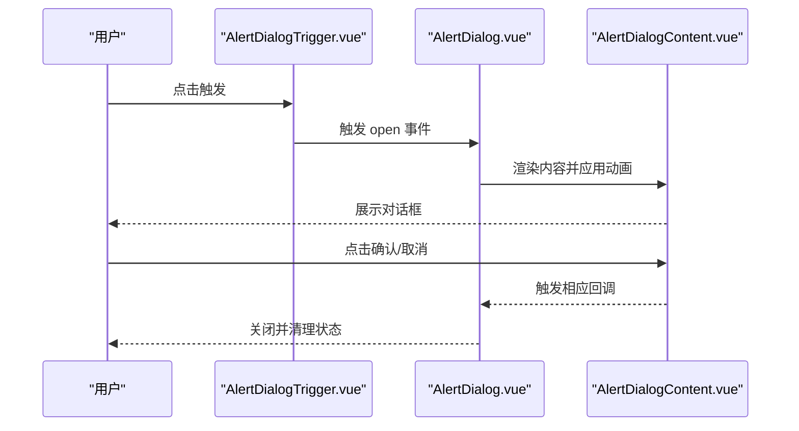
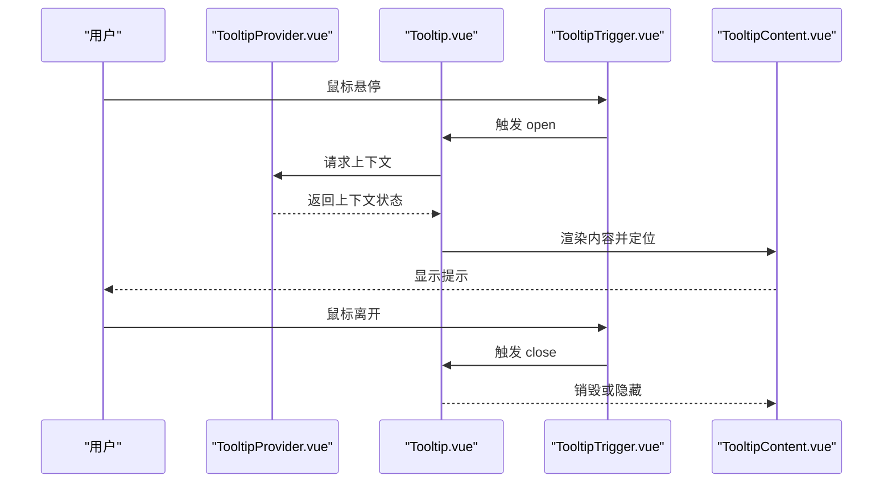
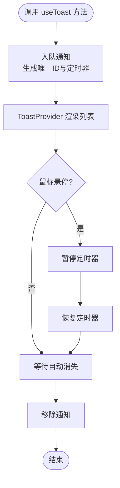
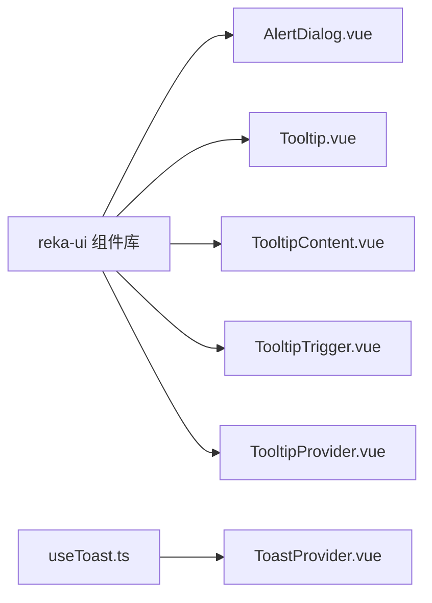

# 反馈组件

<cite>
**本文引用的文件**
- [apps/frontend/src/components/ui/alert-dialog/AlertDialog.vue](file://apps/frontend/src/components/ui/alert-dialog/AlertDialog.vue)
- [apps/frontend/src/components/ui/alert-dialog/AlertDialogContent.vue](file://apps/frontend/src/components/ui/alert-dialog/AlertDialogContent.vue)
- [apps/frontend/src/components/ui/alert-dialog/AlertDialogTrigger.vue](file://apps/frontend/src/components/ui/alert-dialog/AlertDialogTrigger.vue)
- [apps/frontend/src/components/ui/alert-dialog/index.ts](file://apps/frontend/src/components/ui/alert-dialog/index.ts)
- [apps/frontend/src/components/ui/tooltip/Tooltip.vue](file://apps/frontend/src/components/ui/tooltip/Tooltip.vue)
- [apps/frontend/src/components/ui/tooltip/TooltipContent.vue](file://apps/frontend/src/components/ui/tooltip/TooltipContent.vue)
- [apps/frontend/src/components/ui/tooltip/TooltipProvider.vue](file://apps/frontend/src/components/ui/tooltip/TooltipProvider.vue)
- [apps/frontend/src/components/ui/tooltip/TooltipTrigger.vue](file://apps/frontend/src/components/ui/tooltip/TooltipTrigger.vue)
- [apps/frontend/src/components/ui/tooltip/index.ts](file://apps/frontend/src/components/ui/tooltip/index.ts)
- [apps/frontend/src/components/ui/ToastProvider.vue](file://apps/frontend/src/components/ui/ToastProvider.vue)
- [apps/frontend/src/composables/useToast.ts](file://apps/frontend/src/composables/useToast.ts)
- [apps/frontend/src/App.vue](file://apps/frontend/src/App.vue)
</cite>

## 目录
1. [简介](#简介)
2. [项目结构](#项目结构)
3. [核心组件](#核心组件)
4. [架构总览](#架构总览)
5. [详细组件分析](#详细组件分析)
6. [依赖关系分析](#依赖关系分析)
7. [性能考量](#性能考量)
8. [故障排查指南](#故障排查指南)
9. [结论](#结论)
10. [附录](#附录)

## 简介
本文件聚焦于前端反馈类UI组件的设计与实现，包括：
- 对话框：AlertDialog（含触发器、内容、标题、描述、页脚、动作、取消等子组件）
- 提示：Tooltip（含提供者、触发器、内容）
- 通知：Toast（全局通知展示与管理）

文档从架构、数据流、处理逻辑、集成点、错误处理与性能等方面进行系统化说明，并给出可访问性与通知系统集成的最佳实践。

## 项目结构
反馈组件主要位于前端应用的组件库目录中，采用按功能域分层组织：
- 组件层：ui/alert-dialog、ui/tooltip、ToastProvider.vue
- 组合式函数层：composables/useToast.ts
- 入口与上下文：App.vue 中的 TooltipProvider 包裹

图示来源
- [apps/frontend/src/components/ui/alert-dialog/AlertDialog.vue:1-16](file://apps/frontend/src/components/ui/alert-dialog/AlertDialog.vue#L1-L16)
- [apps/frontend/src/components/ui/alert-dialog/AlertDialogContent.vue:1-39](file://apps/frontend/src/components/ui/alert-dialog/AlertDialogContent.vue#L1-L39)
- [apps/frontend/src/components/ui/alert-dialog/AlertDialogTrigger.vue:1-13](file://apps/frontend/src/components/ui/alert-dialog/AlertDialogTrigger.vue#L1-L13)
- [apps/frontend/src/components/ui/tooltip/Tooltip.vue:1-16](file://apps/frontend/src/components/ui/tooltip/Tooltip.vue#L1-L16)
- [apps/frontend/src/components/ui/tooltip/TooltipProvider.vue:1-13](file://apps/frontend/src/components/ui/tooltip/TooltipProvider.vue#L1-L13)
- [apps/frontend/src/components/ui/tooltip/TooltipTrigger.vue:1-13](file://apps/frontend/src/components/ui/tooltip/TooltipTrigger.vue#L1-L13)
- [apps/frontend/src/components/ui/tooltip/TooltipContent.vue:1-42](file://apps/frontend/src/components/ui/tooltip/TooltipContent.vue#L1-L42)
- [apps/frontend/src/components/ui/ToastProvider.vue:1-81](file://apps/frontend/src/components/ui/ToastProvider.vue#L1-L81)
- [apps/frontend/src/composables/useToast.ts:1-87](file://apps/frontend/src/composables/useToast.ts#L1-L87)
- [apps/frontend/src/App.vue:1-80](file://apps/frontend/src/App.vue#L1-L80)

章节来源
- [apps/frontend/src/components/ui/alert-dialog/index.ts:1-10](file://apps/frontend/src/components/ui/alert-dialog/index.ts#L1-L10)
- [apps/frontend/src/components/ui/tooltip/index.ts:1-5](file://apps/frontend/src/components/ui/tooltip/index.ts#L1-L5)

## 核心组件
- AlertDialog：基于 reka-ui 的根容器，负责状态转发与插槽分发
- AlertDialogContent：带覆盖层与门户的弹出层容器，内置动画与定位
- AlertDialogTrigger：触发器包装
- Tooltip：根容器，转发属性与事件
- TooltipContent：带方向偏移与动画的提示内容
- TooltipProvider：全局提供者，确保多提示协同工作
- TooltipTrigger：触发器包装
- ToastProvider：全局通知容器，管理通知队列、图标与样式映射
- useToast：通知状态与生命周期管理（添加、移除、暂停/恢复）

章节来源
- [apps/frontend/src/components/ui/alert-dialog/AlertDialog.vue:1-16](file://apps/frontend/src/components/ui/alert-dialog/AlertDialog.vue#L1-L16)
- [apps/frontend/src/components/ui/alert-dialog/AlertDialogContent.vue:1-39](file://apps/frontend/src/components/ui/alert-dialog/AlertDialogContent.vue#L1-L39)
- [apps/frontend/src/components/ui/alert-dialog/AlertDialogTrigger.vue:1-13](file://apps/frontend/src/components/ui/alert-dialog/AlertDialogTrigger.vue#L1-L13)
- [apps/frontend/src/components/ui/tooltip/Tooltip.vue:1-16](file://apps/frontend/src/components/ui/tooltip/Tooltip.vue#L1-L16)
- [apps/frontend/src/components/ui/tooltip/TooltipContent.vue:1-42](file://apps/frontend/src/components/ui/tooltip/TooltipContent.vue#L1-L42)
- [apps/frontend/src/components/ui/tooltip/TooltipProvider.vue:1-13](file://apps/frontend/src/components/ui/tooltip/TooltipProvider.vue#L1-L13)
- [apps/frontend/src/components/ui/tooltip/TooltipTrigger.vue:1-13](file://apps/frontend/src/components/ui/tooltip/TooltipTrigger.vue#L1-L13)
- [apps/frontend/src/components/ui/ToastProvider.vue:1-81](file://apps/frontend/src/components/ui/ToastProvider.vue#L1-L81)
- [apps/frontend/src/composables/useToast.ts:1-87](file://apps/frontend/src/composables/useToast.ts#L1-L87)

## 架构总览
反馈组件整体采用“组合式组件 + Provider 上下文”的模式：
- AlertDialog/Tooltip 通过 reka-ui 的 Root/Provider 组件实现状态与事件的统一管理
- ToastProvider 通过 useToast 管理全局通知队列，结合 Vue 响应式系统实现入队、出队与交互控制
- App.vue 将 TooltipProvider 放置在根部，保证全站提示可用

图示来源
- [apps/frontend/src/App.vue:1-80](file://apps/frontend/src/App.vue#L1-L80)
- [apps/frontend/src/components/ui/tooltip/TooltipProvider.vue:1-13](file://apps/frontend/src/components/ui/tooltip/TooltipProvider.vue#L1-L13)
- [apps/frontend/src/components/ui/tooltip/Tooltip.vue:1-16](file://apps/frontend/src/components/ui/tooltip/Tooltip.vue#L1-L16)
- [apps/frontend/src/components/ui/tooltip/TooltipTrigger.vue:1-13](file://apps/frontend/src/components/ui/tooltip/TooltipTrigger.vue#L1-L13)
- [apps/frontend/src/components/ui/tooltip/TooltipContent.vue:1-42](file://apps/frontend/src/components/ui/tooltip/TooltipContent.vue#L1-L42)
- [apps/frontend/src/components/ui/alert-dialog/AlertDialog.vue:1-16](file://apps/frontend/src/components/ui/alert-dialog/AlertDialog.vue#L1-L16)
- [apps/frontend/src/components/ui/alert-dialog/AlertDialogContent.vue:1-39](file://apps/frontend/src/components/ui/alert-dialog/AlertDialogContent.vue#L1-L39)
- [apps/frontend/src/components/ui/alert-dialog/AlertDialogTrigger.vue:1-13](file://apps/frontend/src/components/ui/alert-dialog/AlertDialogTrigger.vue#L1-L13)
- [apps/frontend/src/components/ui/ToastProvider.vue:1-81](file://apps/frontend/src/components/ui/ToastProvider.vue#L1-L81)
- [apps/frontend/src/composables/useToast.ts:1-87](file://apps/frontend/src/composables/useToast.ts#L1-L87)

## 详细组件分析

### 对话框 AlertDialog
- 触发机制：通过 AlertDialogTrigger 包裹目标元素，点击后由 reka-ui 控制打开/关闭
- 显示时机：由触发器事件或外部状态驱动；内容层通过 Portal 渲染到指定挂载点
- 交互模式：支持确认/取消动作；Overlay 背景遮罩默认阻止背景滚动
- 数据流与状态管理：根容器负责属性与事件转发；内容层负责布局、动画与定位
- 可访问性：依赖 reka-ui 的无障碍语义与键盘导航（如 Tab 切换焦点、Escape 关闭）

图示来源
- [apps/frontend/src/components/ui/alert-dialog/AlertDialogTrigger.vue:1-13](file://apps/frontend/src/components/ui/alert-dialog/AlertDialogTrigger.vue#L1-L13)
- [apps/frontend/src/components/ui/alert-dialog/AlertDialog.vue:1-16](file://apps/frontend/src/components/ui/alert-dialog/AlertDialog.vue#L1-L16)
- [apps/frontend/src/components/ui/alert-dialog/AlertDialogContent.vue:1-39](file://apps/frontend/src/components/ui/alert-dialog/AlertDialogContent.vue#L1-L39)

章节来源
- [apps/frontend/src/components/ui/alert-dialog/AlertDialog.vue:1-16](file://apps/frontend/src/components/ui/alert-dialog/AlertDialog.vue#L1-L16)
- [apps/frontend/src/components/ui/alert-dialog/AlertDialogContent.vue:1-39](file://apps/frontend/src/components/ui/alert-dialog/AlertDialogContent.vue#L1-L39)
- [apps/frontend/src/components/ui/alert-dialog/AlertDialogTrigger.vue:1-13](file://apps/frontend/src/components/ui/alert-dialog/AlertDialogTrigger.vue#L1-L13)
- [apps/frontend/src/components/ui/alert-dialog/index.ts:1-10](file://apps/frontend/src/components/ui/alert-dialog/index.ts#L1-L10)

### 提示 Tooltip
- 触发机制：TooltipTrigger 包裹目标元素，通过 Provider 统一管理多个提示实例
- 显示时机：默认鼠标悬停触发；可通过属性配置延迟、位置偏移等
- 交互模式：内容随指针移动或固定在指定方位；支持多提示协同
- 数据流与状态管理：根容器转发属性与事件；内容层负责定位、动画与可见性
- 可访问性：依赖 reka-ui 的无障碍语义与键盘支持（如焦点触发）

图示来源
- [apps/frontend/src/components/ui/tooltip/TooltipProvider.vue:1-13](file://apps/frontend/src/components/ui/tooltip/TooltipProvider.vue#L1-L13)
- [apps/frontend/src/components/ui/tooltip/Tooltip.vue:1-16](file://apps/frontend/src/components/ui/tooltip/Tooltip.vue#L1-L16)
- [apps/frontend/src/components/ui/tooltip/TooltipTrigger.vue:1-13](file://apps/frontend/src/components/ui/tooltip/TooltipTrigger.vue#L1-L13)
- [apps/frontend/src/components/ui/tooltip/TooltipContent.vue:1-42](file://apps/frontend/src/components/ui/tooltip/TooltipContent.vue#L1-L42)
- [apps/frontend/src/App.vue:1-80](file://apps/frontend/src/App.vue#L1-L80)

章节来源
- [apps/frontend/src/components/ui/tooltip/Tooltip.vue:1-16](file://apps/frontend/src/components/ui/tooltip/Tooltip.vue#L1-L16)
- [apps/frontend/src/components/ui/tooltip/TooltipContent.vue:1-42](file://apps/frontend/src/components/ui/tooltip/TooltipContent.vue#L1-L42)
- [apps/frontend/src/components/ui/tooltip/TooltipProvider.vue:1-13](file://apps/frontend/src/components/ui/tooltip/TooltipProvider.vue#L1-L13)
- [apps/frontend/src/components/ui/tooltip/TooltipTrigger.vue:1-13](file://apps/frontend/src/components/ui/tooltip/TooltipTrigger.vue#L1-L13)
- [apps/frontend/src/components/ui/tooltip/index.ts:1-5](file://apps/frontend/src/components/ui/tooltip/index.ts#L1-L5)
- [apps/frontend/src/App.vue:1-80](file://apps/frontend/src/App.vue#L1-L80)

### 通知 Toast
- 触发机制：通过 useToast 提供的方法（success/error/info/warning）入队一条通知
- 显示时机：立即入队并渲染；支持自动消失与手动移除
- 交互模式：悬浮暂停计时器；可点击操作按钮执行回调并移除；可点击关闭按钮移除
- 数据流与状态管理：useToast 维护通知数组与定时器；ToastProvider 负责渲染与过渡动画
- 可访问性：通知为一次性反馈，建议配合屏幕阅读器播报或日志记录

图示来源
- [apps/frontend/src/composables/useToast.ts:1-87](file://apps/frontend/src/composables/useToast.ts#L1-L87)
- [apps/frontend/src/components/ui/ToastProvider.vue:1-81](file://apps/frontend/src/components/ui/ToastProvider.vue#L1-L81)

章节来源
- [apps/frontend/src/components/ui/ToastProvider.vue:1-81](file://apps/frontend/src/components/ui/ToastProvider.vue#L1-L81)
- [apps/frontend/src/composables/useToast.ts:1-87](file://apps/frontend/src/composables/useToast.ts#L1-L87)

## 依赖关系分析
- 组件依赖 reka-ui 的 Root/Provider/Content/Trigger 等基础组件，以获得一致的状态与事件模型
- ToastProvider 依赖 useToast 的响应式状态与工具方法
- Tooltip 在应用根部通过 TooltipProvider 提供上下文，避免重复包裹

图示来源
- [apps/frontend/src/components/ui/alert-dialog/AlertDialog.vue:1-16](file://apps/frontend/src/components/ui/alert-dialog/AlertDialog.vue#L1-L16)
- [apps/frontend/src/components/ui/tooltip/Tooltip.vue:1-16](file://apps/frontend/src/components/ui/tooltip/Tooltip.vue#L1-L16)
- [apps/frontend/src/components/ui/tooltip/TooltipContent.vue:1-42](file://apps/frontend/src/components/ui/tooltip/TooltipContent.vue#L1-L42)
- [apps/frontend/src/components/ui/tooltip/TooltipTrigger.vue:1-13](file://apps/frontend/src/components/ui/tooltip/TooltipTrigger.vue#L1-L13)
- [apps/frontend/src/components/ui/tooltip/TooltipProvider.vue:1-13](file://apps/frontend/src/components/ui/tooltip/TooltipProvider.vue#L1-L13)
- [apps/frontend/src/components/ui/ToastProvider.vue:1-81](file://apps/frontend/src/components/ui/ToastProvider.vue#L1-L81)
- [apps/frontend/src/composables/useToast.ts:1-87](file://apps/frontend/src/composables/useToast.ts#L1-L87)

## 性能考量
- 动画与过渡：Toast 使用 TransitionGroup 与 CSS 过渡类，注意在大量通知时的 DOM 更新成本
- 计时器管理：useToast 为每条通知维护独立定时器，移除时需清理，避免内存泄漏
- 提示渲染：Tooltip 通过 Portal 渲染，减少层级嵌套对父容器的影响
- 响应式更新：useToast 使用 ref 数组，入队/出队为 O(n) 查找，建议限制最大通知数量或采用队列策略

## 故障排查指南
- 提示不显示
  - 检查是否在应用根部包裹 TooltipProvider
  - 确认 TooltipTrigger 是否正确包裹目标元素
- 对话框无法关闭
  - 检查 AlertDialogTrigger 的绑定与事件传播
  - 确认 AlertDialogContent 的 Portal 渲染是否生效
- 通知不消失
  - 检查 useToast 的定时器是否被暂停（鼠标悬停会暂停）
  - 确认 ToastProvider 的移除逻辑是否被调用
- 通知样式异常
  - 检查类型映射与样式对象是否匹配
  - 确认图标组件是否正确导入

章节来源
- [apps/frontend/src/App.vue:1-80](file://apps/frontend/src/App.vue#L1-L80)
- [apps/frontend/src/components/ui/ToastProvider.vue:1-81](file://apps/frontend/src/components/ui/ToastProvider.vue#L1-L81)
- [apps/frontend/src/composables/useToast.ts:1-87](file://apps/frontend/src/composables/useToast.ts#L1-L87)

## 结论
本项目反馈组件以 reka-ui 为基础，结合自定义 ToastProvider 与 useToast，形成统一的反馈体系。AlertDialog 提供明确的确认/取消流程，Tooltip 提供轻量提示，Toast 提供非阻塞通知。通过 Provider 上下文与组合式函数，组件具备良好的可扩展性与可维护性。建议在复杂场景中进一步优化通知队列与动画性能，并完善可访问性与国际化支持。

## 附录
- 最佳实践
  - 对话框：仅在必要时弹出，提供明确的确认/取消语义；避免在移动端使用过多层级
  - 提示：保持简短清晰，避免遮挡关键信息；合理设置偏移与方向
  - 通知：区分类型与持续时间；为重要通知提供可选操作；避免刷屏
- 可访问性
  - 对话框：确保键盘可访问与焦点管理；提供关闭快捷键
  - 提示：为触发器提供 aria-label；支持键盘触发
  - 通知：为关键通知提供旁白播报或日志记录
- 通知系统集成
  - 通过 useToast 的 success/error/info/warning 快捷方法快速集成
  - 在业务模块中集中调用，便于统一风格与埋点